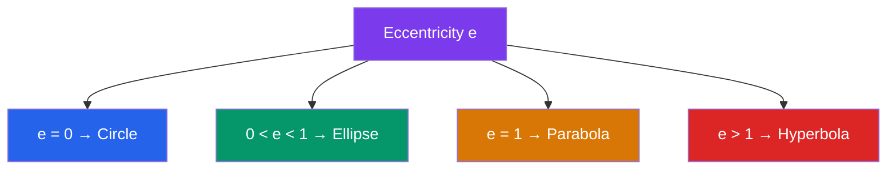

# 📐 Conic Sections

> [!abstract] TL;DR
> Conic sections are the curves formed by slicing a double cone with a plane: circle, ellipse, parabola, and hyperbola. Each shape has elegant algebraic equations and profound physical applications — from planetary orbits (ellipses) to satellite dishes (parabolas) to navigation systems (hyperbolas).

## Intuition — analogy FIRST

Imagine holding an ice cream cone (double cone — two cones tip-to-tip). If you slice it with a flat knife, the cut edge is a conic section. Tilt the knife slightly and you get an ellipse. Hold it parallel to the cone's side and you trace a parabola. Tilt it even more steeply so it cuts both halves of the double cone, and you get a hyperbola. A horizontal cut gives a circle. The same four shapes govern orbits, mirrors, and radio antennas.

---

## How It Works

## Key Concepts / Details

### Generation and Degenerate Cases
A conic is the intersection of a **double right circular cone** with a plane. Degenerate cases (plane passes through the apex): a point, a single line, or two intersecting lines.

### Circle
Standard form centred at $(h, k)$:
$$(x-h)^2 + (y-k)^2 = r^2$$
General form: $x^2 + y^2 + Dx + Ey + F = 0$. Complete the square to find centre $\left(-\tfrac{D}{2}, -\tfrac{E}{2}\right)$ and radius $r = \tfrac{1}{2}\sqrt{D^2+E^2-4F}$.

### Parabola
A parabola is the set of points equidistant from a fixed point (**focus**) and a fixed line (**directrix**).

**Standard forms** (vertex at origin):
- Opens right: $y^2 = 4px$; focus $F=(p,0)$; directrix $x = -p$
- Opens up: $x^2 = 4py$; focus $F=(0,p)$; directrix $y = -p$

**General form** (vertical axis): $y = ax^2 + bx + c$
- Vertex at $\left(-\tfrac{b}{2a},\ f\!\left(-\tfrac{b}{2a}\right)\right)$
- $a > 0$: opens up; $a < 0$: opens down

**Reflective property**: any ray parallel to the axis of a parabolic mirror reflects through the focus — the basis of satellite dishes, headlights, and telescope mirrors.

### Ellipse
An ellipse is the set of points where the **sum of distances** to two fixed points (foci) is constant $= 2a$.

**Standard form** (foci on $x$-axis, $a > b > 0$):
$$\frac{x^2}{a^2} + \frac{y^2}{b^2} = 1$$
- Semi-major axis $a$, semi-minor axis $b$
- Foci at $(\pm c, 0)$ where $c^2 = a^2 - b^2$
- Eccentricity $e = \tfrac{c}{a}$, $\; 0 < e < 1$
- Area $= \pi ab$

**Key identity**: $\sqrt{c^2+b^2} = a$ — any point on the ellipse satisfies $r_1 + r_2 = 2a$ where $r_1, r_2$ are distances to the two foci.

### Hyperbola
A hyperbola is the set of points where the **difference of distances** to two foci is constant $= 2a$.

**Standard form** (foci on $x$-axis):
$$\frac{x^2}{a^2} - \frac{y^2}{b^2} = 1$$
- Foci at $(\pm c, 0)$ where $c^2 = a^2 + b^2$
- Eccentricity $e = \tfrac{c}{a} > 1$
- Asymptotes: $y = \pm\tfrac{b}{a}x$ (the hyperbola approaches but never crosses these lines)
- Conjugate hyperbola (foci on $y$-axis): $\tfrac{y^2}{a^2} - \tfrac{x^2}{b^2} = 1$

### General Second-Degree Curve
$$Ax^2 + Bxy + Cy^2 + Dx + Ey + F = 0$$

**Discriminant** $\Delta = B^2 - 4AC$:
- $\Delta < 0$: ellipse (or circle if $A=C$, $B=0$)
- $\Delta = 0$: parabola
- $\Delta > 0$: hyperbola

To eliminate the $xy$ term, rotate axes by angle $\theta$ where $\cot 2\theta = \tfrac{A-C}{B}$.

### Polar Form (Unified Equation)
All conics can be written in polar form with a focus at the origin:
$$r = \frac{ed}{1 - e\cos\theta}$$
where $e$ is eccentricity and $d$ is the distance from focus to directrix. Setting $e = 0, 0{<}e{<}1, e=1, e>1$ gives circle, ellipse, parabola, hyperbola respectively.

### Summary Table
| Conic | Equation | Eccentricity | Special property |
|-------|----------|-------------|-----------------|
| Circle | $(x-h)^2+(y-k)^2=r^2$ | $e=0$ | All points equidistant from centre |
| Ellipse | $x^2/a^2+y^2/b^2=1$ | $0<e<1$ | $r_1+r_2=2a$ |
| Parabola | $x^2=4py$ | $e=1$ | Equidistant from focus and directrix |
| Hyperbola | $x^2/a^2-y^2/b^2=1$ | $e>1$ | $|r_1-r_2|=2a$ |

---

## Real-World Notes
- **Kepler's first law**: every planet orbits the Sun in an ellipse, with the Sun at one focus — the foundational result of celestial mechanics.
- **Parabolic mirrors and dishes**: satellite TV dishes and telescope mirrors are paraboloids; parallel signals from space are focused at the single focal point.
- **Hyperbolic navigation (LORAN)**: ships and aircraft used the constant difference-of-distances property of hyperbolas to triangulate position from radio beacons.
- **Cooling towers**: nuclear and industrial cooling towers are shaped as hyperboloids (rotated hyperbola) — structurally strong with minimal material.

---

## Common Pitfalls
- **Forgetting which axis has the larger denominator**: in the ellipse $x^2/a^2 + y^2/b^2 = 1$, the major axis is along $x$ when $a > b$ and along $y$ when $b > a$; always identify which is larger.
- **Hyperbola: $c^2 = a^2 + b^2$, not $a^2 - b^2$**: the relationship is reversed relative to the ellipse because the foci are farther out than $a$.
- **Confusing asymptotes with the hyperbola**: asymptotes are lines the hyperbola approaches; they are never actually touched or crossed.
- **Eccentricity of a circle**: a circle is an ellipse with $e = 0$ (both foci coincide with the centre) — it is not a separate case outside the conic family.

---

## Related Concepts
- [[_MOC_Geometry|↑ Section MOC]]
- [[Euclidean_Geometry]] — foundational geometry underlying conic definitions
- [[Coordinate_Geometry]] — algebraic framework for deriving and working with conic equations
- [[Projective_Geometry]] — all conics are projectively equivalent (one can be mapped to another)

---

## Review Questions
1. Derive the equation of an ellipse from its focus-directrix definition (sum of distances to two foci equals $2a$).
2. A parabolic mirror has its focus at $(0, 3)$. Write its equation and state the directrix. Where should a light source be placed to produce a parallel beam?
3. Classify each conic and find its key features: (a) $9x^2 + 4y^2 = 36$; (b) $y^2 - 4x^2 = 16$; (c) $x^2 - 6x + 8y + 1 = 0$.

---

## Sources
- Stewart, J., *Calculus*, §10.5–10.6
- Anton, H., *Calculus*, Conic Sections chapter
- Kendig, K., *Conics*, MAA, 2005

#conic-sections #parabola #ellipse #hyperbola #eccentricity #analytic-geometry
