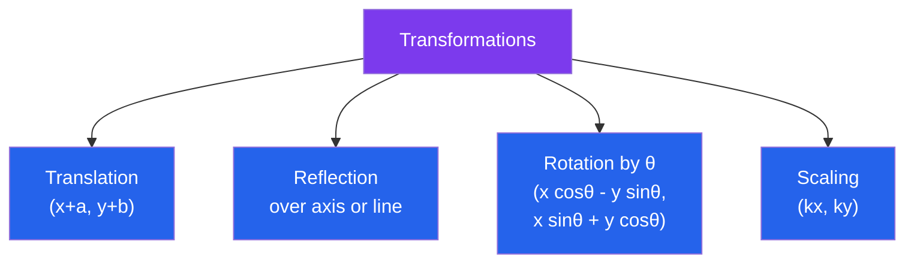

# 📐 Coordinate Geometry

> [!abstract] TL;DR
> Coordinate geometry (analytic geometry) translates geometric shapes and relationships into algebraic equations using a coordinate system. It bridges the visual world of geometry and the computational world of algebra — every shape becomes an equation, every relationship a formula.

## Intuition — analogy FIRST

Imagine giving directions to every point on a city grid using "block number east" and "block number north." That is exactly what coordinates do for geometry: they give every point a unique address $(x, y)$. Once everything has an address, you can use arithmetic and algebra to measure distances, find midpoints, and describe shapes — instead of drawing and measuring with a ruler and compass. René Descartes unified geometry and algebra with this idea in the 17th century.

---

## How It Works

## Key Concepts / Details

### 2D Coordinate System
The **Cartesian plane** assigns each point a pair $(x, y)$ relative to two perpendicular axes.

**Distance formula** between $(x_1, y_1)$ and $(x_2, y_2)$:
$$d = \sqrt{(x_2 - x_1)^2 + (y_2 - y_1)^2}$$

**Midpoint formula**:
$$M = \left(\frac{x_1 + x_2}{2},\ \frac{y_1 + y_2}{2}\right)$$

**Section formula** — point dividing segment $P_1P_2$ in ratio $m:n$ (internally):
$$\left(\frac{mx_2 + nx_1}{m+n},\ \frac{my_2 + ny_1}{m+n}\right)$$

### Lines
**Slope**: $m = \dfrac{y_2 - y_1}{x_2 - x_1}$ (rise over run; undefined for vertical lines).

**Forms of a line**:
- Slope-intercept: $y = mx + c$
- Point-slope: $y - y_1 = m(x - x_1)$
- General: $ax + by + c = 0$

**Parallel lines**: equal slopes ($m_1 = m_2$).
**Perpendicular lines**: $m_1 \cdot m_2 = -1$ (slopes are negative reciprocals).

**Distance from point $(x_0, y_0)$ to line $ax + by + c = 0$**:
$$d = \frac{|ax_0 + by_0 + c|}{\sqrt{a^2 + b^2}}$$

**Angle between two lines** with slopes $m_1$ and $m_2$:
$$\tan\theta = \left|\frac{m_1 - m_2}{1 + m_1 m_2}\right|$$

**Area of triangle** with vertices $(x_1,y_1)$, $(x_2,y_2)$, $(x_3,y_3)$:
$$\text{Area} = \frac{1}{2}\left|x_1(y_2 - y_3) + x_2(y_3 - y_1) + x_3(y_1 - y_2)\right|$$

### Transformations
Transformations map points in the plane to new positions:

| Transformation | Rule | Effect |
|---------------|------|--------|
| Translation | $(x, y) \to (x+a,\ y+b)$ | Shifts by vector $(a, b)$ |
| Reflection over $x$-axis | $(x, y) \to (x, -y)$ | Flips vertically |
| Reflection over $y$-axis | $(x, y) \to (-x, y)$ | Flips horizontally |
| Reflection over $y = x$ | $(x, y) \to (y, x)$ | Swaps coordinates |
| Rotation by $\theta$ | $(x\cos\theta - y\sin\theta,\ x\sin\theta + y\cos\theta)$ | Rotates about origin |
| Uniform scaling | $(x, y) \to (kx, ky)$ | Enlarges/shrinks |

Transformations can be composed (applied one after another); rotation and reflection are **isometries** (preserve distances).

### Locus Problems
A **locus** is the set of all points satisfying a given geometric condition.

**Method**: Let the general point be $(x, y)$, express the condition algebraically, and simplify.

Examples:
- Points equidistant from two fixed points $A$ and $B$ → perpendicular bisector of $AB$ (a line).
- Points equidistant from a fixed point (focus) and a fixed line (directrix) → **parabola** $x^2 = 4py$.
- Points where $PA + PB = k$ (constant, $k > 2c$) → **ellipse**.

### 3D Coordinate Geometry
Extend to triples $(x, y, z)$ in $\mathbb{R}^3$.

**Distance**: $d = \sqrt{(x_2-x_1)^2+(y_2-y_1)^2+(z_2-z_1)^2}$

**Direction cosines** of a line: $\cos\alpha, \cos\beta, \cos\gamma$ (angles with $x$-, $y$-, $z$-axes); satisfy $\cos^2\alpha + \cos^2\beta + \cos^2\gamma = 1$.

**Direction ratios**: any multiples $a:b:c$ of the direction cosines.

**Line in 3D** through $(x_0,y_0,z_0)$ with direction $(a,b,c)$:
- Parametric: $(x_0+at,\ y_0+bt,\ z_0+ct)$
- Symmetric: $\dfrac{x-x_0}{a} = \dfrac{y-y_0}{b} = \dfrac{z-z_0}{c}$

**Plane**: $ax + by + cz = d$; normal vector $\mathbf{n} = (a, b, c)$.

**Distance from point $(x_0,y_0,z_0)$ to plane $ax+by+cz=d$**:
$$\text{dist} = \frac{|ax_0 + by_0 + cz_0 - d|}{\sqrt{a^2+b^2+c^2}}$$

---

## Real-World Notes
- **Computer graphics**: every 2D and 3D transformation in games and CGI is implemented as matrix multiplication on homogeneous coordinates — coordinate geometry made computational.
- **GPS trilateration**: finding a position from distances to three known satellites is a 3D coordinate geometry problem (intersection of three spheres).
- **Robotics**: robot arms use coordinate frames and transformations to plan motion in space.
- **Cartography**: map projections translate spherical coordinates to flat Cartesian coordinates, always introducing distortion.

---

## Common Pitfalls
- **Slope of vertical lines is undefined**: $x = k$ has no slope; never write $m = \infty$ in a formula.
- **Perpendicularity formula breaks when one line is vertical**: if one line is vertical ($m$ undefined) the perpendicular is horizontal ($m = 0$); the formula $m_1 m_2 = -1$ does not apply.
- **Section formula sign**: the internal division formula has a $+$ in the denominator; the external division formula uses a $-$ (point lies outside the segment).
- **Area formula gives signed area**: the formula $\tfrac{1}{2}|x_1(y_2-y_3)+\ldots|$ gives a negative result when vertices are listed clockwise — always take the absolute value.

---

## Related Concepts
- [[_MOC_Geometry|↑ Section MOC]]
- [[Euclidean_Geometry]] — the geometric facts that coordinate geometry makes computational
- [[Conic_Sections]] — circles, ellipses, parabolas, hyperbolas all defined by coordinate equations
- [[Vectors_and_3D_Geometry|Vectors and 3D Geometry (05_Multivariable_Calculus)]] — vectors extend coordinate geometry to higher dimensions
- [[Projective_Geometry]] — adds homogeneous coordinates and points at infinity

---

## Review Questions
1. Find the equation of the line passing through $(3, -2)$ and perpendicular to $2x - 5y + 7 = 0$.
2. A point $P$ moves such that its distance from $A = (0, 0)$ equals its distance from the line $x = 4$. Find the equation of the locus of $P$ and identify the curve.
3. The vertices of a triangle are $A(1,2)$, $B(4,-1)$, $C(-2,3)$. Find: (a) the length of each side, (b) the area using the coordinate formula, (c) the midpoint of $BC$.

---

## Sources
- Calculus: Stewart, J., *Calculus*, Appendix B
- Loney, S.L., *The Elements of Coordinate Geometry*, Macmillan
- NCERT, *Mathematics Class 11*, Ch. 10–12

#coordinate-geometry #analytic-geometry #transformations #locus #3d-geometry
