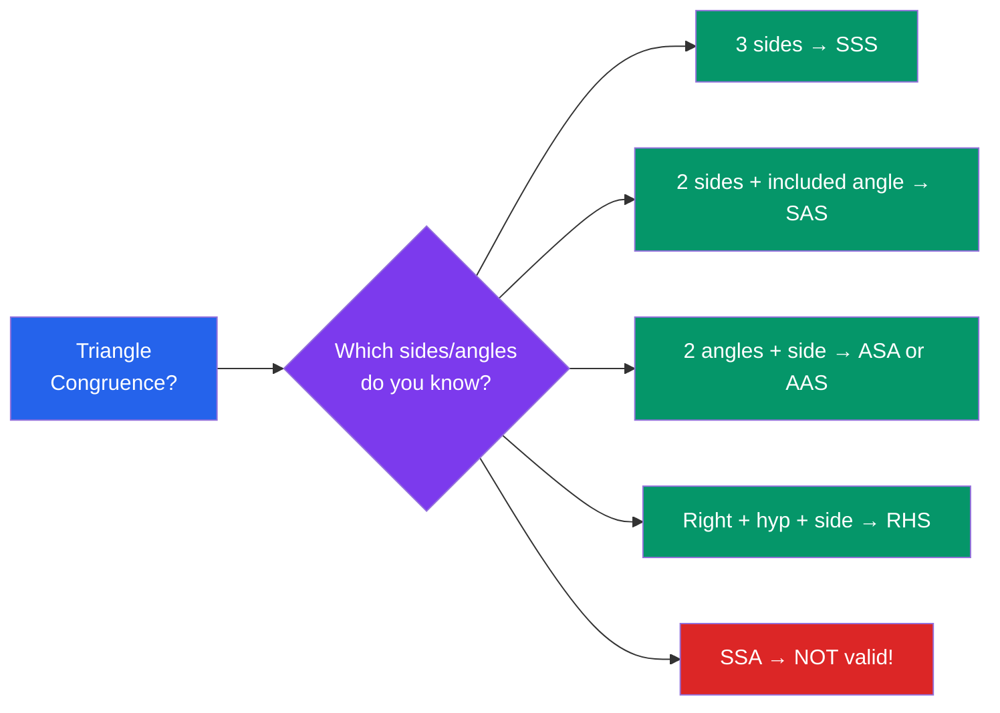

# 📐 Euclidean Geometry

> [!abstract] TL;DR
> Euclidean geometry is the study of shapes, angles, and distances in flat space, governed by Euclid's five postulates. It covers triangles, circles, and polygons using pure logical deduction — the geometry you see in architecture, land surveying, and everyday construction.

## Intuition — analogy FIRST

Think of Euclidean geometry as the rule book for a perfectly flat world — like drawing on an infinitely large, perfectly flat sheet of paper. A carpenter checking whether a corner is a right angle, a surveyor measuring land boundaries, and a student proving two triangles are identical are all doing Euclidean geometry. Everything follows from five simple "starting rules" (postulates), and centuries of results can be derived from them without ever measuring anything physically.

---

## How It Works

## Key Concepts / Details

### Euclid's Five Postulates
1. A straight line can be drawn between any two points.
2. A finite straight line can be extended indefinitely.
3. A circle can be drawn with any centre and radius.
4. All right angles are equal.
5. **(Parallel postulate)** Given a line and a point not on it, exactly one line through the point is parallel to the given line.

The fifth postulate was controversial for over 2000 years — mathematicians tried to prove it from the first four, and failure to do so eventually led to [[Non_Euclidean_Geometry]].

### Angles
- **Acute**: $0° < \theta < 90°$; **Right**: $\theta = 90°$; **Obtuse**: $90° < \theta < 180°$
- **Complementary**: sum $= 90°$; **Supplementary**: sum $= 180°$
- **Vertically opposite angles** (formed by two crossing lines) are always equal.
- **Parallel lines cut by a transversal**: corresponding angles equal; alternate interior angles equal; co-interior (same-side interior) angles supplementary.

### Triangles
**Types by sides**: equilateral ($a=b=c$), isosceles ($a=b$), scalene (all different).
**Types by angles**: acute, right, obtuse.

**Angle sum**: In any triangle, $\alpha + \beta + \gamma = 180°$.

**Exterior angle theorem**: An exterior angle of a triangle equals the sum of the two non-adjacent interior angles.

**Congruence criteria** (triangles are identical in shape and size):
- **SSS**: all three sides equal
- **SAS**: two sides and the included angle equal
- **ASA**: two angles and the included side equal
- **AAS**: two angles and any corresponding side equal
- **RHS**: right angle, hypotenuse, and one side equal

**Similarity criteria** (same shape, possibly different size):
- **AA**: two pairs of angles equal (third follows automatically)
- **SAS**: two sides proportional, included angle equal
- **SSS**: all three sides proportional

If triangles are similar with ratio $k$, their areas scale by $k^2$.

**Pythagoras' theorem**: In a right triangle with hypotenuse $c$,
$$a^2 + b^2 = c^2$$
The converse holds: if $a^2 + b^2 = c^2$ then the angle opposite $c$ is $90°$.

**Special right triangles**:
- **45-45-90**: sides in ratio $1 : 1 : \sqrt{2}$
- **30-60-90**: sides in ratio $1 : \sqrt{3} : 2$

**Triangle inequality**: For any triangle with sides $a, b, c$:
$$|a - b| < c < a + b$$

### Quadrilaterals and Polygons
- **Parallelogram**: opposite sides parallel and equal; opposite angles equal; diagonals bisect each other.
- **Rectangle**: parallelogram with all right angles; diagonals equal.
- **Rhombus**: parallelogram with all sides equal; diagonals perpendicular bisectors of each other.
- **Square**: rectangle + rhombus.
- **Trapezium**: exactly one pair of parallel sides.

**Sum of interior angles of an $n$-gon**: $(n-2) \times 180°$

**Regular polygon**: all sides equal, all angles equal; interior angle $= \frac{(n-2) \times 180°}{n}$.

### Circles
- **Parts**: radius $r$, diameter $d = 2r$, chord, arc, sector, segment, tangent.
- **Thales' theorem**: Angle in a semicircle is $90°$.
- **Inscribed angle theorem**: Angle at centre $= 2 \times$ angle at circumference subtended by same arc.
- **Angles in same segment**: Equal.
- **Tangent-radius**: A tangent to a circle is perpendicular to the radius at the point of contact.
- **Tangent from external point**: Two tangents from an external point to a circle have equal length.
- **Alternate segment theorem**: Angle between tangent and chord = inscribed angle in alternate segment.
- **Power of a point**: For intersecting chords $AB$ and $CD$, $PA \cdot PB = PC \cdot PD$.

### Area and Perimeter Formulas
| Shape | Area | Perimeter |
|-------|------|-----------|
| Triangle | $\tfrac{1}{2}bh$ | $a+b+c$ |
| Triangle (two sides) | $\tfrac{1}{2}ab\sin C$ | — |
| Triangle (Heron's) | $\sqrt{s(s-a)(s-b)(s-c)}$, $s=\tfrac{a+b+c}{2}$ | — |
| Circle | $\pi r^2$ | $2\pi r$ |
| Rectangle | $lw$ | $2(l+w)$ |
| Parallelogram | $bh$ | $2(a+b)$ |

---

## Real-World Notes
- **Architecture**: triangles are the only rigid polygon — roof trusses and bridges use triangular frames for structural stability.
- **Surveying and GPS**: triangulation uses known angles and distances to locate unknown points; GPS trilateration is its modern form.
- **Art and tessellation**: regular polygons tile the plane in exactly three ways (equilateral triangles, squares, regular hexagons) — seen in Islamic geometric art and honeycombs.
- **Construction**: the 3-4-5 right triangle is used to check corners are square without a protractor.

---

## Common Pitfalls
- **Congruence ≠ similarity**: congruent means identical size and shape; similar means same shape, possibly different size.
- **SSA is NOT a valid congruence criterion**: given two sides and a non-included angle, two different triangles can often be constructed (the "ambiguous case").
- **Area scales as the square of the linear ratio**: if two similar figures have corresponding lengths in ratio $k$, their areas are in ratio $k^2$ — not $k$.
- **Exterior angle of a polygon vs. exterior angle of a triangle**: the exterior angle of a triangle equals the sum of remote interior angles; for a polygon, the sum of all exterior angles is always $360°$.

---

## Related Concepts
- [[_MOC_Geometry|↑ Section MOC]]
- [[Coordinate_Geometry]] — applies algebraic coordinates to Euclidean geometry
- [[Conic_Sections]] — circles and ellipses arise naturally in Euclidean settings
- [[Non_Euclidean_Geometry]] — what happens when the parallel postulate is changed
- [[Trigonometry|Trigonometry (01_Pre_Calculus)]] — sine, cosine, tangent built on right triangles

---

## Review Questions
1. State the four valid triangle congruence criteria and explain why SSA (side-side-angle) fails to be one of them.
2. Prove that the angle at the centre of a circle is twice the inscribed angle subtending the same arc.
3. Using Heron's formula, find the area of a triangle with sides 7, 8, and 9. Verify using the $\tfrac{1}{2}bh$ formula.

---

## Sources
- Euclid, *Elements*, Books I–IV
- Coxeter, H.S.M., *Introduction to Geometry*, Wiley, 1969
- NCERT, *Mathematics Class 9 & 10*, Ch. 5–10

#euclidean-geometry #triangles #circles #polygons #congruence #similarity
