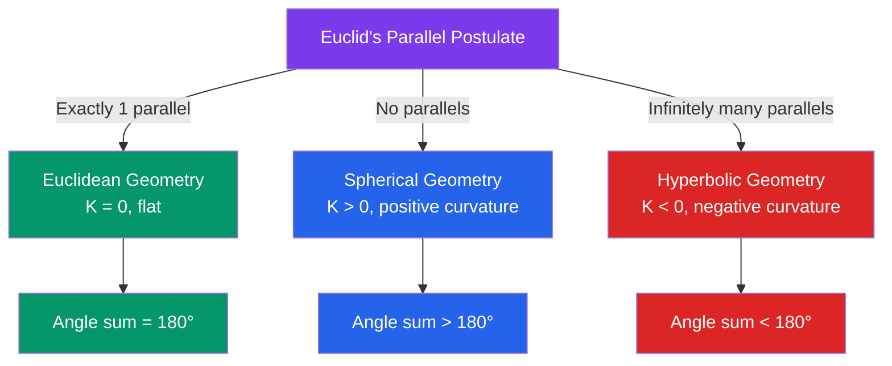

# 📐 Non-Euclidean Geometry

> [!abstract] TL;DR
> Non-Euclidean geometry abandons Euclid's parallel postulate and replaces it with alternatives, yielding geometries that are internally consistent but behave differently from flat space. Spherical geometry (positive curvature) and hyperbolic geometry (negative curvature) are the two classical cases — and general relativity tells us the universe itself is non-Euclidean.

## Intuition — analogy FIRST

Draw a triangle on a flat table — its angles sum to exactly 180°. Now draw one on a globe (use great circle arcs): the angles sum to *more* than 180°. Draw one on a saddle shape: the angles sum to *less* than 180°. The table, globe, and saddle illustrate the three geometries — flat (Euclidean), spherical (positive curvature), and hyperbolic (negative curvature). None is "wrong"; they describe spaces with different shapes. Our universe, bent by gravity, is the most consequential example.

---

## How It Works

## Key Concepts / Details

### The Parallel Postulate Problem
Euclid's fifth postulate: "Given a line $\ell$ and a point $P$ not on $\ell$, there exists exactly one line through $P$ parallel to $\ell$."

For 2000 years mathematicians tried to deduce this from the other four postulates. Saccheri (1733) and Lambert (1786) made extensive but inconclusive attempts. In the early 19th century, **Gauss**, **Bolyai**, and **Lobachevsky** independently realised it is *independent* — both negations lead to consistent geometries. The parallel postulate is a **choice**, not a logical necessity.

### Spherical Geometry
The geometry of the sphere $S^2$ of radius $R$.

**"Lines"** = great circles (circles with the same centre and radius as the sphere; geodesics = shortest paths).

**Key facts**:
- Any two great circles intersect in exactly two antipodal points — **no parallel lines**.
- Triangle angle sum $> 180°$; **Girard's theorem**: $\alpha + \beta + \gamma = \pi + \tfrac{A}{R^2}$, where $A$ is the area of the triangle.
- Spherical law of cosines: $\cos a = \cos b \cos c + \sin b \sin c \cos A$, where $a, b, c$ are arc-lengths of sides (divided by $R$).

**Applications**: airline great-circle routes are shortest paths on the Earth; longitude/latitude navigation; the night sky is a sphere.

### Hyperbolic Geometry
Geometry of constant negative curvature $K < 0$. Triangle angle sum $< 180°$; the **angle deficit** $= \pi - (\alpha+\beta+\gamma) = |K| \cdot A$.

**Infinitely many parallels**: through any point, infinitely many lines are parallel to a given line.

**Two standard models**:

**1. Poincaré Disk Model**
- The hyperbolic plane = the open unit disk $\{(x,y) : x^2+y^2 < 1\}$.
- "Lines" = diameters and arcs of circles that meet the boundary disk at right angles.
- Metric: $ds^2 = \dfrac{4(dx^2+dy^2)}{(1-x^2-y^2)^2}$
- Angles are measured in the usual Euclidean way (the model is **conformal**).
- Escher's "Circle Limit" woodcuts visualise the Poincaré disk.

**2. Upper Half-Plane Model**
- Hyperbolic plane = $\mathbb{H} = \{(x,y) \in \mathbb{R}^2 : y > 0\}$.
- Metric: $ds^2 = \dfrac{dx^2 + dy^2}{y^2}$
- "Lines" = vertical lines and semicircles with centre on the $x$-axis.
- Distance from $(x_1,y_1)$ to $(x_2,y_2)$: $\cosh^{-1}\!\left(1 + \dfrac{(x_2-x_1)^2+(y_2-y_1)^2}{2y_1 y_2}\right)$

**Hyperbolic trigonometry**: the standard identities with $\sin, \cos$ replaced by $\sinh, \cosh$:
$$\cosh c = \cosh a \cosh b - \sinh a \sinh b \cos C$$

**Distance grows exponentially**: circles of radius $r$ in hyperbolic space have circumference $2\pi \sinh r \approx \pi e^r$, not $2\pi r$ — the plane "opens up" much faster than flat space.

### Gaussian Curvature $K$
For a surface in $\mathbb{R}^3$, Gaussian curvature at a point is $K = \kappa_1 \kappa_2$ (product of principal curvatures).

| Surface | $K$ | Geometry |
|---------|-----|---------|
| Flat plane | 0 | Euclidean |
| Sphere radius $R$ | $1/R^2 > 0$ | Spherical |
| Saddle (hyperbolic paraboloid) | $< 0$ | Hyperbolic |

**Gauss's Theorema Egregium** ("Remarkable Theorem", 1827): $K$ is an **intrinsic** property — it can be measured entirely from within the surface (via distances), without reference to the ambient $\mathbb{R}^3$. This means no flat map can perfectly represent a sphere — every map projection distorts.

### Gauss-Bonnet Theorem
For a compact surface $M$ with boundary $\partial M$:
$$\iint_M K\, dA + \oint_{\partial M} \kappa_g\, ds = 2\pi \chi(M)$$
where $\kappa_g$ is the geodesic curvature of the boundary and $\chi(M)$ is the Euler characteristic. This deep result connects differential geometry to topology.

For a geodesic triangle: $\alpha + \beta + \gamma - \pi = \iint_{\triangle} K\, dA$ (angle excess = integral of curvature).

### Connection to Physics
- **General relativity**: spacetime is a 4D Lorentzian manifold; gravity is the curvature of spacetime. Einstein's field equations $G_{\mu\nu} = 8\pi T_{\mu\nu}$ relate curvature to energy-momentum.
- **Physical test**: Eddington's 1919 solar eclipse observation measured light bending around the Sun, confirming spacetime curvature ($\approx 1.75''$ deflection).
- **Hyperbolic geometry in special relativity**: the space of relativistic velocities has hyperbolic geometry; "rapidity" is the hyperbolic analog of angle.

---

## Real-World Notes
- **GPS corrections**: GPS satellites must account for both special-relativistic time dilation (moving clocks run slow) and general-relativistic time dilation (clocks in weaker gravity run faster). Without these curved-spacetime corrections, GPS would drift by ~10 km/day.
- **Poincaré embeddings in machine learning**: hierarchical data (trees, taxonomies) embeds with low distortion in the hyperbolic plane because hyperbolic space expands exponentially — matching tree-structure growth.
- **Great-circle navigation**: the shortest flight from New York to London arcs over the Atlantic, not along a latitude line — because the Earth's surface is spherical, not flat.
- **Cosmology**: measuring whether the universe is flat ($K=0$), spherical ($K>0$), or hyperbolic ($K<0$) is an active area; current evidence suggests $K \approx 0$.

---

## Common Pitfalls
- **Non-Euclidean does not mean "wrong"**: spherical and hyperbolic geometries are internally consistent axiomatic systems; they just use a different parallel postulate. The geometry that applies in a given context depends on the physical space being modelled.
- **Hyperbolic models look "distorted" in Euclidean drawings**: the Poincaré disk appears to squish things near the boundary, but all points are equidistant from the "center" in hyperbolic distance. The model is a faithful representation, just not isometric.
- **The sphere $S^2$ is not the same as hyperbolic space**: they are both non-Euclidean but with opposite curvature signs — confusing them reverses the angle-sum inequality.
- **Theorema Egregium does not mean you can bend a plane into a sphere**: it means curvature is intrinsic, not that all zero-curvature surfaces are the same; bending a flat sheet gives a cylinder (still $K=0$), not a sphere.

---

## Related Concepts
- [[_MOC_Geometry|↑ Section MOC]]
- [[Euclidean_Geometry]] — the flat baseline from which non-Euclidean geometries diverge
- [[Projective_Geometry]] — projective geometry is related to spherical geometry (both have no parallel lines); elliptic geometry is projective geometry with a metric
- [[Differential_Geometry|Differential Geometry (14_Advanced_Topics)]] — Riemannian manifolds generalise all three geometries

---

## Review Questions
1. Prove that in spherical geometry of radius $R$, the area of a spherical triangle with angles $\alpha, \beta, \gamma$ is $R^2(\alpha + \beta + \gamma - \pi)$.
2. Describe the two models of hyperbolic geometry (Poincaré disk and upper half-plane). What do "straight lines" (geodesics) look like in each model?
3. State the Theorema Egregium. Explain why it implies that no perfect flat map of the Earth's surface can exist.

---

## Sources
- Greenberg, M.J., *Euclidean and Non-Euclidean Geometries*, W.H. Freeman, 4th ed.
- Anderson, J.W., *Hyperbolic Geometry*, Springer, 2nd ed., 2005
- Misner, Thorne & Wheeler, *Gravitation*, W.H. Freeman, 1973 (Ch. 1–2 for GR connection)

#non-euclidean-geometry #hyperbolic-geometry #spherical-geometry #curvature #gaussian-curvature #gauss-bonnet
