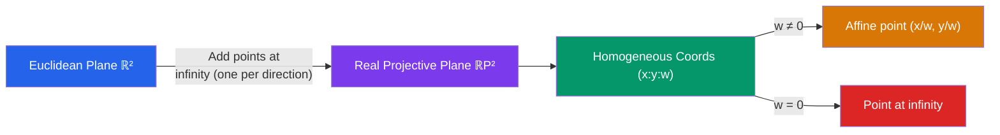

# 📐 Projective Geometry

> [!abstract] TL;DR
> Projective geometry extends Euclidean geometry by adding "points at infinity" where parallel lines meet, eliminating exception cases and revealing deep symmetries. It is the natural geometry of cameras, perspective drawing, and image transformations, governed by homogeneous coordinates and the powerful duality principle.

## Intuition — analogy FIRST

Stand on a long straight road and look toward the horizon. The two edges of the road appear to converge at a single vanishing point — parallel lines seemingly meet. Renaissance artists discovered this "meeting at infinity" to draw realistic perspective. Projective geometry makes this rigorous: parallel lines *do* meet, at a well-defined "point at infinity," and these points are just as ordinary as any other point. The result is a geometry with no exceptions — any two distinct lines meet in exactly one point, full stop.

---

## How It Works

## Key Concepts / Details

### The Real Projective Plane $\mathbb{RP}^2$
$\mathbb{RP}^2$ can be defined in two equivalent ways:
1. **Lines through origin in $\mathbb{R}^3$**: each such line is a "projective point." Two vectors represent the same projective point iff they are scalar multiples.
2. **$\mathbb{R}^2$ plus a "line at infinity"**: for each direction in $\mathbb{R}^2$, add one point at infinity; all parallel lines in that direction share it.

**Homogeneous coordinates**: a point is written $(x : y : w)$ with $(x:y:w) = (\lambda x : \lambda y : \lambda w)$ for any $\lambda \neq 0$.
- Affine point $(a, b) \leftrightarrow (a : b : 1)$
- Point at infinity in direction $(u, v)$: $(u : v : 0)$

**Converting back**: $(x : y : w) \mapsto (x/w,\ y/w)$ when $w \neq 0$.

**Lines in homogeneous coordinates**: a line $ax + by + c = 0$ is represented by the coefficient triple $[a : b : c]$. A point $(x:y:w)$ lies on line $[a:b:c]$ iff $ax + by + cw = 0$.

### The Duality Principle
In projective geometry, every true statement remains true when "point" and "line" are swapped throughout.

| Statement | Dual statement |
|-----------|---------------|
| Two points determine a unique line | Two lines determine a unique point |
| A point lies on a line | A line passes through a point |
| Collinear points | Concurrent lines |

This is *not* merely a curiosity — it cuts proof effort in half: prove a theorem, get its dual for free.

### Projective Transformations (Homographies)
A **homography** is a bijection $\mathbb{RP}^2 \to \mathbb{RP}^2$ given by an invertible $3 \times 3$ matrix:
$$\begin{pmatrix}x'\\y'\\w'\end{pmatrix} = M \begin{pmatrix}x\\y\\w\end{pmatrix}, \quad \det M \neq 0$$

Homographies preserve:
- **Incidence**: if a point lies on a line, its image lies on the image line.
- **Cross-ratio** (see below).
- The entire projective structure.

They do NOT generally preserve distances, angles, or parallelism.

### The Cross-Ratio
Given four collinear points $A, B, C, D$ with coordinates $a, b, c, d$ on a line:
$$(A, B; C, D) = \frac{AC \cdot BD}{BC \cdot AD}$$

The cross-ratio is the fundamental projective invariant — it is preserved by all homographies. When $(A, B; C, D) = -1$, the four points form a **harmonic range**, important in classical projective geometry.

### Key Theorems

**Desargues' Theorem**: Two triangles $ABC$ and $A'B'C'$ are *in perspective from a point* (lines $AA'$, $BB'$, $CC'$ are concurrent) if and only if they are *in perspective from a line* (the three intersection points of corresponding sides are collinear).

**Pappus' Theorem**: If $A, B, C$ lie on one line and $A', B', C'$ lie on another line, then the points $AB' \cap A'B$, $AC' \cap A'C$, $BC' \cap B'C$ are collinear.

**Pascal's Theorem**: If a hexagon is inscribed in a conic section, then the three pairs of opposite sides meet in collinear points (the "Pascal line").

### Projective Space $\mathbb{RP}^n$
- $\mathbb{RP}^n$ = equivalence classes of nonzero vectors in $\mathbb{R}^{n+1}$ under scalar multiplication.
- $\mathbb{RP}^1$ (projective line) is topologically a **circle**: add one point at infinity to the real line, which "wraps around."
- $\mathbb{RP}^2$ is not orientable (like the Möbius strip, but in 2D).
- Connects to linear algebra: projective geometry is essentially the geometry of vector spaces modulo scaling.

---

## Real-World Notes
- **Computer vision (camera model)**: a camera maps 3D world points to 2D image pixels via a projective transformation — the fundamental equation of photogrammetry and structure-from-motion.
- **Image stitching and homography**: aligning photos for panoramas uses a $3\times3$ homography matrix estimated from point correspondences, mapping one image plane to another.
- **Perspective art**: Renaissance painters discovered the vanishing point and projection rules; projective geometry formalises exactly what artists do intuitively.
- **Algebraic geometry**: modern algebraic geometry works in projective space to avoid "missing" intersection points at infinity — Bézout's theorem (two curves of degrees $m, n$ meet in $mn$ points) holds cleanly only in projective space.

---

## Common Pitfalls
- **Points at infinity are not "infinitely far away"**: in $\mathbb{RP}^2$ they are perfectly ordinary projective points — no special status, no metric meaning. The word "infinity" is historical.
- **Duality breaks in Euclidean geometry**: the exact point-line duality holds only in projective geometry; Euclidean geometry distinguishes points and lines and has no clean dual.
- **Homographies are not determined by 3 point correspondences**: a $3\times 3$ homography has 8 degrees of freedom (matrix up to scale); you need **4 point correspondences** (in general position) to determine it uniquely.
- **$\mathbb{RP}^2$ is non-orientable**: you cannot consistently define "clockwise" across all of $\mathbb{RP}^2$, unlike the Euclidean plane.

---

## Related Concepts
- [[_MOC_Geometry|↑ Section MOC]]
- [[Coordinate_Geometry]] — affine coordinates are the "ordinary" part of projective coordinates
- [[Euclidean_Geometry]] — Euclidean geometry embeds in projective geometry; adding a metric recovers it
- [[Non_Euclidean_Geometry]] — both projective and hyperbolic geometries arise from modifying Euclid's axioms
- [[Conic_Sections]] — all conics are projectively equivalent; Pascal's theorem applies to any conic

---

## Review Questions
1. Convert the Euclidean point $(3, 5)$ to homogeneous coordinates. What homogeneous triple represents the point at infinity in the direction of the vector $(2, 1)$?
2. State the duality principle and give the dual of Pappus' theorem.
3. A homography maps the four points $(0,0)$, $(1,0)$, $(0,1)$, $(1,1)$ to $(0,0)$, $(2,0)$, $(0,2)$, $(1,1)$ respectively. Is this possible? (Hint: count degrees of freedom.)

---

## Sources
- Coxeter, H.S.M., *The Real Projective Plane*, Springer, 1993
- Hartley, R. & Zisserman, A., *Multiple View Geometry in Computer Vision*, Cambridge, 2004
- Samuel, P., *Projective Geometry*, Springer, 1988

#projective-geometry #homogeneous-coordinates #duality #homography #cross-ratio
