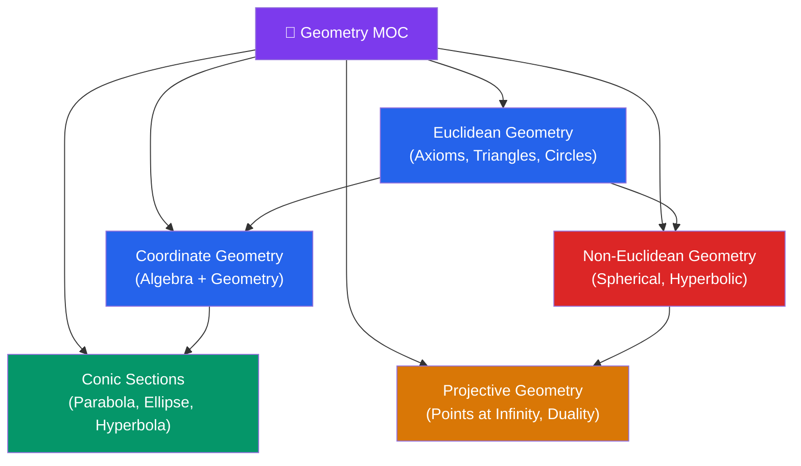

# 📐 Geometry — Map of Content

> [!abstract] About This Section
> Geometry from Euclidean axioms and conic sections through projective and non-Euclidean geometries — from secondary school to the curvature of spacetime. This section covers the full arc of geometric thought: the classical Greek foundations, the algebraic machinery of coordinates, the elegant curves of conics, and the 19th-century revolutions that produced projective and non-Euclidean geometries.

## Notes in This Section

| Note | Topics | Difficulty |
|------|--------|------------|
| [[Euclidean_Geometry]] | Euclid's postulates, triangles (congruence, similarity, Pythagoras), circles (inscribed angles, tangents), polygons, area/perimeter | Beginner |
| [[Coordinate_Geometry]] | Cartesian coordinates, distance & midpoint, lines, transformations (translation, rotation, reflection, scaling), locus, 3D geometry | Beginner |
| [[Conic_Sections]] | Circle, parabola, ellipse, hyperbola; eccentricity; discriminant test; polar form; focus-directrix | Intermediate |
| [[Projective_Geometry]] | Homogeneous coordinates, points at infinity, duality, homographies, cross-ratio, Desargues'/Pappus'/Pascal's theorems | Advanced |
| [[Non_Euclidean_Geometry]] | Parallel postulate, spherical geometry, hyperbolic geometry (Poincaré disk, upper half-plane), Gaussian curvature, Gauss-Bonnet, general relativity | Advanced |

## Learning Paths

### Secondary / Undergraduate Path
Start here for foundational geometry through standard analytic geometry:

$$\textbf{[[Euclidean_Geometry]]} \;\to\; \textbf{[[Coordinate_Geometry]]} \;\to\; \textbf{[[Conic_Sections]]}$$

- **[[Euclidean_Geometry]]**: master the axioms, triangle congruence/similarity, circle theorems, and area formulas.
- **[[Coordinate_Geometry]]**: learn to translate geometric statements into algebra; cover transformations and 3D lines and planes.
- **[[Conic_Sections]]**: study the four curves, their equations, eccentricities, and applications.

### Advanced / Graduate Path
For students comfortable with linear algebra and real analysis:

$$\textbf{[[Projective_Geometry]]} \;\to\; \textbf{[[Non_Euclidean_Geometry]]}$$

- **[[Projective_Geometry]]**: homogeneous coordinates, the duality principle, homographies, and classical theorems.
- **[[Non_Euclidean_Geometry]]**: spherical and hyperbolic geometries, curvature, Gauss-Bonnet, and the connection to general relativity.

Both advanced topics rely on having a solid grounding in Euclidean and Coordinate Geometry.

## Cross-Section Links

- **[[Trigonometry|Trigonometry (01_Pre_Calculus)]]** — sine, cosine, tangent are defined on right triangles from Euclidean Geometry; trigonometric identities underpin conic and coordinate calculations.
- **[[Vectors_and_3D_Geometry|Vectors and 3D Geometry (05_Multivariable_Calculus)]]** — vectors extend Coordinate Geometry into higher dimensions; dot and cross products give distances and angles in $\mathbb{R}^n$.
- **[[Differential_Geometry|Differential Geometry (14_Advanced_Topics)]]** — the natural continuation after Non-Euclidean Geometry; Riemannian manifolds generalise curvature to arbitrary dimensions, underpinning general relativity.

## Key Themes Across This Section

| Theme | Notes |
|-------|-------|
| Axiomatic foundations | [[Euclidean_Geometry]], [[Non_Euclidean_Geometry]] |
| Algebraic representation | [[Coordinate_Geometry]], [[Conic_Sections]], [[Projective_Geometry]] |
| Curvature and space | [[Non_Euclidean_Geometry]], → Differential Geometry |
| Physical applications | [[Conic_Sections]] (orbits), [[Non_Euclidean_Geometry]] (GR/GPS), [[Projective_Geometry]] (cameras) |
| Invariants and symmetry | [[Projective_Geometry]] (cross-ratio), [[Non_Euclidean_Geometry]] (isometries) |

#geometry #moc #mathematics
