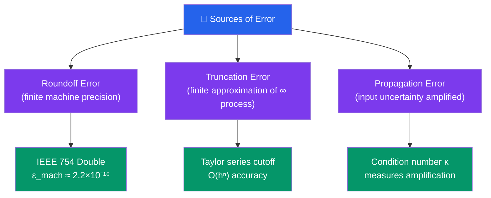

# 🔢 Error Analysis and Floating-Point Arithmetic

> [!abstract] TL;DR
> Every computer calculation introduces small errors — from how numbers are stored (roundoff) and from approximating infinite processes with finite ones (truncation). Understanding how these errors arise, compound, and can be controlled is the foundation of reliable numerical computing.

## Intuition — analogy FIRST

Imagine measuring a room with a ruler that only shows centimetres, then using that measurement in a chain of calculations. Each step carries a tiny inaccuracy, and at some steps — like subtracting nearly identical measurements — those inaccuracies explode. Floating-point arithmetic is exactly this: computers store numbers with fixed precision, and certain operations amplify the hidden errors catastrophically. Good numerical analysts are detectives who track these errors before they ruin answers.

---

## How It Works

---

## Key Concepts

### 1. Roundoff Error and IEEE 754

A computer stores a real number as a **floating-point** value: $\pm(1.b_1 b_2 \ldots b_{52}) \times 2^e$, where the 52-bit mantissa gives roughly 15–16 significant decimal digits. The key constant is **machine epsilon**:

$$\varepsilon_{\text{mach}} \approx 2.2 \times 10^{-16}$$

This is the smallest number such that $1 + \varepsilon_{\text{mach}} > 1$ in double precision. Any real number $x$ is stored as $\text{fl}(x) = x(1 + \delta)$ where $|\delta| \leq \varepsilon_{\text{mach}}$.

### 2. Truncation Error

Numerical algorithms approximate infinite processes. For example, the exponential is defined by an infinite series:

$$e^x = 1 + x + \frac{x^2}{2!} + \frac{x^3}{3!} + \cdots$$

Stopping after $n$ terms introduces a **truncation error** of $O(x^{n+1}/(n+1)!)$. For numerical differentiation: $f'(x) \approx (f(x+h) - f(x))/h$ has truncation error $O(h)$ from cutting the Taylor series.

### 3. Catastrophic Cancellation

Subtracting two nearly equal floating-point numbers **destroys significant digits**. Example:

$$x = 1.000001, \quad x - 1 = 0.000001$$

If $x$ is stored with roundoff error in its last digit, then $x - 1$ may have only 1 correct digit out of the 7 we started with — 6 digits are lost.

**Classic fix — quadratic formula**: for the small root, instead of $x = (-b + \sqrt{b^2 - 4ac})/(2a)$, use the algebraically equivalent:

$$x = \frac{-2c}{b + \sqrt{b^2 - 4ac}}$$

This avoids subtracting two nearly equal numbers when $|b| \approx \sqrt{b^2-4ac}$.

### 4. Condition Number

The **condition number** of a problem measures how much output error is amplified relative to input error:

$$\kappa = \frac{\text{relative output error}}{\text{relative input error}}$$

For a matrix equation $Ax = b$:

$$\kappa(A) = \|A\| \cdot \|A^{-1}\| = \frac{\sigma_{\max}}{\sigma_{\min}}$$

If $\kappa(A) \approx 10^k$, you lose roughly $k$ decimal digits of accuracy in the solution.

> [!tip] Forward vs Backward Error
> - **Forward error**: how far is the computed answer from the true answer? $\|x - \hat{x}\|$
> - **Backward error**: how much would you need to perturb the *input* to make your computed answer exact? Often small backward error is achievable even when forward error is large.

### 5. Big-O Order of Accuracy

Methods are compared by how fast their error shrinks as step size $h \to 0$:

| Method | Order | Error rate |
|---|---|---|
| Euler's method | $O(h)$ | halve $h$ → halve error |
| Trapezoid rule | $O(h^2)$ | halve $h$ → quarter error |
| Simpson's rule / RK4 | $O(h^4)$ | halve $h$ → 1/16 error |
| Gaussian quadrature | exponential | depends on smoothness |

Higher order costs more per step but can achieve target accuracy with far fewer steps.

---

## Real-World Notes

- **Patriot missile failure (1991)**: a clock register accumulated roundoff error in a 24-bit integer time counter; after 100 hours of operation the accumulated error was 0.34 seconds, causing the missile battery to miss an incoming Scud — 28 soldiers killed.
- **Vancouver Stock Exchange (1982)**: the index was truncated (not rounded) after each of thousands of daily transactions; the index drifted from a true value of ~1098 down to 520 over 22 months before the error was discovered.
- **Weather prediction**: atmospheric models are chaotic — small floating-point errors in initial conditions grow exponentially, limiting useful forecast horizon to ~2 weeks regardless of resolution.

---

## Common Pitfalls

- **More bits ≠ more accuracy**: if the problem is ill-conditioned ($\kappa \gg 1$), even quadruple precision will give wrong answers. Fix the algorithm or reformulate the problem.
- **Never subtract nearly equal floating-point numbers** without first checking whether algebraic rearrangement avoids the cancellation.
- **Confusing absolute and relative error**: for tiny quantities, a large relative error may be hidden by a small absolute error — always report both.
- **Mixing truncation and roundoff**: decreasing $h$ reduces truncation error but eventually *increases* total error because roundoff in the function evaluations dominates. There is an optimal $h \approx \sqrt{\varepsilon_{\text{mach}}}$.

---

## Related Concepts

- [[_MOC_Numerical_Methods|↑ Section MOC]]
- [[Root_Finding]] — convergence analysis relies on understanding error orders
- [[Numerical_Integration]] — truncation error analysis for quadrature rules
- [[Numerical_Linear_Algebra]] — condition number critical for linear system accuracy
- [[Numerical_ODEs_and_PDEs]] — stability and truncation error interplay

---

## Review Questions

1. What is machine epsilon $\varepsilon_{\text{mach}}$ and why does it set the floor for floating-point relative error?
2. Explain why computing $\sqrt{x+1} - \sqrt{x}$ for large $x$ is numerically dangerous, and give an equivalent formula that avoids cancellation.
3. A matrix has condition number $\kappa(A) = 10^8$ and you are working in double precision ($\varepsilon_{\text{mach}} \approx 10^{-16}$). Roughly how many correct digits can you expect in the solution to $Ax = b$?
4. Why is there an optimal step size $h$ for finite-difference approximations, and what happens for $h$ smaller than optimal?

---

## Sources

- Trefethen & Bau, *Numerical Linear Algebra*, Ch. 1–2
- Higham, *Accuracy and Stability of Numerical Algorithms*, Ch. 2
- Burden & Faires, *Numerical Analysis*, Ch. 1

#numerical-methods #floating-point #error-analysis #mathematics
