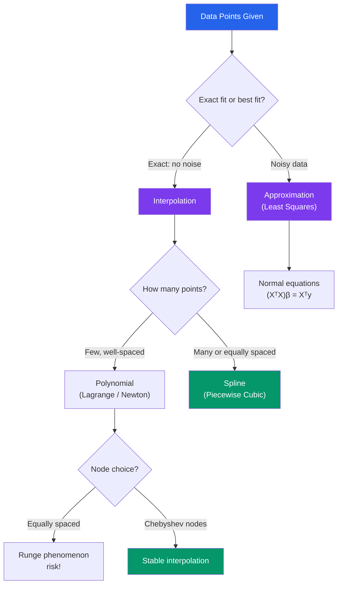

# 🔢 Interpolation and Approximation

> [!abstract] TL;DR
> Interpolation finds a function that passes exactly through given data points; approximation finds the best fit when data is noisy. Polynomial interpolation is elegant in theory but numerically dangerous at high degree — splines and Chebyshev nodes solve this. Least squares connects approximation to linear regression.

## Intuition — analogy FIRST

Interpolation is like connecting stars in a constellation: you draw a unique curve through every point. But with too many stars, the curve starts squiggling wildly between them — that's Runge's phenomenon. Splines are the solution: instead of one big bendy curve, use many short, smooth pieces joined carefully at the joints. Approximation (least squares) is different — it's like drawing the best-fit line through noisy data where exact passage through every point would be over-fitting.

---

## How It Works

---

## Key Concepts

### 1. Polynomial Interpolation

Given $n+1$ points $(x_0, y_0), \ldots, (x_n, y_n)$ with distinct $x_i$, there is a **unique polynomial** $P$ of degree $\leq n$ passing through all of them.

**Lagrange form**:

$$P(x) = \sum_{i=0}^{n} y_i \, L_i(x), \qquad L_i(x) = \prod_{\substack{j=0\\j \neq i}}^{n} \frac{x - x_j}{x_i - x_j}$$

Each $L_i$ is 1 at $x_i$ and 0 at all other $x_j$.

**Newton's divided differences** — more efficient when adding new points:

$$P(x) = f[x_0] + f[x_0, x_1](x - x_0) + f[x_0, x_1, x_2](x-x_0)(x-x_1) + \cdots$$

where the divided differences are computed recursively: $f[x_i, x_{i+1}] = (f[x_{i+1}] - f[x_i])/(x_{i+1} - x_i)$.

**Error bound**: for $f \in C^{n+1}[a,b]$,

$$|f(x) - P(x)| \leq \frac{|\omega_{n+1}(x)|}{(n+1)!} \max_{\xi \in [a,b]} |f^{(n+1)}(\xi)|, \quad \omega_{n+1}(x) = \prod_{i=0}^n (x - x_i)$$

### 2. Runge's Phenomenon

Interpolating $f(x) = 1/(1 + 25x^2)$ on $[-1, 1]$ with **equally spaced** nodes: as $n$ increases, the polynomial oscillates wildly near the endpoints. The error grows even as the polynomial degree grows.

**Solution 1 — Chebyshev nodes**: place nodes at

$$x_k = \cos\!\left(\frac{2k+1}{2n+2}\pi\right), \quad k = 0, 1, \ldots, n$$

These cluster near the endpoints and minimise $\max|\omega_{n+1}(x)|$, eliminating the oscillation.

**Solution 2 — Splines**: use piecewise polynomials instead of one high-degree polynomial.

### 3. Spline Interpolation

A **cubic spline** is a collection of cubic polynomials, one on each interval $[x_i, x_{i+1}]$, joined so that the function and its first two derivatives are continuous at every knot $x_i$.

For $n+1$ data points, this gives $n$ cubics (4 coefficients each = $4n$ unknowns), constrained by:
- Continuity of $S$, $S'$, $S''$ at $n-1$ interior knots (gives $3(n-1)$ equations)
- Interpolation at all $n+1$ points ($n+1$ equations)
- 2 boundary conditions (e.g., **natural spline**: $S''(x_0) = S''(x_n) = 0$)

The resulting tridiagonal linear system can be solved in $O(n)$.

**Accuracy**: cubic splines achieve $O(h^4)$ accuracy for smooth $f$.

### 4. Least Squares Approximation

When data is noisy, exact interpolation over-fits. Instead, minimise:

$$\min_{\beta} \sum_{i=1}^{m} (f(x_i) - y_i)^2$$

For polynomial approximation, this leads to the **normal equations**:

$$X^T X \, \beta = X^T y$$

where $X_{ij} = x_i^{j-1}$ (Vandermonde structure). Using **orthogonal polynomials** (Legendre, Chebyshev) as a basis avoids the ill-conditioning of the Vandermonde matrix.

### 5. Trigonometric Interpolation and DFT

For periodic data, fit sines and cosines. $n$ equally spaced points on $[0, 2\pi)$ are fit exactly by $n/2$ frequencies — this is the **Discrete Fourier Transform**. The FFT computes it in $O(n \log n)$ instead of $O(n^2)$, enabling modern signal processing, image compression, and spectral PDE solvers.

---

## Real-World Notes

- **Image scaling (bicubic interpolation)**: resizing a photo uses cubic splines in 2D; each pixel value is interpolated from its neighbours, giving smooth results without blocky artefacts.
- **Terrain rendering in games**: height maps are stored at discrete grid points; cubic splines reconstruct smooth terrain geometry for rendering.
- **GPS trajectory smoothing**: raw GPS positions have noise; spline fitting reconstructs a smooth plausible path, critical for navigation apps and autonomous vehicles.

---

## Common Pitfalls

- **Interpolation ≠ approximation**: if data is noisy, interpolating exactly through every point captures the noise, not the signal — use least squares instead.
- **High-degree polynomials on equally spaced nodes**: always use Chebyshev nodes or switch to splines for $n > 5$ or so.
- **Cubic splines require a linear solve**: setting up the tridiagonal system has $O(n)$ cost, but it's still a solve — not just evaluating a formula. Forgetting this can surprise you in real-time applications.
- **Extrapolation is unreliable**: any interpolant (polynomial or spline) may behave wildly outside the data range. Never extrapolate without physical justification.

---

## Related Concepts

- [[_MOC_Numerical_Methods|↑ Section MOC]]
- [[Numerical_Integration]] — integration rules are derived from interpolating polynomials
- [[Error_Analysis_and_Floating_Point]] — Runge's phenomenon is an instance of ill-conditioning
- [[Numerical_Linear_Algebra]] — normal equations and solving tridiagonal systems

---

## Review Questions

1. Write out the Lagrange basis polynomials $L_0, L_1, L_2$ for the nodes $x_0 = 0$, $x_1 = 1$, $x_2 = 2$.
2. Why do Chebyshev nodes eliminate Runge's phenomenon? What property of $|\omega_{n+1}(x)|$ do they optimise?
3. A cubic spline on $n+1$ nodes has $4n$ degrees of freedom. Count carefully how the continuity conditions and interpolation conditions combine with boundary conditions to yield a uniquely determined system.
4. Compare polynomial interpolation and least squares for $m$ data points: when would each be appropriate, and what happens to the condition number as the degree $n$ increases toward $m$?

---

## Sources

- Burden & Faires, *Numerical Analysis*, Ch. 3–4
- Trefethen, *Approximation Theory and Approximation Practice*, Ch. 2–5
- Press et al., *Numerical Recipes*, Ch. 3

#numerical-methods #interpolation #approximation #mathematics
