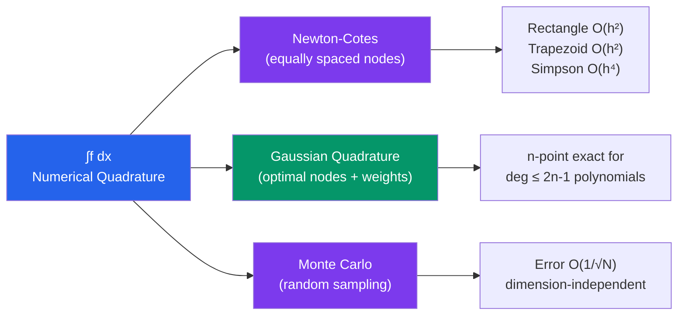

# 🔢 Numerical Integration (Quadrature)

> [!abstract] TL;DR
> When integrals can't be computed analytically, numerical quadrature approximates $\int_a^b f(x)\,dx$ by a weighted sum of function values. Newton-Cotes rules (trapezoid, Simpson) use equally spaced nodes; Gaussian quadrature chooses nodes and weights optimally for much higher accuracy with fewer evaluations.

## Intuition — analogy FIRST

Imagine estimating the area under a curve by covering it with rectangles (Riemann sum), then trapezoids, then parabolic arcs. Each improvement fits the actual curve better, shrinking the error faster as you use more pieces. Gaussian quadrature is the master move: instead of dictating where to sample (equally spaced), it picks the *ideal* sampling points and weights them so that a small number of evaluations give exact results for high-degree polynomials — like knowing exactly which spots on the curve carry the most information.

---

## How It Works

---

## Key Concepts

### 1. Newton-Cotes Formulas

**Midpoint (rectangle) rule**:
$$\int_a^b f(x)\,dx \approx (b-a)\,f\!\left(\frac{a+b}{2}\right), \quad \text{error } O(h^3)$$

**Trapezoid rule**:
$$\int_a^b f(x)\,dx \approx \frac{h}{2}[f(a) + f(b)], \quad h = b-a$$

**Simpson's rule** (fits a parabola through $a$, $m = (a+b)/2$, $b$):
$$\int_a^b f(x)\,dx \approx \frac{h}{6}[f(a) + 4f(m) + f(b)]$$

Simpson's rule is exact for polynomials up to degree 3 (one degree higher than expected — a "super-convergence" effect).

### 2. Composite Rules

Divide $[a, b]$ into $n$ equal subintervals of width $h = (b-a)/n$ and apply a rule on each:

**Composite trapezoid**:
$$\int_a^b f\,dx \approx \frac{h}{2}\left[f(x_0) + 2\sum_{i=1}^{n-1} f(x_i) + f(x_n)\right], \quad \text{error } = -\frac{(b-a)}{12}h^2 f''(\xi)$$

**Composite Simpson** (requires $n$ even):
$$\int_a^b f\,dx \approx \frac{h}{3}\left[f(x_0) + 4f(x_1) + 2f(x_2) + 4f(x_3) + \cdots + f(x_n)\right], \quad \text{error } = -\frac{(b-a)}{180}h^4 f^{(4)}(\xi)$$

| Rule | Global error | Halving $h$ reduces error by |
|---|---|---|
| Composite Midpoint | $O(h^2)$ | factor 4 |
| Composite Trapezoid | $O(h^2)$ | factor 4 |
| Composite Simpson | $O(h^4)$ | factor 16 |
| Gauss-Legendre $n$-pt | $O(h^{2n})$ | factor $2^{2n}$ |

### 3. Richardson Extrapolation and Romberg Integration

If $I(h) = I + Ch^p + O(h^{p+2})$, then combining two estimates cancels the leading error:

$$I_{\text{better}} = \frac{2^p I(h/2) - I(h)}{2^p - 1}$$

**Romberg integration** applies this repeatedly to composite trapezoid estimates, building a triangular table of increasingly accurate results — achieving $O(h^{2k})$ accuracy at row $k$ for smooth $f$.

### 4. Gaussian Quadrature

Choose both **nodes** and **weights** to maximise polynomial exactness. An $n$-point Gauss-Legendre rule is exact for polynomials of degree $\leq 2n - 1$:

$$\int_{-1}^1 f(x)\,dx \approx \sum_{i=1}^n w_i f(x_i)$$

- **Nodes** $x_i$ = roots of the $n$-th Legendre polynomial $P_n(x)$
- **Weights** $w_i$ determined by the orthogonality condition

For a general interval $[a, b]$, change variables: $x = \frac{b-a}{2}t + \frac{a+b}{2}$, $dx = \frac{b-a}{2}dt$.

> [!example] 2-Point Gauss-Legendre
> $x_1 = -1/\sqrt{3}$, $x_2 = 1/\sqrt{3}$, $w_1 = w_2 = 1$.
> Exact for all polynomials of degree $\leq 3$ — better than Simpson (3 nodes) using only 2 evaluations.

### 5. Adaptive Integration

Estimate the error on each subinterval (e.g., by comparing two quadrature rules); subdivide only where the error exceeds a threshold. This concentrates computation where $f$ is most irregular. Python's `scipy.integrate.quad` and MATLAB's `integral` use adaptive Gauss-Kronrod rules.

### 6. Multi-Dimensional Integration

- **Iterated 1D rules**: extend trapezoid/Gaussian to 2D grids — cost grows exponentially with dimension (curse of dimensionality).
- **Monte Carlo integration**: for $d$-dimensional domains, sample $N$ random points $\mathbf{x}_i$ uniformly:

$$\int_\Omega f(\mathbf{x})\,d\mathbf{x} \approx \frac{\text{Vol}(\Omega)}{N} \sum_{i=1}^N f(\mathbf{x}_i), \quad \text{error } O(1/\sqrt{N})$$

The $O(1/\sqrt{N})$ rate is *independent of dimension* — Monte Carlo is the method of choice for $d \geq 10$.

---

## Real-World Notes

- **Finite element analysis**: the stiffness matrix entries $\int \nabla\phi_i \cdot \nabla\phi_j\,dV$ are computed by Gaussian quadrature on each element — millions of such integrals per simulation.
- **Option pricing**: pricing exotic options requires integrating a payoff function over a distribution of future asset prices; Monte Carlo and Gaussian quadrature are both used depending on dimension.
- **Normal distribution CDF**: $\Phi(x) = \int_{-\infty}^x \frac{1}{\sqrt{2\pi}} e^{-t^2/2}\,dt$ has no closed form; numerical quadrature is used in every statistics library.

---

## Common Pitfalls

- **Simpson's rule requires even $n$**: the alternating 4-2-4-2 pattern only works if there are an even number of subintervals (odd number of points). Forgetting this gives the wrong formula.
- **Gaussian quadrature assumes smooth integrands**: if $f$ has a kink or discontinuity inside $[a, b]$, accuracy degrades to $O(h)$. Split the integral at the singularity first.
- **Monte Carlo is slow**: the $O(1/\sqrt{N})$ convergence means you need $100\times$ more samples to gain one extra decimal digit. Use quasi-Monte Carlo (Sobol sequences) to improve the constant but not the rate.
- **Don't apply composite rules across discontinuities**: splitting the domain at jump points is essential; otherwise the error bounds are invalid.

---

## Related Concepts

- [[_MOC_Numerical_Methods|↑ Section MOC]]
- [[Interpolation_and_Approximation]] — Newton-Cotes rules are derived by integrating interpolating polynomials
- [[Error_Analysis_and_Floating_Point]] — understanding $O(h^p)$ error orders
- [[Numerical_ODEs_and_PDEs]] — ODE time-stepping methods use quadrature-like ideas

---

## Review Questions

1. Derive Simpson's rule by integrating the quadratic interpolating polynomial through $f(a)$, $f(m)$, $f(b)$ exactly.
2. Show that the 2-point Gauss-Legendre rule $\int_{-1}^1 f\,dx \approx f(-1/\sqrt{3}) + f(1/\sqrt{3})$ is exact for $f(x) = x^3$.
3. Romberg's method applies Richardson extrapolation to trapezoid estimates. If $T(h) = I - \frac{h^2}{12}f''(\xi)$, write the Romberg combination $R(h/2, h)$ and verify it has error $O(h^4)$.
4. Why does the curse of dimensionality not affect Monte Carlo integration's $O(1/\sqrt{N})$ rate, and when would you prefer Gaussian quadrature over Monte Carlo?

---

## Sources

- Burden & Faires, *Numerical Analysis*, Ch. 4
- Trefethen & Bau, *Numerical Linear Algebra*, Lecture 37
- Press et al., *Numerical Recipes*, Ch. 4

#numerical-methods #numerical-integration #quadrature #mathematics
