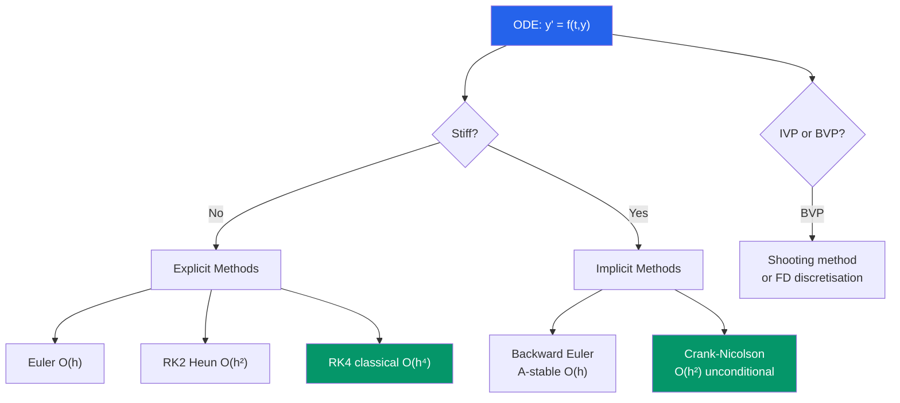

# 🔢 Numerical ODEs and PDEs

> [!abstract] TL;DR
> ODEs are solved numerically by discretising time: Euler's method is first-order and simple; RK4 is the workhorse at fourth-order; implicit methods handle stiff problems. PDEs add spatial discretisation via finite differences or finite elements, and stability requires the CFL condition to be respected.

## Intuition — analogy FIRST

Imagine you're navigating a boat in a river using only a map and a clock. At each tick of the clock, you look at your current position, estimate which direction the current is pushing you (evaluate $f(t,y)$), and take a small step. Euler's method takes one rough step; RK4 is like sampling the current at four strategically chosen sub-points to get a far more accurate step. A *stiff* ODE is a river with violent eddies — you need tiny steps to stay stable unless you use an implicit method that looks ahead as well as back.

---

## How It Works

---

## Key Concepts

### 1. Euler's Method

The simplest time-stepping scheme for $y' = f(t, y)$, $y(t_0) = y_0$:

$$y_{n+1} = y_n + h \cdot f(t_n, y_n)$$

**Local truncation error**: $O(h^2)$ (one step). **Global error**: $O(h)$ — halving $h$ halves the total error.

**Geometric meaning**: follow the tangent (velocity field) at the current point for time $h$.

### 2. Runge-Kutta Methods

RK methods evaluate $f$ at intermediate points to achieve higher accuracy.

**RK2 (Heun's method)**:
$$k_1 = f(t_n, y_n), \quad k_2 = f(t_n + h, \; y_n + h k_1)$$
$$y_{n+1} = y_n + \frac{h}{2}(k_1 + k_2)$$
Global error $O(h^2)$.

**RK4 (classical)**:
$$k_1 = h \cdot f(t_n, y_n)$$
$$k_2 = h \cdot f\!\left(t_n + \tfrac{h}{2},\; y_n + \tfrac{k_1}{2}\right)$$
$$k_3 = h \cdot f\!\left(t_n + \tfrac{h}{2},\; y_n + \tfrac{k_2}{2}\right)$$
$$k_4 = h \cdot f(t_n + h,\; y_n + k_3)$$
$$y_{n+1} = y_n + \frac{k_1 + 2k_2 + 2k_3 + k_4}{6}$$

Global error $O(h^4)$. Four function evaluations per step; the go-to method for smooth non-stiff problems.

> [!info] Local vs Global Error
> A method with local truncation error $O(h^{p+1})$ per step has global error $O(h^p)$ over a fixed time interval. Accumulating $1/h$ steps each contributing $O(h^{p+1})$ gives $O(h^p)$ total.

### 3. Stiffness and Implicit Methods

A system is **stiff** if it contains components with vastly different timescales (e.g., a slow reaction and a fast one in chemistry). Explicit methods require $h \leq C/|\lambda_{\text{fast}}|$ — tiny steps even to capture the slow dynamics.

**Backward Euler** (fully implicit):
$$y_{n+1} = y_n + h \cdot f(t_{n+1}, y_{n+1})$$

This requires solving a (possibly nonlinear) equation for $y_{n+1}$ at each step. It is **A-stable**: stable for any $h > 0$ for linear systems with eigenvalues in the left half-plane.

**Crank-Nicolson**: average of forward and backward Euler:
$$y_{n+1} = y_n + \frac{h}{2}[f(t_n, y_n) + f(t_{n+1}, y_{n+1})]$$
$O(h^2)$ and A-stable. Standard for parabolic PDEs.

### 4. Multi-Step Methods

Use several previous values: Adams-Bashforth (explicit) and Adams-Moulton (implicit) families. Higher order than single-step methods with fewer function evaluations, but need startup values from RK.

### 5. Finite Differences for PDEs

Replace continuous derivatives with finite-difference approximations on a grid:

| Approximation | Formula | Error |
|---|---|---|
| Forward difference | $f'(x) \approx \frac{f(x+h) - f(x)}{h}$ | $O(h)$ |
| Backward difference | $f'(x) \approx \frac{f(x) - f(x-h)}{h}$ | $O(h)$ |
| Central difference | $f'(x) \approx \frac{f(x+h) - f(x-h)}{2h}$ | $O(h^2)$ |
| Second derivative | $f''(x) \approx \frac{f(x+h) - 2f(x) + f(x-h)}{h^2}$ | $O(h^2)$ |

### 6. Heat Equation and Stability (CFL Condition)

The heat equation $u_t = \alpha^2 u_{xx}$ discretised on a grid $(x_i, t^n)$:

**Explicit (FTCS)** scheme:
$$u_i^{n+1} = u_i^n + r(u_{i+1}^n - 2u_i^n + u_{i-1}^n), \quad r = \frac{\alpha^2 \Delta t}{(\Delta x)^2}$$

**Stability (CFL condition)**: requires $r \leq 1/2$. If violated, the solution oscillates and blows up.

**Implicit (Crank-Nicolson)**:
$$\frac{u_i^{n+1} - u_i^n}{\Delta t} = \frac{\alpha^2}{2}\left(\delta_x^2 u_i^n + \delta_x^2 u_i^{n+1}\right)$$

Unconditionally stable for any $\Delta t > 0$; accuracy $O(h^2, \Delta t^2)$.

### 7. Finite Element Method (FEM)

**Weak formulation**: multiply the PDE by a test function $v$ and integrate by parts to reduce the order of derivatives. Find $u$ in a finite-dimensional subspace (e.g., piecewise linears on triangles) satisfying:

$$\int_\Omega \nabla u \cdot \nabla v\,d\Omega = \int_\Omega f v\,d\Omega \quad \forall v$$

This leads to a sparse linear system $Kx = f$ (stiffness matrix). FEM handles complex geometries and boundary conditions more flexibly than finite differences.

---

## Real-World Notes

- **Weather forecasting**: the atmospheric equations are PDEs solved on a global grid by the ECMWF and NOAA; the CFL condition and grid resolution limit both forecast accuracy and computational cost.
- **Crash simulation (automotive)**: explicit RK methods with adaptive time-stepping solve $10^6$-DOF FEM systems for milliseconds of impact; stiffness from stiff materials requires careful time-step management.
- **Orbital mechanics**: the gravitational N-body problem is a stiff ODE; RK4 with adaptive step control (Dormand-Prince) or symplectic integrators (leapfrog) preserve energy long-term.

---

## Common Pitfalls

- **CFL condition for explicit PDE solvers**: $\Delta t \leq C (\Delta x)^2$ for parabolic equations — refinement in space forces quadratic refinement in time. For convection-dominated problems the CFL is $\Delta t \leq C \Delta x$.
- **Using fixed-step RK4 for stiff problems**: can be exponentially unstable. Always check the stiffness ratio; switch to an implicit solver (e.g., scipy's `solve_ivp` with `method='Radau'`).
- **Shooting method instability for BVPs**: shooting toward a boundary can amplify errors exponentially over the interval. Collocation or finite-difference BVP solvers are more stable.
- **Step-doubling for error estimation**: compute one step of size $h$ and two steps of $h/2$; compare to estimate the local error. This doubles the cost but controls accuracy adaptively.

---

## Related Concepts

- [[_MOC_Numerical_Methods|↑ Section MOC]]
- [[Numerical_Linear_Algebra]] — implicit methods require solving large linear (or nonlinear) systems each step
- [[Numerical_Integration]] — RK methods are related to quadrature of the integral $\int f(t,y)\,dt$
- [[Error_Analysis_and_Floating_Point]] — stability analysis and truncation error
- [[Interpolation_and_Approximation]] — FEM uses polynomial basis functions

---

## Review Questions

1. Derive Euler's method from a first-order Taylor expansion of $y(t_{n+1})$ about $t_n$.
2. Show that RK4 exactly integrates any polynomial of degree $\leq 3$ in $t$ (hint: track how $k_1, \ldots, k_4$ relate to the Taylor coefficients).
3. The test equation $y' = \lambda y$ with $\text{Re}(\lambda) < 0$ is used to analyse stability. For Euler's method, show that the numerical solution is stable iff $|1 + h\lambda| \leq 1$, i.e., $h\lambda$ lies inside the unit disk centred at $-1$.
4. Explain why the Crank-Nicolson scheme is second-order accurate in time while being unconditionally stable, whereas the explicit FTCS scheme requires the CFL condition for stability.

---

## Sources

- Burden & Faires, *Numerical Analysis*, Ch. 5–6
- LeVeque, *Finite Difference Methods for ODEs and PDEs*, Ch. 1–5
- Strang & Fix, *An Analysis of the Finite Element Method*, Ch. 1–2

#numerical-methods #numerical-odes #finite-difference #mathematics
