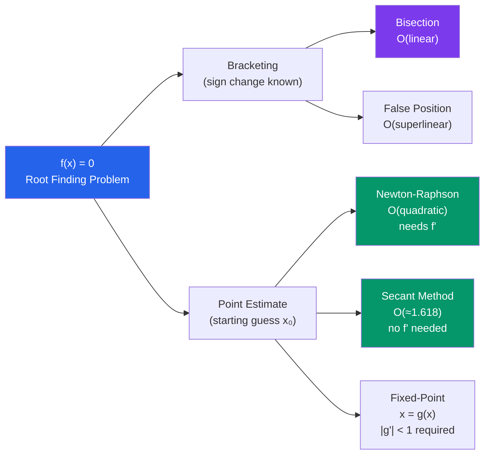

# 🔢 Root Finding

> [!abstract] TL;DR
> Root finding solves $f(x) = 0$ numerically. Bisection guarantees convergence by bracketing the root; Newton-Raphson converges quadratically but can diverge; the secant method avoids needing $f'$. Choosing the right method depends on smoothness, availability of derivatives, and global vs local behaviour.

## Intuition — analogy FIRST

Imagine searching for a city on a number line. Bisection is binary search — you check the midpoint, then eliminate half the range. Newton-Raphson is more like a GPS: from where you stand, it looks at your slope and projects a straight line to the axis, jumping directly to the estimated root. This is fast when the landscape is smooth and you start close, but on a winding road the GPS can send you over a cliff.

---

## How It Works

---

## Key Concepts

### 1. Bisection Method

**Algorithm**: Given $[a, b]$ with $f(a) \cdot f(b) < 0$ (sign change guarantees a root by IVT):

1. Set $c = (a + b)/2$
2. If $f(a) \cdot f(c) < 0$, set $b = c$; otherwise set $a = c$
3. Repeat until $|b - a| < \varepsilon$ or $|f(c)| < \varepsilon$

**Convergence**: linear. After $n$ steps the error is bounded by:

$$|e_n| \leq \frac{b - a}{2^n}$$

To achieve accuracy $\varepsilon$, need $n \geq \log_2\!\left(\frac{b-a}{\varepsilon}\right)$ iterations.

> [!info] Guaranteed Convergence
> Bisection always converges if $f$ is continuous and the initial bracket contains exactly one root. No other method guarantees this without additional assumptions.

### 2. Newton-Raphson Method

**Derivation**: linearise $f$ at the current guess $x_n$ via Taylor series:
$$f(x) \approx f(x_n) + f'(x_n)(x - x_n) = 0 \implies x_{n+1} = x_n - \frac{f(x_n)}{f'(x_n)}$$

**Geometric interpretation**: draw the tangent line at $(x_n, f(x_n))$; $x_{n+1}$ is where it crosses the $x$-axis.

**Convergence (quadratic)** near a simple root $x^*$:

$$|e_{n+1}| \approx \frac{|f''(x^*)|}{2|f'(x^*)|} |e_n|^2$$

The error *squares* each iteration: if $|e_0| = 0.1$, then $|e_1| \approx 0.01$, $|e_2| \approx 0.0001$, etc.

**Failure modes**:
- $f'(x_n) \approx 0$: near horizontal tangent, step is huge
- Oscillation: $f(x) = x^3 - x$ starting at $x_0 = 0$ leads to $0/0$
- Divergence: bad starting point on a non-convex function

### 3. Secant Method

Approximates $f'(x_n)$ using the previous two iterates:

$$x_{n+1} = x_n - f(x_n) \cdot \frac{x_n - x_{n-1}}{f(x_n) - f(x_{n-1})}$$

**Convergence**: superlinear, order $\approx 1.618$ (the golden ratio). No need for $f'$, but requires two starting points.

### 4. Fixed-Point Iteration

Rewrite $f(x) = 0$ as $x = g(x)$. Then iterate:

$$x_{n+1} = g(x_n)$$

**Convergence condition** (Banach fixed-point theorem): if $|g'(x^*)| < 1$ in a neighbourhood of the root $x^*$, the iteration converges. The convergence rate is linear with factor $|g'(x^*)|$.

Example: solve $x = \cos(x)$. Here $g(x) = \cos(x)$, $|g'(x)| = |\sin(x)| < 1$ near $x^* \approx 0.739$.

### 5. Methods Comparison

| Method | Order | Needs $f'$ | Needs bracket | Global? |
|---|---|---|---|---|
| Bisection | 1 (linear) | No | Yes | Yes |
| False Position | superlinear | No | Yes | Yes |
| Newton-Raphson | 2 (quadratic) | Yes | No | Local only |
| Secant | $\approx 1.618$ | No | No | Local only |
| Fixed-point | 1 (linear) | No | No | Local only |

---

## Real-World Notes

- **Computing $\sqrt{2}$**: Newton's method on $f(x) = x^2 - 2$ with $x_0 = 1$ gives $x_1 = 1.5$, $x_2 = 1.4167$, $x_3 = 1.41422...$. Converges to 10 correct digits in ~5 iterations.
- **Power flow in electrical grids**: the AC power flow equations are nonlinear; utilities solve them millions of times daily using Newton-Raphson to find voltages and currents across the network.
- **Calibrating financial models**: Black-Scholes implied volatility — given an observed option price, find the volatility $\sigma$ that produces it. This has no closed form but bisection or Newton converges quickly.

---

## Common Pitfalls

- **Newton on non-simple roots**: if $x^*$ is a root of multiplicity $m > 1$ (i.e., $f'(x^*) = 0$), Newton converges only linearly. Fix: use modified Newton $x_{n+1} = x_n - m \cdot f(x_n)/f'(x_n)$.
- **Always bracket first**: for robustness, use bisection to get close, then switch to Newton for speed (this is the strategy of Brent's method).
- **No derivative? Use finite differences**: $f'(x) \approx (f(x + h) - f(x))/h$ for small $h$, but introduces a small additional error. The secant method does this implicitly.
- **Checking convergence with $|f(c)| < \varepsilon$**: this can be fooled by a nearly flat $f$ near the root — always also check $|x_{n+1} - x_n| < \varepsilon$.

---

## Related Concepts

- [[_MOC_Numerical_Methods|↑ Section MOC]]
- [[Error_Analysis_and_Floating_Point]] — convergence order and error propagation
- [[Numerical_ODEs_and_PDEs]] — Newton-Raphson used inside implicit ODE solvers
- [[Numerical_Linear_Algebra]] — multi-dimensional root finding uses Jacobian (Newton's method for systems)

---

## Review Questions

1. Bisection takes 10 iterations to reach error $\leq 10^{-3}$ on $[0, 1]$. How many more iterations are needed to reach $10^{-6}$?
2. Newton-Raphson applied to $f(x) = x^3 - 2x + 2$ starting at $x_0 = 0$ fails to converge. Sketch why (find the tangent line at $x=0$ and where it crosses the axis).
3. Prove that fixed-point iteration $x_{n+1} = g(x_n)$ converges if $g$ maps a closed interval to itself and $|g'(x)| \leq k < 1$ throughout.
4. Why is the secant method's convergence order the golden ratio $\phi \approx 1.618$?

---

## Sources

- Burden & Faires, *Numerical Analysis*, Ch. 2
- Kincaid & Cheney, *Numerical Analysis*, Ch. 3
- Press et al., *Numerical Recipes*, Ch. 9

#numerical-methods #root-finding #mathematics
