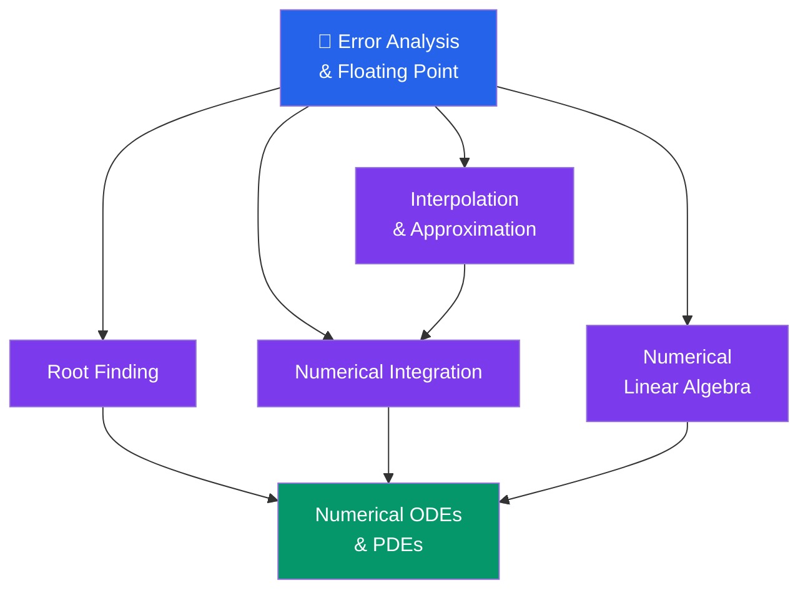
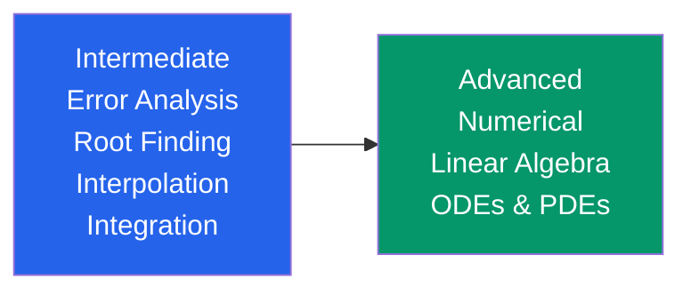

# 🔢 Numerical Methods — Map of Content

> [!abstract] Section Overview
> Numerical methods translate continuous mathematics into computable algorithms — essential for engineering, scientific computing, and machine learning. When analytical solutions are unavailable (which is most of the time in practice), these techniques provide rigorous, quantifiable approximations. This section covers error analysis, nonlinear root finding, data interpolation, numerical integration, large-scale linear algebra, and differential equations.

---

## Concept Map

*Error analysis underpins all methods. Root finding, interpolation, integration, and linear algebra are the four pillars; ODE/PDE solvers synthesise all of them.*

---

## Notes in This Section

| Note | Core Topics | Difficulty |
|---|---|---|
| [[Error_Analysis_and_Floating_Point]] | IEEE 754, machine epsilon, roundoff vs truncation, catastrophic cancellation, condition number | Intermediate |
| [[Root_Finding]] | Bisection, Newton-Raphson, secant method, fixed-point iteration, convergence rates | Intermediate |
| [[Interpolation_and_Approximation]] | Lagrange/Newton interpolation, Runge's phenomenon, Chebyshev nodes, cubic splines, least squares | Intermediate |
| [[Numerical_Integration]] | Trapezoid, Simpson, Gaussian quadrature, Romberg, adaptive integration, Monte Carlo | Intermediate |
| [[Numerical_Linear_Algebra]] | LU/QR/Cholesky, conditioning, Conjugate Gradient, Krylov methods, QR algorithm for eigenvalues | Advanced |
| [[Numerical_ODEs_and_PDEs]] | Euler, RK4, stiff systems, finite differences, CFL condition, FEM weak formulation | Advanced |

---

## Learning Paths

### Path 1 — Applied Mathematics / Engineering
Follow this sequence to build intuition bottom-up before tackling the big solvers:

1. [[Error_Analysis_and_Floating_Point]] — understand what precision means and where errors come from
2. [[Root_Finding]] — solve nonlinear equations; Newton-Raphson is ubiquitous
3. [[Interpolation_and_Approximation]] — reconstruct functions from discrete data
4. [[Numerical_Integration]] — evaluate integrals you can't compute symbolically
5. [[Numerical_Linear_Algebra]] — solve large systems; the backbone of simulation
6. [[Numerical_ODEs_and_PDEs]] — simulate dynamical systems and physical fields

### Path 2 — CS / Machine Learning Focus
Priority topics for optimisation, data pipelines, and model training:

1. [[Error_Analysis_and_Floating_Point]] — floating-point bugs in ML training loops
2. [[Numerical_Linear_Algebra]] — the heart of matrix operations in deep learning
3. [[Root_Finding]] — gradient-based optimisation as fixed-point iteration
4. [[Numerical_Integration]] — Bayesian inference, normalising constants
5. [[Numerical_ODEs_and_PDEs]] — neural ODEs, diffusion models

### Path 3 — Scientific Computing / Simulation
For PDE-heavy domains (CFD, structural mechanics, weather):

1. [[Error_Analysis_and_Floating_Point]]
2. [[Numerical_Linear_Algebra]] — sparse solvers are everything
3. [[Numerical_ODEs_and_PDEs]] — the target application
4. [[Numerical_Integration]] — FEM stiffness matrix assembly

---

## Key Theorems and Results

| Result | Where Used |
|---|---|
| Banach fixed-point theorem | [[Root_Finding]] — fixed-point iteration convergence |
| Intermediate Value Theorem | [[Root_Finding]] — bisection guarantee |
| Weierstrass approximation | [[Interpolation_and_Approximation]] — polynomial density |
| Peano kernel theorem | [[Numerical_Integration]] — error formula for quadrature |
| Gauss quadrature exactness | [[Numerical_Integration]] — $n$ nodes exact for deg $\leq 2n-1$ |
| CFL condition | [[Numerical_ODEs_and_PDEs]] — explicit scheme stability |
| Lax equivalence theorem | [[Numerical_ODEs_and_PDEs]] — consistency + stability = convergence |

---

## Cross-Section Links

This section connects to other vault sections:

- **[[../07_Differential_Equations/_MOC_Differential_Equations|Differential Equations]]** — numerical ODE/PDE methods approximate solutions to DEs studied analytically
- **[[../03_Linear_Algebra/_MOC_Linear_Algebra|Linear Algebra]]** — LU, QR, eigenvalue algorithms are the numerical counterparts of the theoretical tools
- **[[../08_Real_Analysis/_MOC_Real_Analysis|Real Analysis]]** — convergence proofs, Taylor's theorem, and continuity underlie all error bounds
- **[[../02_Calculus/_MOC_Calculus|Calculus]]** — numerical differentiation and integration discretise the continuous calculus operations

---

## Difficulty Progression

---

## Common Themes Across All Notes

- **Order of accuracy** $O(h^p)$: higher $p$ means fewer steps needed to hit a target accuracy
- **Stability**: a numerically stable method doesn't amplify rounding errors beyond their initial level
- **Condition number** $\kappa$: appears in every error bound — always check before trusting results
- **Trade-off**: higher accuracy per step costs more function evaluations; adaptive methods spend effort where it matters

#MOC #numerical-methods #mathematics
