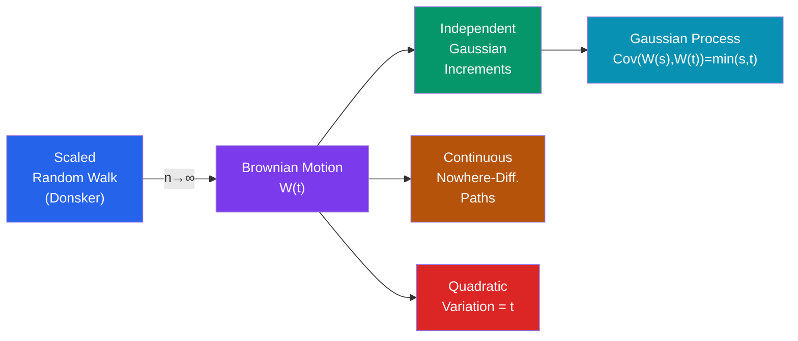

# 🎲 Brownian Motion (Wiener Process)

> [!abstract] TL;DR
> Brownian motion is the continuous-time limit of a symmetric random walk — a process with independent Gaussian increments and continuous but nowhere-differentiable paths. It is the foundational object of stochastic calculus and the backbone of mathematical finance.

## Intuition — analogy FIRST

Drop a pollen grain in water and watch it jiggle erratically — buffeted by billions of unseen water molecules, it traces a wildly irregular path. That's Brownian motion. At every instant, the grain takes a tiny random step in a random direction. The path is continuous (it doesn't teleport) but so jagged it has no slope anywhere — like zooming into a coastline and finding it equally rough at every scale. Robert Brown observed this in 1827; Einstein gave the mathematics in 1905; Wiener made it rigorous in 1923.

---

## How It Works

---

## Key Concepts / Details

### Formal Definition

**Standard Brownian motion** (Wiener process) $\{W(t), t \geq 0\}$ is a stochastic process satisfying:

1. $W(0) = 0$ almost surely
2. **Independent increments:** $W(t) - W(s)$ is independent of $\mathcal{F}_s = \sigma\{W(u) : u \leq s\}$ for all $0 \leq s < t$
3. **Stationary Gaussian increments:** $W(t) - W(s) \sim \mathcal{N}(0, t-s)$ for all $0 \leq s < t$
4. **Continuous paths:** $t \mapsto W(t)$ is continuous almost surely

From (3): $E[W(t)] = 0$ and $\text{Var}(W(t)) = t$ — variance grows linearly in time.

### Properties of Sample Paths

| Property | Statement |
|---|---|
| Continuity | $t \mapsto W(t)$ is continuous a.s. |
| Non-differentiability | $W$ is nowhere differentiable a.s. |
| Quadratic variation | $[W]_t = t$ (i.e., $\sum_i (W(t_i)-W(t_{i-1}))^2 \to t$ in $L^2$) |
| Infinite total variation | $\sum_i |W(t_i)-W(t_{i-1})| \to \infty$ a.s. |
| Self-similarity | $W(ct) \stackrel{d}{=} \sqrt{c}\, W(t)$ for all $c > 0$ |

The **quadratic variation** $[W]_t = t$ is a non-trivial fact: ordinary smooth functions have quadratic variation 0. This finite quadratic variation but infinite total variation is what forces the Itô correction term.

### Gaussian Process Structure

Brownian motion is a **Gaussian process**: any finite-dimensional marginal $(W(t_1), \ldots, W(t_n))$ is jointly Gaussian with:
$$E[W(t)] = 0, \quad \text{Cov}(W(s), W(t)) = \min(s, t)$$

### Related Processes

**Brownian motion with drift:**
$$X(t) = \mu t + \sigma W(t)$$
$E[X(t)] = \mu t$, $\text{Var}(X(t)) = \sigma^2 t$. Useful for modelling linear trends with noise.

**Geometric Brownian Motion (GBM):**
$$S(t) = S_0 \exp\!\left(\left(\mu - \frac{\sigma^2}{2}\right)t + \sigma W(t)\right)$$

$S(t)$ is **log-normally** distributed; $S(t) > 0$ always. This is the Black-Scholes stock price model. The $-\sigma^2/2$ term is the Itô correction (see [[Stochastic_Calculus]]).

**Brownian bridge:**
$$B(t) = W(t) - t \cdot W(1), \quad t \in [0,1]$$
$B(0) = B(1) = 0$; Gaussian process with $\text{Cov}(B(s), B(t)) = s(1-t)$ for $s \leq t$.

**Ornstein-Uhlenbeck (OU) process:**
$$dX = \theta(\mu - X)\,dt + \sigma\,dW$$
Mean-reverting; solution $X(t)$ is Gaussian with $E[X(t)] \to \mu$ as $t \to \infty$.

### Construction of Brownian Motion

**Donsker's invariance principle (functional CLT):** Let $S_n = \xi_1 + \cdots + \xi_n$ with $\xi_i$ i.i.d., $E[\xi_i]=0$, $\text{Var}(\xi_i)=1$. Define:
$$W_n(t) = \frac{S_{\lfloor nt \rfloor}}{\sqrt{n}}$$

Then $W_n \Rightarrow W$ (weak convergence in $C[0,1]$).

### Reflection Principle

For $a > 0$:
$$P\!\left(\max_{0 \leq s \leq t} W(s) \geq a\right) = 2\,P(W(t) \geq a) = 2\left(1 - \Phi\!\left(\frac{a}{\sqrt{t}}\right)\right)$$

where $\Phi$ is the standard normal CDF. By symmetry: once the path hits $a$, the reflected continuation is also a valid Brownian path.

### Martingale Properties

The following are all martingales with respect to the natural filtration $\mathcal{F}_t = \sigma\{W(s) : s \leq t\}$:

- $W(t)$ (zero-mean increments)
- $W(t)^2 - t$ (variance process)
- $e^{\sigma W(t) - \sigma^2 t/2}$ (exponential/Doléans-Dade martingale)

---

## Real-World Notes

- **Black-Scholes option pricing (1973):** The assumption that log-returns are i.i.d. Gaussian leads to geometric Brownian motion for stock prices. Applying Itô's lemma to a call option's payoff yields the Black-Scholes PDE and the celebrated closed-form option price.
- **Einstein's 1905 paper on Brownian motion:** Einstein derived the diffusion equation $\partial p/\partial t = D \,\partial^2 p/\partial x^2$ from first principles, providing indirect proof of the existence of atoms and linking the diffusion coefficient to temperature and particle size.
- **Polymer physics:** The end-to-end distance of a polymer chain scales as $\sqrt{n}$ (just like BM after $n$ steps), explaining universal scaling laws in polymer chemistry.
- **Electronics noise:** Johnson-Nyquist thermal noise in resistors is modelled as white noise — the formal derivative of Brownian motion — appearing in circuit analysis.

---

## Common Pitfalls

- **BM paths are continuous but have infinite variation.** You cannot integrate against $dW$ using the ordinary Riemann-Stieltjes integral — the integral does not exist pathwise. This is why Itô calculus with its special rules is needed.
- **Quadratic variation $= t$ is not an approximation.** The statement $[W]_t = t$ holds in $L^2$ and almost surely along refining partitions. It is an exact, non-trivial fact, not a heuristic.
- **Geometric BM cannot model all asset prices.** GBM prevents negative prices and has log-normally distributed returns, but real markets exhibit fat tails, volatility clustering, and jumps (see jump-diffusion or stochastic volatility models).
- **Self-similarity leads to fractal paths.** The path has no characteristic scale — it looks the same at any magnification. This means instantaneous volatility is undefined in the ordinary sense; only quadratic variation makes sense.

---

## Related Concepts

- [[_MOC_Stochastic_Processes|↑ Section MOC]]
- [[Markov_Chains]] — Brownian motion is the scaling limit of random walks (Donsker's theorem)
- [[Poisson_Process]] — both have independent stationary increments; Poisson is discrete-jump, BM is continuous-Gaussian
- [[Martingales]] — $W(t)$ and $W(t)^2 - t$ are canonical martingale examples
- [[Stochastic_Calculus]] — Itô's lemma and SDEs build directly on Brownian motion

---

## Review Questions

1. State all four defining properties of standard Brownian motion. Which property distinguishes it from a process with i.i.d. Gaussian increments but jumps?
2. Compute $E[W(s)W(t)]$ for $s \leq t$ using the independent increments property.
3. Use the reflection principle to find $P(\max_{0 \leq s \leq 1} W(s) \geq 2)$.
4. Why is geometric Brownian motion $S(t) = S_0 e^{(\mu - \sigma^2/2)t + \sigma W(t)}$ the right model for stock prices rather than $S_0 e^{\mu t + \sigma W(t)}$? What is the Itô correction and why does it appear?
5. Explain why Brownian motion paths are continuous but nowhere differentiable. What does this imply about the validity of ordinary calculus for BM?

---

## Sources

- Mörters & Peres, *Brownian Motion*, Cambridge University Press, Ch. 1–2
- Karatzas & Shreve, *Brownian Motion and Stochastic Calculus*, Ch. 1–2
- Shreve, *Stochastic Calculus for Finance II*, Ch. 3

#brownian-motion #wiener-process #gaussian-process #stochastic-processes #quadratic-variation
