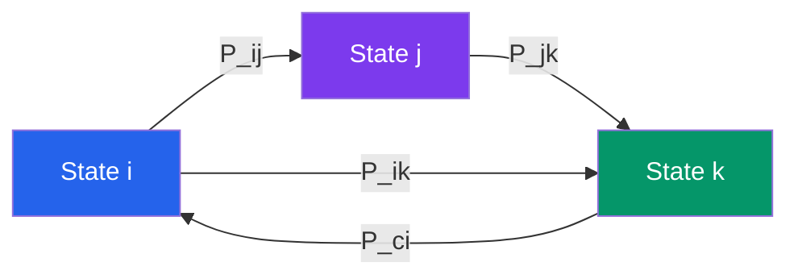
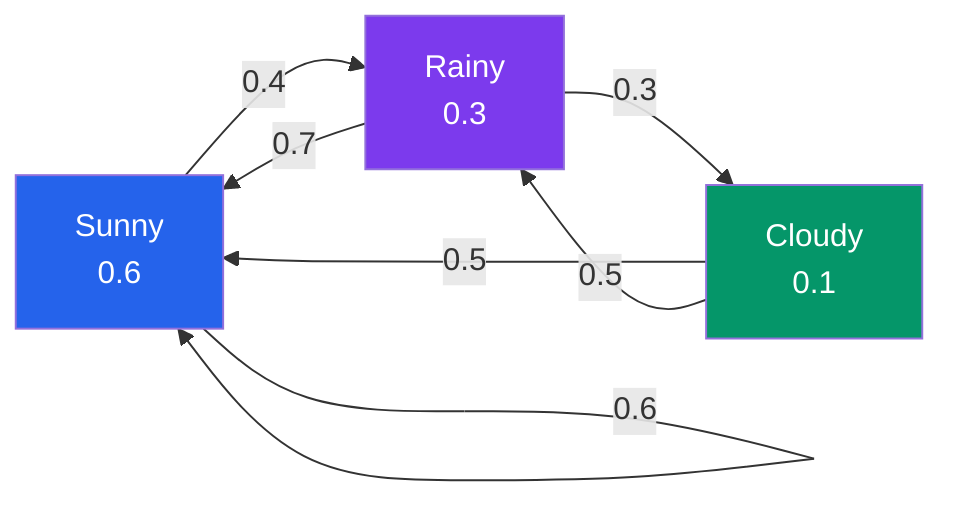

# 🎲 Markov Chains

> [!abstract] TL;DR
> A Markov chain is a stochastic process where the future depends only on the present state, not the full history — the "memoryless" property. The long-run behaviour is governed by a stationary distribution found by solving πP = π.

## Intuition — analogy FIRST

Think of a board game like Snakes and Ladders. Where you land next depends only on your current square and the dice roll — it doesn't matter how you got to that square. That's the Markov property. A Markov chain is a mathematical model of any system with this "only the present matters" structure: weather models (today's weather predicts tomorrow's better than last week's), web surfing (next page depends on current page), or a stock's price category (bull/bear/flat market).

---

## How It Works

### 3-State Example: Transition Diagram

---

## Key Concepts / Details

### The Markov Property

A stochastic process $\{X_n, n \geq 0\}$ with state space $S$ is a Markov chain if:
$$P(X_{n+1} = j \mid X_0 = i_0, X_1 = i_1, \ldots, X_n = i) = P(X_{n+1} = j \mid X_n = i)$$

The future is conditionally independent of the past given the present state.

### Transition Matrix

The **transition matrix** $P$ has entries $P_{ij} = P(X_{n+1} = j \mid X_n = i)$. Each row sums to 1 (stochastic matrix):
$$\sum_{j \in S} P_{ij} = 1 \quad \text{for all } i$$

**n-step transitions** via the Chapman-Kolmogorov equations:
$$P(X_n = j \mid X_0 = i) = (P^n)_{ij}$$

### Classification of States

| Property | Definition |
|---|---|
| Accessible | $j$ accessible from $i$ if $(P^n)_{ij} > 0$ for some $n \geq 0$ |
| Communicates | $i \leftrightarrow j$ if $i$ accessible from $j$ AND $j$ accessible from $i$ |
| Irreducible | All states communicate — one communicating class |
| Recurrent | $P(\text{return to } i) = 1$ |
| Transient | $P(\text{return to } i) < 1$ |
| Positive recurrent | Expected return time $m_i = E[T_i \mid X_0 = i] < \infty$ |
| Aperiodic | $\gcd\{n \geq 1 : (P^n)_{ii} > 0\} = 1$ |

### Stationary Distributions

A **stationary distribution** $\pi$ satisfies:
$$\pi P = \pi \quad \text{and} \quad \sum_{i \in S} \pi_i = 1, \quad \pi_i \geq 0$$

$\pi_i$ represents the long-run fraction of time spent in state $i$.

**Existence and uniqueness:** An irreducible, positive recurrent chain has a unique stationary distribution, with $\pi_i = 1/m_i$.

**Convergence (Ergodic Theorem):** If the chain is irreducible and aperiodic, then:
$$P^n_{ij} \to \pi_j \quad \text{as } n \to \infty \text{ for all } i, j$$

Time averages converge to space averages almost surely:
$$\frac{1}{n}\sum_{k=0}^{n-1} f(X_k) \to \sum_{i} \pi_i f(i)$$

### Detailed Balance

Chain is **reversible** if it satisfies **detailed balance**:
$$\pi_i P_{ij} = \pi_j P_{ji} \quad \text{for all } i, j$$

Detailed balance $\Rightarrow$ $\pi$ is stationary (but not vice versa). This is the key condition used in Metropolis-Hastings MCMC.

### Hitting Times and Absorption

The **hitting time** $T_j = \min\{n \geq 1 : X_n = j\}$. Expected hitting times $h_{ij} = E[T_j \mid X_0 = i]$ satisfy:
$$h_{ij} = 1 + \sum_{k \neq j} P_{ik} h_{kj}$$

**Gambler's Ruin:** Starting at $x \in \{0, 1, \ldots, N\}$, win \$1 with probability $p$, lose \$1 with probability $q = 1-p$. Probability of ruin (hitting 0 before $N$):
$$P(\text{ruin} \mid X_0 = x) = \begin{cases} \dfrac{(q/p)^x - (q/p)^N}{1 - (q/p)^N} & p \neq 1/2 \\ 1 - x/N & p = 1/2 \end{cases}$$

### Key Examples

- **Random walk on $\mathbb{Z}$:** $p = 1/2$ → recurrent (returns to origin a.s.); $p \neq 1/2$ → transient
- **PageRank:** Stationary distribution of the web-surfing Markov chain; with teleportation to ensure irreducibility
- **Weather model:** States = \{Sunny, Rainy, Cloudy\}; transition matrix estimated from historical data

---

## Real-World Notes

- **Google PageRank** treats the web as a Markov chain where each page is a state; the stationary distribution gives the rank of each page — pages with many high-rank inbound links receive higher stationary probability.
- **Hidden Markov Models (HMMs)** power speech recognition and natural language processing: the underlying phoneme/POS sequence is Markov, and we observe noisy emissions.
- **MCMC (Markov Chain Monte Carlo)** constructs a Markov chain whose stationary distribution is a target posterior $\pi$; after burn-in, samples from the chain approximate the posterior. Detailed balance guarantees correctness.
- **DNA sequence evolution** (Jukes-Cantor model): nucleotide substitution over evolutionary time is modelled as a CTMC on $\{A, C, G, T\}$.

---

## Common Pitfalls

- **Markov property $\neq$ independence.** Consecutive states are correlated; the Markov property only says future is independent of past *given present*, not unconditionally independent.
- **Stationary distribution $\neq$ starting distribution.** The chain converges *to* $\pi$ from any start; $\pi$ is an equilibrium, not an initial condition.
- **Both irreducibility AND aperiodicity needed for convergence.** An irreducible but periodic chain oscillates and its distribution never converges (though time averages still converge).
- **Detailed balance is sufficient but NOT necessary** for $\pi$ to be stationary. Many irreversible chains (e.g., directed cycles) have stationary distributions but violate detailed balance.

---

## Related Concepts

- [[_MOC_Stochastic_Processes|↑ Section MOC]]
- [[Poisson_Process]] — continuous-time analogue; Poisson process is a CTMC on $\mathbb{Z}_{\geq 0}$
- [[Brownian_Motion]] — continuous limit of random walk via Donsker's theorem
- [[Martingales]] — harmonic functions of a Markov chain are martingales

---

## Review Questions

1. State the Markov property formally. Give an example of a real-world process that satisfies it and one that does not.
2. For the Gambler's Ruin problem with $p = 0.4$ and $N = 10$, compute the probability of ruin starting from $x = 5$.
3. Prove that if $\pi$ satisfies detailed balance with respect to $P$, then $\pi P = \pi$.
4. Why does an irreducible periodic chain fail to have $P^n_{ij} \to \pi_j$? Construct a concrete 2-state counterexample.
5. Explain how MCMC uses Markov chains to sample from a target distribution. What role does detailed balance play?

---

## Sources

- Norris, *Markov Chains*, Cambridge University Press, Ch. 1–3
- Ross, *Introduction to Probability Models*, Ch. 4
- Levin, Peres & Wilmer, *Markov Chains and Mixing Times*, Ch. 1–4

#markov-chains #stochastic-processes #probability #transition-matrix #stationary-distribution
