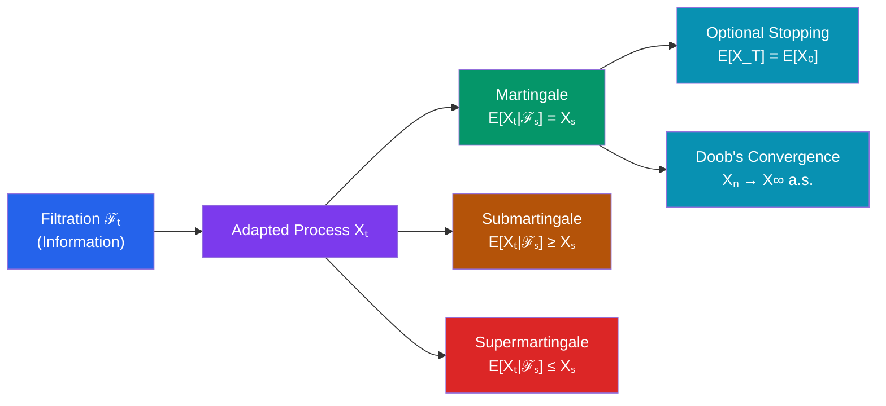

# 🎲 Martingales

> [!abstract] TL;DR
> A martingale models a "fair game" — a stochastic process whose expected future value, given all current information, equals its present value. The Optional Stopping Theorem formalises the impossibility of a profitable stopping strategy, while Doob's inequalities control the maximum of a martingale.

## Intuition — analogy FIRST

You're playing a casino game that is perfectly fair — at every step, your expected fortune tomorrow equals your fortune today, regardless of the game history. That's a martingale. No matter how clever your betting strategy (double when you lose, triple when you win…), if the game is fair, your expected wealth at the end equals your starting capital. The martingale framework makes this rigorous: it's the mathematical foundation for why you can't beat a fair market, and it underpins the entire theory of no-arbitrage pricing in finance.

---

## How It Works

---

## Key Concepts / Details

### Filtrations and Adapted Processes

A **filtration** $\{\mathcal{F}_t\}_{t \geq 0}$ is an increasing family of $\sigma$-algebras:
$$\mathcal{F}_s \subseteq \mathcal{F}_t \quad \text{for } s \leq t$$

Intuitively, $\mathcal{F}_t$ encodes all information available up to time $t$.

A process $\{X_t\}$ is **adapted** to $\{\mathcal{F}_t\}$ if $X_t$ is $\mathcal{F}_t$-measurable for each $t$ — $X_t$ is "known" at time $t$.

A **stopping time** $T$ is a random time with $\{T \leq t\} \in \mathcal{F}_t$ — the decision to stop at time $T$ depends only on information available by time $T$.

### Martingale, Submartingale, Supermartingale

An integrable adapted process $\{X_t\}$ is:

| Type | Condition | Intuition |
|---|---|---|
| **Martingale** | $E[X_t \mid \mathcal{F}_s] = X_s$ | Fair game — no drift |
| **Submartingale** | $E[X_t \mid \mathcal{F}_s] \geq X_s$ | Tends to increase on average |
| **Supermartingale** | $E[X_t \mid \mathcal{F}_s] \leq X_s$ | Tends to decrease on average |

for all $s \leq t$.

### Key Examples

**Discrete-time martingales:**
- Simple random walk $S_n = \xi_1 + \cdots + \xi_n$ with $E[\xi_i] = 0$: martingale
- $S_n^2 - n$: martingale (tracks variance accumulation)
- Likelihood ratio: $L_n = \prod_{i=1}^n \frac{f(X_i)}{g(X_i)}$ is a martingale under measure $f$

**Continuous-time martingales (Brownian):**
- $W(t)$: martingale
- $W(t)^2 - t$: martingale
- **Exponential martingale:** $\mathcal{E}_t(\sigma) = e^{\sigma W(t) - \frac{1}{2}\sigma^2 t}$: martingale for any $\sigma \in \mathbb{R}$

**Conditional expectations:**
For any integrable $X$ and filtration $\{\mathcal{F}_n\}$, the process:
$$M_n = E[X \mid \mathcal{F}_n]$$
is a martingale (Tower property: $E[M_n \mid \mathcal{F}_m] = E[X \mid \mathcal{F}_m] = M_m$ for $m \leq n$).

### Optional Stopping Theorem (OST)

If $\{X_n\}$ is a martingale and $T$ is a stopping time, then under suitable integrability conditions:
$$E[X_T] = E[X_0]$$

**Sufficient conditions:** $T$ bounded a.s., OR $E[T] < \infty$ and increments bounded, OR $\{X_{T \wedge n}\}$ uniformly integrable.

**Consequences:**
- Gambler's ruin: expected wealth at stopping = initial capital, regardless of betting strategy
- No betting strategy (including the "martingale strategy" of doubling bets) can turn a fair game into a favourable one

**Example:** For simple random walk starting at 0, if $T = \min\{n : S_n = a \text{ or } S_n = -b\}$:
$$E[S_T] = 0 \implies P(S_T = a) = \frac{b}{a+b}, \quad P(S_T = -b) = \frac{a}{a+b}$$

### Martingale Convergence Theorems

**Doob's martingale convergence theorem:** If $\{X_n\}$ is a non-negative supermartingale (or $L^1$-bounded martingale), then $X_n \to X_\infty$ a.s. as $n \to \infty$ (for some integrable $X_\infty$).

**$L^2$ convergence:** If $\sup_n E[X_n^2] < \infty$, then $X_n \to X_\infty$ in $L^2$ and a.s.

### Doob's Inequalities

**Maximal inequality:** For a non-negative submartingale $\{X_k\}$ and $\lambda > 0$:
$$P\!\left(\max_{1 \leq k \leq n} X_k \geq \lambda\right) \leq \frac{E[X_n^+]}{\lambda}$$

**Doob's $L^p$ inequality:** For $p > 1$ and martingale $\{X_k\}$:
$$\left\|\max_{1 \leq k \leq n} |X_k|\right\|_p \leq \frac{p}{p-1}\,\|X_n\|_p$$

These control the running maximum — essential for uniform integrability arguments.

### Applications

**Gambling:** No betting strategy applied to a martingale (fair game) produces positive expected profit — OST guarantees $E[X_T] = E[X_0]$.

**Change of measure:** The exponential martingale is the Radon-Nikodym derivative for Girsanov's change of measure (see [[Stochastic_Calculus]]).

**MCMC convergence:** Foster-Lyapunov drift conditions construct a supermartingale from the Lyapunov function, proving geometric ergodicity.

---

## Real-World Notes

- **Financial derivatives pricing:** Under the risk-neutral measure $Q$, discounted asset prices $e^{-rt}S(t)$ are martingales. This is the fundamental theorem of asset pricing — no-arbitrage $\Leftrightarrow$ existence of such a measure. Option prices are expectations under $Q$.
- **Sequential hypothesis testing (SPRT):** The likelihood ratio $L_n$ is a martingale under the null hypothesis, making the Wald sequential probability ratio test provably optimal in terms of expected sample size (Wald's identity from OST).
- **American options:** Finding the optimal exercise time is an optimal stopping problem — maximise $E[e^{-rT} g(S_T)]$ over stopping times $T$. The solution involves Snell envelopes (smallest supermartingale dominating $g$).
- **Reinforcement learning:** Value functions under a policy satisfy Bellman equations that are essentially martingale conditions; temporal-difference learning can be viewed as martingale decompositions of returns.

---

## Common Pitfalls

- **OST requires integrability conditions.** You cannot always exchange expectation with a stopping time. The classic failure: $S_n$ is simple random walk, $T = $ first hitting time of 1. $E[S_T] = 1 \neq 0 = E[S_0]$ because $E[T] = \infty$ (the conditions of OST fail).
- **Martingale property is about conditional expectations, not about paths.** A martingale can go up and down wildly — the defining property is that the *expected* value at any future time equals the current value. Individual trajectories can be unbounded.
- **The martingale betting strategy fails in practice.** Doubling your bet after each loss creates a submartingale *in winnings* only if you have infinite capital and no table limits. With finite capital, the strategy has positive probability of catastrophic ruin.
- **Submartingale $\neq$ increasing process.** A submartingale increases in expectation but individual paths can decrease. Doob's decomposition $X_n = M_n + A_n$ (martingale + predictable increasing process) makes the expected drift precise.

---

## Related Concepts

- [[_MOC_Stochastic_Processes|↑ Section MOC]]
- [[Brownian_Motion]] — $W(t)$, $W(t)^2-t$, and the exponential martingale are canonical examples
- [[Stochastic_Calculus]] — Itô integrals are martingales; Girsanov's theorem uses exponential martingale
- [[Markov_Chains]] — harmonic functions of a Markov chain yield martingales; stationary distributions relate to Lyapunov martingales

---

## Review Questions

1. Define a martingale with respect to a filtration. Give one example of a martingale, one submartingale, and one supermartingale, each arising from a random walk.
2. State the Optional Stopping Theorem (with conditions). Use it to re-derive the Gambler's Ruin absorption probabilities.
3. Show that $W(t)^2 - t$ is a martingale with respect to the natural filtration of Brownian motion $W(t)$.
4. State Doob's $L^p$ inequality. Why is the constant $p/(p-1)$ unavoidable (hint: what happens as $p \to 1$)?
5. Explain why the "martingale betting strategy" (double your bet after each loss) cannot produce a positive expected profit in a fair game with finite capital.

---

## Sources

- Williams, *Probability with Martingales*, Cambridge University Press (entire book)
- Durrett, *Probability: Theory and Examples*, Ch. 4–5
- Shreve, *Stochastic Calculus for Finance II*, Ch. 3–4

#martingales #optional-stopping #doob-inequality #stochastic-processes #filtration
