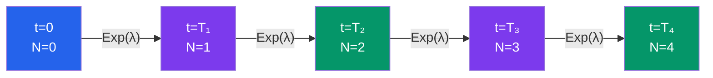
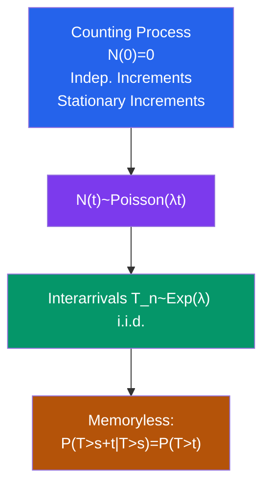

# 🎲 Poisson Process

> [!abstract] TL;DR
> The Poisson process counts the number of random events occurring over time at a constant average rate $\lambda$, with exponentially distributed waiting times between events. It is the canonical model for rare, independent arrivals and the foundational continuous-time stochastic process.

## Intuition — analogy FIRST

Imagine standing at a bus stop where buses arrive completely randomly at an average rate of $\lambda$ buses per hour. You don't know exactly when the next bus will come — past arrivals give no hint. The number of buses in any 2-hour window follows a Poisson distribution with mean $2\lambda$, and the time between consecutive buses is exponential with rate $\lambda$. That memoryless waiting is the Poisson process. The same model applies to radioactive decays, website hits, and calls to a call centre.

---

## How It Works

---

## Key Concepts / Details

### Definition

A **Poisson process** with rate $\lambda > 0$ is a counting process $\{N(t), t \geq 0\}$ satisfying:

1. $N(0) = 0$
2. **Independent increments:** for $0 \leq t_1 < t_2 \leq t_3 < t_4$, $N(t_2)-N(t_1)$ and $N(t_4)-N(t_3)$ are independent
3. **Stationary increments:** $N(t+s) - N(t) \stackrel{d}{=} N(s)$ — distribution depends only on interval length
4. $N(t) \sim \text{Poisson}(\lambda t)$:

$$P(N(t) = k) = \frac{e^{-\lambda t}(\lambda t)^k}{k!}, \quad k = 0,1,2,\ldots$$

So $E[N(t)] = \text{Var}(N(t)) = \lambda t$.

**Three equivalent definitions:**
- (1) Counting process with Poisson increments (above)
- (2) Interarrival times $T_n = S_n - S_{n-1} \sim \text{Exp}(\lambda)$ i.i.d.
- (3) Limit of rescaled Bernoulli processes as time-step $\to 0$

### Key Properties

**Interarrival and waiting times:**

$$T_n \sim \text{Exp}(\lambda), \quad S_n = T_1 + \cdots + T_n \sim \text{Gamma}(n, \lambda)$$

$$E[S_n] = n/\lambda, \quad \text{Var}(S_n) = n/\lambda^2$$

**Memoryless property** (unique to Exponential distribution among continuous distributions):
$$P(T > s + t \mid T > s) = P(T > t) \quad \text{for all } s, t \geq 0$$

The remaining waiting time is always $\text{Exp}(\lambda)$, regardless of how long you've already waited.

**Superposition:** If $N_1 \sim \text{Poisson}(\lambda_1)$ and $N_2 \sim \text{Poisson}(\lambda_2)$ are independent, then:
$$N_1(t) + N_2(t) \sim \text{Poisson}((\lambda_1 + \lambda_2)t)$$

**Thinning:** Each event is independently kept with probability $p$ (removed with $1-p$). Then:
- Kept events: $\text{Poisson}(p\lambda)$
- Removed events: $\text{Poisson}((1-p)\lambda)$
- **The two thinned processes are independent!**

**Conditional distribution:** Given $N(t) = n$, the $n$ arrival times are distributed as the **order statistics** of $n$ i.i.d. $\text{Uniform}(0, t)$ random variables.

### Variants

**Non-homogeneous Poisson process:** Rate $\lambda(t)$ varies over time:
$$N(t) \sim \text{Poisson}\!\left(\int_0^t \lambda(s)\, ds\right)$$

Increments are still independent but not stationary.

**Compound Poisson process:**
$$X(t) = \sum_{i=1}^{N(t)} Y_i$$

where $Y_i$ are i.i.d. (jump sizes). Then:
$$E[X(t)] = \lambda t \cdot E[Y], \quad \text{Var}(X(t)) = \lambda t \cdot E[Y^2]$$

Used in insurance ruin theory and financial jump models.

**Spatial Poisson process:** Events in $\mathbb{R}^2$ or $\mathbb{R}^3$; the count in any region $A$ is $\text{Poisson}(\lambda \cdot |A|)$; counts in disjoint regions are independent.

### Small-$h$ Characterisation

An equivalent way to define the Poisson process: for small $h > 0$,
$$P(N(t+h) - N(t) = 1) = \lambda h + o(h)$$
$$P(N(t+h) - N(t) \geq 2) = o(h)$$

Events happen singly and at constant rate — no simultaneous arrivals.

---

## Real-World Notes

- **Radioactive decay:** A Geiger counter clicking is the textbook Poisson process — each nucleus decays independently with constant probability per unit time, so click counts in any interval are Poisson distributed.
- **Website traffic:** HTTP requests to a server often follow a Poisson process during stable traffic periods; the rate $\lambda$ varies throughout the day, making a non-homogeneous Poisson process more realistic.
- **Insurance claims:** The number of claims arriving at an insurer per day is modelled as Poisson; claim sizes are random $Y_i$, making total payouts a compound Poisson process — the foundation of actuarial ruin theory.
- **Telecommunications:** Call arrivals to a call centre follow a Poisson process, leading to the M/M/1 queue where interarrival times and service times are both exponential.

---

## Common Pitfalls

- **Simultaneous arrivals are excluded.** The Poisson process requires events happen one at a time ($P(\geq 2$ events in $(t, t+h)) = o(h)$). Real data with clustering or batch arrivals violates this; use a Cox process (doubly stochastic Poisson) instead.
- **Memoryless property is a strong assumption.** In practice, the next bus is more likely to arrive soon after the previous one (bus bunching). The Exponential inter-arrival assumption breaks down in many real systems.
- **Stationarity assumption:** A standard Poisson process has constant rate. Using $\lambda$ estimated from a whole day when rate varies by hour leads to poor models; always check for rate non-stationarity.
- **Poisson approximation conditions:** The Poisson distribution approximates Binomial($n$, $p$) when $n$ is large and $p$ small (rare events). This is not always valid — check that $np$ stabilises and $n$ is genuinely large.

---

## Related Concepts

- [[_MOC_Stochastic_Processes|↑ Section MOC]]
- [[Markov_Chains]] — the Poisson process is a continuous-time Markov chain on $\mathbb{Z}_{\geq 0}$ with generator $\lambda$
- [[Brownian_Motion]] — scaled Poisson process converges to Brownian motion (functional CLT)
- [[Stochastic_Calculus]] — compound Poisson process appears in jump-diffusion SDEs (Lévy processes)

---

## Review Questions

1. State the three equivalent definitions of the Poisson process and prove that definitions (1) and (2) are equivalent.
2. Show that thinning a Poisson($\lambda$) process with probability $p$ yields two **independent** Poisson processes with rates $p\lambda$ and $(1-p)\lambda$.
3. Given $N(t) = 5$, find the probability that exactly 3 of the 5 arrivals occurred in $[0, t/2]$.
4. A website receives hits at rate 10 per minute. What is the probability that no hits arrive in a 30-second window?
5. Explain the memoryless property of the exponential distribution and why it is the only continuous distribution with this property.

---

## Sources

- Ross, *Introduction to Probability Models*, Ch. 5
- Kingman, *Poisson Processes*, Oxford University Press
- Sheldon Ross, *Stochastic Processes*, Ch. 4

#poisson-process #counting-process #stochastic-processes #exponential-distribution #memoryless
