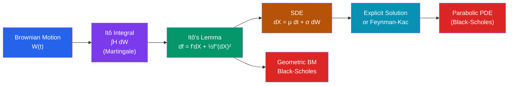

# 🎲 Stochastic Calculus (Itô Calculus)

> [!abstract] TL;DR
> Stochastic calculus extends ordinary calculus to processes driven by Brownian motion. Because Brownian paths have non-zero quadratic variation ($dW^2 = dt$), the chain rule gains a correction term — Itô's lemma — which is the key computational tool for solving SDEs and pricing derivatives.

## Intuition — analogy FIRST

In ordinary calculus, when you change variables $y = f(x)$, the chain rule says $dy = f'(x)\,dx$. Now imagine $x$ is a Brownian path — it wiggles so violently that second-order fluctuations accumulate at rate 1 per unit time ($dW^2 = dt$). The chain rule must account for this: $df(W) = f'(W)\,dW + \frac{1}{2}f''(W)\,dt$. That extra $\frac{1}{2}f''$ term is the Itô correction — as surprising as finding that a car's odometer reads more miles than the straight-line distance because of all the turns. Ignoring it leads to wrong answers; internalising it is the whole art of stochastic calculus.

---

## How It Works

---

## Key Concepts / Details

### Why Ordinary Calculus Fails

Brownian motion $W(t)$ has:
- **Infinite total variation:** $\sum_i |W(t_i) - W(t_{i-1})| \to \infty$ — Riemann-Stieltjes integral $\int f\,dW$ is not defined pathwise
- **Non-zero quadratic variation:** $[W]_t = t$ — second-order terms survive in limits

The crucial heuristic rule:
$$dW \cdot dW = dt, \quad dW \cdot dt = 0, \quad dt \cdot dt = 0$$

This "Itô table" is exact for quadratic variation and drives all the corrections.

### Itô Integral

For a **simple adapted process** $H(s) = \sum_i h_i \mathbf{1}_{[t_i, t_{i+1})}(s)$ (left-endpoint, $h_i$ is $\mathcal{F}_{t_i}$-measurable):
$$\int_0^T H\,dW = \sum_i h_i \bigl(W(t_{i+1}) - W(t_i)\bigr)$$

Extended to general $L^2$-adapted processes by the **Itô isometry**:
$$E\!\left[\left(\int_0^T H\,dW\right)^{\!2}\right] = E\!\left[\int_0^T H(s)^2\,ds\right]$$

The Itô integral $\int_0^t H\,dW$ is:
- A **martingale** (with mean 0) for square-integrable adapted $H$
- **Not** a pathwise Riemann-Stieltjes integral

**Itô vs. Stratonovich:** Itô uses left-endpoint evaluation; Stratonovich uses midpoint. They satisfy different chain rules. Physics often uses Stratonovich (preserves ordinary chain rule), finance uses Itô (preserves martingale property).

### Itô's Lemma (Itô's Formula)

The fundamental theorem of stochastic calculus. If $dX = \mu\,dt + \sigma\,dW$ and $f \in C^2$:

$$\boxed{df(t, X_t) = \frac{\partial f}{\partial t}\,dt + \frac{\partial f}{\partial x}\,dX + \frac{1}{2}\frac{\partial^2 f}{\partial x^2}\,(dX)^2}$$

Substituting $(dX)^2 = \sigma^2\,dt$:
$$df = \left(\frac{\partial f}{\partial t} + \mu\frac{\partial f}{\partial x} + \frac{\sigma^2}{2}\frac{\partial^2 f}{\partial x^2}\right)dt + \sigma\frac{\partial f}{\partial x}\,dW$$

**Itô's product rule:** $d(XY) = X\,dY + Y\,dX + dX \cdot dY$

The extra $dX \cdot dY$ term has no ordinary calculus analogue; it equals $\sigma_X \sigma_Y\,dt$ for SDEs with the same driving Brownian motion.

### Stochastic Differential Equations (SDEs)

An SDE $dX = \mu(t, X)\,dt + \sigma(t, X)\,dW$ means (in integral form):
$$X(t) = X(0) + \int_0^t \mu(s, X_s)\,ds + \int_0^t \sigma(s, X_s)\,dW_s$$

**Existence and uniqueness (Lipschitz conditions):** If $|\mu(t,x) - \mu(t,y)| + |\sigma(t,x) - \sigma(t,y)| \leq K|x-y|$ and linear growth holds, a unique strong solution exists.

**Key solved SDEs:**

| SDE | Solution |
|---|---|
| $dS = \mu S\,dt + \sigma S\,dW$ (GBM) | $S(t) = S_0 \exp\!\left((\mu - \tfrac{\sigma^2}{2})t + \sigma W(t)\right)$ |
| $dX = -\alpha X\,dt + \sigma\,dW$ (OU) | $X(t) = X(0)e^{-\alpha t} + \sigma\int_0^t e^{-\alpha(t-s)}\,dW_s$ |
| $dX = \kappa(\theta - X)\,dt + \sigma\sqrt{X}\,dW$ (CIR) | Stays positive if $2\kappa\theta \geq \sigma^2$; no closed-form path |

**Derivation of GBM via Itô's Lemma:** Set $f(S) = \ln S$. Itô's lemma gives:
$$d(\ln S) = \frac{1}{S}\,dS - \frac{1}{2S^2}(dS)^2 = \mu\,dt + \sigma\,dW - \frac{\sigma^2}{2}\,dt = \left(\mu - \frac{\sigma^2}{2}\right)dt + \sigma\,dW$$

Integrating: $\ln S(t) = \ln S_0 + (\mu - \sigma^2/2)t + \sigma W(t)$.

### Girsanov's Theorem

**Change of measure removes drift.** Given $dX = \theta(t)\,dt + dW$ under measure $P$, define the **Radon-Nikodym derivative**:
$$\frac{dQ}{dP}\bigg|_{\mathcal{F}_t} = \exp\!\left(-\int_0^t \theta(s)\,dW_s - \frac{1}{2}\int_0^t \theta(s)^2\,ds\right)$$

Then $\tilde{W}(t) = W(t) + \int_0^t \theta(s)\,ds$ is a standard Brownian motion under $Q$.

**Black-Scholes application:** Under the physical measure $P$, $dS = \mu S\,dt + \sigma S\,dW$. Girsanov replaces $\mu$ with the risk-free rate $r$; under $Q$, $dS = rS\,dt + \sigma S\,d\tilde{W}$. The discounted price $e^{-rt}S(t)$ is a $Q$-martingale → no arbitrage → option price = $E^Q[e^{-rT}\text{payoff}]$.

### Feynman-Kac Formula

Connects SDEs to PDEs. If $dX = b(t,X)\,dt + \sigma(t,X)\,dW$ and $u(t,x) = E[g(X(T)) \mid X(t)=x]$, then $u$ solves the **parabolic PDE**:
$$\frac{\partial u}{\partial t} + b\frac{\partial u}{\partial x} + \frac{\sigma^2}{2}\frac{\partial^2 u}{\partial x^2} = 0, \quad u(T,x) = g(x)$$

**Black-Scholes PDE** (via Feynman-Kac with $b = rx$, $\sigma = \sigma x$):
$$\frac{\partial V}{\partial t} + \frac{1}{2}\sigma^2 S^2 \frac{\partial^2 V}{\partial S^2} + rS\frac{\partial V}{\partial S} - rV = 0$$

---

## Real-World Notes

- **Black-Scholes formula:** Applying Itô's lemma to a call option $C(t, S)$ with $S$ following GBM, combined with a delta-hedging argument and the no-arbitrage condition, yields the Black-Scholes PDE. Solving it (via Feynman-Kac or direct) gives $C = S\Phi(d_1) - Ke^{-rT}\Phi(d_2)$, the cornerstone of modern derivatives pricing.
- **Interest rate models:** CIR ($dX = \kappa(\theta-X)\,dt + \sigma\sqrt{X}\,dW$) and Vasicek ($dX = \kappa(\theta-X)\,dt + \sigma\,dW$) are mean-reverting SDEs; affine structure allows closed-form bond prices via Feynman-Kac.
- **Langevin dynamics for Bayesian ML:** The overdamped Langevin SDE $dX = \nabla\log\pi(X)\,dt + \sqrt{2}\,dW$ has stationary distribution $\pi$ (the posterior). Discretising it gives Langevin MCMC algorithms for large-scale Bayesian inference.
- **Physical Brownian motion:** The Langevin equation $m\ddot{x} = -\gamma\dot{x} + F(x) + \eta(t)$ (with white noise $\eta$) is an SDE; in the overdamped limit ($m \to 0$) it reduces to a first-order SDE for particle diffusion.

---

## Common Pitfalls

- **Itô $\neq$ Stratonovich.** In Itô calculus, $\int W\,dW = \frac{1}{2}W^2 - \frac{1}{2}t$; in Stratonovich, $\int W \circ dW = \frac{1}{2}W^2$. The choice of convention changes the chain rule and matters for modelling: use Itô for finance (martingale property), Stratonovich for physics (Wong-Zakai theorem, ordinary chain rule).
- **$dW^2 = dt$ is not an approximation.** This is the exact statement that quadratic variation of $W$ equals $t$, holding in $L^2$ and a.s. It is not a small-$dt$ heuristic.
- **Itô's formula has a mandatory second-order term.** Forgetting the $\frac{1}{2}f''\sigma^2\,dt$ correction leads to wrong drift calculations — a common source of errors in option pricing derivations.
- **Strong solutions vs. weak solutions.** Lipschitz conditions ensure a strong solution (adapted to the filtration of $W$). Without Lipschitz (e.g., $dX = \text{sgn}(X)\,dW$), only a weak solution (solution on some probability space, not necessarily driven by the given $W$) may exist.

---

## Related Concepts

- [[_MOC_Stochastic_Processes|↑ Section MOC]]
- [[Brownian_Motion]] — the driving process; quadratic variation $[W]_t = t$ is the central fact
- [[Martingales]] — Itô integrals are martingales; exponential martingale is the Girsanov density

---

## Review Questions

1. Compute $\int_0^T W(t)\,dW(t)$ using Itô's lemma applied to $f(x) = x^2/2$. Verify the result using Itô's formula directly.
2. Derive the SDE satisfied by $S(t) = e^{W(t)}$ using Itô's lemma. What is the drift? Explain physically why ordinary calculus gives the wrong answer.
3. State Girsanov's theorem. Explain how it is used to pass from the physical measure to the risk-neutral measure in the Black-Scholes model.
4. Write down the Black-Scholes PDE and state its boundary condition for a European call option. Identify which term comes from the drift of $S$ and which from the Itô correction.
5. Explain the difference between the Itô and Stratonovich integrals. In which context would you prefer each convention and why?

---

## Sources

- Shreve, *Stochastic Calculus for Finance II*, Ch. 3–5
- Øksendal, *Stochastic Differential Equations*, 6th ed., Ch. 3–8
- Karatzas & Shreve, *Brownian Motion and Stochastic Calculus*, Ch. 3–5

#stochastic-calculus #ito-lemma #sde #brownian-motion #black-scholes #girsanov
