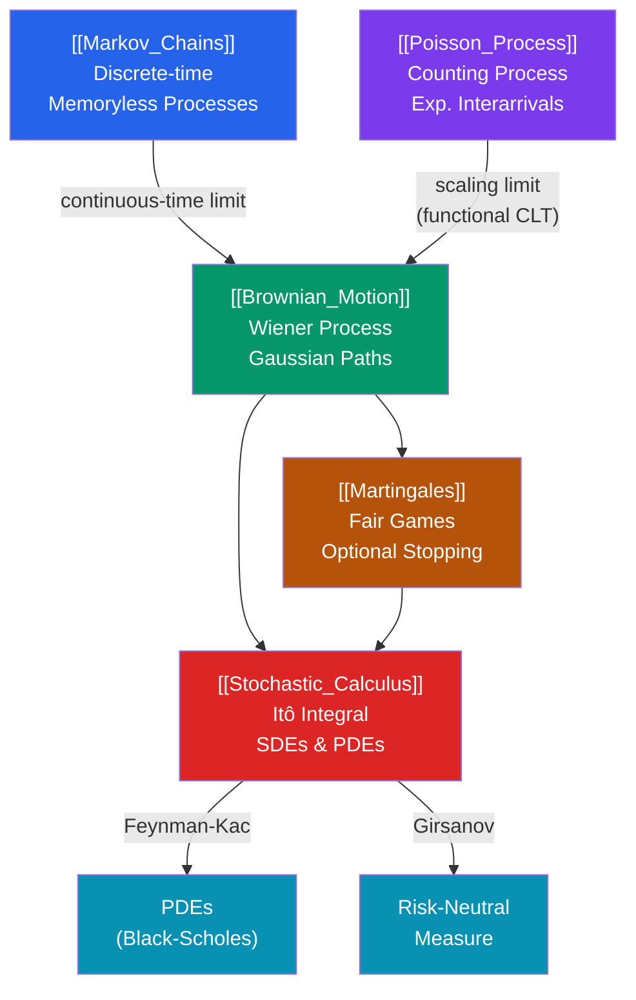

# 🎲 Stochastic Processes — Map of Content

> [!abstract] Overview
> Stochastic processes model systems that evolve randomly over time — from Markov chains and Poisson processes through Brownian motion and Itô calculus. This vault section covers the mathematical foundation of quantitative finance, physics, and probabilistic machine learning: five interconnected notes progressing from discrete-state Markov models to the continuous-path calculus of Brownian motion.

---

## Concept Map



---

## Notes in This Section

| Note | Core Topics | Difficulty |
|---|---|---|
| [[Markov_Chains]] | Transition matrices, stationary distributions, ergodic theorem, Gambler's ruin, MCMC | Advanced |
| [[Poisson_Process]] | Counting process, exponential interarrivals, superposition, thinning, compound Poisson | Advanced |
| [[Brownian_Motion]] | Wiener process, quadratic variation, GBM, Donsker's theorem, reflection principle | Graduate |
| [[Martingales]] | Filtrations, OST, Doob's inequalities, convergence, change of measure | Graduate |
| [[Stochastic_Calculus]] | Itô integral, Itô's lemma, SDEs (GBM/OU/CIR), Girsanov, Feynman-Kac, Black-Scholes | Graduate |

---

## Learning Paths

### Path 1 — Probability Theory Foundation
Start here if you have a solid background in probability (measure theory helpful but not required):

```
Markov_Chains → Poisson_Process → Brownian_Motion → Martingales → Stochastic_Calculus
```

1. **[[Markov_Chains]]** — Build intuition for state-space models; discrete-time memoryless dynamics; stationary distributions and ergodic theorem
2. **[[Poisson_Process]]** — Move to continuous time; counting processes; exponential waiting times; independent increments
3. **[[Brownian_Motion]]** — Continuous-path processes; Gaussian increments; nowhere-differentiable paths; the central object of modern probability
4. **[[Martingales]]** — Abstract the "fair game" structure; filtrations; OST; Doob's inequalities (prerequisite for Girsanov)
5. **[[Stochastic_Calculus]]** — Itô integration and SDEs; the payoff of all previous theory — Black-Scholes and PDE connections

### Path 2 — Quantitative Finance Track
Start here if your goal is derivative pricing and risk models:

```
Brownian_Motion → Stochastic_Calculus → Martingales → Markov_Chains → Poisson_Process
```

1. **[[Brownian_Motion]]** — GBM as stock price model; log-normal distribution; self-similarity
2. **[[Stochastic_Calculus]]** — Itô's lemma for deriving Black-Scholes; GBM solution; Girsanov change of measure; CIR/Vasicek for rates
3. **[[Martingales]]** — Risk-neutral measure and martingale pricing; OST for American options; Doob's inequalities
4. **[[Markov_Chains]]** — Credit rating transitions; regime-switching models; MCMC for calibration
5. **[[Poisson_Process]]** — Jump-diffusion models; compound Poisson for claims; thinning for order book models

### Path 3 — Probabilistic ML / MCMC Track

```
Markov_Chains → Martingales → Brownian_Motion → Stochastic_Calculus
```

1. **[[Markov_Chains]]** — Detailed balance and MCMC; Metropolis-Hastings; mixing times
2. **[[Martingales]]** — Foster-Lyapunov conditions for geometric ergodicity; OST for stopping rules
3. **[[Brownian_Motion]]** — Langevin dynamics; overdamped Langevin SDE
4. **[[Stochastic_Calculus]]** — Langevin MCMC via SDEs; Feynman-Kac for normalising constants

---

## Key Connections to Other Sections

| Related Area | Connection | Link |
|---|---|---|
| Probability Theory | Foundations: measure, expectation, CLT → provides the language | [[../06_Probability_Theory/_MOC_Probability_Theory\|Probability Theory MOC]] |
| Measure Theory | Rigorous foundations: σ-algebras, filtrations, Radon-Nikodym | [[../12_Measure_Theory/_MOC_Measure_Theory\|Measure Theory MOC]] |
| Optimization | Stochastic gradient descent as discrete-time stochastic process; Hamilton-Jacobi-Bellman equation | [[../16_Optimization/_MOC_Optimization\|Optimization MOC]] |
| Quantitative Finance | Black-Scholes; derivatives pricing; interest rate models; risk measures | Quantitative Finance vault |
| Time Series Analysis | ARMA/GARCH as discrete-time stochastic processes; covariance stationarity | Time Series Analysis vault |

---

## Core Theorems at a Glance

| Theorem | Statement (informal) | Note |
|---|---|---|
| Ergodic theorem | For irreducible aperiodic chain, time average → stationary distribution | [[Markov_Chains]] |
| Chapman-Kolmogorov | $n$-step transition = matrix power $P^n$ | [[Markov_Chains]] |
| Poisson superposition | Sum of independent Poisson processes is Poisson | [[Poisson_Process]] |
| Thinning | Independent thinned Poisson processes are independent | [[Poisson_Process]] |
| Donsker's theorem | Scaled random walk → Brownian motion weakly | [[Brownian_Motion]] |
| Reflection principle | $P(\max W \geq a) = 2P(W(t) \geq a)$ | [[Brownian_Motion]] |
| Optional stopping | $E[X_T] = E[X_0]$ for integrable martingales | [[Martingales]] |
| Doob's $L^p$ | Running max controlled by terminal value in $L^p$ | [[Martingales]] |
| Itô's lemma | $df = f'\,dX + \tfrac{1}{2}f''\,d[X]$ (Itô correction) | [[Stochastic_Calculus]] |
| Girsanov's theorem | Change of measure removes drift; BM → BM with drift | [[Stochastic_Calculus]] |
| Feynman-Kac formula | Conditional expectations of SDEs solve parabolic PDEs | [[Stochastic_Calculus]] |

---

## Prerequisites

- **Probability theory:** Random variables, expectation, conditional expectation, CLT, convergence modes
- **Linear algebra:** Matrix multiplication (for $P^n$); eigenvalues (for spectral methods)
- **Real analysis / Measure theory (for graduate notes):** $\sigma$-algebras, $L^p$ spaces, dominated convergence
- **Ordinary differential equations:** Useful for Feynman-Kac and SDE solutions

---

## Review Questions (Cross-Section)

1. What makes the Poisson process a special case of a continuous-time Markov chain? What is its generator matrix?
2. How does Donsker's invariance principle connect Markov chains (random walk) to Brownian motion?
3. Explain why $W(t)$ is a martingale but also a Markov process. Are all Markov processes martingales?
4. State the Feynman-Kac formula and use it to identify the PDE whose solution gives the Black-Scholes call price.
5. What common structural idea links: (a) stationary distributions of Markov chains, (b) the Poisson process thinning property, and (c) the risk-neutral measure in finance?

---

## Sources

- Norris, *Markov Chains*, Cambridge University Press
- Ross, *Introduction to Probability Models*, Ch. 4–6
- Karatzas & Shreve, *Brownian Motion and Stochastic Calculus*
- Williams, *Probability with Martingales*, Cambridge University Press
- Shreve, *Stochastic Calculus for Finance II*
- Øksendal, *Stochastic Differential Equations*, 6th ed.

#stochastic-processes #MOC #mathematics #markov-chains #brownian-motion #martingales #ito-calculus
