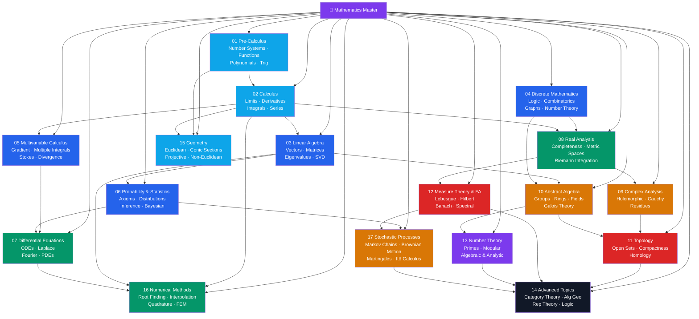

# 📐 Mathematics — Master Map of Content

> [!abstract] About This Vault
> A complete mathematics reference: **112 notes across 17 sections**, covering the full arc from senior secondary school through PhD-level research mathematics. Every note pairs an intuition-first analogy with rigorous definitions, LaTeX formulas, Mermaid diagrams, and real-world applications. The vault is organised by mathematical maturity — start anywhere that matches your current level and follow the learning paths upward. Cross-linked to the AI/ML, Physics, Econometrics, and Quantitative Finance vaults where mathematical tools apply directly.

## Vault Architecture

## Sections at a Glance

| # | Section | Notes | Entry Point | Level |
|---|---------|-------|-------------|-------|
| 01 | Pre-Calculus | 5 | [[_MOC_Pre_Calculus]] | Secondary |
| 02 | Calculus | 7 | [[_MOC_Calculus]] | Secondary → Year 1 |
| 03 | Linear Algebra | 7 | [[_MOC_Linear_Algebra]] | Year 1–2 |
| 04 | Discrete Mathematics | 6 | [[_MOC_Discrete_Mathematics]] | Year 1–2 |
| 05 | Multivariable Calculus | 5 | [[_MOC_Multivariable_Calculus]] | Year 2 |
| 06 | Probability & Statistics | 6 | [[_MOC_Probability_and_Statistics]] | Year 2 |
| 07 | Differential Equations | 6 | [[_MOC_Differential_Equations]] | Year 2–3 |
| 08 | Real Analysis | 6 | [[_MOC_Real_Analysis]] | Year 3 |
| 09 | Complex Analysis | 5 | [[_MOC_Complex_Analysis]] | Year 3–4 |
| 10 | Abstract Algebra | 6 | [[_MOC_Abstract_Algebra]] | Year 3–4 |
| 11 | Topology | 5 | [[_MOC_Topology]] | Graduate |
| 12 | Measure Theory & FA | 6 | [[_MOC_Measure_Theory_and_Functional_Analysis]] | Graduate |
| 13 | Number Theory | 5 | [[_MOC_Number_Theory]] | Graduate |
| 14 | Advanced Topics | 5 | [[_MOC_Advanced_Topics]] | PhD |
| 15 | Geometry | 5 | [[_MOC_Geometry]] | Secondary → Advanced |
| 16 | Numerical Methods | 6 | [[_MOC_Numerical_Methods]] | Year 2 → Graduate |
| 17 | Stochastic Processes | 5 | [[_MOC_Stochastic_Processes]] | Graduate |

---

## Learning Paths

### Path 1 — A-Level / IB Student

> Best for: Secondary school students preparing for university mathematics.

**Pre-Calculus → Calculus → Linear Algebra foundations**

[[Number_Systems_and_Real_Line]] → [[Functions_and_Graphs]] → [[Polynomial_and_Rational_Functions]] → [[Exponential_and_Logarithmic_Functions]] → [[Trigonometry]] → [[Limits_and_Continuity]] → [[Differentiation]] → [[Applications_of_Derivatives]] → [[Riemann_Integration]] → [[Techniques_of_Integration]] → [[Sequences_and_Series]] → [[Vectors_and_Vector_Spaces]] → [[Matrices_and_Determinants]]

---

### Path 2 — Engineering / Physics Undergraduate

> Best for: Students needing mathematics as a tool for modelling physical systems.

**Calculus → Linear Algebra → Multivariable → ODEs → PDEs → Probability**

[[Differentiation]] → [[Riemann_Integration]] → [[Matrices_and_Determinants]] → [[Eigenvalues_and_Eigenvectors]] → [[Partial_Derivatives]] → [[Multiple_Integrals]] → [[Integral_Theorems]] → [[First_Order_ODEs]] → [[Second_Order_Linear_ODEs]] → [[Systems_of_ODEs]] → [[Laplace_Transform]] → [[Fourier_Analysis]] → [[Introduction_to_PDEs]] → [[Probability_Theory]] → [[Common_Probability_Distributions]]

---

### Path 3 — Pure Mathematics Undergraduate

> Best for: Mathematics majors building rigorous foundations.

**Discrete (proofs) → Real Analysis → Abstract Algebra → Complex Analysis**

[[Logic_and_Proof_Techniques]] → [[Set_Theory_and_Relations]] → [[Real_Numbers_and_Completeness]] → [[Sequences_and_Limits_in_Analysis]] → [[Continuity_and_Uniform_Continuity]] → [[Differentiation_Real_Analysis]] → [[Riemann_Integration_Analysis]] → [[Metric_Spaces]] → [[Groups_and_Subgroups]] → [[Cosets_and_Lagrange_Theorem]] → [[Rings_and_Ideals]] → [[Fields_and_Field_Extensions]] → [[Complex_Numbers_and_Functions]] → [[Holomorphic_Functions]] → [[Cauchy_Theorem_and_Integral_Formula]] → [[Residue_Theorem_and_Applications]]

---

### Path 4 — Data Scientist / ML Engineer

> Best for: Practitioners wanting the mathematical theory behind machine learning.

**Linear Algebra → Probability → Statistics → Multivariable (optimisation) → Functional Analysis**

[[Vectors_and_Vector_Spaces]] → [[Eigenvalues_and_Eigenvectors]] → [[Singular_Value_Decomposition]] → [[Inner_Product_Spaces]] → [[Probability_Theory]] → [[Random_Variables]] → [[Common_Probability_Distributions]] → [[Statistical_Inference]] → [[Regression_and_Correlation]] → [[Bayesian_Statistics]] → [[Partial_Derivatives]] → [[Gradient and Lagrange: see Partial_Derivatives]] → [[Multiple_Integrals]] → [[Hilbert_Spaces]] → [[Lp_Spaces]]

---

### Path 6 — Scientific Computing / Numerical Analyst

> Best for: Students applying mathematics computationally — simulation, FEM, scientific ML.

Calculus → Linear Algebra → ODEs → Numerical Methods → Stochastic

[[Error_Analysis_and_Floating_Point]] → [[Root_Finding]] → [[Interpolation_and_Approximation]] → [[Numerical_Integration]] → [[Numerical_Linear_Algebra]] → [[Numerical_ODEs_and_PDEs]] → [[Markov_Chains]] → [[Brownian_Motion]] → [[Stochastic_Calculus]]

---

### Path 7 — Quantitative Finance

> Best for: Practitioners in derivatives, risk management, or algorithmic trading.

Probability → Statistics → Stochastic Calculus → Numerical Methods

[[Probability_Theory]] → [[Random_Variables]] → [[Common_Probability_Distributions]] → [[Statistical_Inference]] → [[Regression_and_Correlation]] → [[Bayesian_Statistics]] → [[Markov_Chains]] → [[Poisson_Process]] → [[Brownian_Motion]] → [[Martingales]] → [[Stochastic_Calculus]] → [[Numerical_ODEs_and_PDEs]] → [[Numerical_Integration]]

---

### Path 5 — Graduate / Research Mathematics

> Best for: Graduate students or researchers needing the full theoretical toolkit.

**Analysis → Topology → Algebra → Advanced**

[[Metric_Spaces]] → [[Measure_Theory]] → [[Lebesgue_Integration]] → [[Lp_Spaces]] → [[Banach_Spaces]] → [[Hilbert_Spaces]] → [[Spectral_Theory]] → [[Topological_Spaces]] → [[Compactness_and_Connectedness]] → [[Fundamental_Group]] → [[Homology_and_Cohomology]] → [[Galois_Theory]] → [[Fields_and_Field_Extensions]] → [[Algebraic_Number_Theory]] → [[Analytic_Number_Theory]] → [[Category_Theory]] → [[Algebraic_Geometry]] → [[Differential_Geometry]] → [[Representation_Theory]] → [[Mathematical_Logic_and_Set_Theory]]

---

## Key Theorems at a Glance

| Theorem | Statement (informal) | Section |
|---------|----------------------|---------|
| Fundamental Theorem of Calculus | Differentiation and integration are inverses | [[_MOC_Calculus]] |
| Rank-Nullity Theorem | dim(ker T) + dim(im T) = dim(V) | [[Linear_Transformations]] |
| Fundamental Theorem of Algebra | Every degree-n polynomial has n complex roots | [[Polynomial_and_Rational_Functions]] |
| Intermediate Value Theorem | Continuous function on [a,b] takes every value | [[Limits_and_Continuity]] |
| Mean Value Theorem | f'(c) = (f(b)-f(a))/(b-a) for some c | [[Differentiation_Real_Analysis]] |
| Bolzano-Weierstrass | Every bounded sequence has a convergent subsequence | [[Sequences_and_Limits_in_Analysis]] |
| Heine-Borel | Compact ↔ closed and bounded (in ℝⁿ) | [[Compactness_and_Connectedness]] |
| Cauchy's Integral Formula | f(z₀) = (1/2πi)∮f(z)/(z-z₀)dz | [[Cauchy_Theorem_and_Integral_Formula]] |
| Residue Theorem | ∮f dz = 2πi Σ Res(f,zₖ) | [[Residue_Theorem_and_Applications]] |
| Lagrange's Theorem | \|H\| divides \|G\| for finite groups | [[Cosets_and_Lagrange_Theorem]] |
| Fundamental Theorem of Galois Theory | Subgroups ↔ intermediate fields | [[Galois_Theory]] |
| Dominated Convergence Theorem | lim∫fₙ = ∫lim fₙ under domination | [[Lebesgue_Integration]] |
| Hahn-Banach Theorem | Linear functionals can be extended | [[Banach_Spaces]] |
| Prime Number Theorem | π(x) ~ x/ln(x) | [[Analytic_Number_Theory]] |
| Gödel's Incompleteness | Consistent arithmetic systems have unprovable truths | [[Mathematical_Logic_and_Set_Theory]] |

---

## Cross-Vault Connections

| This Vault | Connects To | Why |
|------------|-------------|-----|
| [[Eigenvalues_and_Eigenvectors]] | AI-ML vault (PCA, SVMs) | PCA = SVD on centred data; kernel methods use RKHS |
| [[Probability_Theory]] + [[Bayesian_Statistics]] | AI-ML vault | Probabilistic ML, Bayesian inference |
| [[Differential_Equations]] | Physics vault | Newton's laws, Maxwell's equations, Schrödinger |
| [[Regression_and_Correlation]] | Econometrics vault | OLS is the foundation of all econometric models |
| [[Fourier_Analysis]] | Time Series Analysis vault | Spectral analysis, periodogram |
| [[Probability_Theory]] + [[Common_Probability_Distributions]] | Quantitative Finance vault | Stochastic processes, option pricing |
| [[Measure_Theory]] + [[Lebesgue_Integration]] | Quantitative Finance vault | Rigorous foundation of stochastic calculus |
| [[Number_Theory_Elementary]] + [[Modular_Arithmetic]] | Cybersecurity vault | RSA, elliptic curve cryptography |
| [[Graph_Theory]] | DSA vault | Algorithm analysis on graphs |
| [[Stochastic_Calculus]] + [[Brownian_Motion]] | Quantitative Finance vault | Black-Scholes derivation, Itô SDE models |
| [[Markov_Chains]] | AI-ML vault | MCMC, hidden Markov models, reinforcement learning |
| [[Numerical_ODEs_and_PDEs]] + [[Numerical_Linear_Algebra]] | Physics vault | FEM, finite difference solvers |
| [[Conic_Sections]] + [[Non_Euclidean_Geometry]] | Physics vault | Orbital mechanics, general relativity |

---

## Note Count by Level

| Level | Sections | Notes |
|-------|----------|-------|
| Senior Secondary | 01–02 | 12 |
| Undergraduate Year 1–2 | 03–06 | 24 |
| Undergraduate Year 2–3 | 07–08 | 12 |
| Undergraduate Year 3–4 / Early Grad | 09–10 | 11 |
| Graduate | 11–13, 17 | 21 |
| PhD | 14 | 5 |
| Secondary → Advanced | 15 | 5 |
| Year 2 → Graduate | 16 | 6 |
| Section MOCs | all | 17 |
| **Total** | **17** | **112** |

#mathematics #MOC #MasterMOC
