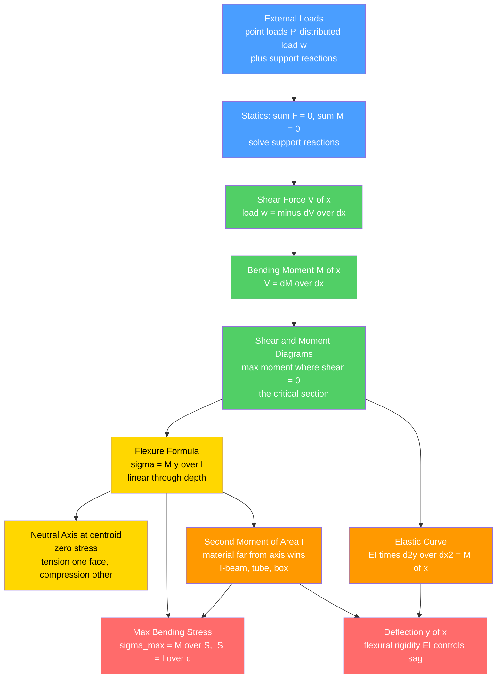

# 🏗️ Bending and Beam Theory

> [!abstract] TL;DR
> A **beam** carries loads applied *perpendicular* to its axis by **bending**. Statics converts the external loads into internal **shear force** $V(x)$ and **bending moment** $M(x)$ distributions, linked by $w = -\,dV/dx$ and $V = dM/dx$; plotting them (the **shear-force and bending-moment diagrams**) locates the maximum moment — the *critical section*. The **flexure formula** $\sigma = M y / I$ gives a stress that is **linear through the depth**: tension on one face, compression on the other, **zero at the neutral axis** (the centroid), maximum at the outer surface $y = c$. The geometric property that matters is the **second moment of area** $I$ — putting material far from the neutral axis (an **I-beam**, tube, or box) makes $I$ large and stress small, which is *why beams are I-shaped*. Deflection follows the **elastic curve** $EI\,d^2y/dx^2 = M(x)$, controlled by the **flexural rigidity** $EI$. Strength (stress) and stiffness (deflection) are separate design checks.

---

## Intuition

**Analogy first.** Stand on the end of a diving board and it bends into a graceful curve. Look closely at what happens *inside* the board: the **top surface stretches** (tension), the **bottom surface squeezes** (compression), and somewhere in the middle there is a layer where *nothing changes at all* — the **neutral axis**. That single observation is the whole secret of beams. Because the stretch grows linearly from that neutral layer outward, the material near the top and bottom surfaces does almost *all* the work, while the material near the middle barely earns its keep.

That is exactly *why* structural steel is rolled into **I-beams**: the two flanges sit far from the neutral axis where the stress is highest (so they carry the bending), the thin web just holds them apart (and carries the shear), and the wasteful middle material is simply removed. Beam theory turns this picture into numbers — telling you *how much* a beam bends and *where* it is most stressed — so that bridges do not sag, floors do not deflect underfoot, and machine shafts do not snap.

---

## How It Works

### Core Mechanics

1. **Model the beam and its supports.** Idealize the member as a line carrying **transverse loads**: point loads $P$, distributed loads $w(x)$ (force per length), and applied moments. Replace supports with **reactions** — a pin gives a force, a roller a single-direction force, a fixed (built-in) end gives both a force *and* a reaction moment.
2. **Solve statics for the reactions.** Apply $\sum F = 0$ and $\sum M = 0$. For statically determinate beams (simply-supported, cantilever, overhanging) this fully determines the reactions.
3. **Cut and expose internal forces.** Make an imaginary cut at position $x$ and apply equilibrium to the piece. What is exposed is the **internal shear force** $V(x)$ (the transverse force the two halves exchange) and the **internal bending moment** $M(x)$ (the couple that resists rotation).
4. **Use the fundamental relations.** Along the span, $\dfrac{dV}{dx} = -w(x)$ and $\dfrac{dM}{dx} = V(x)$. So the shear is the *integral of the load* and the moment is the *integral of the shear*. This is why the **max bending moment occurs where the shear crosses zero**.
5. **Draw the diagrams.** The $V(x)$ and $M(x)$ curves are the essential beam-analysis output. Their peaks mark the **critical sections** where the material is worked hardest.
6. **Apply the flexure formula.** At the critical section, $\sigma = \dfrac{M\,y}{I}$ — stress varies **linearly through the depth**, zero at the neutral axis, maximum $\sigma_{max} = \dfrac{M c}{I} = \dfrac{M}{S}$ at the extreme fibre ($y = c$), where $S = I/c$ is the **section modulus**.
7. **Check deflection.** Integrate the **elastic curve** $EI\,\dfrac{d^2y}{dx^2} = M(x)$ twice, applying boundary conditions, to get the sag $y(x)$. The **flexural rigidity** $EI$ sets the stiffness.

### Flow / Architecture



---

## Key Concepts

### Secondary Level

- **A beam bends under sideways loads.** Push down on the middle of a shelf and it curves; the top gets shorter-feeling (squeezed) and the bottom stretches.
- **Shear force** = the net sideways force the beam must transmit at a cut. **Bending moment** = how hard the loads try to rotate/curve the beam there.
- **Tension and compression on opposite faces.** In a downward-loaded simply-supported beam, the *bottom* fibres stretch (tension) and the *top* fibres squeeze (compression).
- **Shape matters more than amount.** A plank laid flat sags badly; the *same* plank turned on edge is far stiffer and stronger — because depth is what counts.

### Undergraduate Level

- **Fundamental relations:** $w(x) = -\dfrac{dV}{dx}$ and $V(x) = \dfrac{dM}{dx}$. Load integrates to shear; shear integrates to moment. Concentrated loads cause *jumps* in $V$; concentrated moments cause *jumps* in $M$.
- **Flexure formula:** $\sigma = \dfrac{M y}{I}$, derived from the *plane-sections-remain-plane* kinematics (strain $\varepsilon = -y/\rho$) plus Hooke's law $\sigma = E\varepsilon$. The **neutral axis passes through the centroid** of the cross-section.
- **Second moment of area:** $I = \displaystyle\int_A y^2 \, dA$. For a rectangle $I = \dfrac{b h^3}{12}$; the $h^3$ dependence is why depth dominates. The **parallel-axis theorem** $I = I_c + A d^2$ explains the I-beam: flange area $A$ times a large offset $d$ squared.
- **Section modulus** $S = I/c$; then $\sigma_{max} = M/S$. Design a beam by requiring $S \ge M_{max}/\sigma_{allow}$.
- **Transverse shear stress:** $\tau = \dfrac{V Q}{I b}$, *maximum at the neutral axis* (opposite to bending stress) — governs short, deep beams and web design.
- **Elastic curve:** $EI\,\dfrac{d^2y}{dx^2} = M(x)$ (Euler-Bernoulli). Integrate twice with boundary conditions. Standard results: simply-supported UDL $\delta_{max} = \dfrac{5 w L^4}{384 EI}$; central point load $\delta_{max} = \dfrac{P L^3}{48 EI}$; cantilever tip load $\delta = \dfrac{P L^3}{3 EI}$.
- **Supports & determinacy:** simply-supported, cantilever (fixed-free), fixed-fixed, overhanging, propped cantilever. Statically indeterminate beams need compatibility (deflection) conditions in addition to statics.
- **Superposition:** for linear-elastic beams, deflections and moments from separate loads simply add.

### Graduate Level

- **Beyond Euler-Bernoulli:** **Timoshenko beam theory** adds shear deformation and rotary inertia, important for deep beams (span/depth ≲ 10) and high-frequency vibration; it drops the "plane sections stay perpendicular to the axis" assumption.
- **Unsymmetric and inclined bending:** for sections without a plane of symmetry, use the full tensor form $\sigma = \dfrac{M_z I_y + M_y I_{yz}}{I_y I_z - I_{yz}^2}\,y - \dots$; bending and the load plane need not align, introducing the **shear centre** to avoid twist.
- **Composite and reinforced beams:** transformed-section method (e.g., reinforced concrete, sandwich panels, fibre composites) — see composite mechanics.
- **Plastic bending:** past yield the stress block redistributes; the **plastic moment** $M_p = \sigma_y Z$ (plastic section modulus $Z$) and **shape factor** $Z/S$ underlie limit-state / plastic design.
- **Stability coupling:** slender members in compression fail by **Euler buckling** $P_{cr} = \dfrac{\pi^2 EI}{(KL)^2}$ — a *stiffness/stability* failure, not a strength failure — and thin flanges/webs suffer **local buckling** and **lateral-torsional buckling**.
- **Beam on elastic foundation:** $EI\,\dfrac{d^4y}{dx^4} + k\,y = w(x)$ (Winkler model) governs rails, pipelines, and — at planetary scale — the flexure of the lithosphere.
- **Energy methods:** Castigliano's theorem and virtual work give deflections directly from strain energy $U = \displaystyle\int \dfrac{M^2}{2EI}\,dx$, and feed the finite-element stiffness formulation.

---

## Python Demo

```python
# Bending and Beam Theory demo
#   (a) Shear-force and bending-moment diagrams for a simply-supported beam
#       under a uniform distributed load + a central point load.
#       Shear from the load, moment as the INTEGRAL of the shear (M = int V dx).
#   (b) Bending stress sigma = M*c/I and a rectangular-vs-I-beam comparison
#       at EQUAL cross-sectional area -> the I-beam's far larger I -> lower stress.
#   (c) The deflection (elastic) curve by superposition of standard cases.
import numpy as np
import matplotlib.pyplot as plt

# ---------------------------------------------------------------
# (a) SHEAR & MOMENT DIAGRAMS  (units: N and m)
# ---------------------------------------------------------------
L  = 6.0            # span, m
w  = 5.0e3          # uniform distributed load, N/m
P  = 20.0e3         # central point load, N
a  = L / 2.0        # point-load location, m

# Reactions of a simply-supported beam (symmetric loading -> equal reactions)
W_total = w * L + P
R_A = R_B = W_total / 2.0          # 25 kN each

x  = np.linspace(0, L, 2001)
dx = x[1] - x[0]

# Shear: reaction, minus the accumulated distributed load, minus point load once passed
V = R_A - w * x - P * np.heaviside(x - a, 1.0)

# Moment as the running integral of the shear (cumulative trapezoid); M(0)=0 at a pin
M = np.concatenate(([0.0], np.cumsum(0.5 * (V[:-1] + V[1:]) * dx)))

i_max = np.argmax(np.abs(M))
M_max = M[i_max]                   # N*m
print(f"(a) Reactions R_A = R_B = {R_A/1e3:.1f} kN")
print(f"    Max |bending moment| = {M_max/1e3:.2f} kN*m at x = {x[i_max]:.2f} m "
      f"(shear there = {V[i_max]/1e3:.2f} kN ~ 0)")

# ---------------------------------------------------------------
# (b) SECTION PROPERTIES & BENDING STRESS  (units: mm and mm^4)
# ---------------------------------------------------------------
def rect_props(b, h):
    A = b * h
    I = b * h**3 / 12.0
    c = h / 2.0
    return A, I, c

def ibeam_props(bf, tf, tw, H):
    hw = H - 2 * tf                 # clear web height
    A  = 2 * bf * tf + tw * hw
    I_web = tw * hw**3 / 12.0
    d  = (H - tf) / 2.0             # flange-centroid to neutral axis
    I_fl = bf * tf**3 / 12.0 + bf * tf * d**2   # parallel-axis theorem
    I  = I_web + 2 * I_fl
    c  = H / 2.0
    return A, I, c

# Rectangle: 50 mm x 120 mm  ->  A = 6000 mm^2
b_r, h_r = 50.0, 120.0
A_r, I_r, c_r = rect_props(b_r, h_r)

# I-beam of EQUAL area, but taller (H = 240 mm); solve web thickness for equal area
bf, tf, H = 120.0, 15.0, 240.0
tw = (A_r - 2 * bf * tf) / (H - 2 * tf)         # forces equal area
A_i, I_i, c_i = ibeam_props(bf, tf, tw, H)

Mc = M_max * 1.0e3                 # convert N*m -> N*mm for stress (mm units)
sigma_r = Mc * c_r / I_r           # MPa  (N/mm^2)
sigma_i = Mc * c_i / I_i           # MPa

print(f"\n(b) Equal area  A_rect = {A_r:.0f} mm^2 ,  A_Ibeam = {A_i:.0f} mm^2")
print(f"    I_rect  = {I_r:.3e} mm^4   ->  sigma_max = {sigma_r:6.1f} MPa")
print(f"    I_Ibeam = {I_i:.3e} mm^4   ->  sigma_max = {sigma_i:6.1f} MPa")
print(f"    I ratio  = {I_i/I_r:5.2f}x  ,  stress ratio = {sigma_i/sigma_r:5.2f}x "
      f"(I-beam far lower for the SAME material)")

# ---------------------------------------------------------------
# (c) DEFLECTION CURVE by superposition  (units: N and mm)
# ---------------------------------------------------------------
E  = 200.0e3                       # steel Young's modulus, MPa (N/mm^2)
I_defl = I_i                       # use the I-beam section
Lmm = L * 1.0e3                    # span in mm
xm  = np.linspace(0, Lmm, 2001)
w_mm = w / 1.0e3                   # N/m -> N/mm

# UDL, simply supported: y = w x (L^3 - 2 L x^2 + x^3) / (24 EI)
y_udl = w_mm * xm * (Lmm**3 - 2 * Lmm * xm**2 + xm**3) / (24.0 * E * I_defl)
# Central point load: piecewise, symmetric about mid-span
xr = np.where(xm <= Lmm / 2, xm, Lmm - xm)
y_pt = P * xr * (3 * Lmm**2 - 4 * xr**2) / (48.0 * E * I_defl)
y = y_udl + y_pt                   # total downward deflection, mm

print(f"\n(c) Max deflection = {y.max():.2f} mm  (span/{Lmm/y.max():.0f}); "
      f"typical serviceability limit ~ span/360 = {Lmm/360:.1f} mm")

# ---------------------------------------------------------------
# PLOTS
# ---------------------------------------------------------------
fig, ax = plt.subplots(2, 2, figsize=(13, 8))

# Shear diagram
ax[0, 0].fill_between(x, V / 1e3, 0, color="#4a9eff", alpha=0.35)
ax[0, 0].plot(x, V / 1e3, color="#1c6fd6", lw=2)
ax[0, 0].axhline(0, color="k", lw=0.8)
ax[0, 0].set_title("(a) Shear-Force Diagram  V(x)")
ax[0, 0].set_xlabel("x  [m]"); ax[0, 0].set_ylabel("V  [kN]"); ax[0, 0].grid(alpha=0.3)

# Moment diagram (plotted sagging-positive downward, engineering convention)
ax[0, 1].fill_between(x, M / 1e3, 0, color="#51cf66", alpha=0.35)
ax[0, 1].plot(x, M / 1e3, color="#2f9e44", lw=2)
ax[0, 1].plot(x[i_max], M_max / 1e3, "ro")
ax[0, 1].annotate(f"M_max = {M_max/1e3:.1f} kN*m\nat x = {x[i_max]:.2f} m",
                  xy=(x[i_max], M_max / 1e3), xytext=(0.15, 0.35),
                  textcoords="axes fraction",
                  arrowprops=dict(arrowstyle="->", color="r"))
ax[0, 1].axhline(0, color="k", lw=0.8)
ax[0, 1].set_title("(b) Bending-Moment Diagram  M(x)")
ax[0, 1].set_xlabel("x  [m]"); ax[0, 1].set_ylabel("M  [kN*m]"); ax[0, 1].grid(alpha=0.3)

# Section comparison: I and resulting stress at equal area
labels = ["Rectangle\n50x120", "I-beam\nH=240"]
xb = np.arange(2)
axb = ax[1, 0]
bars = axb.bar(xb, [I_r / 1e6, I_i / 1e6], color=["#ff9900", "#ff6b6b"], alpha=0.8)
axb.set_xticks(xb); axb.set_xticklabels(labels)
axb.set_ylabel("Second moment of area  I  [10^6 mm^4]")
axb.set_title("(c) Equal Area -> I-beam has far larger I")
for bar, s in zip(bars, [sigma_r, sigma_i]):
    axb.text(bar.get_x() + bar.get_width() / 2, bar.get_height(),
             f"sigma_max\n{s:.0f} MPa", ha="center", va="bottom", fontsize=9)
axb.grid(alpha=0.3, axis="y")

# Deflection curve (sag drawn downward)
axd = ax[1, 1]
axd.plot(xm / 1e3, -y, color="#9b59b6", lw=2)
axd.fill_between(xm / 1e3, -y, 0, color="#9b59b6", alpha=0.20)
axd.axhline(0, color="k", lw=0.8)
axd.set_title("(d) Deflection Curve (elastic curve, I-beam)")
axd.set_xlabel("x  [m]"); axd.set_ylabel("deflection  [mm] (down)")
axd.grid(alpha=0.3)

plt.tight_layout()
plt.savefig("beam_bending_demo.png", dpi=120)
print("\nSaved figure -> beam_bending_demo.png")
```

**What it shows.** Part (a) draws the classic shear and moment diagrams and confirms the max moment sits where the shear crosses zero. Part (b) proves the headline of beam design: two cross-sections of *identical area* have wildly different bending resistance — the I-beam's second moment of area is several times larger, so at the same bending moment its peak stress is a fraction of the solid rectangle's. Part (c) integrates the standard-case deflections and reports the sag against the usual span/360 serviceability limit — illustrating that a beam can be plenty strong yet still too *flexible*.

---

## Real-World Applications

- **Building floors and roof beams** — steel I-beams (W-shapes) and reinforced-concrete beams sized so $\sigma_{max} = M/S \le \sigma_{allow}$ *and* $\delta \le L/360$; the deflection check often governs.
- **Bridges** — girder and box-girder spans; the moment envelope from moving traffic loads drives flange sizing, and the box section resists both bending and torsion.
- **Machine and vehicle frames, chassis, and rails** — bending is the dominant load path; rails are a textbook *beam on elastic foundation*.
- **Rotating shafts** — carry transverse bending from gear/belt loads *combined* with torsion; the resultant fibre stress sets the diameter (see companion torsion analysis).
- **Aircraft wings and ship hulls** — the wing is a cantilever beam in lift; the hull is a giant beam in "hogging" and "sagging" over waves. Spar caps are the flanges placed far from the neutral axis.
- **Consumer products and nature** — cantilevered shelves, diving boards, springboards, tree branches, and long bones (a femur is a near-optimal hollow bending member) all obey the same $\sigma = My/I$.

> **Example:** A standard steel wide-flange section like a **W12×26** concentrates roughly 90% of its area in the two flanges, precisely where $\sigma = My/I$ is largest, while the thin web mostly carries the transverse shear $\tau = VQ/Ib$. That is $\sigma = My/I$ and the parallel-axis theorem turned into a rolled product — maximum bending strength and stiffness for minimum steel.

---

## Common Pitfalls

- **Confusing shear and moment (and their signs).** Beams carry *transverse* loads via *bending*. Remember the calculus chain: $w = -dV/dx$, $V = dM/dx$. Point loads make $V$ *jump*; applied couples make $M$ *jump*. Keep one consistent sign convention (sagging-positive) across the whole problem.
- **Forgetting the max moment is where shear = 0.** Since $dM/dx = V$, the moment peaks (critical section) exactly where the shear passes through zero — not necessarily under the largest load.
- **Using the wrong axis for $I$.** The neutral axis is at the **centroid**, and $I$ must be taken about the *bending axis*. Orient the section correctly — the same plank has $h^3$ vs $b^3$ behaviour depending on which way it is turned. Always add the parallel-axis $Ad^2$ term for flanges.
- **Assuming stress is uniform.** Bending stress is **linear through the depth**: zero at the neutral axis, maximum at the outer fibre $y = c$. The interior material is lightly stressed — the basis for I-beams and hollow tubes.
- **Putting shear and bending stress at the same spot.** Bending stress is *max at the surface*; transverse shear stress $\tau = VQ/Ib$ is *max at the neutral axis*. Deep/short beams can be shear-critical even when bending is fine.
- **Checking strength but not stiffness.** A beam can satisfy $\sigma \le \sigma_{allow}$ yet deflect excessively (bouncy floors, misaligned machinery). Deflection scales with $L^4$ (UDL) and is governed by $EI$; it is a *separate* limit state.
- **Ignoring $EI$ trade-offs.** Flexural rigidity is $E \times I$. A stiffer *material* (higher $E$) and a better *shape* (higher $I$) are interchangeable levers — aluminium ($E \approx 70$ GPa) needs about three times the $I$ of steel ($E \approx 200$ GPa) for equal stiffness.
- **Overlooking buckling.** Slender members in compression (and slender flanges/webs) fail by **Euler buckling** $P_{cr} = \pi^2 EI/(KL)^2$ — a *stability*, not a strength, event. Increasing yield strength does not help; increasing $I$ and reducing effective length does.
- **Misusing superposition.** Adding load cases is valid only while the response is **linear-elastic and small-deflection**. Beyond yield, or for large deflections/follower loads, superposition breaks down.

---

## Related Concepts

- [[Stress_Strain_and_Elastic_Moduli]] — the flexure formula is Hooke's law $\sigma = E\varepsilon$ applied to the linear strain field of a bent section; Young's modulus $E$ is exactly the term in flexural rigidity $EI$.
- [[Rotational_Dynamics]] — the **second moment of area** $I = \int y^2 dA$ is the geometric cousin of the *mass* moment of inertia $\int r^2 dm$; both reward putting material far from the axis, one against bending, the other against angular acceleration.
- [[Second_Order_Linear_ODEs]] — the elastic curve $EI\,y'' = M(x)$ is a second-order linear ODE; solving it with boundary conditions is exactly how beam deflections are obtained.
- [[First_Order_ODEs]] — the fundamental beam relations $dV/dx = -w$ and $dM/dx = V$ are first-order ODEs integrated in sequence to build the shear and moment diagrams.
- [[Isostasy_and_Lithospheric_Flexure]] — planetary-scale beam bending: the lithosphere is modelled as an elastic plate/beam on a fluid foundation, $D\,\nabla^4 w + \rho g\,w = q$, the same physics as a beam on an elastic foundation.

*Sibling notes in this section (planned, referenced in prose): Statics and Equilibrium (supplies the reactions), Stress, Strain and Deformation (the constitutive law), Torsion and Shafts (the twist counterpart of bending), Failure, Fatigue and Fracture (what happens at the critical section), and CAD/CAE and the Finite Element Method (numerical generalization of the elastic curve).*

---

## Review Questions

1. **(Secondary)** A wooden plank spans two chairs and you stand in the middle. Which surface of the plank is in tension and which is in compression, and where inside the plank is there no stretching or squeezing at all? Why is it stiffer if you turn the same plank on its edge?
2. **(Undergraduate)** For a simply-supported beam of span $L$ carrying a central point load $P$, sketch the shear and moment diagrams, state where the maximum moment occurs and its value, and use the flexure formula to write the peak bending stress in terms of $P$, $L$, and the section modulus $S$.
3. **(Undergraduate/Graduate)** You must choose between a solid rectangular bar and an I-beam of *equal cross-sectional area and equal material*. Explain quantitatively (via $I$ and the parallel-axis theorem) why the I-beam carries far more bending, and identify one failure mode for which the I-beam's thin web or flanges could nonetheless be the weak link.
4. **(Graduate)** A cantilever passes both the strength check ($\sigma \le \sigma_{allow}$) but not the deflection limit ($\delta \le L/250$). List three distinct design changes to fix the stiffness problem without changing the load, and rank them by how efficiently each raises $EI$ per unit added weight. When would Euler-Bernoulli theory itself become inaccurate here?

---

## Sources

- Hibbeler, R. C. *Mechanics of Materials*, 10th ed. Pearson. (Chapters on shear/moment diagrams, bending, transverse shear, and deflection.)
- Gere, J. M. & Goodno, B. J. *Mechanics of Materials*, 9th ed. Cengage.
- Beer, F., Johnston, E. R., DeWolf, J. & Mazurek, D. *Mechanics of Materials*, 8th ed. McGraw-Hill.
- Timoshenko, S. *Strength of Materials, Part I & II*. (Classic treatment, including beams on elastic foundation and Timoshenko beam theory.)
- Roark, R. J. & Young, W. C. *Roark's Formulas for Stress and Strain*. McGraw-Hill. (Reference tables of standard beam cases for superposition.)

---

#mechanical-engineering #beam-bending #shear-moment #flexure #deflection
