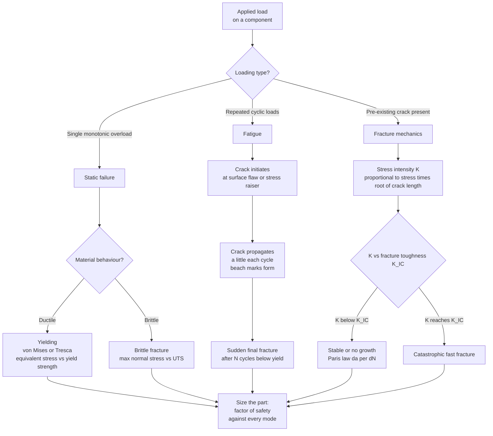

# 🔩 Failure, Fatigue and Fracture

> [!abstract] TL;DR
> Predicting *when* a part breaks is the whole point of stress analysis. There are three failure regimes: (1) **static** overload — ductile parts fail by **yielding** (judged with a multiaxial criterion, **von Mises** or **Tresca**), brittle parts by **fracture**; (2) **fatigue** — the #1 cause of mechanical failure, where cyclic loads *below* the static strength grow tiny cracks cycle-by-cycle until sudden rupture, characterised by the **S-N (Wöhler) curve**, the **endurance limit**, and the **Goodman diagram**; and (3) **fracture mechanics** — a pre-existing crack runs catastrophically when the stress-intensity factor $K$ reaches the fracture toughness $K_{Ic}$, with the **Paris law** governing crack-growth rate. Most disasters (Comet, Aloha 243, Liberty ships, axles, welds) are fatigue or fracture, not static overload.

---

## Intuition

**Analogy:** Bend a paperclip *once* as hard as you dare and nothing happens — it springs back. Now bend it back and forth twenty times through the same modest angle and it snaps clean, even though no single bend came anywhere close to breaking it. That is **fatigue**: repeated loading at a stress far below the material's strength quietly grows a microscopic crack with every cycle until, without warning, the last cycle finishes the job.

This is the central lesson of failure analysis. A designer who only checks "is the stress below the yield strength?" has answered the *easy* question. Real parts — aircraft wings, crankshafts, bridge welds, engine bolts — rarely die from one big overload. They die from millions of small cycles (**fatigue**), or from an invisible crack that was there all along and finally got long enough to run (**fracture mechanics**). Knowing which of the three failure modes threatens your part — and sizing against *all* of them — is what separates a safe design from a headline.

---

## How It Works

Failure prediction starts by asking what *kind* of loading the part sees, because each loading pattern has its own governing physics and its own math. A single monotonic load is a **static** problem solved with a yield or fracture criterion; a fluctuating load is a **fatigue** problem solved with the S-N curve and a mean-stress diagram; a part known to contain a flaw is a **fracture-mechanics** problem solved by comparing the crack-tip stress intensity $K$ against the toughness $K_{Ic}$.



**Static, combined-stress yielding.** A real part is rarely in pure tension; it sees combined normal and shear stresses. To compare a multiaxial stress state against a uniaxial tensile-test yield strength $\sigma_y$, we collapse the full stress tensor into a single **equivalent (effective) stress** using a yield criterion:

$$\sigma_{vM} = \sqrt{\tfrac{1}{2}\left[(\sigma_1-\sigma_2)^2 + (\sigma_2-\sigma_3)^2 + (\sigma_3-\sigma_1)^2\right]} \quad \text{(von Mises)}$$

Yielding is predicted when $\sigma_{vM} \geq \sigma_y$. The **Tresca** (maximum-shear) criterion instead uses $\sigma_1 - \sigma_3 \geq \sigma_y$; it is more conservative and plots as a hexagon inscribed in the von Mises ellipse.

**Fatigue** replaces "stress vs strength" with "stress amplitude vs *number of cycles*." The S-N curve says a part cycling at amplitude $\sigma_a$ survives $N$ cycles; lower amplitude buys exponentially more life. When the load has a non-zero mean, the **Goodman diagram** trades allowable alternating stress against mean stress.

**Fracture mechanics** abandons the idea of a flawless body: it *assumes* a crack of size $a$ exists and asks whether it will run. The answer is set by the stress intensity factor $K_I = Y\sigma\sqrt{\pi a}$ versus the material constant $K_{Ic}$.

---

## Key Concepts

### Secondary Level

**The three ways things break.**

| Mode | Trigger | Warning? | Typical culprit |
|------|---------|----------|-----------------|
| Static overload | One load bigger than the part can take | Ductile: yes (bends first). Brittle: no | Design error, freak load |
| Fatigue | Many cycles below the strength | No — sudden | Vibration, rotation, pressurisation cycles |
| Fracture from a crack | An existing flaw grows to critical size | No — sudden | Weld defect, corrosion pit, machining scratch |

**Ductile vs brittle.** A *ductile* material (mild steel at room temperature, copper, aluminium) stretches and necks visibly before it tears — it gives warning and absorbs a lot of energy. A *brittle* material (glass, cast iron, cold steel) snaps with almost no plastic deformation and little warning. The **same steel can be ductile when warm and brittle when cold** — the ductile-brittle transition.

**Stress concentration.** A hole, notch, sharp corner, or scratch locally multiplies the stress by a factor $K_t$ (often 2–3×). Fatigue cracks almost always start at these "stress raisers," which is why fillets are rounded and aircraft windows are oval, not square.

**Strength is not toughness.** *Strength* is how much stress a material carries; *toughness* is how much energy it absorbs before a crack runs. A glass rod is strong in compression but shatters — high strength, low toughness. Good design needs both.

### Undergraduate Level

**Von Mises vs Tresca yield criteria.** For a ductile part under combined loading, compute the principal stresses $\sigma_1 \geq \sigma_2 \geq \sigma_3$, then:

- **Von Mises (distortion energy):** yield when $\sigma_{vM} \geq \sigma_y$. Matches experiment for most ductile metals; the "default."
- **Tresca (maximum shear):** yield when $\sigma_1 - \sigma_3 \geq \sigma_y$. Simpler, more conservative (predicts yield ~15% earlier in pure shear).

The factor of safety against static yield is $n = \sigma_y / \sigma_{vM}$.

**The S-N (Wöhler) curve.** Rotating-bending fatigue tests at various stress amplitudes produce a curve of stress amplitude $\sigma_a$ versus cycles-to-failure $N_f$ (log scale). In the high-cycle regime it follows **Basquin's law**:

$$\sigma_a = \sigma_f'\,(2N_f)^{b}$$

where $\sigma_f'$ is the fatigue strength coefficient and $b$ (≈ −0.05 to −0.12) the fatigue strength exponent.

**Endurance (fatigue) limit.** Many *ferrous* alloys and titanium show a stress amplitude — the **endurance limit** $S_e$ (roughly $0.5\,S_{ut}$ for steels up to ~1400 MPa) — below which they survive essentially forever ($>10^6$–$10^7$ cycles). **Aluminium and most non-ferrous alloys have *no* true endurance limit** — the S-N curve keeps sloping down, so they must be designed to a finite life. This distinction is why aircraft (aluminium) are life-limited and inspected, while many steel machine parts are designed for "infinite" life.

**Correction factors (Marin).** The polished-lab-specimen $S_e'$ is degraded for real parts:

$$S_e = k_a\,k_b\,k_c\,k_d\,k_e\;S_e'$$

with factors for surface finish ($k_a$ — a rough or corroded surface slashes fatigue life), size ($k_b$), loading type ($k_c$), temperature ($k_d$), and reliability/miscellaneous ($k_e$). Surface finish and stress concentration dominate; a mirror polish can double fatigue life.

**Mean stress — Goodman and Soderberg.** Real loads swing about a non-zero mean $\sigma_m = (\sigma_{max}+\sigma_{min})/2$ with amplitude $\sigma_a = (\sigma_{max}-\sigma_{min})/2$. A tensile mean stress *reduces* the allowable amplitude:

$$\underbrace{\frac{\sigma_a}{S_e} + \frac{\sigma_m}{S_{ut}} = \frac{1}{n}}_{\text{Modified Goodman}}, \qquad \underbrace{\frac{\sigma_a}{S_e} + \frac{\sigma_m}{S_y} = \frac{1}{n}}_{\text{Soderberg (more conservative)}}$$

The safe design region is the area under these lines in the $\sigma_m$–$\sigma_a$ plane, additionally capped by the first-cycle yield line $\sigma_a + \sigma_m \leq S_y$.

**The fatigue fracture surface.** A fatigue break has a tell-tale signature: a smooth region with concentric **beach marks** (ripples marking crack-front positions, often centred on the initiation site) plus a rough final-fracture zone where the remaining ligament tore suddenly. Reading these tells a forensic engineer where the crack started and how the part was loaded.

### Graduate Level

**Linear Elastic Fracture Mechanics (LEFM).** The crack-tip stress field in Mode I (opening) is singular, $\sigma_{ij} \sim K_I/\sqrt{2\pi r}$, with amplitude set entirely by the **stress-intensity factor**:

$$K_I = Y\,\sigma\sqrt{\pi a}$$

$Y$ is a geometry factor ($Y = 1$ centre crack in an infinite plate, $\approx 1.12$ edge crack). Fast fracture occurs at $K_I = K_{Ic}$, giving the **critical crack size** $a_c = \tfrac{1}{\pi}(K_{Ic}/Y\sigma)^2$. Equivalently, Griffith's energy balance: a crack runs when the elastic energy released exceeds the surface energy created, $\sigma_f = \sqrt{2E\gamma_s/\pi a}$. LEFM is valid only under **small-scale yielding** — plastic-zone radius $r_p \approx \tfrac{1}{2\pi}(K_I/\sigma_y)^2 \ll a$; otherwise use the $J$-integral or CTOD.

**Paris law — fatigue crack growth.** Once a crack exists, each cycle advances it by an amount governed by the stress-intensity *range* $\Delta K = Y\Delta\sigma\sqrt{\pi a}$:

$$\frac{da}{dN} = C(\Delta K)^m$$

with $m \approx 3$ for steels. Integrating from $a_0$ to $a_c$ yields the **remaining fatigue life** $N_f$. Because $da/dN \propto (\Delta K)^m$, most of life is spent while the crack is small; growth accelerates dramatically near $a_c$. Three regimes exist: a **threshold** $\Delta K_{th}$ below which cracks are dormant, the **Paris power-law** middle, and the **fast-fracture** upturn as $K_{max}\to K_{Ic}$.

**Two design philosophies.**
- **Safe-life:** design so the part never initiates a fatigue crack within its service life (retire at a fixed cycle count regardless of condition). Simple but wasteful; a single bad batch is invisible.
- **Damage-tolerant / fail-safe:** *assume* an undetected crack of size = NDT detection limit exists; use the Paris law to compute the inspection interval so the crack is *always* caught before it reaches $a_c$. This is the modern aerospace standard (post-Comet, post-Aloha 243), combined with redundant, crack-arresting structure ("fail-safe").

**Ductile-brittle transition temperature (DBTT).** BCC metals (carbon steel, tungsten) lose toughness sharply below a transition temperature because dislocation mobility (Peierls stress) is temperature-sensitive; FCC metals (austenitic stainless, aluminium, copper) stay tough to cryogenic temperatures and show no DBTT. High strain rate, radiation, coarse grains, and high carbon *raise* the DBTT (bad); nickel additions and grain refinement *lower* it.

**Creep.** At $T > 0.3$–$0.5\,T_m$ (homologous), materials deform slowly and continuously under *constant* stress below yield — the governing mode for turbine blades, boilers, and pressure vessels at temperature. Life is characterised by the Larson-Miller parameter and stress-rupture data, not the S-N curve.

---

## Python Demo

```python
# Two design charts that govern fatigue: the S-N (Wohler) curve and the Goodman diagram.
# (a) S-N: lower stress amplitude -> more cycles; steel has an endurance limit, aluminium does not.
# (b) Goodman/Soderberg: a tensile MEAN stress shrinks the allowable ALTERNATING stress.
import numpy as np
import matplotlib.pyplot as plt

# ---------------------------------------------------------------
# (a) S-N (Wohler) curves via Basquin power law  sigma_a = A * N**b
# ---------------------------------------------------------------
def basquin(N, sigma_hi, N_hi, sigma_lo, N_lo):
    """Fit A, b through two (N, sigma) anchor points; return sigma over N."""
    b = np.log(sigma_lo / sigma_hi) / np.log(N_lo / N_hi)
    A = sigma_hi / (N_hi ** b)
    return A * N ** b

N = np.logspace(3, 9, 400)  # 1e3 to 1e9 cycles

# Steel: Sut ~ 600 MPa; anchor 0.9*Sut at 1e3, endurance limit Se ~ 0.5*Sut at 1e6, then FLAT
Sut_steel, Se_steel = 600.0, 300.0
sn_steel = basquin(N, 0.9 * Sut_steel, 1e3, Se_steel, 1e6)
sn_steel = np.where(N > 1e6, Se_steel, sn_steel)      # horizontal endurance limit

# Aluminium: Sut ~ 310 MPa; keeps sloping down -> NO endurance limit
Sut_al = 310.0
sn_al = basquin(N, 0.9 * Sut_al, 1e3, 130.0, 1e8)     # no floor applied

fig, (ax1, ax2) = plt.subplots(1, 2, figsize=(13, 5))

ax1.semilogx(N, sn_steel, color="firebrick", lw=2.6, label="Steel (BCC): endurance limit")
ax1.semilogx(N, sn_al,    color="royalblue", lw=2.6, ls="--", label="Aluminium: no endurance limit")
ax1.axhline(Se_steel, color="firebrick", ls=":", lw=1.5, alpha=0.7)
ax1.axhline(Sut_steel, color="grey", ls=":", lw=1.2, alpha=0.6)
ax1.text(1.3e3, Sut_steel + 8, "static yield / UTS region", fontsize=8, color="grey")
ax1.text(2e6, Se_steel + 8, "Se: below this a steel lasts ~forever", fontsize=8, color="firebrick")
ax1.annotate("cycles below yield\nstill fail after N cycles",
             xy=(1e5, sn_steel[np.argmin(np.abs(N - 1e5))]),
             xytext=(3e3, 200), fontsize=8,
             arrowprops=dict(arrowstyle="->", color="black"))
ax1.set_xlabel("Cycles to failure  N  (log)", fontsize=12)
ax1.set_ylabel("Stress amplitude  sigma_a  (MPa)", fontsize=12)
ax1.set_title("S-N (Wohler) curve\nlower stress amplitude -> more cycles", fontsize=11)
ax1.set_ylim(0, 620)
ax1.legend(fontsize=9)
ax1.grid(True, which="both", alpha=0.25)

# ---------------------------------------------------------------
# (b) Goodman diagram: safe region in mean-stress vs alternating-stress plane
# ---------------------------------------------------------------
Se, Sy, Su = 300.0, 420.0, 600.0     # endurance limit, yield, ultimate (MPa)
sm = np.linspace(0, Su, 400)

goodman   = Se * (1 - sm / Su)                 # modified Goodman line
soderberg = Se * (1 - sm / Sy)                 # Soderberg line (more conservative)
yield_ln  = Sy - sm                            # first-cycle yield (Langer) line

goodman   = np.clip(goodman,   0, None)
soderberg = np.clip(soderberg, 0, None)
yield_ln  = np.clip(yield_ln,  0, None)

# Safe region = under the lower of (Goodman, yield line)
safe_env = np.minimum(goodman, yield_ln)

ax2.plot(sm, goodman,   color="seagreen",  lw=2.5, label="Modified Goodman")
ax2.plot(sm, soderberg, color="darkorange", lw=2.0, ls="--", label="Soderberg (conservative)")
ax2.plot(sm, yield_ln,  color="firebrick",  lw=2.0, ls="-.", label="First-cycle yield (Sy)")
ax2.fill_between(sm, 0, safe_env, color="seagreen", alpha=0.15, label="Safe design region")

# Example operating point
sm_pt, sa_pt = 180.0, 90.0
safe = sa_pt / Se + sm_pt / Su < 1.0
ax2.plot(sm_pt, sa_pt, "o", color="black", ms=9,
         label=f"Operating point ({'SAFE' if safe else 'UNSAFE'})")

ax2.set_xlabel("Mean stress  sigma_m  (MPa)", fontsize=12)
ax2.set_ylabel("Alternating stress  sigma_a  (MPa)", fontsize=12)
ax2.set_title("Goodman diagram\ntensile mean stress reduces allowable amplitude", fontsize=11)
ax2.set_xlim(0, Su); ax2.set_ylim(0, Se * 1.05)
ax2.legend(fontsize=8, loc="upper right")
ax2.grid(True, alpha=0.25)

plt.tight_layout()
plt.show()

# Print the Goodman factor of safety for the operating point
n_goodman = 1.0 / (sa_pt / Se + sm_pt / Su)
print(f"Goodman factor of safety at ({sm_pt}, {sa_pt}) MPa: n = {n_goodman:.2f}")
```

The left panel shows the defining feature of fatigue: a part cycling at, say, 250 MPa — comfortably below the 420 MPa yield — still fails after roughly $10^5$ cycles. The steel curve *flattens* at its endurance limit (design for infinite life is possible), while the aluminium curve never flattens (finite-life design is mandatory). The right panel shows why a static check is not enough: a tensile mean stress pushes the operating point toward the Goodman line, so the same alternating stress that is safe about zero mean can be fatal about a high mean.

---

## Real-World Applications

> **de Havilland Comet (1954) — square windows.** The first jetliner had near-square windows with rivet holes; each pressurisation cycle concentrated stress at the corners ($K_t \approx 3$). Fatigue cracks grew a little every flight until, after ~1000 cycles, they reached $a_c$ and the fuselage burst. The disaster created modern fatigue-and-damage-tolerance certification and rounded every aircraft window since.

> **Aloha Airlines Flight 243 (1988) — multi-site fatigue.** An aging 737's fuselage lost a large section of upper skin in flight when many small fatigue cracks along a lap joint (initiated at rivet holes, aided by corrosion) linked up — classic multiple-site damage. It forced the industry to formalise inspection intervals from Paris-law crack-growth predictions and to treat the *fleet's* age, not just cycles, as a variable.

> **Rotating shafts and axles.** Crankshafts, railway axles, and turbine shafts see fully-reversed bending every revolution — millions of cycles. They are designed to the **endurance limit** with generous fillet radii and shot-peened (compressive-residual-stress) surfaces precisely because fatigue, not overload, is the killer. The 1998 Eschede high-speed rail disaster began with a fatigue crack in a single wheel tyre.

> **Liberty ships / Titanic — the DBTT.** WWII welded Liberty ships fractured in cold harbours because their BCC steel sat below its DBTT and the continuous welds gave cracks an uninterrupted path (riveted hulls arrest cracks at each hole). Titanic's high-sulphur plate was likewise brittle in near-freezing water. Both drove notch-toughness (Charpy) specifications for structural steel.

> **Pressure vessels — leak-before-break.** ASME vessel codes size wall thickness so a through-wall crack *leaks* (and is detected) before $K_I$ reaches $K_{Ic}$ and the vessel *bursts*. This is damage-tolerant design applied to save lives when a flaw inevitably appears.

---

## Common Pitfalls

- **Checking only static strength.** The most common and most dangerous error: confirming $\sigma < \sigma_y$ and stopping. A part safe against one overload can still die of fatigue at a fraction of that stress after enough cycles. Always screen all three modes.

- **Using max-normal-stress for a ductile part (or von Mises for a brittle one).** Ductile metals yield by *shear/distortion* — use **von Mises or Tresca** on the principal stresses. Brittle materials fail by *normal* stress on the weakest plane — use maximum-normal-stress (or a Mohr/Coulomb criterion). Swapping them mis-predicts both the load and the fracture plane.

- **Ignoring stress concentrations and surface finish in fatigue.** A sharp fillet, thread root, keyway, or even a rough machining finish can cut fatigue life by 10× — fatigue cracks *always* start at the worst stress raiser and the free surface. Tabulated $S_e'$ is for a mirror-polished lab specimen; apply the Marin factors (especially $k_a$ surface and $K_f$ notch) before trusting it.

- **Forgetting mean stress.** The S-N curve alone assumes fully-reversed loading ($\sigma_m = 0$). A tensile mean stress (bolts preloaded, pressurised skins, springs) sharply lowers the allowable amplitude — you must move to the **Goodman/Soderberg** diagram or you will overestimate life.

- **Assuming a flawless body.** Welds, castings, and forgings contain cracks from birth. If a flaw of size = your NDT detection limit could exist, LEFM ($K_I$ vs $K_{Ic}$) and the Paris law — not S-N — govern the safe inspection interval. This is the whole point of **damage-tolerant** design.

- **Treating toughness as temperature- and rate-independent.** A steel that is tough in a warm lab can be glass-brittle in an Arctic winter or under impact loading (the DBTT). Match test temperature and strain rate to service, and never confuse high strength with high toughness — high-strength steels often have *low* $K_{Ic}$ and thus a tiny critical crack size.

- **A misplaced factor of safety.** Applying a blanket factor of safety to the static strength does nothing for fatigue or fracture, which have their *own* margins ($n$ on the Goodman line, inspection intervals on $a_c$). A generous static margin can coexist with a part that is one bad weld away from a fatigue failure.

---

## Related Concepts

- [[Fracture_Mechanics_and_Toughness]] *(Materials_Science)* — the physics of the crack-tip field: $K_I = Y\sigma\sqrt{\pi a}$, Griffith energy balance, $K_{Ic}$, and the LEFM foundation this note applies to design
- [[Fatigue_Creep_and_High_Temperature_Failure]] *(Materials_Science)* — the materials-science companion covering fatigue mechanisms, creep regimes, and high-temperature failure in microstructural detail
- [[Stress_Strain_and_Elastic_Moduli]] *(Materials_Science)* — the elastic $E$, $\nu$, and yield $\sigma_y$ that feed every failure criterion and the $G = K^2/E$ energy relation
- [[Plastic_Deformation_and_Slip_Systems]] *(Materials_Science)* — why ductile metals yield before they break, and how dislocation slip sets the ductile-brittle divide
- [[Defects_and_Dislocations_in_Crystals]] *(Materials_Science)* — the crystal defects that nucleate fatigue cracks and control the Peierls stress behind the DBTT
- [[Work_Energy_and_Conservation]] *(Physics)* — the energy-balance viewpoint underlying Griffith fracture: a crack runs when released strain energy exceeds the surface energy created

---

## Review Questions

1. **Secondary — conceptual:** You can bend a steel paperclip many times before it snaps, yet a single hard bend never breaks it. Explain what is physically happening on each cycle, and why the failure is sudden even though the process was gradual. Why do fatigue cracks almost always start at a scratch, hole, or sharp corner?

2. **Undergraduate — quantitative + reasoning:** A shaft steel has $S_{ut} = 700$ MPa, $S_y = 500$ MPa, and endurance limit $S_e = 300$ MPa. A section carries a fluctuating axial load giving $\sigma_{max} = 260$ MPa and $\sigma_{min} = 60$ MPa. (a) Find $\sigma_m$ and $\sigma_a$. (b) Using the modified Goodman criterion, compute the fatigue factor of safety and state whether the part has infinite life. (c) The design also sees a combined bending-plus-torsion state elsewhere with $\sigma_x = 180$ MPa and $\tau_{xy} = 90$ MPa — compute the von Mises equivalent stress and the static yield factor of safety. Which mode is the design driver?

3. **Graduate — design and trade-off:** You must certify an aluminium wing panel ($K_{Ic} = 30$ MPa$\sqrt{\text{m}}$, Paris $C = 2\times10^{-11}$, $m = 3.2$ in SI units) that sees $\Delta\sigma = 120$ MPa per flight and where NDT reliably detects cracks of $a_0 = 0.5$ mm. (a) Because aluminium has no endurance limit, argue why a *safe-life* philosophy alone is inappropriate and a *damage-tolerant* approach is required. (b) Compute the critical crack size $a_c$ at a limit stress of 200 MPa ($Y = 1.1$), then use the integrated Paris law to estimate cycles from $a_0$ to $a_c$. (c) You are offered a tougher alloy ($K_{Ic} = 45$ MPa$\sqrt{\text{m}}$) that is 15% weaker in yield. Discuss how this changes $a_c$, the inspection interval, and the static margin — and which you would choose for a fatigue-critical, inspectable structure.

---

## Sources

- Budynas, R. G. & Nisbett, J. K. — *Shigley's Mechanical Engineering Design*, 11th ed. (McGraw-Hill) — Chapters 5–6: failure theories (von Mises/Tresca) and fatigue (S-N, Marin factors, Goodman/Soderberg)
- Dowling, N. E. — *Mechanical Behavior of Materials*, 4th ed. (Pearson) — unified treatment of yielding, fatigue, and fracture with worked design examples
- Anderson, T. L. — *Fracture Mechanics: Fundamentals and Applications*, 4th ed. (CRC Press) — LEFM, $K_{Ic}$, $J$-integral, and the Paris law
- Suresh, S. — *Fatigue of Materials*, 2nd ed. (Cambridge University Press) — crack initiation, propagation, and closure at the mechanistic level
- ASM Handbook, Vol. 19 — *Fatigue and Fracture* (ASM International) — reference data, case studies, and failure-analysis methodology

---

#mechanical-engineering #fatigue #fracture #failure-analysis #s-n-curve
