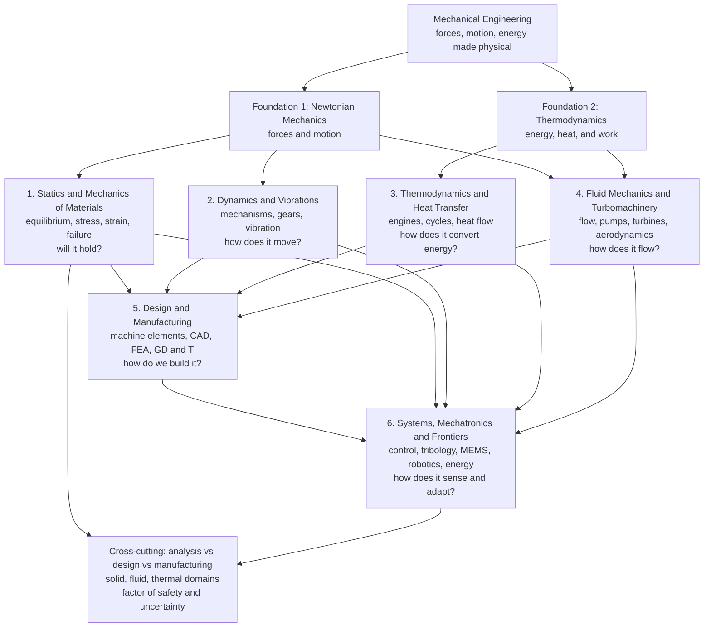

# ⚙️ Mechanical Engineering: Forces, Motion, and Energy Made Physical

> [!abstract] TL;DR
> **Mechanical engineering** is the broadest and oldest branch of engineering — the discipline of turning physical law into machines, structures, and devices you can touch. If a thing **moves, heats, cools, flows, bends, or breaks**, a mechanical engineer helped design it: the lever and the wheel, the steam engine and the jet turbine, the car in your driveway, the HVAC over your head, the robot on the factory floor, and the artificial heart valve in a patient's chest. Where electrical engineers command electrons, mechanical engineers command the tangible world of **solids, fluids, heat, and machines**. The whole field rests on **two foundations** — **Newtonian mechanics** (statics and dynamics: forces and motion) and **thermodynamics** (energy, heat, and work) — and fans out into six great sub-disciplines: **statics and mechanics of materials** ("will it hold?"), **dynamics and vibrations** ("how does it move?"), **thermodynamics and heat transfer** ("how does it convert energy?"), **fluid mechanics and turbomachinery** ("how does it flow?"), **design and manufacturing** ("how do we build it?"), and **systems, mechatronics and frontiers** ("how does it sense and adapt?"). This note is the **hub** of the vault; it maps the whole landscape and the intellectual thread that unites it — applying the laws of Newton and thermodynamics to build the mechanical world.

## Intuition

**Analogy:** Look around the room you are in and mentally delete everything a mechanical engineer touched. The chair collapses — no one sized its legs for the load. The building's air goes stale and swelters — no HVAC. Your car in the driveway becomes a pile of unmoving metal — no engine, no transmission, no brakes. The pump that lifted water to your tap stops; the fridge warms; the elevator, the escalator, the bicycle, the wind turbine, the surgical stent, and the rocket all vanish. What is left is essentially a cave. **Mechanical engineering is the discipline that built almost everything that physically moves or does mechanical work in your world.** It is the engineering of the *tangible* — of forces you can feel, motion you can watch, heat you can measure, and things that either hold together or snap.

That breadth is not an accident of history; it flows from how *few* laws you need. Give a mechanical engineer **Newton's laws** (how forces produce motion and how motion is resisted) and **the laws of thermodynamics** (how energy moves and degrades as heat and work), and from just those two foundations the entire field unfolds — a beam under load, a crankshaft spinning at 6000 rpm, a gas expanding in a cylinder, air rushing over a wing, a gear train, a factory robot. Mechanical engineering is what you get when you take the deepest laws of the physical world and relentlessly ask: *now how do I build something useful with this?*

---

## How It Works

### Core Mechanics

Mechanical engineering is best understood as **two physical foundations** feeding **six sub-disciplines**, all bound together by three cross-cutting activities — **analysis** (predict how something will behave), **design** (create something that behaves as required), and **manufacturing** (actually make it).

1. **Foundation 1 — Newtonian mechanics: forces and motion.** Everything solid and moving traces back to Newton. **Statics** is Newton's laws with zero acceleration: sum the forces and moments on a structure, set them to zero, and solve for the unknown reactions and internal loads — the basis of every bridge, frame, and bolted joint (the sibling note *Statics_and_Equilibrium* opens this thread, grounded in the Physics vault's [[Newtons_Laws_and_Kinematics]]). **Dynamics** removes the zero: now bodies accelerate, mechanisms swing, cams and linkages trace paths, and rotating machinery stores angular momentum (the sibling *Particle_and_Rigid_Body_Dynamics*, drawing on [[Rotational_Dynamics]] and [[Work_Energy_and_Conservation]]).

2. **Foundation 2 — thermodynamics: energy, heat, and work.** The second pillar governs energy in all its forms and the one-way street of its degradation. The **first law** conserves energy across any process; the **second law** says heat flows hot-to-cold and no engine is perfectly efficient. From these come **cycles** — Otto, Diesel, Brayton, Rankine — the abstract loops that describe every engine, jet, and power plant (the sibling *Engineering_Thermodynamics*, built on the Physics vault's [[Laws_of_Thermodynamics]]).

3. **Sub-discipline 1 — Statics & Mechanics of Materials ("will it hold?").** Take the internal forces from statics and ask what they do *inside* the material: **stress** (force per area), **strain** (fractional deformation), **bending**, **torsion**, **buckling**, and ultimately **failure**. This is where a load becomes a decision about whether steel yields or a shaft snaps — quantified against the Materials Science vault's [[Stress_Strain_and_Elastic_Moduli]]. *This section of the vault.*

4. **Sub-discipline 2 — Dynamics & Vibrations ("how does it move?").** Mechanisms, gears, cams, and linkages convert and transmit motion; **vibration** analysis keeps rotating machinery from shaking itself apart at resonance; **kinematics and kinetics** predict the trajectory and forces of every moving part.

5. **Sub-discipline 3 — Thermodynamics & Heat Transfer ("how does it convert energy?").** Energy conversion in engines and power cycles, plus the three modes of **heat transfer** — conduction, convection, radiation — that decide how fast a chip overheats, an engine block cools, or a house loses warmth.

6. **Sub-discipline 4 — Fluid Mechanics & Turbomachinery ("how does it flow?").** Pumps, compressors, turbines, pipes, and aerodynamics — the engineering face of the same Navier-Stokes physics developed in the [[Fluid_Dynamics_Overview|Fluid Dynamics]] vault (the sibling *Engineering_Fluid_Mechanics*). Fluid mechanics uniquely draws on **both** foundations: momentum (Newton) *and* energy (thermodynamics).

7. **Sub-discipline 5 — Design & Manufacturing ("how do we build it?").** Where analysis becomes an artifact: **machine elements** (shafts, bearings, gears, fasteners, springs), **machine design** with a rational **factor of safety**, **manufacturing processes** (machining, casting, welding, additive), and the digital toolchain of **CAD**, **FEA**, and **GD and T** (geometric dimensioning and tolerancing) — the sibling *Machine_Design_Principles*.

8. **Sub-discipline 6 — Systems, Mechatronics & Frontiers ("how does it sense and adapt?").** The modern synthesis: **mechatronics** and **control** fuse mechanical hardware with sensors, actuators, and software; **tribology** (friction, wear, lubrication), **MEMS**, robotics, and **sustainable energy** systems mark the field's expanding edge — surveyed in the sibling *The_Reach_and_Future_of_Mechanical_Engineering*.

### Flow / Architecture



---

## Key Concepts

### Secondary Level

- **Force, motion, and energy are the whole game.** A push or pull is a **force**; forces make things speed up, slow down, bend, or break. **Energy** is the capacity to do work, and it can change form — chemical fuel to heat to motion — but never appears from nothing.
- **Machines trade force for distance.** A **lever**, a **gear**, a **pulley**, or a **ramp** lets a small force move a big load, at the cost of moving through a longer distance. This is the oldest idea in the field and it still underlies every gearbox.
- **Everything has a breaking point.** Pull hard enough and any material stretches, then bends permanently, then snaps. Engineers deliberately design with a **factor of safety** so parts stay well below that point.
- **Engines turn heat into motion.** Burn fuel, get hot gas, let it push a piston or spin a turbine — that is the essence of a car engine, a jet, and a power plant.

### Undergraduate Level

- **Statics — equilibrium.** A body at rest obeys $\sum \vec{F} = 0$ and $\sum \vec{M} = 0$; solving these free-body equations yields the reactions and internal forces in trusses, beams, and frames.
- **Mechanics of materials.** Internal loads produce **stress** $\sigma = F/A$ and **strain** $\varepsilon = \Delta L / L_0$, linked by Hooke's law $\sigma = E\varepsilon$. Beams in **bending** obey $\sigma = My/I$; shafts in **torsion** obey $\tau = Tr/J$; slender columns fail by **Euler buckling** at $P_{cr} = \pi^2 EI / (KL)^2$.
- **Dynamics.** Particle and rigid-body motion via $\vec{F} = m\vec{a}$ and $\vec{M} = I\vec{\alpha}$; energy methods ($\tfrac12 m v^2$, $\tfrac12 I \omega^2$) and momentum methods short-cut many problems.
- **Vibrations.** A mass-spring-damper obeys $m\ddot{x} + c\dot{x} + kx = F(t)$; the natural frequency is $\omega_n = \sqrt{k/m}$, and driving near it causes destructive **resonance**.
- **Thermodynamics.** First law $\Delta U = Q - W$; a cyclic engine's net work equals the **area enclosed** by its path on a $P\text{-}V$ diagram; **thermal efficiency** $\eta = W_{net}/Q_{in}$ is capped by Carnot, $\eta_{Carnot} = 1 - T_C/T_H$.
- **Fluid mechanics.** Hydrostatics $p = \rho g h$; continuity $\dot{m} = \rho A v$; Bernoulli $p + \tfrac12 \rho v^2 + \rho g z = \text{const}$; the **Reynolds number** $Re = \rho v L / \mu$ sorts laminar from turbulent pipe and external flow.
- **Machine design.** Size a shaft, bearing, gear, bolt, or weld against combined stresses with a **factor of safety** $N = \sigma_{allow}/\sigma_{applied}$; check both **static** yielding and **fatigue** under cyclic loading (the $S\text{-}N$ curve and endurance limit).

### Graduate Level

- **Continuum mechanics.** The unified tensor framework beneath solids *and* fluids: the **Cauchy stress tensor** $\sigma_{ij}$, the strain tensor $\varepsilon_{ij}$, and constitutive laws (generalized Hooke's law with stiffness $C_{ijkl}$; Newtonian viscosity) all follow from conservation of mass, momentum, and energy.
- **Finite element analysis.** Discretize a continuum into elements, assemble the global stiffness matrix $[K]\{u\} = \{F\}$, and solve for displacement, stress, thermal, and modal fields — the computational workhorse of modern mechanical design.
- **Fatigue and fracture mechanics.** Real parts fail below yield under cyclic load; crack growth follows the **Paris law** $da/dN = C(\Delta K)^m$, and fracture occurs when the stress-intensity factor $K$ reaches the toughness $K_{IC}$.
- **Advanced thermal-fluid systems.** Compressible flow and gas dynamics in turbines and nozzles; conjugate heat transfer; two-phase flow in boilers and condensers; combustion; and the design of complete **Rankine** and **Brayton** power cycles with reheat and regeneration.
- **Dynamics and control of machines.** Rotordynamics, gyroscopic effects, nonlinear vibration, and the fusion of mechanism with feedback **control** in **mechatronic** systems and robotics.
- **Multiphysics and optimization.** Coupled thermal-structural-fluid simulation, topology optimization, and uncertainty quantification — designing not a single point but a robust envelope under manufacturing and load variability.

---

## Python Demo

```python
# The two great questions of mechanical engineering, in one figure.
#
#   LEFT  panel  -> "WILL IT BREAK?"      the STATICS / MECHANICS-OF-MATERIALS pillar:
#                   a stress-strain curve (elastic line -> yield -> hardening -> fracture).
#   RIGHT panel  -> "HOW DOES IT MAKE POWER?"  the THERMODYNAMICS pillar:
#                   an idealized engine loop (Otto cycle) on a P-V diagram whose
#                   ENCLOSED AREA equals the net work produced per cycle.
#
# Requires: numpy, matplotlib
import numpy as np
import matplotlib.pyplot as plt

# =====================================================================
# (a) STATICS / STRESS  ->  "will it break?"   (ductile-steel tensile test)
# =====================================================================
E        = 200_000.0   # Young's modulus  [MPa]  (200 GPa, structural steel)
sig_y    = 250.0       # yield strength   [MPa]
sig_uts  = 400.0       # ultimate tensile strength [MPa]
eps_y    = sig_y / E   # yield strain (~0.00125)
eps_uts  = 0.15        # strain at UTS
eps_frac = 0.25        # strain at fracture

# Region 1: linear elastic  (Hooke's law, sigma = E * eps)
e1 = np.linspace(0.0, eps_y, 50)
s1 = E * e1

# Region 2: plastic strain hardening  (concave rise from yield up to UTS)
e2 = np.linspace(eps_y, eps_uts, 200)
s2 = sig_uts - (sig_uts - sig_y) * ((eps_uts - e2) / (eps_uts - eps_y)) ** 2

# Region 3: necking  (load drops from UTS to fracture)
e3 = np.linspace(eps_uts, eps_frac, 80)
s3 = sig_uts + (0.80 * sig_uts - sig_uts) * (e3 - eps_uts) / (eps_frac - eps_uts)

eps = np.concatenate([e1, e2, e3])
sig = np.concatenate([s1, s2, s3])

# =====================================================================
# (b) ENERGY / CYCLE  ->  "how does it make power?"   (idealized Otto cycle)
#     1->2 adiabatic compression | 2->3 isochoric heat-in
#     3->4 adiabatic expansion    | 4->1 isochoric heat-out
#     Net work per cycle = area enclosed by the closed loop.
# =====================================================================
gamma = 1.4            # air, ratio of specific heats
r     = 8.0            # compression ratio  V1 / V2
V1, P1 = 1.0, 100.0    # state 1 (bottom-dead-centre)  [arb. vol, kPa]
V2     = V1 / r        # state 2 (top-dead-centre)
P2     = P1 * r ** gamma                  # adiabatic:  P V^gamma = const
P3     = 3.0 * P2                          # heat added at constant volume
P4     = P3 * (V2 / V1) ** gamma           # adiabatic expansion back to V1

def adiabat(Va, Pa, Vb, n=100):
    V = np.linspace(Va, Vb, n)
    return V, Pa * (Va / V) ** gamma        # P = Pa (Va/V)^gamma

Va, Pa = adiabat(V1, P1, V2)               # 1 -> 2  compression
Vb, Pb = np.full(60, V2), np.linspace(P2, P3, 60)   # 2 -> 3  heat in
Vc, Pc = adiabat(V2, P3, V1)               # 3 -> 4  expansion (power stroke)
Vd, Pd = np.full(60, V1), np.linspace(P4, P1, 60)   # 4 -> 1  heat out

Vloop = np.concatenate([Va, Vb, Vc, Vd])
Ploop = np.concatenate([Pa, Pb, Pc, Pd])

# Net work = enclosed area via the shoelace formula on the closed loop
W_net = 0.5 * np.abs(np.dot(Vloop, np.roll(Ploop, -1)) - np.dot(Ploop, np.roll(Vloop, -1)))
eta   = 1.0 - r ** (1.0 - gamma)           # ideal Otto efficiency = 1 - r^(1-gamma)

print("=== (a) Will it break?  ductile steel tensile test ===")
print(f"  Young's modulus E   : {E/1000:6.0f} GPa")
print(f"  yield strength      : {sig_y:6.0f} MPa  at strain {eps_y*100:.3f} %")
print(f"  ultimate strength   : {sig_uts:6.0f} MPa  at strain {eps_uts*100:.1f} %")
print(f"  fracture strain     : {eps_frac*100:6.1f} %  (ductile)")
print("=== (b) How does it make power?  ideal Otto cycle ===")
print(f"  compression ratio r : {r:6.1f}")
print(f"  net work / cycle    : {W_net:6.1f}  (enclosed P-V area, kPa*vol)")
print(f"  ideal efficiency    : {eta*100:6.1f} %")

# ------------------------------ plotting ------------------------------
fig, (axL, axR) = plt.subplots(1, 2, figsize=(14, 6))
fig.suptitle("The Two Great Questions Mechanical Engineering Answers",
             fontsize=15, fontweight="bold")

# LEFT: stress-strain  -> will it break?
axL.plot(eps * 100, sig, color="#1f77b4", lw=2.5)
axL.plot([0, eps_y * 100], [0, sig_y], color="#2ca02c", lw=2.5,
         label="elastic (Hooke's law)")
axL.scatter([eps_y * 100], [sig_y], color="#2ca02c", zorder=5)
axL.annotate("yield point\nstart of permanent damage",
             xy=(eps_y * 100, sig_y), xytext=(4, 210),
             fontsize=8, arrowprops=dict(arrowstyle="->", color="#2ca02c"))
axL.scatter([eps_uts * 100], [sig_uts], color="#ff7f0e", zorder=5)
axL.annotate("ultimate strength (UTS)",
             xy=(eps_uts * 100, sig_uts), xytext=(6, 415),
             fontsize=8, arrowprops=dict(arrowstyle="->", color="#ff7f0e"))
axL.scatter([eps_frac * 100], [s3[-1]], marker="X", s=120, color="#d62728", zorder=5)
axL.annotate("FRACTURE", xy=(eps_frac * 100, s3[-1]), xytext=(18, 250),
             fontsize=9, fontweight="bold", color="#d62728",
             arrowprops=dict(arrowstyle="->", color="#d62728"))
axL.axvspan(0, eps_y * 100, color="#2ca02c", alpha=0.08)
axL.text(0.6, 60, "elastic\n(reversible)", fontsize=7, color="#2ca02c")
axL.text(9, 120, "plastic\n(permanent)", fontsize=8, color="gray")
axL.set_xlabel("strain  [%]")
axL.set_ylabel("stress  [MPa]")
axL.set_title("(a) STATICS / STRESS  ->  \"Will it break?\"", fontsize=11)
axL.set_xlim(0, eps_frac * 100 + 3)
axL.set_ylim(0, 460)
axL.legend(loc="lower right", fontsize=8)
axL.grid(alpha=0.3)

# RIGHT: P-V Otto cycle  -> how does it make power?
axR.plot(Vloop, Ploop, color="#d62728", lw=2.2)
axR.fill(Vloop, Ploop, color="#d62728", alpha=0.12)
for (V, P, lab, dx, dy) in [(V1, P1, "1", 0.02, -80), (V2, P2, "2", -0.06, 0),
                            (V2, P3, "3", -0.06, 40), (V1, P4, "4", 0.02, 40)]:
    axR.scatter([V], [P], color="k", zorder=5)
    axR.annotate(lab, xy=(V, P), xytext=(V + dx, P + dy), fontsize=10, fontweight="bold")
axR.annotate("power stroke\n(3 -> 4 expansion)", xy=(0.4, adiabat(V2, P3, V1)[1][40]),
             xytext=(0.45, 1400), fontsize=8,
             arrowprops=dict(arrowstyle="->", color="#d62728"))
axR.text(0.35, 500, "enclosed area\n= NET WORK\nper cycle",
         fontsize=9, ha="center", color="#d62728", fontweight="bold")
axR.set_xlabel("volume  V")
axR.set_ylabel("pressure  P  [kPa]")
axR.set_title("(b) ENERGY / CYCLE  ->  \"How does it make power?\"", fontsize=11)
axR.grid(alpha=0.3)

plt.tight_layout(rect=[0, 0, 1, 0.94])
plt.show()
```

Running this prints the numbers and draws the two panels that, between them, capture what mechanical engineering *does*. The **left panel** is the stress-strain curve of a ductile steel: a straight elastic line where load is reversible, a **yield point** past which damage is permanent, a hump up to the **ultimate strength**, and a final **fracture** — the entire basis of answering *"will it hold?"* and of choosing a factor of safety. The **right panel** is an idealized **Otto cycle** (the loop a spark-ignition engine traces), where the **enclosed area is literally the net work** produced each cycle and the compression ratio $r$ sets the ideal efficiency $\eta = 1 - r^{1-\gamma}$ — the entire basis of answering *"how does it make power?"* Stress and energy, solids and heat: the two pillars of the field in a single view.

---

## Real-World Applications

> **Example:** A **car** is a mechanical-engineering anthology in one object. Its **engine** is a thermodynamic cycle (the Otto or Diesel loop of the demo) converting fuel's chemical energy into shaft work; its **crankshaft, pistons, and valvetrain** are a dynamics-and-vibration problem in mechanisms and balancing; its **chassis and suspension** are statics and mechanics-of-materials sized against fatigue over millions of load cycles; its **cooling system, radiator, and cabin HVAC** are heat-transfer and fluid-mechanics designs; its **transmission** is a gear-train exercise in machine elements; its **brakes** dissipate kinetic energy through friction (tribology); and every part is drawn in **CAD**, checked in **FEA**, toleranced with **GD and T**, and produced by casting, forging, machining, and stamping. One product, all six sub-disciplines.

- **Power generation.** Steam (Rankine) and gas (Brayton) turbine plants, hydro turbines, and wind turbines convert thermal, hydraulic, or wind energy into rotating shaft power — thermodynamics, fluid mechanics, and rotordynamics working together.
- **Aerospace propulsion and structures.** Jet engines are Brayton cycles wrapped in turbomachinery; airframes are lightweight structures fought against fatigue and buckling — a domain shared with aerospace engineering.
- **HVAC and refrigeration.** Every building's comfort and every cold chain depends on reversed thermodynamic cycles (heat pumps, vapor-compression refrigeration) and duct-and-pipe fluid networks.
- **Robotics and automation.** Industrial arms, mobile robots, and CNC machines fuse mechanisms, actuators, sensors, and feedback control — the mechatronics frontier of the field.
- **Biomedical devices.** Prosthetics, orthopedic implants, heart valves, stents, and ventilators apply solid mechanics, fluid mechanics, and fatigue analysis to the human body.
- **Manufacturing itself.** Machine tools, presses, injection-molding machines, and additive-manufacturing systems are mechanical engineering designing the means to make everything else.

---

## Common Pitfalls

- **Thinking of ME as one thing rather than a federation.** Mechanical engineering is the "generalist" engineering precisely because it spans **solids, fluids, and thermal** domains and three activities — **analysis, design, and manufacturing**. A brilliant stress analyst may know little about combustion; a turbomachinery specialist may never size a bolt. Treat the six sub-disciplines as connected specialties, not a single monolithic skill.
- **Forgetting there are two foundations, not one.** Newtonian mechanics (forces and motion) and thermodynamics (energy and heat) are *different* first principles. Many student errors come from reaching for a force balance when an energy balance is called for, or vice versa. Fluid mechanics is hard partly because it needs **both** at once.
- **Confusing analysis with design.** *Analysis* asks "given this part, how will it behave?" — a well-posed problem with one answer. *Design* asks "what part meets these requirements?" — an open problem with infinitely many answers and trade-offs. Beginners over-apply analysis and under-appreciate that real design is iterative, constraint-driven, and never unique.
- **The SI-versus-US-customary units trap.** The single most classic ME pain: pounds-force versus pounds-mass, the mysterious $g_c$ conversion factor, psi versus pascals, BTU versus joules, slugs, and horsepower. The 1999 **Mars Climate Orbiter** was lost because one team used pound-seconds and another newton-seconds. Always carry units through every calculation and state them explicitly.
- **Misusing the factor of safety.** A factor of safety is not a magic fudge; it is a deliberate margin against **uncertainty** — in loads, material properties, geometry, and analysis fidelity. Too small and it fails; too large and it is heavy, costly, and over-built. It must be chosen for the specific failure mode (yield vs fatigue vs buckling vs fracture), not slapped on uniformly.
- **Ignoring fatigue because the static check passed.** A part comfortably below its yield stress can still fail after millions of cycles at a fraction of that stress. Rotating and vibrating machinery must be checked against the $S\text{-}N$ curve and endurance limit, not just a single static load.
- **Assuming rigid bodies and steady state.** Real structures deflect, real machines vibrate, and real thermal systems have transients. Idealizations (rigid, incompressible, steady, frictionless) are powerful starting points but each hides a failure mode — resonance, thermal cycling, wear — that has sunk real designs.

---

## Related Concepts

**The two foundations (Physics vault)**
- [[Newtons_Laws_and_Kinematics]] — the force-and-motion bedrock beneath statics and dynamics
- [[Rotational_Dynamics]] — torque, moment of inertia, and angular momentum for shafts, gears, and flywheels
- [[Work_Energy_and_Conservation]] — the work-energy theorem underpinning engineering energy methods
- [[Laws_of_Thermodynamics]] — the first and second laws behind every engine cycle and heat-transfer analysis

**Materials and fluids (deep-dive vaults)**
- [[Stress_Strain_and_Elastic_Moduli]] — the constitutive relations that turn internal loads into "will it hold?"
- [[Fluid_Dynamics_Overview]] — the physics-of-flow vault whose Navier-Stokes core underlies engineering fluid mechanics and turbomachinery

---

## Review Questions

**Secondary**
1. Name three things in an ordinary kitchen that a mechanical engineer had to design, and for each say whether it mainly involves **force/motion**, **heat/energy**, or **flow**. Why is mechanical engineering sometimes called the "broadest" engineering discipline?

**Undergraduate**
2. Mechanical engineering rests on two foundations — Newtonian mechanics and thermodynamics. For each of the six sub-disciplines (statics/mechanics of materials, dynamics/vibrations, thermo/heat transfer, fluid mechanics, design/manufacturing, mechatronics), state which foundation it leans on most, and explain why fluid mechanics is the one field that genuinely needs both at once.

**Graduate**
3. A design team is developing a new gas-turbine blade. Trace how *all three* cross-cutting activities — **analysis, design, and manufacturing** — and at least four of the six sub-disciplines appear in this single component. Then discuss two places where a naive **factor of safety** or a **units** mistake could be catastrophic, and how you would guard against each using the ideas of uncertainty quantification and fatigue/fracture analysis.

---

## Sources

- R. C. Hibbeler — *Engineering Mechanics: Statics and Dynamics*, 14th ed. (Pearson, 2016)
- R. G. Budynas & J. K. Nisbett — *Shigley's Mechanical Engineering Design*, 11th ed. (McGraw-Hill, 2020)
- Y. A. Cengel & M. A. Boles — *Thermodynamics: An Engineering Approach*, 9th ed. (McGraw-Hill, 2019)
- R. L. Norton — *Design of Machinery*, 6th ed. (McGraw-Hill, 2019)
- F. M. White — *Fluid Mechanics*, 8th ed. (McGraw-Hill, 2016)

---

#mechanical-engineering #statics #thermodynamics #machine-design #engineering
