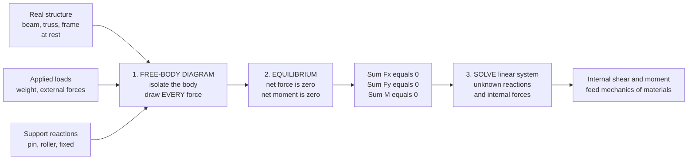

# ⚖️ Statics and Equilibrium

> [!abstract] TL;DR
> A body at rest (or moving at constant velocity) is in **static equilibrium**: the net force *and* the net moment on it are both zero, $\sum \vec{F} = 0$ and $\sum \vec{M} = 0$ — Newton's first law applied to structures. The central skill is the **free-body diagram (FBD)**: isolate a body and draw *every* external force and support reaction acting on it. From the FBD, the equilibrium equations (3 in 2D, 6 in 3D) solve for the unknown reactions and internal forces — provided the structure is **statically determinate** (equations equal unknowns). Statics is the humble bookkeeping — forces up equal forces down, twists left equal twists right — that keeps every building standing and every bolt from shearing, and it computes the internal shear and bending moment that mechanics of materials turns into stresses.

---

## Intuition

**Analogy — the bridge that holds up a truck by doing absolutely nothing.** A bridge span carries a fully loaded truck and *does not move a millimeter*. From the outside it looks like nothing is happening. But inside that motionless steel, enormous forces are pushing and pulling — cables in tension, deck members in compression, bolts resisting shear — and they all cancel out *exactly*. Statics is the engineering of **things that don't move**: the art of figuring out the hidden internal forces in a structure that is in perfect balance. It is the humble bookkeeping — forces up equal forces down, twists clockwise equal twists counter-clockwise — that keeps every building standing, every crane lifting, and every rivet in place. Get the balance wrong by a single unaccounted force and the thing falls down.

Because nothing accelerates, statics never needs Newton's *second* law ($\vec{F}=m\vec{a}$) in anger — the acceleration is zero. All the physics collapses to two blunt statements: the forces balance, and the twists balance. Everything else is careful accounting.

---

## How It Works

### Core Mechanics

1. **Isolate the body — draw the free-body diagram (FBD).** Mentally cut the object (or a piece of it) free from everything touching it, and replace each contact with the force it exerts: applied loads, support **reactions**, self-**weight** (acting at the center of gravity), and **friction**. This single diagram is 90% of the problem — an error here propagates through every subsequent equation.
2. **Write the equilibrium equations.** For the isolated body, demand that translation *and* rotation are both balanced:
   $$\sum F_x = 0, \qquad \sum F_y = 0, \qquad \sum M_O = 0 \quad (\text{2D})$$
   In 3D there are six: $\sum F_x=\sum F_y=\sum F_z=0$ and $\sum M_x=\sum M_y=\sum M_z=0$. The moment can be summed about *any* point $O$; a clever choice (through an unknown) eliminates that unknown from the equation.
3. **Count equations versus unknowns.** In 2D you get 3 independent equations per body. If the number of unknown reactions/forces equals the number of equations, the structure is **statically determinate** and solvable by statics alone. If there are more unknowns, it is **statically indeterminate** and you must add material-deformation (compatibility) equations — the door into mechanics of materials.
4. **Solve the linear system.** The equilibrium equations are linear in the unknown forces, so they assemble into $A\mathbf{x}=\mathbf{b}$ and solve by linear algebra (see [[Systems_of_Linear_Equations]]).
5. **Extract internal forces.** Cutting through a member and re-applying equilibrium to one side exposes the internal **normal force, shear, and bending moment** — the distributions that the next notes (stress, bending, torsion) convert into stresses.

### Flow / Architecture



---

## Key Concepts / Details

### Secondary Level

**Static equilibrium.** A body is in equilibrium when it neither accelerates (translation balanced, $\sum\vec F=0$) nor angularly accelerates (rotation balanced, $\sum\vec M=0$). Both must hold at once — a see-saw with equal weights at equal arms has $\sum F \ne 0$ at the pivot only until the support reaction is added, but the *moments* about the pivot already cancel.

**Force vs. moment.** A **force** is a push or pull — a vector with magnitude and direction (newtons, N). A **moment** (or **torque**) is a force's tendency to rotate the body about a point: $M = F \cdot d$, where $d$ is the *perpendicular* distance from the point to the force's line of action (units N·m). A **couple** is two equal-and-opposite forces a distance apart — pure moment, zero net force.

**Supports and reactions.** Each support removes degrees of freedom by supplying reactions:

| Support | Reactions (2D) | Blocks |
|---------|----------------|--------|
| Roller | 1 (normal force) | translation ⟂ surface |
| Pin / hinge | 2 (H and V force) | translation in both directions |
| Fixed / cantilever | 3 (H, V force + moment) | translation + rotation |

**Simple beam reactions.** For a simply-supported beam (pin + roller), take $\sum M=0$ about one support to get the other reaction directly, then $\sum F_y=0$ for the first.

### Undergraduate Level

**The equation count.** In 2D, a single rigid body yields exactly **3** independent equilibrium equations; in 3D, **6**. This is the fundamental budget: it caps how many unknown reactions/forces you can find from statics alone.

**Statically determinate vs. indeterminate.**
- **Determinate:** unknowns $=$ equations. Reactions and internal forces follow from statics only.
- **Indeterminate:** unknowns $>$ equations (degree $= \text{unknowns} - \text{equations}$). A propped cantilever or a beam on three supports has "too many" reactions; statics is not enough, and you must add **compatibility** conditions from material deformation. Statically indeterminate structures are common (and often desirable — redundancy) but require mechanics of materials.

**Trusses — the method of joints.** A truss is an assembly of straight, pin-jointed members loaded only at the joints. Each member is a **two-force member**: it carries pure axial force, either **tension** (pulling its joints inward) or **compression** (pushing them outward), and nothing else. At each pin, $\sum F_x=0$ and $\sum F_y=0$ give 2 equations. For a determinate truss, $m + r = 2j$ (members + reactions $=$ twice the joints). Sweeping joint by joint solves every member force.

**Method of sections.** To find a *few* member forces deep inside a truss without marching through every joint, cut an imaginary section through the members of interest and apply the 3 equilibrium equations to one whole side.

**Distributed loads → equivalent point load.** A distributed load $w(x)$ is replaced, *for equilibrium purposes*, by a single resultant equal to the **area** under the load curve, acting through its **centroid**. A uniform load $w$ over length $L$ becomes $W = wL$ at midspan; a triangular load becomes $\tfrac12 w_{\max}L$ at $L/3$ from the large end.

**Centroids and center of gravity.** The centroid is the area-average position $\bar x = \frac{\int x\,dA}{\int dA}$; weight acts through the center of gravity (the mass-weighted centroid). Composite bodies are handled by summing $\sum A_i \bar x_i / \sum A_i$.

**Dry (Coulomb) friction.** On the verge of slipping, $F_f = \mu_s N$, directed to oppose impending motion. Classic statics problems: the ladder against a wall, the wedge, and the capstan/belt ($T_2 = T_1 e^{\mu\beta}$).

### Graduate Level

**3D equilibrium and the moment vector.** In three dimensions the moment is a cross product, $\vec M_O = \vec r \times \vec F$, and the six scalar equations come from $\sum\vec F=0$ and $\sum\vec M_O=0$. Vector formulation (see [[Vectors_and_3D_Geometry]]) is essential for spatial frames, ball-and-socket joints, and machinery.

**Virtual work and the principle of stationary potential energy.** Equilibrium is equivalent to: the total virtual work of all forces under any admissible virtual displacement $\delta\mathbf{u}$ is zero, $\delta W = \sum \vec F_i \cdot \delta \vec r_i = 0$. This scalar formulation sidesteps drawing reaction forces and generalizes cleanly to systems with many degrees of freedom.

**Matrix / direct-stiffness structural analysis.** For indeterminate structures, modern analysis assembles member stiffness into a global system $\mathbf{K}\mathbf{u} = \mathbf{f}$ and solves for nodal displacements $\mathbf{u}$, then recovers member forces. This is the finite-element method's ancestor: equilibrium *and* compatibility *and* the constitutive law, solved simultaneously.

**Energy methods.** Castigliano's second theorem, $\delta_i = \partial U / \partial P_i$, and the unit-load method extract deflections and redundant reactions from the strain energy $U$ — the standard graduate tools for indeterminate frames and trusses.

**Internal force diagrams — the bridge to mechanics of materials.** Cutting a beam and applying equilibrium yields the internal **shear** $V(x)$ and **bending moment** $M(x)$, related by $\frac{dV}{dx} = -w(x)$ and $\frac{dM}{dx} = V(x)$. These distributions are precisely what stress analysis needs; statics ends where $\sigma = Mc/I$ begins.

---

## Python Demo

```python
# Statics by linear algebra: (a) beam support REACTIONS and
# (b) TRUSS member forces via the method of joints.
# Both reduce equilibrium (sum F = 0, sum M = 0) to A x = b and solve.
import numpy as np
import matplotlib.pyplot as plt

# ============================================================
# (a) SIMPLY-SUPPORTED BEAM: solve support reactions
# ============================================================
L_beam = 10.0                       # span [m], pin at x=0, roller at x=L
point_loads = [(3.0, 8.0), (7.0, 12.0)]   # (position x [m], downward load [kN])

# distributed load w over [a,b] -> equivalent point load at its centroid
w, a_d, b_d = 2.0, 0.0, 10.0        # 2 kN/m uniform over the whole span
W_eq, x_eq = w * (b_d - a_d), 0.5 * (a_d + b_d)
loads = point_loads + [(x_eq, W_eq)]

sumP = sum(P for _, P in loads)             # total downward load
sumM_A = sum(P * x for x, P in loads)       # moment of loads about A (x=0)

# Equilibrium:  Ay + By = sumP   and   By*L = sumM_A   ->  A x = b
A = np.array([[1.0, 1.0],
              [0.0, L_beam]])
b = np.array([sumP, sumM_A])
Ay, By = np.linalg.solve(A, b)

# Verify equilibrium independently (moment about B must also vanish)
assert abs(Ay + By - sumP) < 1e-9
assert abs(Ay * L_beam - sum(P * (L_beam - x) for x, P in loads)) < 1e-9
print(f"[BEAM] Reactions:  Ay = {Ay:.2f} kN,  By = {By:.2f} kN  (sum load = {sumP:.1f} kN)")

# ============================================================
# (b) PLANE TRUSS: solve every member force (method of joints)
# ============================================================
joints = np.array([[0.0, 0.0],      # J0  pin support
                   [6.0, 0.0],      # J1  roller support
                   [3.0, 3.0]])     # J2  apex (loaded)
members = [(0, 2), (2, 1), (0, 1)]                     # (jointA, jointB)
member_lbl = ["J0-J2 rafter", "J2-J1 rafter", "J0-J1 tie"]
ext_loads = {2: (0.0, -10.0)}                          # 10 kN down at apex
supports = {0: (True, True), 1: (False, True)}         # pin at J0, roller at J1

n_j, n_m = len(joints), len(members)
rxn_dofs = [(s, ax) for s, (cx, cy) in supports.items()
            for ax, on in enumerate((cx, cy)) if on]   # reaction unknowns
n_r = len(rxn_dofs)
assert n_m + n_r == 2 * n_j, "Truss is NOT statically determinate"

# Build 2*j equilibrium equations in [member forces..., reactions...]
K = np.zeros((2 * n_j, n_m + n_r))
rhs = np.zeros(2 * n_j)
for k, (i, j) in enumerate(members):                   # tension positive
    u = (joints[j] - joints[i]) / np.hypot(*(joints[j] - joints[i]))
    K[2*i:2*i+2, k] += u                               # force on joint i
    K[2*j:2*j+2, k] += -u                              # force on joint j
for idx, (s, ax) in enumerate(rxn_dofs):
    K[2*s + ax, n_m + idx] = 1.0
for j, (fx, fy) in ext_loads.items():                  # move loads to RHS
    rhs[2*j], rhs[2*j+1] = rhs[2*j] - fx, rhs[2*j+1] - fy

sol = np.linalg.solve(K, rhs)
forces, reactions = sol[:n_m], sol[n_m:]
for lbl, F in zip(member_lbl, forces):
    state = "TENSION" if F > 0 else "COMPRESSION"
    print(f"[TRUSS] {lbl:14s}: {F:+7.2f} kN  ({state})")

# ============================================================
# PLOTS
# ============================================================
fig, (axb, axt) = plt.subplots(1, 2, figsize=(13, 5))

# --- beam plot ---
axb.plot([0, L_beam], [0, 0], color="black", lw=4, zorder=1)
for x, P in point_loads:                                # downward point loads
    axb.annotate("", xy=(x, 0), xytext=(x, 1.6),
                 arrowprops=dict(arrowstyle="-|>", color="crimson", lw=2))
    axb.text(x, 1.7, f"{P:.0f} kN", ha="center", color="crimson")
axb.annotate("", xy=(x_eq, 0), xytext=(x_eq, 1.1),      # distributed resultant
             arrowprops=dict(arrowstyle="-|>", color="darkorange", lw=2))
axb.text(x_eq, 1.2, f"w={w} kN/m -> {W_eq:.0f} kN", ha="center", color="darkorange")
for x, R, lbl in [(0, Ay, "Ay"), (L_beam, By, "By")]:   # upward reactions
    axb.annotate("", xy=(x, 0), xytext=(x, -1.6),
                 arrowprops=dict(arrowstyle="-|>", color="seagreen", lw=2.5))
    axb.text(x, -1.9, f"{lbl}={R:.1f} kN", ha="center", color="seagreen")
axb.set_title("(a) Beam reactions  (sum F = 0, sum M = 0)")
axb.set_xlim(-1, L_beam + 1); axb.set_ylim(-2.6, 2.4)
axb.axis("off")

# --- truss plot, colored by tension/compression ---
Fmax = np.max(np.abs(forces))
for (i, j), F in zip(members, forces):
    color = "crimson" if F > 0 else "royalblue"         # tension red, compression blue
    axt.plot(joints[[i, j], 0], joints[[i, j], 1],
             color=color, lw=2 + 4 * abs(F) / Fmax, zorder=1)
    mid = joints[[i, j]].mean(axis=0)
    axt.text(mid[0], mid[1] + 0.15, f"{F:+.1f}", ha="center", fontsize=9)
axt.scatter(joints[:, 0], joints[:, 1], s=120, color="black", zorder=3)
axt.annotate("", xy=(3, 3), xytext=(3, 4.2),            # applied load
             arrowprops=dict(arrowstyle="-|>", color="darkorange", lw=2.5))
axt.text(3, 4.3, "10 kN", ha="center", color="darkorange")
axt.plot([], [], color="crimson", lw=3, label="tension")
axt.plot([], [], color="royalblue", lw=3, label="compression")
axt.set_title("(b) Truss member forces (method of joints)")
axt.set_aspect("equal"); axt.legend(loc="lower center"); axt.axis("off")

plt.tight_layout()
plt.savefig("statics_equilibrium.png", dpi=150)
# Expected: Ay=25 kN, By=25 kN; rafters ~ -7.07 kN (compression), tie +5 kN (tension)
```

Running it prints the beam reactions ($A_y = B_y = 25$ kN for the symmetric load set), verifies equilibrium two independent ways, and reports every truss member force with its tension/compression state — the rafters in compression, the bottom tie in tension — exactly what you would size a real member for.

---

## Real-World Applications

- **Bridges and buildings.** Every structural member is sized from a statics analysis: dead load + live load resolved into member forces, then checked against capacity. Trusses (roofs, bridges, transmission towers) are the canonical determinate example.
- **Cranes and lifting.** A tower crane's counterweight is pure moment balance about the mast — $\sum M = 0$ sets exactly how far a load can go out before the machine tips.
- **Machine design.** Every bearing, bolt, pin, and gear tooth carries a reaction computed from an FBD of the shaft or linkage; bolt-group analysis distributes a joint load by force *and* moment equilibrium.
- **Biomechanics.** The forces in muscles, tendons, and joints are found by FBDs of body segments — the elbow holding a weight is a class-3 lever solved by $\sum M = 0$ about the joint.
- **Robotics and mechanisms.** Static torque needed to hold a manipulator against gravity (gravity compensation) is a statics problem; it becomes the $\mathbf g(\mathbf q)$ term once motion is added — see [[Rigid_Body_Motion_and_Homogeneous_Transforms]].
- **Foundations and geotechnics.** Retaining walls and dams are checked for equilibrium against sliding and overturning — moment balance about the toe decides stability.

---

## Common Pitfalls

- **Forgetting that equilibrium needs BOTH $\sum F=0$ and $\sum M=0$.** Balancing forces alone permits a body to spin; balancing moments alone permits it to drift. A see-saw with unequal loads can have $\sum F=0$ at the pivot yet still rotate — the moment equation is what fails. Translation *and* rotation must both be balanced.
- **A wrong free-body diagram.** The single most common and most fatal error: omitting a reaction, a friction force, or the body's own weight; double-counting an internal force as external; or drawing a reaction in the wrong direction. Isolate one body, cut everything touching it, and replace each cut with its force — nothing more, nothing less.
- **Confusing forces with moments.** A force acts at a point; a moment is force *times perpendicular distance* about a point. Forgetting the perpendicular-distance rule (using the slanted distance, or the wrong lever arm) corrupts every moment equation.
- **Mis-modeling supports.** A pin is not a roller is not a fixed support. Giving a roller a horizontal reaction, or forgetting the moment reaction at a fixed/cantilever support, changes the unknown count and the answer.
- **Treating an indeterminate structure as determinate.** If unknowns exceed equilibrium equations, statics *cannot* solve it — you need compatibility from material deformation. Blindly writing "3 equations, 4 unknowns" and forcing a solution gives nonsense.
- **Truss sign and two-force assumptions.** Method-of-joints errors come from mishandling the tension-positive convention, or from applying a load *between* joints (which introduces bending and breaks the two-force-member assumption).
- **Distributed loads used raw in moment equations.** You must first replace $w(x)$ by its resultant (area) acting at its centroid; using the peak intensity, or placing the resultant at the wrong point, throws off $\sum M$.
- **Ignoring self-weight and friction when they matter.** Neglecting the weight of a heavy member, or the friction that actually holds a ladder or wedge, produces an FBD that balances on paper but not in reality.
- **Sloppy centroid/center-of-gravity location.** Composite-area centroid mistakes (wrong reference axis, forgetting a hole subtracts area) misplace the weight vector and the reactions.

---

## Related Concepts

- [[Newtons_Laws_and_Kinematics]] — statics is Newton's **first law** ($\sum\vec F=0$) applied to bodies at rest; equilibrium is the $\vec a = 0$ special case.
- [[Rotational_Dynamics]] — the moment/torque balance $\sum\vec M = 0$ is the static limit of rotational dynamics ($\vec\tau = I\vec\alpha$ with $\vec\alpha = 0$).
- [[Work_Energy_and_Conservation]] — the principle of virtual work reformulates equilibrium in energy terms, sidestepping reaction forces.
- [[Systems_of_Linear_Equations]] — the equilibrium equations assemble into $A\mathbf{x}=\mathbf{b}$; solving trusses and reactions is linear algebra.
- [[Vectors_and_Vector_Spaces]] — forces and moments are vectors; resolving and summing them underlies every FBD.
- [[Vectors_and_3D_Geometry]] — 3D moments use the cross product $\vec M = \vec r \times \vec F$ for spatial equilibrium.
- [[Rigid_Body_Motion_and_Homogeneous_Transforms]] — static torque balance against gravity is the robotics gravity-compensation problem.

---

## Review Questions

1. **Secondary.** A 6 m simply-supported beam (pin at the left end, roller at the right) carries a single 900 N load 2 m from the left support. Find both support reactions using $\sum M = 0$ and $\sum F_y = 0$. Which support carries more, and why?
2. **Undergraduate.** A plane truss has $j$ joints, $m$ members, and $r$ reaction components. State the determinacy condition and explain what it means physically when $m + r < 2j$, $m + r = 2j$, and $m + r > 2j$. For a symmetric roof truss with a peak load, argue from equilibrium why the bottom chord is in tension while the rafters are in compression.
3. **Graduate.** A propped cantilever (fixed at one end, roller at the other) carries a uniform load. It has 4 reaction unknowns but only 3 equilibrium equations. Identify the degree of static indeterminacy, and outline how you would close the system — name the extra physical condition required and one method (force/flexibility or virtual work) to obtain the redundant reaction. Why can't statics alone solve it?

---

## Sources

- Hibbeler, R. C. — *Engineering Mechanics: Statics*, 14th ed. (Pearson)
- Beer, Johnston, Mazurek — *Vector Mechanics for Engineers: Statics*, 12th ed. (McGraw-Hill)
- Meriam, Kraige, Bolton — *Engineering Mechanics: Statics*, 9th ed. (Wiley)
- Shames, I. H. — *Engineering Mechanics: Statics and Dynamics*, 4th ed. (Prentice Hall)
- Gere & Goodno — *Mechanics of Materials*, 9th ed. (for the transition from internal forces to stress)

#mechanical-engineering #statics #equilibrium #free-body-diagram #trusses
