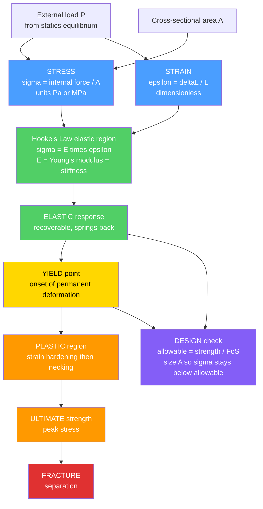

# ⚙️ Stress, Strain, and Deformation

> [!abstract] TL;DR
> **Stress** ($\sigma = P/A$) is the intensity of internal force per unit cross-sectional area; **strain** ($\varepsilon = \Delta L / L$) is the fractional deformation the material shows in response. In the elastic regime they are proportional through **Hooke's law** $\sigma = E\varepsilon$, where **Young's modulus** $E$ measures *stiffness* — a property distinct from *strength* (the stress a material survives before yielding or fracturing). The tensile **stress-strain curve** reads out a material's entire personality: elastic region, yield point, strain hardening, ultimate strength, and fracture. Mechanics of materials turns the internal forces from **statics** into stresses, compares them against material limits through a **factor of safety**, and sizes cross-sections ($\delta = PL/AE$) so a beam, bolt, shaft, or pressure vessel carries its load without failing. This is the analysis foundation beneath *every* "will it break?" question in mechanical and structural design.

---

## Intuition

**Analogy first.** Pull on a rubber band and it stretches a lot; pull on a steel rod of the same size with the same force and it stretches too — just thousands of times less. That difference is the whole subject. **Stress** is how hard you are pushing on *each square millimetre* of material (force spread over area). **Strain** is how much the material stretches *relative to its own length* in response. Every material has a personality with two independent traits: how much stress it takes to stretch it a given amount (its **stiffness**, set by Young's modulus $E$), and how much stress it can take before it yields or snaps (its **strength**). A stiff material is not automatically a strong one — glass is stiff but shatters, and a paperclip yields easily yet bends far before it breaks.

Reading these personalities is what lets an engineer size a beam, a bolt, or even a bone to carry its load safely. Get the reading right and you have a bridge; get it wrong and you have a pile of rubble. Mechanics of materials is exactly that reading: it takes the internal forces you already found from equilibrium, spreads them over real cross-sections to get stresses, and checks those stresses against the material's known limits with a safety margin baked in.

---

## How It Works

### Core Mechanics

1. **Internal force from statics.** Cut the loaded member and apply equilibrium to expose the internal force $P$ (axial), shear $V$, or moment $M$ carried across the section. Mechanics of materials always *starts* where statics ends.
2. **Stress = force intensity.** Divide the internal force by the area it acts on. **Normal stress** $\sigma = P/A$ acts perpendicular to the cut (from axial pull or push); **shear stress** $\tau = V/A$ acts parallel to the cut (from transverse or twisting loads). Units are pascals, almost always reported in MPa for engineering ($1\ \text{MPa} = 1\ \text{N/mm}^2$).
3. **Strain = relative deformation.** Normal strain $\varepsilon = \Delta L / L$ is dimensionless — the stretch per unit length. Shear strain $\gamma$ is the angular distortion. A lateral companion appears automatically: axial stretch causes sideways contraction, measured by **Poisson's ratio** $\nu = -\varepsilon_{\text{lateral}}/\varepsilon_{\text{axial}}$.
4. **The material law links them.** In the **elastic** region stress and strain are proportional: **Hooke's law** $\sigma = E\varepsilon$, with $E$ = Young's modulus (steel $\approx 200$ GPa, aluminium $\approx 70$ GPa, rubber tiny). Shear obeys $\tau = G\gamma$ with shear modulus $G = E/[2(1+\nu)]$.
5. **Beyond elastic — yield and plastic flow.** Past the **proportional/elastic limit** the curve bends over at the **yield point**: deformation becomes **plastic** (permanent). The material then **strain-hardens** up to its **ultimate tensile strength**, begins **necking**, and finally **fractures**. Ductile metals show a long plastic warning; brittle materials (ceramics, cast iron) snap with almost none.
6. **Design closes the loop.** Compute working stress, divide the material's yield or ultimate strength by a **factor of safety** to get an *allowable* stress, and size the cross-section so working stress stays safely below it. Axial members deform by $\delta = PL/(AE)$.

### Flow / Architecture



---

## Key Concepts

**Secondary (intuitive).**
- **Stress** = force spread over area; push harder or shrink the area and stress rises. **Strain** = how much it stretches relative to its length.
- Materials have a **stiffness** (hard to stretch) and a **strength** (how much before breaking) — these are *different* traits.
- **Elastic** = springs back; **plastic** = stays bent. The changeover is the **yield point**.
- **Ductile** materials (most metals) stretch and warn before failing; **brittle** ones (glass, ceramic, cast iron) snap suddenly.

**Undergraduate (mechanics of materials).**
- **Normal stress** $\sigma = P/A$ and **shear stress** $\tau = V/A$; sign conventions (tension positive).
- **Hooke's law** $\sigma = E\varepsilon$ in the elastic region; $E$ = Young's modulus (slope of the linear part).
- **Poisson's ratio** $\nu$ couples lateral contraction to axial stretch; **shear modulus** $G = E/[2(1+\nu)]$; **bulk modulus** $K = E/[3(1-2\nu)]$.
- **Axial deformation** $\delta = PL/(AE)$; for multiple segments $\delta = \sum P_i L_i/(A_i E_i)$.
- **Stress-strain curve** landmarks: proportional limit, elastic limit, **yield strength** (often via 0.2% offset), **ultimate tensile strength**, fracture; **resilience** = area under elastic region, **toughness** = total area under the curve.
- **Factor of safety** $n = \sigma_{\text{fail}}/\sigma_{\text{allow}}$; design so $\sigma_{\text{working}} \le \sigma_{\text{allow}} = \sigma_y/n$.

**Graduate (advanced analysis).**
- **Engineering vs true stress-strain**: $\sigma_{\text{true}} = \sigma_{\text{eng}}(1+\varepsilon_{\text{eng}})$, $\varepsilon_{\text{true}} = \ln(1+\varepsilon_{\text{eng}})$ — true stress keeps rising through necking.
- **Multiaxial states**: the Cauchy stress tensor, principal stresses, and yield criteria (**von Mises**, **Tresca**) generalize the 1-D yield point to combined loading.
- **Stress concentrations**: holes and notches multiply local stress by a factor $K_t$; critical for fatigue and brittle fracture.
- **Thermal stress**: a fully constrained bar heated by $\Delta T$ develops $\sigma = -E\alpha\Delta T$ with *no* strain — the source of buckled rails and cracked castings.
- **Constitutive extensions**: plasticity (flow rules, hardening laws), viscoelasticity/creep, and anisotropic stiffness tensors $C_{ijkl}$ for composites and single crystals.

---

## Python Demo

```python
# Stress-strain curves and axial-deformation / factor-of-safety design check.
# (a) Engineering stress-strain curve for a ductile metal vs a brittle material,
#     with proportional limit, yield, ultimate strength, and fracture marked.
# (b) Axial deformation delta = P*L/(A*E) and the factor-of-safety sizing rule:
#     allowable stress = yield / FoS; choose area A to keep working stress safe.

import numpy as np
import matplotlib.pyplot as plt

# ---------- (a) Build an engineering stress-strain curve (ductile steel-like) ----------
E = 200e9            # Young's modulus, Pa (steel ~200 GPa)
sy = 250e6           # yield strength, Pa
su = 400e6           # ultimate tensile strength, Pa
sf = 300e6           # stress at fracture (after necking), Pa
eps_y = sy / E       # yield strain (Hooke's law)  -> 0.00125
eps_u = 0.16         # strain at ultimate strength
eps_f = 0.25         # fracture strain

# Elastic (linear) region: Hooke's law sigma = E * epsilon
e_el = np.linspace(0.0, eps_y, 50)
s_el = E * e_el

# Plastic strain-hardening region: yield -> ultimate (saturating rise)
e_pl = np.linspace(eps_y, eps_u, 200)
k = (eps_u - eps_y) / 3.0
s_pl = sy + (su - sy) * (1 - np.exp(-(e_pl - eps_y) / k))

# Necking region: ultimate -> fracture (softening drop)
e_nk = np.linspace(eps_u, eps_f, 60)
s_nk = su + (sf - su) * (e_nk - eps_u) / (eps_f - eps_u)

eps_d = np.concatenate([e_el, e_pl, e_nk])
sig_d = np.concatenate([s_el, s_pl, s_nk])

# Brittle material (cast-iron-like): nearly linear, snaps with little plasticity
E_b = 120e9
s_break_b = 200e6
eps_break_b = s_break_b / E_b            # ~0.00167
e_br = np.linspace(0.0, eps_break_b, 100)
s_br = E_b * e_br * (1 - 0.15 * (e_br / eps_break_b) ** 2)  # slight bend-over

# ---------- (b) Axial deformation + factor of safety ----------
P = 60e3             # applied axial load, N (60 kN)
L = 2.0              # member length, m
FoS = 2.0            # factor of safety
sig_allow = sy / FoS # allowable stress, Pa

A = np.linspace(1e-4, 8e-4, 400)   # candidate cross-section areas, m^2 (1..8 cm^2)
sigma = P / A                      # working stress for each area
delta = P * L / (A * E)            # elongation for each area

A_req = P / sig_allow              # minimum area to satisfy allowable stress
sigma_at_req = P / A_req
delta_at_req = P * L / (A_req * E)

print(f"Yield strength      : {sy/1e6:6.1f} MPa")
print(f"Allowable stress    : {sig_allow/1e6:6.1f} MPa  (yield / FoS={FoS:.0f})")
print(f"Required area A_req  : {A_req*1e4:6.2f} cm^2  for P={P/1e3:.0f} kN")
print(f"Working stress @A_req: {sigma_at_req/1e6:6.1f} MPa")
print(f"Elongation   @A_req  : {delta_at_req*1e3:6.3f} mm  (delta = P*L/(A*E))")

# ---------- Plot ----------
fig, (ax1, ax2) = plt.subplots(1, 2, figsize=(14, 5.5))

# (a) Stress-strain curves
ax1.plot(eps_d, sig_d / 1e6, color="#1f77b4", lw=2.4, label="Ductile metal")
ax1.plot(e_br, s_br / 1e6, color="#d62728", lw=2.4, label="Brittle material")
ax1.plot(e_el, s_el / 1e6, color="#2ca02c", lw=3.0, label="Elastic region (slope = E)")

# Landmarks
ax1.scatter([eps_y], [sy / 1e6], color="#ff7f0e", zorder=5)
ax1.annotate("Yield strength", (eps_y, sy / 1e6),
             textcoords="offset points", xytext=(25, -22),
             arrowprops=dict(arrowstyle="->", color="#ff7f0e"))
ax1.scatter([eps_y * 0.85], [sy * 0.85 / 1e6], color="#9467bd", zorder=5)
ax1.annotate("Proportional limit", (eps_y * 0.85, sy * 0.85 / 1e6),
             textcoords="offset points", xytext=(30, -40),
             arrowprops=dict(arrowstyle="->", color="#9467bd"))
ax1.scatter([eps_u], [su / 1e6], color="#8c564b", zorder=5)
ax1.annotate("Ultimate strength", (eps_u, su / 1e6),
             textcoords="offset points", xytext=(-30, 18),
             arrowprops=dict(arrowstyle="->", color="#8c564b"))
ax1.scatter([eps_f], [sf / 1e6], marker="X", s=90, color="k", zorder=6)
ax1.annotate("Fracture", (eps_f, sf / 1e6),
             textcoords="offset points", xytext=(-20, -28),
             arrowprops=dict(arrowstyle="->", color="k"))
ax1.scatter([eps_break_b], [s_break_b / 1e6], marker="X", s=90, color="#d62728", zorder=6)

ax1.set_xlabel("Strain  epsilon = dL/L  (dimensionless)")
ax1.set_ylabel("Stress  sigma = P/A  (MPa)")
ax1.set_title("(a) Engineering stress-strain curve")
ax1.legend(loc="lower right", fontsize=9)
ax1.grid(alpha=0.3)

# (b) Stress vs area with allowable line + deformation on twin axis
ax2.plot(A * 1e4, sigma / 1e6, color="#1f77b4", lw=2.4, label="Working stress sigma = P/A")
ax2.axhline(sig_allow / 1e6, color="#2ca02c", ls="--", lw=2,
            label=f"Allowable = yield/FoS = {sig_allow/1e6:.0f} MPa")
ax2.axhline(sy / 1e6, color="#ff7f0e", ls=":", lw=2, label=f"Yield = {sy/1e6:.0f} MPa")
ax2.axvline(A_req * 1e4, color="#9467bd", ls="--", lw=1.5)
ax2.fill_between(A * 1e4, sigma / 1e6, sig_allow / 1e6,
                 where=(sigma > sig_allow), color="#d62728", alpha=0.15)
ax2.annotate(f"A_req = {A_req*1e4:.2f} cm^2\n(min safe area)",
             (A_req * 1e4, sig_allow / 1e6),
             textcoords="offset points", xytext=(20, 40),
             arrowprops=dict(arrowstyle="->", color="#9467bd"))
ax2.set_xlabel("Cross-sectional area A  (cm^2)")
ax2.set_ylabel("Stress  (MPa)")
ax2.set_title("(b) Sizing A: keep working stress below allowable")
ax2.set_ylim(0, sy / 1e6 * 1.25)
ax2.legend(loc="upper right", fontsize=9)
ax2.grid(alpha=0.3)

ax2b = ax2.twinx()
ax2b.plot(A * 1e4, delta * 1e3, color="#7f7f7f", lw=1.6, alpha=0.7)
ax2b.set_ylabel("Elongation delta = P*L/(A*E)  (mm)", color="#7f7f7f")
ax2b.tick_params(axis="y", labelcolor="#7f7f7f")

plt.tight_layout()
plt.savefig("stress_strain_deformation.png", dpi=120)
plt.show()
```

Running it prints the sizing result — allowable stress of 125 MPa (yield 250 MPa divided by FoS 2), a required area of about 4.8 cm² to carry 60 kN, and the corresponding elongation from $\delta = PL/(AE)$ — while the figure shows the ductile-versus-brittle curves and how shrinking the area drives working stress up into the unsafe (red) zone above the allowable line.

---

## Real-World Applications

> **Example — pressure-vessel and structural sizing.** A pressure vessel's wall thickness is chosen directly from this framework: hoop stress $\sigma = pr/t$ must stay below the allowable stress $\sigma_y/n$, so engineers solve for the minimum thickness $t$ that keeps working stress under the yield limit with the ASME-code factor of safety. The same logic sizes a crane's tie-rod diameter ($\sigma = P/A$), a bolt's shank ($\tau = V/A$ in shear), a suspension-bridge cable, and a turbine shaft — each is a cross-section chosen so the stress from the statics-derived internal force never reaches the material's yield or fatigue limit.

- **Civil/structural** — beam depth, column area, and connection bolts sized from allowable-stress or limit-state design.
- **Aerospace** — fuselage skin and wing spars sized to margins on yield *and* ultimate, with stress-concentration factors around rivet holes and cutouts.
- **Automotive** — crash structures deliberately exploit the plastic region (toughness = area under the curve) to absorb energy while protecting occupants.
- **Biomechanics** — bone, tendon, and orthopaedic implants analysed with the very same $\sigma$-$\varepsilon$ machinery to avoid stress-shielding and fracture.
- **Manufacturing** — metal forming (rolling, forging, deep drawing) is plastic deformation engineered on purpose, guided by the true stress-strain curve.

---

## Common Pitfalls

- **Confusing stress with strain.** Stress $\sigma = P/A$ carries units (Pa/MPa) and describes *internal force intensity*; strain $\varepsilon = \Delta L/L$ is *dimensionless* deformation. They are cause and response, not synonyms.
- **Confusing stiffness with strength.** Young's modulus $E$ sets *stiffness* (how much it deflects); yield/ultimate strength sets *how much load before failure*. A stiff material can be weak (glass) and a compliant one strong (many polymers). Two independent numbers.
- **Applying Hooke's law past yield.** $\sigma = E\varepsilon$ holds only in the **elastic** region. Beyond the yield point deformation is **plastic** (permanent) and the linear relation no longer applies — a classic source of over-predicted load capacity.
- **Forgetting the elastic-plastic distinction.** Elastic strain recovers on unloading; plastic strain stays. Designing to the elastic limit for reusable parts, but exploiting plasticity for energy absorption, are opposite intents that share the same curve.
- **Ignoring ductile vs brittle behaviour.** Ductile metals warn with large plastic strain; brittle materials fracture near the elastic limit with little warning and are far more sensitive to notches. Using a metals mindset on ceramics or cast iron is dangerous.
- **Overlooking Poisson and shear.** Axial stretch causes lateral contraction ($\nu$), and transverse loads create **shear** stress $\tau = V/A$ governed by shear modulus $G$ — omitting these under-predicts combined-loading failure.
- **Misusing the factor of safety.** The allowable stress is $\sigma_{\text{fail}}/n$, dividing *strength* by FoS — not multiplying the load. Choosing $n$ too low ignores real uncertainty (material scatter, load spikes, corrosion); too high wastes material and weight.
- **Neglecting thermal stress.** A constrained member that cannot expand develops $\sigma = -E\alpha\Delta T$ with essentially *zero* strain — buckled rails and cracked castings come from ignoring this.
- **Missing stress concentrations.** Holes, fillets, and notches multiply local stress by $K_t$; nominal $P/A$ can look safe while the notch root is already yielding — the seed of fatigue cracks.
- **Engineering vs true stress-strain.** Engineering stress uses the *original* area $A_0$ and appears to drop during necking; true stress uses the *instantaneous* area and keeps rising. Mixing the two corrupts plasticity and forming calculations.
- **Forgetting the numbers come from a test.** $E$, $\sigma_y$, and $\sigma_u$ are measured in a standardized **tensile test** (e.g. ASTM E8); handbook values assume specific specimens, rates, and temperatures that may not match service conditions.

---

## Related Concepts

- [[Stress_Strain_and_Elastic_Moduli]] — the Materials-Science companion: same $\sigma$-$\varepsilon$ physics viewed as an intrinsic *material property* (elastic moduli, stiffness tensor), whereas this note is the ME *analysis-and-design* view (sizing, factor of safety, $\delta = PL/AE$).
- [[Plastic_Deformation_and_Slip_Systems]] — the microstructural mechanism (dislocation glide) behind the yield point and the plastic region of the curve.
- [[Fracture_Mechanics_and_Toughness]] — what happens at the end of the curve: crack-driven failure, stress intensity, and toughness, extending the "will it break?" question to flaws and notches.
- [[Fatigue_Creep_and_High_Temperature_Failure]] — failure under cyclic or sustained load below the static yield stress, the reason design allowables are often set well under yield.
- [[Rheology_and_Deformation_of_the_Earth]] — the identical stress-strain framework at planetary scale, where rock deforms elastically then flows viscously over geologic time.

---

## Review Questions

1. **(Secondary)** A rubber band and a steel rod are pulled with the same force and stretch by very different amounts. Using the words *stress*, *strain*, and *stiffness*, explain why — and explain why "stiff" does not necessarily mean "strong."
2. **(Undergraduate)** A steel rod ($E = 200$ GPa, $\sigma_y = 250$ MPa) carries an axial load of 80 kN over a 3 m length with a required factor of safety of 2.5. Compute the minimum cross-sectional area, the resulting working stress, and the elongation $\delta = PL/(AE)$. Would using aluminium ($E = 70$ GPa) at the same area change the *stress*? Change the *elongation*? Explain.
3. **(Graduate)** During a tensile test the engineering stress-strain curve peaks at the ultimate strength and then falls, yet the material is still hardening. Reconcile this with the *true* stress-strain curve, explain the role of necking, and describe how a stress concentration around a bolt hole plus this plastic behaviour together set the stage for fatigue-crack initiation.

---

## Sources

- Hibbeler, R. C. — *Mechanics of Materials* (Pearson) — standard undergraduate treatment of stress, strain, axial loading, and factor of safety.
- Beer, F., Johnston, E. R., DeWolf, J., & Mazurek, D. — *Mechanics of Materials* (McGraw-Hill).
- Gere, J. M., & Goodno, B. J. — *Mechanics of Materials* (Cengage).
- Timoshenko, S. — *Strength of Materials, Part I: Elementary Theory and Problems* — classic foundational reference.
- Callister, W. D., & Rethwisch, D. G. — *Materials Science and Engineering: An Introduction* — tensile testing and the stress-strain curve.

---

#mechanical-engineering #stress-strain #mechanics-of-materials #youngs-modulus #factor-of-safety
