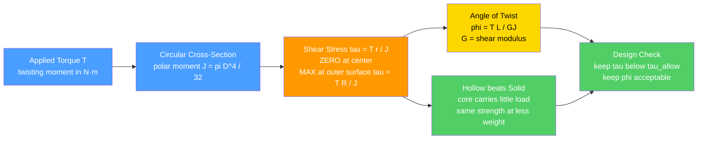

# ⚙️ Torsion and Shafts

> [!abstract] TL;DR
> **Torsion** is what happens when you apply a **torque** (twisting moment) $T$ to a shaft: it produces **shear stress** and an **angle of twist**. For a circular shaft the shear stress varies **linearly** with radius, $\tau = T r / J$ — **zero at the center, maximum at the outer surface** ($\tau_{max} = T R / J$) — where $J = \pi D^4/32$ is the **polar second moment of area**. The end-to-end twist is $\varphi = T L /(G J)$, with $GJ$ the **torsional rigidity**. Because the outer material carries almost all the load, a **hollow tube** delivers nearly the same strength and stiffness at far less weight. A rotating shaft transmits **power** $P = T\omega$, so shafts are sized from the required power and rpm to keep $\tau$ below allowable and $\varphi$ acceptable — the core calculation behind every engine, motor, gearbox, pump, and drivetrain.

---

## Intuition — analogy FIRST

Wring out a wet towel: you grab both ends and **twist one against the other**. Your hands apply a torque; the towel resists by developing internal shearing between its fibers. That is torsion in one gesture.

Every rotating shaft in the world does this under load. Your car's **driveshaft** twists as it delivers engine torque to the wheels; a **drill bit** twists against the material it cuts; the spindle in every motor twists as it drives its load. Twist a shaft hard enough and it **shears apart** (the same way you can snap a soft metal rod by twisting rather than pulling it).

Torsion analysis answers the practical question: **how thick must a shaft be** to transmit its power without twisting excessively or breaking? And it reveals a beautiful piece of engineering — because the stress lives near the outer surface and the core barely works, a **hollow tube does the job with a fraction of the weight** of a solid rod. That single fact is why driveshafts, bicycle frames, and aircraft tubes are hollow.

---

## How It Works

A torque $T$ applied to the ends of a circular shaft makes each cross-section rotate slightly relative to the next. Plane sections stay plane (for circular sections only), so the shear strain — and therefore the **shear stress** — grows in direct proportion to the distance $r$ from the axis. The material integrated over the section resists $T$ through the **polar moment** $J$, and the accumulated rotation along length $L$ is the **angle of twist**.

### Core relations

1. **Torsion formula:** $\displaystyle \tau(r) = \frac{T\,r}{J}$, linear in $r$, with $\displaystyle \tau_{max} = \frac{T R}{J}$ at the surface.
2. **Polar second moment of area:** solid circle $\displaystyle J = \frac{\pi D^4}{32}$; hollow $\displaystyle J = \frac{\pi (D_o^4 - D_i^4)}{32}$.
3. **Angle of twist:** $\displaystyle \varphi = \frac{T L}{G J}$, where $G$ is the **shear modulus** and $GJ$ the **torsional rigidity**.
4. **Power transmission:** $\displaystyle P = T\,\omega$, with $\omega = 2\pi N/60$ for shaft speed $N$ in rpm.



---

## Key Concepts

### Secondary (intuition)
- A **torque** is a twisting effort; applied to a rod it produces **torsion**.
- The rod resists by **shearing internally** — the twist you feel is the material fighting back.
- Twist too hard and it **shears apart**; the failure surface of a twisted chalk stick spirals at 45°.
- A **hollow tube** is nearly as strong in twist as a solid bar but much lighter — the middle barely does anything.

### Undergraduate (the working theory)
- **Torsion formula (circular shafts):** $\tau = T r / J$ — shear stress is **linear in radius**, zero on the axis, maximum at the surface $\tau_{max} = TR/J = 16T/(\pi D^3)$ for a solid shaft.
- **Polar second moment of area** $J$: solid $\pi D^4/32$; hollow $\pi(D_o^4 - D_i^4)/32$. Because of the fourth power, moving material outward is enormously effective.
- **Angle of twist** $\varphi = TL/(GJ)$; $GJ$ is the **torsional rigidity** — governs precision drives and torsional deflection.
- **Power transmission** $P = T\omega$: given required power and rpm, back out torque, then size $D$ so $\tau_{max} \le \tau_{allow}$ and $\varphi$ stays within limits.
- **Solid vs hollow:** for equal weight (equal area), a hollow shaft has a much larger $J$ → lower stress and less twist.

### Graduate (where the simple formula breaks)
- **Non-circular sections warp:** cross-sections no longer stay plane; the elementary formula fails. Solved via **Saint-Venant torsion** and the **Prandtl stress function**; **thin-walled open sections** (I-beams, channels, split tubes) are torsionally very weak, while **closed thin-walled tubes** obey **Bredt's formula** $\tau = T/(2 A_m t)$.
- **Combined bending and torsion:** real shafts see **bending + torsion together** → biaxial stress state analyzed with **principal stresses / Mohr's circle** and failure criteria (max-shear/Tresca, distortion-energy/von Mises); the ASME shaft equation folds both in.
- **Stress concentration** at **keyways, shoulders, holes, and steps** amplifies local shear — apply factor $K_t$ (and $K_f$ for fatigue).
- **Fatigue:** a rotating shaft under bending sees **fully-reversed cyclic stress** every revolution → design against the endurance limit, not just static strength.
- **Torsional vibration & critical speeds:** the shaft is a torsional spring-mass system; resonances and whirling set operating-speed limits.

---

## Python Demo

```python
# Torsion of circular shafts: (a) shear-stress distribution + angle of twist,
# (b) solid vs hollow shaft of EQUAL WEIGHT, and power-vs-speed shaft sizing.
import numpy as np
import matplotlib.pyplot as plt

# ---- Material & load ----
G       = 80e9        # shear modulus of steel, Pa
T       = 1000.0      # applied torque, N*m
L       = 1.5         # shaft length, m

# ============================================================
# (a) TORSION FORMULA: tau(r) = T*r/J, and angle of twist phi = T*L/(G*J)
# ============================================================
D  = 0.050                 # solid shaft diameter, m
R  = D / 2.0
J_solid = np.pi * D**4 / 32.0
r = np.linspace(0.0, R, 200)
tau = T * r / J_solid                      # linear: zero at center, max at surface
tau_max = T * R / J_solid                  # = 16*T/(pi*D^3)
phi = T * L / (G * J_solid)                # angle of twist, radians
print(f"(a) Solid D={D*1e3:.0f} mm  J={J_solid:.3e} m^4  "
      f"tau_max={tau_max/1e6:.1f} MPa  twist={np.degrees(phi):.3f} deg")

# ============================================================
# (b) SOLID vs HOLLOW of EQUAL AREA (equal weight): compare J, tau_max, twist
# ============================================================
A_solid = np.pi * R**2
k = 0.75                                    # inner/outer radius ratio of hollow shaft
Ro = np.sqrt(A_solid / (np.pi * (1 - k**2)))   # equal area -> same weight
Ri = k * Ro
J_hollow = np.pi * (Ro**4 - Ri**4) / 2.0       # = pi*(Do^4 - Di^4)/32
tau_max_h = T * Ro / J_hollow
phi_h     = T * L / (G * J_hollow)
print(f"(b) Hollow Ro={Ro*1e3:.1f} mm Ri={Ri*1e3:.1f} mm (equal weight)  "
      f"J_hollow/J_solid={J_hollow/J_solid:.2f}x  "
      f"tau_max={tau_max_h/1e6:.1f} MPa  twist={np.degrees(phi_h):.3f} deg")

# ============================================================
# (c) POWER TRANSMISSION: size a solid shaft for power P at speed N (rpm)
#     P = T*omega,  omega = 2*pi*N/60,  D = (16*T / (pi*tau_allow))^(1/3)
# ============================================================
P_watt    = 50e3           # 50 kW
tau_allow = 40e6           # allowable shear stress, Pa
N_rpm  = np.linspace(200, 3000, 300)
omega  = 2 * np.pi * N_rpm / 60.0
T_req  = P_watt / omega                              # torque falls as speed rises
D_req  = (16.0 * T_req / (np.pi * tau_allow))**(1/3) # required diameter
print(f"(c) 50 kW @ 1500 rpm -> T={P_watt/(2*np.pi*1500/60):.1f} N*m, "
      f"D_min={(16*(P_watt/(2*np.pi*1500/60))/(np.pi*tau_allow))**(1/3)*1e3:.1f} mm")

# ---- Plots ----
fig, ax = plt.subplots(2, 2, figsize=(12, 9))

# (a) shear stress vs radius (linear)
ax[0,0].plot(r*1e3, tau/1e6, lw=2.5, color="#ff9900")
ax[0,0].fill_between(r*1e3, 0, tau/1e6, alpha=0.25, color="#ff9900")
ax[0,0].axhline(tau_max/1e6, ls="--", color="crimson",
                label=f"tau_max = {tau_max/1e6:.1f} MPa at surface")
ax[0,0].scatter([0],[0], color="navy", zorder=5, label="tau = 0 at center")
ax[0,0].set_title("(a) Torsion formula: shear stress is LINEAR in radius")
ax[0,0].set_xlabel("radius r (mm)"); ax[0,0].set_ylabel("shear stress tau (MPa)")
ax[0,0].legend(); ax[0,0].grid(alpha=0.3)

# (b) solid vs hollow bar comparison (equal weight)
labels = ["polar moment J\n(x1e-7 m^4)", "tau_max (MPa)", "twist (deg)"]
solid_vals  = [J_solid*1e7, tau_max/1e6,   np.degrees(phi)]
hollow_vals = [J_hollow*1e7, tau_max_h/1e6, np.degrees(phi_h)]
x = np.arange(len(labels)); w = 0.35
ax[0,1].bar(x - w/2, solid_vals,  w, label="solid", color="#4a9eff")
ax[0,1].bar(x + w/2, hollow_vals, w, label="hollow (equal weight)", color="#51cf66")
ax[0,1].set_xticks(x); ax[0,1].set_xticklabels(labels, fontsize=9)
ax[0,1].set_title("(b) Same weight: hollow has larger J -> less stress & twist")
ax[0,1].legend(); ax[0,1].grid(alpha=0.3, axis="y")

# (b2) cross-section sketch
th = np.linspace(0, 2*np.pi, 200)
ax[1,0].plot(R*1e3*np.cos(th), R*1e3*np.sin(th), color="#4a9eff", lw=2, label="solid outer")
ax[1,0].fill(R*1e3*np.cos(th), R*1e3*np.sin(th), color="#4a9eff", alpha=0.15)
ax[1,0].plot(Ro*1e3*np.cos(th), Ro*1e3*np.sin(th), color="#51cf66", lw=2, label="hollow outer")
ax[1,0].plot(Ri*1e3*np.cos(th), Ri*1e3*np.sin(th), color="#51cf66", lw=2, ls="--", label="hollow inner")
ax[1,0].set_aspect("equal"); ax[1,0].set_title("(b) Cross-sections of equal area")
ax[1,0].set_xlabel("mm"); ax[1,0].set_ylabel("mm"); ax[1,0].legend(fontsize=8); ax[1,0].grid(alpha=0.3)

# (c) power-transmission shaft sizing
ax[1,1].plot(N_rpm, D_req*1e3, lw=2.5, color="purple")
ax[1,1].set_title("(c) Sizing a 50 kW shaft: min diameter vs speed")
ax[1,1].set_xlabel("shaft speed N (rpm)"); ax[1,1].set_ylabel("required diameter (mm)")
ax[1,1].grid(alpha=0.3)
ax2 = ax[1,1].twinx()
ax2.plot(N_rpm, T_req, lw=1.5, ls=":", color="gray")
ax2.set_ylabel("required torque T (N*m)", color="gray")

plt.tight_layout(); plt.show()
```

**What it shows:** (a) the shear stress rises straight from **zero at the axis to a maximum at the surface**, and the same $J$ sets the angle of twist. (b) A hollow shaft of **identical weight** has a substantially larger polar moment $J$, so both its peak stress and its twist drop — the central material was nearly dead weight. (c) For a fixed 50 kW, **required torque falls as rpm rises**, so a faster shaft can be thinner — the essence of matching gearbox stages to shaft sizes.

---

## Real-World Applications

- **Automotive driveshafts / half-shafts:** hollow steel or aluminum tubes carry engine torque to the wheels; hollow construction cuts rotating mass and raises the critical (whirl) speed.
- **Motor, pump, turbine, and compressor rotors:** every rotating machine has a shaft sized by torsion (plus bending) to survive the transmitted power at operating rpm.
- **Gearbox and transmission shafts:** input/output shafts and countershafts are sized from $P = T\omega$ at each speed stage, with keyways and splines checked for stress concentration.
- **Torsion bars and anti-roll bars:** a suspension component that is *deliberately* a torsion spring — its rigidity $GJ$ is the design target.
- **Drill strings and torque tools:** long slender shafts transmit torque to a bit; excessive twist and torsional oscillation ("stick-slip") are governed by $\varphi = TL/GJ$.
- **Aircraft and bicycle tubes:** thin-walled closed tubes maximize torsional stiffness per unit weight — the hollow-shaft principle taken to the structural scale.

---

## Common Pitfalls

- **Confusing torsion with bending.** Torsion comes from a **torque (twisting moment)** about the shaft axis and produces **shear** stress; bending comes from a transverse moment and produces **normal** stress. Real shafts usually have both.
- **Forgetting the stress is at the surface, not the center.** For circular shafts $\tau = T r/J$ is **linear, zero on the axis, maximum at the outer fiber**. Design checks use $\tau_{max} = TR/J$, never the average.
- **Using the wrong second moment.** Torsion uses the **polar** second moment $J = \pi D^4/32$ (solid). Bending uses $I = \pi D^4/64$. They differ by a factor of 2 — mixing them up halves or doubles your answer.
- **Applying the circular formula to non-circular sections.** Rectangles, I-beams, and split tubes **warp**; $\tau = Tr/J$ does **not** apply. Open thin-walled sections are torsionally very weak — use Saint-Venant / Bredt theory instead.
- **Ignoring the power-speed link.** Sizing from torque alone misses that torque = $P/\omega$: for the same power a slow shaft needs far more torque (and diameter) than a fast one.
- **Overlooking combined loading.** A shaft under **bending + torsion** has a biaxial state — resolve principal stresses with **Mohr's circle** and a failure criterion (von Mises / max-shear), not the torsion stress alone.
- **Neglecting stress concentration and fatigue.** Keyways, shoulders, and holes multiply local stress by $K_t$; a rotating shaft sees **fully-reversed cyclic** stress, so fatigue — not static strength — often governs.
- **Treating the shaft as infinitely stiff.** Torsional rigidity $GJ$ sets deflection, backlash, and **torsional resonance / critical speed** — critical for precision drives and high-speed rotors.

---

## Related Concepts

- [[Stress_Strain_and_Elastic_Moduli]] — supplies the **shear modulus** $G$ (from $G = E/[2(1+\nu)]$) that appears in the angle of twist $\varphi = TL/GJ$.
- [[Rotational_Dynamics]] — defines **torque** and **angular speed** $\omega$; a torsion analysis picks up where rotational dynamics leaves off, asking how the shaft *internally resists* that torque.
- [[Work_Energy_and_Conservation]] — grounds **power transmission** $P = T\omega$, the bridge from mechanical power to shaft sizing.
- [[Robot_Dynamics_and_Equations_of_Motion]] — robot joint torques flow through actuator shafts, gears, and links whose torsional stiffness and strength are set by exactly this theory.

*(Siblings referenced in prose — Statics_and_Equilibrium, Stress_Strain_and_Deformation, Bending_and_Beam_Theory, Failure_Fatigue_and_Fracture, and Gears_and_Power_Transmission — will be wikilinked once those notes exist.)*

---

## Review Questions

1. **(Secondary)** When you twist a solid metal rod, where inside it is the material working hardest, and where is it barely doing anything? Use that to explain in one sentence why bicycle frames and driveshafts are hollow tubes.
2. **(Undergraduate)** A solid steel shaft ($G = 80$ GPa) 40 mm in diameter and 1.2 m long carries 800 N·m. Compute (a) the maximum shear stress $\tau_{max} = 16T/(\pi D^3)$ and (b) the angle of twist $\varphi = TL/(GJ)$ in degrees. If the shaft instead had to transmit 30 kW, what rpm would produce that same 800 N·m torque?
3. **(Graduate)** A shaft in a gearbox carries a bending moment $M$ **and** a torque $T$ simultaneously. Explain why you cannot simply check $\tau = TR/J$ alone. Outline how you would combine the two using Mohr's circle to get the principal stresses, and name the failure criterion you would apply. Then explain why a keyway near that section and the fact that the shaft rotates change which failure mode you actually design against.

---

## Sources

- Hibbeler, R. C. *Mechanics of Materials* — Ch. 5, Torsion (torsion formula, angle of twist, power transmission).
- Gere, J. M. & Goodno, B. J. *Mechanics of Materials* — torsion of circular bars, statically indeterminate torsion, thin-walled tubes.
- Budynas, R. & Nisbett, K. *Shigley's Mechanical Engineering Design* — shaft design, combined bending and torsion, stress concentration, fatigue.
- Beer, F., Johnston, E. R., DeWolf, J. & Mazurek, D. *Mechanics of Materials* — Ch. 3, Torsion.
- Timoshenko, S. P. & Goodier, J. N. *Theory of Elasticity* — Saint-Venant torsion of non-circular sections and warping.

---

#mechanical-engineering #torsion #shafts #shear-stress #power-transmission
