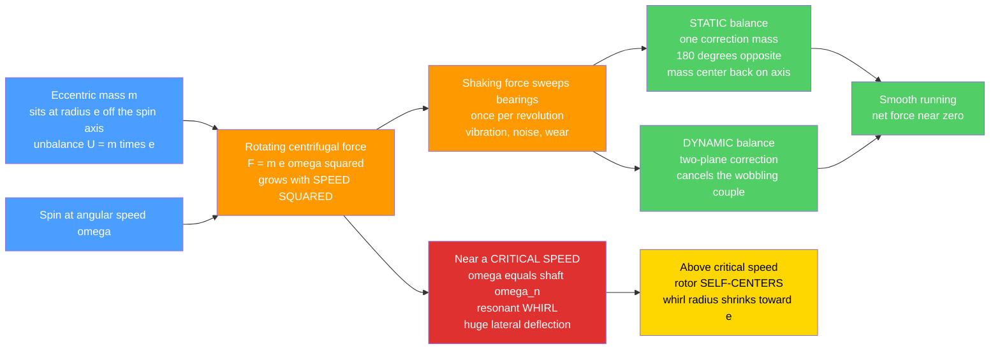

# ⚙️ Balancing and Rotordynamics

> [!abstract] TL;DR
> Any rotor whose mass is not perfectly centered on its spin axis carries an **eccentric mass** that, when spun, throws off a **rotating centrifugal force** $F = m\,e\,\omega^2$ — mass $\times$ eccentricity $\times$ angular speed **squared**. Because that force grows with the **square of speed**, a microscopic imbalance that is harmless at idle becomes violent at high rpm (a car wheel shimmies; a turbine can tear itself apart). **Balancing** redistributes mass to cancel it: **static / single-plane** balancing fixes a mass center that is merely off-axis (one opposite weight, like a wheel weight), while **dynamic / two-plane** balancing is required for long rotors where imbalance spread along the length forms a wobbling **couple** that no single weight can cure. **Rotordynamics** then studies the spinning shaft as a flexible system: at a **critical speed** — where the rotation frequency equals a shaft natural frequency — the rotor **whirls** in resonance with huge lateral deflection. The **Jeffcott rotor** shows the amplitude peaking at the critical speed and then **self-centering** above it, which is why machines are designed to run safely away from criticals and to pass through them quickly. Together these disciplines keep every wheel, turbine, turbocharger, pump, motor, and hard drive spinning smooth and alive.

---

## Intuition — analogy FIRST

A **single grain of imbalance in your car's wheel** makes the whole steering wheel shudder at highway speed. Why should something so tiny matter? Because a small off-center mass spinning fast throws out a surprisingly large outward force — and that force grows with the **square of speed**. Double the speed and the shaking quadruples. That is why a wheel that feels perfectly fine in a parking lot can buzz your hands numb at 70 mph, and why the tire shop presses those little lead weights onto your rim: they are cancelling the imbalance.

Now scale that grain up to a **jet engine spinning at 30,000 rpm**, or a turbocharger at 150,000 rpm, and imbalance stops being annoying and becomes **catastrophic** — bent shafts, wrecked bearings, thrown blades. **Balancing** is the art of distributing a rotor's mass so its spin produces no net shaking force. **Rotordynamics** is the companion art of understanding the **dangerous speeds** at which a flexible shaft stops spinning quietly and instead **whirls** — bowing out sideways like a jump rope — because the machine is being spun right at its own natural frequency. Master both and every rotor in the world stays smooth; ignore either and it shakes, wears, and eventually fails.

---

## How It Works

A rotor is *balanced* when its **mass axis** (the axis its mass is actually distributed around, through the center of mass) coincides exactly with its **spin axis** (the geometric axis the bearings force it to turn about). Any mismatch means some mass sits at a radius $e$ from the spin axis, and Newton demands a **centripetal force** to hold it in its circular path — the reaction is a **centrifugal force** $F = m\,e\,\omega^2$ that rotates *with the rotor*, sweeping around once per revolution and hammering the bearings. Balancing drives $e \to 0$ by adding or removing correction mass; rotordynamics handles what happens when the leftover force meets a resonance.

### Core mechanism

1. **Unbalance creates a rotating force.** An eccentric mass $m$ at radius $e$ spinning at $\omega$ produces $F = m\,e\,\omega^2$, directed along the line from spin axis to heavy spot, rotating at $\omega$. The product $U = m\,e$ is the **unbalance**; the force scales with $\omega^2$.
2. **Static (single-plane) balancing.** If the whole heavy spot lies effectively in one plane, add a correction mass $m_c$ at radius $r_c$ **180° opposite** so that $m_c r_c = m\,e$. The mass center returns to the axis and the net force vanishes — exactly what a wheel weight does.
3. **Dynamic (two-plane / couple) balancing.** In a long rotor two equal heavy spots at opposite ends and opposite sides can leave the mass center *on* the axis (statically balanced) yet form a **couple** that makes the rotor wobble end-for-end when spun. Cancelling a couple needs correction masses in **two planes**. Balancing machines measure the response in two bearings and compute both.
4. **Rotordynamics and critical speed.** The shaft is a spring, the disk a mass — a spinning **spring–mass–damper**. Its natural frequency is $\omega_n = \sqrt{k/m}$. When $\omega \approx \omega_n$ the residual unbalance drives a **resonance**: the shaft bows out and **whirls**. The **Jeffcott rotor** predicts whirl radius $r$ peaking at $\omega = \omega_n$ (the **critical speed**) and then shrinking toward $r \to e$ as $\omega$ rises — the rotor **self-centers**, spinning about its own mass center.
5. **Speed-dependent behavior.** Gyroscopic moments split the natural frequency into **forward** and **backward whirl** branches that shift with speed — mapped on a **Campbell diagram** whose intersections with the running line locate the criticals. Bearing stiffness/damping shape the peaks; oil films can even drive self-excited **oil whirl / oil whip** instabilities.



---

## Key Concepts

### Secondary (intuition)
- A rotor whose weight is not evenly spread around its spin axis has a **heavy spot**; spinning it throws that spot outward and **shakes the machine**.
- The shaking force gets **much stronger as you spin faster** — it grows with the *square* of speed, so high-speed rotors must be balanced very well.
- **Balancing** adds or removes small weights until the heavy spot is cancelled — the little lead weights on a car wheel are the everyday example.
- There is a **dangerous speed** for a long flexible shaft where it starts to **whirl** (bow out sideways like a skipping rope). Machines are designed to avoid running there.

### Undergraduate (the working theory)
- **Rotating unbalance force:** $F = m\,e\,\omega^2$, where $U = m\,e$ is the unbalance (units kg·m or g·mm) and $\omega = 2\pi N/60$ for rpm $N$. The **quadratic** speed dependence is the central fact.
- **Static vs dynamic balance:** *static* (single-plane) balancing removes a net offset of the mass center — check by letting the rotor settle on knife edges. *Dynamic* (two-plane) balancing also removes the **couple** from length-distributed unbalance — only detectable while spinning.
- **Balance quality (ISO 21940 / ISO 1940 grades):** allowable residual specific unbalance $e_{per} \cdot \omega = $ const defines grades like **G6.3** (general machinery), **G2.5** (turbines, pumps), **G1.0 / G0.4** (grinding spindles, gyros). Faster machines demand tighter $e$.
- **Jeffcott (Laval) rotor:** a disk (mass $m$, eccentricity $e$) on a massless flexible shaft (stiffness $k$) with damping $c$. Whirl amplitude
  $$\frac{r}{e} = \frac{(\omega/\omega_n)^2}{\sqrt{\left(1-(\omega/\omega_n)^2\right)^2 + \left(2\zeta\,\omega/\omega_n\right)^2}},\qquad \omega_n=\sqrt{k/m},\ \ \zeta=\frac{c}{2\sqrt{km}}.$$
- **Critical speed:** $N_{cr}$ at which $\omega=\omega_n$; the amplitude peaks (limited only by damping). Design rule of thumb: keep operating speed at least **20–30% away** from any critical, or accelerate through it quickly.
- **Self-centering:** for $\omega \gg \omega_n$, $r \to e$ and the **phase reaches 180°** — the heavy spot swings to the *outside* while the rotor spins about its own mass center, running smoothly (supercritical operation).

### Graduate (where it gets subtle)
- **Gyroscopic coupling:** a spinning disk resists tilting; its gyroscopic moment couples the two lateral bending planes and makes natural frequencies **depend on spin speed**, splitting each mode into **forward** and **backward whirl** branches.
- **Campbell (interference) diagram:** plot whirl natural frequencies vs spin speed; intersections with the synchronous line ($\text{freq}=\text{spin}$) and with engine-order lines locate criticals and potential resonances. Essential for turbomachinery certification.
- **Synchronous vs non-synchronous whirl:** unbalance drives **synchronous** whirl (whirl frequency = spin frequency). **Sub-** and **super-synchronous** whirl signal other mechanisms — misalignment, rubs, cracks, or self-excited instabilities.
- **Oil whirl and oil whip:** in fluid-film (journal) bearings the oil wedge can drive a self-excited whirl at ~0.42–0.48× shaft speed (**oil whirl**); if it locks onto a critical it becomes destructive **oil whip**. A rotordynamic *instability*, not a forced resonance.
- **Bearing and support dynamics:** bearing **stiffness and damping** (rolling-element, fluid-film, magnetic) set critical-speed locations and peak amplitudes; anisotropic supports produce **elliptical whirl orbits**. Squeeze-film dampers are added specifically to tame criticals.
- **Rigid vs flexible rotors:** below the first bending critical a rotor behaves rigidly (two-plane balancing suffices); above it the shaft **deforms into mode shapes** and needs **modal / multi-plane (influence-coefficient) balancing** at several planes and speeds.
- **Torsional criticals:** beyond lateral whirl, drivetrains have **torsional** natural frequencies (shaft as a torsional spring) that must dodge engine-order excitation — see the shaft-as-spring view in torsional analysis.

---

## Python Demo

```python
# Balancing & rotordynamics in two pictures:
#   (a) UNBALANCE: the rotating centrifugal force F = m*e*omega^2 grows with SPEED SQUARED,
#       and a correction mass 180 deg opposite (single-plane balancing) cancels almost all of it.
#   (b) CRITICAL SPEED / WHIRL: the Jeffcott rotor whirl amplitude peaks at the critical speed
#       (rotation freq = shaft natural freq) and then SELF-CENTERS above it.
import numpy as np
import matplotlib.pyplot as plt

# ---------------------------------------------------------------
# (a) ROTATING UNBALANCE FORCE  F = m * e * omega^2
# ---------------------------------------------------------------
m_disk = 5.0            # rotor mass, kg
e0     = 200e-6         # eccentricity BEFORE balancing, m  (200 micron -> heavy!)
e_res  = 10e-6          # residual eccentricity AFTER single-plane balancing, m (2% left)

N_rpm  = np.linspace(0, 12000, 500)      # speed sweep, rpm
omega  = 2*np.pi*N_rpm/60.0              # rad/s

F_unbal = m_disk * e0    * omega**2      # force with raw unbalance
F_bal   = m_disk * e_res * omega**2      # force after adding correction mass 180 deg opposite

# quote the quadratic growth at a couple of speeds
for N in (3000, 6000, 12000):
    w = 2*np.pi*N/60.0
    print(f"(a) {N:5d} rpm: raw F = {m_disk*e0*w**2:8.1f} N   "
          f"balanced F = {m_disk*e_res*w**2:6.1f} N   "
          f"(force x{ (m_disk*e0*w**2)/(m_disk*e0*(2*np.pi*3000/60)**2):.1f} vs 3000 rpm)")

# ---------------------------------------------------------------
# (b) JEFFCOTT (LAVAL) ROTOR: disk on a flexible shaft
#     whirl amplitude  r/e = rr^2 / sqrt((1-rr^2)^2 + (2*zeta*rr)^2),  rr = omega/omega_n
# ---------------------------------------------------------------
k_shaft = 1.0e6                          # shaft lateral stiffness, N/m
wn      = np.sqrt(k_shaft/m_disk)        # undamped natural frequency, rad/s
N_cr    = wn*60/(2*np.pi)                # CRITICAL SPEED, rpm
print(f"\n(b) omega_n = {wn:.1f} rad/s  ->  CRITICAL SPEED N_cr = {N_cr:.0f} rpm")

rr = np.linspace(0.01, 3.0, 600)         # speed ratio omega/omega_n
def whirl(rr, zeta):
    return rr**2 / np.sqrt((1 - rr**2)**2 + (2*zeta*rr)**2)
def phase(rr, zeta):
    return np.degrees(np.arctan2(2*zeta*rr, 1 - rr**2))   # heavy-spot lag, 0->180 deg

zetas = [0.02, 0.05, 0.10, 0.25]         # increasing damping tames the peak

# ---------------------------------------------------------------
# Plots
# ---------------------------------------------------------------
fig, ax = plt.subplots(2, 2, figsize=(12, 9))

# (a) unbalance force vs speed: quadratic growth + correction
ax[0,0].plot(N_rpm, F_unbal, lw=2.5, color="#e03131", label=f"raw unbalance (e={e0*1e6:.0f} um)")
ax[0,0].plot(N_rpm, F_bal,   lw=2.5, color="#51cf66", label=f"after balancing (e={e_res*1e6:.0f} um)")
ax[0,0].fill_between(N_rpm, F_bal, F_unbal, alpha=0.15, color="#e03131")
ax[0,0].set_title("(a) Unbalance force F = m e omega^2  (grows with SPEED SQUARED)")
ax[0,0].set_xlabel("rotor speed (rpm)"); ax[0,0].set_ylabel("shaking force (N)")
ax[0,0].legend(); ax[0,0].grid(alpha=0.3)

# (a2) single-plane balancing as a vector cancellation
th = np.linspace(0, 2*np.pi, 200)
ax[0,1].plot(np.cos(th), np.sin(th), color="gray", lw=1, alpha=0.5)
ax[0,1].annotate("", xy=(1.0, 0), xytext=(0,0),
                 arrowprops=dict(arrowstyle="-|>", color="#e03131", lw=3))
ax[0,1].text(1.02, 0.05, "unbalance U = m e", color="#e03131")
ax[0,1].annotate("", xy=(-0.95, 0), xytext=(0,0),
                 arrowprops=dict(arrowstyle="-|>", color="#51cf66", lw=3))
ax[0,1].text(-1.5, -0.15, "correction mc rc\n180 deg opposite", color="#2b8a3e")
ax[0,1].scatter([0],[0], color="navy", zorder=5)
ax[0,1].text(0.02, 0.12, "net ~ 0", color="navy")
ax[0,1].set_xlim(-1.7, 1.7); ax[0,1].set_ylim(-1.2, 1.2); ax[0,1].set_aspect("equal")
ax[0,1].set_title("(a) Single-plane (static) balancing: cancel U with an opposite mass")
ax[0,1].axis("off")

# (b) Jeffcott whirl amplitude vs speed: resonance peak at the critical speed
for z in zetas:
    ax[1,0].plot(rr, whirl(rr, z), lw=2, label=f"zeta = {z:.2f}")
ax[1,0].axvline(1.0, ls="--", color="crimson", label="critical speed (omega = omega_n)")
ax[1,0].axhline(1.0, ls=":", color="gray", label="self-centering limit r/e -> 1")
ax[1,0].set_ylim(0, 8)
ax[1,0].set_title("(b) Jeffcott whirl: peak at CRITICAL SPEED, self-centers above")
ax[1,0].set_xlabel("speed ratio omega / omega_n"); ax[1,0].set_ylabel("whirl amplitude r / e")
ax[1,0].legend(fontsize=8); ax[1,0].grid(alpha=0.3)

# (b2) phase of the heavy spot: 0 -> 90 (at critical) -> 180 (self-centered)
for z in zetas:
    ax[1,1].plot(rr, phase(rr, z), lw=2, label=f"zeta = {z:.2f}")
ax[1,1].axvline(1.0, ls="--", color="crimson")
ax[1,1].axhline(90, ls=":", color="gray")
ax[1,1].set_title("(b) Phase: heavy spot swings out (90 deg at critical, 180 deg above)")
ax[1,1].set_xlabel("speed ratio omega / omega_n"); ax[1,1].set_ylabel("phase lag (deg)")
ax[1,1].legend(fontsize=8); ax[1,1].grid(alpha=0.3)

plt.tight_layout(); plt.show()
```

**What it shows:** (a) the shaking force rises as the **square of speed** — the raw curve rockets up while, after a single-plane correction that leaves only a tiny residual eccentricity, the balanced curve stays nearly flat; the vector sketch makes the cancellation explicit (unbalance $U=m e$ met by an equal, opposite correction). (b) the Jeffcott rotor's whirl amplitude **peaks sharply at the critical speed** ($\omega=\omega_n$), with damping $\zeta$ setting how tall the peak gets, and then **self-centers** as $r/e \to 1$ above it — while the phase sweeps from $0°$ through $90°$ *at* the critical to $180°$ above, the signature that the rotor has begun spinning about its own mass center.

---

## Real-World Applications

- **Jet & gas-turbine engines:** multi-disk rotors spinning at tens of thousands of rpm are balanced to tight ISO grades and analyzed with full rotordynamic + Campbell models; blade loss or thermal bow shifts unbalance and criticals in flight.
- **Turbochargers:** tiny rotors at 100,000–250,000 rpm run **supercritical** (above one or more criticals) on floating-ring oil-film bearings; balancing and oil-whirl control are make-or-break.
- **Pumps, compressors, and steam/gas turbines:** API 610/617 machines require documented critical-speed margins and unbalance response before shipment; two-plane and modal balancing are standard.
- **Electric motors & generators:** rotors are dynamically balanced; large turbogenerators are trim-balanced *in situ* (field balancing) using influence coefficients.
- **Hard-disk drives & optical spindles:** platters and spindle motors are balanced to sub-milligram levels so read/write heads track without vibration.
- **Machine-tool spindles:** high-speed milling/grinding spindles need G0.4–G1.0 balance; residual unbalance shows up directly as chatter and surface finish defects.
- **Automotive wheels & drivetrains:** static + dynamic wheel balancing (the tire shop's spin balancer) cures highway shimmy; crankshafts and driveshafts are two-plane balanced and kept below their whirl critical.
- **Centrifuges:** lab and industrial centrifuges interlock on imbalance because $F=m e \omega^2$ at high rpm can shear mounts.

---

## Common Pitfalls

- **Underestimating the speed-squared law.** Unbalance force is $F = m\,e\,\omega^2$ — it grows with the **square** of speed. A residual that is invisible at 1,000 rpm can be destructive at 10,000 rpm (100× the force). This is *the* reason high-speed rotors demand tight balance grades.
- **Confusing static with dynamic balance.** A rotor can be **statically balanced** (mass center on the axis, sits at any angle on knife edges) yet **dynamically unbalanced** — length-distributed heavy spots form a **couple** that only appears while spinning. Long rotors need **two-plane** correction; single-plane will not fix a couple.
- **Balancing in the wrong number of planes.** Rigid rotors below the first bending critical need one or two planes; **flexible rotors** operating above it deform into mode shapes and require **multi-plane / modal (influence-coefficient) balancing** at several planes and speeds.
- **Trusting one weight for high-speed, long rotors.** A single correction plane that balances at low speed can leave a couple that grows with speed — always assess whether a two-plane or modal approach is needed.
- **Confusing vibration frequency with rotation speed.** Unbalance is **synchronous** (vibration at 1× rpm). Vibration at 2× may be misalignment; at ~0.5× it may be **oil whirl**; a critical is where the *response* peaks, not a new excitation. Diagnose from the spectrum, not the shake alone.
- **Ignoring the critical speed.** Running at or accelerating slowly *through* $\omega \approx \omega_n$ invites resonant **whirl**. Keep a margin (commonly 20–30%) or **pass through quickly**; never dwell on a critical.
- **Forgetting speed-dependent natural frequencies.** Gyroscopic effects split modes into **forward/backward whirl** that move with speed — a single "natural frequency" number is misleading. Use a **Campbell diagram** to place criticals across the operating range.
- **Neglecting bearing stiffness & damping.** Criticals and peak amplitudes depend strongly on **support dynamics**; fluid-film bearings add damping but can trigger **oil whirl/whip** instabilities. Anisotropic supports give elliptical orbits and split criticals.
- **Chasing a moving balance state.** Thermal bow, fouling, erosion, and looseness change unbalance over time; **field/trim balancing** on the assembled machine — not just shop balancing of the bare rotor — is often required.
- **Applying lab balance grades blindly.** ISO grades assume a rigidly supported, rigid rotor; flexible-rotor and supercritical machines need response-based (unbalance-response) criteria, not just a residual-unbalance number.

---

## Related Concepts

- [[Oscillations_and_SHM]] — the **critical speed is a resonance**: whirl amplitude peaks when the forcing frequency (spin) equals the shaft's natural frequency, exactly the damped-forced-oscillator response, with damping ratio $\zeta$ setting the peak height.
- [[Rotational_Dynamics]] — supplies **angular velocity** $\omega$ and the **centripetal/centrifugal force** on an eccentric mass that produces the rotating unbalance load $F = m e \omega^2$.
- [[Second_Order_Linear_ODEs]] — the Jeffcott rotor is a **second-order damped forced ODE** ($m\ddot r + c\dot r + k r = m e \omega^2$ per plane); its steady-state solution gives the whirl-amplitude and phase curves plotted above.
- [[Torsion_and_Shafts]] — the flexible **shaft** whose lateral stiffness $k$ sets $\omega_n$ (and whose **torsional** stiffness sets separate torsional criticals) is sized by the same shaft mechanics.

*(Siblings referenced in prose — Mechanical_Vibrations, Particle_and_Rigid_Body_Dynamics, Gears_and_Power_Transmission, and Pumps_Compressors_and_Turbines — will be wikilinked once those notes exist.)*

---

## Review Questions

1. **(Secondary)** Your car's steering wheel shudders only above about 60 mph, not at low speed. Using the idea that the shaking force grows with the *square* of speed, explain why a wheel imbalance that is unnoticeable in a parking lot becomes strong on the highway — and what the little weights the tire shop adds are actually doing.
2. **(Undergraduate)** A 5 kg rotor has a residual eccentricity of 20 μm on a shaft of lateral stiffness $k = 1.0\times10^6$ N/m. (a) Compute the critical speed in rpm. (b) Compute the unbalance force $F=m e\omega^2$ at 3,000 rpm and at 6,000 rpm — by what factor does it grow? (c) The rotor is statically balanced but the manufacturer warns it is still *dynamically* unbalanced. What physically is left uncorrected, and how many correction planes are needed to fix it?
3. **(Graduate)** A turbocharger must run at 120,000 rpm, well above its first critical speed. (a) Explain, using the Jeffcott self-centering result and the phase curve, why *supercritical* operation is smooth even though the machine passed through a resonance to get there. (b) Sketch how a Campbell diagram and gyroscopic forward/backward whirl branches would be used to certify that no critical sits in the continuous-operating band. (c) The vibration spectrum shows a growing component at ~0.45× shaft speed. Why is this *not* unbalance, what instability does it indicate, and what design change in the bearings would you propose?

---

## Sources

- Rao, S. S. *Mechanical Vibrations* — rotating unbalance, whirling of shafts, critical speeds, forced vibration.
- Vance, J. M., Zeidan, F. & Murphy, B. *Machinery Vibration and Rotordynamics* — Jeffcott rotor, critical speeds, bearing dynamics, instabilities.
- Genta, G. *Dynamics of Rotating Systems* — gyroscopic effects, Campbell diagrams, forward/backward whirl, modal balancing.
- Norton, R. L. *Design of Machinery* — static and dynamic (two-plane) balancing of rotating and reciprocating machinery.
- ISO 21940-11 (formerly ISO 1940-1) — *Mechanical vibration — Rotor balancing — Balance quality grades*.

---

#mechanical-engineering #balancing #rotordynamics #critical-speed #whirl
