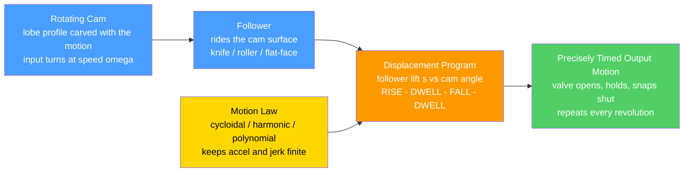

# ⚙️ Cams and Linkages

> [!abstract] TL;DR
> A **cam** is a shaped member — usually a rotating lobe or plate — whose **profile**, traced by a **follower**, produces a precisely-programmed output motion. You literally **sculpt the desired motion into the metal**: this is mechanical *programming*, where the timing and displacement live in a *shape* instead of in code. The design flows in two stages. First the **motion program**: specify the follower's **displacement $s$ versus cam angle $\theta$** over one revolution as segments — **RISE, DWELL (hold), FALL, dwell** — and choose a smooth **motion law** within each. A naive **constant-velocity** rise causes **infinite acceleration** (hence infinite force, shock, wear) at the transitions, so **cycloidal / harmonic / polynomial** laws are used to keep **acceleration and jerk finite** — the **S-V-A-J diagrams** (displacement, velocity, acceleration, jerk) are the design tool. Second the **cam synthesis**: convert $s(\theta)$ into the actual **cam profile**, accounting for follower type (**knife-edge, roller, flat-face**), the **pressure angle** (too high → jamming), and **undercutting** (an un-manufacturable profile). Cams give **arbitrary programmed motion** (engine valves, packaging, printing, textile machines) but are hard to modify and wear at the contact; **linkages** (four-bar, six-bar) are robust and low-friction but limited to what their geometry allows; increasingly, **electronic / servo "cams"** — a motor executing $s(\theta)$ in software — replace mechanical cams for flexibility.

---

## Intuition — analogy FIRST

How does an engine open each valve at *exactly* the right instant, hold it open, then snap it shut — over and over, thousands of times a minute, without ever being told what to do? A **cam**: a specially-shaped lobe on a spinning shaft that pushes a **follower** up and down in a precisely programmed motion. Where the lobe is tall, the follower is pushed far out; where the lobe is a plain circular arc centered on the shaft, the follower **holds still** (a *dwell*); the transitions between are shaped to make the follower rise and fall smoothly.

The beautiful part is that **the shape *is* the program**. Instead of writing code with timing statements, you **carve the timing and displacement directly into a piece of metal**. One turn of the cam replays one complete cycle of the motion — rise, hold, fall, hold — perfectly repeatable, forever, driven by nothing but a rotating shape and something pressing against it. Cams (and specially-designed **linkages**) are how machines execute complex, exactly-timed motions with cleverly shaped metal rather than a computer. The same "design the position curve so its derivatives stay smooth" mindset is exactly what a robot's **trajectory generator** does in software today.

---

## How It Works

The cam is the *input* (it rotates at some speed $\omega$); the follower is the *output* (it translates or oscillates). At every instant the follower sits at whatever height the profile presents at the current angle. So the whole design reduces to one function — the **displacement diagram** $s(\theta)$ — plus the geometry needed to *realize* it.

### Core mechanics

1. **Lay out the timing.** Divide one revolution into segments: **rise** (follower goes from low to high over cam angle $\beta_1$), **dwell** (held high — a circular arc, so $s$ is constant), **fall** (returns over $\beta_2$), and a bottom **dwell**. The angular widths encode *when* each event happens.
2. **Choose a motion law for each rise/fall.** This sets *how* the follower moves between endpoints. The law determines the derivatives, and the derivatives determine the forces. The velocity, acceleration, and jerk are **successive derivatives of $s$ with respect to cam angle**, scaled by shaft speed: $V=\omega\,\dfrac{ds}{d\theta}$, $A=\omega^2\,\dfrac{d^2s}{d\theta^2}$, $J=\omega^3\,\dfrac{d^3s}{d\theta^3}$. A discontinuity in any derivative means a spike (ideally an *impulse*) in the next one — the source of shock, noise, and wear.
3. **Draw the S-V-A-J diagrams.** Plotting $s,\,v,\,a,\,j$ versus $\theta$ reveals whether the law is kind to the machine: you want acceleration finite everywhere and jerk bounded (continuous acceleration), which is why **cycloidal** and **polynomial (3-4-5, 4-5-6-7)** laws win over constant-velocity or even simple-harmonic.
4. **Synthesize the profile (geometry).** The **pitch curve** is the base circle plus the displacement: $r(\theta)=R_\text{base}+s(\theta)$. For a **knife-edge radial** follower that *is* the cam contour; for a **roller** follower you offset inward by the roller radius; for a **flat-face** follower you envelope the tangent lines. Along the way you check the **pressure angle** (keep the side-thrust reasonable) and guard against **undercutting** (a curvature the follower can't follow).



---

## Key Concepts

### Secondary (intuition)
- A **cam** is a shaped wheel or lobe; as it spins, a **follower** rides its edge and is pushed up and down.
- The **shape is the program**: a tall part of the lobe pushes the follower far out; a plain circular part centered on the shaft **holds it still** — that hold is called a **dwell**.
- **One turn of the cam = one full cycle** of the motion (rise, hold, fall, hold), repeated forever with perfect timing.
- The **camshaft** in a car engine is the classic example: each lobe opens and closes one valve at exactly the right moment.

### Undergraduate (the working theory)
- **Displacement diagram $s(\theta)$:** follower lift versus cam angle, segmented into **rise – dwell – fall – dwell**; the widths set the timing.
- **Motion laws (why the curve shape matters):**
  - **Constant velocity** — straight-line rise; looks efficient but the velocity *jumps* from zero at the dwell → **infinite acceleration** (impulsive force) at each end. Never use raw.
  - **Simple harmonic (SHM)** — smooth $s$ and finite acceleration, but acceleration *jumps* at the segment ends → **infinite jerk** → vibration.
  - **Cycloidal** — acceleration goes smoothly to zero at both ends → **finite jerk**; excellent general-purpose high-speed law.
  - **Polynomial (3-4-5, 4-5-6-7)** — you *choose* boundary conditions on $s$ and its derivatives, killing discontinuities to whatever order you need.
- **S-V-A-J diagrams:** $V=\omega s'$, $A=\omega^2 s''$, $J=\omega^3 s'''$. **Smoothness of the higher derivatives → low vibration, noise, and wear.** Jerk is the practical quality metric.
- **Cam synthesis:** **pitch curve** $r(\theta)=R_\text{base}+s(\theta)$; the **actual profile** is offset by the roller radius (roller follower) or enveloped by tangents (flat-face follower).
- **Cam types:** **plate / disk** (radial motion), **cylindrical** (groove cut in a drum → axial motion), **face**, **wedge**, **conjugate** (a pair for positive drive). **Follower types:** knife-edge, **roller**, flat-face; **translating** (radial or offset) or **oscillating**.
- **Closure:** **force closure** (a spring keeps the follower pressed on the cam) versus **form closure** (a groove or conjugate/desmodromic pair drives the follower *both* ways — no spring needed).

### Graduate (where it gets subtle)
- **Pressure angle $\phi$:** the angle between the follower's direction of motion and the common normal (the line of force) at the contact. High $\phi$ → large **side thrust**, friction, and possible **jamming**; rule of thumb keep $\phi \lesssim 30^\circ$ for translating roller followers. Reduced by a **larger base circle** or by **offsetting** the follower.
- **Radius of curvature and undercutting:** if the cam's curvature is sharper than the **roller radius**, the roller cannot physically reach the theoretical profile → **undercut** (lift is lost). For **flat-face** followers, a locally **concave (negative) radius of curvature** produces a **cusp** — an impossible profile. The fix is almost always a **bigger base circle**.
- **Kinematic coefficients vs time derivatives:** the *shape* fixes $s'(\theta),\,s''(\theta)$ (geometry), but the *forces* scale as $A=\omega^2 s''$. A cam with beautifully smooth *kinematics* still sees **inertial force growing as $\omega^2$** — high-speed cams are dominated by dynamics, not geometry.
- **Follower jump / float:** at high speed the required inertial force exceeds what the **return spring** can supply → the follower **loses contact**, then slams back down (impact, noise, pitting). This is a *dynamic* failure invisible to a purely kinematic design; it demands spring-preload sizing and a spring-mass model of the follower train.
- **Polydyne / dynamic cam design:** treat the follower train as a **flexible spring-mass system** and shape the cam so the motion at the *end mass* is smooth despite compliance — you deliberately distort the cam to pre-compensate for the machine's own elasticity.
- **Cams vs linkages (the real trade):** a **cam** buys **arbitrary programmed motion** in a compact package but pays with **sliding/rolling contact wear** and a shape that is expensive to change. A **linkage** (four-bar, six-bar) runs on low-friction **revolute joints** — robust and long-lived — but is limited to the motions its geometry allows (dwells are only *approximate*, via coupler curves) and is harder to **synthesize** for a specified path (Freudenstein's equation; function/path/motion generation). **Electronic / servo "cams"** move $s(\theta)$ into software (a cam table or electronic gearing), trading mechanical simplicity for reprogrammability.

---

## Python Demo

```python
# Cam design in two stages:
#   (a) MOTION PROGRAM (S-V-A-J): design the follower's displacement over one
#       revolution as RISE - DWELL - FALL - DWELL, with a smooth CYCLOIDAL law,
#       and compare against a naive CONSTANT-VELOCITY law to show WHY the law
#       matters (constant velocity -> infinite acceleration at the ends).
#   (b) CAM PROFILE: convert the displacement program s(theta) into the actual
#       lobe shape r(theta) = R_base + s(theta) (polar synthesis).
import numpy as np
import matplotlib.pyplot as plt

# ---- Cam timing (one revolution) and geometry ----
h   = 20.0                      # follower lift / rise, mm
Rb  = 40.0                      # base-circle radius, mm
N   = 600.0                     # cam speed, rpm
w   = 2*np.pi*N/60.0            # cam angular speed, rad/s

# Segment boundaries in radians (each event is 90 deg): rise, dwell, fall, dwell
b_rise = np.deg2rad(90.0);  d_top = np.deg2rad(90.0)
b_fall = np.deg2rad(90.0)
th1 = b_rise                    # end of RISE
th2 = th1 + d_top               # end of top DWELL
th3 = th2 + b_fall              # end of FALL   (bottom dwell fills the rest)

theta = np.linspace(0.0, 2*np.pi, 3601)   # cam angle over one revolution

def displacement(theta, law="cycloidal"):
    """Follower lift s(theta) [mm] for RISE-DWELL-FALL-DWELL."""
    s = np.zeros_like(theta)
    # RISE: 0 -> h over [0, th1]
    m = theta < th1
    x = theta[m] / b_rise                          # normalized 0..1
    s[m] = h*(x - np.sin(2*np.pi*x)/(2*np.pi)) if law == "cycloidal" else h*x
    # DWELL (top): held at h over [th1, th2]
    m = (theta >= th1) & (theta < th2)
    s[m] = h
    # FALL: h -> 0 over [th2, th3]
    m = (theta >= th2) & (theta < th3)
    x = (theta[m] - th2) / b_fall
    rise = (x - np.sin(2*np.pi*x)/(2*np.pi)) if law == "cycloidal" else x
    s[m] = h*(1.0 - rise)
    # DWELL (bottom): held at 0 over [th3, 2*pi]  -> already zero
    return s

s_cyc = displacement(theta, "cycloidal")
s_cv  = displacement(theta, "constant")

# Time derivatives:  V = w * ds/dtheta,  A = w^2 * d2s/dtheta2  (units: mm -> /1000 = m)
def deriv(y, x): return np.gradient(y, x)
v_cyc = w    * deriv(s_cyc, theta)
a_cyc = w**2 * deriv(deriv(s_cyc, theta), theta)
j_cyc = w**3 * deriv(deriv(deriv(s_cyc, theta), theta), theta)
v_cv  = w    * deriv(s_cv, theta)
a_cv  = w**2 * deriv(deriv(s_cv, theta), theta)

# Analytic peak acceleration of the cycloidal rise:  A_max = 2*pi*h/beta^2 * w^2
A_max_cyc = 2*np.pi*h/b_rise**2 * w**2 / 1000.0    # m/s^2
print(f"Cam: lift {h:.0f} mm, base circle {Rb:.0f} mm, {N:.0f} rpm (w={w:.1f} rad/s)")
print(f"Cycloidal peak |A| (analytic) = {A_max_cyc:6.1f} m/s^2  (FINITE)")
print(f"Cycloidal peak |J|            = {np.max(np.abs(j_cyc))/1000:8.0f} m/s^3 (bounded)")
print(f"Const-velocity peak |A|       = {np.max(np.abs(a_cv))/1000:8.0f} m/s^2  "
      f"-> spikes toward INFINITY at the ends (impulsive shock)")

# ---- Plots: (a) S-V-A diagrams + (b) synthesized cam profile ----
th_deg = np.rad2deg(theta)
fig = plt.figure(figsize=(13, 9))
ax1 = fig.add_subplot(2, 2, 1)                       # Displacement S
ax2 = fig.add_subplot(2, 2, 2)                       # Velocity V
ax3 = fig.add_subplot(2, 2, 3)                       # Acceleration A
ax4 = fig.add_subplot(2, 2, 4, projection="polar")   # Cam profile (polar)

def shade(ax):
    ax.axvspan(0, 90,   alpha=0.08, color="green",  label="RISE")
    ax.axvspan(90, 180, alpha=0.08, color="gray")
    ax.axvspan(180,270, alpha=0.08, color="orange")
    for xb in (90, 180, 270): ax.axvline(xb, color="k", lw=0.5, alpha=0.3)

# (a1) Displacement
shade(ax1)
ax1.plot(th_deg, s_cyc, lw=2.5, color="#1f77b4", label="cycloidal")
ax1.plot(th_deg, s_cv,  lw=1.5, ls="--", color="crimson", label="constant velocity")
ax1.set_title("(a) Displacement S:  RISE - DWELL - FALL - DWELL")
ax1.set_xlabel("cam angle theta (deg)"); ax1.set_ylabel("follower lift s (mm)")
ax1.set_xticks([0,90,180,270,360]); ax1.legend(fontsize=8); ax1.grid(alpha=0.3)

# (a2) Velocity  -- note the constant-velocity JUMPS at the dwell edges
ax2.plot(th_deg, v_cyc/1000, lw=2.5, color="#1f77b4", label="cycloidal")
ax2.plot(th_deg, v_cv/1000,  lw=1.5, ls="--", color="crimson", label="constant velocity")
ax2.set_title("(a) Velocity V:  const-velocity JUMPS (discontinuous)")
ax2.set_xlabel("cam angle theta (deg)"); ax2.set_ylabel("follower velocity V (m/s)")
ax2.set_xticks([0,90,180,270,360]); ax2.legend(fontsize=8); ax2.grid(alpha=0.3)

# (a3) Acceleration -- cycloidal is finite & smooth; const-velocity spikes to +/- infinity
ax3.plot(th_deg, a_cyc/1000, lw=2.5, color="#1f77b4", label="cycloidal (finite)")
ax3.plot(th_deg, a_cv/1000,  lw=1.5, ls="--", color="crimson",
         label="constant velocity (-> infinite)")
ax3.set_ylim(-2.2*A_max_cyc, 2.2*A_max_cyc)          # clip the impulsive spikes
ax3.annotate("shock spikes -> infinity\n(clipped)", xy=(90, 1.6*A_max_cyc),
             fontsize=8, color="crimson", ha="center")
ax3.set_title("(a) Acceleration A:  WHY the motion law matters")
ax3.set_xlabel("cam angle theta (deg)"); ax3.set_ylabel("follower accel A (m/s^2)")
ax3.set_xticks([0,90,180,270,360]); ax3.legend(fontsize=8); ax3.grid(alpha=0.3)

# (b) CAM PROFILE synthesis: pitch curve r(theta) = R_base + s(theta), knife-edge follower
r_profile = Rb + s_cyc
ax4.plot(theta, r_profile, lw=2.5, color="#ff7f0e", label="cam profile")
ax4.fill(theta, r_profile, alpha=0.15, color="#ff7f0e")
ax4.plot(theta, np.full_like(theta, Rb), lw=1.2, ls="--", color="gray", label="base circle")
ax4.set_title("(b) Synthesized cam profile (polar lobe shape)", pad=18)
ax4.set_rticks([Rb, Rb+h]); ax4.legend(loc="lower left", fontsize=8, bbox_to_anchor=(-0.1,-0.1))

plt.tight_layout(); plt.show()
```

**What it shows:** In stage **(a)** the **cycloidal** displacement rises, holds, falls, and holds with silky-smooth velocity and a **finite, sinusoidal acceleration** (~200 m/s² here) whose jerk stays bounded. The **constant-velocity** law traces the same endpoints but its velocity *jumps* at every dwell edge, so its acceleration **spikes toward infinity** — an impulsive hammer-blow that would shatter the follower train. That single contrast is the whole reason cam engineers obsess over the **S-V-A-J** curves. Stage **(b)** turns the chosen displacement into the actual **lobe shape**: the polar curve $r(\theta)=R_\text{base}+s(\theta)$ *is* the cam you would machine — the motion program made metal. Because $A\propto\omega^2$, the printed peak acceleration explains why the *same* geometry becomes violent at high rpm.

---

## Real-World Applications

- **Internal-combustion valvetrains (the camshaft):** each lobe programs a valve's lift and timing; the choice of ramp/nose profile trades power against smoothness. Racing engines use **desmodromic (form-closure)** cams to open *and* close the valve positively, eliminating **valve float** at extreme rpm.
- **Automated production machinery:** cam-driven **index tables**, pick-and-place arms, **screw machines / Swiss lathes** (banks of cams sequence every tool), and classic **sewing machines** all replay complex, exactly-timed cycles from shaped metal.
- **Packaging and printing presses:** cams sequence knives, folders, grippers, and registration with sub-degree timing so paper and film are cut, folded, and stamped in perfect phase.
- **Textile machinery:** looms and knitting machines use cams (and dobby/cam shedding) to lift threads in programmed patterns each cycle.
- **Quick-return and dwell mechanisms:** where a **linkage** is preferred for robustness, four-bar and six-bar chains generate approximate dwells and quick-return strokes (shapers, conveyors) with no sliding-contact wear.
- **Robotics / CNC motion (the modern successor):** servo drives execute a stored displacement table — an **electronic cam** — and jerk-limited **trajectory generation** applies the exact same S-V-A-J smoothness thinking in software.

---

## Common Pitfalls

- **Using a constant-velocity ("straight-line") motion law.** It looks efficient, but the velocity jumps from the dwell → **infinite acceleration and impulsive force** at each end → shock, noise, and pitting. Always transition with a **cycloidal, harmonic, or polynomial** law.
- **Ignoring jerk.** A law can have *finite* acceleration yet still be bad: **simple-harmonic** motion has an acceleration *step* at the ends → **infinite jerk** → ringing and vibration. Judge a cam by the **continuity of $A$ (bounded $J$)**, not just by $A$ being finite.
- **Confusing kinematic coefficients with time derivatives.** The geometry fixes $s''(\theta)$, but the force scales as $A=\omega^2 s''$. Designing at low speed and forgetting the **$\omega^2$** blow-up is how a "smooth" cam becomes a wrecking ball at operating rpm.
- **Excessive pressure angle.** A profile that lifts too aggressively for its base circle drives the **pressure angle** past ~30°, producing large **side thrust**, friction, and **jamming**. Fix with a **larger base circle** or by **offsetting** the follower.
- **Undercutting.** Too small a base circle (roller follower) or a concave region (flat-face follower) yields a curvature the follower can't trace → **lost lift or an impossible profile**. Again, enlarge the base circle.
- **Follower jump / float at speed.** When inertia exceeds the **spring** force, a **force-closed** follower leaves the cam and slams back. Size the **spring preload** for the worst-case $A=\omega^2 s''$, or switch to **form closure** (groove/conjugate/desmodromic).
- **Confusing force closure with form closure.** A spring (force closure) is simple but can lose contact; a groove or conjugate pair (form closure) drives both ways but adds cost and can clatter at reversals. Pick deliberately.
- **Treating the displacement diagram *as* the cam profile.** The profile is $R_\text{base}+s(\theta)$ **offset for the follower type** (roller radius, flat-face envelope) and referenced to the correct **rotation direction** — copying $s(\theta)$ straight onto the metal gives the wrong shape.
- **Reaching for a cam when a linkage (or servo) fits better.** Cams give arbitrary motion but wear and resist change; a **four-bar linkage** is robust and cheap for simpler motions, and a **servo/electronic cam** wins when the program must be reprogrammable.

---

## Related Concepts

- [[Trajectory_Optimization_and_Generation]] — the robotics successor to cam design: generate a position profile whose velocity, acceleration, and **jerk** stay bounded — the S-V-A-J idea done in software (an "electronic cam").
- [[Forward_Kinematics]] — a cam-and-follower is the simplest single-DOF mechanism, a direct map from input angle $\theta$ to output displacement $s$, the same input-to-pose mapping generalized by robot forward kinematics.
- [[Newtons_Laws_and_Kinematics]] — S-V-A-J are position and its **successive time derivatives**; the shock from a bad motion law is $F=mA$ with $A$ blowing up, and **jerk** is the derivative that governs smoothness.
- [[Differentiation]] — velocity, acceleration, and jerk are the first, second, and third derivatives of $s(\theta)$; a smooth cam is precisely one whose higher derivatives stay **continuous**.
- [[Oscillations_and_SHM]] — the **simple-harmonic** motion law is literally SHM; and a cam that excites the follower train near its natural frequency drives the very oscillations analyzed here.
- [[Polynomial_and_Rational_Functions]] — **polynomial motion laws** (3-4-5, 4-5-6-7) are built by imposing boundary conditions on $s$ and its derivatives, the practical way to guarantee finite jerk.

*(Siblings referenced in prose — Mechanisms_and_Kinematics, Particle_and_Rigid_Body_Dynamics, Gears_and_Power_Transmission, Internal_Combustion_Engines, and Machine_Elements — will be wikilinked once those notes exist.)*

---

## Review Questions

1. **(Secondary)** A cam lobe has a section that is a perfect circular arc centered on the shaft. While that section is in contact with the follower, what does the follower do, and what is that segment of the motion program called? Why is one full turn of the cam equal to one complete cycle of the motion?
2. **(Undergraduate)** A "straight-line" constant-velocity rise moves the follower up at a steady rate, which sounds ideal. Explain why it is actually a poor cam motion law: what happens to the follower's **acceleration and force** at the start and end of the rise, and *why*? Name a motion law that fixes this and state, in terms of the S-V-A-J diagrams, exactly what makes it better.
3. **(Graduate)** A high-speed cam designed with a perfectly smooth cycloidal law *still* hammers, wears its lobe, and loses lift on the bench at full rpm. Give **two distinct dynamic** reasons (not kinematic) — e.g., **follower jump** and **follower-train compliance** — and for each explain the redesign you would apply (spring preload / form closure, base-circle size, polydyne shaping). Why does none of this show up in the kinematic S-V-A-J plots?

---

## Sources

- Norton, R. L. *Design of Machinery: An Introduction to the Synthesis and Analysis of Mechanisms and Machines* — cam motion programs, motion laws (SVAJ), pressure angle, undercutting, and cam synthesis.
- Norton, R. L. *Cam Design and Manufacturing Handbook* — comprehensive treatment of motion laws, dynamics, follower jump, and polydyne design.
- Rothbart, H. A. (ed.) *Cam Design Handbook* — cam types, dynamics of cam-follower systems, and manufacturing.
- Uicker, J. J., Pennock, G. R. & Shigley, J. E. *Theory of Machines and Mechanisms* — kinematic synthesis of cams and linkages, displacement diagrams, and mechanism design.
- Waldron, K. J. & Kinzel, G. L. *Kinematics, Dynamics, and Design of Machinery* — cam profile geometry, pressure angle, and linkage synthesis (Freudenstein's equation).

---

#mechanical-engineering #cams #linkages #motion-design #cam-profile
