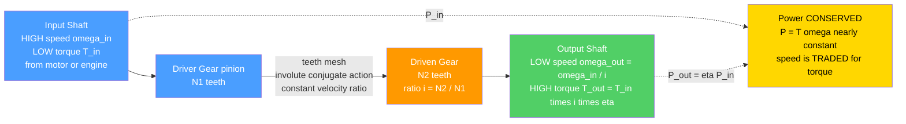

# ⚙️ Gears and Power Transmission

> [!abstract] TL;DR
> **Power transmission** is the art of routing rotary **power** $P = T\omega$ from where it is made (a motor or engine) to where it is used (a wheel, a tool, a robot joint) while **trading speed for torque**. Because power is (nearly) conserved through a mesh, reducing **speed** by a ratio $i$ **multiplies torque** by that same ratio — a lever in rotary form. **Gears** are toothed wheels whose fixed **velocity ratio** equals their **tooth-count ratio** $i = N_2/N_1$; the **involute** tooth profile provides **conjugate action** — a constant velocity ratio despite a sliding contact point — giving smooth, quiet transmission. From spur, helical, bevel, worm, and planetary gears through belts, chains, clutches, and couplings, these are the machine elements that form the **drivetrain of every machine**: car transmissions and differentials, industrial gearboxes, wind-turbine and robot drives, and the humble bicycle.

---

## Intuition — analogy FIRST

A small gear driving a big gear is **a lever in disguise**. Turn the little gear fast and it takes many revolutions to inch the big gear around once — but the big gear turns with far **more twisting force**, exactly the way a long lever multiplies a small push into a large force. You spend turns to buy torque.

That single trade explains a huge amount of the mechanical world. A tiny, screaming, high-speed electric motor moves a **heavy garage door** because a worm-gear reduction converts its feeble high-speed torque into slow, powerful lifting. Your **bicycle's gears** let you spin your legs at a comfortable cadence whether you are sprinting on the flat or grinding up a hill — you are shifting the speed-for-torque trade to match your muscles to the road. A car's **transmission** matches a screaming engine (efficient only in a narrow rpm band) to lazy highway wheels turning a fraction as fast.

Gears — and their cousins belts, chains, clutches, and couplings — are the machines that **trade speed for torque** and **route power from where it is made to where it is needed**. They are the circulatory system of mechanical power.

---

## How It Works

A driver gear meshes with a driven gear so their teeth roll against each other without slipping. Where they touch, the **pitch-line velocities match**, so the smaller gear must spin faster. The ratio of angular speeds is fixed by the ratio of tooth counts, $\omega_1 N_1 = \omega_2 N_2$. Power flowing in one side equals power flowing out the other (minus a few percent of friction loss), and since $P = T\omega$, whatever you take away from speed you get back as torque.

### Core relations

1. **Velocity ratio (one mesh):** $\displaystyle i = \frac{\omega_{\text{in}}}{\omega_{\text{out}}} = \frac{N_{\text{driven}}}{N_{\text{driver}}} = \frac{d_{\text{driven}}}{d_{\text{driver}}}$ — set purely by tooth counts.
2. **Overall gear-train ratio:** $\displaystyle i_{\text{total}} = \prod_{\text{stages}} \frac{N_{\text{driven}}}{N_{\text{driver}}}$ — stages multiply.
3. **Torque multiplication:** $\displaystyle T_{\text{out}} = T_{\text{in}}\, i_{\text{total}}\, \eta$, with efficiency $\eta \approx 0.95\text{--}0.99$ per mesh.
4. **Power (nearly) conserved:** $\displaystyle P_{\text{out}} = \eta\, P_{\text{in}} = \eta\, T_{\text{in}}\omega_{\text{in}} = T_{\text{out}}\omega_{\text{out}}$.
5. **Gear geometry:** module $m = d/N$ (or diametral pitch $P_d = N/d$); base radius $r_b = r_p\cos\phi$ with pressure angle $\phi$ (typically $20°$).



---

## Key Concepts

### Secondary (intuition)
- A **small gear driving a big gear** slows the output down but makes it **stronger** (more torque) — and a big gear driving a small one does the opposite.
- The trade is set by **counting teeth**: three-times as many teeth on the output means one-third the speed and about three times the torque.
- Gears keep speed **exactly** proportional because their teeth are shaped to roll smoothly — that special curve is the **involute**.
- **Belts and chains** do the same job over a distance: a chain (like a bicycle's) does not slip; a belt is cheaper and quieter but can slip.

### Undergraduate (the working theory)
- **Velocity ratio** $i = N_2/N_1$; in a **simple train** idler gears change direction but not ratio, while a **compound train** multiplies ratios across stages to reach large reductions compactly.
- **Torque and power:** $T_{\text{out}} = i\,\eta\,T_{\text{in}}$ and $P_{\text{out}} = \eta P_{\text{in}}$ — the speed-for-torque trade at constant power is the whole point of a gearbox.
- **Involute geometry & conjugate action:** teeth cut as involutes of a **base circle** maintain a **constant velocity ratio** even as the contact point slides along the **line of action**; this tolerates small centre-distance errors, the reason involute gears dominate.
- **Gear parameters:** **module** $m$ (or **diametral pitch** $P_d$) sets tooth size, **pressure angle** $\phi$ ($20°$ standard) sets the line of action, and **backlash** is the deliberate clearance that prevents jamming but creates lost motion.
- **Gear types:** **spur** (parallel shafts, simple, noisy), **helical** (angled teeth — quieter and stronger but generate **axial thrust**), **bevel** (intersecting shafts — differentials), **worm** (perpendicular, very high reduction, often **self-locking**), **planetary/epicyclic** (sun–planet–ring, compact, coaxial, high ratio), and **rack-and-pinion** (rotation ↔ linear, e.g. steering).

### Graduate (design, failure, dynamics)
- **Tooth bending fatigue — Lewis / AGMA:** the tooth is a cantilever loaded by the tangential force $W_t$; bending stress $\sigma = W_t P_d/(F\,Y)$ (Lewis form factor $Y$), refined by the **AGMA** equation with velocity, load-distribution, size, and stress-cycle factors.
- **Surface pitting — Hertzian contact:** repeated rolling/sliding contact drives **contact (pitting) fatigue**; the AGMA surface-durability equation flows from **Hertzian contact stress** between the two involute flanks — usually the life-limiting mode on hardened gears.
- **Efficiency & thermal limits:** each mesh loses a few percent to sliding friction; worm drives can drop to $50\text{--}90\%$ and run hot, which is where **lubrication** (EHL — elastohydrodynamic film) and cooling become design drivers.
- **Planetary kinematics:** the epicyclic ratio depends on **which member is held** (carrier, ring, or sun); the **Willis equation** $(\omega_s - \omega_c)/(\omega_r - \omega_c) = -N_r/N_s$ gives every ratio a single gearset can produce — the basis of **automatic transmissions** and robot hub drives.
- **Dynamics:** transmission error, **mesh stiffness** variation, and **backlash** excite gear **whine** and rattle; helical overlap and profile modification tame it. Shafts, keys, and bearings carrying these loads couple gear design to torsion, bending, and vibration.

---

## Python Demo

```python
# Gears & power transmission: (a) gear-ratio train — speed & torque trade at
# constant power through a COMPOUND reduction; (b) the INVOLUTE tooth profile
# (conjugate action); (c) matching a motor to a load through a gear ratio.
import numpy as np
import matplotlib.pyplot as plt

# ============================================================
# (a) GEAR TRAIN: overall ratio = product of tooth ratios.
#     A 2-stage COMPOUND reduction: pinion->gear, pinion->gear.
#     omega_out = omega_in / i ,  T_out = T_in * i * eta  (power conserved).
# ============================================================
teeth = [(15, 60), (12, 48)]          # (driver, driven) per stage
eta_mesh = 0.97                        # efficiency per mesh
omega_in = 300.0                       # rad/s at the input (about 2865 rpm)
T_in     = 2.0                         # N*m at the input

# Walk the train shaft-by-shaft, accumulating ratio, speed, torque.
labels  = ["Input"]
omega   = [omega_in]
torque  = [T_in]
i_cum, eta_cum = 1.0, 1.0
for k, (Nd, Ng) in enumerate(teeth, start=1):
    i_cum   *= Ng / Nd                 # stage ratio = driven/driver
    eta_cum *= eta_mesh
    labels.append(f"After stage {k}")
    omega.append(omega_in / i_cum)     # slower
    torque.append(T_in * i_cum * eta_cum)  # stronger (minus losses)

i_total = i_cum
P_in  = T_in * omega_in
P_out = torque[-1] * omega[-1]
print(f"(a) overall ratio i = {i_total:.1f} : 1")
print(f"    input : {omega[0]:6.1f} rad/s, {torque[0]:5.2f} N*m, P = {P_in:6.1f} W")
print(f"    output: {omega[-1]:6.1f} rad/s, {torque[-1]:5.2f} N*m, P = {P_out:6.1f} W")
print(f"    power retained = {100*P_out/P_in:.1f} percent (losses = gear friction)")

# ============================================================
# (b) INVOLUTE tooth profile of a base circle (conjugate action).
#     Parametric involute: x = rb(cos t + t sin t), y = rb(sin t - t cos t).
#     Build a symmetric tooth, then replicate around N teeth.
# ============================================================
m, N, phi = 4.0, 12, np.radians(20.0)      # module (mm), teeth, pressure angle
rp = m * N / 2.0                            # pitch radius
rb = rp * np.cos(phi)                       # base radius
ra = rp + m                                 # addendum (tip) radius
inv = lambda a: np.tan(a) - a               # involute function
inv_p = inv(phi)                            # involute angle at pitch circle
half = np.pi / (2 * N)                      # half tooth angle at pitch

r = np.linspace(rb, ra, 60)
alpha = np.arccos(np.clip(rb / r, -1, 1))   # pressure angle at radius r
d_ang = inv(alpha) - inv_p                  # roll relative to pitch point
beta_R = -half - d_ang                      # right flank (teeth taper to tip)
beta_L =  half + d_ang                      # left flank (mirror)

fig, ax = plt.subplots(2, 2, figsize=(13, 10))

# (a) speed through the train (falls)
xa = np.arange(len(labels))
ax[0, 0].bar(xa, omega, color="#4a9eff")
ax[0, 0].set_xticks(xa); ax[0, 0].set_xticklabels(labels, fontsize=9)
ax[0, 0].set_ylabel("angular speed (rad/s)")
ax[0, 0].set_title(f"(a) SPEED falls through the train  (i = {i_total:.0f}:1)")
ax[0, 0].grid(alpha=0.3, axis="y")

# (a) torque through the train (rises)
ax[0, 1].bar(xa, torque, color="#51cf66")
ax[0, 1].set_xticks(xa); ax[0, 1].set_xticklabels(labels, fontsize=9)
ax[0, 1].set_ylabel("torque (N*m)")
ax[0, 1].set_title("(a) TORQUE rises by the same ratio (power ~ constant)")
ax[0, 1].grid(alpha=0.3, axis="y")

# (b) involute gear: replicate the tooth around the wheel
th = np.linspace(0, 2*np.pi, 400)
ax[1, 0].plot(rp*np.cos(th), rp*np.sin(th), "--", color="gray", lw=1, label="pitch circle")
ax[1, 0].plot(rb*np.cos(th), rb*np.sin(th), ":", color="crimson", lw=1, label="base circle")
for k in range(N):
    rot = k * 2*np.pi / N
    xR = r*np.cos(beta_R + rot); yR = r*np.sin(beta_R + rot)
    xL = r*np.cos(beta_L + rot); yL = r*np.sin(beta_L + rot)
    ax[1, 0].plot(xR, yR, color="#ff9900", lw=1.6)
    ax[1, 0].plot(xL, yL, color="#ff9900", lw=1.6)
    # tip cap between the two flanks
    tip = np.linspace(beta_R[-1] + rot, beta_L[-1] + rot, 8)
    ax[1, 0].plot(ra*np.cos(tip), ra*np.sin(tip), color="#ff9900", lw=1.6)
ax[1, 0].set_aspect("equal"); ax[1, 0].legend(fontsize=8, loc="upper right")
ax[1, 0].set_title("(b) INVOLUTE teeth -> conjugate action (constant velocity ratio)")
ax[1, 0].set_xlabel("mm"); ax[1, 0].set_ylabel("mm"); ax[1, 0].grid(alpha=0.3)

# ============================================================
# (c) MATCH a motor to a load through a gear ratio (why transmissions exist).
#     DC motor: T_m(w) = T_stall*(1 - w/w_noload). A load needs T_load at the
#     output; reflected to the motor it is T_load/(i*eta). Solve for operating pt.
# ============================================================
T_stall, w_noload = 0.5, 300.0        # motor: stall torque, no-load speed
T_load_out = 2.0                      # torque the load demands at the OUTPUT
w = np.linspace(0, w_noload, 200)
T_motor = T_stall * (1 - w / w_noload)
ax[1, 1].plot(w, T_motor, lw=2.5, color="navy", label="motor torque curve")
for i_gear, c in zip([1, 3, 6], ["crimson", "darkorange", "green"]):
    T_ref = T_load_out / (i_gear * eta_mesh)      # reflected load at motor shaft
    ax[1, 1].axhline(T_ref, ls="--", color=c, lw=1.5)
    if T_ref < T_stall:                            # operating point exists
        w_op = w_noload * (1 - T_ref / T_stall)
        ax[1, 1].scatter([w_op], [T_ref], color=c, zorder=5,
                         label=f"i={i_gear}:1  OK  out={w_op/i_gear:.0f} rad/s")
    else:
        ax[1, 1].scatter([0], [T_ref], marker="x", s=90, color=c, zorder=5,
                         label=f"i={i_gear}:1  STALLS (load > stall torque)")
ax[1, 1].set_xlabel("motor speed (rad/s)"); ax[1, 1].set_ylabel("torque (N*m)")
ax[1, 1].set_title("(c) Gear ratio matches motor to load")
ax[1, 1].legend(fontsize=8); ax[1, 1].grid(alpha=0.3)

plt.tight_layout(); plt.show()
```

**What it shows:** (a) marching through a **compound two-stage reduction**, the shaft **speed drops** and the **torque rises** by the same overall ratio, while the **power stays nearly constant** — only a few percent leaks to gear friction. (b) Teeth cut as **involutes of the base circle** mesh with **conjugate action**, so the velocity ratio is constant throughout each engagement — the geometric reason gears run smoothly and tolerate small centre-distance errors. (c) A weak, fast motor **cannot move a heavy load directly** (the load torque exceeds the motor's stall torque), but a $6{:}1$ reduction drops the *reflected* load below stall so the motor spins happily and drives the load slowly and strongly — **exactly why transmissions exist**.

---

## Real-World Applications

- **Automotive transmissions & differentials:** manual/automatic gearboxes select ratios to keep the engine near its efficient band; the **differential** uses bevel gears to split torque to two wheels turning at different speeds in a corner. Automatics rely on **planetary** gearsets.
- **Industrial gearboxes:** helical and bevel-helical reducers drive conveyors, mixers, mills, and pumps; **worm** drives give large single-stage reductions with self-locking for hoists and jacks.
- **Wind turbines:** a step-**up** gearbox converts slow, high-torque rotor rotation into the fast rotation a generator needs — one of the most heavily loaded planetary gear systems built.
- **Robotics:** **planetary** and **harmonic (strain-wave)** drives give the high reduction, low backlash, and compactness that robot joints demand; the same speed-for-torque trade sets a joint's peak torque.
- **Bicycles & motorcycles:** **chain** drives (positive, no slip) plus a cassette of sprockets let a rider match cadence to terrain — the everyday gear-ratio machine.
- **Clocks, appliances, and steering:** gear trains divide time in clocks and watches; **rack-and-pinion** turns steering-wheel rotation into linear tie-rod motion; **belts** (timing/V) drive washing machines, HVAC blowers, and engine accessories.

---

## Common Pitfalls

- **Thinking gears create power.** Gears **trade speed for torque at constant power** ($P = T\omega$); the ratio $i = N_{\text{driven}}/N_{\text{driver}}$ that multiplies torque **divides speed** by the same factor. Efficiency ($\approx 95\text{--}99\%$ per mesh) only ever *removes* a little power — it is never gained.
- **Forgetting the involute is what makes it smooth.** The **involute** profile gives **conjugate action** — a constant velocity ratio despite the contact point sliding along the line of action. Non-conjugate teeth cause velocity fluctuation, vibration, and noise; this is also why involute gears tolerate small centre-distance errors.
- **Choosing the wrong gear type for the geometry.** **Spur** for parallel shafts (simple but noisy), **helical** for quieter/stronger parallel drives (but budget for **axial thrust** on the bearings), **bevel** for intersecting shafts, **worm** for huge perpendicular reductions and self-locking, **planetary** for compact coaxial high ratios. Using a spur where a helical belongs invites whine.
- **Ignoring backlash, module, and pressure angle.** Two gears mesh only if they share the same **module** (or diametral pitch) and **pressure angle**. **Backlash** is deliberate clearance — too little jams and overheats, too much destroys positioning accuracy in servos and CNC.
- **Designing for one failure mode only.** Teeth fail two ways: **bending fatigue** at the root (Lewis/AGMA) and **surface pitting** from Hertzian contact stress. Hardened gears are usually **pitting-limited**; checking bending alone is a classic mistake.
- **Over-trusting self-locking worms & neglecting heat.** Worm drives can be self-locking but are **inefficient** ($50\text{--}90\%$) and run hot; without adequate lubrication and cooling they score and seize.
- **Misapplying belts vs chains.** **Belts** are cheap, quiet, and absorb shock but can **slip** and stretch (loss of timing unless toothed); **chains** are positive (no slip) but need lubrication and tensioning and are noisier. Pick by whether exact phase and no slip are required.
- **Underrating the shafts, keys, and bearings.** Gear reactions load the whole assembly — the multiplied torque must pass through a shaft (torsion + bending), a key or spline (shear), and bearings (radial + any axial thrust). A perfect gear on an undersized shaft still fails.

---

## Related Concepts

- [[Rotational_Dynamics]] — defines **torque** and **angular speed** $\omega$; gears are the machines that redistribute exactly these quantities while conserving angular power.
- [[Work_Energy_and_Conservation]] — grounds **power** $P = T\omega$, the conserved quantity that forces the speed-for-torque trade across every mesh.
- [[Robot_Dynamics_and_Equations_of_Motion]] — robot joint torques are delivered through gear reductions (planetary, harmonic); the reflected inertia and peak torque a controller sees are set by the gear ratio here.
- [[Fatigue_Creep_and_High_Temperature_Failure]] — gear teeth are governed by **bending fatigue** at the root; the S–N / endurance-limit thinking there underlies the Lewis/AGMA tooth-life equations.
- [[Stress_Strain_and_Elastic_Moduli]] — the elastic moduli and contact stiffness feed **Hertzian contact stress**, the driver of surface **pitting** fatigue on meshing flanks.

*(Siblings referenced in prose — Particle_and_Rigid_Body_Dynamics, Torsion_and_Shafts, Mechanisms_and_Kinematics, Machine_Elements, and Motor_Drives_and_Control — will be wikilinked once those notes exist.)*

---

## Review Questions

1. **(Secondary)** A small gear with 12 teeth drives a big gear with 48 teeth. Which gear turns faster, and which delivers more twisting force? By what factor? Use this to explain why a tiny high-speed motor can lift a heavy garage door.
2. **(Undergraduate)** A motor delivers 3 N·m at 3000 rpm into a **compound** two-stage reducer with stage ratios $4{:}1$ and $5{:}1$ and mesh efficiency $0.97$ each. Find the overall ratio, the output speed (rpm), the output torque, and the output power. Where did the "missing" power go?
3. **(Graduate)** You must choose between a single **worm** drive and a two-stage **helical** reducer for the same $30{:}1$ reduction on a hoist. Compare them on efficiency, self-locking, axial thrust, noise, and heat. Then explain why the same hardened helical gear might be checked against **both** Lewis bending stress and Hertzian pitting, and which mode you would expect to govern its life.

---

## Sources

- Budynas, R. & Nisbett, K. *Shigley's Mechanical Engineering Design* — spur/helical/bevel/worm gears, AGMA bending and contact (pitting) stress, gear trains.
- Norton, R. L. *Design of Machinery* — gear kinematics, involute geometry and conjugate action, epicyclic (planetary) trains.
- Norton, R. L. *Machine Design: An Integrated Approach* — gear-tooth loading, Lewis form factor, surface durability.
- Dudley, D. W. *Handbook of Practical Gear Design and Manufacture* — practical gear rating, materials, lubrication, and manufacture.
- Juvinall, R. C. & Marshek, K. M. *Fundamentals of Machine Component Design* — belts, chains, clutches, couplings, and shaft/gear integration.

---

#mechanical-engineering #gears #power-transmission #gear-ratio #involute
