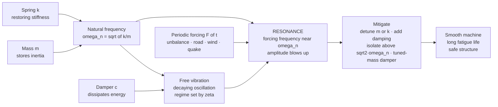

# 〰️ Mechanical Vibrations: Natural Frequency, Damping, and Resonance

> [!abstract] TL;DR
> **Mechanical vibration** is the oscillatory motion of machines and structures, and its master model is the single-degree-of-freedom **mass-spring-damper**: $m\ddot{x} + c\dot{x} + kx = F(t)$. Every system has a **natural frequency** $\omega_n = \sqrt{k/m}$ at which it "wants" to oscillate and a **damping ratio** $\zeta = c/(2\sqrt{mk})$ that governs how quickly free motion decays (under-, critically-, or over-damped). Drive the system with a periodic force *near* $\omega_n$ and you hit **resonance** — the amplitude peaks dramatically, limited only by damping. Resonance is the vibration engineer's great danger (it has toppled bridges, shaken apart engines, and cracked buildings) and it is tamed by three moves: **detune** (shift $\omega_n$), **damp**, or **isolate**. Real structures have *many* natural frequencies, each with a **mode shape**, found by **modal analysis** (eigenvalues of the mass and stiffness matrices).

## Intuition

**Analogy:** Push a child on a swing. If you shove randomly, nothing much happens. But time your pushes to the swing's own rhythm — one gentle push per arc — and those tiny nudges accumulate into huge, soaring swings. That rhythm is the swing's **natural frequency**, and matching it is **resonance**.

Every machine and structure — a turbine shaft, a car chassis, a skyscraper, a guitar string — has one or more natural frequencies at which it "wants" to vibrate. Excite it at one of those frequencies and vibrations grow catastrophically: bridges have collapsed, jet engines have shaken themselves apart, and buildings have crumbled in earthquakes precisely because some forcing landed on a natural frequency. Vibration engineering is the art of *knowing* those frequencies and then either **avoiding** them, **damping** them, or occasionally **exploiting** them — keeping machines smooth, quiet, and alive to their fatigue life, and keeping structures standing.

---

## How It Works

### Core Mechanics

Almost all of vibration theory is built up from one deceptively simple object — the **single-degree-of-freedom (SDOF) mass-spring-damper** — and then generalized.

1. **The three ingredients.** A **mass** $m$ stores kinetic energy and provides *inertia* (it resists acceleration). A **spring** $k$ stores potential energy and provides a *restoring* force $-kx$ that always pulls the mass back toward equilibrium. A **damper** $c$ *dissipates* energy as heat, producing a force $-c\dot{x}$ that opposes velocity. Newton's second law for the mass gives the governing second-order ODE:
   $$m\ddot{x} + c\dot{x} + kx = F(t)$$

2. **Free vibration (no forcing, $F=0$).** With the mass displaced and released, two parameters decide everything. The **undamped natural frequency** $\omega_n = \sqrt{k/m}$ is the rate the system oscillates with no damping — stiffer springs and lighter masses vibrate faster. The dimensionless **damping ratio** $\zeta = c/(2\sqrt{mk}) = c/(2m\omega_n)$ sorts the response into three regimes: **underdamped** ($\zeta < 1$, a decaying oscillation — the case for nearly every real machine), **critically damped** ($\zeta = 1$, the fastest possible return with *no* overshoot), and **overdamped** ($\zeta > 1$, a sluggish crawl back with no oscillation at all). The underdamped system rings at the slightly lower **damped natural frequency** $\omega_d = \omega_n\sqrt{1-\zeta^2}$.

3. **Forced vibration and resonance.** Drive the mass with a harmonic force $F(t) = F_0\cos(\omega t)$. After transients die, the steady-state amplitude is set by the **frequency ratio** $r = \omega/\omega_n$ through the **magnification factor**
   $$M(r) = \frac{X}{X_{static}} = \frac{1}{\sqrt{(1-r^2)^2 + (2\zeta r)^2}}$$
   where $X_{static} = F_0/k$. As $r \to 1$ (forcing near $\omega_n$) the denominator collapses and $M$ peaks sharply — **resonance**. For an undamped system the peak is infinite; for real damping it is finite, roughly $M_{peak} \approx 1/(2\zeta)$. This is the danger: rotating unbalance, road roughness, wind vortices, and earthquakes all supply the periodic forcing that can find a structure's $\omega_n$.

4. **Three ways to fight resonance.** **Detune** — move $\omega_n$ away from the excitation by changing $m$ or $k$ (stiffen a base, lighten a rotor). **Damp** — add $c$ to cap the resonant peak (shock absorbers, viscoelastic layers). **Isolate** — mount the machine on soft springs so vibration is *not transmitted*; the catch is that isolation only works for forcing frequencies **above** $\sqrt{2}\,\omega_n$, and below that a soft mount makes things *worse*. A **tuned-mass damper** adds an auxiliary mass-spring tuned to absorb energy at the troublesome frequency (skyscrapers, the Millennium Bridge).

5. **Beyond one degree of freedom.** Real structures have many masses and stiffnesses, so they have **many** natural frequencies, each with a characteristic deformation pattern called a **mode shape**. **Modal analysis** extracts them by solving the eigenvalue problem $\mathbf{K}\boldsymbol{\phi} = \omega^2\mathbf{M}\boldsymbol{\phi}$ (stiffness and mass matrices). Continuous bodies — beams, plates, shells — have *infinitely* many modes. This is where finite-element analysis earns its keep.

### Flow / Architecture



---

## Key Concepts

### Secondary Level

- **Everything springy has a natural rhythm.** Pluck a ruler off a desk edge, twang a rubber band, or bounce on a diving board — each vibrates at its own frequency. Make it stiffer and it buzzes faster; make it heavier and it wobbles slower. That is $\omega_n = \sqrt{k/m}$ in words: frequency goes up with **stiffness** $k$ and down with **mass** $m$.
- **Push in rhythm and it grows — resonance.** Matching the natural rhythm makes small pushes build to big motion (the swing). Push out of rhythm and almost nothing happens.
- **Friction calms it down — damping.** Real vibrations fade because energy leaks away as heat (air drag, internal friction, shock absorbers). More damping means the wobble dies out faster.
- **Why engineers care.** Resonance can be destructive — it has helped bring down bridges and shake machines apart — so engineers deliberately keep a machine's working speeds away from its natural frequencies.

### Undergraduate Level

- **The governing equation.** $m\ddot{x} + c\dot{x} + kx = F(t)$. Dividing by $m$: $\ddot{x} + 2\zeta\omega_n\dot{x} + \omega_n^2 x = F(t)/m$, with $\omega_n = \sqrt{k/m}$ and $\zeta = c/(2\sqrt{mk})$.
- **Free-response regimes** (characteristic roots $s = -\zeta\omega_n \pm \omega_n\sqrt{\zeta^2-1}$):

  | Regime | Condition | Behavior | Solution form |
  |--------|-----------|----------|---------------|
  | Underdamped | $\zeta < 1$ | Decaying oscillation at $\omega_d = \omega_n\sqrt{1-\zeta^2}$ | $e^{-\zeta\omega_n t}\!\left[A\cos\omega_d t + B\sin\omega_d t\right]$ |
  | Critically damped | $\zeta = 1$ | Fastest non-oscillatory return | $(A + Bt)\,e^{-\omega_n t}$ |
  | Overdamped | $\zeta > 1$ | Slow, no oscillation | $A e^{s_1 t} + B e^{s_2 t}$, both $s<0$ |

- **Logarithmic decrement.** Measure damping experimentally from successive peaks: $\delta = \ln(x_i/x_{i+1}) = 2\pi\zeta/\sqrt{1-\zeta^2}$.
- **Steady-state forced response.** Magnification $M(r) = \left[(1-r^2)^2 + (2\zeta r)^2\right]^{-1/2}$ with $r = \omega/\omega_n$; phase lag $\phi = \arctan\!\big[2\zeta r/(1-r^2)\big]$. Peak amplitude occurs at $r_{peak} = \sqrt{1-2\zeta^2}$ (only slightly below 1 for light damping) with $M_{peak} = 1/(2\zeta\sqrt{1-\zeta^2}) \approx 1/(2\zeta)$.
- **Rotating unbalance.** An unbalanced rotor produces forcing $F_0 = m_e e\,\omega^2$ that *grows with speed squared*, so the transmitted force is largest as the machine spins up through resonance — the origin of the sickening shudder during startup.
- **Transmissibility and isolation.** The fraction of force (or motion) transmitted through a mount is
  $$TR(r) = \sqrt{\frac{1 + (2\zeta r)^2}{(1-r^2)^2 + (2\zeta r)^2}}.$$
  $TR < 1$ (true isolation) only for $r > \sqrt{2}$. Below that the mount *amplifies*; at $r = \sqrt{2}$ every curve passes through $TR = 1$ regardless of damping. This is the single most important — and most violated — rule of vibration isolation.
- **Quality factor.** $Q = 1/(2\zeta) = \omega_n/\Delta\omega_{-3\text{dB}}$ ties sharpness of resonance to the half-power bandwidth (the same $Q$ as an RLC circuit).

### Graduate Level

- **Multi-DOF systems and modal analysis.** For $n$ degrees of freedom, $\mathbf{M}\ddot{\mathbf{x}} + \mathbf{C}\dot{\mathbf{x}} + \mathbf{K}\mathbf{x} = \mathbf{F}(t)$. Solving the generalized eigenproblem $\mathbf{K}\boldsymbol{\phi}_i = \omega_i^2\mathbf{M}\boldsymbol{\phi}_i$ yields $n$ **natural frequencies** $\omega_i$ and **mode shapes** $\boldsymbol{\phi}_i$. The modes are $\mathbf{M}$- and $\mathbf{K}$-orthogonal, so the coupled system **decouples** into $n$ independent SDOF oscillators in **modal coordinates** — the entire justification for modal superposition and reduced-order models.
- **Damping models.** Real damping is messy; engineers approximate it as **proportional (Rayleigh) damping** $\mathbf{C} = \alpha\mathbf{M} + \beta\mathbf{K}$ so the modes stay real and decoupled; otherwise complex modes and state-space methods are required.
- **Continuous systems.** A uniform Euler-Bernoulli beam obeys $EI\,\partial^4 w/\partial x^4 + \rho A\,\partial^2 w/\partial t^2 = 0$, giving an **infinite** discrete spectrum of natural frequencies and mode shapes set by boundary conditions (cantilever, simply supported, free-free). FEA discretizes these into a large but finite modal model.
- **Rotordynamics and critical speeds.** A spinning shaft passes through **critical speeds** where the spin rate coincides with a lateral natural frequency, producing violent whirl; gyroscopic coupling splits frequencies into forward/backward whirl (the **Campbell diagram** maps them versus speed). Ties directly to shaft and bearing design.
- **Self-excited and parametric vibration.** Some vibrations feed themselves: aeroelastic **flutter** (energy drawn from the airflow), machine-tool **chatter** (regenerative cutting), and **stick-slip** (velocity-dependent friction). Others arise from time-varying parameters (**Mathieu equation**, parametric resonance). Unlike forced resonance, these can grow with *no external periodic force* — a linear-stability, eigenvalue-with-positive-real-part problem, not a magnification-factor problem.
- **Random and transient vibration.** Real excitation (turbulence, road, seismic) is stochastic; response is characterized by **power spectral density** and transmitted through the system by $S_{out}(\omega) = |H(\omega)|^2 S_{in}(\omega)$, where $H$ is the frequency-response function — the vibration face of linear-system theory.

---

## Python Demo

```python
# Mechanical vibrations end-to-end, numpy + matplotlib only (no scipy).
#
#   (a) FREE VIBRATION: closed-form response of m*x'' + c*x' + k*x = 0 for
#       UNDER-, CRITICALLY-, and OVER-damped cases. Natural frequency
#       wn = sqrt(k/m); damping ratio zeta = c / (2*sqrt(k*m)).
#   (b) FORCED VIBRATION & RESONANCE: the magnification factor M(r) vs the
#       forcing-frequency ratio r = w/wn, showing the RESONANCE PEAK near
#       r = 1 and how damping caps it.
#   (c) VIBRATION ISOLATION: transmissibility TR(r) -- true isolation (TR<1)
#       only ABOVE r = sqrt(2); below that a soft mount amplifies.
import numpy as np
import matplotlib.pyplot as plt

# ---- system parameters -------------------------------------------------
m = 1.0          # mass  [kg]
k = 400.0        # stiffness [N/m]
wn = np.sqrt(k / m)          # undamped natural frequency [rad/s]  -> 20 rad/s
print(f"natural frequency  wn = {wn:.2f} rad/s  ({wn/(2*np.pi):.2f} Hz)")

# ---- (a) FREE VIBRATION: analytic response for each damping regime ------
def free_response(t, zeta, x0=1.0, v0=0.0):
    """Displacement of m*x'' + c*x' + k*x = 0 with x(0)=x0, x'(0)=v0."""
    if zeta < 1.0:                                   # underdamped
        wd = wn * np.sqrt(1 - zeta**2)
        A = x0
        B = (v0 + zeta * wn * x0) / wd
        return np.exp(-zeta * wn * t) * (A * np.cos(wd * t) + B * np.sin(wd * t))
    elif np.isclose(zeta, 1.0):                      # critically damped
        A = x0
        B = v0 + wn * x0
        return (A + B * t) * np.exp(-wn * t)
    else:                                            # overdamped
        r = wn * np.sqrt(zeta**2 - 1)
        s1, s2 = -zeta * wn + r, -zeta * wn - r
        A = (v0 - s2 * x0) / (s1 - s2)
        B = (s1 * x0 - v0) / (s1 - s2)
        return A * np.exp(s1 * t) + B * np.exp(s2 * t)

t = np.linspace(0, 2.0, 1000)
cases = [(0.05, "underdamped  zeta=0.05"),
         (0.20, "underdamped  zeta=0.20"),
         (1.00, "critically damped  zeta=1.0"),
         (2.00, "overdamped  zeta=2.0")]

# ---- (b)/(c) FORCED RESPONSE & ISOLATION over a frequency sweep ---------
r = np.linspace(0.01, 3.5, 700)          # frequency ratio w / wn
def magnification(r, zeta):
    return 1.0 / np.sqrt((1 - r**2)**2 + (2 * zeta * r)**2)
def transmissibility(r, zeta):
    return np.sqrt((1 + (2 * zeta * r)**2) / ((1 - r**2)**2 + (2 * zeta * r)**2))

zetas = [0.05, 0.10, 0.25, 0.50]

# ---- plotting ----------------------------------------------------------
fig, ax = plt.subplots(1, 3, figsize=(17, 5))

# (a) free-vibration decay
for zeta, label in cases:
    ax[0].plot(t, free_response(t, zeta), lw=2, label=label)
ax[0].axhline(0, color="k", lw=0.6)
ax[0].set_title("(a) Free vibration  m x'' + c x' + k x = 0")
ax[0].set_xlabel("time  [s]"); ax[0].set_ylabel("displacement  x / x0")
ax[0].legend(fontsize=8); ax[0].grid(alpha=0.3)

# (b) resonance / frequency response
for zeta in zetas:
    ax[1].plot(r, magnification(r, zeta), lw=2, label=f"zeta = {zeta}")
ax[1].axvline(1.0, color="r", ls="--", alpha=0.6, label="r = 1 (resonance)")
ax[1].set_title("(b) Forced response -- RESONANCE peak at r near 1")
ax[1].set_xlabel("frequency ratio  r = w / wn")
ax[1].set_ylabel("magnification  M = X / X_static")
ax[1].set_ylim(0, 11); ax[1].legend(fontsize=8); ax[1].grid(alpha=0.3)

# (c) transmissibility / isolation
for zeta in zetas:
    ax[2].plot(r, transmissibility(r, zeta), lw=2, label=f"zeta = {zeta}")
ax[2].axhline(1.0, color="k", lw=0.8)
ax[2].axvline(np.sqrt(2), color="g", ls="--", alpha=0.8, label="r = sqrt(2)")
ax[2].fill_betweenx([0, 4], np.sqrt(2), 3.5, color="green", alpha=0.06)
ax[2].text(2.15, 0.55, "ISOLATION\nzone (TR<1)", color="green", fontsize=9, ha="center")
ax[2].set_title("(c) Transmissibility -- isolate only ABOVE r = sqrt(2)")
ax[2].set_xlabel("frequency ratio  r = w / wn")
ax[2].set_ylabel("transmissibility  TR")
ax[2].set_ylim(0, 4); ax[2].legend(fontsize=8); ax[2].grid(alpha=0.3)

plt.tight_layout(); plt.show()

# ---- numeric takeaways -------------------------------------------------
for zeta in zetas:
    print(f"zeta={zeta:<5}  peak magnification ~ {magnification(r, zeta).max():5.1f}"
          f"   (1/(2 zeta) = {1/(2*zeta):5.1f})")
print("All transmissibility curves cross TR=1 exactly at r = sqrt(2) ~ 1.414")
```

Running this prints $\omega_n = 20$ rad/s and draws three panels that *are* the subject. **Panel (a)** shows free vibration: the lightly-damped cases ring and slowly decay, the critically damped case is the fastest smooth return, and the overdamped case crawls back without ever crossing zero. **Panel (b)** is the resonance curve — as the forcing ratio approaches $r=1$ the amplitude spikes, and lighter damping ($\zeta$) means a taller, sharper peak (roughly $1/2\zeta$). **Panel (c)** is the isolation truth: every transmissibility curve funnels through $TR=1$ at exactly $r=\sqrt{2}$, and only *beyond* that point does a soft mount actually protect the payload — mount too stiff (or run too slow) and the isolator makes vibration *worse*.

---

## Real-World Applications

> **Example — automotive NVH and the shock absorber.** A car's suspension is a textbook mass-spring-damper: the sprung mass (body) on coil springs, damped by the shock absorbers. Engineers deliberately place the body's bounce natural frequency around 1-1.5 Hz — low enough that road input (typically a few Hz and up) sits *above* $\sqrt{2}\,\omega_n$ and is therefore **isolated**, giving a smooth ride. The dampers are sized near $\zeta \approx 0.2$-$0.3$: enough to kill resonance at the bounce frequency without making the ride harsh. "NVH" (noise, vibration, harshness) engineering is this analysis applied across the whole vehicle.

- **Rotating machinery balancing.** Turbines, pumps, and motors are precision-**balanced** so residual unbalance ($F = m_e e\,\omega^2$) does not excite bending modes; operating speeds are chosen to sit safely between **critical speeds**.
- **Skyscraper and bridge tuned-mass dampers.** Taipei 101's 660-tonne pendulum and the retrofit dampers on London's Millennium Bridge are auxiliary mass-springs tuned to the structure's swaying mode, absorbing energy that would otherwise build to alarming amplitudes in wind or crowd loading.
- **Earthquake engineering.** Base isolation mounts buildings on soft bearings to push the structure's fundamental period *away from* dominant seismic frequencies — resonance avoidance at civil scale.
- **Machine-tool chatter.** CNC milling can burst into self-excited **chatter** when the cutting process regeneratively feeds a structural mode; stability-lobe diagrams tell machinists which spindle speeds are safe.
- **Modal testing / experimental modal analysis.** Aircraft, engine blocks, and circuit boards are instrumented with accelerometers and struck with an impact hammer to measure their natural frequencies and **mode shapes**, validating FEA models before hardware flies.

---

## Common Pitfalls

- **Ignoring resonance until the machine shakes apart.** The whole point of vibration analysis is to compute $\omega_n$ *first* and keep operating and forcing frequencies away from it. Rotating unbalance, gear-mesh frequency, road roughness, and wind vortex shedding are all periodic forcings hunting for a natural frequency. The **Tacoma Narrows** bridge (1940) is the folk example (technically wind-driven aeroelastic *flutter*, a self-excited instability rather than simple forced resonance — a distinction worth getting right).
- **Believing resonant amplitude is infinite.** It is unbounded *only* for the idealized undamped case. Any real damping caps the peak at roughly $1/(2\zeta)$; the engineering lever is therefore always $\zeta$.
- **Confusing $\omega_n$, $\omega_d$, and the resonant peak.** They are three slightly different numbers: undamped natural $\omega_n$, damped natural $\omega_d = \omega_n\sqrt{1-\zeta^2}$, and the amplitude-resonance peak at $r=\sqrt{1-2\zeta^2}$. For light damping they nearly coincide, but conflating them causes real errors.
- **The isolation-below-$\sqrt{2}$ trap.** The single most common isolation mistake: bolting a machine onto soft mounts and *increasing* transmitted vibration because the disturbing frequency was below $\sqrt{2}\,\omega_n$. Isolation only works when the mount is soft *enough* that $r>\sqrt{2}$ — a stiffer isolator or a slower machine can be worse than a rigid connection.
- **Adding damping to an isolator to "help."** More damping tames the resonance you pass through at startup, but in the isolation zone ($r>\sqrt{2}$) it *raises* transmissibility. Isolator damping is a trade-off, not a free win.
- **Treating a multi-DOF structure as single-DOF.** Real structures have *many* natural frequencies and **mode shapes**; suppressing the first mode can leave the second exposed. Continuous beams and plates have infinitely many. Do the **modal analysis** (eigenproblem) rather than trusting one lumped estimate.
- **Forgetting the fatigue link.** Vibration means *cyclic* stress; even small resonant amplitudes accumulate millions of cycles and cause fatigue failure far below the static strength — the reason vibration and fatigue are joined at the hip in machine design.
- **Overlooking self-excited vibration.** Flutter, chatter, and stick-slip need no external periodic force — they draw energy from a steady flow, cut, or sliding contact. A "no resonant forcing present" argument does not make a design safe against these instabilities.

*(Sibling notes in this section — Particle_and_Rigid_Body_Dynamics, Balancing_and_Rotordynamics, Gears_and_Power_Transmission, Mechanisms_and_Kinematics, and CAD_CAE_and_Finite_Element_Method — extend these ideas from a single oscillator to full machines, rotors, and finite-element models.)*

---

## Related Concepts

**Physics foundation**
- [[Oscillations_and_SHM]] — the physics parent: SHM, damped and driven oscillators, Q-factor, and normal modes underpinning the whole engineering treatment
- [[Rotational_Dynamics]] — torque, moment of inertia, and angular momentum behind torsional vibration, rotordynamics, and critical speeds

**Mathematical machinery**
- [[Second_Order_Linear_ODEs]] — the exact equation type $m\ddot{x}+c\dot{x}+kx=F$; homogeneous vs particular solutions, characteristic roots, and the under/critical/over-damped trichotomy
- [[Systems_of_ODEs]] — multi-DOF vibration as a coupled first-order system; the eigenvalue route to modal analysis

**Systems / signals view**
- [[Stability_Frequency_Response]] — the frequency-response function $|H(\omega)|$ that *is* the magnification curve; poles set the natural frequencies
- [[Transfer_Functions]] — the Laplace-domain $H(s)=1/(ms^2+cs+k)$ whose pole locations encode $\omega_n$ and $\zeta$
- [[Fourier_Transform]] — decomposes real (random, transient) excitation into the harmonic components that drive resonance

**Electrical analog**
- [[RC_RL_and_RLC_Transients]] — the series RLC circuit is the exact electrical twin of the mass-spring-damper ($L\leftrightarrow m$, $R\leftrightarrow c$, $1/C\leftrightarrow k$), with the same $\omega_n$, $\zeta$, and resonance

**Same section (Mechanical Engineering)**
- [[Torsion_and_Shafts]] — torsional stiffness $k_t=GJ/L$ that sets a shaft's torsional natural frequency and critical speed
- [[Stress_Strain_and_Deformation]] — vibration produces cyclic stress, the driver of fatigue failure

---

## Review Questions

**Secondary**
1. A stiff spring and a heavy mass — which vibrates faster, and why? Using the swing analogy, explain what "resonance" means and give one real example where it is dangerous and one where it is useful.

**Undergraduate**
2. A machine of mass $m = 50$ kg sits on springs of total stiffness $k = 2 \times 10^5$ N/m with damping ratio $\zeta = 0.1$. (a) Find $\omega_n$ in Hz. (b) The machine runs at 1200 rpm — is that above or below resonance, and roughly what magnification factor applies? (c) A colleague proposes *stiffer* mounts to "reduce vibration." Explain, using transmissibility and the $\sqrt{2}$ rule, why that could make things worse.

**Graduate**
3. A two-story building is modeled as a 2-DOF shear frame. (a) Set up $\mathbf{M}\ddot{\mathbf{x}}+\mathbf{K}\mathbf{x}=\mathbf{0}$ and describe how you would obtain the two natural frequencies and mode shapes. (b) You must add a tuned-mass damper to protect against the first mode in an earthquake — how do you choose its mass, stiffness, and damping, and what is the risk to the *second* mode? (c) Contrast this forced-resonance mitigation with the entirely different problem of guarding a rotating shaft against **flutter/whirl** instability, and explain why the second is an eigenvalue (stability) problem rather than a magnification-factor problem.

---

## Sources

- S. S. Rao — *Mechanical Vibrations*, 6th ed. (Pearson, 2017)
- W. T. Thomson & M. D. Dahleh — *Theory of Vibration with Applications*, 5th ed. (Pearson, 1997)
- D. J. Inman — *Engineering Vibration*, 4th ed. (Pearson, 2013)
- J. P. Den Hartog — *Mechanical Vibrations* (Dover reprint, 1985)

---

#mechanical-engineering #vibrations #resonance #natural-frequency #modal-analysis
