# ⚙️ Mechanisms and Kinematics

> [!abstract] TL;DR
> A **mechanism** is an assembly of rigid **links** connected by **joints** (kinematic pairs — the **revolute**/pin, the **prismatic**/slider, plus cams, gears, and screws) arranged so that a single input motion is *transformed* into a desired output motion: a crank's steady rotation becomes a piston's reciprocation, a wiper's sweep, or a coupler point tracing a chosen curve. How many independent motions the assembly has is counted by the **Gruebler–Kutzbach** degree-of-freedom criterion. The two workhorses are the **four-bar linkage** — whose **Grashof condition** decides whether a link can fully rotate (crank-rocker, double-crank, double-rocker) — and the **slider-crank**, the heart of every piston engine and pump. You analyze a mechanism in three stages: **position** (solve the vector **loop-closure** equations), then **velocity** (velocity ratios, **instant centers**), then **acceleration** (which feeds the dynamic forces). And you *design* one by **synthesis** — function, path, or motion generation. This is **kinematics**: the pure geometry of how machines move, worked out *before* any force is applied.

---

## Intuition

**Analogy — the machine's skeleton.** How does the steady spin of an engine crankshaft become the violent up-and-down pumping of a piston? How does a wiper motor's smooth rotation become the sweeping wipe-and-return of a windshield blade? The answer is never magic and never a formula alone — it is a **clever arrangement of stiff bars and pivots**. Just as your forearm's motion is dictated not by your muscles but by the *bones and joints* they pull on, a machine's motion is dictated by its **mechanism**: the skeleton of rigid links and the pin-and-slider joints between them. Change the *lengths* of the bars or *where* you pin them, and the very same input rotation produces a completely different output — a bigger sweep, an intermittent hop, a straight line, a figure-eight. Mechanisms are the art of choosing a geometry of bars and pivots so the machine does *exactly* what you want.

Every device that must move a part along a prescribed path is a mechanism problem first. Before you ask how *strong* the bars must be (that is dynamics and stress), you ask a purely geometric question: given this arrangement, *where does everything go, how fast, and speeding up how much?* That question — motion without regard to the forces causing it — is **kinematics**.

---

## How It Works

### Core Mechanics

1. **Links and joints.** A **link** is a rigid body; a **joint** (or *kinematic pair*) is a connection that permits some relative motion and forbids the rest. The two lower pairs that dominate machinery are the **revolute** (R, a pin — allows one rotation) and the **prismatic** (P, a slider — allows one translation). **Higher pairs** — cam-follower contact, meshing gear teeth — touch along a line or point and allow two relative freedoms.
2. **Count the degrees of freedom (mobility).** Before analyzing motion you check *how many* independent inputs the mechanism needs. For a **planar** mechanism the **Gruebler–Kutzbach** criterion is
   $$M = 3(n-1) - 2 j_1 - j_2$$
   where $n$ is the number of links (the fixed ground counts as one), $j_1$ the number of one-DOF joints (revolute, prismatic), and $j_2$ the number of two-DOF joints. A four-bar has $n=4$, $j_1=4$, $j_2=0 \Rightarrow M = 3(3) - 8 = 1$: a **single** input (turn the crank) fully determines every other part.
3. **Constrain the motion — the loop closes.** A closed mechanism forms a loop of links that must literally *close on itself*. Writing each link as a vector and demanding the loop return to its start gives the **vector loop-closure equation**. For the four-bar with crank $r_2$, coupler $r_3$, rocker $r_4$, and ground $r_1$:
   $$r_2 e^{i\theta_2} + r_3 e^{i\theta_3} = r_1 + r_4 e^{i\theta_4}$$
   Splitting into real and imaginary parts yields two equations; given the input $\theta_2$ you solve for the two unknowns $\theta_3, \theta_4$. This is **position analysis**.
4. **Differentiate for velocity, then acceleration.** Differentiate the loop equation once with respect to time to get the **velocity** relations (or use **instant centers** / velocity polygons graphically), and again for **acceleration**. Acceleration matters because it multiplies mass to give the inertia forces the *dynamics* and *machine design* stages must resist.
5. **Read off the useful outputs.** The path traced by a point on the floating **coupler** link is the **coupler curve** — the signature used for *motion generation*. The **transmission angle** (between coupler and output) tells you how effectively force passes through; near $0°$ or $180°$ the mechanism **toggles** and jams.

### Flow / Architecture

```mermaid
flowchart LR
    IN["INPUT MOTION<br/>crank rotation<br/>single driven degree of freedom"]
    L["RIGID LINKS<br/>crank, coupler, rocker, ground"]
    J["JOINTS / kinematic pairs<br/>revolute pins and prismatic sliders<br/>each pair removes freedoms"]
    DOF["MOBILITY count<br/>Gruebler-Kutzbach criterion<br/>M equals one for a usable mechanism"]
    CON["CONSTRAINED OUTPUT MOTION<br/>rocker sweep, piston slide, coupler path"]
    POS["POSITION analysis<br/>vector loop-closure equations"]
    VEL["VELOCITY analysis<br/>velocity ratios and instant centers"]
    ACC["ACCELERATION analysis<br/>feeds dynamic inertia forces"]
    IN --> L
    L --> J
    J --> DOF
    DOF --> CON
    CON --> POS
    POS --> VEL
    VEL --> ACC
```



---

## Key Concepts

### Secondary Level

- **A machine is bars and pivots.** A **link** is a rigid bar; a **joint** is where two bars connect. A **pin** joint lets them rotate; a **slider** joint lets one slide along the other. Almost every machine's motion comes from just these two ideas.
- **Rotation in, something else out.** The point of a mechanism is *transforming* motion: a spinning crank becomes a sliding piston, a rocking arm, or a pen tracing a shape. Same input, different bar lengths, different output.
- **The four-bar is the fundamental building block.** Four bars in a loop — ground, crank, coupler, rocker. Turn the crank and the rocker swings back and forth. Windshield wipers, bicycle brakes, and folding chairs are four-bars.
- **The slider-crank runs the world's engines.** Crank + connecting rod + piston. Spin the crank and the piston reciprocates in and out — run it backward and the piston's push spins the crank. Every car engine, pump, and compressor is a slider-crank.

### Undergraduate Level

- **Degrees of freedom (mobility).** The **Gruebler–Kutzbach** count $M = 3(n-1) - 2j_1 - j_2$ tells you how many inputs a planar mechanism needs. $M=1$ is the usable case (one motor fully controls it); $M=0$ is a rigid **structure**; $M<0$ is over-constrained (a redundant/statically-indeterminate frame). Miscounting mobility is the classic first mistake.
- **Grashof's law.** For a four-bar with shortest link $s$, longest $l$, and the other two $p, q$: if $s + l \le p + q$ the linkage is **Grashof** and at least one link can fully rotate. *Which* link you fix (the **kinematic inversion**) then decides the type: shortest as ground → **double-crank** (drag-link); shortest adjacent to ground → **crank-rocker**; shortest as coupler → **double-rocker with a rotating coupler**. If $s + l > p + q$ it is **non-Grashof** and every link merely oscillates — a **double-rocker**.
- **Loop-closure / position analysis.** Write the closed loop as a sum of link vectors set to zero, split into $x$ and $y$ (Freudenstein's equation is the algebraic form), and solve for the output angles. Two assembly configurations (**open** and **crossed**) generally exist — pick the branch you built.
- **Velocity analysis & instant centers.** Every moving body has, at each instant, a point (real or virtual) about which it is *purely rotating* — its **instantaneous center of velocity**. The **Aronhold–Kennedy theorem** locates them ($\binom{n}{2}$ centers for $n$ links, three shared centers always collinear), giving velocity ratios and **mechanical advantage** graphically without calculus.
- **The coupler curve & transmission angle.** A point on the coupler (which neither pivots on ground nor stays fixed) traces a **coupler curve** — often a rich, non-circular path, the basis of **path generation**. The **transmission angle** $\mu$ between coupler and output should stay away from $0°$/$180°$ (keep it roughly $40°$–$140°$) so force transmits well; at a **toggle/dead position** the mechanism locks or the output momentarily stalls.
- **The slider-crank exactly.** With crank radius $r$ and rod length $l$, piston position from the crank center is
  $$x(\theta) = r\cos\theta + \sqrt{\,l^2 - r^2\sin^2\theta\,}.$$
  Differentiating shows velocity and acceleration are *not* sinusoidal — the finite rod introduces a **second-harmonic** term $\sim \cos 2\theta$, which is exactly why reciprocating engines need **balancing** (primary and secondary shaking forces).

### Graduate Level

- **Kinematic synthesis.** The inverse problem: *design* the link lengths to achieve a required motion. Three flavors — **function generation** (prescribe an input→output relation, e.g. a computing linkage), **path generation** (make a coupler point trace a curve), and **motion generation / rigid-body guidance** (carry a body through prescribed **poses**). Classical tools: graphical two-/three-position synthesis, **Freudenstein's equations**, and precision-point methods (Chebyshev spacing to minimize structural error).
- **Burmester theory.** For four-position rigid-body guidance, the centers of the circles a moving point can lie on form the **center-point** and **circle-point curves** (Burmester curves); their intersections give the finite set of four-bars that guide a body through five prescribed poses.
- **Number synthesis & type synthesis.** Before dimensions, decide the *topology*: how many links and loops, which joint types. Graph theory and the mobility criterion enumerate all distinct kinematic chains for a target DOF (the Grubler / Assur-group decomposition).
- **Spatial mechanisms & screw theory.** Beyond the plane, joints combine into spatial linkages (RSSR, the universal/Hooke joint, Bennett's overconstrained 4R). **Screw theory** and **twists/wrenches** unify rotation and translation, and are the shared language with robot manipulator kinematics.
- **Singularities and the workspace boundary.** At **dead/toggle** and **branch** singularities the instantaneous velocity map (the mechanism Jacobian) drops rank — the output loses or gains a freedom. These are exactly the closed-chain analog of the manipulator singularities of [[Velocity_Kinematics_and_the_Jacobian]], and they bound the usable workspace.
- **Kinematics before kinetics.** Everything here is *kinematic* — geometry, position, velocity, acceleration — deliberately divorced from force. Acceleration analysis is the handoff: multiply by mass/inertia and you enter **kinetics** (the sibling *Particle_and_Rigid_Body_Dynamics*), where shaking forces, bearing loads, and flywheel sizing live.

---

## Python Demo

```python
# Kinematics of the two classic mechanisms, from geometry alone (no forces).
#   (a) FOUR-BAR LINKAGE: solve the loop-closure equations for the output/coupler
#       angles as the crank turns a full revolution, and plot the COUPLER CURVE
#       (the signature path of a point on the floating coupler). Classify by Grashof.
#   (b) SLIDER-CRANK (engine mechanism): plot piston POSITION, VELOCITY, and
#       ACCELERATION vs crank angle -- showing uniform rotation become non-uniform
#       reciprocation (and why the 2nd-harmonic term forces engine balancing).
# Requires: numpy, matplotlib
import numpy as np
import matplotlib.pyplot as plt

# =====================================================================
# (a) FOUR-BAR LINKAGE  -- loop closure + coupler curve
#     Ground link O2->O4 along +x; O2 at origin, O4 at (r1, 0).
#     Links: r2 = input crank (at O2), r3 = coupler (A->B), r4 = rocker (at O4).
# =====================================================================
r1, r2, r3, r4 = 4.0, 1.0, 3.5, 3.0        # ground, crank, coupler, rocker [arb. length]
O2 = np.array([0.0, 0.0])
O4 = np.array([r1, 0.0])

# --- Grashof classification ---------------------------------------------------
s, b_, p, l = sorted([r1, r2, r3, r4])      # shortest .. longest
grashof = (s + l) <= (p + b_)
if grashof and np.isclose(min(r1, r2, r3, r4), r2):
    kind = "Grashof crank-rocker: input crank fully rotates"
elif grashof:
    kind = "Grashof: some link fully rotates"
else:
    kind = "non-Grashof double-rocker: no link fully rotates"

def fourbar(th2, sigma=+1):
    """Vectorized loop-closure solve. Returns joint A, joint B, coupler angle th3, rocker th4."""
    A = np.stack([r2 * np.cos(th2), r2 * np.sin(th2)], axis=-1)     # crank tip
    dvec = A - O4                                                   # diagonal A -> O4
    d = np.hypot(dvec[..., 0], dvec[..., 1])
    cosb = np.clip((d**2 + r4**2 - r3**2) / (2 * d * r4), -1.0, 1.0)  # law of cosines
    beta = np.arccos(cosb)
    phi = np.arctan2(dvec[..., 1], dvec[..., 0])                    # dir O4 -> A
    th4 = phi + sigma * beta                                        # open (+) / crossed (-)
    B = O4 + r4 * np.stack([np.cos(th4), np.sin(th4)], axis=-1)
    th3 = np.arctan2(B[..., 1] - A[..., 1], B[..., 0] - A[..., 0])
    return A, B, th3, th4

th2 = np.linspace(0.0, 2 * np.pi, 361)
A, B, th3, th4 = fourbar(th2)

# Coupler point P fixed to the coupler link: offset rp at angle delta from line A->B
rp, delta = 2.0, 0.6
P = A + rp * np.stack([np.cos(th3 + delta), np.sin(th3 + delta)], axis=-1)

# Transmission angle (coupler vs rocker); worst case should avoid 0/180 deg
mu = np.degrees(np.arccos(np.clip(np.cos(th3 - th4), -1.0, 1.0)))
mu_worst = np.minimum(mu, 180.0 - mu).min()

# =====================================================================
# (b) SLIDER-CRANK  -- piston kinematics vs crank angle (uniform omega)
# =====================================================================
r_cr, L_rod = 0.05, 0.15                    # crank radius & connecting-rod length [m]
n = L_rod / r_cr                            # rod/crank ratio (= 3)
rpm = 3000.0
omega = rpm * 2 * np.pi / 60.0              # constant crank angular velocity [rad/s]
th = np.linspace(0.0, 2 * np.pi, 721)

S = np.sqrt(n**2 - np.sin(th)**2)
x = r_cr * (np.cos(th) + S)                                        # piston position [m]
dxdth = r_cr * (-np.sin(th) - np.sin(th) * np.cos(th) / S)        # d x / d theta
d2xdth2 = r_cr * (-np.cos(th) - np.cos(2*th)/S
                  - (np.sin(th)*np.cos(th))**2 / S**3)             # d^2 x / d theta^2
v = omega * dxdth                                                  # piston velocity [m/s]
a = omega**2 * d2xdth2                                             # piston acceleration [m/s^2]

# self-check: analytic velocity vs finite difference of position (interior points)
v_fd = np.gradient(x, th) * omega
print(f"[check] max |v_analytic - v_finite_diff| (interior) = "
      f"{np.max(np.abs(v - v_fd)[1:-1]):.3e} m/s")

print("=== (a) FOUR-BAR ===")
print(f"  links [ground,crank,coupler,rocker] = {[r1,r2,r3,r4]}")
print(f"  {kind}")
print(f"  worst-case transmission angle       = {mu_worst:5.1f} deg  (keep well above ~40)")
print("=== (b) SLIDER-CRANK ===")
print(f"  crank r = {r_cr*1000:.0f} mm, rod l = {L_rod*1000:.0f} mm, n = l/r = {n:.1f}")
print(f"  stroke (piston travel)              = {(x.max()-x.min())*1000:5.1f} mm  (= 2r)")
print(f"  peak piston speed                   = {np.abs(v).max():6.1f} m/s")
print(f"  peak piston accel                   = {np.abs(a).max():6.0f} m/s^2  "
      f"({np.abs(a).max()/9.81:.0f} g)")

# ------------------------------- plots -------------------------------
fig, axs = plt.subplots(2, 2, figsize=(13, 10))
ax1, ax2, ax3, ax4 = axs.ravel()

# (a1) four-bar mechanism snapshots + coupler curve
ax1.plot(P[:, 0], P[:, 1], color="crimson", lw=2.6, label="coupler curve (path of P)")
for i in range(0, len(th2) - 1, 30):
    Ai, Bi, Pi = A[i], B[i], P[i]
    ax1.plot([O2[0], Ai[0]], [O2[1], Ai[1]], color="steelblue", lw=1, alpha=0.35)  # crank
    ax1.plot([Ai[0], Bi[0]], [Ai[1], Bi[1]], color="gray",      lw=1, alpha=0.35)  # coupler
    ax1.plot([O4[0], Bi[0]], [O4[1], Bi[1]], color="seagreen",  lw=1, alpha=0.35)  # rocker
    ax1.plot([Ai[0], Pi[0]], [Ai[1], Pi[1]], color="orange",    lw=0.8, alpha=0.3) # to P
ax1.plot([O2[0], O4[0]], [O2[1], O4[1]], color="black", lw=2)                      # ground
ax1.scatter([O2[0], O4[0]], [O2[1], O4[1]], color="black", s=70, zorder=5)
ax1.text(O2[0], -0.55, "O2 crank pivot", ha="center", fontsize=8)
ax1.text(O4[0], -0.55, "O4 rocker pivot", ha="center", fontsize=8)
ax1.set_aspect("equal"); ax1.grid(alpha=0.3); ax1.legend(loc="upper right", fontsize=8)
ax1.set_title("(a) Four-bar linkage + coupler curve\n" + kind, fontsize=10)

# (a2) function generation: output rocker angle vs input crank angle
ax2.plot(np.degrees(th2), np.degrees(np.unwrap(th4)), color="seagreen", lw=2)
ax2.set_xlabel("input crank angle  th2  [deg]")
ax2.set_ylabel("output rocker angle  th4  [deg]")
ax2.set_title("(a) Four-bar function generation: output vs input", fontsize=10)
ax2.grid(alpha=0.3)

# (b1) slider-crank piston displacement
ax3.plot(np.degrees(th), x * 1000, color="navy", lw=2)
ax3.axhline((r_cr + L_rod) * 1000, color="gray", ls=":", lw=1)
ax3.set_xlabel("crank angle  [deg]"); ax3.set_ylabel("piston position  [mm]")
ax3.set_title("(b) Slider-crank: piston displacement (TDC at 0/360)", fontsize=10)
ax3.grid(alpha=0.3)

# (b2) piston velocity + acceleration (twin axes)
ax4.plot(np.degrees(th), v, color="darkorange", lw=2, label="velocity")
ax4.set_xlabel("crank angle  [deg]")
ax4.set_ylabel("piston velocity  [m/s]", color="darkorange")
ax4.tick_params(axis="y", labelcolor="darkorange")
ax4.axhline(0, color="black", lw=0.6)
ax4b = ax4.twinx()
ax4b.plot(np.degrees(th), a, color="crimson", lw=2, label="acceleration")
ax4b.set_ylabel("piston acceleration  [m/s^2]", color="crimson")
ax4b.tick_params(axis="y", labelcolor="crimson")
ax4.set_title("(b) Slider-crank: uniform rotation -> non-uniform reciprocation", fontsize=10)
ax4.grid(alpha=0.3)

plt.tight_layout()
plt.savefig("mechanisms_kinematics.png", dpi=150)
plt.show()
```

Running it classifies the four-bar as a **Grashof crank-rocker** (the shortest link is the driven crank, so it spins all the way around while the rocker merely oscillates), draws the closed linkage at many crank angles, and overlays the **coupler curve** — the looping, kidney-shaped path of the coupler point that is the mechanism's kinematic *signature*. It reports the worst-case **transmission angle** (a design red-flag if it drops near $0°$). The slider-crank panels show the piston's displacement, and its velocity/acceleration: notice the acceleration curve is *not* a clean sinusoid — the finite connecting-rod ratio ($n=l/r=3$) injects the second-harmonic bump that makes top-dead-center acceleration larger than bottom-dead-center, the very asymmetry that reciprocating **balancing** (counterweights, balance shafts) exists to cancel.

---

## Real-World Applications

> **Example:** Every **internal-combustion engine** is a **slider-crank** repeated once per cylinder. Combustion drives the piston (the slider) down its bore; the connecting rod converts that reciprocation into rotation of the crankshaft (the crank), and the exact same $x(\theta) = r\cos\theta + \sqrt{l^2 - r^2\sin^2\theta}$ kinematics — including its non-sinusoidal acceleration — sets the piston speed, the valve-timing geometry, and the primary/secondary **shaking forces** that engine designers null out with counterweights and balance shafts. Run the mechanism in reverse (rotation → reciprocation) and it is a **pump** or **compressor**.

- **Windshield wipers, bicycle/rim brakes, folding seats, and lawn-mower height links** are **four-bar linkages** chosen so the coupler or rocker sweeps a prescribed arc.
- **Robot arms and grippers** are **open** kinematic chains — the same link/joint/loop math (see [[Forward_Kinematics]] and [[Inverse_Kinematics]]), and parallel robots (Stewart platform, delta) are literally closed spatial linkages.
- **Vehicle suspension and steering** are linkage-synthesis problems: a double-wishbone is a four-bar guiding the wheel's camber path; the Ackermann steering linkage sets the turn geometry.
- **Quick-return mechanisms** (shapers, crank-shaper machine tools) exploit the unequal forward/return timing of a slider on a rotating crank to cut on the slow stroke and return fast.
- **Geneva (Maltese-cross) and other intermittent mechanisms** turn continuous rotation into indexed, stop-and-go motion for film projectors, indexing tables, and packaging machinery.
- **Straight-line linkages** — Watt's linkage (approximate) and the **Peaucellier–Lipkin** cell (exact) — generate straight-line motion from pivots alone, historically vital before precise slides existed and still used in suspensions and deployable structures.
- **Deployable and folding structures** — solar-array booms, landing gear, prosthetic knees, umbrella frames — are linkages synthesized to guide a body through prescribed **poses** (motion generation).

---

## Common Pitfalls

- **Miscounting mobility.** Forgetting to subtract the ground link, mis-typing a joint (a rolling contact is a two-DOF higher pair, not a pin), or overlooking a **redundant** constraint throws off the Gruebler–Kutzbach count. An $M=0$ result means you built a rigid **structure**, not a mechanism; $M<0$ means it is over-constrained and (ideally) will not assemble or move. Always sanity-check: a usable single-input mechanism needs $M=1$.
- **Confusing "Grashof" with "crank-rocker."** Grashof's law ($s+l\le p+q$) only tells you *whether* some link fully rotates. *Which* link you **fix** (the kinematic **inversion**) determines the type — crank-rocker, drag-link/double-crank, or rotating-coupler double-rocker. The same four bars give different machines depending on the ground.
- **Picking the wrong assembly branch.** Loop-closure has two solutions (**open** and **crossed**); the law-of-cosines/arccos hides this in a $\pm$ sign. Silently switching branches mid-rotation produces a discontinuous, physically wrong output. Choose the sign that matches how you assembled the linkage and keep it.
- **Ignoring the transmission angle / toggle positions.** As the transmission angle approaches $0°$ or $180°$ the mechanism reaches a **dead/toggle** point: force no longer transmits, output torque collapses, and the linkage can jam or snap through unpredictably. Good synthesis keeps $\mu$ roughly within $40°$–$140°$ across the cycle. (Toggles are sometimes *desired* — locking pliers and knee-lock latches live at toggle on purpose.)
- **Treating the slider-crank as simple harmonic motion.** The piston is **not** a pure sinusoid: the $\sqrt{l^2 - r^2\sin^2\theta}$ term adds a second harmonic, so acceleration at top-dead-center exceeds that at bottom-dead-center. Assuming SHM under-predicts peak inertia loads and misses the **secondary shaking force** — the reason engines need balance shafts.
- **Skipping straight to acceleration/force.** Kinematics is a *sequence*: solve **position** first, then differentiate for **velocity**, then for **acceleration**. Trying to get accelerations without a correct, single-branch position solution across the whole cycle gives garbage. And kinematics precedes **kinetics** — settle the geometry of motion *before* worrying about the forces that cause or resist it (the sibling *Particle_and_Rigid_Body_Dynamics*, then *Mechanical_Vibrations* and *Machine_Design_Principles*).
- **Forgetting synthesis is many-to-one and approximate.** Designing link lengths to hit a target motion (function/path/motion generation) rarely has an exact solution through more than a few **precision points**; between them there is **structural error**. Cramming in too many precision points or ignoring branch/order/circuit defects yields a linkage that traces the points but takes a nonsensical route between them.
- **Confusing cams and gears with linkages.** Cams and gear trains are related motion-transformers but are **higher-pair** mechanisms with their own theory (pressure angle, conjugate profiles) — see the siblings *Cams_and_Linkages* and *Gears_and_Power_Transmission*. Do not force cam or gear contact into the pin-jointed four-bar framework.

---

## Related Concepts

- [[Statics_and_Equilibrium]] — kinematics deliberately ignores forces; once you *do* need the joint reactions and driving torque of a moving linkage, you return to force/moment balance (dynamic equilibrium via d'Alembert).
- [[Rotational_Dynamics]] — the input crank's rotation, the flywheel that smooths it, and the angular momentum of every spinning link.
- [[Forward_Kinematics]] — a serial robot arm is an **open** kinematic chain; the link/joint/transform machinery is the same, minus the closing loop.
- [[Inverse_Kinematics]] — solving joint angles to reach a target pose is the robotics twin of four-bar synthesis and loop-closure position analysis.
- [[Velocity_Kinematics_and_the_Jacobian]] — the mechanism Jacobian and its rank-loss **singularities** are exactly the closed-chain analog of a linkage's toggle/dead positions; instant centers are the graphical version.
- [[Rigid_Body_Motion_and_Homogeneous_Transforms]] — each link's pose is a rigid-body transform; spatial mechanisms compose them just as manipulators do.
- [[Robot_Dynamics_and_Equations_of_Motion]] — the handoff from kinematics to forces: acceleration analysis feeds the inertia terms in the equations of motion.
- [[Vectors_and_3D_Geometry]] — the vector loop-closure equations are pure vector algebra (dot/cross products, planar and spatial).

---

## Review Questions

**Secondary**
1. A windshield-wiper motor spins steadily in one direction, yet the wiper blade sweeps out and back, out and back. Using the idea of bars and pivots, explain how a four-bar linkage turns continuous rotation into back-and-forth (oscillating) motion. Which of the four bars is the one that "wipes"?

**Undergraduate**
2. You are given four link lengths for a planar four-bar: ground $= 4$, crank $= 1$, coupler $= 3.5$, rocker $= 3$. (a) Verify Grashof's condition and state whether some link can fully rotate. (b) If you fix the link *adjacent* to the shortest link, what type of mechanism results, and what does the shortest link do? (c) Write the vector loop-closure equation and explain why solving it yields **two** assembly configurations. (d) Why must you check the **transmission angle** before accepting the design?

**Graduate**
3. A single-cylinder engine has crank radius $r$ and connecting-rod length $l$ (ratio $n = l/r$). Starting from $x(\theta) = r\cos\theta + \sqrt{l^2 - r^2\sin^2\theta}$ with constant crank speed $\omega$, derive the piston acceleration and identify the **primary** ($\cos\theta$) and **secondary** ($\cos 2\theta$) harmonics. Explain physically why the secondary term appears (what is the effect of finite $n$?), why it makes acceleration at top-dead-center larger than at bottom-dead-center, and what mechanical device is added to a real engine to cancel the resulting **secondary shaking force**. How would the analysis change in the idealized limit $n \to \infty$?

---

## Sources

- R. L. Norton — *Design of Machinery: An Introduction to the Synthesis and Analysis of Mechanisms and Machines*, 6th ed. (McGraw-Hill, 2019)
- J. J. Uicker, G. R. Pennock & J. E. Shigley — *Theory of Machines and Mechanisms*, 5th ed. (Oxford University Press, 2017)
- A. G. Erdman & G. N. Sandor — *Mechanism Design: Analysis and Synthesis*, Vol. 1, 4th ed. (Prentice Hall, 2001)
- K. J. Waldron & G. L. Kinzel — *Kinematics, Dynamics, and Design of Machinery*, 3rd ed. (Wiley, 2016)
- R. S. Hartenberg & J. Denavit — *Kinematic Synthesis of Linkages* (McGraw-Hill, 1964)

---

#mechanical-engineering #mechanisms #linkages #four-bar #slider-crank
