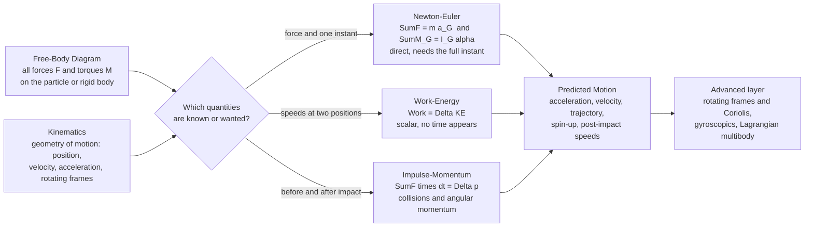

# 🎯 Particle and Rigid Body Dynamics

> [!abstract] TL;DR
> **Dynamics** is Newton's laws given engineering teeth — the discipline that predicts **how bodies move** under the forces and torques acting on them. It splits into **kinematics** (the pure geometry of motion: position, velocity, acceleration, relative motion, rotating frames) and **kinetics** (the forces and torques that *cause* that motion). A **particle** is a point mass obeying $\sum \vec F = m\vec a$; a **rigid body** also rotates, so its motion is the **translation of its center of mass** ($\sum \vec F = m\,\vec a_G$) plus **rotation** about it ($\sum M_G = I_G\,\alpha$, with $I$ the mass moment of inertia). Every dynamics problem can be attacked by one of **three methods** — **Newton-Euler** (force and acceleration, direct but needs a full free-body at an instant), **work-energy** (scalar, relates speeds at two positions with no time), and **impulse-momentum** (relates velocities before and after, the tool for collisions and angular momentum). This is the section opener for Dynamics and Vibrations: it underpins vehicles, rotating machinery, robots, projectiles, mechanisms, impact analysis, and it sets up vibrations and control.

## Intuition

**Analogy:** Statics asks one question — *"will it hold?"* — and answers it by demanding that everything add up to zero and stay put. Dynamics rips out that "zero" and asks a far livelier question: *"how will it **move**?"* Everything that spins, swings, accelerates, brakes, or vibrates lives here. When a car slams on its brakes, a robot arm whips through an arc, a turbine spins up from cold, or a rocket claws off the pad, an engineer has to predict both the **motion** and the **forces that produce it**. Dynamics is $F = ma$ with teeth: it tracks how forces produce acceleration, how spinning masses stubbornly resist changing their motion, and how energy and momentum flow from one instant to the next.

The technical division mirrors the analogy. **Kinematics** is the *choreography* — where the body is, how fast, how it is accelerating — written down without ever asking *why*. **Kinetics** supplies the *why* by connecting those accelerations to the forces and torques behind them through Newton's second law. Master the split and most of dynamics becomes bookkeeping: describe the motion, draw the forces, pick the method that turns the least algebra into the answer you want.

---

## How It Works

### Core mechanics

1. **Describe the motion first (kinematics).** Choose a coordinate system that fits the geometry — **rectangular** ($x,y,z$) for projectiles, **normal-tangential** ($t,n$) for curved paths, or **polar** ($r,\theta$) for radial motion. Differentiate position to get velocity and acceleration. For linked or moving parts, use **relative motion** ($\vec a_B = \vec a_A + \vec a_{B/A}$) and, on rotating machinery, **rotating reference frames**.
2. **Draw every force and torque (the free-body diagram).** This is the single most important step. List gravity, normal forces, friction, tension, applied loads, and reaction torques. Miss one and every downstream equation is wrong.
3. **Write the equations of motion (kinetics).** For a **particle**: $\sum \vec F = m\vec a$. For a **rigid body** in plane motion, split it into translation of the center of mass, $\sum \vec F = m\,\vec a_G$, plus rotation, $\sum M_G = I_G\,\alpha$ — where $I_G$ is the **mass moment of inertia** and $\alpha$ the angular acceleration. The **parallel-axis theorem** $I = I_G + md^2$ shifts $I$ to any axis.
4. **Choose the solution method that matches the question.** Need the *acceleration right now*? Use **Newton-Euler**. Need the *speed after a drop or a push*, with no interest in time? Use **work-energy** (scalar). Need velocities *before versus after* an impact? Use **impulse-momentum**. All three are exact; they differ only in convenience.
5. **Integrate or solve.** Newton-Euler gives coupled second-order ODEs — integrate them (analytically or numerically) to get the trajectory or spin history. Work-energy and impulse-momentum often collapse to a single algebraic equation.

### Flow / architecture



---

## Key Concepts

### Secondary Level

- **Kinematics vs kinetics.** Kinematics *describes* motion — how far, how fast, how quickly speeding up. Kinetics explains *why* by bringing in the forces. Describing a thrown ball's arc is kinematics; asking what gravity does to make that arc is kinetics.
- **Newton's second law.** For a point mass, force equals mass times acceleration, $\vec F = m\vec a$. Double the force, double the acceleration; double the mass, halve it. This one line governs every falling, sliding, and flying object.
- **Speed, velocity, acceleration.** Velocity is how position changes with time; acceleration is how velocity changes. A car cornering at constant *speed* is still *accelerating*, because its direction — and therefore its velocity — is changing.
- **Spinning things resist changing their spin.** A heavy flywheel is hard to start and hard to stop. That rotational "stubbornness" is the moment of inertia, the rotational cousin of mass.

### Undergraduate Level

- **Particle kinetics in three coordinate systems.** $\sum \vec F = m\vec a$ resolved in **rectangular** ($x,y$), **normal-tangential** (with centripetal term $a_n = v^2/\rho$ toward the center of curvature), or **polar** ($a_r = \ddot r - r\dot\theta^2$, $a_\theta = r\ddot\theta + 2\dot r\dot\theta$). Pick the frame that makes the geometry trivial.
- **Rigid-body plane motion.** A rigid body both **translates** and **rotates**: $\sum \vec F = m\,\vec a_G$ (center-of-mass motion) *and* $\sum M_G = I_G\,\alpha$ (rotation). **General plane motion** superposes translation of $G$ with rotation about $G$; the **instantaneous center of zero velocity** often simplifies the kinematics.
- **Mass moment of inertia and the parallel-axis theorem.** $I = \int r^2\,dm$ measures resistance to angular acceleration. Standard results ($\tfrac12 mR^2$ disk, $\tfrac13 mL^2$ rod about its end, $\tfrac25 mR^2$ sphere) plus $I = I_G + md^2$ cover most problems.
- **The three solution methods.**
  - **Newton-Euler** — force and acceleration, instant by instant. Direct, but you must know every force.
  - **Work-energy** — $U_{1\to2} = \Delta T = \tfrac12 m v_2^2 - \tfrac12 m v_1^2$ (add $\tfrac12 I\omega^2$ for rotation). Scalar, time-free; ideal for "what speed after this drop?"
  - **Impulse-momentum** — $\int \vec F\,dt = \Delta(m\vec v)$, and its angular form $\int M\,dt = \Delta(I\omega)$. Essential for **collisions**, where the **coefficient of restitution** $e$ relates separation to approach speed ($e = 1$ elastic, $e = 0$ perfectly inelastic).
- **Relative motion and rotating frames (intro).** On a moving or rotating base, velocities and accelerations add through relative terms — the entry point to non-inertial analysis.

### Graduate Level

- **Full 3D rigid-body rotation.** Angular momentum is $\vec L = \mathbf I\,\vec\omega$ with the **inertia tensor** $\mathbf I$; in general $\vec L$ and $\vec\omega$ are **not parallel**. In principal (body) axes, motion obeys **Euler's equations** $I_1\dot\omega_1 - (I_2-I_3)\omega_2\omega_3 = M_1$ and cyclic permutations — the source of the intermediate-axis (tennis-racket) instability.
- **Non-inertial frames and fictitious forces.** In a frame rotating at $\vec\Omega$, Newton's law acquires apparent forces: **centrifugal** $-m\,\vec\Omega\times(\vec\Omega\times\vec r)$ and **Coriolis** $-2m\,\vec\Omega\times\vec v$. These are not fictions to the engineer — they size loads on rotating machinery, deflect vehicles, and steer weather on the rotating Earth.
- **Gyroscopic effects.** A fast-spinning rotor subjected to a torque **precesses** at right angles to it, $\vec M = \vec\Omega_p \times \vec L$. Gyroscopic moments load bearings in turbines, jet-engine shafts, and turning ships, and stabilize wheels and spacecraft.
- **D'Alembert's principle.** Recasting kinetics as statics by adding an **inertial force** $-m\vec a$: $\sum \vec F - m\vec a = 0$. It turns a dynamics problem into a familiar equilibrium of forces including the "reversed effective force."
- **Bridge to Lagrangian and Hamiltonian mechanics.** For complex, constrained, multi-degree-of-freedom systems — robot arms, linkages, vehicles — force bookkeeping explodes. **Lagrangian mechanics** ($\frac{d}{dt}\frac{\partial L}{\partial \dot q} - \frac{\partial L}{\partial q} = Q$) derives the equations of motion from a single scalar energy function in generalized coordinates, sidestepping constraint forces entirely — the standard route to **multibody dynamics**.

---

## Python Demo

```python
# Particle & Rigid-Body Dynamics: two of the three solution methods, side by side.
#
#   LEFT  (a) NEWTON-EULER -> a rigid rotor spun up from rest by a constant torque,
#             obeying  tau_net = I * alpha,  with viscous bearing friction tau_f = c*omega.
#             We integrate the equation of motion in time (RK4) and watch omega(t) rise
#             toward its terminal value tau/c. This is the FORCE/ACCELERATION method.
#
#   RIGHT (b) IMPULSE-MOMENTUM -> a 1-D collision of two masses. We sweep the coefficient
#             of restitution e from 0 (perfectly inelastic) to 1 (perfectly elastic),
#             solve the after-velocities from CONSERVATION OF MOMENTUM + restitution, and
#             show momentum is ALWAYS conserved while kinetic energy is only conserved at
#             e = 1. This is the alternative to tracking forces through the impact.
#
# Requires: numpy, matplotlib
import numpy as np
import matplotlib.pyplot as plt

# =====================================================================
# (a) NEWTON-EULER  ->  rigid rotor spin-up   tau_net = I * alpha
# =====================================================================
I   = 0.5      # mass moment of inertia about the spin axis [kg*m^2]
tau = 4.0      # applied driving torque [N*m]
c   = 0.20     # viscous bearing-friction coefficient [N*m*s/rad]

def alpha(omega):
    # angular acceleration from Newton-Euler:  I*alpha = tau - c*omega
    return (tau - c * omega) / I

def rk4_step(omega, dt):
    k1 = alpha(omega)
    k2 = alpha(omega + 0.5 * dt * k1)
    k3 = alpha(omega + 0.5 * dt * k2)
    k4 = alpha(omega + dt * k3)
    return omega + (dt / 6.0) * (k1 + 2 * k2 + 2 * k3 + k4)

dt, tmax = 0.01, 6.0
t = np.arange(0.0, tmax + dt, dt)
omega = np.zeros_like(t)
for i in range(1, len(t)):
    omega[i] = rk4_step(omega[i - 1], dt)

omega_terminal = tau / c          # steady state: tau = c*omega  -> alpha = 0
omega_nofric   = (tau / I) * t    # frictionless: constant alpha -> linear ramp

print("=== (a) NEWTON-EULER: rigid rotor spin-up  (tau = I * alpha) ===")
print(f"  moment of inertia I   : {I:.2f} kg*m^2")
print(f"  applied torque tau    : {tau:.2f} N*m")
print(f"  terminal omega tau/c  : {omega_terminal:.2f} rad/s")
print(f"  omega at t = {tmax:.0f}s    : {omega[-1]:.2f} rad/s")

# =====================================================================
# (b) IMPULSE-MOMENTUM  ->  1-D two-body collision, sweep restitution e
#     Conservation of momentum:  m1*u1 + m2*u2 = m1*v1 + m2*v2
#     Restitution:               v2 - v1 = e * (u1 - u2)
# =====================================================================
m1, m2 = 2.0, 1.0      # masses [kg]
u1, u2 = 3.0, -1.0     # incoming velocities [m/s] (they approach each other)

e_vals    = np.linspace(0.0, 1.0, 200)
P         = m1 * u1 + m2 * u2                     # total momentum (conserved)
ke_before = 0.5 * m1 * u1**2 + 0.5 * m2 * u2**2

v1 = (P - m2 * e_vals * (u1 - u2)) / (m1 + m2)
v2 = (P + m1 * e_vals * (u1 - u2)) / (m1 + m2)

p_after  = m1 * v1 + m2 * v2
ke_after = 0.5 * m1 * v1**2 + 0.5 * m2 * v2**2

print("=== (b) IMPULSE-MOMENTUM: 1-D collision, restitution sweep ===")
print(f"  momentum before          : {P:.2f} kg*m/s")
print(f"  momentum after (all e)   : min {p_after.min():.2f}, max {p_after.max():.2f}  (conserved)")
print(f"  KE before                : {ke_before:.2f} J")
print(f"  KE after, e=0 (stuck)    : {ke_after[0]:.2f} J  ({100*ke_after[0]/ke_before:.0f} percent kept)")
print(f"  KE after, e=1 (elastic)  : {ke_after[-1]:.2f} J  ({100*ke_after[-1]/ke_before:.0f} percent kept)")

# ------------------------------ plotting ------------------------------
fig, (axL, axR) = plt.subplots(1, 2, figsize=(14, 5.5))
fig.suptitle("Two Solution Methods of Dynamics: Force-Based vs Momentum-Based",
             fontsize=14, fontweight="bold")

# LEFT: Newton-Euler rotor spin-up
axL.plot(t, omega, color="#1f77b4", lw=2.5, label="with bearing friction (RK4)")
axL.plot(t, omega_nofric, "--", color="#2ca02c", lw=1.8,
         label="frictionless: omega = (tau/I) t")
axL.axhline(omega_terminal, color="#d62728", ls=":", lw=1.8,
            label=f"terminal omega = tau/c = {omega_terminal:.0f}")
axL.set_xlabel("time  t  [s]")
axL.set_ylabel("angular velocity  omega  [rad/s]")
axL.set_title("(a) NEWTON-EULER:  tau = I * alpha  (rotor spin-up)", fontsize=11)
axL.set_ylim(0, omega_nofric[-1] * 1.05)
axL.legend(loc="upper left", fontsize=8)
axL.grid(alpha=0.3)

# RIGHT: Impulse-momentum collision, restitution sweep
axR.plot(e_vals, p_after / P, color="#1f77b4", lw=2.5, label="momentum after / before")
axR.plot(e_vals, ke_after / ke_before, color="#d62728", lw=2.5,
         label="kinetic energy after / before")
axR.axhline(1.0, color="gray", ls=":", lw=1)
axR.scatter([0.0], [ke_after[0] / ke_before], color="#d62728", zorder=5)
axR.annotate("e = 0\nperfectly inelastic\nmasses stick, KE lost",
             xy=(0.0, ke_after[0] / ke_before), xytext=(0.12, 0.33),
             fontsize=8, arrowprops=dict(arrowstyle="->", color="#d62728"))
axR.scatter([1.0], [ke_after[-1] / ke_before], color="#2ca02c", zorder=5)
axR.annotate("e = 1\nperfectly elastic\nKE conserved",
             xy=(1.0, 1.0), xytext=(0.55, 0.62),
             fontsize=8, arrowprops=dict(arrowstyle="->", color="#2ca02c"))
axR.set_xlabel("coefficient of restitution  e")
axR.set_ylabel("fraction retained after impact")
axR.set_title("(b) IMPULSE-MOMENTUM:  1-D collision", fontsize=11)
axR.set_ylim(0, 1.12)
axR.legend(loc="center right", fontsize=8)
axR.grid(alpha=0.3)

plt.tight_layout(rect=[0, 0, 1, 0.93])
plt.show()
```

Running this prints the numbers and draws the two panels that, between them, show why dynamics has *more than one method*. The **left panel** is pure **Newton-Euler**: a rotor obeying $\tau = I\alpha$ ramps up linearly when frictionless (the dashed line), but real viscous bearing drag $c\omega$ curves it over to a **terminal speed** $\tau/c$ — the equation of motion integrated in time. The **right panel** is pure **impulse-momentum**: as the coefficient of restitution $e$ sweeps from a sticky $0$ to a bouncy $1$, **total momentum never budges** (the flat blue line at 1.0 is conservation of momentum), while **kinetic energy is only conserved for a perfectly elastic hit** and is quietly destroyed in every inelastic one. One figure, two of the three great methods — force-and-time on the left, before-and-after on the right.

---

## Real-World Applications

> **Example:** A **car braking into a corner** exercises all three methods at once. **Newton-Euler** sizes the deceleration from tire friction, $\mu m g = m a$, and the yaw torque about the car's center of mass that rotates it into the turn ($\sum M_G = I_G\alpha$). **Work-energy** tells the engineer the stopping distance directly — the brakes must do work equal to the car's kinetic energy, $\mu m g\,d = \tfrac12 m v^2$, no timeline required. And in the worst case, **impulse-momentum** governs the crash: the coefficient of restitution and the change in momentum $\int F\,dt = \Delta(mv)$ set the peak force the crumple zone and occupants absorb. The same body, three lenses.

- **Rotating machinery.** Turbines, engines, and motors are spin-up and spin-down problems in $\tau = I\alpha$; at speed, **gyroscopic** moments and unbalance loads (the domain of the sibling note on balancing and rotordynamics) load the bearings and shafts.
- **Robotics.** A manipulator's joint torques come straight from rigid-body dynamics — the mass matrix, Coriolis, and gravity terms of the equations of motion — computed for control and trajectory planning (see robot dynamics below).
- **Projectiles and spacecraft.** Ballistics, re-entry, and orbital maneuvers are particle and rigid-body Newton-Euler problems, with attitude control leaning on angular momentum and gyroscopic reaction wheels.
- **Mechanisms and linkages.** Cams, four-bar linkages, and slider-cranks convert motion; predicting their accelerations and the forces on their joints is general plane-motion kinetics — the setup for the mechanisms sibling note.
- **Impact and crash analysis.** Automotive crashworthiness, sports equipment, and drop testing all hinge on impulse-momentum and the coefficient of restitution.
- **Vibrations and control.** Oscillating systems are just dynamics with a restoring force; the equations of motion derived here become the mass-spring-damper models of the vibrations siblings and the plants of control design.

---

## Common Pitfalls

- **Confusing kinematics with kinetics.** Kinematics describes motion; kinetics explains it with forces. Trying to find an acceleration from geometry alone (kinematics) when it actually depends on unknown forces (kinetics) — or vice versa — is the classic dead end. Decide which one the problem is asking for before writing an equation.
- **Treating a rigid body as a particle.** A point mass only obeys $\sum F = ma$. A rigid body **also rotates**, so you *must* add $\sum M_G = I_G\alpha$ and account for the **mass moment of inertia** and the **parallel-axis theorem**. Forgetting the rotational equation is the single most common rigid-body error.
- **Picking the wrong solution method.** Grinding out Newton-Euler with time integration when the question is "what speed after this drop?" wastes effort — **work-energy** answers it in one line. Conversely, work-energy cannot resolve a **collision**; that needs **impulse-momentum** and a restitution coefficient. Match the method to the unknown.
- **Applying $\vec L = I\vec\omega$ off the principal axes.** In 3D, angular momentum and angular velocity are related by the full **inertia tensor** and are generally **not parallel**. The simple scalar $I\omega$ only holds about a principal axis; elsewhere you need $\vec L = \mathbf I\vec\omega$ and Euler's equations.
- **Forgetting fictitious forces in rotating frames.** Analyze motion in a rotating frame and you *must* include **Coriolis** and **centrifugal** terms, or the equations are simply wrong. This bites hard on rotating machinery, vehicles, and any Earth-scale motion.
- **Ignoring gyroscopic reaction moments.** A spinning rotor forced to change its axis pushes back with a precessional torque perpendicular to the applied moment. Bearings and shafts in turbines and turning vehicles feel this; leaving it out under-predicts the loads.
- **Reaching for Newton-Euler on complex multibody systems.** Tracking every constraint force on a linkage or robot arm becomes intractable. This is exactly where **D'Alembert's principle** and, better, **Lagrangian mechanics** earn their keep — deriving the equations of motion from energy without the constraint-force bookkeeping.

---

## Related Concepts

**Physics foundations (Classical Mechanics vault)**
- [[Newtons_Laws_and_Kinematics]] — the $F = ma$ bedrock and the kinematics beneath all particle dynamics
- [[Rotational_Dynamics]] — torque, moment of inertia, angular momentum, the inertia tensor, and Euler's equations for rigid bodies
- [[Work_Energy_and_Conservation]] — the work-energy theorem and conservation laws behind the scalar and momentum methods
- [[Lagrangian_Mechanics]] — the energy-based reformulation that tames complex, constrained, multibody systems
- [[Hamiltonian_Mechanics]] — the phase-space companion to the Lagrangian approach for advanced dynamics
- [[Oscillations_and_SHM]] — dynamics of oscillating systems, the direct bridge from here into vibrations

**Engineering and robotics application**
- [[Robot_Dynamics_and_Equations_of_Motion]] — rigid-body dynamics specialized to manipulators: the mass matrix, Coriolis, and gravity terms

**Mathematics (the machinery)**
- [[Second_Order_Linear_ODEs]] — equations of motion are second-order ODEs; their solutions are the trajectories
- [[Systems_of_ODEs]] — coupled equations of motion for multi-degree-of-freedom systems, integrated numerically

*Siblings in this Dynamics and Vibrations section (prose references): Mechanical_Engineering_Overview (the vault hub), Statics_and_Equilibrium (the "will it hold?" counterpart), Mechanisms_and_Kinematics, Mechanical_Vibrations, and Balancing_and_Rotordynamics.*

---

## Review Questions

**Secondary**
1. A ball is thrown and traces a curved arc. Which part of describing that arc is **kinematics** and which part is **kinetics**? Explain why a car going around a roundabout at a steady 30 km/h is nonetheless *accelerating*.

**Undergraduate**
2. A uniform solid cylinder ($I_G = \tfrac12 mR^2$) is released from rest and rolls without slipping down a ramp of height $h$. Find its speed at the bottom **two ways** — once with **work-energy** and once with **Newton-Euler** (translation plus $\sum M_G = I_G\alpha$ with the rolling constraint $a_G = R\alpha$) — and confirm they agree. Which method was less work, and why?

**Graduate**
3. A satellite reaction wheel spins at high $\omega$ about a body axis when the spacecraft is commanded to slew about a perpendicular axis. (a) Explain the **gyroscopic** reaction moment the wheel exerts and why $\vec L$ and $\vec\omega$ need not be parallel. (b) The engineer models the whole system in a frame fixed to the tumbling spacecraft — which **fictitious forces** must appear, and why? (c) For a multi-wheel, multi-body actuator assembly, argue why a **Lagrangian** formulation is preferable to writing Newton-Euler equations for each part.

---

## Sources

- R. C. Hibbeler — *Engineering Mechanics: Dynamics*, 14th ed. (Pearson, 2016)
- F. P. Beer, E. R. Johnston, et al. — *Vector Mechanics for Engineers: Dynamics*, 12th ed. (McGraw-Hill, 2019)
- J. L. Meriam & L. G. Kraige — *Engineering Mechanics: Dynamics*, 8th ed. (Wiley, 2015)
- D. T. Greenwood — *Principles of Dynamics*, 2nd ed. (Prentice-Hall, 1988)
- H. Goldstein, C. Poole & J. Safko — *Classical Mechanics*, 3rd ed. (Addison-Wesley, 2001)

---

#mechanical-engineering #dynamics #rigid-body #newton-euler #work-energy
