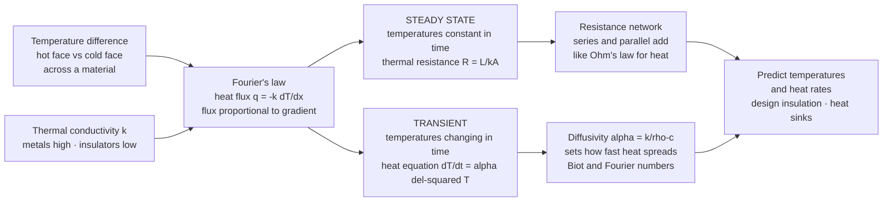

# 🔥 Conduction Heat Transfer: Fourier's Law, Thermal Resistance, and the Heat Equation

> [!abstract] TL;DR
> **Conduction** is heat moving *through a material* by molecular and electronic interaction — no bulk flow, just atoms jostling their neighbours. It obeys **Fourier's law**: the heat flux $q = -k\,\dfrac{dT}{dx}$ is proportional to the temperature **gradient**, scaled by the **thermal conductivity** $k$ (a material property — metals hundreds of W/m·K, insulators below 1, which is why a metal spoon burns you and a wooden one doesn't). When temperatures are constant in time (**steady state**) conduction reduces to an elegant electrical analogy — **thermal resistance** $R = L/(kA)$, with series and parallel networks adding just like Ohm's law — the everyday tool for insulation and wall design. When temperatures change (**transient**), conduction is governed by the **heat/diffusion equation** $\partial T/\partial t = \alpha\,\nabla^2 T$, where the **thermal diffusivity** $\alpha = k/(\rho c)$ sets how fast temperature changes propagate. Thermodynamics tells you heat *will* flow from hot to cold; **heat transfer tells you how fast** — the rate that decides whether your CPU cooks itself, your house stays warm, or your engine block survives.

## Intuition

**Analogy:** Grab a metal spoon left in hot soup and it burns you; grab a wooden one that sat in the *same* soup and it feels barely warm. Same soup, same temperature, wildly different result. That is **conduction**: heat marching through solid material from hot to cold, atom jostling atom — racing through metal, crawling through wood.

Here is the crucial distinction that motivates the whole subject. **Thermodynamics** tells you that heat *will* flow from hot to cold, and *how much* total energy is involved — but it is silent on *time*. **Heat transfer** asks the engineering question that actually matters: **how fast?** That rate is what decides whether a CPU cooks itself in milliseconds, whether a house holds its warmth overnight, whether an engine block melts or survives. Conduction is the **first and simplest of the three ways heat moves** (the others being convection and radiation), and it is the one you can reason about most cleanly — once you accept Fourier's single, deep idea: *heat flux is proportional to the temperature gradient.*

---

## How It Works

### Core Mechanics

1. **Fourier's law — the constitutive law.** Empirically, the rate of heat flow per unit area (the **heat flux** $q$, in W/m²) through a material is proportional to the local temperature **gradient** and points from hot toward cold:
   $$q = -k\,\frac{dT}{dx} \qquad\text{(1D)}, \qquad \mathbf{q} = -k\,\nabla T \quad\text{(general)}$$
   The proportionality constant $k$ is the **thermal conductivity** (W/m·K), a *material property*. The minus sign enforces the Second Law: heat flows *down* the temperature gradient. Multiply flux by area to get the **heat rate** $\dot{Q} = qA$ (in watts) — the total power crossing the surface.

2. **Why $k$ varies so much.** In metals, mobile conduction *electrons* carry most of the heat (the same carriers that conduct electricity — hence the Wiedemann–Franz link), giving copper $k \approx 400$ W/m·K. In insulators and gases, heat rides on *phonons* (lattice vibrations) or slow molecular collisions, giving wood $\approx 0.15$ and air $\approx 0.026$ W/m·K. That ~15,000× spread is the spoon-vs-wood story quantified.

3. **Steady-state conduction — the resistance analogy.** When temperatures no longer change in time, Fourier's law integrated across a plane wall of thickness $L$ and area $A$ gives
   $$\dot{Q} = \frac{kA}{L}\,\Delta T = \frac{\Delta T}{R}, \qquad R = \frac{L}{kA}.$$
   This is **Ohm's law for heat**: $\Delta T$ plays the role of voltage, $\dot{Q}$ the role of current, and $R = L/(kA)$ the **thermal resistance**. Composite walls stack **in series** (resistances *add*: $R_{tot}=\sum R_i$); parallel paths (a stud beside insulation) combine like parallel resistors. Add convective film resistances $R=1/(hA)$ at the surfaces and you get the **overall heat-transfer coefficient** $U$, with $\dot{Q}=UA\,\Delta T$. This single network method is what building codes package as the **R-value** of insulation.

4. **Transient conduction — the heat equation.** When temperatures *are* changing, combine Fourier's law with energy conservation on a small control volume to get the **heat (diffusion) equation**:
   $$\frac{\partial T}{\partial t} = \alpha\,\nabla^2 T, \qquad \alpha = \frac{k}{\rho c}.$$
   The **thermal diffusivity** $\alpha$ (m²/s) — *not* $k$ alone — governs how fast a temperature disturbance spreads; it balances how well a material conducts ($k$) against how much heat it must store to change temperature ($\rho c$). Metals have high $\alpha$ (heat penetrates fast); a slab of thickness $L$ equilibrates on a timescale $\tau \sim L^2/\alpha$.

5. **Lumped vs distributed — the Biot number.** If a body conducts internally far faster than its surface sheds heat, its interior stays essentially uniform and you can treat it as a single "lump" with a simple exponential decay. The test is the **Biot number** $Bi = hL_c/k$: when $Bi \lesssim 0.1$, **lumped capacitance** applies; otherwise you must solve the distributed heat equation. The **Fourier number** $Fo = \alpha t/L_c^2$ is the dimensionless clock that tells you how far a transient has progressed.

6. **Geometry and enhancements.** The same physics extends to **cylindrical** (pipes, $R=\ln(r_2/r_1)/(2\pi kL)$) and **spherical** shells; real interfaces add a **thermal contact resistance** (microscopic gaps trap insulating air — fixed with thermal paste); and **fins / extended surfaces** deliberately add area to boost heat rejection (every CPU heat sink). Multidimensional problems use **shape factors** or numerical solvers.

### Flow / Architecture



---

## Key Concepts

### Secondary Level

- **Heat flows through stuff, hot to cold.** Touch one end of a metal rod to a flame and the other end soon warms — the heat travels *through* the metal without the metal itself moving. That is conduction.
- **Some materials pass heat easily, others block it.** Metals are great conductors (spoon burns you); wood, plastic, foam, and air are poor conductors — *insulators* (the wooden spoon stays cool, the oven mitt protects your hand).
- **Bigger difference, faster flow; thicker or better insulation, slower flow.** More heat crosses a wall when it is much colder outside than in, and less crosses when the wall is thicker or made of better insulation. That is the everyday meaning of an insulation **R-value**.
- **Thermodynamics says which way, heat transfer says how fast.** Both spoons obey the same law that heat goes hot-to-cold — but *how fast* is what burns your hand, and that is the engineering question.

### Undergraduate Level

- **Fourier's law and its three quantities — don't confuse them.** **Heat flux** $q$ (W/m², per unit area), **heat rate** $\dot{Q}=qA$ (W, total power), and **temperature** $T$ (the driving potential). $q=-k\,dT/dx$.
- **Thermal resistance network.** $R_{plane}=L/(kA)$, $R_{cyl}=\ln(r_2/r_1)/(2\pi kL)$, $R_{conv}=1/(hA)$. Series: $R_{tot}=\sum R_i$, $\dot{Q}=\Delta T_{overall}/R_{tot}$. Parallel paths combine reciprocally. Overall coefficient: $\dot{Q}=UA\,\Delta T$ with $UA = 1/R_{tot}$.
- **The heat equation.** $\partial T/\partial t = \alpha\nabla^2 T + \dot{q}_{gen}/(\rho c)$. Steady state drops the time term to $\nabla^2 T = 0$ (Laplace) or $\nabla^2 T + \dot{q}_{gen}/k = 0$ (Poisson).
- **Diffusivity vs conductivity.** $k$ governs *steady* heat flow; $\alpha=k/(\rho c)$ governs *transient* speed. Two materials can share a $k$ yet respond at very different rates because of differing $\rho c$.
- **Lumped-capacitance criterion.** $Bi=hL_c/k<0.1 \Rightarrow T(t)=T_\infty+(T_0-T_\infty)e^{-t/\tau}$, $\tau = \rho V c/(hA_s)$. Otherwise use the transient heat equation (Heisler charts, series solutions, or numerics).
- **Fins.** Adding surface area raises total heat rejection even though each square metre works less hard; fin efficiency and effectiveness quantify the trade.

### Graduate Level

- **Anisotropic and temperature-dependent conductivity.** In composites and crystals $k$ becomes a **tensor** $k_{ij}$; near phase changes and at cryogenic temperatures $k(T)$ varies strongly, making the heat equation nonlinear.
- **Numerical solution.** Finite-difference (FTCS explicit, stable only for $Fo_{grid}=\alpha\Delta t/\Delta x^2 \le 1/2$; Crank–Nicolson implicit, unconditionally stable), finite-volume, and finite-element methods (the basis of thermal FEA). Stability, consistency, and convergence (Lax equivalence) govern the discrete schemes.
- **Multidimensional and moving-boundary problems.** Conduction **shape factors** collapse 2D/3D steady problems to $\dot{Q}=Sk\,\Delta T$. Phase-change conduction (**Stefan problem** — freezing, casting, welding) tracks a moving solid–liquid front.
- **Contact conductance and interface physics.** Real joints carry a contact resistance set by asperity contact, interstitial fluid, and pressure — central to microelectronics packaging and thermal-interface-material design.
- **Beyond Fourier.** At very short timescales or nanoscales, the parabolic heat equation (infinite propagation speed) breaks down; hyperbolic (Cattaneo–Vernotte) and Boltzmann-transport models capture finite-speed and ballistic phonon conduction.
- **Coupling to the other modes.** Steady conduction supplies the boundary condition for **convection** (film coefficient $h$) and **radiation**, and it is the internal-resistance half of every **heat exchanger** and thermal-management system.

---

## Python Demo

```python
# Conduction heat transfer: (a) steady composite-wall resistance network
# (Ohm's law for heat) and (b) transient 1D heat equation by finite difference.
import numpy as np
import matplotlib.pyplot as plt

# ============================================================
# (a) STEADY CONDUCTION: composite wall as a resistance network
#     R = L/(k*A) in SERIES  ->  q = dT / R_total  (like I = V/R)
# ============================================================
A = 1.0                     # wall area [m^2]
T_in, T_out = 21.0, -10.0   # inside / outside surface temperatures [C]

# Each layer: (name, thickness L [m], conductivity k [W/m.K])
layers = [
    ("Brick",      0.100, 0.72),
    ("Insulation", 0.080, 0.04),   # low-k foam: the resistance workhorse
    ("Gypsum",     0.013, 0.17),
]

def solve_wall(layers):
    R = np.array([L / (k * A) for (_, L, k) in layers])   # R = L/(kA)
    R_tot = R.sum()                                       # series -> add
    q = (T_in - T_out) / R_tot                            # heat flow [W]
    # march the node temperatures inward: each drop = q * R (Ohm's law)
    T_nodes = [T_in]
    for Ri in R:
        T_nodes.append(T_nodes[-1] - q * Ri)
    x = np.concatenate(([0.0], np.cumsum([L for (_, L, _) in layers])))
    return R, R_tot, q, np.array(T_nodes), x

R, R_tot, q, T_nodes, x = solve_wall(layers)
print("Layer resistances R = L/kA [K/W]:", np.round(R, 3))
print(f"Total R = {R_tot:.3f} K/W   ->   heat flow q = {q:.1f} W")
for (name, _, _), drop in zip(layers, -np.diff(T_nodes)):
    print(f"   drop across {name:<10}: {drop:5.1f} C")

# Effect of insulation: same wall with the foam layer removed
R2, _, q_noins, _, _ = solve_wall([layers[0], layers[2]])
print(f"WITHOUT insulation: q = {q_noins:.1f} W "
      f"({q_noins / q:.1f}x more heat lost)")

# ============================================================
# (b) TRANSIENT CONDUCTION: 1D heat equation  dT/dt = alpha * d2T/dx2
#     explicit finite difference (FTCS); slab suddenly heated on one face
# ============================================================
Lslab = 0.05                # slab thickness [m]
alpha = 1.2e-5              # thermal diffusivity [m^2/s]  (~ carbon steel)
nx = 51
dx = Lslab / (nx - 1)
dt = 0.25 * dx**2 / alpha   # Fourier number Fo = alpha*dt/dx^2 = 0.25 <= 0.5 (stable)
Fo = alpha * dt / dx**2

xs = np.linspace(0.0, Lslab, nx)
T = np.zeros(nx)                    # slab initially at 0 C
T_hot, T_cold = 100.0, 0.0         # left face jumps to 100 C, right face held at 0 C
T[0], T[-1] = T_hot, T_cold

targets = [0.5, 2.0, 5.0, 20.0, 80.0]   # snapshot times [s]
snaps = {}
t = 0.0
while t <= targets[-1] + 1e-9:
    for tc in targets:
        if tc not in snaps and t >= tc - 1e-9:
            snaps[tc] = T.copy()
    # update interior nodes; RHS is fully evaluated before assignment (safe)
    T[1:-1] = T[1:-1] + Fo * (T[2:] - 2.0 * T[1:-1] + T[:-2])
    T[0], T[-1] = T_hot, T_cold
    t += dt

T_steady = np.linspace(T_hot, T_cold, nx)   # analytic steady state: a straight line
print(f"\nTransient: dx={dx*1e3:.1f} mm, dt={dt:.3f} s, Fo={Fo:.2f} (stable if <= 0.5)")

# ============================================================
# PLOTS
# ============================================================
fig, (ax1, ax2) = plt.subplots(1, 2, figsize=(13, 5))

# (a) composite-wall temperature profile
ax1.plot(np.array(x) * 100, T_nodes, "o-", lw=2.2, color="firebrick", zorder=3)
colors = ["#d9a066", "#8fd694", "#cccccc"]
xc = np.array(x) * 100
for i, (name, _, _) in enumerate(layers):
    ax1.axvspan(xc[i], xc[i + 1], color=colors[i], alpha=0.35)
    ax1.text((xc[i] + xc[i + 1]) / 2, T_out + 3, name,
             ha="center", va="bottom", fontsize=9, rotation=90)
ax1.set_xlabel("position through wall  [cm]")
ax1.set_ylabel("temperature  [C]")
ax1.set_title(f"(a) Steady composite wall  —  q = {q:.1f} W\n"
              "steepest drop across the insulation (highest R)")
ax1.grid(alpha=0.3)

# (b) transient heat-equation evolution toward steady state
for tc in targets:
    ax2.plot(xs * 100, snaps[tc], lw=2, label=f"t = {tc:g} s")
ax2.plot(xs * 100, T_steady, "k--", lw=1.6, label="steady state (linear)")
ax2.set_xlabel("position in slab  [cm]")
ax2.set_ylabel("temperature  [C]")
ax2.set_title("(b) Transient heat equation\n"
              r"$\partial T/\partial t = \alpha\,\partial^2 T/\partial x^2$  relaxing to steady")
ax2.legend(fontsize=8)
ax2.grid(alpha=0.3)

plt.tight_layout()
plt.savefig("conduction_heat_transfer.png", dpi=120)
plt.show()
```

**What it shows.** Part (a) treats a brick–insulation–gypsum wall as three resistors in series: because the foam's $R=L/(kA)$ dwarfs the others, *most of the temperature drop and the strongest gradient occur across the thin insulation layer* — and removing it multiplies the heat loss several-fold, quantifying why insulation works. Part (b) integrates the 1D heat equation with an explicit finite-difference scheme (kept stable by holding the grid Fourier number at 0.25): a slab heated on one face shows the thermal front penetrating over time, the profiles fanning out and straightening until they collapse onto the linear steady-state solution — with the **thermal diffusivity** $\alpha$ setting the pace of that relaxation.

---

## Real-World Applications

- **Electronics cooling.** CPUs, GPUs, and power modules dump heat by conduction through the die, a **thermal interface material** (paste minimises contact resistance), a spreader, and a finned **heat sink** — the entire chain is a series resistance network engineers optimise watt by watt.
- **Building insulation and energy efficiency.** Wall, roof, and window design is literally resistance-network arithmetic; the **R-value** on a batt of insulation is $L/k$, and the overall $U = 1/R_{tot}$ sizes heating and cooling loads.
- **Engine and turbine thermal management.** Cylinder walls, turbine blades, and exhaust components live at limits set by conduction into cooling passages and thermal-barrier coatings; get the transient wrong and thermal stress cracks the part.
- **Thermal processing.** **Welding, casting, and heat treatment** are transient-conduction (often moving-boundary Stefan) problems — cooling rates set microstructure and residual stress, the domain of process simulation.
- **Cryogenics and aerospace.** Multilayer insulation and low-$k$ struts minimise conductive heat leak into cryogenic tanks; re-entry heat shields are transient-conduction survival problems.
- **Everyday life.** Cooking (a cast-iron pan's high $\alpha$ evens out hot spots), oven mitts, double-glazed windows, and the frosty-metal-bench feeling are all conduction.

---

## Common Pitfalls

- **Confusing heat flux, heat rate, and temperature.** $q$ (W/m², intensity), $\dot{Q}$ (W, total power = $qA$), and $T$ (the driving potential) are three *different* quantities. A small hot spot can have enormous flux but negligible rate; sizing a heat sink needs rate, avoiding local burnout needs flux.
- **Confusing conductivity with diffusivity.** $k$ governs **steady** flow (how much heat gets through); $\alpha=k/(\rho c)$ governs **transient** speed (how fast temperatures change). Two materials with equal $k$ can heat up at very different rates because of differing $\rho c$ — reaching for $k$ in a transient problem is a classic error.
- **Forgetting the gradient in Fourier's law.** Flux is proportional to the temperature **gradient** $dT/dx$, *not* to $\Delta T$ or to $T$ itself. Halve the thickness at the same $\Delta T$ and you double the flux — geometry matters as much as the temperature difference.
- **Ignoring thermal contact resistance.** Two bolted metal blocks do *not* touch perfectly; microscopic gaps trap insulating air and add a hidden resistance that can dominate a joint. This is why thermal paste exists, and why theoretical assemblies run hotter than predicted.
- **Applying lumped-capacitance when $Bi > 0.1$.** The simple exponential-decay model assumes a spatially uniform body; if the surface sheds heat faster than the interior can conduct ($Bi$ large), interior gradients are real and you must solve the distributed heat equation.
- **Adding parallel resistances like series ones.** Series resistances add directly ($R_{tot}=\sum R_i$); parallel paths (a wooden stud beside insulation) combine reciprocally and create a *thermal bridge* that leaks far more heat than the average would suggest.
- **Unstable explicit finite differences.** The FTCS scheme blows up unless the grid Fourier number $\alpha\Delta t/\Delta x^2 \le 1/2$; refine the mesh and you must shrink the time step quadratically (or switch to an implicit scheme like Crank–Nicolson).
- **Wrong boundary conditions.** Fixed-temperature (Dirichlet), fixed-flux (Neumann, including insulated $\partial T/\partial x = 0$), and convective (Robin) boundaries give different answers; mislabelling a surface as isothermal when it is really convective is a frequent modelling slip.

Related siblings in this section — **Engineering_Thermodynamics** (the energy accounting that says heat flows hot-to-cold), **Convection_and_Radiation** (the other two modes that supply conduction's boundary conditions), **Heat_Exchangers_and_HVAC** (where conductive and convective resistances combine in series), **Power_and_Refrigeration_Cycles** (which reject and absorb heat through conductive surfaces), and **CAD_CAE_and_Finite_Element_Method** (the numerical machinery for multidimensional conduction) — extend these ideas.

---

## Related Concepts

- [[Laws_of_Thermodynamics]] — the thermodynamic foundation: the Second Law fixes the *direction* (hot to cold, the minus sign in Fourier's law); heat transfer adds the *rate*.
- [[Kinetic_Theory_of_Gases]] — molecular picture of why heat conducts: energy passed by colliding particles, the microscopic origin of thermal conductivity in fluids and phonon/electron transport in solids.
- [[Thermal_Properties_and_Heat_Conduction]] — materials-science companion: how phonons and conduction electrons set $k$, $\alpha$, and thermal expansion across metals, ceramics, and polymers.
- [[Diffusion_in_Solids_and_Ficks_Laws]] — mathematically identical transport: Fick's law $J=-D\nabla C$ mirrors Fourier's $q=-k\nabla T$, and the diffusion equation *is* the heat equation with $D$ in place of $\alpha$.
- [[Introduction_to_PDEs]] — the heat/diffusion equation is the archetypal **parabolic** PDE; separation of variables and Fourier series are the classical analytic solvers.
- [[Second_Order_Linear_ODEs]] — steady 1D conduction (with generation or fins) reduces to a second-order linear ODE with boundary conditions.
- [[The_Heat_and_Diffusion_Equation]] — computational-physics deep dive on $\partial T/\partial t = \alpha\nabla^2 T$: stability, schemes, and worked field simulations.
- [[Finite_Difference_Methods]] — the discretisation used in the transient demo (FTCS explicit, Crank–Nicolson implicit) and its stability limits.

---

## Review Questions

**Secondary.** Two identical mugs of hot coffee sit on a wooden table and a marble countertop. Which coffee cools faster from the bottom, and why — even though the room and both surfaces are at the same temperature?

**Undergraduate.** A composite wall has three layers in series with resistances $R_1=0.14$, $R_2=2.0$, and $R_3=0.08$ K/W, across an overall temperature difference of 30 °C. (a) What is the heat rate? (b) Across which layer is the temperature drop largest, and by roughly what fraction? (c) If you could improve one layer's insulation, which gives the biggest reduction in heat loss, and why?

**Graduate.** You must simulate transient conduction in a 1 cm steel slab ($\alpha \approx 1.2\times10^{-5}$ m²/s) and want temperatures every 0.01 s. (a) Using an explicit FTCS scheme, what is the largest grid spacing $\Delta x$ that keeps it stable at that time step? (b) Why does refining the mesh force a *quadratic* cut in the time step, and how does an implicit (Crank–Nicolson) scheme escape this? (c) At what point would you stop trusting the parabolic heat equation altogether, and what replaces it?

---

## Sources

- Incropera, DeWitt, Bergman & Lavine — *Fundamentals of Heat and Mass Transfer*, 8th ed. (Wiley). The standard text; Chapters 2–5 cover conduction, resistance networks, and transient analysis.
- Çengel & Ghajar — *Heat and Mass Transfer: Fundamentals and Applications* (McGraw-Hill). Especially accessible treatment of the resistance analogy, R-values, and fins.
- Holman — *Heat Transfer* (McGraw-Hill). Classic engineering reference with extensive worked conduction problems.
- Carslaw & Jaeger — *Conduction of Heat in Solids*, 2nd ed. (Oxford). The definitive analytic reference for the heat equation, transient solutions, and moving-boundary problems.
- Lienhard & Lienhard — *A Heat Transfer Textbook* (freely available). Rigorous, modern, and open-access.

---

#mechanical-engineering #heat-transfer #conduction #fouriers-law #thermal-resistance
