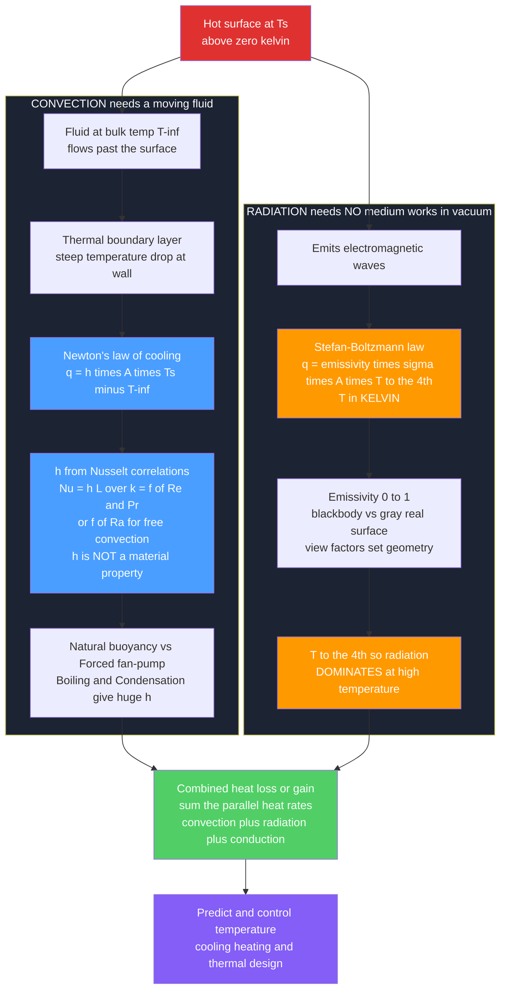

# ♨️ Convection and Radiation

> [!abstract] TL;DR
> **Convection** and **radiation** are the two heat-transfer modes that complete the trio with conduction. **Convection** moves heat between a surface and a **moving fluid** — Newton's law of cooling $q = hA(T_s - T_\infty)$, where the **convection coefficient** $h$ is *not* a material property but a function of flow, geometry, and fluid, obtained from empirical **Nusselt-number** correlations $Nu = f(Re, Pr)$ (forced) or $f(Ra)$ (free). It splits into **natural/free** (buoyancy-driven), **forced** (fan or pump), and **phase-change** (boiling/condensation, with huge $h$). **Radiation** moves heat as **electromagnetic waves** needing **no medium at all** — the **Stefan-Boltzmann law** $q = \varepsilon\sigma A T^4$, whose **fourth-power** dependence on absolute temperature makes it negligible at room temperature yet **dominant** in furnaces, combustion, and the Sun. In real systems all three modes act together, and engineers sum the parallel heat rates. Together they let you predict and control temperatures everywhere heat matters — electronics cooling, HVAC, heat exchangers, engine cooling, and spacecraft thermal control.

---

## Intuition

**Analogy first.** Blow across a spoonful of hot soup and it cools far faster than if you just let it sit — the moving air sweeps the heat away. That is **convection**: heat carried off by a flowing fluid, the same reason a fan cools you, a radiator warms a room, and wind chill bites on a cold day. Now stand near a campfire on that same cold, windy night. Even as the wind tries to steal heat, you still feel warmth on your face across the empty gap between you and the flames. Nothing is touching you and no air is delivering that warmth — it arrives as invisible light. That is **radiation**: heat travelling as electromagnetic waves that need no medium at all, exactly how the Sun warms Earth across the vacuum of space and how a furnace or a red-hot burner glows.

These are the *other two* ways heat moves. **Convection** needs a fluid in motion and governs almost all everyday cooling and heating of surfaces. **Radiation** needs nothing but a line of sight and takes over whenever things get hot. Add **conduction** (heat crawling through solid matter, its own note) and you have the complete toolkit of heat transfer — the three channels through which every thermal problem, from a CPU heatsink to a jet engine to a star, drains or gathers its heat.

---

## How It Works

### Core Mechanics

**Convection** = heat exchange between a surface at $T_s$ and a fluid at bulk temperature $T_\infty$ that flows past it:

1. **Newton's law of cooling.** The heat rate is $q = h A (T_s - T_\infty)$, where $A$ is the surface area and $h$ is the **convection heat-transfer coefficient** in $\text{W/m}^2\text{K}$. This is a *definition*, not a law of nature — all the physics is buried in $h$.
2. **$h$ is not a material property.** Unlike thermal conductivity $k$, the coefficient $h$ depends on the flow speed, the geometry, the fluid, and whether the flow is laminar or turbulent. Doubling the fan speed changes $h$; the fluid's $k$ does not.
3. **Nusselt-number correlations give $h$.** Engineers non-dimensionalize with the **Nusselt number** $Nu = hL/k$ (dimensionless convection strength) and read it from empirical fits: for **forced** convection $Nu = f(Re, Pr)$ (Reynolds and Prandtl numbers), for **free/natural** convection $Nu = f(Ra)$ (Rayleigh number). Then $h = Nu \, k / L$.
4. **Natural vs forced.** In **natural (free)** convection the heating *itself* drives the flow by buoyancy — a radiator, a hot cup, a warm wall — giving modest $h \approx 5$–$25\ \text{W/m}^2\text{K}$ for air. In **forced** convection an external fan or pump drives the fluid, pushing $h$ far higher ($\approx 25$–$250$ for air, thousands for liquids).
5. **Phase change is the champion.** **Boiling** and **condensation** move enormous heat at tiny temperature differences — $h$ of thousands to tens of thousands — which is why boiling water cools a surface so effectively and why power plants condense steam.
6. **The thermal boundary layer.** All the resistance lives in a thin fluid layer next to the wall where velocity and temperature vary steeply; thinning it (faster flow, turbulence) raises $h$.

**Radiation** = heat emitted as **electromagnetic waves** by any surface above absolute zero:

1. **No medium required.** Thermal radiation crosses a vacuum, so it is the *only* way heat leaves a spacecraft and the way the Sun reaches Earth.
2. **Stefan-Boltzmann law.** A surface emits $q = \varepsilon \sigma A T^4$, with $\sigma = 5.67 \times 10^{-8}\ \text{W/m}^2\text{K}^4$, **$T$ in kelvin**, and **emissivity** $\varepsilon$ from 0 (perfect reflector) to 1 (ideal **blackbody**).
3. **The fourth power changes everything.** Because emission scales as $T^4$, radiation is nearly negligible near room temperature but grows explosively as $T$ climbs — dominating in furnaces, combustion, incandescent lamps, re-entry, and stars.
4. **Exchange, not just emission.** Net radiation between a surface and its surroundings is $q = \varepsilon \sigma A (T_s^4 - T_{surr}^4)$; between multiple surfaces, geometry enters through **view factors** and the problem becomes a **radiation network**.

**Combined modes.** In reality conduction, convection, and radiation act **together** — a hot pipe loses heat to the room by convection *and* radiation simultaneously — so engineers add the parallel heat rates (or combine thermal resistances).

### Flow / Architecture



---

## Key Concepts

**Secondary (intuitive).**
- **Convection** = heat carried away by a *moving fluid*. Blow on soup, run a fan, feel wind chill — that is convection at work.
- **Radiation** = heat beamed as invisible light (electromagnetic waves) that crosses empty space. The Sun and a campfire reach you this way with nothing in between.
- Moving the fluid faster (a fan) removes heat faster; that is why **forced** convection beats **natural** convection.
- Hot things glow: the hotter they get, the *far* more they radiate — a room-temperature object barely radiates, but a furnace pours out heat.

**Undergraduate (heat transfer).**
- **Newton's law of cooling** $q = hA(T_s - T_\infty)$; the **convection coefficient** $h$ ($\text{W/m}^2\text{K}$) depends on flow, geometry, and fluid — *not* on the surface material alone.
- **Nusselt number** $Nu = hL/k$; forced convection $Nu = f(Re, Pr)$ (e.g. flat plate laminar $Nu = 0.664\,Re^{1/2}Pr^{1/3}$; pipe turbulent Dittus-Boelter $Nu = 0.023\,Re^{0.8}Pr^{n}$); free convection $Nu = f(Ra)$, Rayleigh $Ra = g\beta\Delta T L^3/(\nu\alpha)$.
- Typical $h$: natural air $5$–$25$, forced air $25$–$250$, forced liquids $100$–$20{,}000$, boiling/condensation $2{,}500$–$100{,}000\ \text{W/m}^2\text{K}$.
- **Lumped-capacitance** cooling (valid when Biot $Bi = hL_c/k \ll 0.1$): $T(t) = T_\infty + (T_0 - T_\infty)e^{-t/\tau}$ with time constant $\tau = \rho V c / (hA)$.
- **Stefan-Boltzmann law** emissive power $E_b = \sigma T^4$; real surface $q = \varepsilon\sigma A T^4$; net exchange with surroundings $q = \varepsilon\sigma A(T_s^4 - T_{surr}^4)$.
- **Emissivity** $\varepsilon$, **absorptivity** $\alpha$, **reflectivity**, **transmissivity**; **Kirchhoff's law** $\varepsilon = \alpha$ at thermal equilibrium; **blackbody** ($\varepsilon = 1$) vs **gray** surface.

**Graduate (advanced analysis).**
- **Boundary-layer theory**: momentum and thermal boundary layers, the **Prandtl number** $Pr = \nu/\alpha$ setting their relative thickness; local vs average $Nu$; the analogy between momentum and heat transport (Reynolds/Chilton-Colburn).
- **Free-convection regimes**: transition $Ra \sim 10^9$ (laminar to turbulent); mixed convection when Grashof and Reynolds effects compete ($Gr/Re^2 \sim 1$).
- **Boiling curve**: nucleate, critical heat flux (CHF/burnout), film boiling and the Leidenfrost point; condensation (Nusselt film theory).
- **Radiation exchange**: **view factors** $F_{ij}$, reciprocity and summation rules, the **radiosity/network method** for enclosures of gray-diffuse surfaces, spectral and directional (non-gray) surfaces, gas radiation ($\text{CO}_2$/$\text{H}_2\text{O}$ bands).
- **Combined modes**: a radiation heat-transfer coefficient $h_r = \varepsilon\sigma(T_s + T_{surr})(T_s^2 + T_{surr}^2)$ lets radiation be added in parallel with convection as $h_{total} = h_{conv} + h_r$; series/parallel thermal-resistance networks close the loop into heat-exchanger and HVAC design.

---

## Python Demo

```python
# Convection vs radiation: Newton's law of cooling, the fourth-power radiation law,
# and the crossover where radiation overtakes convection as temperature rises.
#   (a) CONVECTION heat rate q = h*A*(Ts - Tinf) vs the coefficient h
#       (natural ~5-25, forced air ~25-250, liquids/boiling much higher),
#       plus a lumped-capacitance object cooling exponentially in time.
#   (b) RADIATION emissive power q = eps*sigma*A*T^4 vs temperature (the dramatic T^4),
#       and convection vs radiation heat flux vs surface temperature (the crossover).

import numpy as np
import matplotlib.pyplot as plt

sigma = 5.670e-8        # Stefan-Boltzmann constant, W/m^2/K^4

# ---------- how Nusselt correlations produce h (flat plate, forced air) ----------
# Laminar flat plate:  Nu = 0.664 * Re^0.5 * Pr^(1/3),  h = Nu * k / L
k_air, nu_air, Pr_air, L = 0.0263, 1.56e-5, 0.71, 0.10   # air ~300 K, plate 0.1 m
for V in (1.0, 5.0, 10.0):                # air speed, m/s
    Re = V * L / nu_air
    Nu = 0.664 * Re**0.5 * Pr_air**(1.0/3.0)
    h = Nu * k_air / L
    print(f"V={V:5.1f} m/s -> Re={Re:8.0f}  Nu={Nu:6.1f}  h={h:6.1f} W/m^2K")

# ---------- (a1) convection heat rate vs h ----------
A, dT = 0.10, 40.0                        # 0.1 m^2 surface, Ts - Tinf = 40 K
h_vals = np.logspace(0.3, 4.3, 400)       # ~2 to ~20000 W/m^2K
q_conv = h_vals * A * dT                   # Newton's law of cooling

# ---------- (a2) lumped-capacitance cooling in time ----------
# T(t) = Tinf + (T0 - Tinf) * exp(-t/tau),  tau = rho*V*c/(h*A) = m*c/(h*A)
rho, c, side = 2700.0, 900.0, 0.05        # aluminium cube, 5 cm side
V_body = side**3
A_body = 6 * side**2
m = rho * V_body
T0, Tinf = 200.0, 25.0                    # start 200 C, ambient 25 C
t = np.linspace(0, 1800, 600)             # 30 minutes
plt.rcParams["axes.grid"] = True

# ---------- (b1) radiation emissive power vs temperature ----------
T = np.linspace(300, 1500, 400)           # kelvin
eps = 0.9
q_rad_T = eps * sigma * A * T**4          # Stefan-Boltzmann emissive power

# ---------- (b2) convection vs radiation heat FLUX vs surface temperature ----------
Tinf_K = Tsurr_K = 300.0                  # ambient / surroundings, K
Ts = np.linspace(300, 1200, 400)
h_nat = 10.0                              # natural convection, W/m^2K
flux_conv = h_nat * (Ts - Tinf_K)                       # W/m^2
flux_rad  = eps * sigma * (Ts**4 - Tsurr_K**4)          # W/m^2
idx = np.argmin(np.abs(flux_conv - flux_rad))
T_cross = Ts[idx]

# ---------------------------- plots ----------------------------
fig, ax = plt.subplots(2, 2, figsize=(14, 10))

# (a1) heat rate vs h with regime bands
ax[0, 0].loglog(h_vals, q_conv, color="#1f77b4", lw=2.4)
ax[0, 0].axvspan(5, 25,   color="#51cf66", alpha=0.18, label="natural air (5-25)")
ax[0, 0].axvspan(25, 250, color="#ffd43b", alpha=0.22, label="forced air (25-250)")
ax[0, 0].axvspan(2500, 20000, color="#ff8787", alpha=0.20, label="boiling/condensation")
ax[0, 0].set_xlabel("convection coefficient  h  (W/m^2K)")
ax[0, 0].set_ylabel("heat rate  q = h*A*dT  (W)")
ax[0, 0].set_title("(a1) Newton's law of cooling: q rises with h")
ax[0, 0].legend(fontsize=8, loc="upper left")

# (a2) exponential cooling for three h values
for h, col in zip((10, 50, 200), ("#2ca02c", "#ff7f0e", "#d62728")):
    tau = m * c / (h * A_body)
    Tt = Tinf + (T0 - Tinf) * np.exp(-t / tau)
    ax[0, 1].plot(t / 60, Tt, color=col, lw=2.2,
                  label=f"h={h:3d}  ->  tau={tau/60:4.1f} min")
ax[0, 1].axhline(Tinf, color="k", ls=":", lw=1)
ax[0, 1].set_xlabel("time  (minutes)")
ax[0, 1].set_ylabel("temperature  (deg C)")
ax[0, 1].set_title("(a2) Lumped cooling: T = Tinf + (T0-Tinf)*exp(-t/tau)")
ax[0, 1].legend(fontsize=9)

# (b1) radiation emissive power vs T (the T^4 explosion)
ax[1, 0].plot(T, q_rad_T, color="#ff7f0e", lw=2.6)
ax[1, 0].fill_between(T, q_rad_T, color="#ff7f0e", alpha=0.12)
for Tm, lab in [(500, "500 K"), (1000, "1000 K"), (1500, "1500 K")]:
    qm = eps * sigma * A * Tm**4
    ax[1, 0].scatter([Tm], [qm], color="#d62728", zorder=5)
    ax[1, 0].annotate(f"{lab}\n{qm:,.0f} W", (Tm, qm),
                      textcoords="offset points", xytext=(-46, -28), fontsize=8)
ax[1, 0].set_xlabel("surface temperature  T  (KELVIN)")
ax[1, 0].set_ylabel("radiated power  q = eps*sigma*A*T^4  (W)")
ax[1, 0].set_title("(b1) Stefan-Boltzmann: fourth-power growth")

# (b2) convection vs radiation flux with crossover
ax[1, 1].plot(Ts, flux_conv, color="#1f77b4", lw=2.4, label="convection  h*(Ts-Tinf),  h=10")
ax[1, 1].plot(Ts, flux_rad,  color="#ff7f0e", lw=2.4, label="radiation  eps*sigma*(Ts^4-Tsurr^4)")
ax[1, 1].axvline(T_cross, color="#845ef7", ls="--", lw=1.6)
ax[1, 1].annotate(f"crossover ~ {T_cross:.0f} K\nradiation takes over",
                  (T_cross, flux_conv[idx]),
                  textcoords="offset points", xytext=(15, 30), fontsize=9,
                  arrowprops=dict(arrowstyle="->", color="#845ef7"))
ax[1, 1].set_xlabel("surface temperature  Ts  (KELVIN)")
ax[1, 1].set_ylabel("heat flux  (W/m^2)")
ax[1, 1].set_title("(b2) Radiation overtakes convection as Ts rises")
ax[1, 1].legend(fontsize=9, loc="upper left")

plt.tight_layout()
plt.savefig("convection_and_radiation.png", dpi=120)
plt.show()
```

Running it prints how a flat-plate **Nusselt correlation** turns air speed into a coefficient (about $h \approx 12$–$40\ \text{W/m}^2\text{K}$ as $V$ goes $1 \to 10\ \text{m/s}$), then draws four panels: convective heat rate climbing linearly with $h$ across the natural/forced/boiling regimes, an aluminium block cooling exponentially far faster at high $h$, the radiated power exploding with $T^4$, and — the punchline — a **crossover near $\sim 450$ K** above which radiation carries more heat than natural convection. That crossover is exactly why radiation is an afterthought for a warm laptop but the dominant loss mechanism for a glowing furnace.

---

## Real-World Applications

> **Example — electronics thermal management.** A CPU heatsink is a pure convection device: fins multiply surface area $A$ and a fan forces air to raise the coefficient $h$, together maximizing $q = hA(T_s - T_\infty)$ so the junction stays below its thermal limit. Push the same chip into a fanless (passive) design and you drop from forced to natural convection — a $10\times$ smaller $h$ — which is why passive designs need huge finned surfaces. Data centers scale this to liquid cooling and even two-phase (boiling) cold plates precisely because liquids and phase change offer $h$ values orders of magnitude above air.

- **HVAC and buildings** — convective heating/cooling of rooms and the convection coefficients on wall and window surfaces set comfort and load; **radiant** solar gain through glazing (a $T^4$ input from the Sun) drives cooling loads and passive-solar design.
- **Heat exchangers** — radiators, condensers, boilers, and intercoolers are convection machines on both sides; the overall coefficient $U$ combines convective $h$ values in series with wall conduction.
- **Engine and power-plant cooling** — automotive radiators (forced convection), boiling in engine jackets and reactor cores (phase-change $h$), and steam condensers all live on convection; furnace and combustion-chamber walls are radiation-dominated ($T^4$).
- **Spacecraft thermal control** — with no fluid, **radiation is the only way to reject heat**: radiator panels sized by $\varepsilon\sigma A T^4$, and multilayer insulation (very low $\varepsilon$) to block radiative gain.
- **Furnaces, incandescent lamps, IR heating, and the Sun** — all high-temperature systems where the fourth-power law makes radiation the main channel; solar collectors and the human body's comfort (a mix of convection and radiation) round out the everyday cases.

---

## Common Pitfalls

- **Treating $h$ like a material property.** The **convection coefficient** $h$ is *not* intrinsic to the surface the way conductivity $k$ is — it depends on the flow speed, geometry, orientation, and fluid, and is found from **Nusselt-number correlations** ($Nu = f(Re, Pr)$ for forced, $f(Ra)$ for free). Copying a single $h$ across a different geometry or flow is a classic error.
- **Confusing $h$ with $k$.** $k$ (W/mK) is conduction *through* material; $h$ (W/m²K) is convection *at a surface*. They differ in units, physics, and dependence. The Nusselt number $Nu = hL/k$ is the bridge, and the **Biot number** $Bi = hL/k$ decides whether the lumped model is even valid.
- **Ignoring natural vs forced convection.** Natural (buoyancy-driven) $h$ is roughly ten times smaller than forced (fan/pump). Sizing a fanless design with forced-convection numbers — or vice versa — badly misestimates cooling. Watch also for **mixed** convection when both matter.
- **Forgetting phase change.** **Boiling** and **condensation** deliver enormous $h$ (thousands to tens of thousands); modeling a boiling surface as single-phase convection under-predicts cooling by orders of magnitude — and missing the **critical heat flux** (burnout) can be catastrophic.
- **Using Celsius in the radiation law.** Stefan-Boltzmann demands **absolute temperature in kelvin**, and because of $T^4$ the error is huge — $q \propto T^4$ means 300 °C is *not* twice 150 °C but $(573/423)^4 \approx 3.4\times$ more radiation. Always convert to K first.
- **Neglecting radiation at high temperature (or over-counting it at low).** Radiation scales as $T^4$, so it is genuinely negligible for a warm surface near ambient but **dominates** for furnaces, combustion, and glowing metal. Dropping it in a boiler calculation, or padding it into a room-temperature one, both distort the answer.
- **Setting $\varepsilon = 1$ for everything.** Emissivity ranges from $\sim 0$ (polished metal, a good reflector) to $\sim 1$ (blackbody, oxidized/painted surfaces). A shiny aluminium radiator radiates a fraction of a black one at the same temperature; assuming blackbody behavior over-predicts radiative loss.
- **Ignoring view factors and surroundings.** Net radiation is $\varepsilon\sigma A(T_s^4 - T_{surr}^4)$, not just $\varepsilon\sigma A T_s^4$ — a surface both emits and absorbs. In enclosures the **view factor** geometry (what "sees" what) governs the exchange, and skipping it invalidates the radiation network.
- **Treating the modes as mutually exclusive.** Conduction, convection, and radiation usually act **together**. A hot pipe in a room loses heat by convection *and* radiation at once; the correct total is the **sum of the parallel heat rates** (often combined via $h_{total} = h_{conv} + h_r$), not whichever mode you happened to model.

---

## Related Concepts

- [[Convection_and_Thermal_Fluid_Dynamics]] — the fluid-dynamics view of the same convection physics: buoyancy-driven flow, the Rayleigh number, Rayleigh-Bénard cells, and the boundary layers that set the coefficient $h$ used here.
- [[Thermal_Properties_and_Heat_Conduction]] — the materials-science companion covering conduction (the third mode) plus surface emissivity, so the trio conduction + convection + radiation is complete across the vaults.
- [[The_Boundary_Layer]] — the thin fluid layer next to a surface where velocity and temperature vary steeply; its thickness is what physically determines the convection coefficient.
- [[Electromagnetic_Waves_and_Radiation]] — the physics of the EM waves that thermal radiation is made of, explaining *why* radiation needs no medium and crosses a vacuum.
- [[Laws_of_Thermodynamics]] — the energy-conservation and second-law foundation beneath every heat-transfer rate equation and the direction (hot to cold) heat must flow.
- [[Stellar_Properties_and_the_HR_Diagram]] — Stefan-Boltzmann at astronomical scale: a star's luminosity $L = 4\pi R^2 \sigma T^4$ is the same $T^4$ radiation law that governs a furnace wall.
- [[The_Sun]] — the archetypal radiative source: how solar output reaches Earth across empty space by radiation alone, the input to solar heating and building gain.

---

## Review Questions

1. **(Secondary)** You blow across a spoon of hot soup and it cools quickly, yet you feel a campfire's warmth across cold, windy air. Name which heat-transfer mode is at work in each case and explain, in plain terms, why one needs moving air while the other needs nothing at all between the fire and your face.
2. **(Undergraduate)** A 0.1 m² surface sits 40 K above ambient. (a) Compute the convective heat rate for natural air ($h = 10$) and for forced air ($h = 150$). (b) Now suppose the surface is at 800 K radiating to 300 K surroundings with $\varepsilon = 0.9$; compute the radiative flux and compare it to the natural-convection flux. Which mode dominates, and why does the answer flip between the two temperature regimes?
3. **(Graduate)** An engineer models a heated horizontal plate using a forced-convection flat-plate correlation, quotes a single $h$ value, uses Celsius in the Stefan-Boltzmann term, and reports only convective loss. Identify every error, explain how each biases the predicted surface temperature, and describe how you would correctly combine convection and radiation (including view factors and a radiation coefficient $h_r$) into one heat-loss estimate.

---

## Sources

- Incropera, F. P., DeWitt, D. P., Bergman, T. L., & Lavine, A. S. — *Fundamentals of Heat and Mass Transfer* (Wiley) — the standard reference for convection correlations, Nusselt-number relations, and radiation exchange.
- Bergman, T. L., Lavine, A. S., Incropera, F. P., & DeWitt, D. P. — *Introduction to Heat Transfer* (Wiley) — undergraduate companion with worked convection and radiation problems.
- Çengel, Y. A., & Ghajar, A. J. — *Heat and Mass Transfer: Fundamentals and Applications* (McGraw-Hill) — accessible treatment of natural/forced convection, boiling, and radiation networks.
- Holman, J. P. — *Heat Transfer* (McGraw-Hill) — classic text with extensive empirical correlations and radiation view-factor tables.
- Modest, M. F. — *Radiative Heat Transfer* (Academic Press) — deep dive on emissivity, view factors, gray/non-gray surfaces, and gas radiation.

---

#mechanical-engineering #convection #radiation #heat-transfer #stefan-boltzmann
