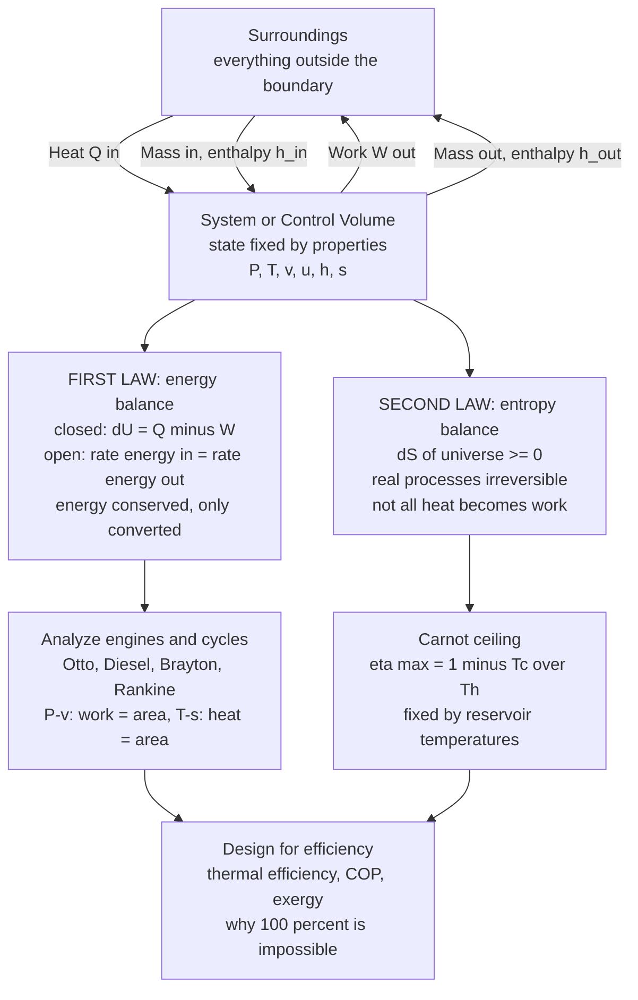

# 🔥 Engineering Thermodynamics

> [!abstract] TL;DR
> **Engineering thermodynamics** is the science of **energy, heat, and work applied to real machines** — the engineering companion to the Physics vault's [[Laws_of_Thermodynamics]]. You draw a **boundary** around a region of interest (a **system**, or an **open control volume** with mass flowing through it — a turbine, compressor, nozzle, or boiler), fix its **state** with properties ($P$, $T$, $v$, internal energy $u$, enthalpy $h = u + Pv$, entropy $s$), and then apply two accounting rules. The **first law** ($\Delta U = Q - W$ for a closed system) says energy is conserved — you can only convert it, never create or destroy it, so track every joule of heat in and work out. The **second law** says **entropy always increases**, real processes are **irreversible**, and **not all heat can become work**: the **Carnot limit** $\eta_{max} = 1 - T_C/T_H$ caps *any* heat engine's efficiency by the reservoir temperatures alone — the reason engines dump 60 to 70 percent of their fuel as waste heat and why 100 percent efficiency is impossible. This is the foundation of **every energy conversion device** — engines, power plants, refrigerators, jets — and it opens this section's notes on cycles, engines, and heat transfer.

## Intuition

**Analogy:** Thermodynamics is the **accounting of energy**. Like money in a bank, energy can be **moved** (heat flowing hot to cold), **transformed** (chemical fuel into hot gas into motion), and **put to work** — but it can **never be created or destroyed**, so the books always balance. There is only one cruel twist an accountant never faces: **every time you spend energy, a fee is charged that you can never recover** — some of it always slips away as low-grade, unusable **waste heat**. The first law is the balance sheet (total energy in equals total energy out); the second law is the non-refundable transaction fee (quality is lost every time energy changes hands).

This bookkeeping runs civilization. Every **engine** burns fuel to make motion, every **power plant** boils water to spin turbines, every **refrigerator** pumps heat "uphill" from cold to hot against its natural direction. Engineering thermodynamics is these accounting rules applied to **real machines** — tracking energy *in*, work *out*, and the heat inevitably *lost* — so we can design engines and power systems that squeeze the most work from every joule. The first law tells you **what is possible** (energy must balance); the second law tells you **the best you can ever do** (efficiency has a ceiling you cannot cross).

---

## How It Works

### Core Mechanics

1. **Define the system and its boundary.** Choose a **system** (the region of interest) and its **surroundings**, separated by a **boundary**. A **closed system** has fixed mass (a sealed piston-cylinder); an **open system / control volume** lets mass flow *in and out* (a turbine, pump, nozzle, or boiler) — the workhorse of mechanical engineering, where fluid streams carry energy across the boundary.

2. **Fix the state with properties.** The **state** of a substance is pinned down by its **properties**: pressure $P$, temperature $T$, specific volume $v$, internal energy $u$, **enthalpy** $h = u + Pv$ (which bundles internal energy with the "flow work" $Pv$ needed to push fluid across a boundary), and **entropy** $s$. Two independent properties fix all the rest, related by an **equation of state** — the **ideal gas law** $Pv = RT$ for gases far from condensation, or tabulated **property tables** (steam tables, refrigerant tables) for substances near phase change.

3. **Apply the first law — conservation of energy.** For a **closed** system, $\Delta U = Q - W$: the internal energy rises by the heat added minus the work done *by* the system. For an **open** system at steady state, the energy balance carries enthalpy through the boundary: $\dot Q - \dot W_{shaft} = \dot m\,[(h_2 - h_1) + \tfrac12(V_2^2 - V_1^2) + g(z_2 - z_1)]$. Critically, **heat $Q$ and work $W$ are path functions** — they depend on *how* the process happens, not just the endpoints — whereas $U$, $H$, $S$ are **properties** (state functions).

4. **Apply the second law — entropy and the efficiency ceiling.** Entropy of an isolated system **never decreases**: $\Delta S_{universe} \geq 0$. Its engineering teeth: real processes (friction, mixing, finite-temperature-difference heat transfer) **generate entropy** and are **irreversible**; a **reversible** process is the frictionless, quasi-static idealization that generates none. No heat engine between reservoirs $T_H$ and $T_C$ can beat the **Carnot efficiency** $\eta_{max} = 1 - T_C/T_H$.

5. **Analyze cycles and rate performance.** Engines and refrigerators run in **cycles** — closed loops on process diagrams. On a **$P$-$v$ diagram** the enclosed **area is the net work**; on a **$T$-$s$ diagram** the enclosed area is the net **heat**. Performance is scored by **thermal efficiency** $\eta = W_{net}/Q_{in}$ for engines, **coefficient of performance** (COP) for refrigerators and heat pumps, and **exergy** (availability) for how much *useful* work a stream could ideally still deliver.

### Flow / Architecture



---

## Key Concepts

### Secondary Level

- **A system is a chosen region; everything else is its surroundings.** Draw an imaginary line (the **boundary**) around what you care about — the gas in a cylinder, the water in a boiler — and study energy crossing that line.
- **Energy is conserved (first law).** You cannot get more energy out of a machine than you put in. Fuel's chemical energy becomes heat, heat becomes motion, but the total never grows from nothing.
- **You cannot turn all heat into work (second law).** Even a perfect engine must dump some heat to a cold place. Heat naturally flows **hot to cold**, never the reverse on its own — that is why a hot coffee cools and never spontaneously reheats.
- **Engines and fridges are the two headline machines.** An **engine** takes in heat and produces work (car, jet, power plant); a **refrigerator or heat pump** uses work to pump heat from cold to hot (fridge, air conditioner).

### Undergraduate Level

- **Closed vs open systems.** A **closed** system exchanges only heat and work (piston-cylinder); an **open** system / **control volume** also exchanges **mass** (turbine, compressor, nozzle, pump, heat exchanger). Open-system analysis is why **enthalpy** $h = u + Pv$ exists — the $Pv$ term is the **flow work** needed to push mass across the boundary.
- **State, properties, and the equation of state.** State is fixed by two independent intensive properties. **Ideal gas**: $Pv = RT$, with $u$ and $h$ functions of $T$ alone. Near phase change, use **property tables** (steam, R-134a) where quality $x$ interpolates between saturated liquid and vapor.
- **First law, closed system:** $\Delta U = Q - W$, with sign convention *heat in positive, work out positive*. Process-specific boundary work $W = \int P\,dV$:

| Process | Constraint | Boundary work $W = \int P\,dV$ |
|---------|-----------|-------------------------------|
| Isochoric | $V$ const | $W = 0$, so $\Delta U = Q$ |
| Isobaric | $P$ const | $W = P\,\Delta V$ |
| Isothermal (ideal gas) | $T$ const | $W = nRT\ln(V_f/V_i)$ |
| Adiabatic | $Q = 0$ | $W = -\Delta U = -nC_v\,\Delta T$ |

- **Path vs state functions.** $Q$ and $W$ depend on the **path** — "the heat contained in a system" is meaningless. $U$, $H$, $S$ are **properties**: their change depends only on endpoints.
- **Second law, quantified.** Clausius: $dS \geq \delta Q/T$, equality for reversible processes. A heat engine's efficiency $\eta = W_{net}/Q_{in} = 1 - Q_{out}/Q_{in} \leq 1 - T_C/T_H$ (**Carnot bound**).
- **Performance metrics.** Engine thermal efficiency $\eta = W_{net}/Q_{in}$ (always $< 1$). Refrigerator $\mathrm{COP}_R = Q_C/W_{net}$; heat pump $\mathrm{COP}_{HP} = Q_H/W_{net} = \mathrm{COP}_R + 1$ (both routinely **exceed 1** — you *move* more heat than the work you spend).
- **Process diagrams.** $P$-$v$: enclosed area = net **work**. $T$-$s$: enclosed area = net **heat**. A cycle traversed clockwise on either is a **power** cycle; counter-clockwise is a **refrigeration** cycle.
- **Isentropic efficiency.** Real turbines, compressors, and pumps are compared to the ideal reversible-adiabatic (isentropic) device: $\eta_{turbine} = w_{actual}/w_{isentropic}$, $\eta_{compressor} = w_{isentropic}/w_{actual}$.

### Graduate Level

- **Exergy (availability) and second-law efficiency.** Energy is conserved but its **quality** degrades. **Exergy** is the maximum useful work a stream can deliver as it comes to equilibrium with a dead state $(T_0, P_0)$. **Exergy is destroyed** by irreversibility at rate $\dot X_{dest} = T_0\,\dot S_{gen}$ (the **Gouy-Stodola** theorem). Second-law efficiency $\eta_{II}$ compares actual performance to the reversible ideal, exposing *where* work potential is squandered.
- **Entropy generation and the entropy balance.** For a control volume: $\dot S_{gen} = \dot S_{out} - \dot S_{in} - \sum \dot Q_k/T_k \geq 0$. Minimizing $\dot S_{gen}$ ("entropy generation minimization") is a design principle for heat exchangers, insulation, and turbomachinery.
- **Property relations.** The **Gibbs equations** $du = T\,ds - P\,dv$ and $dh = T\,ds + v\,dP$, the **Maxwell relations**, and departure functions extend property evaluation to **real gases** (compressibility factor $Z$, cubic equations of state such as van der Waals, Redlich-Kwong, Peng-Robinson).
- **Applied cycle analysis.** Air-standard **Otto/Diesel/Dual** cycles; **Brayton** cycle with regeneration, intercooling, and reheat; **Rankine** cycle with superheat, reheat, and feedwater regeneration; **combined** (Brayton-topping, Rankine-bottoming) cycles reaching around 60 percent efficiency; vapor-compression and absorption refrigeration.
- **Combustion and reacting systems.** Stoichiometry, adiabatic flame temperature, enthalpy of formation, and the second-law "chemical exergy" of fuels — linking to [[Chemical_Thermodynamics]].
- **Finite-time thermodynamics.** The Carnot bound assumes infinitely slow (zero-power) operation. The **Curzon-Ahlborn** efficiency at maximum power, $\eta_{CA} = 1 - \sqrt{T_C/T_H}$, matches real plant efficiencies far better than $\eta_{Carnot}$.

---

## Python Demo

```python
# The two laws that rule every engine, in one figure.
#
#   LEFT  panel -> FIRST LAW on a P-V diagram:
#       an ideal-gas CARNOT CYCLE. Net work per cycle = the ENCLOSED AREA
#       (work = integral of P dV). Over a full cycle dU = 0, so the first
#       law gives  W_net = Q_h - Q_c  (heat absorbed minus heat rejected).
#
#   RIGHT panel -> SECOND LAW / CARNOT CEILING:
#       Carnot efficiency  eta = 1 - Tc/Th  is the MAXIMUM any heat engine
#       can reach for given reservoir temperatures. Real engines sit BELOW it.
#
# Requires: numpy, matplotlib
import numpy as np
import matplotlib.pyplot as plt

R     = 8.314   # J / (mol K), universal gas constant
n     = 1.0     # mol of ideal gas (the working substance)
gamma = 1.4     # ratio of specific heats (air-like diatomic gas)
Th    = 800.0   # K, hot reservoir
Tc    = 300.0   # K, cold reservoir

# ---- Carnot state points (V in arbitrary but consistent units) ----
V1 = 1.0                                     # state 1: start isothermal expansion at Th
V2 = 3.0                                     # state 2: end   isothermal expansion at Th
V3 = V2 * (Th / Tc) ** (1.0 / (gamma - 1))   # state 3: after adiabatic expansion to Tc
V4 = V1 * (Th / Tc) ** (1.0 / (gamma - 1))   # state 4: after isothermal compression at Tc

P_of = lambda V, T: n * R * T / V            # ideal-gas law: P = nRT / V

# sample each of the four legs of the cycle
Va = np.linspace(V1, V2, 200); Pa = P_of(Va, Th)             # 1->2 isothermal (Q_h absorbed)
P2 = P_of(V2, Th)
Vb = np.linspace(V2, V3, 200); Pb = P2 * (V2 / Vb) ** gamma  # 2->3 adiabatic expansion
Vc = np.linspace(V3, V4, 200); Pc = P_of(Vc, Tc)            # 3->4 isothermal (Q_c rejected)
P4 = P_of(V4, Tc)
Vd = np.linspace(V4, V1, 200); Pd = P4 * (V4 / Vd) ** gamma  # 4->1 adiabatic compression

Vloop = np.concatenate([Va, Vb, Vc, Vd])
Ploop = np.concatenate([Pa, Pb, Pc, Pd])

# Net work = enclosed area of the closed loop via the shoelace formula = integral P dV
W_net_area = 0.5 * abs(np.dot(Vloop, np.roll(Ploop, -1)) - np.dot(Ploop, np.roll(Vloop, -1)))

# First-law bookkeeping (analytic): dU = 0 over a cycle, so W_net = Q_h - Q_c
Q_h = n * R * Th * np.log(V2 / V1)   # heat absorbed on the hot isotherm
Q_c = n * R * Tc * np.log(V3 / V4)   # heat rejected on the cold isotherm (magnitude)
W_net_law  = Q_h - Q_c
eta_carnot = 1.0 - Tc / Th

print("=== (a) FIRST LAW on the P-V Carnot cycle ===")
print(f"  Q_h absorbed (hot isotherm)  : {Q_h:8.1f} J")
print(f"  Q_c rejected (cold isotherm) : {Q_c:8.1f} J")
print(f"  W_net = Q_h - Q_c            : {W_net_law:8.1f} J   (first law, dU_cycle = 0)")
print(f"  W_net = enclosed P-V area    : {W_net_area:8.1f} J   (shoelace formula)")
print(f"  agreement                    : {100 * W_net_area / W_net_law:6.2f} percent")
print("=== (b) SECOND LAW / Carnot ceiling ===")
print(f"  eta_Carnot = 1 - Tc/Th       : {100 * eta_carnot:6.1f} percent")
print(f"  W_net / Q_h  (consistency)   : {100 * W_net_law / Q_h:6.1f} percent")

# ---- real engines: (hot-side temperature [K], actual thermal efficiency) ----
engines = {
    "Steam plant":     (810.0, 0.40),
    "Gasoline (Otto)": (1400.0, 0.30),
    "Diesel":          (1500.0, 0.42),
    "Gas turbine":     (1500.0, 0.40),
    "Combined cycle":  (1700.0, 0.60),
}

# ----------------------------- plotting -----------------------------
fig, (axL, axR) = plt.subplots(1, 2, figsize=(14, 6))
fig.suptitle("Engineering Thermodynamics: the First Law tracks energy, the Second Law caps it",
             fontsize=14, fontweight="bold")

# LEFT: P-V Carnot cycle, enclosed area = net work
axL.plot(Vloop, Ploop, color="#d62728", lw=2.2)
axL.fill(Vloop, Ploop, color="#d62728", alpha=0.12)
for V, P, lab, dx, dy in [(V1, P_of(V1, Th), "1", -0.9, 350),
                          (V2, P2, "2",  0.6, 250),
                          (V3, P_of(V3, Tc), "3", 0.6, 120),
                          (V4, P4, "4", -1.4, -180)]:
    axL.scatter([V], [P], color="k", zorder=5)
    axL.annotate(lab, xy=(V, P), xytext=(V + dx, P + dy), fontsize=11, fontweight="bold")
axL.annotate("Q_h in (Th isotherm)", xy=(1.8, P_of(1.8, Th)),
             xytext=(4.0, P_of(1.5, Th)), fontsize=8, color="#c1121f",
             arrowprops=dict(arrowstyle="->", color="#c1121f"))
axL.annotate("Q_c out (Tc isotherm)", xy=(V3 * 0.7, P_of(V3 * 0.7, Tc)),
             xytext=(V3 * 0.45, P_of(V3 * 0.7, Tc) + 800), fontsize=8, color="#1d4e89",
             arrowprops=dict(arrowstyle="->", color="#1d4e89"))
axL.text(3.0, P_of(3.0, Th) * 0.55, "enclosed area\n= W_net = Q_h - Q_c",
         fontsize=9, ha="center", color="#d62728", fontweight="bold")
axL.set_xlabel("volume  V  [arb. units]")
axL.set_ylabel("pressure  P  [Pa, arb. units]")
axL.set_title("(a) FIRST LAW: work = enclosed area, dU_cycle = 0", fontsize=11)
axL.grid(alpha=0.3)

# RIGHT: Carnot ceiling vs real engines
Th_range = np.linspace(310, 2000, 300)
eta_line = 1.0 - Tc / Th_range
axR.plot(Th_range, 100 * eta_line, color="#2a9d8f", lw=2.5,
         label="Carnot ceiling  eta = 1 - Tc/Th")
axR.fill_between(Th_range, 100 * eta_line, 100, color="#e76f51", alpha=0.12,
                 label="forbidden by the 2nd law")
for name, (Teng, eta_real) in engines.items():
    eta_max = 1.0 - Tc / Teng
    axR.plot([Teng, Teng], [100 * eta_real, 100 * eta_max], color="gray", lw=1, ls=":")
    axR.scatter([Teng], [100 * eta_real], zorder=5)
    axR.annotate(name, xy=(Teng, 100 * eta_real),
                 xytext=(Teng - 40, 100 * eta_real - 6), fontsize=7, ha="right")
axR.axvline(Th, color="k", ls="--", lw=1, alpha=0.5)
axR.text(Th + 25, 6, f"our cycle\nTh = {Th:.0f} K", fontsize=7)
axR.set_xlabel("hot-side temperature  Th  [K]   (Tc = 300 K fixed)")
axR.set_ylabel("thermal efficiency  [percent]")
axR.set_title("(b) SECOND LAW: no real engine beats Carnot", fontsize=11)
axR.set_ylim(0, 100)
axR.legend(loc="lower right", fontsize=8)
axR.grid(alpha=0.3)

plt.tight_layout(rect=[0, 0, 1, 0.95])
plt.show()
```

Running this prints the energy accounting and draws the two panels. The **left panel** is an ideal-gas **Carnot cycle** on a $P$-$v$ diagram: the shaded **enclosed area is the net work**, and the printout confirms that the geometric area (shoelace) equals $Q_h - Q_c$ from the first law to a fraction of a percent — because over a full cycle $\Delta U = 0$, so *all* the net heat becomes net work. The **right panel** plots the **Carnot ceiling** $\eta = 1 - T_C/T_H$ against hot-side temperature: the orange region above the curve is **forbidden by the second law**, and every real engine (steam, gasoline, diesel, gas turbine, combined cycle) sits **below** its Carnot limit, the dotted gaps showing the efficiency lost to irreversibility. Energy is conserved; efficiency is capped — the two laws in a single view.

---

## Real-World Applications

> **Example:** A **steam power plant** is the first and second laws made industrial. Feedwater is pumped, boiled, and superheated in the boiler (heat *in*, $Q_H$), the high-pressure steam expands through a **turbine** producing shaft work (a textbook **open control volume** where the energy balance is written in **enthalpy**), spent steam is condensed by rejecting $Q_C$ to a cooling tower or river, and the cycle repeats. The **first law** sets the energy balance around each component; the **second law** through $\eta_{Carnot} = 1 - T_C/T_H$ explains why a plant boiling at around 810 K against a 300 K environment cannot exceed roughly 62 percent even in principle — and why real plants land near 40 percent. To break that ceiling, engineers **combine cycles**: a gas turbine (Brayton, high $T_H \approx 1700$ K) tops a steam turbine (Rankine) that scavenges its hot exhaust, pushing combined efficiency toward 60 percent.

- **Internal combustion engines.** Car and truck engines run the **Otto** (spark-ignition) and **Diesel** (compression-ignition) cycles; their net work is the enclosed $P$-$v$ area, and their efficiency rises with compression ratio — the subject of this section's companion note on internal combustion engines.
- **Jet and rocket propulsion.** A jet engine is a **Brayton cycle** wrapped in turbomachinery (compressor, combustor, turbine, nozzle), each an open control volume analyzed with the steady-flow energy equation.
- **Refrigeration, HVAC, and heat pumps.** Reversed cycles pump heat from cold to hot, rated by **COP** rather than efficiency; a heat pump delivering 3 to 4 units of heat per unit of work is why they beat resistive heating — the subject of this section's companion notes on power and refrigeration cycles and on heat exchangers and HVAC.
- **Turbomachinery.** Turbines, compressors, pumps, and nozzles are the canonical **control volumes**; their real performance is scored against the **isentropic** ideal.
- **Cryogenics and gas liquefaction.** Liquefying air, nitrogen, or natural gas (LNG) uses reversed cycles and Joule-Thomson expansion, pushing thermodynamics to very low $T_C$.
- **Exergy-based plant optimization.** Beyond first-law energy balances, **exergy (second-law) analysis** locates *where* useful work potential is destroyed — combustion, heat exchange across large temperature differences, throttling — guiding where retrofits actually pay off.

---

## Common Pitfalls

- **Confusing closed and open systems (control volumes).** Writing $\Delta U = Q - W$ for a **turbine** or **compressor** is wrong: mass flows across the boundary, so you must use the **open-system** energy balance with **enthalpy** $h = u + Pv$ and flow work. Always identify system, surroundings, and boundary *first*, then pick the right form of the law.
- **Treating heat and work as properties.** $Q$ and $W$ are **path functions** — "the heat contained in the gas" or "the work stored in the piston" are meaningless statements. Only $U$, $H$, $S$ (and $P$, $T$, $v$) are **properties** whose change is path-independent.
- **Sign-convention chaos.** Mechanical engineering uses $\Delta U = Q - W$ (heat *in* positive, work done *by* the system positive). Chemistry and many physics texts use $\Delta U = Q + W$ (work done *on* the system positive). Mixing the two flips signs everywhere — state your convention explicitly.
- **Using the ideal gas law where it does not apply.** $Pv = RT$ fails badly for **wet steam**, refrigerants near saturation, and any substance close to phase change; there you must read **property/steam tables** (with quality $x$), not plug into ideal-gas formulas.
- **Believing Carnot efficiency is achievable.** $\eta_{Carnot} = 1 - T_C/T_H$ is an **upper bound** requiring perfectly **reversible** operation at zero power. Every real machine has **irreversibilities** — friction, turbulent mixing, finite-temperature-difference heat transfer — that generate entropy and pull efficiency below it.
- **Thinking 100 percent efficiency is "just an engineering problem."** The **Kelvin-Planck** statement forbids converting heat *entirely* to work in a cycle: you *always* need a cold reservoir to reject $Q_C$. No amount of clever design removes the cold-side dump; it is a law, not a limitation of materials.
- **Confusing efficiency with COP.** Engine efficiency $\eta = W_{net}/Q_{in}$ is always **less than 1**. Refrigerator/heat-pump **COP** $= Q/W_{net}$ is routinely **greater than 1** because you *move* heat rather than *make* work — quoting an air conditioner's "efficiency" as over 100 percent means you have mixed the two metrics.
- **Reading the wrong diagram for the wrong quantity.** On a **$P$-$v$** diagram the enclosed area is **work**; on a **$T$-$s$** diagram it is **heat**. Swapping them is a classic exam error.
- **Ignoring that energy is conserved but exergy is destroyed.** Saying "energy is never lost" is technically true yet misleading: the first law conserves *quantity*, but the second law degrades *quality*. Waste heat still carries energy — it just can no longer do useful work. **Exergy/availability** is the honest currency of "what can still be done."

---

## Related Concepts

**Physics vault — the underlying laws (this note is the ME/application view)**
- [[Laws_of_Thermodynamics]] — the physicist's statement of the zeroth through third laws; this note is its engineering-application companion, aimed at machines and cycles rather than fundamental principle
- [[Entropy_and_Second_Law]] — the deep dive into entropy as a state function and the microscopic meaning behind the Carnot ceiling
- [[Kinetic_Theory_of_Gases]] — why $Pv = RT$, and where temperature, pressure, and internal energy come from at the molecular level
- [[Thermodynamic_Potentials]] — internal energy, enthalpy, Helmholtz and Gibbs free energies as the natural functions for different constraints

**Chemistry vault — reacting and phase-change systems**
- [[Chemical_Thermodynamics]] — enthalpy of formation, Gibbs free energy, and equilibrium for the combustion and chemical processes that supply engine heat

---

## Review Questions

**Secondary**
1. A refrigerator makes its inside cold. Does this violate the second law's rule that "heat flows from hot to cold"? Explain what the electricity (work input) is actually doing, and why the *kitchen* gets warmer overall.

**Undergraduate**
2. Steam enters an adiabatic turbine at high pressure and leaves at low pressure, producing shaft work. (a) Is this a closed system or an open control volume, and which form of the first law applies? (b) Why does the energy balance use **enthalpy** rather than internal energy? (c) The turbine operates between an effective $T_H = 800$ K and $T_C = 320$ K — what is the maximum thermal efficiency, and name two irreversibilities that keep the real turbine below it.

**Graduate**
3. Two power plants both take in 1000 MW of heat and reject waste heat to a 300 K environment: Plant A boils at 700 K and achieves 35 percent efficiency; Plant B runs a combined cycle with a top temperature of 1700 K and achieves 58 percent. (a) Compute each plant's Carnot ceiling and its **second-law efficiency** $\eta_{II} = \eta_{actual}/\eta_{Carnot}$. (b) Using the Gouy-Stodola relation $\dot X_{dest} = T_0\,\dot S_{gen}$, argue where the largest exergy destruction typically occurs in such plants and why raising $T_H$ (Plant B) is thermodynamically so powerful. (c) Why does the Curzon-Ahlborn efficiency $1 - \sqrt{T_C/T_H}$ often predict real plant performance better than the Carnot bound?

---

## Sources

- Y. A. Cengel & M. A. Boles — *Thermodynamics: An Engineering Approach*, 9th ed. (McGraw-Hill, 2019)
- M. J. Moran, H. N. Shapiro, D. D. Boettner & M. B. Bailey — *Fundamentals of Engineering Thermodynamics*, 9th ed. (Wiley, 2018)
- C. Borgnakke & R. E. Sonntag — *Fundamentals of Thermodynamics*, 10th ed. (Wiley, 2019)
- G. J. Van Wylen & R. E. Sonntag — *Fundamentals of Classical Thermodynamics* (Wiley, classic edition)
- A. Bejan — *Advanced Engineering Thermodynamics*, 4th ed. (Wiley, 2016) — exergy and entropy generation minimization

---

#mechanical-engineering #thermodynamics #first-law #second-law #carnot
