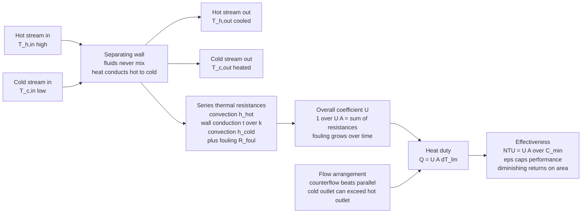

# 🌡️ Heat Exchangers and HVAC

> [!abstract] TL;DR
> A **heat exchanger** transfers heat between two fluids at different temperatures **without letting them mix** — they trade energy across a **separating wall**. This one idea sits inside a car radiator, a home furnace, a refrigerator's coils, and a power-plant condenser. Performance is governed by the **heat duty** $Q = U A\,\Delta T$, where $U$ is the **overall heat-transfer coefficient** (the series combination of convection on both sides plus wall conduction, degraded over time by **fouling**), $A$ is surface area, and $\Delta T$ is the driving temperature difference. Two design methods dominate: the **LMTD** method ($Q = U A\,\Delta T_{lm}$, when inlet and outlet temperatures are known) and the **effectiveness-NTU** method ($\varepsilon$ as a function of $\mathrm{NTU} = UA/C_{min}$, when outlets are unknown). **Flow arrangement matters**: **counterflow** beats **parallel flow** because the cold outlet can exceed the hot outlet. **HVAC** (Heating, Ventilation, Air Conditioning) is the engineered *system* of exchangers, fans, ducts, and refrigeration cycles that keeps buildings comfortable — and because space heating and cooling consume a **huge share of global energy and emissions**, better exchangers, **heat pumps** ($\mathrm{COP} > 1$), and energy recovery are a central **decarbonization lever**.

## Intuition

**Analogy:** Picture **two rivers running side by side, separated only by a thin stone wall.** One river is hot, the other cold. They never mingle a single drop — yet the hot river warms the wall, the wall warms the cold river, and the two leave with their temperatures nudged toward each other. That shared wall, doing nothing but *conducting heat while keeping the fluids apart*, is a **heat exchanger**. A car **radiator** (hot coolant giving heat to passing air), a home **furnace** (hot combustion gas warming room air), a **fridge's coils** (refrigerant dumping heat to the kitchen), and a **power-plant condenser** (spent steam giving heat to river water) are all the *same device* wearing different costumes.

Now imagine you must keep a whole *building* comfortable through summer heat and winter cold, while also swapping stale air for fresh — that is **HVAC**, the system of these exchangers plus fans, ducts, and a refrigeration cycle. These unglamorous devices quietly run the modern world's **thermal comfort** and **every industrial process that heats or cools** — and, precisely because they are everywhere, they consume a staggering fraction of the energy humanity uses.

---

## How It Works

### Core Mechanics

1. **Two fluids, one wall, no mixing.** A hot stream at $T_{h,in}$ and a cold stream at $T_{c,in}$ flow past a solid boundary (tube walls, plates, fins). Heat flows from hot to cold *through* the wall, so the hot fluid leaves cooler ($T_{h,out}$) and the cold fluid leaves warmer ($T_{c,out}$). Chemical composition is preserved — the point of the wall is to move **energy** without moving **mass**.

2. **The overall heat-transfer coefficient $U$ is a chain of resistances.** Heat crossing from hot fluid to cold fluid fights **three series resistances**: convection on the hot side ($1/h_{hot}$), conduction through the wall ($t/k$), and convection on the cold side ($1/h_{cold}$). They add like resistors in series: $\frac{1}{UA} = \frac{1}{h_h A_h} + \frac{t}{k A_w} + \frac{1}{h_c A_c} + R_{foul}$. The extra **fouling resistance** $R_{foul}$ (scale, biofilm, soot, corrosion) *grows over time* and is why exchangers must be cleaned.

3. **The driving force is a temperature difference — but it changes along the exchanger.** Near the hot inlet the gap $T_h - T_c$ is large; downstream it shrinks. The correct *average* is the **log-mean temperature difference** $\Delta T_{lm} = \dfrac{\Delta T_1 - \Delta T_2}{\ln(\Delta T_1/\Delta T_2)}$, giving the **heat duty** $Q = U A\,\Delta T_{lm}$ (the **LMTD method**, used when all four terminal temperatures are known — typically for *sizing* the area $A$).

4. **When outlets are unknown, use effectiveness-NTU.** Define the **capacity rates** $C = \dot m\,c_p$ for each stream, the smaller being $C_{min}$. The maximum *conceivable* heat transfer is $Q_{max} = C_{min}(T_{h,in} - T_{c,in})$, and **effectiveness** $\varepsilon = Q_{actual}/Q_{max}$. It depends only on two dimensionless groups: $\mathrm{NTU} = UA/C_{min}$ (a "thermal size") and the capacity ratio $C_r = C_{min}/C_{max}$, through closed-form relations that differ by **flow arrangement**.

5. **Flow arrangement sets the ceiling.** **Parallel flow** (both fluids enter the same end) forces the two temperatures to converge toward a common value — the cold outlet can *never* pass the hot outlet. **Counterflow** (fluids enter opposite ends) keeps the driving $\Delta T$ nearly uniform, extracts more heat for the same area, and permits a **temperature cross**: the cold outlet can exceed the hot outlet. That is why counterflow is the preferred arrangement whenever geometry allows.

### Flow / Architecture



---

## Key Concepts

### Secondary Level

- **A heat exchanger moves heat, not fluid.** Two fluids at different temperatures pass a shared wall; the hot one cools, the cold one warms, and they never mix. Your car's radiator and your home's air-conditioner coils are heat exchangers.
- **Heat always flows hot to cold.** The bigger the temperature gap, the faster the heat moves — so exchangers are built with lots of surface area (thin tubes, stacked plates, fins) to give heat many places to cross.
- **Counterflow is smarter than parallel flow.** If the two fluids travel in *opposite* directions, the cold stream can actually leave *hotter* than the hot stream leaves — something impossible if they travel the same way.
- **HVAC keeps buildings comfortable.** Heating, Ventilation, and Air Conditioning is the whole system — furnaces, air conditioners, fans, and ducts — that warms, cools, and freshens indoor air. It uses an enormous amount of energy.

### Undergraduate Level

- **The heat duty and the overall coefficient.** $Q = U A\,\Delta T_{lm}$. The **overall heat-transfer coefficient** $U$ lumps the whole hot-fluid-to-cold-fluid path into one number: $\frac{1}{UA} = \frac{1}{h_h A_h} + R_{wall} + \frac{1}{h_c A_c} + R_{foul}$. The **smallest** $h$ (often a gas side) dominates $U$ — which is why gas-side surfaces are **finned**.
- **LMTD method (sizing).** When all four terminal temperatures are known, compute $\Delta T_1$ and $\Delta T_2$ at the two ends, then $\Delta T_{lm} = (\Delta T_1 - \Delta T_2)/\ln(\Delta T_1/\Delta T_2)$, and solve $A = Q/(U\,\Delta T_{lm})$. For multi-pass and crossflow units apply a correction factor $F$: $Q = F\,U A\,\Delta T_{lm}$.
- **Effectiveness-NTU method (rating).** With unknown outlets, use $\mathrm{NTU} = UA/C_{min}$, $C_r = C_{min}/C_{max}$, and the arrangement's $\varepsilon(\mathrm{NTU}, C_r)$. Counterflow: $\varepsilon = \dfrac{1 - e^{-\mathrm{NTU}(1-C_r)}}{1 - C_r\,e^{-\mathrm{NTU}(1-C_r)}}$ (and $\varepsilon = \mathrm{NTU}/(1+\mathrm{NTU})$ when $C_r=1$). Parallel: $\varepsilon = \dfrac{1 - e^{-\mathrm{NTU}(1+C_r)}}{1 + C_r}$. Then $Q = \varepsilon\,C_{min}(T_{h,in}-T_{c,in})$.
- **Types.** **Shell-and-tube** (rugged, high-pressure, industrial workhorse); **plate** (compact, high $U$, easy to clean, food and HVAC); **finned-tube / compact** (air-to-liquid: radiators, AC coils, intercoolers); **regenerative** (a matrix or wheel that *stores* heat then releases it — gas-turbine recuperators, energy-recovery ventilators).
- **Capacity ratio and the phase-change limit.** When one stream **boils or condenses**, its temperature stays constant, so $C \to \infty$ and $C_r \to 0$ — the best possible case, giving $\varepsilon = 1 - e^{-\mathrm{NTU}}$ regardless of arrangement (condensers and evaporators).
- **Psychrometrics.** HVAC air is *moist* air; its state needs **two** properties (dry-bulb temperature plus humidity). Cooling below the **dew point** condenses water (dehumidification), so cooling coils do **latent** as well as **sensible** work — a psychrometric chart tracks both.

### Graduate Level

- **Effectiveness-NTU derivations and crossflow.** The $\varepsilon$ relations follow from integrating the coupled energy balances; crossflow with both fluids unmixed has no elementary closed form and uses the standard approximation $\varepsilon = 1 - \exp\!\big[\tfrac{\mathrm{NTU}^{0.22}}{C_r}\big(e^{-C_r\,\mathrm{NTU}^{0.78}} - 1\big)\big]$. The $\varepsilon$-$\mathrm{NTU}$ and LMTD-$F$ formulations are mathematically equivalent; choose LMTD for **sizing**, $\varepsilon$-NTU for **rating**.
- **Diminishing returns and pinch.** $\varepsilon$ rises with NTU but **saturates** — doubling the area near high NTU buys almost no extra heat while doubling cost and pressure drop. **Pinch analysis** (the minimum approach $\Delta T$) formalizes the trade between capital area and thermodynamic irreversibility; heat transferred across a large $\Delta T$ **destroys exergy** at rate $\dot X_{dest} = T_0\,\dot S_{gen}$ (links to [[Entropy_and_Second_Law]]).
- **Fouling and the design margin.** $R_{foul}$ is time-dependent and uncertain; over-sizing for a "clean" $U$ can paradoxically *promote* fouling (lower velocities). TEMA fouling factors, cleaning cycles, and velocity/surface selection are core design decisions.
- **The refrigeration / vapor-compression cycle in HVAC.** Air conditioners and **heat pumps** run a reversed cycle: evaporator (absorbs heat indoors), compressor, condenser (rejects heat outdoors), expansion valve. Rated by **COP**, not efficiency; a heat pump delivering 3-4 units of heat per unit of electricity is the reason it dominates resistive heating — analyzed in this section's companion note on power and refrigeration cycles.
- **Loads, envelope, and air handling.** HVAC sizing starts from **heating and cooling loads** (conduction, solar gain, infiltration, internal gains through the building envelope), then air-handling units move conditioned air through **ducts and fans** whose pressure drop and flow obey fluid mechanics (see [[Fluid_Dynamics_Overview]]).
- **Energy recovery and decarbonization.** **Energy-recovery ventilators** (a regenerative exchanger between exhaust and intake air) reclaim heat and moisture from air that must be replaced for indoor air quality; combined with high-performance envelopes and heat pumps, these are the levers that cut HVAC's outsized share of building energy and emissions (see [[Renewable_Energy_Integration]], [[Anthropogenic_Climate_Change]]).

---

## Python Demo

```python
# Heat-exchanger analysis in one figure:
#
#   (a) TEMPERATURE PROFILES along a PARALLEL-flow exchanger — the two
#       streams chase each other toward a common temperature; the cold
#       outlet can NEVER pass the hot outlet.
#   (b) TEMPERATURE PROFILES along a COUNTERFLOW exchanger (same U, A,
#       flow rates, inlets) — the driving gap stays wide, more heat moves,
#       and the cold outlet ENDS UP HOTTER than the hot outlet: a
#       "temperature cross", impossible in parallel flow.
#   (c) EFFECTIVENESS vs NTU for different flow arrangements — showing the
#       arrangement ranking and the DIMINISHING RETURNS of adding area.
#
# We also verify the LMTD duty  Q = U*A*LMTD  against  Q = eps*Cmin*dT_in.
# Requires: numpy, matplotlib
import numpy as np
import matplotlib.pyplot as plt

# ---------------- design inputs ----------------
Th_in, Tc_in = 150.0, 20.0      # deg C : hot and cold inlet temperatures
C_h  = 1000.0                    # W/K   : hot-stream capacity rate  (m_dot * cp)
C_c  = 1000.0                    # W/K   : cold-stream capacity rate
UA   = 2000.0                    # W/K   : overall conductance = U * A

Cmin, Cmax = min(C_h, C_c), max(C_h, C_c)
Cr    = Cmin / Cmax              # capacity ratio
NTU   = UA / Cmin                # number of transfer units (thermal "size")
dT_in = Th_in - Tc_in            # maximum available temperature difference

# ---------------- effectiveness-NTU closed forms ----------------
def effectiveness(NTU, Cr, kind):
    if kind == "parallel":
        return (1 - np.exp(-NTU * (1 + Cr))) / (1 + Cr)
    if kind == "counter":
        if np.isclose(Cr, 1.0):
            return NTU / (1 + NTU)
        e = np.exp(-NTU * (1 - Cr))
        return (1 - e) / (1 - Cr * e)
    if kind == "crossflow":                      # both fluids unmixed (approx.)
        return 1 - np.exp((NTU**0.22 / Cr) * (np.exp(-Cr * NTU**0.78) - 1))
    raise ValueError(kind)

eps_par = effectiveness(NTU, Cr, "parallel")
eps_cf  = effectiveness(NTU, Cr, "counter")
Q_par   = eps_par * Cmin * dT_in
Q_cf    = eps_cf  * Cmin * dT_in

# ---------------- march the temperature profiles along the wall (RK4) ----------------
# a = UA/C_h, b = UA/C_c ; sign_c = +1 parallel (cold co-flows), -1 counter
def march(Th0, Tc0, a, b, sign_c, N=400):
    p  = np.linspace(0.0, 1.0, N)
    dp = p[1] - p[0]
    Th = np.empty(N); Tc = np.empty(N)
    Th[0], Tc[0] = Th0, Tc0
    f = lambda th, tc: (-a * (th - tc), sign_c * b * (th - tc))
    for i in range(N - 1):
        k1 = f(Th[i],                Tc[i])
        k2 = f(Th[i] + .5*dp*k1[0],  Tc[i] + .5*dp*k1[1])
        k3 = f(Th[i] + .5*dp*k2[0],  Tc[i] + .5*dp*k2[1])
        k4 = f(Th[i] +    dp*k3[0],  Tc[i] +    dp*k3[1])
        Th[i+1] = Th[i] + dp/6*(k1[0] + 2*k2[0] + 2*k3[0] + k4[0])
        Tc[i+1] = Tc[i] + dp/6*(k1[1] + 2*k2[1] + 2*k3[1] + k4[1])
    return p, Th, Tc

a, b = UA / C_h, UA / C_c

# parallel: both streams ENTER at position p = 0
p_par, Th_par, Tc_par = march(Th_in, Tc_in, a, b, sign_c=+1)

# counterflow: hot enters at p = 0; cold EXITS at p = 0, so start the march
# from the cold OUTLET temperature and integrate toward p = 1 (cold inlet).
Tc_out_cf = Tc_in + Q_cf / C_c
p_cf, Th_cf, Tc_cf = march(Th_in, Tc_out_cf, a, b, sign_c=-1)

# ---------------- LMTD cross-check :  Q = U*A*LMTD ----------------
def lmtd(dT1, dT2):
    return dT1 if np.isclose(dT1, dT2) else (dT1 - dT2) / np.log(dT1 / dT2)

lm_par = lmtd(Th_in - Tc_in,        Th_par[-1] - Tc_par[-1])   # ends of parallel unit
lm_cf  = lmtd(Th_in - Tc_cf[0],     Th_cf[-1]  - Tc_cf[-1])    # ends of counter unit

print(f"NTU = {NTU:.2f}   Cr = {Cr:.2f}")
print(f"PARALLEL : eps={eps_par:.3f}  Q={Q_par/1e3:6.2f} kW  "
      f"Th_out={Th_par[-1]:5.1f} C  Tc_out={Tc_par[-1]:5.1f} C  "
      f"U*A*LMTD={UA*lm_par/1e3:6.2f} kW")
print(f"COUNTER  : eps={eps_cf:.3f}  Q={Q_cf/1e3:6.2f} kW  "
      f"Th_out={Th_cf[-1]:5.1f} C  Tc_out={Tc_cf[0]:5.1f} C  "
      f"U*A*LMTD={UA*lm_cf/1e3:6.2f} kW")
print(f"TEMPERATURE CROSS (counterflow): cold out {Tc_cf[0]:.1f} C "
      f"> hot out {Th_cf[-1]:.1f} C  -- impossible in parallel flow")

# ------------------------------- plotting -------------------------------
fig, (axA, axB, axC) = plt.subplots(1, 3, figsize=(17, 5.2))
fig.suptitle("Heat Exchangers: counterflow beats parallel flow, and effectiveness caps performance",
             fontsize=14, fontweight="bold")

# (a) parallel-flow temperature profiles
axA.plot(p_par, Th_par, color="#d62728", lw=2.4, label="hot stream")
axA.plot(p_par, Tc_par, color="#1f77b4", lw=2.4, label="cold stream")
axA.fill_between(p_par, Th_par, Tc_par, color="#999999", alpha=0.15)
axA.annotate("both enter here", xy=(0.02, (Th_in+Tc_in)/2), fontsize=8,
             xytext=(0.15, 95), arrowprops=dict(arrowstyle="->"))
axA.text(0.55, 92, "streams converge\ncold out < hot out", fontsize=9,
         color="#333333", fontweight="bold")
axA.set_title(f"(a) PARALLEL flow  (eps={eps_par:.2f})", fontsize=11)
axA.set_xlabel("position along exchanger  [fraction of area]")
axA.set_ylabel("temperature  [deg C]")
axA.set_ylim(0, 160); axA.grid(alpha=0.3); axA.legend(loc="center right", fontsize=9)

# (b) counterflow temperature profiles (cold flows right -> left)
axB.plot(p_cf, Th_cf, color="#d62728", lw=2.4, label="hot stream  (left to right)")
axB.plot(p_cf, Tc_cf, color="#1f77b4", lw=2.4, label="cold stream (right to left)")
axB.fill_between(p_cf, Th_cf, Tc_cf, color="#999999", alpha=0.15)
axB.axhline(Th_cf[-1], color="#d62728", ls=":", lw=1)
axB.axhline(Tc_cf[0],  color="#1f77b4", ls=":", lw=1)
axB.annotate("cold OUT hotter\nthan hot OUT\n(temperature cross)",
             xy=(0.02, Tc_cf[0]), xytext=(0.30, 130), fontsize=9,
             color="#0b5394", fontweight="bold",
             arrowprops=dict(arrowstyle="->", color="#0b5394"))
axB.set_title(f"(b) COUNTERFLOW  (eps={eps_cf:.2f})", fontsize=11)
axB.set_xlabel("position along exchanger  [fraction of area]")
axB.set_ylabel("temperature  [deg C]")
axB.set_ylim(0, 160); axB.grid(alpha=0.3); axB.legend(loc="lower center", fontsize=8)

# (c) effectiveness vs NTU for several arrangements
NTU_ax = np.linspace(0.01, 6.0, 300)
axC.plot(NTU_ax, effectiveness(NTU_ax, 0.0, "counter"), "k:", lw=1.6,
         label="counter, Cr=0  (condenser cap)")
axC.plot(NTU_ax, effectiveness(NTU_ax, 1.0, "counter"), color="#2a9d8f", lw=2.4,
         label="counterflow, Cr=1")
axC.plot(NTU_ax, effectiveness(NTU_ax, 1.0, "crossflow"), color="#e9c46a", lw=2.2,
         label="crossflow unmixed, Cr=1")
axC.plot(NTU_ax, effectiveness(NTU_ax, 1.0, "parallel"), color="#e76f51", lw=2.2,
         label="parallel flow, Cr=1")
axC.scatter([NTU], [eps_cf],  color="#2a9d8f", zorder=5)
axC.scatter([NTU], [eps_par], color="#e76f51", zorder=5)
axC.annotate("our design\npoint", xy=(NTU, eps_cf), xytext=(NTU+0.6, eps_cf-0.02),
             fontsize=8, arrowprops=dict(arrowstyle="->"))
axC.axvspan(4, 6, color="gray", alpha=0.08)
axC.text(4.6, 0.15, "diminishing\nreturns", fontsize=8, color="#555555")
axC.set_title("(c) EFFECTIVENESS vs NTU", fontsize=11)
axC.set_xlabel("NTU = U*A / C_min")
axC.set_ylabel("effectiveness  eps")
axC.set_ylim(0, 1.02); axC.grid(alpha=0.3); axC.legend(loc="lower right", fontsize=8)

plt.tight_layout(rect=[0, 0, 1, 0.94])
plt.show()
```

Running this prints the duty for each arrangement and confirms that $U A\,\Delta T_{lm}$ matches $\varepsilon\,C_{min}\,\Delta T_{in}$ to a fraction of a percent — the **LMTD** and **effectiveness-NTU** methods are two views of the same physics. **Panel (a)** shows parallel flow: the two temperature curves chase each other toward a common value, and the cold outlet stays *below* the hot outlet. **Panel (b)**, the same exchanger run in counterflow, keeps a wide driving gap the whole length and produces a **temperature cross** — the cold stream leaves *hotter* than the hot stream leaves, which parallel flow can never do. **Panel (c)** plots $\varepsilon$ against **NTU**: effectiveness climbs steeply at first, then **saturates**, so adding area past $\mathrm{NTU}\approx 4$ buys almost nothing while doubling cost — the diminishing-returns wall that caps every real design.

---

## Real-World Applications

> **Example:** A **steam power-plant condenser** is a giant shell-and-tube heat exchanger and a perfect illustration of $C_r \to 0$. Exhaust steam from the turbine flows over thousands of tubes carrying cool river or cooling-tower water; the steam **condenses at essentially constant temperature** (its capacity rate is effectively infinite), so $\varepsilon = 1 - e^{-\mathrm{NTU}}$ regardless of arrangement. Condensing the steam creates the low back-pressure that the turbine expands *into* — meaning this heat exchanger directly sets the plant's cold-reservoir temperature $T_C$ and therefore its **Carnot ceiling** (see [[Laws_of_Thermodynamics]]). Fouling on the water-side tubes silently raises the condensing pressure and quietly steals megawatts, which is why condenser tubes are cleaned on a schedule.

- **Automotive radiators and intercoolers.** Finned-tube, air-to-liquid crossflow exchangers dump engine and charge-air heat to the atmosphere — the gas side is finned precisely because the air-side $h$ is the bottleneck in $U$ (companion note on internal combustion engines: [[Internal_Combustion_Engines]]).
- **Refrigerators and air conditioners.** The **evaporator** and **condenser** coils are heat exchangers where the refrigerant changes phase; they are the heat-absorbing and heat-rejecting halves of the vapor-compression cycle.
- **Plate exchangers in food, dairy, and district heating.** Compact stacks of corrugated plates give very high $U$ and easy disassembly for cleaning — used for pasteurization, brewing, and building HVAC hydronic loops.
- **Gas-turbine recuperators and energy-recovery ventilators.** **Regenerative** exchangers preheat combustion air from hot exhaust (raising cycle efficiency) or reclaim heat and moisture between a building's exhaust and fresh intake air (cutting HVAC ventilation loads).
- **Process industry.** Oil coolers, chemical reactor heat integration, LNG liquefaction, and refinery crude-preheat trains all live or die by heat-exchanger network design and pinch analysis.
- **Whole-building HVAC.** Air-handling units couple cooling/heating coils, filters, and fans to ducts sized by fluid mechanics ([[Fluid_Dynamics_Overview]]); **heat pumps** provide heating at $\mathrm{COP} > 1$, and high-efficiency systems plus recovery are a front-line **decarbonization** measure ([[Renewable_Energy_Integration]], [[Anthropogenic_Climate_Change]]).

---

## Common Pitfalls

- **Forgetting that the two fluids must not mix.** The defining feature of a heat exchanger is a **separating wall**; a device that blends the streams (a mixing chamber, a cooling tower's direct contact) is *not* a recuperative heat exchanger and obeys different rules. Draw the wall and label which fluid is on which side before writing any balance.
- **Using LMTD when outlets are unknown.** The **LMTD** method needs all four terminal temperatures. If two outlets are unknown you either iterate LMTD or — far better — switch to **effectiveness-NTU**, which was invented for exactly this "rating" problem.
- **Assuming parallel and counterflow perform the same.** For identical $U$, $A$, and inlets, **counterflow transfers more heat** and uniquely allows a **temperature cross** ($T_{c,out} > T_{h,out}$). Defaulting to parallel flow silently wastes area and effectiveness.
- **Believing more area always helps.** Effectiveness **saturates** with NTU. Past the knee of the $\varepsilon$-NTU curve, extra area adds cost, weight, and **pressure drop** (pumping power) for negligible extra heat — the diminishing-returns trap.
- **Ignoring the controlling resistance.** $U$ is dominated by the **smallest** $h$. Polishing the liquid side while the gas side sets the limit does nothing; that is why gas surfaces are **finned** and why a "clean $U$" from a handbook can be wildly optimistic.
- **Neglecting fouling.** $R_{foul}$ grows with time and can **halve** $U$ between cleanings. Designs that ignore it are undersized within months; designs that over-compensate can run too slow and foul faster.
- **Confusing efficiency with COP in HVAC.** An air conditioner or **heat pump** is rated by **COP** (or SEER/SCOP), routinely **greater than 1**, because it *moves* heat rather than *making* it — quoting an HVAC unit's "efficiency" as over 100 percent means the metrics were mixed.
- **Sizing HVAC on temperature alone (ignoring humidity).** Comfort and cooling loads depend on **moist-air** state — you need **psychrometrics**. A coil that only tracks dry-bulb temperature under-predicts the **latent** load of condensing water and delivers a clammy, over-humid space.
- **Underestimating HVAC's energy stakes.** Space heating and cooling are a **major share of global energy use and emissions**; treating HVAC as an afterthought, rather than optimizing exchangers, envelopes, recovery, and heat pumps, forfeits one of the largest available efficiency and decarbonization gains.

---

## Related Concepts

**Mechanical Engineering — same section**
- [[Engineering_Thermodynamics]] — the first and second laws and the enthalpy balances that every heat exchanger and refrigeration cycle rests on; this note is the applied heat-transfer-device companion
- [[Internal_Combustion_Engines]] — engines that depend on radiators, oil coolers, and charge-air intercoolers to reject and manage heat

**Physics vault — the underlying laws**
- [[Laws_of_Thermodynamics]] — heat flows hot to cold, and a condenser's cold-side temperature sets the Carnot ceiling of the plant it serves
- [[Entropy_and_Second_Law]] — heat transferred across a finite temperature difference is irreversible and destroys exergy, the deep reason exchangers trade area against thermodynamic loss

**Fluid Dynamics and energy vaults**
- [[Fluid_Dynamics_Overview]] — the convection coefficients $h$, duct/fan pressure drops, and pumping power that govern $U$ and HVAC air handling
- [[Renewable_Energy_Integration]] — heat pumps, electrified heating, and building efficiency as levers in the energy transition
- [[Anthropogenic_Climate_Change]] — why HVAC's enormous energy footprint makes exchanger and heat-pump efficiency a climate priority

*(Sibling notes referenced in prose but not yet created: Conduction_Heat_Transfer, Convection_and_Radiation, Power_and_Refrigeration_Cycles, Engineering_Fluid_Mechanics, Sustainable_and_Energy_Systems_Engineering.)*

---

## Review Questions

**Secondary**
1. A car radiator and a home air conditioner's coils look nothing alike, yet engineers call both "heat exchangers." What single job do they share, and what is the one thing that must **never** happen to the two fluids inside them?

**Undergraduate**
2. A counterflow exchanger has $U A = 2000$ W/K, both streams with $C = 1000$ W/K, hot in at 150 C and cold in at 20 C. (a) Compute NTU, $C_r$, and the effectiveness $\varepsilon$. (b) Find $Q$, the two outlet temperatures, and verify that $Q = U A\,\Delta T_{lm}$. (c) Show that the cold outlet exceeds the hot outlet, and explain why the *same* exchanger plumbed for parallel flow could never do this.

**Graduate**
3. You must raise a plate exchanger's effectiveness from 0.70 to 0.85 at fixed capacity rates. (a) Using the $\varepsilon$-NTU relation, quantify how much the NTU (and hence area, at fixed $U$) must increase, and comment on the diminishing-returns and pressure-drop penalties. (b) Fouling doubles the film resistance on one side, cutting $U$ by 30 percent — what happens to $\varepsilon$ and $Q$, and how would a design margin have anticipated this? (c) In an HVAC energy-recovery ventilator, argue why a modest, robust effectiveness across a large air-flow (with acceptable fan power) can save more building energy than chasing a very high $\varepsilon$ at high pressure drop.

---

## Sources

- F. P. Incropera, D. P. DeWitt, T. L. Bergman & A. S. Lavine — *Fundamentals of Heat and Mass Transfer*, 8th ed. (Wiley, 2017) — LMTD, effectiveness-NTU, exchanger analysis
- Y. A. Cengel & A. J. Ghajar — *Heat and Mass Transfer: Fundamentals and Applications*, 6th ed. (McGraw-Hill, 2020)
- W. M. Kays & A. L. London — *Compact Heat Exchangers*, 3rd ed. (Krieger, 1998) — compact and finned-surface design
- R. K. Shah & D. P. Sekulic — *Fundamentals of Heat Exchanger Design* (Wiley, 2003)
- ASHRAE — *ASHRAE Handbook: Fundamentals* and *HVAC Systems and Equipment* (ASHRAE) — psychrometrics, loads, air handling

---

#mechanical-engineering #heat-exchangers #hvac #lmtd #effectiveness-ntu
