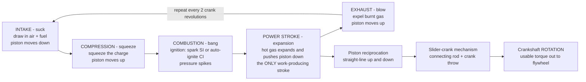

# 🔥 Internal Combustion Engines: Burning Fuel to Make Mechanical Power

> [!abstract] TL;DR
> An **internal combustion engine (ICE)** burns fuel *inside* a piston-cylinder (unlike an external steam engine), and the expanding hot gas shoves a **piston** whose up-and-down **reciprocation** is turned into **crankshaft rotation** by the **slider-crank** mechanism, with intake and exhaust **valves** timed by **cams**. The dominant design runs a **four-stroke cycle** — *suck, squeeze, bang, blow* (**intake → compression → power → exhaust**), of which only the power stroke does work. Two ignition families split the world: **spark-ignition (SI / gasoline)**, idealized by the **Otto cycle** with constant-**volume** heat addition and efficiency $\eta = 1 - r^{-(\gamma-1)}$ set by the **compression ratio** $r$; and **compression-ignition (CI / diesel)**, idealized by the **Diesel cycle** with constant-**pressure** heat addition, which tolerates a *much* higher $r$ and so runs more efficiently. Higher compression always helps efficiency, but in SI engines it is capped by **knock** (premature auto-ignition, fought with octane rating and combustion-chamber design). ICEs powered ~every car, truck, ship, train, piston aircraft, and generator for over a century — a triumph of applied **thermodynamics + mechanisms + combustion** — and their efficiency ceiling plus **emissions** (NOx, CO, unburned hydrocarbons, soot, CO₂) are now driving the historic shift to **electrification**.

## Intuition

**Analogy:** An internal combustion engine is a *controlled explosion happening thousands of times a minute*, each one shoving a piston down to turn a crankshaft. Suck in air and fuel, squeeze it hard, light it (**BANG!**), and let the expanding gas push — **suck, squeeze, bang, blow**. That four-beat rhythm, multiplied across several cylinders and spun into smooth rotation, powered a century of cars, trucks, ships, and generators.

Everything else is a refinement of that one image. A cylinder is just a sealed can with a sliding lid (the piston); combustion is the *bang* that makes the trapped gas hot and high-pressure; the slider-crank is the wrist-and-crank linkage that turns the lid's shove into a spinning shaft; the valves and cams are the timed doors that let fresh charge in and burnt gas out at exactly the right instant. It is a marvel of thermodynamics, mechanisms, and combustion working in **microsecond concert** — and understanding it explains both why it dominated transport and why it is now being electrified.

---

## How It Works

### Core Mechanics

1. **Internal, not external.** In a steam engine the fuel burns *outside* the working chamber and heat is carried into the water. An ICE burns fuel **inside** the cylinder, so the combustion products *are* the working fluid. That directness is why ICEs are compact and powerful for their weight — no boiler, no heat exchanger between fire and piston.

2. **The four strokes — suck, squeeze, bang, blow.** One power cycle of a four-stroke engine takes **two crankshaft revolutions** and four piston travels:
   - **Intake (suck):** the piston descends, the intake valve opens, and air (SI: air + fuel) is drawn in.
   - **Compression (squeeze):** both valves close and the rising piston compresses the charge into a small volume, raising its temperature and pressure. The volume ratio between bottom and top is the **compression ratio** $r = V_{max}/V_{min}$.
   - **Power (bang):** near top dead center the charge ignites — a **spark plug** in SI, **auto-ignition** of injected fuel in CI. Combustion spikes the pressure, and the expanding gas drives the piston down. **This is the only work-producing stroke.**
   - **Exhaust (blow):** the exhaust valve opens and the rising piston pushes the burnt gas out. Repeat.

3. **Reciprocation to rotation — the slider-crank.** The piston moves in a straight line, but a wheel must spin. The **slider-crank mechanism** — piston, connecting rod, crank throw — converts linear reciprocation into continuous **crankshaft rotation** (see the sibling *Mechanisms_and_Kinematics*), delivering **torque** through the shaft much like the twisted shafts of [[Torsion_and_Shafts]]. A flywheel smooths the pulses between power strokes.

4. **Timed breathing — valves and cams.** Intake and exhaust valves must open and close in exact synchrony with piston position. A **camshaft**, geared to the crankshaft at half speed, lifts each valve through lobed **cams** (see the sibling *Cams_and_Linkages*). Valve *timing*, *lift*, and *duration* shape how well the engine breathes at each speed.

5. **Two ignition families and their ideal cycles.**
   - **Spark-ignition (Otto cycle):** premixed air and fuel are compressed to a modest ratio ($r \approx 8$–$12$) and ignited by a spark; combustion is fast and idealized as **constant-volume** heat addition. Ideal efficiency $\eta_{Otto} = 1 - r^{-(\gamma-1)}$ — it depends *only* on the compression ratio and the gas property $\gamma$.
   - **Compression-ignition (Diesel cycle):** *only air* is compressed to a very high ratio ($r \approx 14$–$22$), heating it enough to auto-ignite fuel sprayed in near top dead center. Combustion is spread out and idealized as **constant-pressure** heat addition. The much higher achievable $r$ makes real diesels the more efficient of the two.

6. **The compression-ratio tradeoff.** Efficiency rises with $r$ for *both* cycles, so engineers always want more compression. In SI engines the ceiling is **knock**: squeeze the premixed charge too hard and it *auto-ignites before the spark*, producing a destructive pressure spike. Knock resistance is quantified by **octane rating** and mitigated by chamber shape, cooling, and timing. Diesels sidestep knock entirely because they compress *air alone* and inject fuel only when they *want* it to burn.

### Flow / Architecture



---

## Key Concepts

### Secondary Level

- **Suck, squeeze, bang, blow.** A four-stroke engine repeats four moves: pull in air and fuel, squeeze them small, light them so they explode and push the piston, then blow out the smoke. Only the *bang* stroke actually does work; the flywheel's stored spin carries the piston through the other three.
- **Burning inside is the trick.** Unlike a steam engine that boils water over a fire, an ICE burns fuel *right inside* the cylinder — so it can be small, light, and go in a car.
- **Up-and-down becomes round-and-round.** The piston only moves in a straight line. A clever linkage (the slider-crank, like your leg pushing a bicycle pedal) turns that push into a spinning shaft that drives the wheels.
- **Gasoline vs diesel.** A gasoline engine sparks a fuel-air mix; a diesel squeezes air so hard it gets hot enough to ignite the fuel on its own — no spark plug. Diesels squeeze harder, which is why they usually go farther on a litre.

### Undergraduate Level

- **Air-standard Otto cycle.** Model the SI engine as a closed air cycle: adiabatic **compression** (1→2), constant-**volume** heat addition (2→3, "combustion"), adiabatic **expansion** (3→4, power), constant-volume heat rejection (4→1). Thermal efficiency collapses to $\eta_{Otto} = 1 - r^{-(\gamma-1)}$ where $r=V_1/V_2$ and $\gamma=c_p/c_v \approx 1.4$ for air. Grounded in the first and second laws ([[Laws_of_Thermodynamics]], [[Entropy_and_Second_Law]]) and detailed in the sibling *Power_and_Refrigeration_Cycles*.
- **Air-standard Diesel cycle.** Replace constant-volume heat addition with constant-**pressure** heat addition over a **cutoff ratio** $r_c=V_3/V_2$: $\eta_{Diesel}=1-r^{-(\gamma-1)}\left[\dfrac{r_c^{\gamma}-1}{\gamma\,(r_c-1)}\right]$. The bracket is always $>1$, so *at equal $r$* Diesel is slightly *less* efficient than Otto — but diesels run at far higher $r$, winning in practice.
- **Performance metrics.** **Torque** (twisting effort) and **power** ($=$ torque $\times$ angular speed) each peak at different rpm, giving the classic torque/power curves. **Brake mean effective pressure (BMEP)** normalizes torque by displacement — a load-independent yardstick for comparing engines of any size. **Specific fuel consumption (BSFC)** is fuel burned per unit work.
- **Two efficiencies.** **Thermal efficiency** is how well heat becomes work; **volumetric efficiency** is how well the engine *breathes* (actual vs ideal air mass inducted). Poor breathing throttles power at high rpm.
- **Forced induction.** A **turbocharger** (exhaust-driven) or **supercharger** (crank-driven) packs *more air* into each cylinder, letting more fuel burn per cycle — more power from the same displacement (**downsizing**).
- **Knock and octane.** In SI engines, end-gas auto-ignition ahead of the flame front causes **knock**, a damaging pressure oscillation. Higher **octane** fuel resists it, permitting higher compression and thus better efficiency.

### Graduate Level

- **Why ideal Otto overpredicts.** The air-standard cycle assumes constant $\gamma$, instantaneous combustion, no heat loss, and no friction. Real losses — **finite heat-release duration**, **wall heat transfer**, **incomplete combustion**, **blowby**, **pumping work**, and **mechanical friction** — pull a ~57% ideal Otto number down to ~30–40% brake efficiency. Fuel-air cycle and finite-heat-release models close the gap.
- **Combustion regimes.** SI is a **premixed turbulent flame** propagating from the spark; CI is a **mixing-controlled diffusion flame** where burn rate is limited by fuel-air mixing. This distinction drives everything downstream, including emissions and noise.
- **Emissions formation.** **NOx** forms via the thermal (Zeldovich) mechanism at high in-cylinder temperatures; **CO** and **unburned hydrocarbons (HC)** come from incomplete or quenched combustion; **particulate soot** is a diesel/rich-mixture signature; **CO₂** is the unavoidable product of burning carbon (see [[Chemical_Thermodynamics]] for combustion energetics and [[Anthropogenic_Climate_Change]] for its climate role).
- **Aftertreatment.** SI engines run near stoichiometric so a **three-way catalytic converter** can simultaneously oxidize CO/HC and reduce NOx. Diesels run lean and need a **diesel particulate filter (DPF)** plus **selective catalytic reduction (SCR)** with urea to knock down soot and NOx.
- **Advanced cycles and strategies.** **Miller/Atkinson** cycles use altered valve timing to expand more than they compress (efficiency over power density); **EGR** (exhaust-gas recirculation) lowers peak temperature to cut NOx; **HCCI/low-temperature combustion** blends SI and CI advantages but is hard to control. These push the mature ICE toward its practical limits as **electrification** (the sibling *Sustainable_and_Energy_Systems_Engineering*, and the EV traction path of [[Motor_Drives_and_Control]]) reshapes transport.

---

## Python Demo

```python
# Otto and Diesel cycles: draw the idealized Otto P-V cycle and show why
# thermal efficiency climbs with compression ratio - and how Diesel compares.
import numpy as np
import matplotlib.pyplot as plt

gamma = 1.4  # ratio of specific heats c_p/c_v for air

# ============================================================
# (a) IDEALIZED OTTO CYCLE (spark-ignition) on a P-V diagram
#     1->2 adiabatic compression | 2->3 const-VOLUME heat add
#     3->4 adiabatic expansion (power) | 4->1 const-volume reject
# ============================================================
r     = 8.0    # compression ratio V1/V2 (typical gasoline engine)
P1    = 100.0  # kPa  - state 1, bottom dead center (start of compression)
V1    = 1.0    # normalized cylinder volume at BDC
V2    = V1 / r # volume at top dead center (TDC)
alpha = 3.5    # const-volume pressure ratio P3/P2 (heat-addition strength)

# Four corner states
P2 = P1 * r**gamma      # 1->2 adiabatic compression:  P*V^gamma = const
P3 = alpha * P2         # 2->3 constant-volume combustion
P4 = P3 / r**gamma      # 3->4 adiabatic expansion (power stroke)

# Smooth adiabatic curves for the diagram
V_comp = np.linspace(V1, V2, 200)
P_comp = P1 * (V1 / V_comp)**gamma        # process 1 -> 2
V_exp  = np.linspace(V2, V1, 200)
P_exp  = P3 * (V2 / V_exp)**gamma         # process 3 -> 4

# ============================================================
# (b) THERMAL EFFICIENCY vs COMPRESSION RATIO: OTTO vs DIESEL
# ============================================================
def otto_eff(r, g=gamma):
    return 1.0 - r**-(g - 1.0)

def diesel_eff(r, rc, g=gamma):
    # rc = cutoff ratio V3/V2 (how far into the stroke fuel keeps burning)
    return 1.0 - r**-(g - 1.0) * (rc**g - 1.0) / (g * (rc - 1.0))

r_range    = np.linspace(4, 24, 400)
rc         = 2.0
eta_otto   = otto_eff(r_range)
eta_diesel = diesel_eff(r_range, rc)

print(f"Otto   eta at r={r:.0f}      : {otto_eff(r):.3f}")
print(f"Otto   eta at r=10          : {otto_eff(10):.3f}")
print(f"Diesel eta at r=18, rc={rc} : {diesel_eff(18, rc):.3f}")

# ---------------------------- plot ----------------------------
fig, (ax1, ax2) = plt.subplots(1, 2, figsize=(13, 5.2))

# --- P-V diagram ---
ax1.plot(V_comp, P_comp, color="tab:blue",   lw=2, label="1->2 compression")
ax1.plot([V2, V2], [P2, P3], color="tab:red", lw=2, label="2->3 combustion (const V)")
ax1.plot(V_exp, P_exp, color="tab:green", lw=2, label="3->4 expansion (power)")
ax1.plot([V1, V1], [P4, P1], color="tab:purple", lw=2, label="4->1 heat rejection")
for (V, P, name, dx, dy) in [(V1, P1, "1", 0.02, 8), (V2, P2, "2", -0.06, 0),
                             (V2, P3, "3", -0.06, 0), (V1, P4, "4", 0.02, 0)]:
    ax1.plot(V, P, "ko", ms=5)
    ax1.annotate(name, (V, P), textcoords="offset points", xytext=(dx*120, dy),
                 fontsize=12, fontweight="bold")
ax1.set_xlabel("Volume  V  [normalized]")
ax1.set_ylabel("Pressure  P  [kPa]")
ax1.set_title(f"Idealized Otto Cycle  (r = {r:.0f})")
ax1.legend(fontsize=8, loc="upper right")
ax1.grid(alpha=0.3)

# --- efficiency vs compression ratio ---
ax2.plot(r_range, eta_otto*100,   color="tab:blue",  lw=2.5,
         label="Otto  eta = 1 - 1/r^(g-1)")
ax2.plot(r_range, eta_diesel*100, color="tab:orange", lw=2.5,
         label=f"Diesel  (cutoff rc = {rc})")
ax2.axvspan(8, 12, color="tab:blue",   alpha=0.10)
ax2.axvspan(14, 22, color="tab:orange", alpha=0.10)
ax2.axvline(12, color="crimson", ls="--", lw=1.5)
ax2.text(12.2, 40, "SI knock limit\n(gasoline)", color="crimson", fontsize=8)
ax2.text(9.0, 20, "gasoline\noperating\nband", fontsize=8, ha="center")
ax2.text(18.0, 20, "diesel\noperating\nband", fontsize=8, ha="center")
ax2.set_xlabel("Compression ratio  r")
ax2.set_ylabel("Ideal thermal efficiency  [%]")
ax2.set_title("Efficiency climbs with compression ratio")
ax2.legend(fontsize=9, loc="lower right")
ax2.grid(alpha=0.3)

plt.tight_layout()
plt.savefig("ic_engine_cycles.png", dpi=130)
plt.show()

# Takeaways:
#  - The Otto P-V loop's enclosed AREA is the net work per cycle.
#  - Efficiency rises monotonically with r for BOTH cycles.
#  - At EQUAL r, Otto edges out Diesel (the cutoff bracket is > 1),
#    but SI is knock-capped near r~12 while CI runs at r~18-22,
#    so real diesels reach the higher efficiency in practice.
```

Running it prints roughly `Otto eta at r=8 : 0.565`, `Otto eta at r=10 : 0.602`, and `Diesel eta at r=18, rc=2.0 : 0.632`, and draws the Otto P-V loop beside the efficiency-vs-compression-ratio curves — visually explaining why more compression means more efficiency, and why the diesel's freedom from knock lets it win.

---

## Real-World Applications

- **Passenger cars and light trucks (SI/Otto):** gasoline engines with $r \approx 10$–$12$, port or direct injection, turbocharged downsizing, and a three-way catalytic converter — the powertrain of ~a billion vehicles.
- **Heavy trucks, ships, locomotives (CI/Diesel):** high-compression diesels prized for fuel efficiency, low-end torque, and durability under continuous heavy load; large marine two-strokes exceed 50% brake thermal efficiency.
- **Stationary and standby power:** diesel and natural-gas gensets provide backup and off-grid electricity in hospitals, data centers, and remote sites.
- **Piston aircraft, motorcycles, small engines:** from light-aircraft flat engines to chainsaws and outboards (often two-stroke for power-to-weight).
- **The transition case:** hybrids run the ICE at its efficiency sweet spot while an electric motor covers the rest, a bridge toward the fully electric drivetrains built on [[Motor_Drives_and_Control]] and low-carbon grids.

> **Example — the automotive three-way catalytic converter.** Because a spark-ignition engine can be held near the **stoichiometric** air-fuel ratio by an oxygen-sensor feedback loop, its exhaust contains just enough reductant and oxidant for a **single catalyst brick** to simultaneously oxidize CO and hydrocarbons *and* reduce NOx. This tight coupling of combustion control to aftertreatment is exactly what a diesel (which runs lean) *cannot* do, forcing diesels into a costlier DPF + SCR chain — a direct, real-world consequence of the SI-vs-CI combustion distinction.

---

## Common Pitfalls

- **Confusing four-stroke with two-stroke.** The **four-stroke** cycle (*suck-squeeze-bang-blow*) takes two crank revolutions and separates the strokes cleanly. A **two-stroke** combines intake/compression and power/exhaust into one revolution — simpler, lighter, and one power stroke per revolution, but with worse scavenging, oil-in-fuel lubrication, and **dirtier** emissions. They are different machines, not the same engine drawn two ways.
- **Treating SI and CI as interchangeable.** **Spark-ignition (Otto)** premixes fuel and air, ignites with a spark, and is modeled as **constant-volume** heat addition with $\eta = 1 - r^{-(\gamma-1)}$. **Compression-ignition (Diesel)** compresses air alone, injects fuel that **auto-ignites**, and is modeled as **constant-pressure** heat addition. They have different fuels, different limits, and different efficiency formulas.
- **Thinking higher compression is free.** Efficiency *does* rise with $r$ — but in SI engines **knock** (end-gas auto-ignition) hard-caps it near $r\approx 12$. Octane rating and chamber design buy headroom; ignoring knock destroys pistons.
- **Reading ideal Otto efficiency as reality.** The air-standard $\eta \approx 57\%$ at $r=8$ ignores heat loss, friction, finite burn time, pumping, and incomplete combustion. Real **brake** efficiency is ~30–40%. Never quote the ideal number as an engine's actual efficiency.
- **Forgetting the mechanism.** The engine is not just thermodynamics — the **slider-crank** converts reciprocation to rotation (link to *Mechanisms_and_Kinematics*) and the **valvetrain/cams** time the breathing (link to *Cams_and_Linkages*). Ignoring these misses why torque, power, and volumetric efficiency vary with rpm.
- **Conflating torque and power.** Torque is instantaneous twisting effort; **power = torque × speed**. They peak at *different* rpm. **BMEP** normalizes torque by displacement for fair comparison; without it, "more torque" is meaningless across engine sizes.
- **Ignoring breathing and boost.** **Volumetric efficiency** (how well the engine inhales) limits power at high rpm; **turbocharging/supercharging** raises it by forcing in more air. Efficiency claims that ignore pumping and breathing losses are incomplete.
- **Underselling emissions and the electrification driver.** ICEs emit **NOx, CO, HC, soot, and CO₂**; aftertreatment (catalytic converter, DPF, SCR) mitigates the first four, but CO₂ is intrinsic to burning carbon. That efficiency ceiling plus the climate cost is precisely what is pushing transport toward **electrification** — the ICE is now both a mature *and* a transitioning technology.

---

## Related Concepts

- [[Laws_of_Thermodynamics]] — the first and second laws that make an engine an energy-converter and cap its efficiency; the foundation the Otto and Diesel cycles are built on.
- [[Entropy_and_Second_Law]] — why no engine reaches 100%: the Carnot ceiling and irreversibility that the ideal ICE cycles approximate.
- [[Particle_and_Rigid_Body_Dynamics]] — the piston/con-rod/crank as a moving rigid-body system; inertia, balancing, and flywheel dynamics between power strokes.
- [[Torsion_and_Shafts]] — the crankshaft delivers power as torque through a rotating shaft, exactly the torsion problem analyzed there.
- [[Mechanical_Vibrations]] — combustion pulses and rotating unbalance excite engine vibration; why crankshafts are balanced and engines rubber-mounted.
- [[Chemical_Thermodynamics]] — the combustion reaction's enthalpy release (heating value) that sets how much heat each *bang* delivers.
- [[Anthropogenic_Climate_Change]] — the CO₂ from carbon combustion and its climate impact, a central driver of the shift away from ICEs.
- [[Motor_Drives_and_Control]] — the electric-motor traction path that is replacing the ICE in electrified transport.

*(Sibling notes referenced in prose — Power_and_Refrigeration_Cycles, Engineering_Thermodynamics, Mechanisms_and_Kinematics, Cams_and_Linkages, Sustainable_and_Energy_Systems_Engineering — will be created in this section.)*

---

## Review Questions

1. **(Secondary)** Name the four strokes of a four-stroke engine in order and say which one actually produces work. Why does the engine need a flywheel to get through the other three?
2. **(Undergraduate)** An SI engine has a compression ratio of 9 and air $\gamma = 1.4$. Compute the ideal Otto thermal efficiency. If a design change raised $r$ to 11, by how many percentage points would ideal efficiency improve — and what physical phenomenon prevents pushing $r$ much higher in a gasoline engine?
3. **(Graduate)** At *equal* compression ratio, the ideal Diesel cycle is slightly *less* efficient than the ideal Otto cycle, yet real diesel engines are more efficient than real gasoline engines. Reconcile these two facts, referencing the cutoff-ratio term in $\eta_{Diesel}$, the knock limit on SI compression, and at least one real-loss mechanism that separates ideal from brake efficiency.

---

## Sources

- Heywood, J. B. *Internal Combustion Engine Fundamentals*, 2nd ed. (McGraw-Hill, 2018).
- Pulkrabek, W. W. *Engineering Fundamentals of the Internal Combustion Engine*, 2nd ed. (Pearson).
- Stone, R. *Introduction to Internal Combustion Engines*, 4th ed. (Palgrave Macmillan).
- Cengel, Y. A. & Boles, M. A. *Thermodynamics: An Engineering Approach* (Gas Power Cycles chapter — Otto and Diesel), McGraw-Hill.
- Ferguson, C. R. & Kirkpatrick, A. T. *Internal Combustion Engines: Applied Thermosciences*, 3rd ed. (Wiley).

---

#mechanical-engineering #internal-combustion-engine #otto-cycle #diesel #combustion
