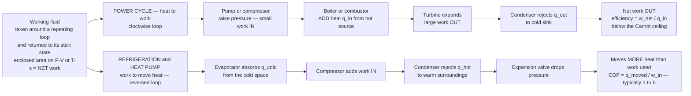

# ♻️ Power and Refrigeration Cycles: Rankine, Brayton, and the Reversed Loop

> [!abstract] TL;DR
> To make **continuous** power (or continuously move heat) you cannot burn fuel just once — you run a **working fluid** around a repeating loop of processes: **compress → add heat → expand → reject heat → repeat**, returning the fluid to its starting state every cycle. Drawn on a **P-V or T-s diagram** the cycle is a closed loop, and the **enclosed area equals the net work per cycle**. Run the loop **clockwise** and you have a **power cycle** that turns heat into work: the **Rankine** cycle (steam power plants — boiler, turbine, condenser, pump — the source of most of the world's electricity), the **Brayton** cycle (gas turbines and jet engines), and their fusion, the **combined cycle** (~60% efficient). Run the same idea **backwards** — spending work to pump heat from cold to hot — and you have a **refrigeration / heat-pump cycle** (**vapor-compression**: evaporator, compressor, condenser, expansion valve — every fridge, freezer, and air conditioner). Power cycles are rated by **thermal efficiency** $\eta = w_{net}/q_{in}$ (always below the Carnot ceiling); refrigerators and heat pumps by the **coefficient of performance** $\text{COP} = q_{moved}/w_{in}$, which is remarkably **greater than 1** (typically 3–5) because the machine *pumps existing heat* rather than creating it.

## Intuition

**Analogy:** Imagine bailing water uphill with a bucket on a rope-and-pulley loop. To move water *continuously* you don't carry one bucket once — you send buckets around an endless loop: dip, lift, pour, return, dip again. A thermodynamic cycle is exactly this, but the "bucket" is a **working fluid** carrying **energy**, and the loop is **compress → heat → expand → cool → repeat**. A **power plant** boils water into high-pressure steam that shoves a turbine around (extracting work), then condenses the steam back to water and pumps it up to do it all again — a little **net work** falls out each lap. A **refrigerator runs the identical loop in reverse**: instead of letting heat flow downhill and skimming off work, it *spends* work to shove heat **uphill**, from the cold inside of your fridge out into the warm kitchen.

Drawn on a diagram whose two axes are pressure and volume (or temperature and entropy), the whole cycle is a **closed loop**, and the **area it encloses is the net work of one lap**. A clockwise loop hands you work (engine); a counter-clockwise loop demands work (fridge). These loops — Rankine, Brayton, Otto, Diesel, vapor-compression — are the beating hearts of every power plant, engine, jet, air conditioner, and refrigerator on Earth.

---

## How It Works

### Core Mechanics

1. **Why a *cycle* at all.** A single expansion (fuel burns, gas pushes a piston once) gives you *one* stroke of work and then you are stuck with a hot, spent, low-pressure fluid. To get **continuous** power you must return the fluid to its **initial state** so you can do it again — and the second law guarantees you cannot do that for free: some heat must be **rejected to a cold sink**. A cycle is the minimal machine that reconciles "keep going" with "the second law forbids a free lunch."

2. **The four generic processes.** Almost every cycle is built from four steps on a **working fluid**: **compression** (raise pressure — pump for a liquid, compressor for a gas, small work *in*), **heat addition** $q_{in}$ (from a hot source — boiler, combustor), **expansion** (through a turbine or against a piston — large work *out*), and **heat rejection** $q_{out}$ (to a cold sink — a condenser or the atmosphere). Energy balance over one closed loop ($\Delta U = 0$) gives the master identity: **net work = net heat**, $w_{net} = q_{in} - q_{out}$.

3. **Area = net work.** On a **P-V** diagram the work of each process is $\int P\,dV$; summed around the loop, the interior integrals cancel and only the **enclosed area** survives — that area *is* $w_{net}$. On a **T-s** diagram the same is true for heat: enclosed area is $q_{in}-q_{out}=w_{net}$. **Clockwise** loop → positive area → net work **out** (power). **Counter-clockwise** → negative area → net work **in** (refrigeration).

4. **Power cycles (heat → work).** The **Rankine** cycle uses a fluid that **changes phase** (water ↔ steam): the pump compresses *liquid* (cheap — liquids are nearly incompressible, so pump work is tiny), the boiler adds heat and boils it to high-pressure steam, the turbine expands the steam to extract shaft work, and the condenser dumps the remaining heat and returns liquid. The **Brayton** cycle uses a *gas* (air) that stays gaseous: compressor → combustor → turbine, usually **open** (fresh air in, exhaust out) as in a **gas turbine or jet engine**. **Otto** and **Diesel** are the piston-engine (internal-combustion) cousins.

5. **Efficiency and its ceiling.** A power cycle's **thermal efficiency** is $\eta = w_{net}/q_{in} = 1 - q_{out}/q_{in}$. No cycle operating between a hot reservoir $T_H$ and cold reservoir $T_L$ can beat the **Carnot limit** $\eta_{Carnot} = 1 - T_L/T_H$. Real cycles fall short because of **irreversibilities** (friction, finite-temperature heat transfer, throttling) — a T-s loop with rounded, slanted edges instead of the perfect Carnot rectangle.

6. **Reverse it: refrigeration and heat pumps (work → move heat).** Run the loop counter-clockwise and it *pumps* heat up a temperature hill. In **vapor-compression**, low-pressure refrigerant **boils in the evaporator**, absorbing heat $q_{cold}$ from the cold space; the **compressor** raises its pressure and temperature; the **condenser** rejects heat $q_{hot}$ to the warm surroundings; the **expansion valve** throttles it back to low pressure and temperature. The payoff metric is the **coefficient of performance** — for a fridge $\text{COP}_R = q_{cold}/w_{in}$, for a heat pump $\text{COP}_{HP} = q_{hot}/w_{in} = \text{COP}_R + 1$. Because you are *relocating* existing heat rather than generating it, **COP is greater than 1** (often 3–5): a heat pump can deliver 4 kW of heating for 1 kW of electricity.

### Flow / Architecture



---

## Key Concepts

### Secondary Level

- **A cycle is a loop that never ends.** To keep making power, the working fluid goes around and around: squeeze it, heat it, let it push something, cool it, repeat. Each lap gives a little bit of leftover useful work.
- **Steam is the classic worker.** In a power plant, heat (from coal, gas, nuclear, or the sun) boils water into steam; the steam blasts a **turbine** to spin a generator; then it is cooled back to water and pumped around again. That is the **Rankine** cycle.
- **A fridge is a power plant run backwards.** Instead of heat making work, a fridge spends electrical work to *move* heat — it pulls heat out of the cold box and dumps it into your kitchen. That is why the back of a fridge is warm.
- **Free lunch, almost.** A heat pump can put **more** heat into your house than the electricity it uses — because it is *carrying* heat in from outside, not *making* it. That is the magic of COP being bigger than 1.
- **You always waste some heat.** No engine turns *all* its heat into work; some must be thrown away to a cooler place. That is a law of nature, not bad engineering.

### Undergraduate Level

- **Net work from the closed-loop energy balance.** Over one cycle $\oint dU = 0$, so $w_{net} = q_{in} - q_{out}$, and $\eta = w_{net}/q_{in} = 1 - q_{out}/q_{in}$.
- **The four Rankine states** (numbering the standard order): **1** saturated liquid leaving the condenser; **1→2** isentropic **pump** ($w_p = v_1(P_2 - P_1)$, small); **2→3** constant-pressure **boiler** heat addition $q_{in} = h_3 - h_2$; **3→4** isentropic **turbine** expansion $w_t = h_3 - h_4$; **4→1** constant-pressure **condenser** heat rejection $q_{out} = h_4 - h_1$. Then $\eta = (w_t - w_p)/q_{in}$.
- **Three ways to raise Rankine efficiency:** **superheat** (raise turbine-inlet temperature — higher mean temperature of heat addition, and drier steam at turbine exit, protecting blades); **raise boiler pressure** (raises the temperature at which heat is added); **lower condenser pressure** (lowers the temperature of heat rejection — hence the vacuum condensers and cooling towers). **Reheat** (expand partway, return to the boiler, expand again) and **regeneration** (bleed steam to preheat feedwater) push $\eta$ further.
- **The Brayton cycle** (ideal, cold-air-standard): efficiency depends only on the **pressure ratio** $r_p$, $\eta_{Brayton} = 1 - r_p^{-(\gamma-1)/\gamma}$. Higher pressure ratio → higher efficiency, bounded by turbine-inlet **metal temperature**. Intercooling, reheat, and regeneration improve real gas turbines.
- **Vapor-compression refrigeration states:** **1** saturated vapor leaving evaporator; **1→2** isentropic **compressor** $w_{in} = h_2 - h_1$; **2→3** condenser heat rejection $q_H = h_2 - h_3$; **3→4** **throttle** through the expansion valve ($h_4 = h_3$, an irreversible constant-enthalpy drop); **4→1** evaporator heat absorption $q_L = h_1 - h_4$. Then $\text{COP}_R = q_L/w_{in} = (h_1 - h_4)/(h_2 - h_1)$ and $\text{COP}_{HP} = q_H/w_{in} = \text{COP}_R + 1$.
- **Carnot benchmark.** The best possible values are $\eta_{Carnot} = 1 - T_L/T_H$ (engine), $\text{COP}_{R,Carnot} = T_L/(T_H - T_L)$, and $\text{COP}_{HP,Carnot} = T_H/(T_H - T_L)$ — all functions of the reservoir temperatures alone. The smaller the temperature *lift* $(T_H - T_L)$, the higher the COP (why heat pumps struggle in extreme cold).
- **Why phase change.** A boiling/condensing fluid absorbs and releases enormous **latent heat** at nearly constant temperature, keeping heat addition/rejection close to the isothermal ideal and letting a small mass flow move a lot of energy.

### Graduate Level

- **The combined cycle.** A **Brayton** gas turbine exhausts at 500–650 °C — far too hot to waste. Route that exhaust through a **heat-recovery steam generator** to run a **Rankine** bottoming cycle. The topping (Brayton) and bottoming (Rankine) cycles together span a huge temperature range, and their combined efficiency approaches $\eta_{cc} = \eta_B + \eta_R - \eta_B\eta_R \approx 60\%$ — the most efficient thermal power plants ever built, and the reason natural-gas combined-cycle plants dominate new dispatchable generation.
- **Exergy / second-law analysis.** First-law efficiency hides *where* work potential is destroyed. **Exergy** (availability) accounting localizes irreversibility: the biggest exergy destruction in a Rankine plant is the **boiler** (huge temperature difference between flame and steam); in refrigeration it is the **throttle valve** (an isenthalpic expansion that produces no work). Replacing throttles with turbo-expanders or two-stage expansion recovers some of it.
- **Real vs ideal cycles.** Isentropic devices become real via **isentropic efficiencies** $\eta_{turb} = (h_3 - h_{4})/(h_3 - h_{4s})$, $\eta_{comp} = (h_{2s} - h_1)/(h_2 - h_1)$; add pressure drops in boilers/condensers, mechanical and generator losses. The ideal T-s rectangle becomes a lossy, rounded loop with a smaller enclosed area.
- **Working-fluid selection.** Power: water (cheap, high latent heat, benign) but also **organic Rankine cycle (ORC)** fluids for low-grade heat (geothermal, waste heat, solar) where water's boiling point is too high, and **supercritical CO₂** Brayton for compact high-efficiency turbomachinery. Refrigeration: the saga from **CFCs → HCFCs → HFCs (R-134a) → low-GWP HFOs, ammonia (R-717), CO₂ (R-744), and propane** — a running trade-off between **thermodynamic performance, flammability, toxicity, ozone depletion, and global-warming potential**.
- **Absorption refrigeration.** Replaces the electric compressor with a **thermally driven** absorber–generator loop (LiBr–water or ammonia–water), using *heat* instead of *work* as the driving input — ideal where waste heat or solar/gas heat is cheap and electricity is not (RV fridges, industrial chillers).
- **Cascade and multistage systems.** Very large temperature lifts (cryogenics, liquefaction) stack multiple cycles with different refrigerants, each handling a slice of the temperature range, because a single cycle's COP collapses as $(T_H - T_L)$ grows.
- **The mean-temperature view.** A clean way to see every efficiency trick: $\eta = 1 - \bar{T}_{out}/\bar{T}_{in}$ where $\bar{T}$ are entropy-weighted mean temperatures of heat rejection and addition. *Everything* — superheat, reheat, regeneration, higher pressure, combined cycle — is a maneuver to **raise $\bar{T}_{in}$ or lower $\bar{T}_{out}$** toward the Carnot rectangle.

---

## Python Demo

```python
# Power and refrigeration cycles, numpy + matplotlib only (no scipy, no property libs).
#
#   (a) RANKINE POWER CYCLE on a T-s diagram: pump -> boiler -> turbine ->
#       condenser, plotted on a representative water saturation dome, with the
#       thermal EFFICIENCY eta = w_net / q_in computed for THREE designs to show
#       how superheat and higher boiler pressure raise efficiency.
#   (b) VAPOR-COMPRESSION REFRIGERATION on a P-h diagram: evaporator ->
#       compressor -> condenser -> expansion valve, with the COEFFICIENT OF
#       PERFORMANCE COP = q_cold / w_in (a fridge/heat pump moves MORE heat than
#       the work it consumes, so COP > 1).
#
# State-point enthalpies/entropies below are representative steam- and R-134a-
# table values; the saturation domes are schematic but consistent with them.
import numpy as np
import matplotlib.pyplot as plt

# ======================================================================
# (a) RANKINE: efficiency of three designs (enthalpies in kJ/kg from steam tables)
# ======================================================================
def rankine_eta(h1, h2, h3, h4):
    w_turb = h3 - h4          # turbine work OUT
    w_pump = h2 - h1          # pump work IN (small)
    q_in   = h3 - h2          # boiler heat IN
    w_net  = w_turb - w_pump
    return w_net, q_in, w_net / q_in

designs = {
    "A base  3 MPa sat / 75 kPa":     dict(h1=384.44, h2=387.47, h3=2804.2, h4=2199.3),
    "B superheat 3 MPa 350C / 75 kPa":dict(h1=384.44, h2=387.47, h3=3116.1, h4=2403.1),
    "C high-P 8 MPa 500C / 10 kPa":   dict(h1=191.83, h2=199.90, h3=3399.5, h4=2130.5),
}
print("RANKINE POWER CYCLE")
for name, s in designs.items():
    w_net, q_in, eta = rankine_eta(**s)
    print(f"  {name:34s}  w_net={w_net:7.1f} kJ/kg  q_in={q_in:7.1f}  eta={eta*100:5.1f}%")
print("  -> superheating and raising boiler pressure (lowering condenser P) raise eta\n")

# Representative saturated-water dome for the T-s plot  (T in C, s in kJ/kg-K)
Ts = np.array([0.01,  50,   100,  150,  200,  250,  300,  350,  373.95])
sf = np.array([0.000, 0.704,1.307,1.842,2.331,2.794,3.255,3.780,4.407])   # sat liquid
sg = np.array([9.156, 8.075,7.355,6.837,6.430,6.072,5.706,5.211,4.407])   # sat vapor
dome_s = np.concatenate([sf, sg[::-1]])
dome_T = np.concatenate([Ts, Ts[::-1]])

# Design C state points on the T-s plane  (s [kJ/kg-K], T [C])
p1  = (0.6493, 45.8)    # sat liquid, 10 kPa (condenser exit)
p2  = (0.6493, 46.0)    # pumped to 8 MPa (isentropic, ~vertical)
p2f = (2.7970, 295.0)   # sat liquid at 8 MPa (start of boiling)
p2g = (5.7432, 295.0)   # sat vapor  at 8 MPa (end of boiling)
p3  = (6.7266, 500.0)   # superheated steam, 8 MPa / 500 C (turbine inlet)
p4  = (6.7266, 45.8)    # turbine exit, wet, 10 kPa
rankine = [p1, p2, p2f, p2g, p3, p4, p1]

# ======================================================================
# (b) VAPOR-COMPRESSION REFRIGERATION (R-134a): -20 C evap, 40 C condenser
# ======================================================================
h1r, h2r, h3r = 238.43, 275.40, 108.26     # kJ/kg: evap-out, comp-out, cond-out
h4r = h3r                                   # throttle is isenthalpic
P_low, P_high = 133.0, 1017.0               # kPa: sat pressures at -20 C and 40 C
q_L = h1r - h4r                             # refrigeration effect (cold absorbed)
w_c = h2r - h1r                             # compressor work IN
q_H = h2r - h3r                             # heat rejected (hot)
COP_R  = q_L / w_c
COP_HP = q_H / w_c
print("VAPOR-COMPRESSION REFRIGERATION  (R-134a, -20 C to 40 C)")
print(f"  q_cold={q_L:6.1f} kJ/kg   w_in={w_c:6.1f} kJ/kg   q_hot={q_H:6.1f} kJ/kg")
print(f"  COP_fridge = q_cold/w_in = {COP_R:.2f}   (moves {COP_R:.1f}x the work as cold heat)")
print(f"  COP_heatpump = q_hot/w_in = {COP_HP:.2f} = COP_fridge + 1")

# Schematic R-134a P-h dome  (P [kPa], hf sat-liquid, hg sat-vapor)
Pd = np.array([133,   293,   572,   1017,  1682,  2633,  4059])
hf = np.array([25.5,  50.0,  76.3,  108.3, 134.0, 165.0, 280.0])
hg = np.array([238.4, 247.2, 256.6, 271.6, 280.0, 283.0, 280.0])
domeh = np.concatenate([hf, hg[::-1]])
domeP = np.concatenate([Pd, Pd[::-1]])

# Refrigeration cycle corners on the P-h plane  (h [kJ/kg], P [kPa])
r1 = (h1r, P_low)     # evaporator exit  (sat vapor)
r2 = (h2r, P_high)    # compressor exit  (superheated)
r3 = (h3r, P_high)    # condenser exit   (sat liquid)
r4 = (h4r, P_low)     # after throttle   (wet mix)
fridge = [r1, r2, r3, r4, r1]

# ======================================================================
# Plot
# ======================================================================
fig, ax = plt.subplots(1, 2, figsize=(15, 6))

# --- (a) Rankine T-s ---
ax[0].plot(dome_s, dome_T, color="gray", lw=1.5, label="water saturation dome")
xs = [p[0] for p in rankine]; ys = [p[1] for p in rankine]
ax[0].plot(xs, ys, "o-", color="crimson", lw=2.2, ms=6)
ax[0].fill(xs, ys, color="crimson", alpha=0.12)
for (s, T), name in zip([p1, p2f, p3, p4], ["1 pump in", "2 boiler", "3 turbine in", "4 turbine out"]):
    ax[0].annotate(name, (s, T), textcoords="offset points", xytext=(6, 6), fontsize=8)
_, _, etaC = rankine_eta(**designs["C high-P 8 MPa 500C / 10 kPa"])
ax[0].set_title(f"(a) Rankine power cycle  (8 MPa/500C)\nshaded area = net work,  eta = {etaC*100:.1f}%")
ax[0].set_xlabel("entropy  s  [kJ/kg-K]"); ax[0].set_ylabel("temperature  T  [C]")
ax[0].legend(fontsize=8); ax[0].grid(alpha=0.3)

# --- (b) Refrigeration P-h ---
ax[1].plot(domeh, domeP, color="gray", lw=1.5, label="R-134a saturation dome")
xh = [p[0] for p in fridge]; yp = [p[1] for p in fridge]
ax[1].plot(xh, yp, "o-", color="navy", lw=2.2, ms=6)
ax[1].fill(xh, yp, color="navy", alpha=0.10)
for (h, P), name in zip([r1, r2, r3, r4],
                        ["1 evap out", "2 comp out", "3 cond out", "4 throttle out"]):
    ax[1].annotate(name, (h, P), textcoords="offset points", xytext=(6, 6), fontsize=8)
ax[1].set_yscale("log")
ax[1].set_title(f"(b) Vapor-compression fridge  (R-134a)\nCOP_fridge = {COP_R:.2f},  COP_heatpump = {COP_HP:.2f}  (> 1)")
ax[1].set_xlabel("enthalpy  h  [kJ/kg]"); ax[1].set_ylabel("pressure  P  [kPa, log]")
ax[1].legend(fontsize=8); ax[1].grid(alpha=0.3, which="both")

plt.tight_layout(); plt.show()
```

Running this prints the three Rankine efficiencies — **A base ≈ 24.9%**, **B with superheat ≈ 26.0%**, **C at high boiler pressure with superheat and a low-pressure condenser ≈ 39.4%** — making the central lesson concrete: *superheat, higher boiler pressure, and lower condenser pressure all push efficiency toward the Carnot ceiling*. **Panel (a)** draws design C as a clockwise loop hugging the steam dome; the **shaded interior is the net work per kilogram**. **Panel (b)** draws the refrigeration cycle as the iconic rectangle on a log-pressure **P-h** diagram: horizontal legs are the evaporator (heat in from the cold space) and condenser (heat out), the near-vertical right leg is the isentropic compressor, and the vertical left leg is the constant-enthalpy **throttle**. The printout shows $\text{COP}_{fridge} \approx 3.5$ and $\text{COP}_{heatpump} \approx 4.5$ — the machine moves **three to four times more heat than the work it consumes**, the whole point of pumping heat rather than making it.

---

## Real-World Applications

> **Example — the combined-cycle power plant, civilization's most efficient heat engine.** A modern natural-gas combined-cycle plant stacks the two cycles of this note. First a **Brayton** gas turbine compresses air, burns fuel at ~1500 °C, and expands through a turbine to spin a generator. Its exhaust — still ~600 °C — would normally be wasted, but here it flows through a **heat-recovery steam generator** that boils water to drive a **Rankine** steam turbine and a *second* generator. Between them, the two cycles harvest heat across a temperature range no single cycle could span, reaching **~60% thermal efficiency** versus ~33–40% for a standalone steam plant — which is why combined-cycle plants are the workhorse of dispatchable electricity and the cleanest fossil generation per kilowatt-hour.

- **Steam power plants (Rankine).** Coal, nuclear, biomass, geothermal, and concentrating-solar-thermal plants all boil a working fluid to drive a steam turbine — the source of the majority of the world's grid electricity. Superheat, reheat, and regenerative feedwater heating are standard.
- **Jet engines and gas turbines (Brayton).** Turbofans, turboprops, turboshafts, and industrial peaker turbines run open Brayton cycles; the pursuit of higher turbine-inlet temperature (single-crystal blades, film cooling, thermal-barrier coatings) is a pursuit of higher pressure ratio and efficiency.
- **Household and commercial refrigeration and AC (vapor-compression).** Every refrigerator, freezer, chiller, and air conditioner is a reversed cycle; refrigerant choice (R-134a → low-GWP HFOs, CO₂, ammonia, propane) is now driven as much by climate policy as by thermodynamics.
- **Heat pumps for heating and decarbonization.** Because $\text{COP}_{HP} > 1$ (often 3–4), an electric heat pump delivers several units of heat per unit of electricity — far more efficient than resistive or combustion heating — making it a linchpin technology for decarbonizing buildings when paired with clean electricity.
- **Organic Rankine and supercritical-CO₂ cycles.** ORC units harvest **low-grade heat** (geothermal brine, industrial waste heat, solar) that is too cool for water; sCO₂ Brayton loops promise compact, high-efficiency turbomachinery for next-generation nuclear and solar plants.
- **Marine and rail propulsion.** Large ships run steam (Rankine) or gas-turbine (Brayton) plants; combined gas-and-steam (COGAS) is used in some naval vessels for efficiency at cruise.

---

## Common Pitfalls

- **Forgetting *why* it must be a cycle.** The working fluid must return to its **initial state** for continuous operation — and the second law then *forces* heat rejection to a cold sink. A "cycle" that only adds heat and extracts work with no rejection is not a cycle and violates thermodynamics; the wasted $q_{out}$ is mandatory, not sloppy design.
- **Reading the loop area wrong.** The **enclosed area** on **P-V** or **T-s** is the **net** work, not the gross turbine work. Clockwise = work out (engine); counter-clockwise = work in (fridge). Students often shade only the expansion stroke and forget the compression work must be subtracted.
- **Chasing Carnot and forgetting it is a ceiling, not a target.** $\eta_{Carnot} = 1 - T_L/T_H$ is the *unbeatable maximum* set only by reservoir temperatures. A real Rankine plant at ~40% is not "60% inefficient" — much of the gap is thermodynamically mandated because heat cannot all convert to work. The lever is **raising $\bar T_{in}$ and lowering $\bar T_{out}$**, which is exactly what superheat, reheat, regeneration, and combined cycles do.
- **Confusing efficiency with COP.** Power cycles use $\eta = w_{net}/q_{in} < 1$; refrigeration and heat-pump cycles use $\text{COP} = q_{moved}/w_{in}$, which is normally **greater than 1**. Reporting a fridge's "efficiency" as 350% is the same number as COP = 3.5 — they are different definitions, not a violation of energy conservation, because the machine *pumps* heat rather than converting it.
- **Ignoring the throttle's irreversibility.** The expansion **valve** in a refrigerator is a constant-enthalpy (isenthalpic) drop — it destroys available work and generates entropy. Replacing it with a work-recovering expander improves COP; assuming the throttle is isentropic is a classic student error (it is *isenthalpic*, not isentropic).
- **Idealizing turbines and compressors.** Real devices have **isentropic efficiencies** below 100%; real boilers and condensers have pressure drops; generators and bearings lose a few percent. The ideal T-s rectangle becomes a smaller, slanted, rounded loop — always analyze real cycles with component efficiencies, not the reversible ideal.
- **Choosing a working fluid by thermodynamics alone.** Refrigerant selection trades off **performance against flammability, toxicity, ozone-depletion, and global-warming potential**; the industry's CFC → HCFC → HFC → HFO/natural-refrigerant migration is driven by environmental regulation, not just COP. Similarly, ORC fluids are chosen to match a *low* source temperature that water cannot serve.
- **Assuming heat-pump COP is constant.** COP collapses as the **temperature lift** $(T_H - T_L)$ grows — which is why a heat pump that delivers COP 4 on a mild day may fall to COP 2 in deep cold. The Carnot forms $\text{COP} \propto 1/(T_H - T_L)$ make the sensitivity explicit.

*(Sibling notes in this Thermodynamics & Heat Transfer section — Engineering_Thermodynamics, Internal_Combustion_Engines, Heat_Exchangers_and_HVAC, Pumps_Compressors_and_Turbines, and Sustainable_and_Energy_Systems_Engineering — supply the underlying property relations, the Otto/Diesel piston cousins, the heat-exchanger hardware, the turbomachinery that realizes compression and expansion, and the energy-systems context in which these cycles are chosen.)*

---

## Related Concepts

**Physics foundation**
- [[Laws_of_Thermodynamics]] — the first law ($w_{net} = q_{in} - q_{out}$) that every cycle balances and the second law that forces heat rejection and sets the **Carnot efficiency** ceiling
- [[Entropy_and_Second_Law]] — entropy is the vertical axis of the **T-s** diagram; the second law is exactly why no real cycle reaches Carnot and why the throttle valve destroys work

**Fluid / gas dynamics**
- [[Compressible_Flow_and_Gas_Dynamics]] — the high-speed compressible flow through the nozzles, compressors, and turbines that realize the **Brayton** cycle in gas turbines and jet engines

**Chemistry**
- [[Chemical_Thermodynamics]] — the combustion enthalpy (heat of reaction) that supplies $q_{in}$ to boilers and combustors, and the spontaneity/energy accounting behind fuel selection

**Where the work goes**
- [[Power_Systems_and_the_Grid]] — the shaft work of Rankine and Brayton turbines becomes electricity here; combined-cycle plants are the grid's dispatchable backbone

---

## Review Questions

**Secondary**
1. Explain, using the "bailing water uphill on a loop" analogy, why a power plant sends the same water around again and again instead of boiling it once. Then describe how a refrigerator is "a power plant run backwards," and explain why the back of a fridge feels warm.

**Undergraduate**
2. A simple ideal Rankine cycle runs between a boiler at 8 MPa (superheated to 500 °C) and a condenser at 10 kPa, giving $\eta \approx 39\%$. (a) Name three independent design changes that would raise the efficiency and, using the mean-temperature idea $\eta = 1 - \bar T_{out}/\bar T_{in}$, explain *why* each works. (b) A colleague proposes simply raising the condenser pressure to 100 kPa to "simplify the plant." What happens to efficiency and why? (c) A vapor-compression fridge on R-134a between −20 °C and 40 °C has enthalpies $h_1 = 238.4$, $h_2 = 275.4$, $h_3 = h_4 = 108.3$ kJ/kg. Compute $\text{COP}_{fridge}$ and $\text{COP}_{heatpump}$, and explain how a heat pump can deliver more heat than the electricity it draws without breaking energy conservation.

**Graduate**
3. A combined-cycle plant places a Brayton gas turbine (exhaust ~600 °C) on top of a Rankine bottoming cycle and reaches ~60% efficiency. (a) Explain, in terms of the *temperature range of heat addition and rejection*, why the combination beats either cycle alone, and derive $\eta_{cc} = \eta_B + \eta_R - \eta_B\eta_R$. (b) Using **exergy** analysis, identify where the largest work-potential destruction occurs in (i) the Rankine plant and (ii) the refrigeration cycle, and name a hardware change that recovers some of it. (c) Explain why a heat pump's COP falls sharply in extreme cold, using the Carnot COP expression, and discuss why this matters for electrified building heating in cold climates.

---

## Sources

- Y. A. Çengel & M. A. Boles — *Thermodynamics: An Engineering Approach*, 9th ed. (McGraw-Hill, 2019) — Ch. 9–11 (gas, vapor power, and refrigeration cycles)
- M. J. Moran, H. N. Shapiro, D. D. Boettner & M. B. Bailey — *Fundamentals of Engineering Thermodynamics*, 9th ed. (Wiley, 2018)
- C. Borgnakke & R. E. Sonntag — *Fundamentals of Thermodynamics*, 10th ed. (Wiley, 2019)
- G. F. C. Rogers & Y. R. Mayhew — *Engineering Thermodynamics: Work and Heat Transfer*, 4th ed. (Longman/Pearson, 1992)

---

#mechanical-engineering #thermodynamic-cycles #rankine #refrigeration #power-cycles
