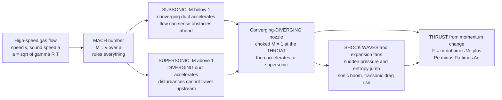

# 🚀 Compressible Flow and Propulsion

> [!abstract] TL;DR
> **Compressible flow** is what a gas does when it moves fast enough that its **density changes** — and it is the physics behind every jet engine, rocket, and supersonic aircraft. The one number that rules everything is the **Mach number** $M = v/a$, the flow speed over the local **speed of sound** $a = \sqrt{\gamma R T}$ — the speed at which a gas can send pressure "warnings" to itself. Below $M \approx 0.3$ the density barely moves and gas acts like an incompressible fluid; above it the behavior inverts. A **subsonic** flow ($M<1$) speeds up in a *narrowing* duct (Bernoulli), but a **supersonic** flow ($M>1$) speeds up in a *widening* one — so to push gas past the sound barrier you need a **converging-diverging (de Laval) nozzle**: the gas accelerates in the converging part, hits $M=1$ (**choked**) at the **throat**, then keeps accelerating to supersonic in the diverging part. Because a supersonic flow cannot feel an obstacle coming, pressure piles into a thin, violent **shock wave** — the sonic boom — across which pressure, temperature, and entropy jump irreversibly. **Propulsion** then falls out of Newton's third law: **thrust** $F = \dot m V_e + (P_e - P_a)A_e$ is the reaction to throwing mass rearward fast. **Air-breathing jets** (turbojet, turbofan, ramjet, scramjet) are Brayton-cycle engines that burn atmospheric oxygen; **rockets** carry their own oxidizer and so work in vacuum, scored by **specific impulse** and bound by the **rocket equation** $\Delta v = V_e \ln(m_0/m_f)$. This is the physics-rich frontier of mechanical and aerospace engineering — jets, rockets, gas turbines, and re-entry.

---

## Intuition

**Analogy:** At everyday speeds, air politely gets out of your way — walk across a room and the air ahead "hears" you coming (via tiny pressure signals travelling at the speed of sound) and flows smoothly aside. It behaves like an incompressible fluid, just like water. But push a body faster than sound, and the air **can no longer be warned in advance** — your pressure signals cannot outrun you. The gas has no time to move aside, so it piles up into a sudden, razor-thin wall of compression: a **shock wave**, heard on the ground as a **sonic boom**. And here is the twist that trips up everyone: at low speed you make a gas go faster by squeezing it through a *narrower* pipe, but once it is supersonic you must make the pipe *wider* to speed it up further. To break the sound barrier inside a nozzle you therefore need a passage that first **pinches in** and then **flares out** — the shape of every rocket bell.

That strange high-speed regime is not a curiosity — it is where thrust comes from. A **jet engine** and a **rocket** both accelerate gas to enormous speed and hurl it backward; by Newton's third law, the gas shoves the vehicle forward. Master the physics of shocks, nozzles, and the sound barrier, and you master how humanity flies supersonic, powers airliners, and leaves the planet.

---

## How It Works

### Core Mechanics

1. **When compressibility matters — the Mach number.** Density changes become significant once the flow speed is a fair fraction of the **speed of sound** $a = \sqrt{\gamma R T}$ (the speed pressure disturbances travel). The ratio $M = v/a$ sorts flow into regimes: **incompressible** ($M \lesssim 0.3$, density change under ~5 percent, use the sibling *Engineering_Fluid_Mechanics* Bernoulli picture), **subsonic** ($M<1$), **transonic** ($M \approx 1$, mixed pockets), **supersonic** ($M>1$), and **hypersonic** ($M>5$, where chemistry and dissociation join in).

2. **Stagnation vs static properties.** Bring the flow to rest adiabatically and its kinetic energy reappears as heat and pressure: the **stagnation (total) temperature** $T_0 = T\left(1 + \tfrac{\gamma-1}{2}M^2\right)$ and **stagnation pressure** $P_0 = P\left(1 + \tfrac{\gamma-1}{2}M^2\right)^{\gamma/(\gamma-1)}$. These are the fixed reservoir conditions inside a combustion chamber; the **static** values are what a particle actually feels as it flies. Re-entry heating is nothing but this $T_0$ made brutal at high $M$.

3. **The counterintuitive area-velocity relation.** From mass, momentum, and the sound speed together comes $\dfrac{dA}{A} = (M^2 - 1)\dfrac{dv}{v}$. For **subsonic** flow ($M<1$) the sign flips so a *converging* duct ($dA<0$) accelerates the gas — the familiar garden-hose intuition. For **supersonic** flow ($M>1$) a *diverging* duct ($dA>0$) accelerates it. At $M=1$ the area is stationary — a **minimum**, the throat.

4. **The converging-diverging (de Laval) nozzle.** To take gas from subsonic to supersonic you must therefore chain the two: a **converging** section accelerates subsonic flow up to exactly $M=1$ at the **throat** (the flow is now **choked** — for given chamber conditions the mass flow is maxed out and cannot be increased by lowering the exit pressure further), then a **diverging** section accelerates it on to supersonic. This bell shape is the heart of every rocket motor and jet exhaust. The area-Mach relation $A/A^*$ ties local area to local Mach number.

5. **Shock waves and expansion fans.** A supersonic flow cannot "sense" a disturbance ahead, so compressions pile into a **shock** — a jump thinner than a hair across which pressure, temperature, and density rise abruptly and **entropy increases** (irreversible). **Normal shocks** stand perpendicular and slam supersonic flow down to subsonic; **oblique shocks** turn the flow at an angle. Over-expand a nozzle and a shock jumps *inside* it. The opposite — smooth *acceleration* around a corner — is a **Prandtl-Meyer expansion fan**. These are what create the transonic **drag rise** ("sound barrier") and the sonic boom (see the sibling *External_Flow_and_Aerodynamics* and [[Shock_Waves_and_Supersonic_Flow]]).

6. **Thrust from the momentum equation.** Apply conservation of momentum to a control volume around the engine: **thrust** $F = \dot m\,V_e + (P_e - P_a)A_e$ — mass flow times exhaust velocity (**momentum thrust**) plus a **pressure thrust** term when the exit pressure $P_e$ differs from ambient $P_a$. Thrust is maximized when the nozzle is **perfectly expanded** ($P_e = P_a$). In vacuum ($P_a = 0$) more expansion always helps, which is why space nozzles have huge bells.

7. **Air-breathing jets vs rockets.** **Jets** (turbojet, **turbofan** — the airliner workhorse, ramjet, scramjet) run a **Brayton cycle** and grab oxygen from the atmosphere, so they carry only fuel — enormously efficient but useless above the air. **Rockets** carry their own **oxidizer**, so they work in vacuum and in space. Performance is scored by **specific impulse** $I_{sp} = V_e/g_0$ (seconds of thrust per unit weight of propellant) and, for a whole vehicle, by the **rocket equation** $\Delta v = V_e \ln(m_0/m_f)$ — the "tyranny" that makes reaching orbit so hard.

### Flow / Architecture



---

## Key Concepts

**Secondary (intuitive foundations).**
- Fast-moving gas is **springy**: it squashes and expands, unlike water. Whether that matters depends on how fast it moves compared to the **speed of sound**.
- **Subsonic** = slower than sound; **supersonic** = faster than sound; the **sound barrier** is the messy transition where drag suddenly spikes.
- A supersonic object **cannot warn the air ahead**, so pressure stacks up into a **shock wave** — heard as a **sonic boom**.
- **Thrust** is Newton's third law: throw gas backward hard and fast, and it pushes the vehicle forward. Jets breathe air; **rockets carry their own oxygen** and work in space.

**Undergraduate (quantitative core).**
- **Mach number** $M = v/a$, with $a = \sqrt{\gamma R T}$; regimes subsonic / transonic / supersonic / hypersonic.
- **Isentropic relations:** $\dfrac{T_0}{T} = 1 + \tfrac{\gamma-1}{2}M^2$, and $\dfrac{P_0}{P}$, $\dfrac{\rho_0}{\rho}$ follow as powers of it — the basis of the classic **isentropic-flow tables**.
- **Area-Mach relation** $\dfrac{A}{A^*} = \dfrac{1}{M}\left[\dfrac{2}{\gamma+1}\left(1 + \tfrac{\gamma-1}{2}M^2\right)\right]^{\frac{\gamma+1}{2(\gamma-1)}}$ — two Mach roots (one subsonic, one supersonic) for every area ratio above one.
- **Choked flow:** at the throat $M=1$; the **maximum mass flow** $\dot m = A^* P_0 \sqrt{\tfrac{\gamma}{R T_0}}\left(\tfrac{2}{\gamma+1}\right)^{\frac{\gamma+1}{2(\gamma-1)}}$ is set by upstream conditions alone.
- **Normal shock:** the **Rankine-Hugoniot** jumps relate downstream to upstream $M_1$; entropy rises, stagnation pressure drops, flow goes supersonic to subsonic.
- **Thrust** $F = \dot m V_e + (P_e - P_a)A_e$; **specific impulse** $I_{sp} = F/(\dot m\, g_0) = V_e/g_0$ at perfect expansion.

**Graduate (design & advanced behavior).**
- **Rocket equation** $\Delta v = V_e \ln(m_0/m_f) = g_0 I_{sp}\ln(m_0/m_f)$ — the logarithm is why staging exists and why payload fractions are brutal (the "tyranny of the rocket equation").
- **Nozzle off-design operation:** under-expanded vs over-expanded flow, **flow separation** and shock trains in over-expanded bells, altitude compensation (aerospike, dual-bell), and the summerfield separation criterion.
- **Oblique shocks and expansion fans:** the $\theta$-$\beta$-$M$ relation, weak vs strong shock solutions, shock-expansion theory for supersonic airfoils, and **wave drag** minimization (area rule, swept wings).
- **Fanno and Rayleigh flow:** friction-driven and heat-addition-driven compressible duct flow, both of which drive the Mach number toward 1 (thermal and frictional choking).
- **Air-breathing cycle analysis:** the Brayton cycle behind turbojets/turbofans, ram compression in ramjets, and supersonic-combustion **scramjets** where the flow never slows below $M=1$ — coupling gas dynamics to the sibling *Engineering_Thermodynamics* and *Power_and_Refrigeration_Cycles*.
- **Hypersonics and re-entry:** real-gas effects, dissociation, thin shock layers, and stagnation heating scaling with $T_0 \sim v^2$.

---

## Python Demo

```python
# Compressible flow & propulsion in one figure, using only numpy + matplotlib.
#
#   LEFT  panel -> the de LAVAL (converging-diverging) NOZZLE:
#       For isentropic flow, invert the AREA-MACH relation A/A* to get M(x)
#       along a bell whose area pinches to a throat (A/A*=1) then flares out.
#       Subsonic acceleration in the CONVERGING part, M=1 CHOKED at the THROAT,
#       SUPERSONIC acceleration in the DIVERGING part. Plot M, P/P0, T/T0.
#
#   RIGHT panel -> THRUST vs nozzle expansion:
#       Thrust  F = m_dot*Ve + (Pe - Pa)*Ae  from the momentum equation.
#       Sweep the exit area ratio Ae/A*; show that at SEA LEVEL thrust peaks at
#       PERFECT EXPANSION (Pe = Pa) then falls (over-expansion), while in VACUUM
#       more expansion always helps. Report specific impulse Isp = Ve/g0.
import numpy as np
import matplotlib.pyplot as plt

gamma = 1.20        # ratio of specific heats for hot rocket-exhaust gas
Rgas  = 350.0       # specific gas constant of the exhaust [J/(kg K)]
T0    = 3200.0      # chamber stagnation temperature [K]
P0    = 7.0e6       # chamber stagnation pressure [Pa]  (70 bar)
Astar = 0.010       # throat area A* [m^2]
g0    = 9.80665     # standard gravity [m/s^2]

# ---- area-Mach relation  A/A* = f(M) ----
def area_ratio(M):
    return (1.0/M) * ((2.0/(gamma+1.0)) *
                      (1.0 + 0.5*(gamma-1.0)*M*M))**((gamma+1.0)/(2.0*(gamma-1.0)))

def mach_from_area(AR, supersonic):
    """Invert A/A*=AR by bisection; pick the sub- or super-sonic root."""
    if AR <= 1.0:
        return 1.0
    lo, hi = (1.0, 60.0) if supersonic else (1e-4, 1.0)
    for _ in range(200):
        mid = 0.5*(lo+hi)
        f   = area_ratio(mid) - AR
        # A/A* increases with M when supersonic, decreases when subsonic
        if (f > 0) == supersonic:
            hi = mid
        else:
            lo = mid
    return 0.5*(lo+hi)

# ---- nozzle geometry: area ratio along the axis (throat at x=0) ----
x  = np.linspace(-1.0, 3.0, 400)
AR = np.where(x < 0.0,
              1.0 + 3.0*(x/1.0)**2,      # converging inlet: A/A* up to 4
              1.0 + 7.0*(x/3.0)**2)       # diverging bell:   A/A* up to 8

M   = np.array([mach_from_area(ar, supersonic=(xi > 0)) for xi, ar in zip(x, AR)])
Trat = 1.0/(1.0 + 0.5*(gamma-1.0)*M**2)          # T/T0
Prat = Trat**(gamma/(gamma-1.0))                 # P/P0

# ---- choked mass flow (set entirely by chamber + throat) ----
mdot = (Astar*P0*np.sqrt(gamma/(Rgas*T0)) *
        (2.0/(gamma+1.0))**((gamma+1.0)/(2.0*(gamma-1.0))))

# ---- thrust vs exit area ratio Ae/A* ----
eps   = np.linspace(2.0, 80.0, 300)          # expansion ratio Ae/A*
Me    = np.array([mach_from_area(e, supersonic=True) for e in eps])
Te    = T0/(1.0 + 0.5*(gamma-1.0)*Me**2)
Pe    = P0*(Te/T0)**(gamma/(gamma-1.0))
Ve    = Me*np.sqrt(gamma*Rgas*Te)            # exhaust velocity
Ae    = eps*Astar

def thrust(Pa):
    return mdot*Ve + (Pe - Pa)*Ae

Pa_sl = 101325.0                              # sea-level ambient
F_sl  = thrust(Pa_sl)
F_vac = thrust(0.0)

# perfect-expansion point at sea level: where Pe == Pa
i_opt = int(np.argmin(np.abs(Pe - Pa_sl)))
print("=== de Laval nozzle (isentropic) ===")
print(f"  choked mass flow m_dot      : {mdot:7.2f} kg/s")
print(f"  exit Mach at Ae/A*=40       : {mach_from_area(40, True):6.2f}")
print("=== Thrust & specific impulse ===")
print(f"  perfect expansion at sea level: Ae/A* = {eps[i_opt]:5.1f}  (Pe = Pa)")
print(f"  thrust there (sea level)      : {F_sl[i_opt]/1e3:7.1f} kN")
print(f"  Isp (vacuum, Ae/A*=40)        : {thrust(0.0)[np.argmin(np.abs(eps-40))]/(mdot*g0):7.1f} s")

# ----------------------------- plotting -----------------------------
fig, (axL, axR) = plt.subplots(1, 2, figsize=(14, 6))
fig.suptitle("Compressible Flow & Propulsion: the de Laval nozzle and the thrust it makes",
             fontsize=13, fontweight="bold")

# LEFT: Mach / pressure / temperature along the nozzle
axL.plot(x, M, color="#d62728", lw=2.3, label="Mach number  M")
axL.axhline(1.0, color="gray", ls=":", lw=1)
axL.axvline(0.0, color="k", ls="--", lw=1, alpha=0.6)
axL.text(0.02, 0.35, "THROAT\nM = 1 (choked)", fontsize=8, rotation=90, va="bottom")
axL.text(-0.9, 0.2, "converging\n(subsonic\naccelerates)", fontsize=8, color="#555")
axL.text(1.6, 0.5, "diverging\n(supersonic\naccelerates)", fontsize=8, color="#555")
axL.set_xlabel("axial position  x  (throat at 0)")
axL.set_ylabel("Mach number  M", color="#d62728")
axL.set_title("(a) NOZZLE: subsonic -> choked throat -> supersonic")
axL.grid(alpha=0.3)
axR2 = axL.twinx()
axR2.plot(x, Prat, color="#1f77b4", lw=2, label="P / P0")
axR2.plot(x, Trat, color="#2ca02c", lw=2, label="T / T0")
axR2.set_ylabel("static / stagnation ratio")
axR2.set_ylim(0, 1.05)
lines = axL.get_lines()[:1] + axR2.get_lines()
axL.legend(lines, [l.get_label() for l in lines], loc="center left", fontsize=8)

# RIGHT: thrust vs expansion ratio
axR.plot(eps, F_vac/1e3, color="#6a0dad", lw=2.4, label="vacuum  (Pa = 0)")
axR.plot(eps, F_sl/1e3,  color="#e76f51", lw=2.4, label="sea level  (Pa = 1 atm)")
axR.scatter([eps[i_opt]], [F_sl[i_opt]/1e3], color="k", zorder=5)
axR.annotate("perfect expansion\nPe = Pa  (max sea-level thrust)",
             xy=(eps[i_opt], F_sl[i_opt]/1e3),
             xytext=(eps[i_opt]+12, F_sl[i_opt]/1e3-40), fontsize=8,
             arrowprops=dict(arrowstyle="->"))
axR.axvspan(eps[i_opt], eps[-1], color="red", alpha=0.06)
axR.text(eps[i_opt]+2, F_sl[0]/1e3*0.55, "over-expanded\n(shock in bell,\nthrust falls)",
         fontsize=8, color="darkred")
axR.set_xlabel("nozzle expansion ratio  Ae / A*")
axR.set_ylabel("thrust  F  [kN]")
axR.set_title("(b) THRUST = m_dot*Ve + (Pe - Pa)*Ae")
axR.legend(loc="lower right", fontsize=9)
axR.grid(alpha=0.3)

plt.tight_layout(rect=[0, 0, 1, 0.95])
plt.show()
```

Running this prints the choked mass flow and the perfect-expansion point, then draws two panels. The **left panel** inverts the area-Mach relation to trace $M(x)$ through the bell: the flow accelerates while **subsonic in the converging** section, passes exactly through $M=1$ at the **throat** (where it is **choked**), and then keeps accelerating to **supersonic in the diverging** section — while pressure and temperature fall monotonically as stagnation enthalpy converts to kinetic energy. The **right panel** plots thrust versus expansion ratio: in **vacuum** more expansion always adds thrust (space nozzles are huge), but at **sea level** thrust peaks at **perfect expansion** ($P_e = P_a$) and then *falls* as the nozzle over-expands and a shock jumps inside the bell — exactly why launch vehicles use compromise sea-level nozzles and vacuum stages use enormous ones.

---

## Real-World Applications

> **Example — rocket engines and spaceflight.** Every chemical rocket is a **de Laval nozzle** bolted to a combustion chamber: propellant burns at high $T_0$ and $P_0$, chokes at the throat, and expands to hypersonic exit velocity in the bell, producing $F = \dot m V_e + (P_e - P_a)A_e$. First stages use short, sea-level-optimized bells; vacuum stages (and the SpaceX Merlin Vacuum or RL10) use giant high-expansion nozzles. The whole mission is then governed by the **rocket equation** $\Delta v = V_e \ln(m_0/m_f)$, which — because it is logarithmic — forces **multi-stage** vehicles to reach orbit (tie to the sibling *Engineering_Thermodynamics* and to [[Orbital_Mechanics_and_Celestial_Dynamics]]).

> **Example — jet engines and airliners.** A **turbofan** is a Brayton-cycle gas turbine wrapped in compressible-flow hardware: the inlet decelerates and compresses incoming air, the compressor and combustor raise its stagnation enthalpy, and the exhaust **nozzle** accelerates it rearward for thrust (with the big bypass fan doing most of the work efficiently). Every commercial and military jet lives here; **ramjets** and **scramjets** dispense with rotating machinery entirely, using shock and ram compression at $M>3$ and $M>5$ respectively (see the sibling *Pumps_Compressors_and_Turbines* for the turbomachinery inside).

> **Example — transonic and supersonic aircraft.** Airliners cruise at $M \approx 0.85$, deliberately just below the **transonic drag rise** where local supersonic pockets and shocks explode the drag; the **area rule** and swept wings were invented to tame it. Fighter jets and the retired **Concorde** pushed through the **sound barrier** into steady supersonic flight, managing oblique shocks and wave drag — the domain of [[Shock_Waves_and_Supersonic_Flow]] and the sibling *External_Flow_and_Aerodynamics*. Atmospheric **re-entry** vehicles ride a detached bow shock that converts orbital kinetic energy into the searing stagnation temperature their heat shields must survive.

---

## Common Pitfalls

- **Assuming gas is incompressible.** Below $M \approx 0.3$ that is fine (density changes under ~5 percent), but past it Bernoulli's incompressible form silently breaks and you must switch to compressible relations. Forgetting this is the number-one error carried over from liquid hydraulics.
- **Getting the area-velocity relation backwards.** It is genuinely counterintuitive: a **converging** duct accelerates **subsonic** flow but *decelerates* supersonic flow, and a **diverging** duct does the reverse. Only a **converging-diverging** passage can take a gas continuously from subsonic to supersonic — a single converging nozzle can never exceed $M=1$ at its exit.
- **Misunderstanding choking.** Once the throat reaches $M=1$, lowering the downstream pressure further **cannot increase the mass flow** — it is fixed by the upstream stagnation conditions and throat area. Engineers waste effort trying to "pull more flow" through an already-choked orifice.
- **Ignoring nozzle off-design behavior.** A fixed bell is only perfectly expanded at one altitude. **Over-expansion** (ambient pressure too high) drives a **shock inside the nozzle** with flow separation and thrust loss; **under-expansion** wastes expansion potential. This is why rockets change nozzles between stages.
- **Treating a shock as reversible.** A shock **increases entropy** and destroys **stagnation pressure** — it is irreversible. Designers who forget this over-predict inlet recovery and engine performance; the loss across a strong normal shock is severe.
- **Confusing static and stagnation properties.** The temperature that scorches a re-entry heat shield or sits inside a combustion chamber is the **stagnation** value $T_0$, not the static $T$ a moving particle feels. Mixing the two corrupts every nozzle and inlet calculation.
- **Forgetting the pressure-thrust term.** Thrust is *not* just $\dot m V_e$; the $(P_e - P_a)A_e$ term matters, and thrust is maximized at **perfect expansion** $P_e = P_a$ — not at maximum exit velocity.
- **Underestimating the rocket equation.** Because $\Delta v$ depends on the **logarithm** of the mass ratio, doubling your velocity change demands squaring the propellant fraction. This "tyranny" — not engineering timidity — is why single-stage-to-orbit is so hard and why high **specific impulse** is worth almost any complexity.

---

## Related Concepts

**Fluid Dynamics vault — the underlying gas dynamics (this note is the ME/propulsion application view)**
- [[Compressible_Flow_and_Gas_Dynamics]] — the physics-vault deep dive on Mach number, the speed of sound, isentropic relations, and the de Laval nozzle that this note applies to engines
- [[Shock_Waves_and_Supersonic_Flow]] — normal and oblique shocks, the Rankine-Hugoniot jumps, sonic boom, and wave drag behind the "sound barrier" and re-entry
- [[Lift_Drag_and_Aerodynamics]] — where compressibility meets the transonic drag rise and the aerodynamics of high-speed flight
- [[Aerodynamics_and_Aerospace_Applications]] — the aerospace context tying nozzles, wings, and vehicles together

**Physics vault — the foundations**
- [[Laws_of_Thermodynamics]] — gas dynamics is inseparable from thermodynamics; stagnation enthalpy, the isentropic assumption, and the Brayton cycle behind jets all live here
- [[Wave_Motion_and_Properties]] — the speed of sound is the speed of pressure (acoustic) waves, and a shock is the nonlinear steepening of those waves

**Astronomy vault — where rockets go**
- [[Orbital_Mechanics_and_Celestial_Dynamics]] — the rocket equation's $\Delta v$ is spent climbing out of gravity wells and changing orbits; propulsion is the enabler of spaceflight

---

## Review Questions

1. **(Secondary)** Why does an aircraft flying faster than sound create a shock wave and a sonic boom, while a slow aircraft does not? Explain in terms of the air being able (or unable) to "get out of the way" in advance.
2. **(Undergraduate)** A rocket nozzle must accelerate combustion gas from nearly at rest in the chamber to several times the speed of sound at the exit. Explain, using the area-velocity relation $dA/A = (M^2-1)\,dv/v$, why the passage must first converge and then diverge, and what physically happens at the throat.
3. **(Undergraduate)** A converging-only nozzle is fed from a high-pressure tank into a vacuum. What is the maximum Mach number achievable at its exit, and what happens to the mass flow if you keep lowering the downstream pressure? Define **choked flow** in your answer.
4. **(Undergraduate/Graduate)** Compare an air-breathing **turbofan** and a **rocket** for (a) where the oxidizer comes from, (b) where each can operate, and (c) roughly why the turbofan has far higher specific impulse in the atmosphere. Why does a rocket still win for reaching orbit?
5. **(Graduate/scenario)** You must design one rocket engine that flies from sea level to vacuum. A fixed nozzle is perfectly expanded at only one altitude. Explain the thrust penalties of **over-expansion** at liftoff versus **under-expansion** at altitude, and outline two design strategies (e.g., staging, altitude-compensating nozzles) to mitigate the trade-off. Use $F = \dot m V_e + (P_e - P_a)A_e$ in your reasoning.

---

## Sources

- J. D. Anderson — *Modern Compressible Flow: With Historical Perspective*, 3rd ed. (McGraw-Hill). The standard text on Mach number, isentropic flow, nozzles, and shocks.
- M. J. Zucrow & J. D. Hoffman — *Gas Dynamics* (Wiley). Rigorous two-volume treatment of compressible flow, nozzles, and wave phenomena.
- P. G. Hill & C. R. Peterson — *Mechanics and Thermodynamics of Propulsion*, 2nd ed. (Addison-Wesley). Ties compressible flow to air-breathing and rocket propulsion cycles.
- G. P. Sutton & O. Biblarz — *Rocket Propulsion Elements*, 9th ed. (Wiley). The definitive engineering reference on nozzles, thrust, specific impulse, and the rocket equation.
- A. H. Shapiro — *The Dynamics and Thermodynamics of Compressible Fluid Flow* (Ronald Press). Classic depth on Fanno/Rayleigh flow, normal and oblique shocks.

---

#mechanical-engineering #compressible-flow #shock-waves #nozzles #propulsion
