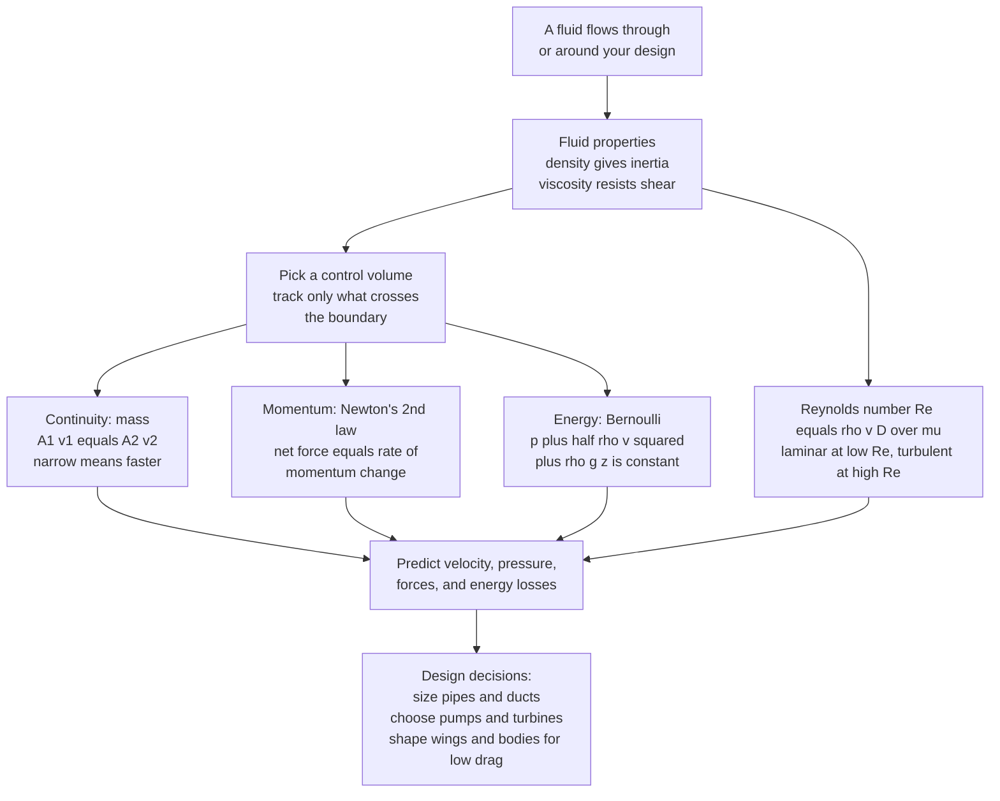

# 🌊 Engineering Fluid Mechanics: How Fluids Push, Flow, and Lose Energy

> [!abstract] TL;DR
> **Engineering fluid mechanics** is the practical craft of predicting how **fluids — liquids and gases — push, flow, and lose energy**, so an engineer can size a pipe, choose a pump, shape a car for low drag, or design a turbine. Fluids differ from solids in one decisive way: they **cannot resist a sideways (shear) push, so they flow**, and a whole different toolkit governs them. That toolkit is small and powerful. Two **material properties** dominate — **density** (inertia) and **viscosity** (the resistance to shearing, $\mu$). Three **conservation laws**, applied to a chosen chunk of space called a **control volume**, do almost all the work: **continuity** (mass in equals mass out, so $A_1 v_1 = A_2 v_2$ for incompressible flow — narrow means faster), **momentum** (net force equals rate of momentum change — the source of jet thrust and the forces on bends, blades, and vanes), and **energy / Bernoulli** ($p + \tfrac12\rho v^2 + \rho g z = \text{const}$ along a streamline — so where a fluid **speeds up, its pressure drops**, the principle behind wing lift, venturi meters, and carburetors). One dimensionless group, the **Reynolds number** $Re = \rho v D/\mu$, decides whether flow is smooth and orderly (**laminar**) or chaotic and mixing (**turbulent**), with the pipe transition near $Re \approx 2300$. Layer on the **no-slip** wall condition, **boundary layers**, and **dimensional analysis** for scale-model testing, and you command one of the four great pillars of mechanical engineering — the physics behind piping and HVAC, pumps and turbines, aerodynamics and drag, hydraulics, and propulsion. This note opens the **Fluid Mechanics & Turbomachinery** section as the ME-applied companion to the deeper [[Fluid_Dynamics_Overview|Fluid Dynamics]] vault.

## Intuition

**Analogy:** Fluids — liquids and gases — flow around and through **everything an engineer builds**: water in the pipes behind your walls, air rushing over a wing, oil squeezing through a hydraulic ram, coolant looping through an engine block, blood pulsing through a heart pump. Here is the one property that makes them their own subject. Push sideways on a block of steel and it barely budges — a solid *resists shear*. Push sideways on water and it simply *keeps moving*: a fluid has **no way to resist a shearing push, so it flows** and never stops as long as you keep pushing. That single fact — fluids yield continuously to shear — is why a separate toolkit governs them, and why "how does it flow?" is a different question from "will it hold?"

Engineering fluid mechanics is the practical answer to that question: **predict how a fluid pushes, flows, and loses energy** so you can make a real decision. How wide must this pipe be to carry the flow without the pump straining? Which pump, and how much power? What shape gives this car the least drag, this wing the most lift? How much thrust will this nozzle produce? Master the flow and you command a huge slice of the physical world — because almost nothing an engineer builds sits entirely dry and still.

---

## How It Works

### Core Mechanics

Engineering fluid mechanics runs a short, repeatable pipeline: pin down the fluid's **properties**, pick a **control volume**, apply the three **conservation laws** to it, and read off the **pressures, velocities, forces, and losses** you need to design hardware.

1. **Characterize the fluid — properties.** Two numbers matter most. **Density** $\rho$ sets a fluid's *inertia* — how hard it is to accelerate. **Viscosity** $\mu$ is the *defining* fluid property: the resistance to shearing, the internal friction that makes honey pour slower than water and that ultimately causes every real flow to lose energy. Add **compressibility** (liquids are nearly incompressible; gases compress, and it matters once speeds approach the speed of sound) and **surface tension** (thin films, droplets, capillaries), and the fluid is described.

2. **Handle the fluid at rest — statics.** Before anything moves, pressure already does work. In a still fluid, pressure grows with depth as $p = \rho g h$ (**hydrostatics**), which sets the force on a dam or a submerged gate and, via **Archimedes' buoyancy**, why ships float and why a manometer measures pressure. Fluid statics is the zero-velocity special case where the flow toolkit collapses to a single depth relation.

3. **Choose a control volume.** Rather than track every molecule, the engineer draws an imaginary box — a **control volume** — around the region of interest (a pump, a pipe bend, a jet) and asks only: what crosses the boundary? This bookkeeping device turns messy internal detail into simple in-versus-out balances and is the practical heart of the whole subject.

4. **Apply the three conservation laws.**
   - **Continuity (mass).** Mass cannot pile up in a steady flow, so mass-in equals mass-out. For an incompressible fluid this becomes $A_1 v_1 = A_2 v_2$: **squeeze the area and the fluid speeds up.** Halve the pipe's cross-section and the velocity doubles.
   - **Momentum (Newton's second law for a fluid).** The net force on the control volume equals the **rate of change of momentum** carried through it. This is how you compute **jet and rocket thrust**, the reaction force that whips a fire hose, and the load a flowing stream imposes on a pipe elbow or a turbine blade — the entire basis of turbomachinery and propulsion.
   - **Energy / Bernoulli.** Along a streamline of steady, inviscid, incompressible flow, $p + \tfrac12\rho v^2 + \rho g z = \text{const}$. Because the three terms trade off, **where the fluid speeds up its pressure drops** — the mechanism of wing lift, the venturi flowmeter, the carburetor, and the shower curtain that billows inward. In real ducts you add a **head-loss** term for viscous friction, turning Bernoulli into the practical energy equation used to size pumps.

5. **Classify the flow — the Reynolds number.** One dimensionless ratio governs the *character* of the flow: $Re = \rho v D / \mu$, the ratio of **inertial to viscous** forces. Low $Re$ means viscosity wins and the flow is **laminar** — smooth, ordered, layered. High $Re$ means inertia wins and the flow is **turbulent** — chaotic, mixing, full of eddies (most engineering flows). In a pipe the transition sits near $Re \approx 2300$. Whether flow is laminar or turbulent changes the friction, the mixing, the heat transfer, and the drag, so estimating $Re$ is almost always the *first* step.

6. **Account for viscosity at walls — no-slip and boundary layers.** Real fluid sticks to solid surfaces: the **no-slip condition** forces velocity to zero right at the wall. Viscous effects then concentrate in a thin **boundary layer** near the surface, while the flow farther out behaves almost inviscidly. That thin layer controls **skin-friction drag**, and when it **separates** from a curved surface it creates a low-pressure wake — pressure drag and stall. This is the bridge between the clean **ideal (inviscid)** picture and messy **real (viscous)** flow.

7. **Scale it — dimensional analysis and similitude.** Because the governing physics collapses onto dimensionless groups ($Re$, Mach, Froude), a small **scale model** in a wind tunnel or towing tank reproduces the full-size flow *if* those numbers match — **dynamic similarity**. This is how a car, an aircraft, or a dam spillway is validated before it is ever built full size, and where analytic methods run out, **computational fluid dynamics (CFD)** solves the equations numerically.

### Flow / Architecture



---

## Key Concepts

### Secondary Level

- **A fluid flows; a solid holds its shape.** Push a solid sideways and it resists; push a fluid sideways and it keeps moving. Both liquids and gases are fluids and follow the same rules.
- **Thick versus thin.** Honey is "thick," water is "thin." That stickiness is **viscosity** — the internal friction of a fluid — and it decides how easily a fluid pours and flows.
- **Squeeze it and it speeds up.** Put your thumb over a hose end and the water shoots out faster. Narrowing the opening forces the same amount of water through a smaller area, so it must move quicker (**continuity**).
- **Fast flow, low pressure.** Where a fluid moves faster, it pushes *less* sideways — the **Bernoulli** idea that lets a wing lift a plane and a spray gun draw up paint.
- **Two moods of flow.** Slow and smooth is **laminar** (syrup off a spoon); fast and churning is **turbulent** (a rushing river). The **Reynolds number** decides which you get.

### Undergraduate Level

- **Fluid statics.** Pressure rises with depth, $p = p_0 + \rho g h$; the resultant force and its line of action on a submerged plane surface (a gate, a dam) follow from integrating this. **Buoyancy** equals the weight of displaced fluid (Archimedes).
- **Continuity (incompressible).** $A_1 v_1 = A_2 v_2$, or more generally $\dot{m} = \rho A v = \text{const}$ — the mass balance on a control volume.
- **Bernoulli's equation.** $p + \tfrac12\rho v^2 + \rho g z = \text{const}$ along a streamline, valid for **steady, incompressible, inviscid** flow with no shaft work. Its assumptions are exactly what make it easy to misapply.
- **The engineering energy equation.** Bernoulli extended with pump head $h_p$, turbine head $h_t$, and friction **head loss** $h_L$: $\tfrac{p_1}{\rho g} + \tfrac{v_1^2}{2g} + z_1 + h_p = \tfrac{p_2}{\rho g} + \tfrac{v_2^2}{2g} + z_2 + h_t + h_L$ — the workhorse for sizing pumps and piping.
- **Linear momentum equation.** $\sum \vec{F} = \dot{m}(\vec{v}_{out} - \vec{v}_{in})$ on a control volume gives the force on a pipe bend, a deflected jet on a vane, and the thrust of a nozzle or rocket.
- **The Reynolds number.** $Re = \rho v D/\mu = vD/\nu$ (with kinematic viscosity $\nu = \mu/\rho$); pipe flow is laminar for $Re \lesssim 2300$, transitional to $\sim 4000$, turbulent above.
- **Pipe friction.** Head loss $h_L = f\,\tfrac{L}{D}\,\tfrac{v^2}{2g}$; the friction factor $f$ comes from $f = 64/Re$ (laminar) or the Colebrook/Moody chart (turbulent, roughness-dependent).
- **Dimensional analysis.** The **Buckingham Pi theorem** reduces variables to dimensionless groups; matching $Re$ (and Mach, Froude where relevant) gives **dynamic similarity** for model testing.

### Graduate Level

- **From control volume to differential equations.** The integral balances tighten into the **continuity** and **Navier-Stokes** momentum PDEs; the ME view emphasizes their *reduced* forms — fully developed pipe flow, boundary-layer equations, one-dimensional compressible flow — where closed-form or correlation-based engineering answers exist (the physics-first derivation lives in the [[Fluid_Dynamics_Overview|Fluid Dynamics]] vault).
- **Boundary-layer theory.** Prandtl's insight: at high $Re$, viscosity is confined to a layer of thickness $\delta \sim L/\sqrt{Re}$; the **Blasius** solution for a flat plate, momentum-integral methods, and the **adverse-pressure-gradient separation** that sets pressure drag and stall.
- **Internal versus external flow.** Internal (pipe/duct) flow is dominated by friction head loss and the Moody chart; external flow (bodies in a stream) is characterized by **drag and lift coefficients** $C_D, C_L$ and the **drag crisis** where a turbulent boundary layer delays separation and cuts drag (the golf-ball dimple effect).
- **Turbomachinery — the Euler turbine equation.** Applying angular-momentum conservation to a rotor gives the work per unit mass $w = U_2 v_{\theta 2} - U_1 v_{\theta 1}$, the design basis for pumps, fans, compressors, and turbines, organized by **specific speed** and velocity triangles.
- **Compressible flow.** Once the **Mach number** $Ma = v/c$ approaches 1, density varies strongly; isentropic-flow relations, converging-diverging (de Laval) **nozzles**, choking, and **normal/oblique shocks** govern jet and rocket propulsion.
- **Non-Newtonian and multiphase reality.** Many engineering fluids (polymer melts, slurries, blood, drilling muds) have shear-dependent viscosity; cavitation, two-phase flow, and free surfaces break the simple single-phase Bernoulli picture.
- **Loss, irreversibility, and pump/system matching.** Head loss is entropy generation; a real design finds the operating point where the **pump curve** intersects the **system resistance curve**, avoiding cavitation (NPSH) and surge.

---

## Python Demo

```python
# Two pillars of engineering fluid mechanics in one figure:
#
#   (a) BERNOULLI + CONTINUITY through a VENTURI (a converging-diverging duct).
#       Continuity  A1*v1 = A2*v2  ->  the fluid SPEEDS UP where the duct narrows.
#       Bernoulli   p + 0.5*rho*v^2 = const  ->  where it speeds up, PRESSURE DROPS.
#       This is the venturi meter / carburetor / wing-suction principle.
#
#   (b) The REYNOLDS NUMBER  Re = rho*v*D/mu  deciding LAMINAR vs TURBULENT flow,
#       with the ~2300 pipe transition marked, plus the two velocity profiles.
#
# Requires: numpy, matplotlib
import numpy as np
import matplotlib.pyplot as plt

# ---------------------------------------------------------------------
# (a) VENTURI: continuity + Bernoulli along a converging-diverging pipe
# ---------------------------------------------------------------------
rho = 1000.0                 # water density        [kg/m^3]
mu  = 1.0e-3                 # water viscosity      [Pa*s]
p0  = 101325.0              # inlet pressure       [Pa]
v0  = 2.0                   # inlet velocity       [m/s]
D0  = 0.10                  # inlet diameter       [m]
Dt  = 0.05                  # throat diameter      [m]

x   = np.linspace(0.0, 1.0, 400)                       # position along the duct [m]
# Smooth diameter: a Gaussian "pinch" from D0 down to Dt at the throat (x = 0.5)
D   = D0 - (D0 - Dt) * np.exp(-((x - 0.5) / 0.12) ** 2)
A   = np.pi * (D / 2.0) ** 2                            # cross-sectional area [m^2]
A0  = np.pi * (D0 / 2.0) ** 2
Qflow = v0 * A0                                         # volumetric flow rate [m^3/s]

v   = Qflow / A                                         # continuity:  A*v = const
p   = p0 + 0.5 * rho * (v0 ** 2 - v ** 2)               # Bernoulli (horizontal, inviscid)

i_throat = int(np.argmin(D))
print("=== (a) Venturi: continuity + Bernoulli ===")
print(f"  inlet : D = {D0*1000:5.1f} mm, v = {v[0]:5.2f} m/s, p = {p[0]/1000:7.1f} kPa")
print(f"  throat: D = {D[i_throat]*1000:5.1f} mm, v = {v[i_throat]:5.2f} m/s, "
      f"p = {p[i_throat]/1000:7.1f} kPa   <-- fastest & LOWEST pressure")
print(f"  area ratio A0/At = {A0/A[i_throat]:.2f}  ->  velocity ratio = {v[i_throat]/v0:.2f}")

# ---------------------------------------------------------------------
# (b) REYNOLDS NUMBER regimes  Re = rho*v*D/mu   (water in a 50 mm pipe)
# ---------------------------------------------------------------------
D_pipe = 0.05                                           # pipe diameter [m]
v_rng  = np.linspace(1e-3, 3.0, 500)                    # sweep of mean velocities
Re     = rho * v_rng * D_pipe / mu
Re_lam, Re_turb = 2300.0, 4000.0
v_lam  = Re_lam  * mu / (rho * D_pipe)                  # velocity at Re = 2300
v_turb = Re_turb * mu / (rho * D_pipe)                  # velocity at Re = 4000
print("\n=== (b) Reynolds number:  Re = rho v D / mu  (D = 50 mm water) ===")
print(f"  laminar -> transition at v = {v_lam*100:5.2f} cm/s  (Re = 2300)")
print(f"  fully turbulent above   v = {v_turb*100:5.2f} cm/s  (Re = 4000)")

# Velocity profiles (normalized): laminar parabola vs turbulent 1/7-power law
r      = np.linspace(-1.0, 1.0, 200)                    # r / R
u_lam  = 1.0 - r ** 2                                   # Hagen-Poiseuille parabola
u_turb = (1.0 - np.abs(r)) ** (1.0 / 7.0)               # turbulent 1/7th-power, flatter

# ----------------------------- plotting ------------------------------
fig, ax = plt.subplots(2, 2, figsize=(13, 9))
fig.suptitle("Engineering Fluid Mechanics: Bernoulli's Venturi and the Reynolds Number",
             fontsize=15, fontweight="bold")

# Panel A: the venturi geometry (duct walls)
axA = ax[0, 0]
axA.fill_between(x,  D / 2 * 1000,  (D0 / 2 + 0.02) * 1000, color="#b0b0b0", alpha=0.6)
axA.fill_between(x, -D / 2 * 1000, -(D0 / 2 + 0.02) * 1000, color="#b0b0b0", alpha=0.6)
axA.plot(x,  D / 2 * 1000, color="k", lw=2)
axA.plot(x, -D / 2 * 1000, color="k", lw=2)
axA.annotate("throat\n(narrowest)", xy=(0.5, D[i_throat] / 2 * 1000),
             xytext=(0.5, 42), ha="center", fontsize=8,
             arrowprops=dict(arrowstyle="->", color="#d62728"))
axA.arrow(0.02, 0, 0.12, 0, head_width=4, head_length=0.03, fc="#1f77b4", ec="#1f77b4")
axA.text(0.02, 8, "flow", color="#1f77b4", fontsize=9)
axA.set_xlabel("position along duct  x  [m]")
axA.set_ylabel("radius  [mm]")
axA.set_title("A. Venturi geometry: the duct pinches at the throat")
axA.set_ylim(-70, 70)

# Panel B: velocity and pressure along the venturi (twin axes)
axB = ax[0, 1]
l1, = axB.plot(x, v, color="#1f77b4", lw=2.5, label="velocity  v(x)")
axB.set_xlabel("position along duct  x  [m]")
axB.set_ylabel("velocity  v  [m/s]", color="#1f77b4")
axB.tick_params(axis="y", labelcolor="#1f77b4")
axB2 = axB.twinx()
l2, = axB2.plot(x, p / 1000.0, color="#d62728", lw=2.5, label="pressure  p(x)")
axB2.set_ylabel("pressure  p  [kPa]", color="#d62728")
axB2.tick_params(axis="y", labelcolor="#d62728")
axB.axvline(0.5, ls="--", color="gray", lw=1)
axB.set_title("B. Speed UP at the throat  ->  pressure DROPS (Bernoulli)")
axB.legend(handles=[l1, l2], loc="center right", fontsize=8)

# Panel C: Reynolds number vs velocity with the transition band
axC = ax[1, 0]
axC.semilogy(v_rng * 100, Re, color="#2ca02c", lw=2.5)
axC.axhspan(Re_lam, Re_turb, color="gray", alpha=0.25)
axC.axhline(Re_lam, ls="--", color="k", lw=1)
axC.text(v_rng[-1] * 100, Re_lam, "  Re = 2300", va="bottom", ha="right", fontsize=8)
axC.text(2.0, 4e2, "LAMINAR\n(smooth)", color="#1f77b4", fontsize=10, ha="center")
axC.text(2.0, 3e4, "TURBULENT\n(chaotic)", color="#d62728", fontsize=10, ha="center")
axC.set_xlabel("mean velocity  [cm/s]   (water, D = 50 mm)")
axC.set_ylabel("Reynolds number  Re  (log)")
axC.set_title("C. Re = rho v D / mu  sets the regime\ntransition near Re ~ 2300")

# Panel D: laminar vs turbulent pipe velocity profiles
axD = ax[1, 1]
axD.plot(u_lam,  r, color="#1f77b4", lw=2.5, label="laminar (parabolic)")
axD.plot(u_turb, r, color="#d62728", lw=2.5, label="turbulent (1/7-power, flatter)")
axD.fill_betweenx(r, 0, u_lam,  color="#1f77b4", alpha=0.10)
axD.fill_betweenx(r, 0, u_turb, color="#d62728", alpha=0.10)
axD.axhline(1.0,  color="k", lw=3)
axD.axhline(-1.0, color="k", lw=3)
axD.text(0.05, 1.05, "no-slip at wall (v = 0)", fontsize=8)
axD.set_xlabel("velocity  u / u_max")
axD.set_ylabel("radius  r / R")
axD.set_title("D. Same pipe, two profiles\nturbulent is fuller due to mixing")
axD.legend(loc="lower center", fontsize=8)

plt.tight_layout(rect=[0, 0, 1, 0.95])
plt.show()
```

Running this prints the venturi and Reynolds numbers and draws four panels. Panels **A** and **B** are the **Bernoulli venturi**: as the duct pinches to the throat, **continuity** forces the fluid to speed up (area ratio $\sim 4$ gives a velocity ratio of $\sim 4$), and **Bernoulli** shows the pressure diving to its minimum exactly where the speed peaks — the physics of the venturi flowmeter, the carburetor, and the suction on a wing's upper surface. Panels **C** and **D** are the **Reynolds-number regimes**: $Re = \rho v D/\mu$ climbing through the $\sim 2300$ transition band as velocity rises, and the two signature velocity profiles — the smooth **laminar** parabola versus the flatter, mixing-fed **turbulent** profile — both pinned to zero at the wall by the **no-slip** condition.

---

## Real-World Applications

> **Example:** A **centrifugal pump feeding a building's water system** is engineering fluid mechanics end to end. The pipe diameters are sized from **continuity** ($\dot m = \rho A v$) to keep velocities reasonable; the pump's required **head** is found from the engineering energy equation, adding up the static lift ($\rho g z$), the velocity change, and — usually the dominant term — the **friction head loss** $h_L = f\,\tfrac{L}{D}\,\tfrac{v^2}{2g}$, where the friction factor $f$ comes from the pipe's **Reynolds number** and roughness via the Moody chart. The impeller itself is turbomachinery designed with the **Euler turbine equation** (angular-momentum conservation on the rotor), and the engineer checks **NPSH** to keep the inlet pressure above the vapor pressure so the flow does not **cavitate**. The chosen pump is the one whose curve intersects the **system resistance curve** at the required flow.

- **Piping, HVAC, and water systems.** Sizing pipes and ducts, computing pressure drop and fan/pump power, and balancing networks — pure continuity plus the friction-loss energy equation.
- **Pumps, compressors, and turbines (turbomachinery).** Hydro, steam, and gas turbines extract shaft work from flow; pumps and compressors add it. All are momentum/angular-momentum machines analyzed with control volumes.
- **Aerodynamics and vehicle drag.** Wing lift (Bernoulli/circulation), car and truck drag (boundary-layer separation), and the wind-tunnel testing that matches $Re$ for dynamic similarity.
- **Hydraulics and pneumatics.** Hydraulic rams, brakes, and jacks transmit force through nearly incompressible oil (Pascal's principle); pneumatic systems use compressible air.
- **Propulsion.** Jet engines, rockets, and propellers all produce **thrust** as a momentum-change reaction — the momentum equation applied to a high-speed exhaust stream.
- **Biomedical and process flows.** Blood flow, dialysis, ventilators, and chemical-reactor mixing all reduce to the same conservation laws and Reynolds-number scaling.

---

## Common Pitfalls

- **Misapplying Bernoulli by ignoring its assumptions.** Bernoulli holds only for **steady, incompressible, inviscid** flow **along a single streamline** with no shaft work. Using it across a pump, through a region of strong friction, between two *different* streamlines, or in high-speed compressible flow gives wrong answers. When friction matters, switch to the **engineering energy equation** with a head-loss term; when speed is high, account for compressibility.
- **Treating viscosity as negligible because it "looks small."** Air and water have tiny viscosities, but viscosity concentrates in the **boundary layer** and there it dictates **drag**, **separation**, and pump/pipe losses. Assuming inviscid flow everywhere leads to **d'Alembert's paradox** — the false prediction of zero drag on a body.
- **Forgetting the no-slip condition.** Intuition says a "slippery" fluid slides along a wall; in reality the fluid velocity is exactly **zero at the surface**. The whole velocity gradient — and therefore all wall shear and friction — lives in the thin layer created by no-slip.
- **Skipping the Reynolds-number check.** The correct equations, the friction factor, the heat-transfer correlation, and even whether a stroke of a swimmer's arm does anything all depend on $Re$. Estimate $Re$ *first*; it tells you whether you are in the laminar or turbulent world, which changes everything downstream.
- **Confusing "faster means higher pressure."** Bernoulli says the opposite: **faster flow means lower pressure**. Many intuitions (a wing pushing air, a narrowing hose "building pressure") get the sign backward. The kinetic-energy term rises, so the pressure term must fall.
- **Assuming incompressibility at high speed.** Liquids and low-speed air ($Ma < 0.3$) are safely incompressible, but once gas speeds approach the speed of sound, density changes dominate and shock waves appear — a completely different (compressible-flow) toolkit.
- **Testing a scale model without matching dimensionless numbers.** A wind-tunnel or towing-tank result is only valid if $Re$ (and Mach or Froude, as relevant) match the full-scale flow — **dynamic similarity**. A geometrically similar model at the wrong $Re$ can give misleading forces.
- **Neglecting minor losses and cavitation.** Bends, valves, fittings, and sudden expansions add "minor" losses that are often *not* minor; and dropping the local pressure below the vapor pressure causes **cavitation** that erodes pumps and propellers.

---

## Related Concepts

**The physics-of-flow deep dive (Fluid Dynamics vault) — this note is the ME-applied companion**
- [[Fluid_Dynamics_Overview]] — the parent survey of flow physics; where Navier-Stokes, turbulence, and dimensionless numbers are developed in full
- [[Bernoulli_and_Energy_in_Flows]] — the streamline energy equation and its assumptions, derived from first principles
- [[Conservation_Laws_and_Control_Volumes]] — the mass/momentum/energy bookkeeping and the Reynolds transport theorem behind the control-volume method
- [[Viscosity_and_Stress_in_Fluids]] — viscosity as the defining fluid property, Newtonian stress, and shear
- [[Fluid_Statics_and_Buoyancy]] — hydrostatic pressure, forces on submerged surfaces, and Archimedes
- [[Dimensional_Analysis_and_Similarity]] — the Buckingham Pi machinery and dynamic similarity for model testing
- [[The_Navier_Stokes_Equations]] — the differential momentum equations that the engineering forms reduce from
- [[The_Boundary_Layer]] — Prandtl's thin viscous layer that controls drag and separation
- [[Flow_Separation_and_Drag_Crisis]] — how the boundary layer detaches to set pressure drag, stall, and the dimpled-ball effect
- [[Transition_to_Turbulence]] — the laminar-to-turbulent change the Reynolds number predicts
- [[Turbulence_Fundamentals]] — the chaotic, mixing regime most engineering flows live in
- [[Lift_Drag_and_Aerodynamics]] — lift, drag coefficients, and airfoil behavior
- [[Compressible_Flow_and_Gas_Dynamics]] — the high-Mach regime of nozzles, shocks, and propulsion

**Physics vault foundations**
- [[Fluid_Statics_and_Properties]] — the physics-level treatment of pressure, buoyancy, and fluid properties
- [[Viscous_Fluids_and_Navier_Stokes]] — Navier-Stokes, Stokes flow, and boundary layers at survey level
- [[Newtons_Laws_and_Kinematics]] — the momentum principle that the fluid momentum equation applies to a control volume

**The parent discipline**
- [[Mechanical_Engineering_Overview]] — the ME hub; fluid mechanics and turbomachinery is one of its four great pillars, uniquely needing both the Newtonian and thermodynamic foundations

---

## Review Questions

**Secondary**
1. Put your thumb partly over the end of a running garden hose and the water sprays out faster and farther. Using the ideas of "the same water still has to get through" (continuity) and "faster flow has lower pressure" (Bernoulli), explain what happened. Why can a fluid do this while a solid rod cannot?

**Undergraduate**
2. Water flows steadily through a horizontal venturi whose inlet diameter is 100 mm and throat diameter is 50 mm, entering at 2 m/s. (a) Use continuity to find the throat velocity. (b) Use Bernoulli to state whether the pressure at the throat is higher or lower than at the inlet, and why. (c) The same pipe carries the water at a mean velocity of 3 cm/s; compute the Reynolds number ($\rho = 1000$ kg/m³, $\mu = 10^{-3}$ Pa·s) and state whether the flow is laminar or turbulent. (d) Name two Bernoulli assumptions that would be violated if there were a pump in this line.

**Graduate**
3. An engineer sizes a long pipeline and finds that friction head loss, not the elevation change, dominates the required pump head. (a) Explain why the friction factor $f$ depends on the Reynolds number and pipe roughness, and how the flow regime changes $f$'s behavior (laminar $f = 64/Re$ versus the Moody-chart turbulent branch). (b) The pipe is then tested at 1/5 scale in a water loop; what dimensionless number must be matched for dynamic similarity, and what practical difficulty arises in matching it? (c) Contrast the internal-flow loss picture here with the external-flow **drag crisis**, in which making the boundary layer *turbulent* actually *reduces* drag — why does turbulence hurt in one case and help in the other?

---

## Sources

- F. M. White — *Fluid Mechanics*, 8th ed. (McGraw-Hill, 2016)
- Y. A. Cengel & J. M. Cimbala — *Fluid Mechanics: Fundamentals and Applications*, 4th ed. (McGraw-Hill, 2018)
- B. R. Munson, D. F. Young, T. H. Okiishi & W. W. Huebsch — *Fundamentals of Fluid Mechanics*, 8th ed. (Wiley, 2016)
- P. J. Pritchard & J. W. Mitchell (Fox & McDonald) — *Introduction to Fluid Mechanics*, 9th ed. (Wiley, 2015)
- R. W. Fox, A. T. McDonald & J. W. Mitchell — *Fox and McDonald's Introduction to Fluid Mechanics*, 10th ed. (Wiley, 2020)

---

#mechanical-engineering #fluid-mechanics #bernoulli #reynolds-number #viscosity
