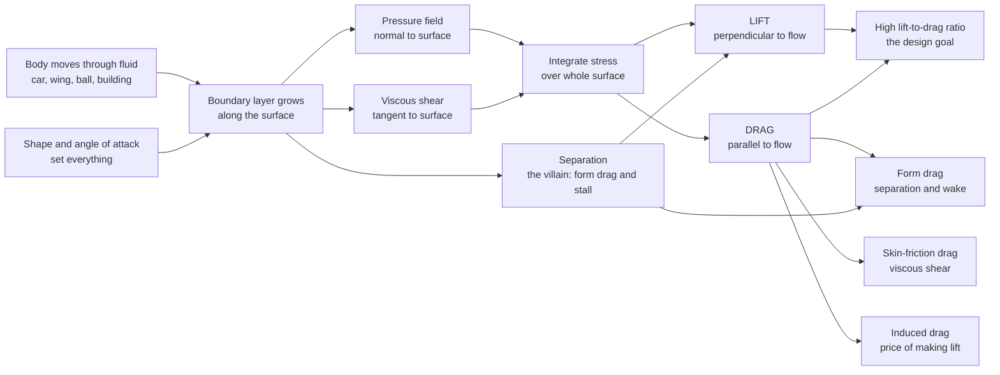

# ✈️ External Flow and Aerodynamics

> [!abstract] TL;DR
> **External flow** is the flow of a fluid *over* an immersed body — a wing, a car, a ball, a building — as opposed to internal pipe flow. A thin **boundary layer** grows along the surface, and the resulting pressure and shear-stress fields integrate to two net forces: **lift** (perpendicular to the oncoming flow) and **drag** (parallel to it). Drag splits into **form/pressure drag** (from boundary-layer **separation** and the low-pressure wake behind blunt bodies), **skin-friction drag** (viscous shear, dominant on streamlined shapes), and **induced drag** (the unavoidable byproduct of making lift). The drag force $F_D = \tfrac12\rho v^2 C_D A$ grows with velocity **squared**, which is why doubling your speed quadruples drag and highway fuel economy suffers. The **drag coefficient** hides a famous surprise — the **drag crisis**, where tripping the boundary layer *turbulent* actually *reduces* drag (why golf balls have dimples). A wing generates lift from the pressure difference set up by **circulation**, rising linearly with **angle of attack** until the flow separates and the wing **stalls**. Engineering all of this — high lift-to-drag ratios, low drag, delayed stall — is the craft of aerodynamics.

---

## Intuition

**Analogy:** Stick your hand flat out of a car window at highway speed and you feel two forces at once. There is a steady **push backward** — that is **drag**, the fluid resisting your motion. Now tilt your palm's leading edge up a few degrees and your hand is suddenly shoved **upward** as well — that is **lift**, born the instant you start deflecting air downward. Tilt too far and the smooth upward push dissolves into a juddering, buffeting mess as the airflow tears away from the back of your hand: you have just **stalled**.

That is the whole of aerodynamics in one gesture. Every object that moves through air or water — a 400-tonne airliner holding its passengers aloft, a car burning fuel to shove air aside, a golf ball whose dimples let it fly farther, a bridge deck fighting a gale — is engineering these same two forces. Getting the **shape** and the **angle** right is the difference between soaring and stalling, between slipping through the air and plowing through it.

---

## How It Works

### Core Mechanics

1. **Two forces from one stress field.** As a body moves through a fluid, pressure pushes inward (normal to the surface) everywhere and viscous shear drags along it (tangent to the surface). Integrate that combined stress over the entire wetted surface and the resultant resolves into two components: **lift** $L$ perpendicular to the free stream and **drag** $D$ parallel to it.

2. **Non-dimensionalize with the drag/lift coefficient.** We scale both forces by the **dynamic pressure** $q = \tfrac12\rho v^2$ and a reference area $A$:
   $$C_D = \frac{D}{\tfrac12\rho v^2 A}, \qquad C_L = \frac{L}{\tfrac12\rho v^2 A}.$$
   The coefficients depend on *shape*, *angle of attack*, and the dimensionless **Reynolds** and **Mach** numbers — not on size or speed directly. That is exactly why a small wind-tunnel model or a CFD run at matched Reynolds number can stand in for the full-scale vehicle.

3. **Drag has three physical parts.**
   - **Skin-friction (viscous) drag** — the tangential shear the boundary layer exerts. It dominates for slender, **streamlined** shapes (a flat plate aligned with the flow, an airfoil at low angle).
   - **Form (pressure) drag** — when the boundary layer **separates**, a broad low-pressure **wake** opens behind the body and the front-to-back pressure imbalance pushes back hard. It dominates for **blunt/bluff** shapes (a cylinder, a truck, a sphere).
   - **Induced drag** — the price of lift. A finite wing sheds **wingtip vortices** that tilt the effective flow, adding a rearward force component $\propto C_L^2$.

4. **Force grows with the square of speed.** Because $F_D = \tfrac12\rho v^2 C_D A$, doubling $v$ quadruples drag — and the *power* to overcome it, $P = F_D v \propto v^3$, grows even faster. This single fact governs top speed, cruise fuel burn, and why highway driving devours far more energy per mile than city driving.

5. **The drag crisis — turbulence that helps.** For a smooth sphere or cylinder, $C_D$ *drops sharply* near a critical Reynolds number when the boundary layer transitions to **turbulent**. A turbulent boundary layer carries more momentum near the wall, clings to the surface longer, **delays separation**, and shrinks the wake. Roughening the surface (a golf ball's **dimples**, seams on a cricket ball) deliberately trips this transition to cut drag.

6. **Lift and the airfoil.** A wing sets up **circulation** around itself; the sharp trailing edge fixes its strength through the **Kutta condition**, giving faster, lower-pressure flow over the top and higher pressure below. The lift coefficient $C_L$ rises almost linearly with **angle of attack** until the adverse pressure gradient on the upper surface forces the boundary layer to **separate** — lift collapses and the wing **stalls**. Efficiency is measured by the **lift-to-drag ratio** $L/D$, and the trade-off curve of $C_L$ against $C_D$ is the **drag polar**.

### Flow / Architecture



---

## Key Concepts

**Secondary (high-school intuition)**
- **Drag** is air (or water) pushing back on anything that moves through it; **lift** is a sideways/upward push you can create by tilting a surface into the flow.
- Going faster costs a *lot* more than proportionally — drag grows with speed squared — so highway speeds burn fuel fast.
- A wing works by pushing air down; the air pushes the wing up (Newton's third law). The "equal transit time" story you may have heard is a myth.
- Golf balls have **dimples** because a slightly rough surface can actually make a ball fly *farther*.

**Undergraduate (engineering core)**
- $C_D$ and $C_L$ definitions; **dynamic pressure** $q=\tfrac12\rho v^2$; reference area conventions (frontal vs planform).
- Drag decomposition: **skin-friction vs form/pressure vs induced** drag; streamlined vs bluff bodies.
- **Boundary-layer separation** under an adverse pressure gradient; the **wake**; the **drag crisis** and the sphere/cylinder $C_D$-vs-$Re$ curve.
- **Airfoils**: $C_L$-vs-$\alpha$ curve, lift-curve slope ($\approx 2\pi$ per radian from thin-airfoil theory), **stall**, $C_{L,\max}$, the **drag polar**, and the **lift-to-drag ratio** $L/D$.
- **Reynolds number** dependence; wind-tunnel similarity; streamlining (teardrop shapes).

**Graduate (advanced/analytical)**
- **Circulation** and the **Kutta–Joukowski theorem** $L' = \rho U \Gamma$; the **Kutta condition** fixing $\Gamma$; potential-flow airfoil theory and conformal mapping.
- **Prandtl lifting-line theory**: induced drag $C_{D,i} = C_L^2/(\pi e\,AR)$, span efficiency $e$, elliptical lift distribution, and finite-wing effects.
- **Boundary-layer equations**, transition prediction, and turbulence modeling (RANS/LES) for separation and $C_D$.
- **Compressibility**: Prandtl–Glauert corrections, critical Mach number, **wave drag**, and drag divergence near Mach 1.
- High-fidelity **CFD** vs wind-tunnel testing; drag-reduction strategies (laminar-flow control, riblets, vortex generators, active flow control).

---

## Python Demo

```python
# Drag, lift, and the airfoil polar.
# (A) Sphere Cd vs Reynolds number -> the DRAG CRISIS (why golf balls have dimples),
#     plus drag force / power growing with v^2 / v^3 (why speed costs energy).
# (B) Airfoil lift coefficient vs angle of attack -> linear rise then STALL,
#     plus the lift-to-drag ratio (aerodynamic efficiency).
import numpy as np
import matplotlib.pyplot as plt

# ============================================================
# PART A - DRAG: the Cd(Re) curve and the DRAG CRISIS
# ============================================================
# Morrison's empirical correlation for a smooth sphere's drag coefficient
# (valid to Re ~ 1e6). It reproduces the sudden "drag crisis": Cd plunges
# near Re ~ 3e5 when the boundary layer trips to turbulence, clings to the
# surface longer, delays separation, and shrinks the low-pressure wake.
def sphere_cd(Re):
    return (24.0 / Re
            + (2.6 * (Re / 5.0)) / (1.0 + (Re / 5.0) ** 1.52)
            + (0.411 * (Re / 2.63e5) ** -7.94) / (1.0 + (Re / 2.63e5) ** -8.00)
            + (0.25 * (Re / 1e6)) / (1.0 + (Re / 1e6)))

Re = np.logspace(-1, 6, 900)      # Reynolds number from 0.1 to 1,000,000
Cd = sphere_cd(Re)

# Drag FORCE grows with velocity SQUARED:  F = 0.5 * rho * v^2 * Cd * A
rho    = 1.225                    # air density [kg/m^3]
Cd_car = 0.30                     # typical modern car drag coefficient
A_car  = 2.2                      # frontal area [m^2]
v      = np.linspace(0, 55, 200)  # speed 0..~200 km/h [m/s]
F_drag = 0.5 * rho * v**2 * Cd_car * A_car   # drag force [N]
P_drag = F_drag * v                          # power to beat drag [W]  (~ v^3)

# ============================================================
# PART B - LIFT: airfoil Cl vs angle of attack, STALL, and L/D
# ============================================================
alpha       = np.linspace(-6, 24, 300)   # angle of attack [degrees]
a0          = 0.11                        # lift-curve slope ~ 2*pi/rad = 0.11/deg
alpha_stall = 15.0                        # stall angle [deg]
Cl_max      = a0 * alpha_stall            # ~1.65 at the stall

# Linear attached-flow region, then post-stall collapse when the boundary
# layer SEPARATES from the upper surface and lift falls away.
Cl = np.where(alpha <= alpha_stall,
              a0 * alpha,
              Cl_max - 0.09 * (alpha - alpha_stall))
Cl = np.maximum(Cl, 0.30)                 # rough post-stall floor

# Drag polar: profile drag + induced drag (~Cl^2), with a steep post-stall rise.
AR, e, Cd0 = 8.0, 0.80, 0.020             # aspect ratio, span efficiency, profile drag
Cd_af = Cd0 + Cl**2 / (np.pi * e * AR)
Cd_af = np.where(alpha <= alpha_stall, Cd_af, Cd_af + 0.02 * (alpha - alpha_stall))

LD     = Cl / Cd_af                       # lift-to-drag ratio (efficiency)
i_best = int(np.argmax(LD))

# ---- report a few headline numbers -------------------------------------
print(f"Sphere Cd at Re=1e5 (subcritical): {sphere_cd(1e5):.3f}")
print(f"Sphere Cd at Re=1e6 (supercritical): {sphere_cd(1e6):.3f}  <- drag crisis drop")
print(f"Car drag at 50 km/h: {0.5*rho*(50/3.6)**2*Cd_car*A_car:6.1f} N")
print(f"Car drag at 100 km/h: {0.5*rho*(100/3.6)**2*Cd_car*A_car:6.1f} N  (~4x for 2x speed)")
print(f"Best L/D = {LD[i_best]:.1f} at angle of attack {alpha[i_best]:.1f} deg")

# ============================================================
# PLOTS
# ============================================================
fig, ax = plt.subplots(2, 2, figsize=(12, 9))

# (1) Drag crisis: Cd vs Re on log-log axes
ax[0, 0].loglog(Re, Cd, 'b-', lw=2)
ax[0, 0].axvspan(2e5, 5e5, color='orange', alpha=0.25, label='drag crisis')
ax[0, 0].set(xlabel='Reynolds number  Re', ylabel='Drag coefficient  Cd',
             title='Sphere drag crisis (why golf balls have dimples)')
ax[0, 0].grid(True, which='both', ls=':', alpha=0.5); ax[0, 0].legend()

# (2) Drag force and power vs speed
ax[0, 1].plot(v * 3.6, F_drag, 'r-', lw=2, label='Drag force  ~ v^2')
ax[0, 1].set_xlabel('Speed [km/h]'); ax[0, 1].set_ylabel('Drag force [N]', color='r')
ax2 = ax[0, 1].twinx()
ax2.plot(v * 3.6, P_drag / 1000, 'g--', lw=2, label='Power  ~ v^3')
ax2.set_ylabel('Power [kW]', color='g')
ax[0, 1].set_title('Drag and power grow with speed (v^2 and v^3)')
ax[0, 1].grid(True, ls=':', alpha=0.5)

# (3) Lift curve with stall
ax[1, 0].plot(alpha, Cl, 'b-', lw=2)
ax[1, 0].axvline(alpha_stall, color='k', ls='--', alpha=0.7)
ax[1, 0].annotate('STALL\n(flow separates,\nlift collapses)',
                  xy=(alpha_stall, Cl_max), xytext=(alpha_stall + 1.5, 0.8),
                  arrowprops=dict(arrowstyle='->'))
ax[1, 0].set(xlabel='Angle of attack  alpha [deg]', ylabel='Lift coefficient  Cl',
             title='Airfoil lift: linear rise, then stall')
ax[1, 0].grid(True, ls=':', alpha=0.5)

# (4) Lift-to-drag ratio vs angle of attack
ax[1, 1].plot(alpha, LD, 'm-', lw=2)
ax[1, 1].plot(alpha[i_best], LD[i_best], 'ko', ms=8,
              label=f'best L/D = {LD[i_best]:.0f}')
ax[1, 1].set(xlabel='Angle of attack  alpha [deg]', ylabel='Lift-to-drag ratio  L/D',
             title='Aerodynamic efficiency (L/D)')
ax[1, 1].grid(True, ls=':', alpha=0.5); ax[1, 1].legend()

plt.tight_layout()
plt.savefig('external_flow_aerodynamics.png', dpi=120)
print("Saved figure -> external_flow_aerodynamics.png")
```

**What you should see:** the sphere's $C_D$ sits near a plateau of $\sim0.5$ then plunges to $\sim0.1$ across the shaded **drag-crisis** band — the boundary layer went turbulent and stopped separating so early. Car drag *quadruples* from 50 to 100 km/h while the power needed roughly *octuples*. The lift curve climbs almost straight, peaks near $15^\circ$, then **stalls**; the $L/D$ curve shows the sweet-spot angle where the wing is most efficient.

---

## Real-World Applications

- **Aircraft design** — wings sized for a target $C_{L,\max}$ and cruise $L/D$; high-lift devices (flaps, slats) to delay stall on landing; swept wings and supercritical airfoils to push back drag divergence near Mach 1. Range and fuel burn are set directly by $L/D$.
- **Automotive** — highway fuel economy is a drag problem ($C_D A$ product); racing inverts the wing to make **downforce** for cornering grip while managing the drag penalty. Trucks add fairings and boat-tails to shrink the wake.
- **Sports** — golf-ball **dimples** and cricket-ball seams trip turbulence to cut drag or swing the ball; cyclists and speed skaters adopt tucked, streamlined postures; ski-jumpers become living airfoils.
- **Wind engineering** — drag and unsteady vortex shedding set wind loads on skyscrapers, bridges, and stadium roofs; aerodynamic shaping and dampers prevent galloping and flutter (the Tacoma Narrows lesson).
- **Wind turbines and fans** — blades are airfoils; maximizing $L/D$ and avoiding stall across the span sets power capture and efficiency.
- **Drones and UAVs** — small-scale, low-Reynolds-number aerodynamics where laminar separation and low $L/D$ dominate design.
- **Ballistics and aerospace re-entry** — drag coefficients govern trajectory, terminal velocity, and heating.

---

## Common Pitfalls

- **Confusing internal and external flow** — pipe flow is bounded and pressure-driven; external flow is *unbounded* over a body, dominated by the growing **boundary layer** and (for blunt shapes) by **separation** and the wake. The intuitions and correlations differ.
- **Believing the "equal transit time" lift myth** — air over the top does *not* have to rejoin its partner at the trailing edge, and it actually arrives *first*. Lift comes from **circulation / pressure difference** (equivalently, from deflecting air downward), which is why flat plates and inverted wings still lift.
- **Ignoring that drag grows with $v^2$ (and power with $v^3$)** — small speed increases carry outsized energy costs; this dominates top speed, range, and fuel economy.
- **Assuming rougher always means more drag** — the **drag crisis** flips this for bluff bodies: tripping the boundary layer turbulent can *reduce* drag by delaying separation (dimpled golf balls). It is shape- and Reynolds-dependent, not universal.
- **Treating separation as a minor detail** — boundary-layer **separation** is the central villain: it creates form drag on cars and causes **stall** on wings. Streamlining exists to keep the flow attached.
- **Forgetting induced drag** — you cannot make lift for free; finite wings pay $C_{D,i}\propto C_L^2$ through wingtip vortices, which is why gliders and airliners use long, high-aspect-ratio wings.
- **Applying incompressible results at high Mach** — near and above the critical Mach number, **wave drag** and shock waves appear and low-speed coefficients no longer hold (see compressible flow).
- **Mismatching Reynolds number in testing** — a wind-tunnel or CFD result at the wrong $Re$ can miss transition, separation, and the drag crisis entirely; dynamic similarity must be respected.
- **Comparing coefficients with different reference areas** — $C_D$ based on frontal area is not the same as one based on planform area; always state the reference.

---

## Related Concepts

- [[Lift_Drag_and_Aerodynamics]] — the Fluid_Dynamics companion; deeper on circulation, Kutta–Joukowski, and the drag polar (this note is the ME/engineering framing of the same physics).
- [[The_Boundary_Layer]] — the thin viscous layer whose growth and detachment set both skin-friction and form drag.
- [[Flow_Separation_and_Drag_Crisis]] — the mechanism behind form drag, stall, and the counterintuitive drag-crisis drop.
- [[Potential_Flow_and_Complex_Analysis]] — the inviscid airfoil theory that predicts lift via circulation and conformal mapping.
- [[Vorticity_and_Circulation]] — circulation $\Gamma$ is the quantity the Kutta condition fixes to produce lift.
- [[Viscous_Fluids_and_Navier_Stokes]] — the governing equations from which boundary layers, separation, and drag emerge.
- [[Turbulence_Fundamentals]] — why a turbulent boundary layer clings longer and delays separation.
- [[Compressible_Flow_and_Gas_Dynamics]] — high-speed regime where wave drag and shock waves change the picture.
- [[Aerodynamics_and_Aerospace_Applications]] — applied aircraft and aerospace aerodynamics building on these forces.
- [[Aerial_and_Autonomous_Vehicles]] — drones and UAVs where low-Reynolds aerodynamics governs design.

---

## Review Questions

**Secondary**
1. When you tilt your hand out of a moving car window, you feel two forces. Name them and say which direction each points relative to the airflow. Why does going faster make the backward force so much stronger?

**Undergraduate**
2. A car's drag is $F_D=\tfrac12\rho v^2 C_D A$. Its owner installs a smoother body that lowers $C_D$ from 0.35 to 0.28. Estimate the percentage reduction in drag force and in the power needed at a fixed highway speed. Separately, explain physically why a *rougher* golf ball can have *less* drag than a perfectly smooth one — and why that logic does not contradict wanting a smooth car body.

**Graduate**
3. A finite wing must generate a fixed lift. Explain how induced drag arises, why it scales as $C_L^2/(\pi e\,AR)$, and what design changes reduce it. Then discuss the trade-off you face at cruise between minimizing induced drag (favoring high $C_L$, low speed) and minimizing profile/parasite drag, and how the drag polar and the $L/D$-maximizing angle of attack express that balance.

---

## Sources

- Anderson, J. D. — *Fundamentals of Aerodynamics* (McGraw-Hill).
- White, F. M. — *Fluid Mechanics* (McGraw-Hill).
- Hoerner, S. F. — *Fluid-Dynamic Drag*.
- Katz, J. & Plotkin, A. — *Low-Speed Aerodynamics* (Cambridge University Press).
- Munson, Young & Okiishi — *Fundamentals of Fluid Mechanics* (Wiley).

---

#mechanical-engineering #aerodynamics #drag #lift #boundary-layer
