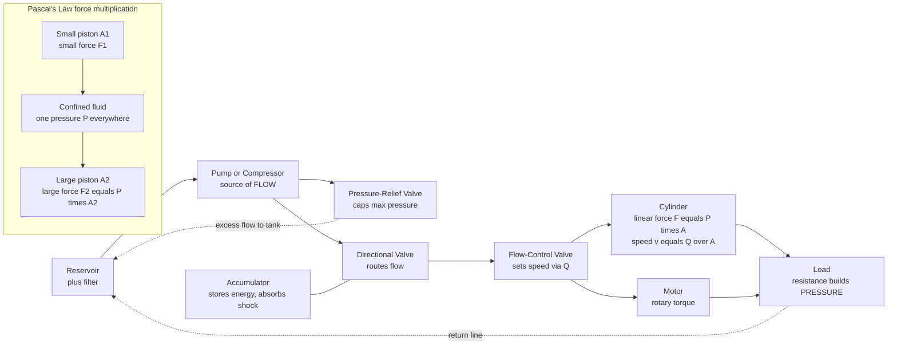

# 💪 Hydraulics and Pneumatics: Fluid Power — Transmitting and Multiplying Force

> [!abstract] TL;DR
> **Fluid power** transmits energy by pushing a pressurized fluid through flexible lines to an **actuator** that turns pressure back into force and motion. Its foundation is **Pascal's law**: pressure applied to a confined fluid is transmitted **undiminished and equally in every direction**, so a small force on a small piston creates the *same pressure* that pushes hard on a large piston — force is multiplied by the **area ratio** $F_2/F_1 = A_2/A_1$, a hydraulic "lever," paid for by a proportionally shorter stroke because volume (and work) is conserved. Two branches split by their fluid: **hydraulics** uses nearly **incompressible oil** at high pressure ($\sim$100–350 bar) for enormous, stiff, precise force (excavators, presses, brakes, aircraft controls); **pneumatics** uses **compressible air** for lower but faster, cheaper, cleaner, and springy actuation (factory automation, clamping, tools). Every system is a chain: a **pump/compressor** (power source) draws from a reservoir through a filter, **valves** route and regulate the flow (directional, pressure-relief, flow-control, and proportional/servo), and **actuators** — **cylinders** (linear force $F = P \cdot A$, speed $v = Q/A$) and **motors** (rotary torque) — do the work. The two mental anchors: **pressure sets force, flow sets speed**. Fluid power is the muscle behind construction, manufacturing, vehicles, and automation — delivering controllable force in compact packages that electric or purely mechanical systems often cannot match.

## Intuition

**Analogy:** Press lightly with your thumb on a small piston, and — through the trapped fluid beneath it — you can lift a **car**. Nothing magic: the fluid can't be squeezed, so it simply *carries your push everywhere at once*. Because pressure pushes **equally in all directions**, that same modest pressure lands on a much bigger piston somewhere else, and a big area times a modest pressure is a **huge force**. A gentle thumb becomes a hydraulic jack. The catch is the same one every lever imposes: the big piston moves only a tiny distance for your thumb's long push — you buy force by spending stroke, and the energy books always balance.

That trade is the whole soul of **fluid power**: use a pressurized liquid (**hydraulics**) or gas (**pneumatics**) to transmit and multiply force through flexible lines to wherever you need it. It's why a compact excavator arm can rip through rock, why factory robots clamp and press with a hiss of air, and why your car stops from a soft pedal push. Fluid power packs enormous, controllable force into small, flexible, reroutable systems — the muscle behind heavy machinery and automation.

---

## How It Works

### Core Mechanics

A fluid-power system is a short, repeatable chain that converts input energy into controllable output force and motion:

1. **Generate pressure — the pump/compressor.** A prime mover (electric motor, engine) drives a **pump** that pushes fluid out of a reservoir into the system. A pump does not "make pressure" directly — it makes **flow**; pressure builds up only when that flow meets a **resistance** (a load on an actuator, a closed valve). In pneumatics the equivalent is a **compressor** feeding a receiver tank of compressed air.

2. **Route and regulate — the valves.** Between source and actuator sit the control valves. **Directional control valves** decide *where* the flow goes (extend or retract a cylinder, spin a motor forward or reverse). **Pressure-relief valves** cap the maximum pressure and dump excess flow back to tank so nothing bursts. **Flow-control valves** throttle the flow rate to *set speed*. **Proportional and servo valves** move their spools by an electrical signal for smooth, closed-loop electronic control.

3. **Convert back to mechanical work — the actuators.** A **cylinder** turns pressure into a **linear** push: force $F = P \cdot A$ (pressure times piston area), extending at speed $v = Q/A$ (volumetric flow divided by area). A **hydraulic/pneumatic motor** turns the same flow into continuous **rotary torque**. This is where the two governing knobs become concrete: **pressure sets the force, flow sets the speed.**

4. **Multiply force — Pascal's law.** Because the confined fluid transmits pressure equally, a small input piston (area $A_1$) and a large output piston (area $A_2$) share one pressure $P = F_1/A_1 = F_2/A_2$. Hence $F_2/F_1 = A_2/A_1$: the **area ratio is the force gain**. Conservation of volume forces the strokes to trade inversely, $A_1 d_1 = A_2 d_2$, so $d_2/d_1 = A_1/A_2$ — the big piston moves *less*, and input work equals output work (minus losses). It is a **hydraulic lever**.

5. **Store, filter, and protect.** An **accumulator** stores pressurized fluid to absorb shocks and supply peak demand; a **reservoir** holds and cools the fluid; a **filter** keeps it clean (contamination is the number-one killer of components); relief valves and check valves guard against overpressure and backflow.

### Flow / Architecture



---

## Key Concepts

**Secondary (foundational intuition).**
- **Fluid power** = using pressurized liquid or gas to transmit and multiply force.
- **Pressure** $P = F/A$ (force per unit area); the SI unit is the pascal, but practitioners talk in **bar** ($1\ \text{bar} \approx 10^5\ \text{Pa} \approx 14.5\ \text{psi}$).
- **Pascal's law:** squeeze a confined fluid and the pressure rises **equally everywhere**. Small area + big area at equal pressure = a force multiplier (the hydraulic jack).
- **Liquids vs gases:** liquids barely compress (they push back stiffly); air compresses and springs back (it cushions).

**Undergraduate (working models).**
- **Force multiplication:** $\dfrac{F_2}{F_1} = \dfrac{A_2}{A_1}$; **stroke trade-off** from conserved volume: $\dfrac{d_2}{d_1} = \dfrac{A_1}{A_2}$; ideal work in equals work out.
- **Cylinder relations:** force $F = P \cdot A$; extension speed $v = Q/A$; retract force uses the **annulus area** $A - A_\text{rod}$ (rod side is smaller, so retract force is lower but retract speed higher for the same flow).
- **Hydraulics vs pneumatics:** oil at $\sim$100–350 bar → high force density, high stiffness, precise positioning; air at $\sim$6–10 bar → lower force, faster cycling, cheap, clean, and compliant.
- **Component roles:** pump/compressor (source), directional / pressure / flow valves (control), cylinder & motor (actuation), accumulator, reservoir, filter.
- **Power:** hydraulic power $P_\text{hyd} = p \cdot Q$ (pressure times flow) — the fluid-power analog of $V \cdot I$.

**Graduate (systems and control).**
- **Servohydraulics:** because oil is nearly incompressible, a hydraulic actuator behaves as a very **stiff** spring — high natural frequency and bandwidth, enabling precise force/position servo loops (flight controls, testing machines, injection molding). Governing dynamics couple valve flow $Q = C_d \, w \, x_v \sqrt{\Delta p}$ (orifice equation) to the piston momentum balance and the compressibility-limited pressure-rise rate $\dot p = \tfrac{\beta}{V}(Q - A\dot x)$ where $\beta$ is the **bulk modulus**.
- **Pneumatic compliance:** air's compressibility introduces a soft, nonlinear spring in series with the load, making precise mid-stroke positioning hard (systems usually rely on hard end-stops or added servo control) but giving inherent **cushioning and safety** near people.
- **Efficiency losses:** internal/external **leakage**, viscous and mechanical **friction**, **throttling** losses across valves (metering wastes energy as heat), and, in pneumatics, the thermodynamic cost of **compression**. Load-sensing and variable-displacement pumps recover much of the throttling loss.
- **Stored-energy hazard:** accumulators and high-pressure lines hold large energy; a failed hose or fitting is a serious safety concern — depressurize before service.

---

## Python Demo

```python
# Fluid power in two pictures:
#   (a) PASCAL'S LAW  -> force is multiplied by the piston-AREA RATIO,
#       but stroke is reduced by the same ratio (volume/work conserved).
#   (b) CYLINDER      -> PRESSURE sets FORCE (F = P*A),
#                        FLOW sets SPEED  (v = Q/A).
import numpy as np
import matplotlib.pyplot as plt

# -------------------------------------------------------------------------
# (a) PASCAL'S LAW: hydraulic jack / press
# -------------------------------------------------------------------------
F1 = 100.0                      # input force on small piston  [N]
d1 = 0.20                       # input stroke of small piston [m]
area_ratio = np.linspace(1, 50, 200)   # A2/A1 (output over input area)

F2 = F1 * area_ratio            # output force  = area ratio * input force
d2 = d1 / area_ratio            # output stroke = input stroke / area ratio
work_in  = F1 * d1              # constant
work_out = F2 * d2              # equals work_in for every ratio (ideal)

# -------------------------------------------------------------------------
# (b) HYDRAULIC CYLINDER: force from pressure, speed from flow
# -------------------------------------------------------------------------
bore = 0.05                     # piston bore diameter [m]  (50 mm)
A    = np.pi * (bore / 2) ** 2  # piston area [m^2]

pressure_bar = np.linspace(0, 250, 200)   # working pressure [bar]
pressure_Pa  = pressure_bar * 1e5
F_cyl_kN     = pressure_Pa * A / 1e3      # F = P*A  -> kN

Q_lpm = np.linspace(0, 60, 200)           # flow rate [litres/min]
Q_m3s = Q_lpm / 1000.0 / 60.0             # -> m^3/s
v_cyl = Q_m3s / A                          # v = Q/A  [m/s]

# -------------------------------------------------------------------------
# Plot
# -------------------------------------------------------------------------
fig, ax = plt.subplots(2, 2, figsize=(12, 9))

# (a1) force multiplication
ax[0, 0].plot(area_ratio, F2, color="tab:blue", lw=2)
ax[0, 0].axhline(F1, color="gray", ls="--", label=f"input force F1 = {F1:.0f} N")
ax[0, 0].set_title("(a) Pascal: output force vs area ratio")
ax[0, 0].set_xlabel("area ratio  A2 / A1")
ax[0, 0].set_ylabel("output force  F2  [N]")
ax[0, 0].legend(); ax[0, 0].grid(alpha=0.3)

# (a2) the stroke price of that force
ax[0, 1].plot(area_ratio, d2 * 1000, color="tab:red", lw=2, label="output stroke d2")
ax[0, 1].axhline(d1 * 1000, color="gray", ls="--", label=f"input stroke d1 = {d1*1000:.0f} mm")
ax[0, 1].set_title("(a) stroke traded for force (volume conserved)")
ax[0, 1].set_xlabel("area ratio  A2 / A1")
ax[0, 1].set_ylabel("output stroke  d2  [mm]")
ax[0, 1].legend(); ax[0, 1].grid(alpha=0.3)
# annotate that work is conserved
ax[0, 1].text(0.55, 0.6,
              f"work in = work out\n= {work_in:.0f} J (ideal)",
              transform=ax[0, 1].transAxes,
              bbox=dict(boxstyle="round", fc="wheat", alpha=0.8))

# (b1) PRESSURE sets FORCE
ax[1, 0].plot(pressure_bar, F_cyl_kN, color="tab:green", lw=2)
ax[1, 0].set_title("(b) cylinder FORCE = P x A  (pressure sets force)")
ax[1, 0].set_xlabel("pressure  [bar]")
ax[1, 0].set_ylabel("force  [kN]")
ax[1, 0].grid(alpha=0.3)
ax[1, 0].text(0.05, 0.85, f"bore = {bore*1000:.0f} mm\nA = {A*1e4:.1f} cm^2",
              transform=ax[1, 0].transAxes,
              bbox=dict(boxstyle="round", fc="honeydew", alpha=0.8))

# (b2) FLOW sets SPEED
ax[1, 1].plot(Q_lpm, v_cyl, color="tab:purple", lw=2)
ax[1, 1].set_title("(b) cylinder SPEED = Q / A  (flow sets speed)")
ax[1, 1].set_xlabel("flow rate  [litres/min]")
ax[1, 1].set_ylabel("extension speed  [m/s]")
ax[1, 1].grid(alpha=0.3)

plt.tight_layout()
plt.savefig("fluid_power_demo.png", dpi=110)
print(f"At 200 bar the {bore*1000:.0f} mm cylinder pushes "
      f"{200e5 * A / 1e3:.1f} kN")
print(f"At 30 L/min it extends at "
      f"{(30/1000/60) / A:.3f} m/s")
```

Running it shows the two laws visually: output force climbs **linearly with the area ratio** while the output stroke falls off as its inverse (their product — the work — stays flat), and for the cylinder, **force rises with pressure** while **speed rises with flow**, cleanly separating the two design knobs.

---

## Real-World Applications

- **Construction & mining:** excavators, backhoes, loaders, cranes, and dozers use hydraulic cylinders and motors to develop tens of tonnes of digging and lifting force in a compact arm — no electric motor of that size would fit.
- **Manufacturing:** hydraulic **presses** and **injection-molding** clamps deliver enormous, steady tonnage; **pneumatic** clamps, grippers, and pick-and-place actuators drive high-speed factory automation and robotic end-effectors.
- **Vehicles:** automotive **brakes** (Pascal's law from pedal to caliper), power steering, and heavy-truck systems; **aircraft flight controls** and landing gear rely on high-pressure hydraulics for their stiffness and force density.
- **Material handling & lifting:** forklifts, scissor lifts, dock levelers, and the humble **hydraulic jack** and log splitter.
- **Tools & light automation:** pneumatic impact wrenches, nail guns, air cylinders, and cushioned door closers exploit air's speed, cleanliness, and springy compliance.

---

## Common Pitfalls

- **Confusing pressure with flow (force with speed).** A pump makes **flow**; **pressure** only appears when flow meets a load. Force is set by pressure ($F = P \cdot A$) and speed by flow ($v = Q/A$) — mixing these up leads to sizing a cylinder that is strong but slow, or fast but weak. Keep the two knobs separate.
- **Forgetting the stroke price of force multiplication.** Pascal's law gives $F_2/F_1 = A_2/A_1$ **only** at the cost of $d_2/d_1 = A_1/A_2$. There is no free force — a 10× multiplier moves the load one-tenth as far, and you must supply enough volume. It is a lever, not a magic amplifier.
- **Treating hydraulics and pneumatics as interchangeable.** Oil is nearly **incompressible** → high force, stiff, precise, expensive, high pressure. Air is **compressible** → lower force, fast, cheap, clean, but **springy** and hard to position precisely mid-stroke. Choosing air for a precise heavy press, or oil for a fast light clamp, fights the physics.
- **Underestimating compressibility/compliance in control.** Pneumatic actuators behave as soft nonlinear springs; expecting servo-grade positioning without hard stops or added feedback disappoints. Hydraulic stiffness is a feature — but its high bandwidth can also excite resonances.
- **Ignoring leakage, contamination, and throttling losses.** Internal leakage bleeds off force and precision; dirty fluid destroys valves and pumps (filtration is not optional); metering flow across valves dumps energy as heat and slashes efficiency — favor load-sensing or variable-displacement designs.
- **Disrespecting stored energy (safety).** Accumulators and high-pressure lines hold large energy; a pinhole leak can inject fluid under the skin, and a whipping hose is dangerous. Always **depressurize and lock out** before servicing.

---

## Related Concepts

- [[Fluid_Statics_and_Buoyancy]] — the source of **Pascal's law** and the pressure-transmission principle that fluid power multiplies force with.
- [[Fluid_Statics_and_Properties]] — pressure as an isotropic normal stress in a fluid at rest; the physics foundation beneath every hydraulic circuit.
- [[Fluid_Dynamics_Overview]] — the broader flow toolkit (continuity, momentum, viscous losses) governing pump flow, valve throttling, and line losses.
- [[Work_Energy_and_Conservation]] — why force multiplication costs stroke: input work equals output work, so a big force over a short distance balances a small force over a long one.
- [[Actuators_Sensors_and_Embedded_Robotics]] — hydraulic and pneumatic actuators as one of the main muscle technologies for robots, chosen for force density or compliance.

---

## Review Questions

1. **(Secondary)** A hydraulic jack has an input piston of area $2\ \text{cm}^2$ and an output piston of area $50\ \text{cm}^2$. If you push the input with 200 N, what force lifts the load, and how far does the load rise when the input piston moves 10 cm? Explain in words why the load moves so little.
2. **(Undergraduate)** A cylinder with a 63 mm bore is supplied at 180 bar and 25 L/min. Compute the extension force and speed. Which supply parameter would you change to make it push harder, and which to make it extend faster? Why are these independent?
3. **(Graduate)** A machine designer must choose between a hydraulic and a pneumatic actuator for (a) a precision servo-controlled fatigue-testing rig and (b) a lightweight collaborative-robot gripper that works next to humans. Recommend a fluid for each and justify your choice in terms of stiffness/bandwidth, compressibility, force density, safety, and cost.

---

## Sources

- Esposito, A. *Fluid Power with Applications*, 7th ed., Pearson, 2013.
- Parr, A. *Hydraulics and Pneumatics: A Technician's and Engineer's Guide*, 3rd ed., Butterworth-Heinemann, 2011.
- Merritt, H. E. *Hydraulic Control Systems*, Wiley, 1967.
- Manring, N. D., & Fales, R. C. *Hydraulic Control Systems*, 2nd ed., Wiley, 2019.

---

#mechanical-engineering #hydraulics #pneumatics #fluid-power #pascals-law
