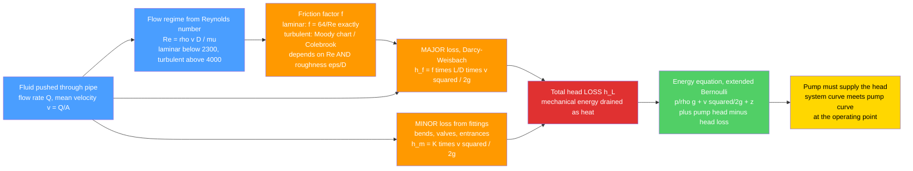

# 🚰 Internal and Pipe Flow

> [!abstract] TL;DR
> **Internal flow** is fluid confined by walls — pipes, ducts, channels — so viscous **friction at the walls continuously drains the fluid's energy** (its pressure), and the master engineering question is: *how much pressure, or pump head, does it take to push a desired flow rate through a given piping system?* The answer is the **Darcy-Weisbach equation** $h_f = f\,\dfrac{L}{D}\,\dfrac{v^2}{2g}$, where the dimensionless **friction factor** $f$ comes from the flow regime: **laminar** ($Re<2300$) gives exactly $f=64/Re$ with a parabolic Hagen-Poiseuille profile, while **turbulent** flow reads $f$ off the **Moody chart** (the Colebrook equation) as a function of both the **Reynolds number** and the **relative roughness** $\varepsilon/D$. Fittings, bends, and valves add **minor losses** $h_m = K\,v^2/2g$. Wrap it all in the **extended Bernoulli / energy equation** (add pump head, subtract head loss) and you can size pipes and select pumps. The two design facts that rule the discipline: head loss grows with **velocity squared** and, for a fixed flow, roughly with **1/D⁵** — so **doubling a pipe's diameter cuts the pumping loss by about 32×**, the classic pipe-vs-pump cost tradeoff behind every water main, HVAC duct, and oil pipeline.

---

## Intuition — analogy FIRST

Push water through a **long garden hose** and it comes out weaker than it went in — the friction of the fluid dragging against the hose walls steals its pressure the whole way down. Make the hose **longer** and more pressure is lost; make it **narrower** and *far* more is lost; open the tap harder and the loss climbs faster than the flow does. Kink it, add a nozzle, or run it through a coiled reel and each obstruction takes another bite. What comes out the end is whatever pressure survived the trip.

Every piped system on Earth fights exactly this friction: your home plumbing, a city water main, a refinery's process lines, a car's cooling loop, a fire sprinkler riser, the blood in your arteries. The engineer's job is to calculate — before anything is built — **exactly how much pressure (and how much pump power) it takes to push the fluid through at the flow rate you need.** Get it wrong and the top-floor shower dribbles, the undersized pipe bursts, or the pump runs off the end of its curve and burns out. **Pipe-flow analysis is the everyday arithmetic of moving fluids** — unglamorous, ubiquitous, and the single most-used calculation in practical fluid engineering.

---

## How It Works

Internal flow differs from external flow (flow *over* a body) in one decisive way: the walls **surround** the fluid, so the viscous [[The_Boundary_Layer|boundary layers]] growing off every wall quickly meet in the middle and fill the whole cross-section. Once that happens the flow is **fully developed** — its velocity profile stops changing downstream — and the wall shear stress becomes a steady drain on the fluid's mechanical energy. That drain, expressed as an equivalent height of fluid, is the **head loss** $h_f$, and computing it is the entire game.

### Core mechanism

1. **Classify the flow with the Reynolds number.** $Re = \rho v D / \mu = vD/\nu$ compares inertia to viscosity. Below ~2300 the flow is **laminar** (orderly layers); above ~4000 it is **turbulent** (chaotic, well-mixed); between lies an unpredictable transition. The regime decides everything downstream.
2. **Get the friction factor $f$.** In laminar flow the Navier-Stokes equations solve *exactly* (Hagen-Poiseuille), giving $f = 64/Re$ — independent of wall roughness. In turbulent flow $f$ depends on **both** $Re$ **and** the relative roughness $\varepsilon/D$, read from the **Moody chart** or computed from the **Colebrook equation** $\dfrac{1}{\sqrt f} = -2\log_{10}\!\Big(\dfrac{\varepsilon/D}{3.7} + \dfrac{2.51}{Re\sqrt f}\Big)$.
3. **Compute the major (friction) loss.** The **Darcy-Weisbach equation** $h_f = f\,\dfrac{L}{D}\,\dfrac{v^2}{2g}$ turns $f$, pipe length $L$, diameter $D$, and mean velocity $v$ into a head loss. Note the two levers: $h_f \propto v^2$ and, since $v=Q/A \propto Q/D^2$, at fixed flow $h_f \propto 1/D^5$.
4. **Add the minor (fitting) losses.** Every valve, elbow, tee, expansion, contraction, and entrance costs $h_m = K\,\dfrac{v^2}{2g}$, where the **loss coefficient** $K$ is tabulated per component. In short systems packed with fittings these "minor" losses often *dominate* the pipe friction.
5. **Close with the energy equation.** The **extended Bernoulli** relation between inlet 1 and outlet 2 is $\dfrac{p_1}{\rho g}+\dfrac{v_1^2}{2g}+z_1 + h_{pump} = \dfrac{p_2}{\rho g}+\dfrac{v_2^2}{2g}+z_2 + h_{turbine} + h_L$. Solve it for $h_{pump}$ and you know the head the pump must supply; multiply by $\rho g Q$ for hydraulic power.
6. **Find the operating point.** Plot the **system curve** (required head vs flow, rising as $\sim Q^2$) against the **pump curve** (head the pump delivers, falling with flow). Where they cross is the **operating point** — the actual flow the installed system will deliver.



---

## Key Concepts

### Secondary (intuition)
- Fluid rubbing against pipe walls **loses pressure** all the way down the pipe — a long or narrow pipe loses more.
- **Faster flow loses much more pressure:** the loss grows with the *square* of speed, so pushing twice the flow costs roughly four times the pressure.
- **Wider pipes are dramatically easier** to push fluid through — a small increase in diameter saves a huge amount of pumping effort (but costs more material).
- **Fittings matter:** every bend, valve, and junction adds its own loss; a system full of elbows can lose more in the fittings than in the straight pipe.
- A **pump** exists to replace exactly the pressure the friction stole, plus any height the fluid must climb.

### Undergraduate (the working theory)
- **Reynolds number & regime:** $Re = \rho v D/\mu$. Laminar $Re<2300$, transitional $2300$–$4000$, turbulent $Re>4000$. Regime selects the friction-factor law.
- **Darcy-Weisbach (major loss):** $h_f = f\,\dfrac{L}{D}\,\dfrac{v^2}{2g}$. The **Darcy friction factor** $f$ is 4× the Fanning factor — always check which one a chart uses.
- **Laminar exact result:** $f = 64/Re$; from Hagen-Poiseuille, $Q = \dfrac{\pi \Delta P\, D^4}{128\,\mu L}$ (the famous **fourth-power** diameter dependence), with a **parabolic** velocity profile, $v_{max}=2\bar v$.
- **Turbulent friction factor:** implicit **Colebrook** equation, or the explicit **Swamee-Jain** / **Haaland** approximations, plotted as the **Moody chart** ($f$ vs $Re$ for lines of constant $\varepsilon/D$). At high $Re$ the curves flatten into the **fully rough** regime where $f$ depends on roughness alone.
- **Minor losses:** $h_m = K\,\dfrac{v^2}{2g}$ (loss-coefficient method) or the equivalent-length method $h_m = f\,\dfrac{L_{eq}}{D}\,\dfrac{v^2}{2g}$. Typical $K$: sharp entrance ≈ 0.5, exit ≈ 1.0, 90° elbow ≈ 0.9, gate valve open ≈ 0.2, globe valve ≈ 10.
- **Extended Bernoulli / energy equation:** the master sizing relation, with pump head added, turbine head removed, and $h_L = h_f + \sum h_m$ subtracted; include the kinetic-energy correction factor $\alpha$ ($\alpha\approx2$ laminar, $\approx1.05$ turbulent).
- **Entrance/developing length:** $L_{e}\approx 0.06\,Re\,D$ (laminar) or $\approx 4.4\,Re^{1/6}\,D$ (turbulent) before flow is fully developed; friction is higher in the developing region.
- **System vs pump curve:** system head $H_{sys}(Q)=\Delta z + (\text{constant})\,Q^2$ meets the pump's $H(Q)$ at the **operating point**.

### Graduate (where it gets subtle)
- **Colebrook is transcendental** and multivalued numerically; production codes use explicit fits (Swamee-Jain, Haaland, Churchill's single formula that spans laminar → transitional → turbulent) with known error bounds.
- **Non-circular ducts:** use the **hydraulic diameter** $D_h = 4A/P$ (area over wetted perimeter); the turbulent Moody approach transfers well, but laminar $f\cdot Re$ is *geometry-dependent* (64 for a circle, 96 for parallel plates, ~56.9 for a square).
- **Roughness is not a single number:** commercial-pipe $\varepsilon$ values are *equivalent sand-grain* roughness back-fit to Colebrook; real aging, scaling, corrosion, and biofilm can raise $\varepsilon$ by an order of magnitude over a pipe's life — design with a fouling margin.
- **Pipe networks:** conservation of mass at junctions plus energy (loss) around loops yields a nonlinear system solved by the **Hardy-Cross** method or global Newton solvers (EPANET); each loop's head-loss sum must close to zero.
- **Compressible internal flow:** for gases with large $\Delta p$, density varies along the pipe — use **Fanno flow** (adiabatic with friction) or isothermal pipe-flow equations, not incompressible Darcy-Weisbach.
- **Flow measurement:** **orifice**, **venturi**, and **nozzle** meters infer $Q$ from a measured $\Delta p$ via $Q = C_d A_t\sqrt{2\Delta p/\rho(1-\beta^4)}$; the venturi recovers most of the pressure, the orifice is cheap but lossy.
- **Transients:** rapid valve closure triggers **water hammer** — pressure spikes of $\Delta p = \rho c\,\Delta v$ (Joukowsky) that can far exceed steady operating pressure; surge tanks and slow valves mitigate.
- **Cavitation & NPSH:** if local pressure drops below vapor pressure (high velocity, suction lifts, throttling), vapor pockets form and collapse — damaging pumps and valves; the energy equation on the suction side governs **available NPSH**.

---

## Python Demo

```python
# Internal / pipe flow in four pictures:
#   (a) THE MOODY CHART: friction factor f vs Reynolds number for several relative
#       roughnesses -- laminar f = 64/Re, then the turbulent Colebrook curves that
#       flatten into the "fully rough" regime where only roughness matters.
#   (b) SYSTEM vs PUMP CURVE: required head vs flow for two pipe diameters (doubling D
#       slashes the loss), intersected with a pump curve to set the OPERATING POINT.
#   (c) HEAD LOSS ~ v^2 : at fixed diameter, loss grows with velocity SQUARED (slope 2).
#   (d) HEAD LOSS ~ 1/D^5 : at fixed flow, loss collapses as diameter grows.
import numpy as np
import matplotlib.pyplot as plt

g = 9.81  # m/s^2

# ---- Turbulent friction factor: Colebrook, solved by fixed-point iteration ----
def colebrook(Re, rr):
    # rr = relative roughness eps/D ; returns the DARCY friction factor f
    Re = np.asarray(Re, dtype=float)
    # Haaland explicit formula as a good initial guess
    f = (1.0 / (-1.8 * np.log10((rr / 3.7)**1.11 + 6.9 / Re)))**2
    for _ in range(60):                       # converges in a handful of steps
        rhs = -2.0 * np.log10(rr / 3.7 + 2.51 / (Re * np.sqrt(f)))
        f = 1.0 / rhs**2
    return f

# ============================================================
# (a) MOODY CHART
# ============================================================
Re_all  = np.logspace(np.log10(600), 8, 600)
roughs  = [0.0, 1e-5, 1e-4, 5e-4, 2e-3, 1e-2, 5e-2]   # eps/D, "smooth" to very rough

fig, ax = plt.subplots(2, 2, figsize=(14, 10))

Re_lam = Re_all[Re_all <= 2300]
ax[0,0].plot(Re_lam, 64.0/Re_lam, 'k-', lw=3, label="laminar  f = 64/Re")

Re_turb = Re_all[Re_all >= 4000]
for rr in roughs:
    f = colebrook(Re_turb, rr)
    lbl = "smooth (eps/D = 0)" if rr == 0 else f"eps/D = {rr:g}"
    ax[0,0].plot(Re_turb, f, lw=1.8, label=lbl)
ax[0,0].axvspan(2300, 4000, color="gray", alpha=0.15)
ax[0,0].text(2900, 0.07, "transition", rotation=90, fontsize=8, va="center")
ax[0,0].set_xscale("log"); ax[0,0].set_yscale("log")
ax[0,0].set_xlabel("Reynolds number  Re = rho v D / mu")
ax[0,0].set_ylabel("Darcy friction factor  f")
ax[0,0].set_title("(a) The Moody chart: f vs Re for lines of constant roughness")
ax[0,0].grid(which="both", alpha=0.3); ax[0,0].legend(fontsize=7)

# ============================================================
# (b) SYSTEM CURVE vs PUMP CURVE  ->  OPERATING POINT
# ============================================================
rho, mu = 998.0, 1.0e-3                 # water at ~20 C
nu = mu / rho
L, eps = 120.0, 0.045e-3                # 120 m of commercial steel (eps = 0.045 mm)
Ktot   = 12.0                           # sum of minor-loss K (entrance, bends, valves, exit)
static = 18.0                           # static lift the fluid must climb, m

def system_head(Q, D):
    A  = np.pi * D**2 / 4.0
    v  = Q / A
    Re = np.maximum(v * D / nu, 1e-6)
    f  = np.where(Re < 2300, 64.0/Re, colebrook(np.maximum(Re, 4000.0), eps/D))
    hf = f * (L / D) * v**2 / (2*g)     # Darcy-Weisbach major loss
    hm = Ktot * v**2 / (2*g)           # minor losses
    return static + hf + hm

Q = np.linspace(1e-4, 0.09, 400)        # m^3/s
H_small = system_head(Q, 0.05)          # 5 cm pipe
H_big   = system_head(Q, 0.10)          # 10 cm pipe (double the diameter)

# a simple centrifugal-pump curve: H = H0 - a*Q^2
H0, a  = 55.0, 6000.0
H_pump = H0 - a * Q**2

# operating point = where pump curve crosses each system curve
def crossing(Hsys):
    d = H_pump - Hsys
    i = np.where(np.diff(np.sign(d)))[0][0]
    return Q[i], Hsys[i]
Qop_s, Hop_s = crossing(H_small)
Qop_b, Hop_b = crossing(H_big)

ax[0,1].plot(Q*1000, H_small, lw=2.4, color="#e03131", label="system: D = 5 cm")
ax[0,1].plot(Q*1000, H_big,   lw=2.4, color="#1971c2", label="system: D = 10 cm")
ax[0,1].plot(Q*1000, H_pump,  lw=2.4, color="#2b8a3e", ls="--", label="pump curve")
ax[0,1].scatter([Qop_s*1000, Qop_b*1000], [Hop_s, Hop_b], color="k", zorder=5)
ax[0,1].annotate(f"op. pt  {Qop_s*1000:.0f} L/s", (Qop_s*1000, Hop_s), textcoords="offset points", xytext=(6,8))
ax[0,1].annotate(f"op. pt  {Qop_b*1000:.0f} L/s", (Qop_b*1000, Hop_b), textcoords="offset points", xytext=(6,-14))
ax[0,1].set_ylim(0, 60)
ax[0,1].set_xlabel("flow rate  Q  (L/s)"); ax[0,1].set_ylabel("head (m)")
ax[0,1].set_title("(b) System curve vs pump curve: doubling D moves the operating point")
ax[0,1].grid(alpha=0.3); ax[0,1].legend(fontsize=8)

# ============================================================
# (c) HEAD LOSS ~ v^2  (fixed diameter)
# ============================================================
D0 = 0.05
v_arr  = np.linspace(0.3, 6.0, 200)
A0     = np.pi*D0**2/4.0
Re_v   = v_arr*D0/nu
f_v    = np.where(Re_v < 2300, 64.0/Re_v, colebrook(np.maximum(Re_v, 4000.0), eps/D0))
hf_v   = f_v*(L/D0)*v_arr**2/(2*g)
ax[1,0].loglog(v_arr, hf_v, lw=2.5, color="#f08c00")
ax[1,0].loglog(v_arr, hf_v[100]*(v_arr/v_arr[100])**2, 'k:', lw=1.5, label="pure v^2 slope")
ax[1,0].set_xlabel("mean velocity v (m/s)"); ax[1,0].set_ylabel("major head loss h_f (m)")
ax[1,0].set_title("(c) Head loss grows with velocity SQUARED  (D = 5 cm, L = 120 m)")
ax[1,0].grid(which="both", alpha=0.3); ax[1,0].legend(fontsize=8)

# ============================================================
# (d) HEAD LOSS ~ 1/D^5  (fixed flow rate)
# ============================================================
Qfix   = 0.02                            # 20 L/s held constant
D_arr  = np.linspace(0.03, 0.20, 200)
A_arr  = np.pi*D_arr**2/4.0
v_arr2 = Qfix/A_arr
Re_D   = v_arr2*D_arr/nu
f_D    = np.where(Re_D < 2300, 64.0/Re_D, colebrook(np.maximum(Re_D, 4000.0), eps/D_arr))
hf_D   = f_D*(L/D_arr)*v_arr2**2/(2*g)
ax[1,1].loglog(D_arr*100, hf_D, lw=2.5, color="#7048e8")
ax[1,1].loglog(D_arr*100, hf_D[80]*(D_arr/D_arr[80])**-5, 'k:', lw=1.5, label="pure 1/D^5 slope")
ax[1,1].set_xlabel("pipe diameter D (cm)"); ax[1,1].set_ylabel("major head loss h_f (m)")
ax[1,1].set_title("(d) Fixed flow: loss collapses ~ 1/D^5  (why big pipes save pump power)")
ax[1,1].grid(which="both", alpha=0.3); ax[1,1].legend(fontsize=8)

plt.tight_layout(); plt.show()

# --- quantify the diameter payoff ---
h5  = system_head(np.array([Qfix]), 0.05)[0] - static
h10 = system_head(np.array([Qfix]), 0.10)[0] - static
print(f"At Q = {Qfix*1000:.0f} L/s: loss in 5 cm pipe = {h5:6.1f} m,  in 10 cm pipe = {h10:6.2f} m")
print(f"Doubling the diameter cut the loss by about {h5/h10:.0f}x (theory ~ 2^5 = 32x)")
```

**What it shows:** (a) the **Moody chart** — the laminar line $f=64/Re$ sits alone on the left, and past transition the **Colebrook** curves fan out by roughness and then flatten into the **fully rough** regime where $f$ no longer depends on $Re$, only on $\varepsilon/D$. (b) each pipe's **system curve** rises as $\sim Q^2$; where the falling **pump curve** crosses it is the **operating point**, and switching from a 5 cm to a 10 cm pipe pushes that point to a much higher flow. (c) at fixed diameter the head loss tracks the dotted **$v^2$** line, and (d) at fixed flow it collapses along the **$1/D^5$** line — the printed numbers confirm that doubling the diameter cuts the loss by roughly the theoretical **32×**, the single most important lever in pipe-and-pump economics.

---

## Real-World Applications

- **Municipal water distribution:** mains, service lines, and pumping stations are sized so that even the highest, farthest tap keeps adequate pressure at peak (and fire-flow) demand; network solvers like **EPANET** run Hardy-Cross-style loop balances on thousands of pipes.
- **Building plumbing & fire protection:** fixture-unit methods and Hazen-Williams / Darcy-Weisbach sizing guarantee shower flow on the top floor and NFPA-compliant sprinkler densities at the hydraulically most-remote head.
- **HVAC ducting & hydronic loops:** duct and chilled-/hot-water pipe sizing trades fan/pump energy against duct size and noise; the same $f$, $K$, and system-curve logic governs air as well as water.
- **Oil & gas pipelines:** long-distance crude and gas lines are optimized diameter-vs-pumping/compression cost over hundreds of kilometers, with pump/compressor stations spaced to hold pressure between them (and Fanno/isothermal models for gas).
- **Chemical & process plants:** every reactor feed, cooling loop, and utility header is a piping calculation; pressure drop across exchangers, control valves, and orifice runs sets pump specs and control authority.
- **Engine & power-plant cooling:** automotive coolant loops, EGR, and power-station condenser/feedwater circuits are pipe-flow problems where head loss sets pump duty and flow adequacy for heat removal.
- **Hydraulics & fluid power:** hose and manifold sizing controls pressure drop and heating in construction and aircraft hydraulic systems.
- **Biomedical & microfluidics:** IV lines, dialysis circuits, catheters, and lab-on-chip channels are laminar internal flows where Hagen-Poiseuille's $Q\propto D^4$ dictates resistance.

---

## Common Pitfalls

- **Using the wrong friction-factor law for the regime.** $f=64/Re$ is exact **only** for laminar flow ($Re<2300$); applying it in turbulent flow (or reading a Moody curve for laminar flow) is a classic error. Compute $Re$ first, then pick the law.
- **Darcy vs Fanning factor confusion.** The Darcy factor is **4×** the Fanning factor. Mixing them makes head loss off by a factor of 4. Darcy pairs with $h_f=f\frac{L}{D}\frac{v^2}{2g}$; Fanning pairs with $h_f=4f\frac{L}{D}\frac{v^2}{2g}$.
- **Ignoring minor losses in short systems.** In a compact skid full of elbows, valves, and reducers the **$K\,v^2/2g$** fitting losses can exceed the straight-pipe friction entirely. "Minor" refers to the term, not the magnitude.
- **Forgetting the velocity-squared and 1/D⁵ scaling.** Underestimating how fast loss climbs with flow (or how much a slightly smaller pipe hurts) leads to undersized pipe and an over-worked pump. Doubling flow ≈ 4× the friction loss; a modest diameter cut can multiply the loss many-fold.
- **Treating roughness as fixed and new.** Design $\varepsilon$ values are for *clean* pipe; scaling, corrosion, and biofilm raise roughness over years. Size with a fouling/aging margin or the pump slides back down its curve.
- **Sizing the pump without the system curve.** A pump's rated point is meaningless in isolation — the **operating point** is the *intersection* of pump and system curves. Skip the system curve and the installed flow can be far from intended (and the pump may run at poor efficiency or cavitate).
- **Applying incompressible Darcy-Weisbach to a gas with large Δp.** When density changes appreciably along the line, use **Fanno** or isothermal compressible pipe-flow equations, not constant-density head loss.
- **Neglecting entrance/developing length.** In short pipes the flow may never become fully developed; friction in the developing region is higher than the fully-developed value assumed by the standard formulas.
- **Overlooking transients and cavitation.** Steady sizing that looks fine can fail on **water hammer** (fast valve closure) or **cavitation** (suction-side pressure below vapor pressure). Check NPSH and surge, not just the steady operating point.

---

## Related Concepts

- [[Laminar_Flow_and_Exact_Solutions]] — supplies the laminar half of pipe flow: the **Hagen-Poiseuille** parabolic profile, $Q\propto \Delta P\,D^4/\mu L$, and the exact **$f=64/Re$** that anchors the left edge of the Moody chart.
- [[Viscosity_and_Stress_in_Fluids]] — the **wall shear stress** from viscosity and the **no-slip** condition are the physical origin of every head loss computed here; $f$ is just a dimensionless packaging of that wall stress.
- [[Bernoulli_and_Energy_in_Flows]] — the **extended Bernoulli / energy equation** (pump head added, head loss subtracted) is the master sizing relation into which Darcy-Weisbach and minor losses plug.
- [[Turbulence_Fundamentals]] — turbulent pipe flow's **flatter velocity profile** and roughness-dependent friction (the whole right side of the Moody chart) come from the turbulence physics; $\varepsilon/D$ matters only once eddies scrub the wall.
- [[The_Boundary_Layer]] — internal flow *is* boundary layers that grow off the walls and **merge** to fill the pipe; their merging sets the **entrance/developing length** before flow is fully developed.
- [[Dimensional_Analysis_and_Similarity]] — the **Reynolds number** and the dimensionless **friction factor** and **loss coefficient** are exactly the products dimensional analysis predicts, which is why the Moody chart collapses onto $f(Re,\varepsilon/D)$.

*(Siblings referenced in prose — Engineering_Fluid_Mechanics, Pumps_Compressors_and_Turbines, Hydraulics_and_Pneumatics, Heat_Exchangers_and_HVAC, and External_Flow_and_Aerodynamics — will be wikilinked once those notes exist.)*

---

## Review Questions

1. **(Secondary)** Your upstairs shower dribbles while the downstairs tap gushes, and a plumber offers to replace the long run of thin pipe feeding the bathroom with a wider one. Using the idea that friction loss grows sharply as pipes get narrower and flow gets faster, explain why a *wider* pipe fixes the weak shower even though it does not change the pump or the water supply.
2. **(Undergraduate)** Water ($\rho=998$ kg/m³, $\mu=1.0\times10^{-3}$ Pa·s) flows at $Q=0.02$ m³/s through $L=120$ m of commercial steel pipe ($\varepsilon=0.045$ mm), diameter $D=0.05$ m, with total minor-loss coefficient $\sum K=12$. (a) Find the mean velocity and Reynolds number and state the regime. (b) Estimate the friction factor (Haaland or Colebrook) and compute the **major** head loss from Darcy-Weisbach. (c) Add the minor losses and, if the outlet is 18 m above the inlet at the same pressure and velocity, find the **pump head** required. (d) By roughly what factor would the major loss drop if the diameter were doubled to 0.10 m at the *same* flow — and why?
3. **(Graduate)** A gas pipeline shows a measured pressure drop far larger than incompressible Darcy-Weisbach predicts, and a downstream throttle valve is suffering erosion and noise. (a) Explain why the incompressible head-loss model fails here and which model (Fanno or isothermal) you would use instead, naming the physical quantity that varies along the pipe. (b) The erosion suggests cavitation-like behavior at the valve — walk through how you would use the suction-side energy equation and vapor pressure to check available NPSH / flashing. (c) Operators later report a damaging pressure spike whenever an emergency valve slams shut. Identify the phenomenon, estimate the spike with the Joukowsky relation $\Delta p=\rho c\,\Delta v$, and propose two mitigations.

---

## Sources

- White, F. M. *Fluid Mechanics* — internal flow, Moody chart, Darcy-Weisbach, minor losses, pipe-network methods.
- Cengel, Y. A. & Cimbala, J. M. *Fluid Mechanics: Fundamentals and Applications* — pipe flow chapter, entrance length, energy equation with pump/turbine head, flow measurement.
- Munson, Young, Okiishi & Huebsch. *Fundamentals of Fluid Mechanics* — laminar vs turbulent pipe flow, loss coefficients, system/pump-curve operating point.
- Crane Co. *Technical Paper 410 (TP-410): Flow of Fluids Through Valves, Fittings, and Pipe* — the standard practitioner reference for K-factors and equivalent lengths.
- Moody, L. F. (1944). "Friction Factors for Pipe Flow." *Transactions of the ASME* — the original Moody chart; and Colebrook, C. F. (1939) for the friction-factor correlation.

---

#mechanical-engineering #pipe-flow #head-loss #moody-chart #darcy-weisbach
