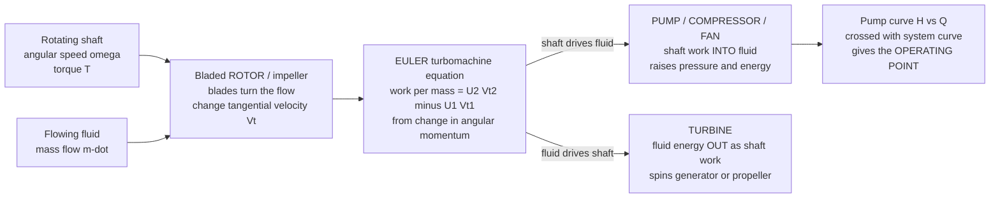

# ⚙️ Pumps, Compressors and Turbines

> [!abstract] TL;DR
> A **turbomachine** is a bladed **rotor** that exchanges energy between a **rotating shaft** and a **flowing fluid**. Run it one way and shaft work goes *into* the fluid, raising its pressure and energy — a **pump** (liquids), **compressor** or **fan/blower** (gases). Run it the other way and the fluid's energy comes *out* as shaft work — a **turbine**. The governing design relation is the **Euler turbomachine equation**: the specific work equals the change in the fluid's **angular momentum** ($U_2 V_{t2} - U_1 V_{t1}$) across the blade row. Two great families exist: **dynamic** machines (centrifugal/radial and axial — accelerate the fluid then convert velocity to pressure, giving continuous, high flow) and **positive-displacement** machines (piston, gear, screw — trap a fixed volume per revolution, giving high pressure). A pump's **head–capacity curve** intersects the piping **system curve** at the **operating point**; the **affinity laws** ($Q \propto N$, $H \propto N^2$, $P \propto N^3$) explain why variable-speed drives slash energy; and **cavitation** — vapor bubbles forming and collapsing when local pressure falls below the vapor pressure — is the classic pump killer, held off by adequate **NPSH**. Nearly all the world's electricity comes from a spinning **turbine**, and nearly all liquid gets moved by a **pump** — turbomachinery is the beating heart of energy and fluid systems.

---

## Intuition

**Analogy:** Picture a **spinning fan**. Plug it in and its blades *push* air across the room — the motor's shaft work is being pumped into the moving air. Now switch the motor off, open a window, and let a strong wind blow *through* the same blades: the fan spins on its own, and if you connected it to a dynamo it would light a bulb — the moving air is now *pushing the blades* and handing its energy back out through the shaft. **Same bladed rotor, run in reverse.** Pushing energy *into* the fluid makes it a **pump** or **compressor**; letting the fluid push *the blades* makes it a **turbine**.

That single idea scales to almost everything that moves fluid or makes power. **Pumps** shove water uphill and oil through pipelines; **compressors** squeeze the gas in your fridge, your gas pipelines, and the front of every jet engine; and **turbines** harvest the energy of steam, falling water, wind, and jet exhaust to spin generators and propel planes. Master these bladed rotors and you master the flow of energy through the modern world.

---

## How It Works

### Core Mechanics

1. **A rotor sits in the flow path.** Fluid enters, passes through a ring of **rotating blades** (the *rotor* or *impeller*), and leaves. The blades turn the flow, changing its **tangential (swirl) velocity** — and that change is where the energy exchange lives.
2. **The Euler turbomachine equation is the master relation.** Torque on the shaft equals the rate of change of the fluid's **angular momentum**. Dividing by mass flow gives the **specific work**: $w = U_2 V_{t2} - U_1 V_{t1}$, where $U = \omega r$ is the blade speed and $V_t$ is the fluid's tangential velocity at inlet (1) and outlet (2). Add swirl (positive $w$) and you have a **pump/compressor**; remove swirl (negative $w$, work extracted) and you have a **turbine**.
3. **Velocity is then traded for pressure.** In a **centrifugal** pump the impeller flings fluid radially outward, adding kinetic energy and centrifugal head; a **volute** or **diffuser** then slows the fast flow so its kinetic energy converts to **static pressure** (Bernoulli in reverse — see the sibling *Engineering_Fluid_Mechanics* and [[Bernoulli_and_Energy_in_Flows]]). Axial machines do the same job with staged rows of blades like stubby wings.
4. **Two broad classes.** **Dynamic / turbo** machines (radial and axial) move fluid *continuously* at high flow rates — most pumps, jet compressors, steam/gas/hydro/wind turbines. **Positive-displacement** machines (piston, gear, screw, vane, lobe) trap a *fixed volume* each revolution — high pressure, precise metered flow, used for hydraulics and reciprocating compressors.
5. **Operation is set by two curves.** The pump's own **head–capacity curve** ($H$ falls as flow $Q$ rises) meets the piping **system curve** (required head rises with $Q^2$ from friction losses — tie to internal/pipe flow, sibling *Internal_and_Pipe_Flow*) at exactly one **operating point**. Change either curve and the operating point moves.
6. **Speed rescales everything via the affinity laws.** For a given impeller, flow scales with speed ($Q \propto N$), head with speed squared ($H \propto N^2$), and shaft power with speed cubed ($P \propto N^3$). That cubic is why a **variable-frequency drive** (VFD) throttling a pump to 80 percent speed can cut power roughly in half (see [[Motor_Drives_and_Control]]).
7. **Failure lurks at low pressure.** If the local static pressure anywhere inside the pump drops **below the fluid's vapor pressure**, vapor bubbles form and then implode violently as they reach higher-pressure regions — **cavitation**: noise, pitting erosion, and lost performance. It is held off by keeping the **Net Positive Suction Head (NPSH)** available above the pump's required minimum.

### Flow / Architecture



---

## Key Concepts

**Secondary (intuitive foundations).**
- A **pump** adds energy to move liquid uphill or through pipes; a **compressor** squeezes gas; a **turbine** takes energy *out* of moving fluid to spin a shaft.
- The **same bladed rotor** run one way is a pump, the other way a turbine.
- **Head** ($H$, measured in meters of fluid) is a convenient stand-in for the pressure a pump adds; more flow generally means less head.
- Almost all electricity is made by **spinning a turbine** — with steam, falling water, wind, or hot gas.

**Undergraduate (quantitative core).**
- **Euler turbomachine equation:** $w = U_2 V_{t2} - U_1 V_{t1}$ — work from the change in swirl (angular momentum) across the blade row.
- **Pump head–capacity curve** $H(Q)$ vs **system curve** $H_{sys} = H_{static} + K Q^2$; their intersection is the **operating point**.
- **Affinity laws:** $Q \propto N$, $H \propto N^2$, $P \propto N^3$ (and for impeller diameter trims, $Q \propto D$, $H \propto D^2$, $P \propto D^3$).
- **Best-Efficiency Point (BEP):** the flow where hydraulic efficiency peaks; run far from BEP and efficiency, vibration, and bearing life all suffer.
- **Cavitation & NPSH:** cavitation occurs when local pressure $<$ vapor pressure; avoided by keeping **NPSH available $>$ NPSH required**.
- **Dynamic vs positive-displacement:** continuous high-flow turbo machines vs fixed-volume-per-rev machines for high pressure and precise metering.

**Graduate (design & advanced behavior).**
- **Specific speed** $N_s = N \sqrt{Q} / H^{3/4}$ — a dimensionless-ish shape number that selects **radial** (low $N_s$, high head/low flow), **mixed-flow**, or **axial** (high $N_s$, low head/high flow) geometry.
- **Velocity triangles & slip:** actual outlet swirl falls short of the ideal blade-congruent value (slip factor), reducing Euler head; blade angle sets the shape of the $H$–$Q$ curve (backward-swept blades give stable, falling curves).
- **Compressor surge & rotating stall:** at low flow an axial/centrifugal compressor's characteristic turns over and the flow becomes unstable — **surge** (violent global flow reversal) and **rotating stall** (stall cells propagating around the annulus). The surge line bounds the operating map.
- **Degree of reaction, stage stacking, and Mach-number limits** in axial gas turbines and compressors; blade cooling and tip-clearance losses.
- **Series vs parallel pumps:** series adds head, parallel adds flow; both interact with the same $Q^2$ system curve.
- **Rotordynamics:** the spinning shaft has critical speeds and whirl modes that must be dodged (see [[Balancing_and_Rotordynamics]] and the sibling *Balancing_and_Rotordynamics*).

---

## Python Demo

```python
# Pump curves, system curve, the operating point, affinity laws (Q~N, H~N^2, P~N^3),
# efficiency/BEP, and why a VFD beats a throttle valve for saving energy.
import numpy as np
import matplotlib.pyplot as plt

# --- fluid + pump model (full-speed characteristic) ---------------------------
rho, g = 1000.0, 9.81          # water: kg/m^3, m/s^2
H0     = 50.0                  # shutoff head at full speed [m]
kp     = 3000.0               # pump curve steepness:  H_pump = H0 - kp*Q^2  [Q in m^3/s]

# system curve:  H_sys = H_static + ks*Q^2   (static lift + friction ~ Q^2)
H_static, ks = 20.0, 1500.0

# efficiency curve: downward parabola peaking at the Best Efficiency Point (BEP)
Q_bep, eta_max = 0.080, 0.82   # BEP flow [m^3/s], peak efficiency

def pump_head(Q, r=1.0):        # affinity: at speed ratio r, H = r^2*H0 - kp*Q^2
    return r*r*H0 - kp*Q**2
def sys_head(Q, kfric=ks):      # system curve (kfric rises when a valve throttles)
    return H_static + kfric*Q**2
def efficiency(Q):              # parabola: 0 at Q=0, peak eta_max at Q=Q_bep
    x = Q/Q_bep
    return np.clip(eta_max*(2*x - x*x), 0, None)

def operating_point(r=1.0, kfric=ks):   # solve pump_head == sys_head
    Q = np.sqrt(max((r*r*H0 - H_static)/(kp + kfric), 0.0))
    return Q, sys_head(Q, kfric)

Q = np.linspace(0, 0.115, 400)

# --- operating points at three shaft speeds (affinity laws) -------------------
speeds = [1.00, 0.85, 0.70]
print("=== Operating points on the SAME system curve (VFD speed change) ===")
for r in speeds:
    Qop, Hop = operating_point(r)
    P = rho*g*Qop*Hop/max(efficiency(Qop), 1e-6)   # hydraulic power / eff [W]
    print(f"  N={r*100:5.1f}%   Q={Qop*1000:6.2f} L/s   H={Hop:5.2f} m   P={P/1000:5.2f} kW")

# affinity-law check: scale the 100% operating point down to 70% and compare
Q1, H1 = operating_point(1.00)
P1 = rho*g*Q1*H1/efficiency(Q1)
r = 0.70
print("\n=== Affinity-law scaling of the operating point (H_static -> 0 ideal) ===")
print(f"  predicted  Q~N : {Q1*r*1000:6.2f} L/s   H~N^2 : {H1*r*r:5.2f} m   P~N^3 : {P1*r**3/1000:5.2f} kW")

# --- throttle valve vs VFD to reach a reduced target flow --------------------
Q_target = 0.050                                   # want 50 L/s instead of ~82 L/s
# (a) THROTTLE: full speed, close valve so system curve passes through Q_target
H_throttle = pump_head(Q_target, r=1.0)            # pump delivers this head, valve burns the rest
P_throttle = rho*g*Q_target*H_throttle/efficiency(Q_target)
# (b) VFD: slow the pump so its curve meets the ORIGINAL system curve at Q_target
r_vfd = np.sqrt((sys_head(Q_target) + kp*Q_target**2)/H0)
H_vfd = sys_head(Q_target)
P_vfd = rho*g*Q_target*H_vfd/efficiency(Q_target)
print("\n=== Reaching 50 L/s: THROTTLE valve vs VFD ===")
print(f"  throttle : H={H_throttle:5.2f} m   P={P_throttle/1000:5.2f} kW")
print(f"  VFD (N={r_vfd*100:4.1f}%) : H={H_vfd:5.2f} m   P={P_vfd/1000:5.2f} kW   "
      f"-> saves {100*(1-P_vfd/P_throttle):4.1f}%")

# --- plots -------------------------------------------------------------------
fig, (ax1, ax2) = plt.subplots(1, 2, figsize=(13, 5))

for r in speeds:
    ax1.plot(Q*1000, pump_head(Q, r), lw=2, label=f"pump  N={int(r*100)}%")
    Qop, Hop = operating_point(r)
    ax1.plot(Qop*1000, Hop, "ko", ms=7, zorder=5)
ax1.plot(Q*1000, sys_head(Q), "k--", lw=2, label="system curve")
ax1.plot(Q*1000, sys_head(Q, ks*3.2), "r:", lw=2, label="system (valve throttled)")
ax1.annotate("operating point", xy=(operating_point(1.0)[0]*1000, operating_point(1.0)[1]),
             xytext=(35, 44), arrowprops=dict(arrowstyle="->"))
ax1.set(xlabel="Flow  Q  [L/s]", ylabel="Head  H  [m]",
        title="Pump curves x system curve = operating point", ylim=(0, 55))
ax1.legend(fontsize=8); ax1.grid(alpha=0.3)

ax2.plot(Q*1000, efficiency(Q)*100, "g-", lw=2)
ax2.axvline(Q_bep*1000, color="purple", ls="--", lw=1.5, label=f"BEP  {int(Q_bep*1000)} L/s")
ax2.plot(Q_bep*1000, eta_max*100, "P", color="purple", ms=11, zorder=5)
ax2.axvspan(0, 0.35*Q_bep*1000, color="red", alpha=0.10)
ax2.text(0.02*1000*0.35, 20, "low-flow zone\n(recirculation,\ncavitation risk)",
         fontsize=8, color="darkred")
ax2.set(xlabel="Flow  Q  [L/s]", ylabel="Efficiency  [%]",
        title="Efficiency curve and Best-Efficiency Point", ylim=(0, 100))
ax2.legend(fontsize=9); ax2.grid(alpha=0.3)

plt.tight_layout()
plt.savefig("pump_operating_point.png", dpi=120)
print("\nSaved plot to pump_operating_point.png")
```

Running it shows the operating point sliding **down the system curve** as speed drops, the affinity-law prediction ($Q\propto N$, $H\propto N^2$, $P\propto N^3$) matching the ideal case, and the punchline: a **VFD** reaches the reduced flow by *lowering the delivered head* and so uses far less power than a **throttle valve**, which simply burns the excess head as friction — the energy-efficiency argument that put VFDs on millions of pumps and fans.

---

## Real-World Applications

> **Example — power generation.** In a coal, gas, or nuclear plant, high-pressure steam expands through a multistage **steam turbine**: each blade row extracts swirl (Euler equation), spinning a shaft coupled to the generator that feeds [[Power_Systems_and_the_Grid]]. **Hydro** plants use **Francis, Kaplan, or Pelton** turbines matched to their head; **wind** turbines and **gas turbines** round out the set — nearly all grid electricity is one spinning turbine or another (see [[Renewable_Energy_Integration]]).

> **Example — jet propulsion.** A turbofan is turbomachinery front to back: an **axial compressor** (many stages) squeezes inlet air, fuel burns, and the hot gas drives an **axial turbine** on the same shaft that turns the compressor and fan. Compressor designers live in fear of the **surge line**.

> **Example — moving liquids everywhere.** **Centrifugal pumps** circulate cooling water, boiler feedwater, municipal supply, and oil-pipeline crude; they consume a large fraction of *all* industrial electricity, which is exactly why running near **BEP** and using **VFDs** instead of throttle valves is a top-tier energy-savings lever. Refrigeration and HVAC run on **compressors** and **fans**; car engines breathe through **turbochargers** (a turbine spun by exhaust driving a compressor).

---

## Common Pitfalls

- **Ignoring the system curve.** A pump has *no single flow rate* — it delivers whatever the **intersection** with the system curve dictates. Size a pump on head alone and you land far from BEP: too far right (overload, cavitation) or too far left (recirculation, overheating).
- **Cavitation from insufficient NPSH.** Long suction lines, high fluid temperature, clogged strainers, or lifting from too far below all drop suction pressure below the **vapor pressure**, collapsing bubbles that pit impellers and rob head. Always check **NPSH available > NPSH required** with margin.
- **Throttling instead of slowing.** Closing a discharge valve to reduce flow wastes the head across the valve; because $P \propto N^3$, a **VFD** is dramatically cheaper for the same reduced flow. Throttling on the *suction* side is worse still — it invites cavitation.
- **Running a compressor into surge/stall.** Reducing flow past the **surge line** on the compressor map causes violent flow reversal that can wreck blades; anti-surge control and bleed valves exist to prevent it.
- **Confusing head with pressure.** Head (meters of fluid) is independent of density, so the *same* pump gives the same head in water, oil, or gasoline but very different **pressure** ($\Delta p = \rho g H$) and power — a frequent unit-conversion trap.
- **Dead-heading a positive-displacement pump.** Unlike a centrifugal pump, a PD pump keeps building pressure against a closed valve until something bursts; it *needs* a relief valve, whereas a centrifugal pump simply rides up to its shutoff head.
- **Selecting the wrong machine class via specific speed.** Using a radial impeller for a high-flow/low-head duty (or an axial one for high head) crushes efficiency; **specific speed** is the guide to radial vs mixed vs axial. Off-design operation also excites shaft vibration — a rotordynamics concern (sibling *Balancing_and_Rotordynamics*).

---

## Related Concepts

- [[Fluid_Dynamics_Overview]] — the Navier-Stokes physics of momentum and energy that every blade row obeys; turbomachinery is its engineering face.
- [[Bernoulli_and_Energy_in_Flows]] — the velocity-to-pressure conversion in a volute/diffuser and the head concept come straight from the energy equation.
- [[Laws_of_Thermodynamics]] — steam, gas, and refrigeration turbomachines are the work-producing and work-absorbing devices inside power and refrigeration cycles (sibling *Power_and_Refrigeration_Cycles*).
- [[Rotational_Dynamics]] — the Euler equation is conservation of **angular momentum** applied to the fluid crossing the rotor; torque equals the rate of change of swirl.
- [[Power_Systems_and_the_Grid]] — the generator on the turbine shaft is where mechanical shaft power becomes grid electricity.
- [[Motor_Drives_and_Control]] — variable-frequency drives realize the affinity-law energy savings by changing pump/fan speed instead of throttling.
- [[Renewable_Energy_Integration]] — wind and hydro turbines are turbomachines feeding variable power into the grid.
- [[Balancing_and_Rotordynamics]] — the spinning pump/turbine shaft must dodge critical speeds and stay balanced to survive.

---

## Review Questions

1. **(Secondary)** A fan can act as either a pump or a turbine depending on how it is used. Explain in plain language what "adds energy to the fluid" versus "extracts energy from the fluid" means, and give one real machine of each type.
2. **(Undergraduate)** A centrifugal pump runs at its operating point delivering 80 L/s at 30 m of head. Using the affinity laws, estimate the new flow, head, and shaft power if a VFD slows the pump to 75 percent speed (assume the system is friction-dominated). Why does the power drop so much more than the flow?
3. **(Undergraduate/Graduate)** Cavitation and compressor surge are both low-pressure/low-flow failure modes but in different machines. Contrast their physical mechanisms, the warning signs, and the design/operational fixes for each.
4. **(Graduate)** You must move a very high flow at a very low head (e.g., a flood-drainage station). Compute qualitatively how specific speed steers you toward an **axial** rather than **radial** impeller, and explain what would go wrong if you forced a radial centrifugal pump onto this duty.
5. **(Graduate/scenario)** A plant currently reduces process flow by 40 percent using a discharge throttle valve and wants to justify retrofitting a VFD. Sketch the two system-curve/pump-curve pictures, identify where the wasted energy goes in the throttled case, and outline the argument for the payback.

---

## Sources

- Dixon, S. L. & Hall, C. A. — *Fluid Mechanics and Thermodynamics of Turbomachinery* (Butterworth-Heinemann). The standard turbomachinery text: Euler equation, velocity triangles, specific speed, axial/radial stages.
- White, F. M. — *Fluid Mechanics* (McGraw-Hill), turbomachinery chapter. Pump/system curves, affinity laws, cavitation and NPSH.
- Cengel, Y. A. & Cimbala, J. M. — *Fluid Mechanics: Fundamentals and Applications* (McGraw-Hill). Clear treatment of pumps, turbines, BEP, and dimensionless performance.
- Karassik, I. J. et al. — *Pump Handbook* (McGraw-Hill). The definitive engineering reference on pump selection, operation, cavitation, and troubleshooting.
- Japikse, D. & Baines, N. C. — *Introduction to Turbomachinery* (Concepts ETI / Oxford). Compressor surge/stall, stage design, and modern turbomachine performance.

---

#mechanical-engineering #turbomachinery #pumps #turbines #cavitation
