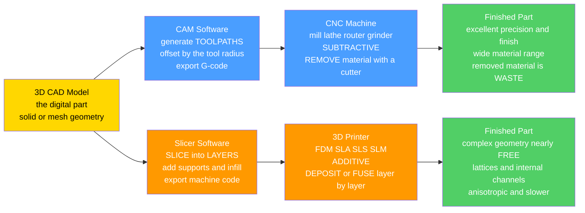

# 🏭 Additive and Subtractive Manufacturing

> [!abstract] TL;DR
> There are exactly **two computer-controlled philosophies for turning a 3D model into a precise physical part**. **Subtractive** manufacturing starts with a **solid blank and removes material** to reveal the part — a sculptor freeing a shape from marble; in practice this is **CNC (Computer Numerical Control) machining** (mills, lathes, routers, grinders) driven by **G-code toolpaths** generated from CAD, offering superb **precision, surface finish, and material range** but **wasting** the removed material and limited by **tool access**. **Additive** manufacturing starts with **nothing and builds the part up, layer by layer** — a printer stacking pancakes into a shape; this is **3D printing** (FDM, SLA, SLS, SLM) where **complexity is nearly free** (lattices, internal channels, organic topology-optimized forms) but the part is **slower, often anisotropic, needs supports**, and has limited materials and finish. Both flow from the same **3D CAD model** through a **digital thread** (CAD → CAM/slicer → machine), which is why manufacturing is now something you command from a keyboard — the backbone of aerospace, molds, automotive, medical, and on-demand production.

---

## Intuition

**Analogy:** Suppose you must make a precise, complicated part. There are two opposite ways to do it. You can **start with a block of material and carve away everything that isn't the part** — the way a sculptor attacks a slab of marble until only the statue remains. Or you can **start with nothing and build the part up in thin slices, one on top of the next** — the way you might stack pancakes of exactly the right shape until a solid form emerges. The first philosophy is **subtractive**; the second is **additive**.

The magic of modern manufacturing is that a **computer-controlled machine does either one with breathtaking precision, guided directly by a 3D model on a screen**. A **CNC mill** reads a program and drives a spinning cutter along thousands of tiny moves to carve the marble digitally; a **3D printer** reads a sliced model and lays down molten plastic or fuses metal powder line by line to print it. Digital carving and digital printing together turned making physical things into an act of **commanding a machine from a keyboard** — the heart of flexible, automated, on-demand production.

---

## How It Works

### Core Mechanics

1. **It all starts with a 3D CAD model.** Both paths begin with the same digital geometry — a solid model or mesh describing the finished part. Nothing downstream can be more accurate than this model; the model *is* the part.
2. **Subtractive path — CAM generates toolpaths.** **CAM (Computer-Aided Manufacturing)** software plans how a cutting tool of finite radius will sweep through the material. It emits **G-code**: a stream of coordinated axis moves (feeds, speeds, depths) offset outward from the part surface by the **tool radius** so the cutter *edge* — not its center — grazes the finished profile. Contour passes shape the outside; pocketing clears the inside; the machine carves in 3, 4, or 5 axes.
3. **Subtractive execution — remove material.** A **CNC machine** (mill, lathe, router, grinder) drives the tool along the path, and everything between the blank and the part becomes **chips (waste)**. Result: excellent dimensional **precision** and **surface finish** in real engineering **materials** (steel, aluminium, titanium, plastics) — but limited wherever the tool physically **cannot reach** (deep pockets, undercuts, fully internal features).
4. **Additive path — a slicer cuts the model into layers.** A **slicer** intersects the CAD model with a stack of horizontal planes, producing hundreds or thousands of **2D layer cross-sections**. For each layer it plans a perimeter, an infill pattern, and — critically — **support structures** anywhere the part **overhangs** empty space (material cannot be deposited onto air).
5. **Additive execution — deposit or fuse layer by layer.** A **3D printer** builds each slice in turn: extruding filament (**FDM**), curing liquid resin with light (**SLA/DLP**), or fusing powder with a laser (**SLS/SLM**). The part grows in the build (Z) direction. **Complexity is nearly free** — an internal lattice costs no more than solid — but the build is **slow**, mechanically **anisotropic** (weaker between layers), and needs **post-processing** (support removal, curing, machining critical surfaces).
6. **The digital thread ties it together.** CAD → CAM/slicer → machine is one seamless **digital-to-physical pipeline** (a pillar of Industry 4.0). The same model can be **milled** or **printed**; the choice is an engineering trade, not a data problem.

### Flow / Architecture



---

## Key Concepts

### Secondary (intuition)
- **Two opposite ideas.** Carve it out of a block (**subtractive**, like a sculptor) or build it up in layers (**additive**, like stacking pancakes or printing).
- **Both are told what to do by a 3D model.** You design the part on a computer; the machine reads it and makes it — no hand-shaping required.
- **CNC machining** spins a sharp tool that **cuts material away**; the shavings are thrown out as waste. It gives very smooth, very accurate parts.
- **3D printing** adds material a **thin layer at a time**, so it can make wildly complicated shapes — hollow insides, honeycomb fills — that carving simply cannot reach.
- **Neither is "better."** Machining wins on precision, finish, and volume; printing wins on complexity, customization, and fast prototypes.

### Undergraduate (the working theory)
- **The digital thread:** **CAD → CAM/slicer → machine**. CAM turns geometry into **G-code toolpaths** (offset by the cutter radius); a slicer turns the same geometry into **layers + supports + infill**. One model, two toolchains.
- **Subtractive = CNC machining:** milling (rotating cutter, stationary-ish part), turning/lathe (rotating part, stationary tool), routing, grinding. **Multi-axis** machines (3/4/5-axis) tilt the tool or part to reach faces a 3-axis machine cannot, expanding accessible geometry.
- **Tool access governs machinable geometry.** Undercuts, deep narrow pockets, and fully enclosed cavities are hard or impossible because a rigid tool must physically reach every cut surface.
- **Additive families:** **FDM/FFF** (extruded thermoplastic filament — cheap, ubiquitous), **SLA/DLP** (photopolymer **resin** cured by light — fine detail, smooth), **SLS** (powder-bed laser-**sintered** nylon — no supports needed, the powder bed self-supports), **SLM/DMLS** (laser-**melted** metal powder — real load-bearing metal parts), **binder jetting** (glue a powder bed, sinter later), and **DED** (directed energy deposition — blow powder/wire into a melt pool, for large parts and repair).
- **Supports and overhangs:** material cannot be deposited onto air, so **overhangs beyond a threshold angle** (commonly ~45° from vertical) need sacrificial **support structures**, later removed. Powder-bed processes (SLS) are an exception — the loose powder supports the part.
- **Anisotropy:** printed parts are typically **weaker across layers** (Z) than within a layer (XY) because inter-layer bonds are the weak link — a first-order design constraint, unlike (nearly) isotropic machined stock.

### Graduate (design, process, systems)
- **Toolpath strategy and G-code fidelity:** cutter-radius **compensation**, climb vs conventional milling, stepover/stepdown, chip load, and constant-engagement (trochoidal) paths trade **cycle time, tool life, surface finish, and residual stress**. 5-axis simultaneous machining minimizes setups and reaches complex aero/mold surfaces but demands rigorous **collision/gouge avoidance** in CAM.
- **AM physics and defects:** in **SLM/DMLS**, a moving laser melt pool sets thermal gradients that drive **residual stress, warping, porosity (keyholing/lack-of-fusion), and microstructure/anisotropy**; process qualification (energy density, scan strategy, hatch spacing, preheat, hot isostatic pressing) turns a print into a certified part.
- **Design for Additive Manufacturing (DFAM):** exploit AM's freedom deliberately — **topology optimization** for minimum-mass load paths, **lattices** for stiffness-to-weight and heat exchange, **part consolidation** (one printed assembly replacing dozens of fasteners), and **conformal cooling channels** in molds. The rule flips: complexity is cheap, but *volume, supports, and post-processing* are the cost drivers.
- **Metrology and the closed loop:** as-built parts are verified against the model with **GD&T**, CMMs, and CT scanning; deviations feed back into compensation. This is where the **digital thread** becomes a *digital twin*.
- **Hybrid manufacturing:** machines that combine **DED or powder-bed additive with subtractive milling** in one setup — print the near-net shape, then machine critical tolerances and finishes — capturing both paradigms' strengths (near-zero waste plus machined precision).
- **Economics:** machining cost scales with **removed volume and complexity**; AM cost scales with **build volume, height (time), and support/post-processing**, and is **near-flat in part complexity and lot size** — hence AM's edge for low-volume, customized, or highly complex parts and machining's edge at production volume in standard geometries.

---

## Python Demo

```python
# Additive vs Subtractive, side by side:
#   (a) SUBTRACTIVE / CNC TOOLPATH -- carve a 2D part from a solid blank.
#       A cutter of finite radius follows a CONTOUR path that is the part
#       boundary OFFSET OUTWARD by the tool radius, so its EDGE grazes the
#       finished profile. Everything between blank and part becomes WASTE.
#   (b) ADDITIVE / SLICING -- build a 3D part LAYER by LAYER. Slice a solid
#       with an OVERHANG into horizontal layers and add SUPPORT where the
#       part sticks out over empty space. Complexity here is "free".
# Requires: numpy, matplotlib
import numpy as np
import matplotlib.pyplot as plt

# ============================================================
# (a) SUBTRACTIVE: part boundary in polar form r(theta), a 3-lobed cam.
# ============================================================
theta  = np.linspace(0, 2*np.pi, 400)
r_part = 1.0 + 0.28*np.cos(3*theta)                 # lobed profile to machine
px, py = r_part*np.cos(theta), r_part*np.sin(theta)

# Outward unit normal of a CCW curve: rotate the tangent by -90 deg -> (dy, -dx)
dx, dy = np.gradient(px, theta), np.gradient(py, theta)
nrm    = np.hypot(dx, dy)
nx, ny = dy/nrm, -dx/nrm

R_tool = 0.12                                        # cutter radius
tool_x = px + R_tool*nx                              # tool-CENTER contour path
tool_y = py + R_tool*ny

margin = 0.25                                        # rectangular blank (stock)
x0, x1 = px.min()-margin, px.max()+margin
y0, y1 = py.min()-margin, py.max()+margin

def poly_area(x, y):                                 # shoelace area
    return 0.5*np.abs(np.dot(x, np.roll(y, -1)) - np.dot(y, np.roll(x, -1)))
A_part  = poly_area(px, py)
A_stock = (x1-x0)*(y1-y0)
waste   = 1.0 - A_part/A_stock                       # fraction machined away

# ============================================================
# (b) ADDITIVE: a "T"/anvil solid described by half-width hw(z):
#     narrow stem below, wide cap above -> the cap OVERHANGS the stem.
# ============================================================
layer_h = 0.05
z       = np.arange(0.0, 1.0 + layer_h, layer_h)
hw      = np.where(z < 0.5, 0.15, 0.45)              # stem 0.15, cap 0.45
sup_in, sup_out, sup_top = 0.15, 0.45, 0.5           # support band under the cap
n_layers = len(z) - 1

print("=== (a) SUBTRACTIVE / CNC machining ===")
print(f"  part area   : {A_part:6.3f}")
print(f"  blank area  : {A_stock:6.3f}")
print(f"  WASTE       : {100*waste:5.1f} percent of the blank becomes chips")
print(f"  tool radius : {R_tool}  -> toolpath is the profile offset OUTWARD")
print("=== (b) ADDITIVE / 3D printing ===")
print(f"  layers      : {n_layers}  x  {layer_h} mm  layer height")
print(f"  overhang    : cap half-width 0.45 over stem half-width 0.15")
print(f"  supports    : needed where |x| in [{sup_in}, {sup_out}] below z = {sup_top}")

# ------------------------------ plotting ------------------------------
fig, (axS, axA) = plt.subplots(1, 2, figsize=(14, 6.5))
fig.suptitle("Two Ways to Make a Part: CARVE it away  vs  BUILD it up",
             fontsize=15, fontweight="bold")

# (a) subtractive / CNC toolpath -----------------------------------------
axS.fill([x0, x1, x1, x0], [y0, y0, y1, y1], color="#cfcfcf", alpha=0.7,
         label="blank = stock (grey = WASTE)")
axS.fill(px, py, color="#51cf66", alpha=0.95, label="finished part")
axS.plot(px, py, color="#2b8a3e", lw=1.5)
axS.plot(tool_x, tool_y, "--", color="#ff6b00", lw=1.8,
         label=f"CNC tool-center path (R={R_tool})")
for i in range(0, len(theta), 45):                   # a few cutter circles
    axS.add_patch(plt.Circle((tool_x[i], tool_y[i]), R_tool,
                  color="#ff6b00", fill=False, lw=0.8, alpha=0.6))
axS.text(0, y0-0.18, f"{100*waste:.0f}% of the blank is machined AWAY as chips",
         ha="center", fontsize=9, color="#555")
axS.set_aspect("equal"); axS.grid(alpha=0.3)
axS.set_xlabel("x (mm)"); axS.set_ylabel("y (mm)")
axS.set_title("(a) SUBTRACTIVE / CNC: carve the part from a solid blank")
axS.legend(loc="upper right", fontsize=8)

# (b) additive / slicing + supports --------------------------------------
for zi, w in zip(z[:-1], hw[:-1]):                   # each printed layer
    axA.add_patch(plt.Rectangle((-w, zi), 2*w, layer_h*0.9,
                  facecolor="#4a9eff", edgecolor="white", lw=0.4))
for zi in z[z < sup_top]:                            # sacrificial supports
    axA.add_patch(plt.Rectangle((sup_in, zi), sup_out-sup_in, layer_h*0.9,
                  facecolor="none", edgecolor="#e64980", hatch="////", lw=0.3))
    axA.add_patch(plt.Rectangle((-sup_out, zi), sup_out-sup_in, layer_h*0.9,
                  facecolor="none", edgecolor="#e64980", hatch="////", lw=0.3))
axA.annotate("OVERHANG\n(cap sticks out\nover empty space)",
             xy=(0.44, 0.51), xytext=(0.58, 0.72), fontsize=8,
             arrowprops=dict(arrowstyle="->", color="#e64980"))
axA.text(0.0, -0.11,
         f"{n_layers} layers x {layer_h} mm   |   pink hatch = SUPPORT (removed after)",
         ha="center", fontsize=9, color="#555")
axA.set_xlim(-0.75, 0.95); axA.set_ylim(-0.16, 1.06)
axA.set_aspect("equal"); axA.grid(alpha=0.3)
axA.set_xlabel("x (mm)"); axA.set_ylabel("z = build height (mm)")
axA.set_title("(b) ADDITIVE / SLICING: build the part layer by layer")

plt.tight_layout(rect=[0, 0, 1, 0.95])
plt.show()
```

**What it shows:** In panel **(a)** the finished part (green) sits inside a rectangular **blank** (grey); the dashed **CNC toolpath** is the part boundary **offset outward by the tool radius**, so the cutter *edge* traces the true profile while its center rides outside — and everything grey is **machined away as waste** (the printout reports the waste fraction). In panel **(b)** the same class of part is instead **sliced into horizontal layers** and grown bottom-up; where the wide **cap overhangs** the narrow stem, the model can't print onto air, so **sacrificial support** (pink hatch) is added below the overhang and removed afterward. The contrast is the whole story: subtractive **removes** material and pays in **waste and tool access**, while additive **adds** material and pays in **layers, supports, and anisotropy** — but makes overhanging, hollow, complex geometry almost for free.

---

## Real-World Applications

> **Example (Subtractive):** A **titanium aerospace bracket** or an **injection-mold cavity** is CNC-machined on a 5-axis mill because the application demands micron-level tolerances, a mirror surface finish, and certified aerospace-grade metal — exactly what a rigid cutter and rigid stock deliver. The mold's steel is machined from a solid block; the removed material is recycled as swarf.

> **Example (Additive):** **GE Aviation's LEAP fuel nozzle** consolidated ~20 separately machined and brazed parts into **one DMLS (laser powder-bed) metal print** with internal cooling passages no cutter could reach — lighter, more durable, and impossible to machine. In medicine, **custom titanium implants and dental crowns** are printed per-patient from a scan; in aerospace, **topology-optimized lattice brackets** shed weight a subtractive part cannot.

- **Precision production (subtractive):** engine blocks, gears, shafts, turbine disks, medical instruments, and molds/dies — the backbone of high-volume, high-tolerance manufacturing.
- **Rapid prototyping (additive):** design teams print a form-and-fit prototype overnight instead of waiting days for a machined one — iteration speed is the payoff.
- **Tooling and jigs (additive):** printed fixtures, jigs, and conformal-cooling mold inserts made on demand.
- **Mass customization (additive):** hearing aids, orthodontic aligners, and prosthetics — millions of unique parts from unique scans.
- **Hybrid / repair (both):** DED rebuilds worn turbine blades, then a mill finishes the restored surface to spec — additive and subtractive in one workflow.

---

## Common Pitfalls

- **Treating additive and subtractive as rivals rather than a toolkit.** They are complementary. **Subtractive (CNC machining)** wins on **precision, surface finish, material range, and production volume** in standard geometries; **additive (3D printing)** wins on **complexity, part consolidation, customization, and low-volume speed**. Mature shops choose per part — or combine them in **hybrid** machines.
- **Ignoring that removed material is waste (subtractive).** Machining a small part from a large billet ("buy-to-fly" ratio in aerospace can exceed 10:1) throws most of an expensive alloy away as chips. When waste dominates cost, near-net additive or casting may win.
- **Forgetting tool access limits machinable geometry (subtractive).** Undercuts, deep narrow pockets, and fully internal channels can be impossible for a rigid cutter. Undetected until CAM, this forces redesign, more setups, or EDM. Multi-axis machining helps but does not remove the constraint.
- **Assuming printed parts are isotropic (additive).** FDM and many AM parts are **weaker between layers**; a load applied across the build (Z) direction can fail far below the in-plane strength. Orient the print so tensile loads run *within* layers, and treat inter-layer bonding as the design-limiting property.
- **Neglecting supports and overhangs (additive).** Overhangs beyond the threshold angle sag or fail without **support structures**, which then cost time, material, and messy post-processing (and can mar the surface where removed). Powder-bed SLS is the exception — the powder self-supports.
- **Underestimating post-processing (additive).** "Printed" rarely means "finished": support removal, resin curing, powder removal, stress relief / HIP for metals, and machining of critical mating surfaces are real, often dominant, steps in cost and lead time.
- **Confusing the AM processes.** **FDM/FFF** (filament — cheap, coarse), **SLA/DLP** (resin — fine detail), **SLS** (nylon powder — no supports), **SLM/DMLS** (laser-melted metal — real metal, needs supports and stress relief), **binder jetting** (glue then sinter), **DED** (blown powder/wire — large parts, repair). Each has its own materials, tolerances, and failure modes; picking the wrong one wastes the whole build.
- **Designing an additive part like a machined one (missing DFAM).** Merely printing a design meant for milling ignores AM's advantages. **Design for Additive Manufacturing (DFAM)** deliberately uses lattices, topology optimization, internal channels, and part consolidation — and minimizes supports and build height to control cost.
- **Chasing the wrong metric for lot size.** Machining amortizes setup over volume and gets cheaper per part at scale; AM cost is nearly **flat in quantity and complexity** but high per part. Use AM for one-offs, prototypes, and complex low-volume parts; use machining/molding for production runs.

---

## Related Concepts

- [[Mechanical_Engineering_Overview]] — Design & Manufacturing is one of the six ME sub-disciplines; this note is where analysis becomes a physical artifact via the digital thread.
- [[Failure_Fatigue_and_Fracture]] — additive parts' **anisotropy** and inter-layer bonds create direction-dependent fatigue/fracture behavior that governs certification of load-bearing prints.
- [[Composite_Materials_and_Fiber_Reinforcement]] — like laminated composites, layer-by-layer AM builds **anisotropic** parts whose strength depends on build/fiber direction; the mechanics carry over directly.
- [[Polymer_Structure_and_Glass_Transition]] — FDM extrudes **thermoplastics** whose glass-transition and melt behavior set printability, inter-layer welding, and warping.
- [[Nanofabrication_and_Self_Assembly]] — the same additive (bottom-up build-up) vs subtractive (top-down etch-away) dichotomy governs fabrication at the **nanoscale**, mirroring macro-scale AM/CNC.
- [[Bezier_and_Bsplines]] — the parametric curves and surfaces that define the **CAD geometry** both CAM toolpaths and slicers consume upstream.
- [[Actuators_Sensors_and_Embedded_Robotics]] — CNC axes and printer gantries are precisely the **actuated, feedback-controlled motion systems** that execute G-code and layer paths.

*(Siblings referenced in prose — Manufacturing_Processes, Machine_Design_Principles, CAD_CAE_and_Finite_Element_Method, GD_and_T_and_Metrology, and Engineering_Materials_and_Selection — will be wikilinked once those notes exist.)*

---

## Review Questions

1. **(Secondary)** Explain, using the sculptor-and-pancakes analogy, the difference between subtractive and additive manufacturing. Give one everyday reason you might choose a 3D printer over a CNC mill, and one reason you might choose the mill instead.
2. **(Undergraduate)** A hollow bracket must contain an **internal cooling channel** that spirals through its interior, and only 20 units are needed. Which paradigm and which specific process would you pick, and why? Explain how **tool access** rules out machining the internal channel, and what **supports** and **anisotropy** you would have to plan for in the additive route.
3. **(Graduate)** You must produce 5,000 titanium engine brackets to aerospace tolerances. Compare **CNC machining from billet**, **SLM (laser powder-bed) additive + finish machining (hybrid)**, and **casting + machining** on cost drivers (removed-volume waste / buy-to-fly, build time, supports, residual stress and HIP, post-machining, and lot size). Under what production volume and geometry complexity does the additive/hybrid route become the rational choice, and how would **DFAM** (topology optimization, part consolidation) shift that break-even?

---

## Sources

- I. Gibson, D. Rosen, B. Stucker & M. Khorasani — *Additive Manufacturing Technologies*, 3rd ed. (Springer, 2021)
- S. Kalpakjian & S. R. Schmid — *Manufacturing Engineering and Technology*, 8th ed. (Pearson, 2020)
- M. P. Groover — *Fundamentals of Modern Manufacturing: Materials, Processes, and Systems*, 7th ed. (Wiley, 2020)
- P. Smid — *CNC Programming Handbook*, 3rd ed. (Industrial Press, 2007)
- ISO/ASTM 52900 — *Additive Manufacturing — General Principles — Terminology* (standard defining the seven AM process categories)

---

#mechanical-engineering #3d-printing #cnc-machining #additive-manufacturing #manufacturing
