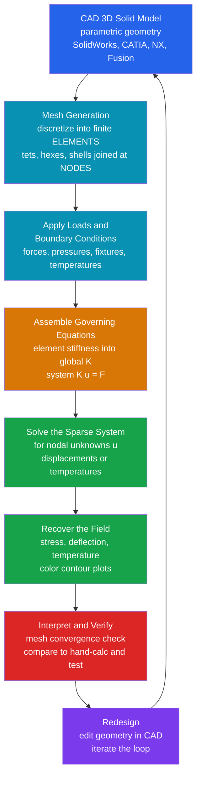

# 🖥️ CAD, CAE and the Finite Element Method

> [!abstract] TL;DR
> Before any metal is cut, a modern part is *designed* and *tested* entirely inside a computer. **CAD** (Computer-Aided **Design**) builds the geometry as a parametric 3D **solid model**; **CAE** (Computer-Aided **Engineering**) then *simulates* how that model behaves — where it bends, breaks, overheats, vibrates, or how air flows over it — long before a physical prototype exists. The workhorse behind most structural and thermal CAE is the **Finite Element Method (FEM/FEA)**: chop the complicated continuous part into millions of tiny simple pieces called **elements** (a **mesh** of nodes), approximate the unknown field on each, write each element's physics as a small **stiffness** matrix, **assemble** them into one giant sparse system $\mathbf{K}\mathbf{u} = \mathbf{F}$, apply loads and boundary conditions, and solve for the nodal displacements or temperatures. The two rules that separate an engineer from a colorful-picture generator: **check mesh convergence** (refine until the answer stops changing) and remember **garbage in, garbage out** — a wrong boundary condition gives a confident wrong answer. An FEA result is *not automatically correct*; it must be **verified** against hand calculations, intuition, or experiment.

---

## Intuition

**Analogy first.** Imagine you could build your design, load it, heat it, crash it, and flow air over it — a thousand times — without ever touching a machine tool or spending a dollar on material. That is exactly what CAD and CAE let you do: first you *draw* the part in 3D on the screen (CAD), then you *virtually test* it (CAE) by pushing, pulling, heating, and shaking the digital model to see precisely where it would bend, break, or overheat. Every car crash-tested for a safety rating, every aircraft wing certified for flight, and every phone case dropped for durability is tested thousands of times inside a computer before a single physical copy exists.

But how do you compute the stress in a shape as messy as an engine block or a turbine blade, where no textbook formula applies? The trick is **divide and conquer**. You cannot solve the physics of the whole curvy part at once, so you *chop it into millions of tiny, simple pieces* — little triangles, tetrahedra, or bricks called **finite elements**. On each tiny piece the physics is easy: a simple straight-line approximation of how it stretches or heats up. Then you **stitch** all those easy local answers together at the shared corners (**nodes**) into one enormous system of equations and solve it. Like approximating a smooth curve with many short straight segments, the patchwork of simple pieces hugs the true, complicated answer — and the more pieces you use, the closer it gets. That single idea — *approximate the hard whole by assembling many easy parts* — is the Finite Element Method, and it is how essentially all modern mechanical engineering analysis is done.

---

## How It Works

### Core Mechanics

The CAD-to-answer pipeline is a disciplined loop. Six moves take you from a drawing to a verified stress plot.

1. **Model the geometry (CAD).** Build the part as a parametric 3D **solid model** in a CAD system (SolidWorks, CATIA, NX, Creo, Fusion). "Parametric" means the model is driven by dimensions and features you can change; associative drawings and assemblies update automatically. This master digital model is the single source of truth that feeds simulation (CAE) and manufacturing (CAM alike) — the **digital thread**.

2. **Discretize into a mesh (pre-processing).** The continuous solid is partitioned into non-overlapping **elements** — tetrahedra or hexahedra for solids, triangles or quads for shells/surfaces — joined at **nodes**. This *meshing* step is where any geometry, however curved or irregular, becomes something the computer can handle. Meshing is an **art**: element type, size, and quality matter, and the mesh must be refined near **stress concentrations** (fillets, holes, sharp corners) where the field changes fast.

3. **Approximate the field per element.** Inside each element the unknown field — displacement, temperature — is written as a weighted sum of simple **shape functions** (usually linear or quadratic polynomials). The *weights are just the nodal values*, which are the numbers the engineer ultimately wants.

4. **Build and assemble $\mathbf{K}\mathbf{u} = \mathbf{F}$.** The governing physics on each element becomes a small **element stiffness matrix** relating its nodal forces to its nodal displacements. These are **scatter-added** into a giant, mostly-empty (**sparse**) **global stiffness matrix** $\mathbf{K}$; loads and sources form the **load vector** $\mathbf{F}$. The result is one linear system: stiffness $\times$ nodal unknowns $=$ loads.

5. **Apply boundary conditions and solve.** Constraints (fixtures, prescribed temperatures) and loads (forces, pressures, heat flux) are imposed. This is the **single most error-prone step** — a wrong constraint quietly produces a confident wrong answer. The assembled sparse system $\mathbf{K}\mathbf{u} = \mathbf{F}$ is then solved (direct or iterative sparse solvers) for the nodal values.

6. **Recover results and verify (post-processing).** From the nodal displacements the solver recovers **strains, stresses, and heat flux**, rendered as color contour plots. Then the real engineering begins: **check mesh convergence**, sanity-check against a hand calculation or physical intuition, and only then trust the number — or change the CAD model and iterate.

### Flow / Architecture



---

## Key Concepts

### Secondary Level

- **Design it, then test it — all on a computer.** CAD is *drawing* the part in 3D; CAE is *virtually testing* it (pushing, heating, flowing air) before you build anything.
- **Divide and conquer.** You cannot solve a complicated shape all at once, so you cut it into millions of tiny simple pieces (**elements**), solve the easy physics on each, and stitch them together.
- **The mesh.** Those pieces form a **mesh**, connected at corner points called **nodes**. The computer finds the answer at every node.
- **More pieces = more accurate (and more compute).** A finer mesh gives a better answer but takes longer. You must **check** that using more pieces stops changing the result.
- **The computer only answers what you ask.** Tell it the wrong loads or supports and it confidently gives you the wrong answer — *garbage in, garbage out*.

### Undergraduate Level

- **CAD vs CAE vs CAM.** CAD = Computer-Aided **Design** (the 3D solid model and drawings). CAE = Computer-Aided **Engineering** (simulation/analysis). CAM = Computer-Aided **Manufacturing** (toolpaths for CNC/3D printing). One model feeds all three — the digital thread.
- **The FEM recipe.** Discretize the domain into elements → approximate the field with shape functions → form each element's stiffness matrix → **assemble** into global $\mathbf{K}$ → apply loads $\mathbf{F}$ and boundary conditions → solve $\mathbf{K}\mathbf{u} = \mathbf{F}$ → recover stresses/strains/flux.
- **Stiffness matrix $\mathbf{K}$.** For a linear-elastic structure, $\mathbf{K}$ encodes how nodes resist displacement; it is **symmetric, positive-definite, and sparse**. A rigid-body mode (an under-constrained part) makes $\mathbf{K}$ singular — the solver fails or returns nonsense.
- **Analysis types.** *Structural* (stress, deflection, **modal**/natural-frequency, **buckling**), *thermal* (conduction/convection), *fluid* (**CFD**), *electromagnetic*, and coupled **multiphysics** (e.g. thermal stress). Modal and buckling analyses solve the generalized eigenproblem $\mathbf{K}\mathbf{u} = \lambda \mathbf{M}\mathbf{u}$.
- **Meshing and convergence.** Element type/size/quality drive accuracy; refine near stress concentrations. **Mesh convergence** — refine until the quantity of interest stabilizes — is mandatory. An under-refined mesh *lies*, typically **under-predicting** peak stress.
- **Static vs dynamic; linear vs nonlinear.** Static ignores inertia; dynamic/transient/modal do not. Linear assumes small deflection, linear-elastic material, and fixed contact; **nonlinear** handles large deflection, **contact**, and material **plasticity/yield**.
- **The golden rule.** *An answer is not the answer.* Always **verify** an FEA result against a hand calculation, first-principles estimate, or experiment before trusting it.

### Graduate Level

- **Weak form and Galerkin foundation.** FEM does not solve the PDE pointwise (the "strong form"); it multiplies by a test function and integrates (the **weak/variational form**), which for elasticity is equivalent to the **principle of minimum potential energy**. This is the rigorous basis explored in the companion computational note.
- **Element technology and locking.** Isoparametric mapping, quadrature-order selection, and the pathologies that plague low-order elements: **shear locking** (spuriously stiff bending), **volumetric locking** (near-incompressibility), and **hourglassing** (zero-energy modes under reduced integration). Remedies: higher-order elements, reduced/selective integration, mixed (displacement–pressure) formulations.
- **Error control.** *A priori* estimates ($\|u - u_h\| \le C h^{p}$) tie error to element size $h$ and polynomial order $p$; *a posteriori* estimators localize error per element to drive **adaptive h/p refinement** — turning "refine the mesh" from art into a certifiable procedure.
- **Nonlinear and transient solution.** Geometric nonlinearity (large deflection/follower loads), material nonlinearity (plasticity, hyperelasticity, creep), and contact are solved by **Newton–Raphson** iteration wrapping a sequence of sparse linear solves; transient dynamics use implicit (unconditionally stable) or explicit (conditionally stable, ideal for crash/impact) time integration.
- **Solver coupling.** Because $\mathbf{K}$ is SPD for elliptic problems, **Cholesky** and **preconditioned Conjugate Gradient** dominate; the sparsity and conditioning set the practical size limit, connecting FEM directly to numerical linear algebra.
- **Optimization and the digital twin.** **Topology optimization** lets the solver decide the optimal material layout for stiffness-per-weight, producing organic, often 3D-printed shapes; **generative design** automates the whole loop; a **digital twin** keeps a live simulation synchronized with sensor data from the physical asset.

---

## Python Demo

```python
# CAD/CAE/FEM demo: a minimal structural FINITE-ELEMENT solver for an
# axially-loaded TAPERED BAR, plus a MESH-CONVERGENCE study.
#
#   Physics: a bar fixed at x=0, pulled by a tip load P at x=L, with a
#   cross-section that grows linearly  A(x) = A0 * (1 + x/L)  (taper = 1).
#   Governing law:  d/dx( E A(x) du/dx ) = 0 ,  u(0)=0 ,  E A(L) u'(L) = P.
#   Because the internal force is constant (=P) but the area grows, the EXACT
#   displacement is LOGARITHMIC:  u(x) = (P L)/(E A0) * ln(1 + x/L).
#   Straight (linear) finite elements can only APPROXIMATE that curve, so the
#   tip deflection genuinely CONVERGES as we add elements -> a real mesh study.
#
#   We: (a) DISCRETIZE [0,L] into elements, build each element STIFFNESS
#          k_e = E*A_e/h, ASSEMBLE the global sparse-pattern K, apply the
#          fixed-end BC and tip load F, and SOLVE K u = F for nodal u;
#       (b) plot the deformed field (FEM vs exact) and the axial stress; and
#       (c) refine the mesh and plot the tip-deflection error CONVERGING to 0.
import numpy as np
import matplotlib.pyplot as plt

# ---- physical parameters (SI units) ----
L, E, A0, P, taper = 1.0, 200e9, 1.0e-4, 10.0e3, 1.0   # steel bar, 100 mm^2, 10 kN

area   = lambda x: A0 * (1.0 + taper * x / L)                    # tapered area
u_exact= lambda x: (P * L) / (E * A0 * taper) * np.log(1 + taper*x/L)  # exact field
u_tip_exact = u_exact(L)                                          # convergence target

def fem_bar(n_elem):
    """Linear (2-node) FEM for the tapered axial bar. Returns nodes, nodal u."""
    nodes = np.linspace(0.0, L, n_elem + 1)
    nn    = n_elem + 1
    K     = np.zeros((nn, nn))          # global stiffness (sparse in pattern)
    F     = np.zeros(nn)                # global load vector
    for e in range(n_elem):                         # loop over ELEMENTS
        i, j   = e, e + 1                            # the two local nodes
        h      = nodes[j] - nodes[i]
        Ae     = area(0.5 * (nodes[i] + nodes[j]))   # area at element midpoint
        ke     = (E * Ae / h) * np.array([[1.0, -1.0],
                                          [-1.0,  1.0]])   # element STIFFNESS
        K[np.ix_([i, j], [i, j])] += ke              # ASSEMBLE (scatter-add)
    F[-1] = P                                        # tip axial load at last node
    # Boundary condition: node 0 is FIXED (u=0). Solve the free (1..n) block.
    free      = np.arange(1, nn)
    u         = np.zeros(nn)
    u[free]   = np.linalg.solve(K[np.ix_(free, free)], F[free])   # SOLVE K u = F
    return nodes, u

# ---- (a) coarse mesh for display ----
nd_c, u_c = fem_bar(4)

# ---- (c) mesh-convergence study: refine and watch the error shrink ----
elem_counts = np.array([1, 2, 4, 8, 16, 32, 64, 128, 256])
hs, err     = [], []
for n in elem_counts:
    nd, u = fem_bar(n)
    hs.append(L / n)
    err.append(abs(u[-1] - u_tip_exact))            # tip-deflection error
hs, err = np.array(hs), np.array(err)
rate = np.polyfit(np.log(hs[:-1]), np.log(err[:-1]), 1)[0]   # measured order
print(f"exact tip deflection      = {u_tip_exact*1e3:.4f} mm")
print(f"coarse (4-elem) tip defl. = {u_c[-1]*1e3:.4f} mm  "
      f"(error {abs(u_c[-1]-u_tip_exact)*1e3:.4f} mm)")
print(f"measured convergence rate ~ h^{rate:.2f}  (midpoint-area scheme -> ~2)")

# ================= visualization =================
fig, ax = plt.subplots(2, 2, figsize=(13, 9))

# (1) the discretization: tapered bar drawn as its mesh of elements
xx = np.linspace(0, L, 200)
ax[0, 0].fill_between(xx,  0.5*area(xx)/A0, -0.5*area(xx)/A0, color="#93c5fd", alpha=0.6)
for xn in nd_c:                                      # element boundaries (nodes)
    ax[0, 0].plot([xn, xn], [-0.5*area(xn)/A0, 0.5*area(xn)/A0], "k-", lw=1.2)
ax[0, 0].plot(nd_c, np.zeros_like(nd_c), "ro", ms=6, label="nodes")
ax[0, 0].set_title("(1) CAD geometry -> MESH of 4 finite elements")
ax[0, 0].set_xlabel("x  [m]"); ax[0, 0].set_ylabel("half-width  A(x)/A0")
ax[0, 0].legend(); ax[0, 0].set_aspect("auto"); ax[0, 0].grid(alpha=0.3)

# (2) deformed field: FEM piecewise-linear vs exact logarithmic curve
xf = np.linspace(0, L, 400)
ax[0, 1].plot(xf, u_exact(xf)*1e3, "k--", lw=2, label="exact (logarithmic)")
ax[0, 1].plot(nd_c, u_c*1e3, "o-", color="crimson", lw=2, ms=6,
              label="FEM (4 linear elements)")
ax[0, 1].set_title("(2) Deformed field: nodal displacement u(x)")
ax[0, 1].set_xlabel("x  [m]"); ax[0, 1].set_ylabel("displacement u  [mm]")
ax[0, 1].legend(); ax[0, 1].grid(alpha=0.3)

# (3) axial stress sigma = P/A(x): FEM per-element (constant) vs exact
ax[1, 0].plot(xf, P/area(xf)/1e6, "k--", lw=2, label="exact  sigma = P/A(x)")
for e in range(len(nd_c) - 1):                       # FEM strain is const/element
    xm  = 0.5*(nd_c[e] + nd_c[e+1])
    sig = E * (u_c[e+1] - u_c[e]) / (nd_c[e+1] - nd_c[e]) / 1e6   # MPa
    ax[1, 0].plot([nd_c[e], nd_c[e+1]], [sig, sig], color="#d97706", lw=3)
ax[1, 0].plot([], [], color="#d97706", lw=3, label="FEM (piecewise constant)")
ax[1, 0].set_title("(3) Recovered axial stress along the bar")
ax[1, 0].set_xlabel("x  [m]"); ax[1, 0].set_ylabel("stress  [MPa]")
ax[1, 0].legend(); ax[1, 0].grid(alpha=0.3)

# (4) MESH CONVERGENCE: tip-deflection error vs number of elements
ax[1, 1].loglog(elem_counts, err*1e3, "o-", color="#2563eb", label="tip-deflection error")
ax[1, 1].loglog(elem_counts, err[0]*1e3*(elem_counts[0]/elem_counts)**2, "--",
                color="gray", label="slope -2 reference")
ax[1, 1].set_title(f"(4) Mesh convergence: finer mesh -> true answer (~h^{rate:.1f})")
ax[1, 1].set_xlabel("number of elements"); ax[1, 1].set_ylabel("error  [mm]")
ax[1, 1].legend(); ax[1, 1].grid(alpha=0.3, which="both")

plt.tight_layout()
plt.savefig("cad_cae_fem_demo.png", dpi=120)
print("\nSaved figure -> cad_cae_fem_demo.png")
```

**What it shows.** Panel (1) turns the CAD geometry of a tapered bar into a **mesh** of four finite elements joined at nodes. Panel (2) overlays the FEM piecewise-linear displacement on the exact *logarithmic* curve — straight elements can only approximate the true curved answer. Panel (3) recovers the axial stress $\sigma = P/A(x)$: the FEM stress is *constant within each element* (linear elements have constant strain), stair-stepping around the smooth exact curve. Panel (4) is the whole point of a **mesh-convergence study**: as the element count grows the tip-deflection error falls along a clean slope, converging toward the true answer — proving that a finer mesh buys accuracy (at more compute) and that you must **always check convergence** rather than trust a single mesh.

---

## Real-World Applications

> **Example:** When an automaker runs a **virtual crash test**, an explicit-dynamics FEA code (LS-DYNA, Abaqus/Explicit) meshes the entire body-in-white into millions of shell and solid elements, each carrying an elastic-plastic steel or foam material model. At every microsecond the solver assembles internal forces from element stresses, marches the nodal accelerations forward, and watches the crumple zones fold — pinpointing where metal yields and how much crash energy is absorbed. Thousands of such crashes are run *before a single physical prototype is built*, slashing cost and development time while satisfying safety regulations that would be ruinous to test by destroying real cars alone.

- **Structural design.** Stress and deflection of brackets, frames, chassis, pressure vessels, and machine parts against strength and stiffness limits; **modal** analysis to keep natural frequencies away from operating speeds; **buckling** analysis of slender columns and thin panels — the daily bread of the design engineer.
- **Aerospace.** Wing and fuselage stress/fatigue, aeroelastic flutter, bird-strike, and landing-gear loads — certified largely by simulation, with physical tests reserved for validation of the model.
- **Thermal and multiphysics.** Conduction and convection in engine blocks, electronics heat sinks, and turbine blades; **thermal-stress** coupling where heating drives deformation and stress.
- **Fluids (CFD).** External aerodynamics (drag, lift, cooling airflow) and internal flow (manifolds, pumps, HVAC ducts) solved by the finite-volume cousin of FEM.
- **Biomedical.** Stress in bones, dental and orthopedic **implants**, and stents — meshed directly from patient CT/MRI scans.
- **The CAD–CAE–CAM digital thread and topology optimization.** One parametric master model flows from design (SolidWorks, CATIA, NX) to simulation (ANSYS, Abaqus, COMSOL, Nastran) to manufacturing toolpaths; **topology optimization** and generative design then let the computer sculpt organic, minimum-weight, often 3D-printed shapes such as aerospace brackets and lattice structures.

---

## Common Pitfalls

- **Confusing CAD, CAE, and CAM.** CAD is *design* (the parametric 3D solid model and drawings), CAE is *engineering analysis/simulation*, CAM is *manufacturing* (toolpaths). They share one digital model but answer different questions — do not conflate "I modeled it" with "I analyzed it."
- **Wrong boundary conditions and loads — the #1 FEA error.** *Garbage in, garbage out.* An over-constrained fixture invents artificial stiffness; an under-constrained part leaves $\mathbf{K}$ singular (rigid-body motion) and the solve fails or returns nonsense. A misapplied load or a fixture that does not match reality yields a **confident wrong answer** that looks perfectly plausible.
- **Skipping the mesh-convergence check.** A single mesh gives *a* number, not *the* number. An under-refined mesh systematically **under-predicts peak stress** at fillets, holes, and re-entrant corners — the exact **stress concentrations** where failures start. Always refine (h) or raise element order (p) until the quantity of interest stabilizes.
- **Poor mesh quality.** Long, thin, or highly distorted elements (bad aspect ratio, sliver angles) wreck accuracy and conditioning. Coarse tets in a bending-dominated region give badly wrong displacements. Refine locally where the field changes fast; do not just globally shrink everything (compute cost explodes as $h^{-3}$ in 3D).
- **Trusting the pretty color plot.** A smooth, vivid contour plot feels authoritative but can be entirely wrong if the model, mesh, or boundary conditions are flawed. *An answer is not the answer* — always **verify** against a hand calculation, order-of-magnitude estimate, or physical test.
- **Using a linear analysis where the physics is nonlinear.** Linear static analysis assumes small deflection, linear-elastic material, and unchanging contact. Large deflection (a fishing rod), **contact** (a snap-fit, a bolted joint), material **yield/plasticity**, or **buckling** all demand nonlinear analysis; running linear there gives dangerously optimistic results.
- **Static when it should be dynamic (or vice versa).** Impact, vibration, rotating machinery, and transient thermal shock need dynamic/modal/transient analysis; forcing them into a static model misses inertia, resonance, and time history entirely.
- **Element-technology traps.** Low-order elements suffer **shear locking** in bending and **volumetric locking** near incompressibility (rubber), or **hourglassing** under reduced integration — all producing wrong stiffness. Choose the right element family for the physics.

---

## Related Concepts

- [[Computational_Physics/03_PDEs_and_Field_Simulation/The_Finite_Element_Method|The Finite Element Method]] — the numerical-methods deep-dive: weak/variational form, Galerkin/Ritz, shape functions, and rigorous error estimates behind the engineering FEA used here.
- [[Mathematics/03_Linear_Algebra/Systems_of_Linear_Equations|Systems of Linear Equations]] — assembly produces the giant system $\mathbf{K}\mathbf{u} = \mathbf{F}$; how it is solved is exactly the theory of linear systems.
- [[Mathematics/16_Numerical_Methods/Numerical_Linear_Algebra|Numerical Linear Algebra]] — $\mathbf{K}$ is large and **sparse**; sparse direct (Cholesky) and iterative (preconditioned CG) solvers are what make industrial-scale FEA feasible.
- [[Computational_Physics/03_PDEs_and_Field_Simulation/The_Poisson_and_Laplace_Equation|The Poisson and Laplace Equation]] — the model elliptic PDE that steady heat conduction and many thermal-CAE problems reduce to, discretized by the same FEM machinery.
- [[Fluid_Dynamics/06_Computation_and_Applications/Computational_Fluid_Dynamics|Computational Fluid Dynamics]] — the fluid branch of CAE: the finite-volume relative of FEM used for aerodynamics, cooling, and internal flow.

*Sibling notes in Mechanical Engineering, referenced in prose: Machine Design Principles (FEA is how design candidates get stress-checked), Bending and Beam Theory and Stress, Strain and Deformation (the mechanics-of-materials constitutive laws that structural FEA assembles into element stiffness), Conduction Heat Transfer (the governing law of thermal CAE), and Mechanical Vibrations (whose natural frequencies are found by the modal eigenproblem $\mathbf{K}\mathbf{u} = \lambda \mathbf{M}\mathbf{u}$).*

---

## Review Questions

1. **(Secondary)** Explain, using the "divide and conquer" idea, why an engineer can find the stress in a complicated engine block on a computer even though no single textbook formula applies. What does making the mesh finer do to the accuracy — and to the compute time?
2. **(Undergraduate)** Distinguish CAD, CAE, and CAM, then list the six steps that take a CAD solid model to a verified stress plot. At which step is $\mathbf{K}\mathbf{u} = \mathbf{F}$ formed, and why is $\mathbf{K}$ sparse?
3. **(Undergraduate)** Your first FEA run of a bracket reports a peak stress of 180 MPa on a coarse mesh. What single check must you perform before believing it, and in which direction is a coarse mesh most likely to be *wrong* at the fillet? Describe how you would carry out that check.
4. **(Undergraduate/Graduate)** A colleague constrains all six faces of a part "to be safe" and applies a load, getting a very low stress. Explain how this boundary-condition choice produces a confident *wrong* answer, and contrast it with the failure mode of an *under-constrained* model.
5. **(Graduate)** For each scenario choose static/dynamic and linear/nonlinear analysis and justify it: (a) natural frequencies of a turbine disk, (b) a snap-fit plastic clip being pushed home, (c) crush of an aluminium crash tube, (d) thermal stress in a heated exhaust manifold. Where would you expect element **locking** to threaten accuracy, and how would you counter it?

---

## Sources

- Cook, R. D., Malkus, D. S., Plesha, M. E. & Witt, R. J. — *Concepts and Applications of Finite Element Analysis*, 4th ed. (Wiley, 2002). The standard engineering FEA text: element formulation, assembly, modeling practice, and pitfalls.
- Logan, D. L. — *A First Course in the Finite Element Method*, 6th ed. (Cengage, 2016). Accessible bar/truss/beam-first introduction to stiffness assembly and $\mathbf{K}\mathbf{u} = \mathbf{F}$.
- Zienkiewicz, O. C., Taylor, R. L. & Zhu, J. Z. — *The Finite Element Method: Its Basis and Fundamentals*, 7th ed. (Butterworth-Heinemann, 2013). The classic comprehensive reference.
- Bathe, K.-J. — *Finite Element Procedures*, 2nd ed. (Prentice Hall / K. J. Bathe, 2014). Definitive treatment of nonlinear, dynamic, and element-technology procedures.
- Hughes, T. J. R. — *The Finite Element Method: Linear Static and Dynamic Finite Element Analysis* (Dover, 2000). Rigorous formulation and element technology.

---

#mechanical-engineering #cad #finite-element-method #fea #simulation
