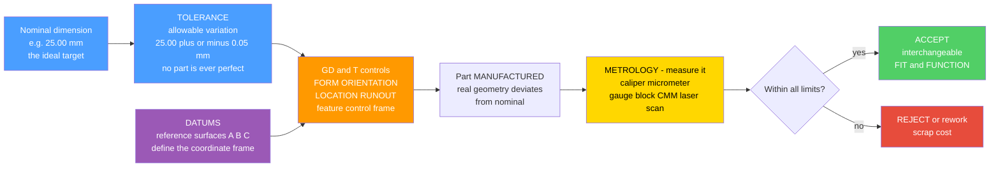

# 📐 GD&T and Metrology

> [!abstract] TL;DR
> **No manufactured part is ever dimensionally perfect** — every feature carries some variation — so a design must specify **how much** variation is acceptable while the part still **fits and functions**. A **tolerance** is the allowable range on a dimension (e.g. $25.00 \pm 0.05$ mm); a **fit** between mating parts is engineered as **clearance** (always a gap), **interference** (always a press), or **transition** (either). **GD&T** (Geometric Dimensioning & Tolerancing, per **ASME Y14.5**) is a precise *symbolic language* that controls the allowable **geometry** — form, orientation, location, runout — of features relative to reference **datums**, giving more usable tolerance than plain plus/minus. **Tolerance stack-up analysis** predicts assembly variation two ways: **worst-case** (sum of tolerances — safe but expensive) and **statistical / RSS** (root-sum-square — much tighter, cheaper). **Metrology** is the science of *measuring* it — from calipers and micrometers to **CMMs** and laser scanners, backed by calibration, traceability, and **process capability** ($C_p/C_{pk}$). Together they are what make **interchangeable parts** and global supply chains work.

---

## Intuition

**Analogy first.** No part can be made *perfectly* — every dimension comes off the machine with some error. So the real design question is never "make it exactly 10 mm"; it is **"how much off is OK?"** A shaft that is a hair too fat won't fit its hole; a hair too thin and it rattles. A **tolerance** specifies that allowable wiggle room, and **GD&T** is a precise symbolic grammar for saying *exactly which geometry matters and by how much* — so parts made in different factories, on different machines, on different continents, still fit and function together.

That grammar is the whole reason **interchangeable manufacturing** exists. When a mechanic drops a new bearing onto a shaft or a new piston into a bore, no fitting or filing is needed — because the drawing told every supplier the permissible variation, and **metrology** (measurement) is how each factory *checks* that its parts actually landed inside the allowed window. Get tolerances **right** — tight enough to function, loose enough to be affordable — and the machine works and the cost is low. Over-tolerance and you burn money; under-tolerance and parts jam, rattle, or fail on the assembly line.

---

## How It Works

### Core mechanics

1. **Start from the nominal.** Every feature has an ideal target dimension (the *nominal* or *basic* dimension), e.g. a $25.00$ mm bore.
2. **Attach a tolerance.** Because the process has spread, the drawing specifies an allowable band — either **plus/minus** ($25.00\,{+}0.021/{-}0$) or, better, **GD&T** geometric controls.
3. **Choose the fit for the mating pair.** The *combination* of hole tolerance and shaft tolerance sets whether the pair is **clearance**, **interference**, or **transition**. Standardized ISO/ANSI fit classes (e.g. **H7/g6** sliding fit, **H7/p6** press fit) encode this.
4. **Specify geometry with GD&T relative to datums.** Size alone is not enough — a shaft can be the right diameter yet bent, tilted, or off-centre. GD&T controls **form** (flatness, straightness, circularity, cylindricity), **orientation** (perpendicularity, parallelism, angularity), **location** (**position** — the workhorse, concentricity, symmetry), and **runout**, all measured from reference **datum** surfaces via a **feature control frame**.
5. **Manufacture.** The real part comes out with actual geometry that deviates from nominal.
6. **Measure (metrology).** Inspect with calipers, micrometers, gauge blocks, a **coordinate measuring machine (CMM)**, optical comparator, or laser scanner — traceable to national standards through calibration.
7. **Accept, rework, or reject.** If every controlled feature is inside its limits, the part is **interchangeable** and will fit and function. Otherwise it is scrap or rework — a direct cost driver.

### Flow / Architecture



---

## Key Concepts

### Secondary (intuition)
- **Nothing is made perfectly.** Every real dimension is a little off; a **tolerance** says how much off is allowed, like "$10.0 \pm 0.1$ mm."
- **Fits are how two parts go together.** A **clearance fit** always leaves a gap (a drawer slides), an **interference fit** is always too tight and must be pressed in (a train wheel on its axle stays forever), and a **transition fit** could be either.
- **A drawing is a contract.** Precise dimensions and tolerances let a supplier anywhere make a part that will drop into your machine without hand-fitting — that is **interchangeable parts**.
- **Metrology means measuring.** Simple tools like **calipers** and **micrometers** check whether the part landed inside the allowed range.

### Undergraduate (the working theory)
- **Limits & fits.** For a shaft in a hole, **clearance** $= D_{\text{hole}} - d_{\text{shaft}}$. Minimum clearance $= \text{hole}_{\min} - \text{shaft}_{\max}$; maximum clearance $= \text{hole}_{\max} - \text{shaft}_{\min}$. If the whole range is positive it is a **clearance** fit; all negative is **interference**; straddling zero is **transition**. ISO fit classes (**H7/g6**, **H7/p6**, **H7/k6**) are standardized shorthand.
- **GD&T families (ASME Y14.5).** **FORM** (flatness, straightness, circularity, cylindricity — no datum), **ORIENTATION** (perpendicularity, parallelism, angularity — needs a datum), **LOCATION** (**position**, concentricity, symmetry), and **RUNOUT** (circular / total). Each is stated in a **feature control frame**: symbol, tolerance zone, datum references.
- **Why GD&T beats plus/minus.** Plain $\pm$ on coordinates creates a *square* tolerance zone and is ambiguous about which surface is the reference. GD&T is **functional** (controls what actually matters), **unambiguous** (datums fix the setup), and yields a larger *usable* zone — a **position** tolerance defines a round zone $\approx 57\%$ larger in area than the inscribed square from $\pm$ coordinates.
- **Material condition & bonus tolerance.** **MMC** (maximum material condition — biggest pin / smallest hole) and **LMC** (least material) modifiers grant **bonus tolerance**: as a feature departs from its worst-case size, the extra size can be traded for extra position tolerance, because the parts still assemble.
- **Metrology instruments.** **Calipers** (~0.02 mm), **micrometers** (~0.001 mm), **gauge blocks** (reference length standards), **CMM** (a touch probe maps points in 3D), optical comparators, and **laser / structured-light scanners** (dense point clouds for complex surfaces).

### Graduate (analysis, capability, measurement systems)
- **Tolerance stack-up.** In an assembly chain, the gap depends on several toleranced parts. **Worst-case (arithmetic):** assembly tolerance $= \sum_i |t_i|$ — guarantees every combination assembles but forces expensive tight part tolerances. **Statistical (RSS):** if variations are independent and roughly normal, they add in *quadrature*: $t_{\text{asm}} = \sqrt{\sum_i t_i^2}$. For $n$ equal tolerances this is $\sqrt{n}\,t$ versus $n\,t$ — dramatically tighter, so parts can be *looser* and cheaper at a small, quantified assembly-reject risk.
- **Process capability.** $C_p = \dfrac{\text{USL} - \text{LSL}}{6\sigma}$ measures spread against the spec width; $C_{pk} = \min\!\left(\dfrac{\text{USL}-\mu}{3\sigma},\, \dfrac{\mu-\text{LSL}}{3\sigma}\right)$ adds *centering*. $C_{pk} \ge 1.33$ is a common target; **six sigma** aims at $C_p \approx 2$. Capability links the *specified* tolerance to the *real* process spread — the bridge from design to statistics.
- **Measurement uncertainty & gauge R&R.** No measurement is exact either. **Gauge R&R** decomposes measurement-system variation into **repeatability** (same operator, same part) and **reproducibility** (between operators); it must be small versus the tolerance (the "10:1 / gauge maker's rule"). **Traceability** links every gauge through calibration to national standards (NIST/BIPM), with a stated **uncertainty budget**.
- **Cost of tolerance.** Manufacturing cost rises steeply — roughly exponentially — as tolerance tightens (finer processes, more setups, more scrap, 100% inspection). The design skill is allocating tolerance where function needs it and *relaxing* it everywhere else.
- **Datum reference frames.** A proper **datum reference frame** (primary/secondary/tertiary, e.g. 3-2-1 locating) removes all six degrees of freedom so the part is measured in a repeatable, function-mimicking setup — the physical foundation that makes GD&T callouts objective.

---

## Python Demo

```python
# GD&T & Metrology: (a) FITS & CLEARANCE for a shaft-in-hole -- clearance vs
# interference vs transition, from the parts' tolerances; (b) TOLERANCE STACK-UP
# in an assembly chain -- WORST-CASE (sum) vs STATISTICAL RSS (root-sum-square),
# and why RSS + process capability (Cp/Cpk) let you loosen part tolerances.
import numpy as np
import matplotlib.pyplot as plt

rng = np.random.default_rng(7)
N = 200_000  # Monte-Carlo samples

# Helper: normal PDF and a sampler where the +/- band equals +/- 3 sigma.
def pdf(x, mu, sigma):
    return np.exp(-0.5 * ((x - mu) / sigma) ** 2) / (sigma * np.sqrt(2 * np.pi))

def sample_within(lo, hi):
    mu = 0.5 * (lo + hi)
    sigma = (hi - lo) / 6.0            # tolerance band = +/- 3 sigma
    return rng.normal(mu, sigma, N), mu, sigma

# ============================================================
# (a) FITS: common H7 hole, three different shafts (all nominal 25 mm).
#     clearance = hole - shaft.  >0 gap, <0 press, straddling 0 = transition.
# ============================================================
hole_lo, hole_hi = 25.000, 25.021                     # H7 hole
shafts = {
    "Clearance (H7/g6)":   (24.980, 24.993),          # always a gap
    "Transition (H7/k6)":  (25.002, 25.015),          # could be either
    "Interference (H7/p6)":(25.022, 25.035),          # always a press
}
colors = {"Clearance (H7/g6)": "#51cf66",
          "Transition (H7/k6)": "#ff9900",
          "Interference (H7/p6)": "#e74c3c"}

hole_s, hole_mu, hole_sig = sample_within(hole_lo, hole_hi)
print("(a) FITS  (clearance = hole - shaft, mm):")
clearances = {}
for name, (s_lo, s_hi) in shafts.items():
    shaft_s, _, _ = sample_within(s_lo, s_hi)
    c = hole_s - shaft_s
    clearances[name] = c
    c_min = hole_lo - s_hi                              # worst-case tightest
    c_max = hole_hi - s_lo                              # worst-case loosest
    kind = "clearance" if c_min > 0 else ("interference" if c_max < 0 else "TRANSITION")
    print(f"    {name:22s}: range [{c_min:+.3f}, {c_max:+.3f}] -> {kind}")

# ============================================================
# (b) TOLERANCE STACK-UP: chain of n parts, each nominal L with half-tol t.
#     Gap variation predicted by WORST-CASE (n*t) vs RSS (sqrt(n)*t).
# ============================================================
n_parts, t = 6, 0.05                                   # 6 parts, each +/- 0.05 mm
worst = n_parts * t                                    # arithmetic sum
rss   = np.sqrt(n_parts) * t                           # root-sum-square
# Monte-Carlo: each part ~ N(0, t/3) about its nominal; sum the deviations.
part_dev = rng.normal(0.0, t / 3.0, size=(N, n_parts))
stack = part_dev.sum(axis=1)                           # assembly gap deviation
sigma_stack = stack.std()

# Process capability against a required assembly spec of +/- 0.20 mm.
USL, LSL, mu = 0.20, -0.20, stack.mean()
Cp  = (USL - LSL) / (6 * sigma_stack)
Cpk = min(USL - mu, mu - LSL) / (3 * sigma_stack)
print(f"\n(b) STACK-UP of {n_parts} parts each +/- {t} mm:")
print(f"    WORST-CASE tol = {worst:.3f} mm   (sum of tolerances)")
print(f"    RSS tol        = {rss:.3f} mm   (root-sum-square, ~{worst/rss:.1f}x tighter)")
print(f"    MC 3-sigma     = {3*sigma_stack:.3f} mm   (matches RSS, not worst-case)")
print(f"    Capability vs +/-0.20 spec: Cp = {Cp:.2f}, Cpk = {Cpk:.2f}")

# ---------------- plots ----------------
fig, ax = plt.subplots(2, 2, figsize=(13, 10))

# (a1) hole vs shaft SIZE distributions for the clearance fit
s_lo, s_hi = shafts["Clearance (H7/g6)"]
xh = np.linspace(24.97, 25.03, 400)
ax[0, 0].fill_between(xh, pdf(xh, hole_mu, hole_sig), alpha=0.5, color="#4a9eff", label="hole (H7)")
sh_mu = 0.5 * (s_lo + s_hi); sh_sig = (s_hi - s_lo) / 6.0
ax[0, 0].fill_between(xh, pdf(xh, sh_mu, sh_sig), alpha=0.5, color="#51cf66", label="shaft (g6)")
ax[0, 0].axvline(25.0, ls="--", color="gray", lw=1, label="nominal 25 mm")
ax[0, 0].set_title("(a1) Hole & shaft SIZE spread (clearance fit)")
ax[0, 0].set_xlabel("size (mm)"); ax[0, 0].set_ylabel("density")
ax[0, 0].legend(fontsize=8); ax[0, 0].grid(alpha=0.3)

# (a2) CLEARANCE distributions for the three fit types
for name, c in clearances.items():
    ax[0, 1].hist(c, bins=120, density=True, alpha=0.55, color=colors[name], label=name)
ax[0, 1].axvline(0.0, color="k", lw=2, label="zero: gap | press")
ax[0, 1].set_title("(a2) FIT = clearance distribution (hole - shaft)")
ax[0, 1].set_xlabel("clearance (mm)   >0 gap,  <0 interference")
ax[0, 1].set_ylabel("density"); ax[0, 1].legend(fontsize=8); ax[0, 1].grid(alpha=0.3)

# (b1) stack-up distribution: worst-case limits (wide) vs RSS 3-sigma (tight)
ax[1, 0].hist(stack, bins=140, density=True, color="#9b59b6", alpha=0.6, label="actual assembly (MC)")
for v, c, lbl in [(worst, "#e74c3c", "worst-case"), (rss, "#51cf66", "RSS 3-sigma")]:
    ax[1, 0].axvline(+v, ls="--", color=c, lw=2, label=f"{lbl} +/- {v:.3f}")
    ax[1, 0].axvline(-v, ls="--", color=c, lw=2)
ax[1, 0].set_title("(b1) STACK-UP: worst-case is far wider than reality")
ax[1, 0].set_xlabel("assembly gap deviation (mm)")
ax[1, 0].set_ylabel("density"); ax[1, 0].legend(fontsize=8); ax[1, 0].grid(alpha=0.3)

# (b2) accumulated tolerance vs number of parts: n*t (worst) vs sqrt(n)*t (RSS)
ns = np.arange(1, 13)
ax[1, 1].plot(ns, ns * t, "o-", color="#e74c3c", lw=2, label="worst-case  n*t")
ax[1, 1].plot(ns, np.sqrt(ns) * t, "s-", color="#51cf66", lw=2, label="RSS  sqrt(n)*t")
ax[1, 1].fill_between(ns, np.sqrt(ns) * t, ns * t, color="#ffd700", alpha=0.3,
                      label="tolerance you can reclaim")
ax[1, 1].set_title("(b2) Why statistical tolerancing pays off")
ax[1, 1].set_xlabel("number of parts in the chain")
ax[1, 1].set_ylabel("accumulated tolerance (mm)")
ax[1, 1].legend(fontsize=8); ax[1, 1].grid(alpha=0.3)

plt.tight_layout(); plt.show()
```

**What it shows:** (a1) The hole and shaft each have their own spread inside their tolerance bands. (a2) Subtracting them gives the **clearance distribution**: the H7/g6 pair sits entirely above zero (**always a gap** — a sliding fit), H7/p6 sits entirely below zero (**always a press** — interference), and H7/k6 straddles zero (**transition** — some assemblies are loose, some tight). The *combination* of tolerances, chosen for function, is what makes a fit. (b1) Stacking six parts, the **worst-case** limits ($n\,t = 0.30$ mm) are wildly wider than the parts ever actually reach; the **RSS** band ($\sqrt{n}\,t \approx 0.12$ mm) matches the true $3\sigma$ spread — because independent errors cancel far more often than they conspire. (b2) The reclaimed yellow region grows with chain length: designing to worst-case throws away tolerance you could have spent on *cheaper, looser* parts, which is exactly why statistical tolerancing plus a capability target ($C_p/C_{pk}$) is standard practice.

---

## Real-World Applications

- **Automotive engines & drivetrains.** Piston-to-bore, bearing-to-journal, and valve-seat fits are specified as ISO limits-and-fits; a wrong clearance means scuffing (too tight) or blow-by and knock (too loose). Engine blocks are 100% CMM-inspected against GD&T position and cylindricity callouts.
- **Aerospace assemblies.** Thousands of parts from many suppliers must mate on the jig without shimming. GD&T **position** tolerances at MMC on fastener-hole patterns guarantee interchangeability; stack-up analysis on wing/fuselage joins uses RSS to avoid impossibly tight (and impossibly costly) part tolerances.
- **Bearings & shafts (machine design).** Rolling-element bearings are mounted with a controlled interference on the shaft and clearance in the housing — the classic textbook use of fit selection, straight from ISO tables.
- **Injection-molded & consumer products.** Snap-fits, gaskets, and mating housings rely on tolerance stack-up so a phone case closes with an even seam; capability studies ($C_{pk}$) on the mold gate variation decide whether the tool is production-ready.
- **Metrology labs & QC.** **CMMs**, optical comparators, and blue-light 3D scanners inspect first articles (PPAP/FAI reports); every gauge is on a **calibration** schedule traceable to national standards, and **gauge R&R** studies validate that the measurement itself is trustworthy before any part is judged.
- **Semiconductor & precision optics.** Sub-micron form and flatness tolerances (nanometer-class) push metrology to interferometry and demand strict environmental control, showing the extreme end of the tolerance-cost curve.

---

## Common Pitfalls

- **Believing a "perfect" part is achievable — or free.** Every process has spread; the job is to *bound* it. Chasing zero variation, or specifying a needlessly tight band, drives cost up **steeply** (finer processes, more setups, more scrap). **Under-tolerancing wastes money; the point is to spend tolerance only where function needs it.**
- **Confusing the three fit types.** A **clearance** fit always leaves a gap, an **interference** fit is always oversized and must be pressed (often permanent), and a **transition** fit can be either. Choosing a fit by feel instead of by **function** (a bearing, a dowel, a sliding shaft each need a *different* class) causes rattle, seizure, or fretting.
- **Using plain plus/minus where GD&T belongs.** Coordinate $\pm$ tolerancing creates ambiguous *square* zones and no defined reference. **GD&T** with **datums** is functional, unambiguous, and gives a larger usable (round) **position** zone — and only GD&T unlocks **bonus tolerance** via MMC/LMC.
- **Forgetting datums and datum order.** A GD&T callout is meaningless without a **datum reference frame**; changing which surface is primary/secondary/tertiary changes the measured result. Inspect the part in a setup that mirrors how it *functions*.
- **Ignoring bonus tolerance (MMC/LMC).** At **maximum material condition**, a feature that departs from its worst-case size has earned extra usable position tolerance because it still assembles. Designers who leave features at RFS forfeit free, real tolerance.
- **Blindly stacking worst-case.** Summing all tolerances (**worst-case**) is safe but forces expensive, tight part tolerances. For many independent features the **RSS** (statistical) stack is far tighter, so parts can be looser and cheaper — *provided* the variations really are independent and the process is centered and capable ($C_{pk}$).
- **Trusting the measurement blindly.** The gauge has variation too. Skipping a **gauge R&R** study, or using an instrument whose uncertainty is a large fraction of the tolerance, means you reject good parts and pass bad ones. **Calibrate and keep traceability.**
- **Specifying a tolerance the process cannot hold.** A drawing tolerance tighter than the process $6\sigma$ ($C_p < 1$) guarantees scrap or 100% sort. Tie tolerances to a **capability** target, not to wishful precision.

---

## Related Concepts

- [[Common_Probability_Distributions]] — the **normal distribution** underlies statistical tolerancing: assuming each feature is roughly Gaussian is what lets the **RSS** stack and $C_p/C_{pk}$ predict real assembly variation.
- [[Random_Variables]] — **RSS is variance addition**: independent random dimensions add in variance, so tolerances (proportional to $\sigma$) combine as $\sqrt{\sum t_i^2}$ rather than $\sum t_i$.
- [[Statistical_Inference]] — sampling, confidence, and hypothesis testing are the backbone of **gauge R&R**, capability studies, and deciding whether a lot meets spec from a finite inspection.
- [[Statistics_for_Analytics]] — the practical statistical-thinking toolkit (means, spread, distributions) that quality engineers apply to inspection data and **process control**.

*(Siblings referenced in prose — Machine_Design_Principles, Machine_Elements, Manufacturing_Processes, Additive_and_Subtractive_Manufacturing, and CAD_CAE_and_Finite_Element_Method — will be wikilinked once those notes exist.)*

---

## Review Questions

1. **(Secondary)** A hole is $10.0 \pm 0.1$ mm and a pin is $9.7 \pm 0.1$ mm. Will the pin always slide into the hole, always need pressing, or does it depend on the individual parts? Which type of **fit** is this, and name one product that needs it.
2. **(Undergraduate)** For an **H7 hole** of $25.000$ to $25.021$ mm and a shaft of $24.980$ to $24.993$ mm, compute the minimum and maximum clearance. Is this a clearance, interference, or transition fit? Then explain why a designer would still add a **position** GD&T callout even though the size tolerance is already given.
3. **(Graduate)** An assembly chains **eight** parts, each with a $\pm 0.05$ mm tolerance, and the design requires the stacked gap to stay within $\pm 0.20$ mm. Compare the **worst-case** and **RSS** predicted stack tolerances. Which method meets the requirement without tightening the parts, and what assumptions must hold for RSS to be valid? Finally, if the measured stack has $\sigma = 0.05$ mm and is centered, compute $C_p$ and $C_{pk}$ against the $\pm 0.20$ spec and state whether the process is capable.

---

## Sources

- ASME. *ASME Y14.5 — Dimensioning and Tolerancing* — the definitive US standard defining GD&T symbols, feature control frames, datums, and material-condition modifiers.
- Krulikowski, A. *Fundamentals of Geometric Dimensioning and Tolerancing* — the standard teaching text for GD&T concepts, tolerance zones, and MMC/LMC bonus tolerance.
- Drake, P. J. *Dimensioning and Tolerancing Handbook* — comprehensive reference on limits & fits, worst-case vs statistical (RSS) tolerance stack-up, and process capability.
- Kalpakjian, S. & Schmid, S. *Manufacturing Engineering and Technology* — metrology instruments (calipers, micrometers, gauge blocks, CMMs), measurement, calibration, and quality control.
- ISO 286 — *ISO system of limits and fits* — the international standard for hole/shaft tolerance grades (IT), fit classes (H7/g6, H7/p6, H7/k6), and their selection.

---

#mechanical-engineering #gd-and-t #tolerances #metrology #fits
