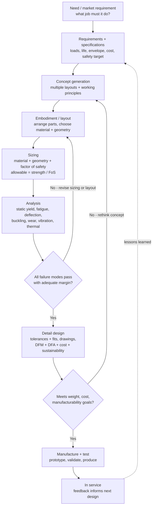

# 🛠️ Machine Design Principles

> [!abstract] TL;DR
> Every earlier note answered the same *forward* question — **"given this part and this load, will it survive?"** Machine design is the **inverse, and it is harder**: **"what part should I create to do this job reliably, cheaply, and safely?"** You must *invent* the geometry, *choose* the material, *size* every dimension, and *specify* how the pieces connect — before there is anything to analyse. Design is run as an **iterative loop** (clarify requirements → generate concepts → embodiment/sizing → detail → analyse → **iterate**), not a straight line. Its central decision is the **factor of safety**: allowable load = failure strength / **FoS**, where FoS is chosen deliberately from the *uncertainty* in loads and materials and the *consequences* of failure — and, in modern **reliability-based design**, load and strength become probability *distributions* whose overlap is the probability of failure. Real design is a **multi-objective optimization** — strength vs weight vs cost vs manufacturability vs reliability — with a **Pareto frontier** and no free lunch. It is the culminating skill of mechanical engineering: where statics, dynamics, materials, thermo, and fluids all converge into hardware.

---

## Intuition

**Analogy:** Judging whether a *ready-made* suit fits you is easy — try it on, check the shoulders, done. That is **analysis**. **Designing** a bespoke suit is a different order of problem: starting from a person and an occasion, the tailor must *invent* the whole thing — pick the cloth, choose the cut, set every measurement, decide the seams and linings — so that it looks right, lasts, moves well, *and* comes in under budget. There is no single "correct" suit; there are infinitely many acceptable ones and a web of trade-offs (heavier cloth lasts longer but breathes worse; more hand-stitching fits better but costs more). The tailor commits to a design, checks it against every requirement, and *alters and re-fits* until it works.

Machine design is exactly this bespoke-tailoring of hardware. **Analysis is the forward, well-posed problem** — one part in, one answer out ("stress is 180 MPa, below yield, safe"). **Design is the inverse, open-ended problem** — a *need* in, and infinitely many possible parts out, each a different compromise. It is where all the physics stops being an exam question and becomes a decision: *how thick, how strong, which material, how much margin?* Getting that decision right — balancing strength against weight, performance against cost, and safety against everything — is the skill that actually makes a mechanical engineer.

---

## How It Works

### Core Mechanics

Machine design turns a *need* into *hardware* through a disciplined but **iterative** loop. It is emphatically **not** the linear "requirements → build" a beginner imagines; every stage can send you back to redo an earlier one.

1. **Clarify requirements & specifications.** Translate a fuzzy need ("a bracket to hold this motor") into hard, testable numbers: the **loads** (magnitude, direction, static or cyclic), the **duty/life** (cycles, hours, environment), the **constraints** (size envelope, weight budget, cost target), and the **safety target**. Ambiguous requirements are the root cause of most redesigns.
2. **Generate concepts.** Brainstorm *multiple* working principles and layouts before committing — a welded plate, a cast rib, a bent sheet, a machined block. Design methodologies (**Pahl & Beitz** systematic design) deliberately keep several concepts alive to avoid premature lock-in.
3. **Embodiment / layout.** Give the winning concept form: arrange the parts, choose **materials**, and set provisional **geometry**. Material, geometry, and manufacturing **process are chosen together** — you cannot pick a shape without knowing how it will be made.
4. **Size against the factor of safety.** The core sizing rule: **allowable stress = failure strength / FoS**. Pick dimensions so the *worst-case* stress stays under the allowable. FoS is not arbitrary — it encodes the uncertainty and the consequences of getting it wrong.
5. **Analyse — and check *every* failure mode.** Now the forward tools apply: **static yield**, **fatigue**, **deflection/stiffness**, **buckling**, **wear**, corrosion, thermal, and **vibration**. A design is only as safe as the mode you *forgot* to check.
6. **Iterate.** If any mode fails, or a competing objective (weight, cost) is unmet, loop back — usually to embodiment, sometimes all the way to concept. This is the beating heart of design.
7. **Detail & document.** Finalise **tolerances and fits**, drawings/models, and **Design-for-X** (manufacturing, assembly, cost, reliability, sustainability), then release to **manufacture and test**.

The **factor of safety** deserves its own emphasis. It reflects (a) *uncertainty* — in the loads you'll actually see, the material's real strength, and the fidelity of your analysis; and (b) *consequences* — a marginal design is fine for a shelf bracket but unacceptable for an aircraft spar or a pressure vessel. Typical values run from ~1.25–2 for well-characterised static loads with mild consequences up to 4+ (or code-mandated) for uncertain loads with catastrophic consequences. Modern **reliability-based design** goes further: treat load and strength as **distributions**, and their *overlap* directly gives the **probability of failure** — so you design to a target reliability, not a single deterministic margin.

### Flow / Architecture



---

## Key Concepts

### Secondary Level

- **Design is *inventing*, not just *checking*.** Anyone can be told "this rod is 10 mm thick — will it hold 500 N?" and work it out. A designer is handed only "hold 500 N safely and cheaply" and must **decide** the thickness, the material, and the shape. That open-ended, creative jump is what design *is*.
- **The factor of safety is a deliberate cushion.** Engineers never size a part to break *exactly* at the expected load. They leave a margin — a **factor of safety** — because the real load might be bigger than guessed, the material weaker than the catalogue says, and their sums imperfect. A swing set might use 2×; an elevator cable uses far more.
- **You cannot have everything.** Stronger usually means heavier and pricier; lighter usually means weaker or costlier (exotic materials). Every real design **trades** strength against weight against cost. There is no single "best" part, only the best compromise for *this* job.
- **Good design loops.** The first sketch is never the final part. Designers make a version, test it (in the head, on a computer, or in the shop), find what's wrong, and **improve it** — again and again.

### Undergraduate Level

- **The sizing equation.** Allowable stress $\sigma_{allow} = S / n$, where $S$ is the relevant *strength* (yield $S_y$, ultimate $S_{ut}$, endurance $S_e$, or critical buckling load) and $n$ is the **factor of safety**. Size the part so the peak stress $\sigma \le \sigma_{allow}$, i.e. the realised margin is $n = S/\sigma \ge n_{design}$.
- **Choosing the FoS deliberately.** It is *not* a fudge factor. Rational schemes (e.g. **Pugsley's method**) build it from the product of sub-factors for *quality of materials/control*, *knowledge of the loads*, *accuracy of the stress analysis*, and *danger to people/economics*. Higher uncertainty or higher consequence → higher $n$.
- **The design process (Pahl & Beitz).** Four phases: **clarify the task** (specification list) → **conceptual design** (function structures, working principles) → **embodiment design** (layout, form, material) → **detail design** (dimensions, tolerances, docs). Each phase can iterate; **concurrent engineering** overlaps them and pulls manufacturing in early.
- **Check every failure mode.** A shaft can pass **static yield** yet fail by **fatigue**; a floor beam can be strong enough yet too *flexible* (**deflection**); a long strut can be under yield yet **buckle**; a cam can be strong yet **wear** out. Static / fatigue / deflection / buckling / wear / thermal / vibration must *all* be screened.
- **Design for X (DFX).** **DFM** (make it makeable and cheap — respect draft angles, avoid tight tolerances you don't need), **DFA** (fewer parts, easy to assemble, poka-yoke), plus design for **cost, reliability, maintainability, and sustainability** (material choice, energy, recyclability, end-of-life).
- **Standards, codes, tolerances.** Real design obeys **codes** (ASME BPVC for pressure vessels, ISO/AGMA for gears, Eurocode for structures) and specifies **tolerances and fits** (clearance vs interference) — the bridge to GD&T and metrology.

### Graduate Level

- **Reliability-based / probabilistic design.** Load $L$ and strength $S$ are random variables. Failure is the event $S < L$; for independent normals the **safety margin** $M = S - L$ is normal, and the **probability of failure** is $p_f = \Phi\!\big(-\beta\big)$ where the **reliability index** $\beta = \dfrac{\mu_S - \mu_L}{\sqrt{\sigma_S^2 + \sigma_L^2}}$. A deterministic FoS of "2" can hide wildly different $p_f$ depending on the *scatter* — this is why aerospace/nuclear use **load-and-resistance-factor design (LRFD)** and target a $p_f$, not a bare margin.
- **Multi-objective optimization & the Pareto frontier.** Formalise design as $\min_x \{f_1(x), f_2(x), \dots\}$ (e.g. weight *and* cost) subject to constraints $g(x)\le 0$ (stress, deflection, geometry). The solutions form a **Pareto frontier**: points where you cannot improve one objective without worsening another. Deterministic tools (**gradient descent**, KKT/Lagrange conditions) and metaheuristics (GA, NSGA-II) both apply; the designer picks an operating point on the frontier.
- **Robust & tolerance design.** **Taguchi** robust design and **design of experiments (DOE)** minimise a design's *sensitivity* to manufacturing and load variation — a slightly heavier design that is *insensitive* to tolerance scatter can beat a lighter, brittle optimum. **Tolerance stack-up** (worst-case vs RSS) allocates the variation budget across a chain of parts.
- **Topology & structural optimization.** Let an algorithm distribute material within an envelope (**SIMP**, level-set) to minimise compliance/weight for given loads — the source of the organic, bone-like shapes now common in additive manufacturing.
- **Margin allocation & systems view.** In complex systems, margins are *budgeted* (mass budget, thermal budget, reliability apportionment across subsystems) rather than assigned part-by-part — connecting machine design to **systems engineering** and concurrent, model-based design.

---

## Python Demo

```python
# Machine design as DECISION-MAKING under trade-offs and uncertainty.
#
#   PANEL 1  -> the DESIGN SPACE & PARETO FRONTIER:
#              size a cantilever beam (width b, height h) to carry an end load.
#              Scatter WEIGHT vs FACTOR-OF-SAFETY for thousands of candidate designs,
#              trace the Pareto frontier, and mark the "risky", "over-designed",
#              and chosen operating regions.
#   PANEL 2  -> LOAD-STRENGTH INTERFERENCE:
#              load and strength are DISTRIBUTIONS; their overlap is the
#              probability of failure -> reliability, not a single number.
#   PANEL 3  -> FACTOR OF SAFETY vs RELIABILITY:
#              increasing the FoS pushes the distributions apart and drops p_f.
#
# Requires: numpy, matplotlib
import numpy as np
import matplotlib.pyplot as plt
from math import erf

rng = np.random.default_rng(7)

def norm_cdf(x):
    """Vectorised standard-normal CDF via the error function (no scipy)."""
    x = np.asarray(x, dtype=float)
    return 0.5 * (1.0 + np.vectorize(erf)(x / np.sqrt(2.0)))

# =====================================================================
# PANEL 1 : DESIGN SPACE  ->  weight vs factor of safety
#   Cantilever beam, length L, end load P.  Rectangular section (b x h).
#   Max bending stress  sigma = 6 P L / (b h^2)   (M = P L, S = b h^2 / 6)
#   Factor of safety    n = sigma_y / sigma
#   Weight              W = rho * b * h * L
# =====================================================================
L      = 1.0          # beam length            [m]
P      = 5.0e3        # end load               [N]
sig_y  = 250e6        # yield strength (steel) [Pa]
rho    = 7850.0       # density (steel)        [kg/m^3]

N = 6000
b = rng.uniform(0.008, 0.040, N)      # width  [m]
h = rng.uniform(0.020, 0.120, N)      # height [m]

sigma  = 6.0 * P * L / (b * h**2)     # peak bending stress [Pa]
FoS    = sig_y / sigma                # factor of safety   [-]
weight = rho * b * h * L              # mass               [kg]

# ---- Pareto frontier: minimise weight, maximise FoS ----
order  = np.argsort(weight)
w_srt, f_srt = weight[order], FoS[order]
best, keep = -np.inf, []
for i in range(N):
    if f_srt[i] > best:               # lightest design achieving each new FoS level
        keep.append(order[i]); best = f_srt[i]
keep = np.array(keep)

# ---- chosen operating point: lightest frontier design with FoS >= target ----
target_FoS = 2.0
frontier_FoS = FoS[keep]
ok = keep[frontier_FoS >= target_FoS]
op = ok[np.argmin(weight[ok])]        # the chosen design
print("=== PANEL 1: beam design space ===")
print(f"  chosen design : b = {b[op]*1000:5.1f} mm, h = {h[op]*1000:5.1f} mm")
print(f"                  weight = {weight[op]:5.2f} kg, FoS = {FoS[op]:4.2f}")

# =====================================================================
# PANEL 2 : LOAD-STRENGTH INTERFERENCE (distributions, in stress units MPa)
# =====================================================================
muL, sdL = 140.0, 25.0    # applied stress: mean & std  [MPa]
muS, sdS = 250.0, 30.0    # strength:       mean & std  [MPa]
beta = (muS - muL) / np.sqrt(sdS**2 + sdL**2)   # reliability index
pf   = norm_cdf(-beta)                           # probability of failure
print("=== PANEL 2: load-strength interference ===")
print(f"  central FoS = {muS/muL:4.2f}, reliability index beta = {beta:4.2f}")
print(f"  probability of failure p_f = {pf:.2e}")

x  = np.linspace(40, 380, 600)
pL = np.exp(-0.5*((x-muL)/sdL)**2) / (sdL*np.sqrt(2*np.pi))
pS = np.exp(-0.5*((x-muS)/sdS)**2) / (sdS*np.sqrt(2*np.pi))

# =====================================================================
# PANEL 3 : FoS  vs  reliability  (fix load mean, raise strength mean)
# =====================================================================
covL, covS = 0.15, 0.12               # coefficients of variation
muL3 = 100.0
FoS_sweep = np.linspace(1.0, 3.5, 200)
muS3 = FoS_sweep * muL3
sdL3, sdS3 = covL*muL3, covS*muS3
beta3 = (muS3 - muL3) / np.sqrt(sdS3**2 + sdL3**2)
pf3   = norm_cdf(-beta3)

# ---------------------------- plotting -------------------------------
fig, (ax1, ax2, ax3) = plt.subplots(1, 3, figsize=(17, 5.2))
fig.suptitle("Machine Design: trading weight against safety, and safety against reliability",
             fontsize=14, fontweight="bold")

# PANEL 1 -----------------------------------------------------------
ax1.axhspan(0.0, 1.5, color="firebrick", alpha=0.08)
ax1.axhspan(3.5, FoS.max()*1.05, color="grey", alpha=0.10)
ax1.scatter(weight, FoS, s=6, color="steelblue", alpha=0.25, label="candidate designs")
ax1.plot(weight[keep], FoS[keep], "-", color="seagreen", lw=2.6, label="Pareto frontier")
ax1.axhline(1.0, color="firebrick", ls=":", lw=1.4)
ax1.plot(weight[op], FoS[op], "*", color="black", ms=18, zorder=6,
         label=f"chosen point (FoS={FoS[op]:.1f})")
ax1.text(weight.max()*0.62, 0.7, "RISKY / under-designed\n(light but marginal)",
         fontsize=8, color="firebrick")
ax1.text(weight.max()*0.42, 4.4, "OVER-DESIGNED\n(safe but heavy, wasteful)",
         fontsize=8, color="dimgray")
ax1.set_xlabel("weight  [kg]  (cost proxy)")
ax1.set_ylabel("factor of safety  n = Sy / sigma")
ax1.set_title("(1) design space + Pareto frontier")
ax1.set_ylim(0, FoS.max()*1.05)
ax1.legend(fontsize=8, loc="upper left")
ax1.grid(alpha=0.25)

# PANEL 2 -----------------------------------------------------------
ax2.plot(x, pL, color="royalblue", lw=2.4, label="applied load / stress")
ax2.plot(x, pS, color="firebrick", lw=2.4, label="strength")
overlap = np.minimum(pL, pS)
ax2.fill_between(x, 0, overlap, color="purple", alpha=0.45,
                 label="interference (failure region)")
ax2.axvline(muL, color="royalblue", ls=":", lw=1.2)
ax2.axvline(muS, color="firebrick", ls=":", lw=1.2)
ax2.annotate("overlap -> failures\np_f = P(strength < load)",
             xy=(muL + (muS-muL)*0.5, overlap.max()*1.2),
             xytext=(210, pL.max()*0.75), fontsize=8,
             arrowprops=dict(arrowstyle="->", color="purple"))
ax2.set_xlabel("stress  [MPa]")
ax2.set_ylabel("probability density")
ax2.set_title(f"(2) load-strength interference\nbeta={beta:.2f},  p_f={pf:.1e}")
ax2.legend(fontsize=8, loc="upper right")
ax2.grid(alpha=0.25)

# PANEL 3 -----------------------------------------------------------
ax3.semilogy(FoS_sweep, pf3, color="darkorange", lw=2.8)
ax3.axhline(1e-3, color="grey", ls="--", lw=1.3)
ax3.text(1.05, 1.4e-3, "target reliability  p_f = 1e-3", fontsize=8, color="grey")
i_star = np.argmin(np.abs(pf3 - 1e-3))
ax3.plot(FoS_sweep[i_star], pf3[i_star], "o", color="black", ms=9)
ax3.annotate(f"FoS ~ {FoS_sweep[i_star]:.2f}\nmeets target",
             xy=(FoS_sweep[i_star], pf3[i_star]),
             xytext=(FoS_sweep[i_star]+0.25, 1e-2), fontsize=8,
             arrowprops=dict(arrowstyle="->", color="black"))
ax3.set_xlabel("central factor of safety  = mean strength / mean load")
ax3.set_ylabel("probability of failure  p_f  (log)")
ax3.set_title("(3) more safety factor -> higher reliability")
ax3.set_ylim(1e-8, 1)
ax3.grid(alpha=0.25, which="both")

plt.tight_layout(rect=[0, 0, 1, 0.93])
plt.show()
```

The **left panel** is the essence of design as decision-making: thousands of candidate beams form a *cloud*, and the green **Pareto frontier** is the set of non-dominated choices — the *lightest* beam for each level of safety. Below it lies the **risky** region (light but marginal); high above sits the **over-designed** region (safe but needlessly heavy and expensive). The engineer picks a point on the frontier that hits the target safety without wasting metal. The **middle panel** reframes safety honestly: load and strength are **distributions**, and their *overlap* — not a single deterministic ratio — is the probability of failure. The **right panel** closes the loop: raising the factor of safety separates the two distributions and drives $p_f$ down exponentially, so a required reliability *implies* a required FoS. Design is choosing all three: the shape, the margin, and the acceptable risk.

---

## Real-World Applications

> **Aircraft structures — margin where it counts.** Airframes are designed to a **limit load** (the most severe expected in service) and a **ultimate load** = 1.5 × limit, with essentially *no permanent deformation* at limit. That "1.5" is a famously *low* factor of safety by ground-machine standards — affordable only because aerospace loads and materials are characterised to a fanatical degree and the structure is **damage-tolerant** and inspected. Weight is the enemy, so every kilogram of margin is fought for through reliability-based design and topology optimization.

> **Pressure vessels — the ASME code as codified design.** A boiler or reactor vessel is not sized by an engineer's judgement alone; the **ASME Boiler & Pressure Vessel Code** dictates allowable stresses (yield or ultimate divided by a code factor of safety, historically ~3.5–4 on ultimate), weld qualification, and inspection. Here the *consequence* of failure (catastrophic, lethal) mandates a large, standardised margin — design as regulated practice.

> **Automotive — cost is the co-equal objective.** A car bracket or control arm is a multi-objective optimization where **cost and manufacturability** rank alongside strength. Parts are designed for **DFM/DFA** (net-shape casting or stamping, minimal machining, snap-fits over fasteners) and validated by FEA and fatigue rigs. A gram saved across millions of units, or a tenth of a second of assembly time, is real money — so the "best" design is rarely the strongest.

> **Consumer & additive parts — topology optimization.** Bicycle cranks, drone frames, and aerospace brackets increasingly show organic, bone-like geometries produced by **topology optimization** and additive manufacturing: an algorithm places material only where the load path needs it, minimising weight for a target stiffness/strength — machine design handed partly to the optimizer, with the engineer setting objectives and constraints.

---

## Common Pitfalls

- **Confusing analysis with design.** Analysis is the *forward*, single-answer problem ("is this part safe?"); design is the *inverse*, open-ended synthesis ("what part should exist?"). Beginners over-invest in analysis and treat design as a one-shot calculation, missing that it is **iterative, constraint-driven, and non-unique**. You must *create* the candidate before any analysis has meaning.
- **Treating the design process as linear.** "Requirements → design → build" is a myth. Real design **loops**: concepts fail embodiment, embodiment fails analysis, analysis sends you back to concept. Expecting a straight line leads to under-budgeting for iteration and to freezing a bad concept too early.
- **Pulling the factor of safety out of thin air.** FoS is **not** an arbitrary "1.5 because that's what we always use." It must be reasoned from the *uncertainty* (in loads, material properties, and analysis fidelity) and the *consequences* of failure. A blanket factor over-builds the safe cases and under-protects the dangerous ones; use rational (Pugsley) or, better, **reliability-based** methods.
- **Believing a single FoS number equals a fixed reliability.** Two designs both at "FoS = 2" can have failure probabilities orders of magnitude apart if their load/strength *scatter* differs. Deterministic margins hide the distributions; when consequences are severe, design to a **probability of failure**, not a bare ratio.
- **Checking one failure mode and declaring victory.** A part can pass **static yield** yet die by **fatigue**; be strong yet too **flexible** (deflection); be under yield yet **buckle**; or wear, corrode, resonate, or overheat. *Every* relevant mode — static / fatigue / deflection / buckling / wear / thermal / vibration — must be screened. The mode you skip is the one that fails.
- **Optimising strength in isolation.** Real design is a **trade-off** among strength, weight, cost, manufacturability, reliability, and performance — a Pareto problem with no free lunch. Chasing maximum strength yields a heavy, expensive part; chasing minimum weight yields a fragile one. Name the objectives *and* the constraints explicitly.
- **Choosing material, geometry, and process separately.** They are **coupled**: a shape you can machine may be impossible to cast; a high-strength alloy may be un-weldable. Design **for manufacturing and assembly (DFM/DFA)** from the start, not as an afterthought that forces a redesign.
- **Ignoring tolerances, robustness, and standards.** A design that only works at nominal dimensions fails in production once real **tolerance scatter** arrives. Allocate a tolerance budget, aim for **robust** (variation-insensitive) designs, and obey the governing **codes and standards** — they encode hard-won failure lessons.
- **Over-designing "to be safe."** Excess margin is not free virtue: it wastes material, adds weight and cost, and can *introduce* problems (a thicker weld cools slower and cracks; a heavier part loads its neighbours). Both under- and over-design are failures of judgement.

---

## Related Concepts

- [[Failure_Fatigue_and_Fracture]] — the *forward* failure analysis (static yield, fatigue S-N/Goodman, fracture $K_{Ic}$) that design *inverts*; the modes every design must be checked against
- [[Stress_Strain_and_Deformation]] — the stress/strain/deflection mechanics that convert a chosen geometry and load into the numbers the factor of safety operates on
- [[Stress_Strain_and_Elastic_Moduli]] *(Materials_Science)* — the strength ($S_y$, $S_{ut}$) and stiffness ($E$) data that anchor material selection and the allowable-stress equation
- [[Fatigue_Creep_and_High_Temperature_Failure]] *(Materials_Science)* — the cyclic and high-temperature strength limits ($S_e$, creep) that constrain life-driven design
- [[Fracture_Mechanics_and_Toughness]] *(Materials_Science)* — toughness $K_{Ic}$ and critical crack size behind damage-tolerant design of inspectable structures
- [[Gradient_Descent]] *(Optimization)* — the workhorse for the multi-objective / constrained optimization that formalises the weight-vs-cost-vs-safety trade-off and the Pareto frontier
- [[Mechanical_Engineering_Overview]] — the vault hub showing how design is where statics, dynamics, thermo, and fluids converge into hardware

*(Section siblings developed elsewhere in Design & Manufacturing — machine elements, manufacturing processes, GD&T and metrology, and CAD/CAE/FEA — extend these principles into specific components, processes, tolerancing, and digital tools.)*

---

## Review Questions

**Secondary**
1. A friend says "designing a part just means checking that it's strong enough." Explain why this is backwards — what does a *designer* have to do that someone merely *checking* a finished part does not? Give an everyday example of the difference between judging something ready-made and creating it from scratch.

**Undergraduate**
2. A steel bracket ($S_y = 250$ MPa) must carry a load that produces a peak stress you have estimated as 100 MPa. (a) What factor of safety does your design currently have? (b) A colleague argues the *actual* load could be 30% higher than your estimate and the steel could be 10% weaker than the datasheet — recompute the *realised* margin under that worst case and comment on whether a design FoS of 2.0 is adequate. (c) Name three *other* failure modes (besides static yield) you must still check before releasing the design, and for each, one design change that would improve it.

**Graduate**
3. You are optimising a load-bearing component with two objectives — minimise **mass** and minimise **manufacturing cost** — subject to a stress constraint and a deflection constraint. (a) Sketch and explain the **Pareto frontier** for this problem and why no single "optimal" design exists. (b) Two candidate designs both report "factor of safety = 2.0," but design A uses a tightly-controlled forged alloy and design B a variable casting — argue, using the reliability index $\beta = (\mu_S-\mu_L)/\sqrt{\sigma_S^2+\sigma_L^2}$, why their probabilities of failure can differ by orders of magnitude, and how a **reliability-based** (LRFD) approach would size them differently. (c) Your optimiser drives the design to the lightest point that just satisfies the constraints. Why might a *robust* design deliberately back off from this optimum, and how would tolerance scatter and Taguchi thinking justify the extra weight?

---

## Sources

- R. G. Budynas & J. K. Nisbett — *Shigley's Mechanical Engineering Design*, 11th ed. (McGraw-Hill, 2020) — the standard text; factor of safety, failure theories, and machine-element design
- R. L. Norton — *Machine Design: An Integrated Approach*, 6th ed. (Pearson, 2019) — integrated design process, DFX, and worked component design
- D. G. Ullman — *The Mechanical Design Process*, 6th ed. (McGraw-Hill, 2018) — the design methodology, requirements, concept generation, and decision-making
- G. Pahl, W. Beitz, J. Feldhusen & K.-H. Grote — *Engineering Design: A Systematic Approach*, 3rd ed. (Springer, 2007) — systematic (clarify → conceptual → embodiment → detail) design theory
- G. E. Dieter & L. C. Schmidt — *Engineering Design*, 5th ed. (McGraw-Hill, 2013) — materials/process selection, optimization, robust design, and reliability

---

#mechanical-engineering #machine-design #factor-of-safety #design-process #optimization
