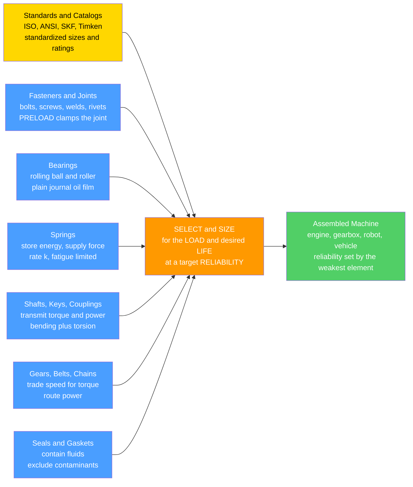

# ⚙️ Machine Elements

> [!abstract] TL;DR
> **Machine elements** are the standardized building-block components that nearly every machine is assembled from — **fasteners (bolts, screws), bearings, springs, shafts, keys, couplings, gears, seals, welds**. Each has well-understood physics, characteristic failure modes, and **standardized sizes and ratings**, so the engineer usually **SELECTS and SIZES** them from catalogs and standards rather than designing each from scratch. Two ideas dominate the day-to-day work: **bolt PRELOAD** — tightening a bolt creates clamping tension so that an external load is largely absorbed by the relaxing clamp rather than added to the bolt, which prevents joint separation and dramatically improves **fatigue** life; and **bearing LIFE** — a rolling bearing is chosen from the **load-life** relation $L_{10} = (C/P)^p$ (with $p=3$ for ball bearings), so that **doubling the load cuts life by roughly $8\times$**. Getting these selections right — the right bolt at the right preload, the right bearing for the load and life, the right spring rate — prevents the majority of mechanical failures.

---

## Intuition — analogy FIRST

Just as a writer builds sentences from a shared vocabulary of **words**, a mechanical engineer builds machines from a standard vocabulary of **elements**: bolts, bearings, springs, shafts, gears, seals, welds. These building blocks appear in nearly every machine, each with well-understood behavior and standardized sizes, so you **rarely design a bearing from scratch** — you **SELECT** one from a catalog to carry your load for your desired life.

Think about how you actually assemble almost any machine. You need to *join* two parts (a bolt), let a shaft *spin freely* (a bearing), *store or return energy* (a spring), *transmit rotation* (a shaft with a key), *change speed and torque* (gears), and *keep the oil in and the dirt out* (a seal). Each of these is a solved problem with a catalog behind it. Knowing this vocabulary — how each element **works**, how it **fails**, and how it is **sized** — is the practical core of machine design. The skill is not reinventing the bolt; it is picking the *right* bolt and tightening it to the *right* tension.

---

## How It Works

Machine design is largely an act of **selection under constraints**. You know the load (force, torque, pressure, cycles) and the required life and reliability. For each function you reach into the standard vocabulary, pick the element type, then use its governing equation and the manufacturer's ratings to choose a **size** that survives. The two workhorse calculations are the **bolted-joint force balance** (preload plus a small share of the external load) and the **bearing load-life equation** (life falls as a power of load).

### Core relations

1. **Joint stiffness constant:** $\displaystyle C = \frac{k_b}{k_b + k_m}$ — the fraction of an external load carried by the **bolt**; the members carry $(1-C)$. Because clamped members are usually much stiffer than the bolt, $C$ is small (often $0.2$–$0.3$).
2. **Bolt force under load:** $\displaystyle F_b = F_i + C\,P$ (while the joint stays clamped), where $F_i$ is the **preload**. The members unload as $F_m = F_i - (1-C)P$.
3. **Separation load:** $\displaystyle P_0 = \frac{F_i}{1-C}$ — beyond this the joint opens and the bolt suddenly carries the **entire** external load ($F_b = P$).
4. **Torque–tension:** $\displaystyle T = K\,d\,F_i$ — the tightening torque needed for a target preload, with nut factor $K \approx 0.2$ and bolt diameter $d$.
5. **Bearing load-life ($L_{10}$):** $\displaystyle L_{10} = \left(\frac{C}{P}\right)^{p}\times 10^6 \ \text{rev}$, with $p=3$ for **ball** and $p=10/3$ for **roller** bearings; $C$ is the catalog **basic dynamic load rating**, $P$ the equivalent load.



---

## Key Concepts

### Secondary (intuition)
- A machine is **assembled from standard parts** — bolts, bearings, springs, shafts, gears, seals — the same way a sentence is built from common words. You **buy** these parts; you do not usually invent them.
- **Tightening a bolt is the whole point of the bolt.** A properly tightened bolt squeezes the parts together so hard (the **preload**) that a pull on the joint mostly just *relaxes the squeeze* rather than stretching the bolt further — so the bolt barely feels the load and does not shake loose.
- A **bearing lets a shaft spin with almost no friction**, either by **rolling** on tiny balls or rollers, or by floating on a thin **film of oil**. You pick one by how heavy the load is and how long it must last.
- Push a bearing **twice as hard** and it wears out **many times sooner** — that steep trade is why choosing the right size from the catalog matters.

### Undergraduate (the working theory)
- **Bolted joints and preload.** Model the bolt and the clamped members as two **springs in parallel**. The external load $P$ splits by stiffness: the bolt takes $C\,P$ and the members shed $(1-C)P$, where $C = k_b/(k_b+k_m)$. Since members are stiffer than the bolt, $C \approx 0.2$–$0.3$, so a preloaded bolt sees only a **fraction** of the external load — the key to **fatigue** resistance and to keeping the joint clamped.
- **Torque–tension and its scatter.** Preload is set indirectly via torque, $T = K\,d\,F_i$; the **nut factor** $K$ ($\approx 0.2$ dry) lumps thread and head friction and scatters $\pm 25$–$35\%$, which is why critical joints use angle-of-turn, bolt-stretch, or load-indicating methods.
- **Thread engagement and stripping.** Enough engaged threads (roughly one diameter of length in steel, more in aluminum) ensures the **bolt breaks before the threads strip** — the desired ductile failure order.
- **Rolling-element bearings and $L_{10}$ life.** The **basic rating life** $L_{10} = (C/P)^p \times 10^6$ rev is the life 90% of a population exceeds; $p=3$ (ball), $p=10/3$ (roller). $C$ (dynamic load rating) comes straight from the catalog, and equivalent load $P = XF_r + YF_a$ combines radial and axial components.
- **Plain (journal) bearings.** A rotating shaft drags oil into a converging wedge and rides on a **hydrodynamic film** (no metal contact once running) — the **Sommerfeld/Petroff** regime; startup and stopping are the wear-prone moments.
- **Springs.** A helical spring has a **rate** $k = Gd^4/(8D^3 n)$ (force per deflection) and stores energy $\tfrac12 k x^2$; the wire sees torsional shear, so springs are **fatigue-limited** by the alternating stress.
- **Shafts, keys, couplings.** Shafts are sized for **combined bending + torsion** and fatigue; **keys and splines** transmit torque by shear and bearing; **couplings** join shafts while tolerating misalignment.

### Graduate (design, failure, systems)
- **The joint as a system.** The whole assembly — bolt, members, gasket, and their thermal expansion — determines behavior. **Gasketed joints** are softer (larger $C$), so the bolt sees more of the pressure load; **thermal cycling** and **embedment/creep relaxation** bleed off preload over time (the reason for re-torque schedules and hardened washers).
- **Bolt fatigue design.** With adequate preload the bolt's **alternating** stress is only $\sigma_a = C\,P_a/(2A_t)$ — small, and sitting on a high mean — so a **Goodman/Gerber** check against the endurance limit governs. The **thread root** is the fatigue site (stress-concentration $K_f$); **rolled** threads (residual compression) beat cut threads.
- **Bearing reliability and modifiers.** Real selection uses $L_{nm} = a_1\,a_{ISO}\,L_{10}$: $a_1$ adjusts reliability above 90%, and $a_{ISO}$ folds in **lubricant film ratio** $\lambda$, contamination, and the fatigue load limit — a bearing above the load limit in clean oil can effectively last **forever**, while a starved or dirty one fails early regardless of the catalog number.
- **Tribology of the film.** Plain-bearing and gear-tooth life live in the **lubrication regimes** (boundary → mixed → hydrodynamic/EHL); the film thickness relative to surface roughness ($\lambda$) decides whether asperities touch. This ties machine-element life directly to surface finish and lubricant viscosity.
- **Stress concentration everywhere.** Every functional feature — a **fillet**, a **thread root**, a **keyway**, a **shoulder**, a bearing seat — raises local stress by $K_t$ and drives **fatigue** ($K_f$). Generous fillet radii and relief grooves are cheap life insurance.
- **Standardization and interchangeability.** Preferred sizes, fits and tolerances (ISO 286), thread standards, and bearing boundary dimensions make parts **interchangeable and sourceable** — a systems property as important as any strength calculation.
- **Selection vs. design.** The engineer's leverage is choosing the **right element and the right rating**, not re-deriving Hertzian contact each time; the analysis exists to justify the catalog pick and to know its margins and failure mode.

---

## Python Demo

```python
# Machine elements — the two workhorse selection calculations:
#   (a) BOLTED JOINT: preload + how an external load is SHARED between the bolt
#       and the clamped members (the joint-stiffness diagram); why preload
#       prevents separation and protects the bolt from FATIGUE.
#   (b) BEARING LIFE: the rolling-bearing L10 load-life law  L = (C/P)^p,
#       p = 3 for ball bearings -> DOUBLING the load cuts life by ~8x.
import numpy as np
import matplotlib.pyplot as plt

# =====================================================================
# (a) BOLTED JOINT — bolt & members as two springs in PARALLEL
# =====================================================================
k_b = 1.0e9                      # bolt stiffness  (N/m)
k_m = 4.0e9                      # clamped-member stiffness (usually >> bolt)
C   = k_b / (k_b + k_m)          # joint stiffness constant -> fraction on bolt
F_i = 20_000.0                   # PRELOAD from tightening (N)
d   = 0.012                      # bolt diameter (m), for torque-tension
K   = 0.2                        # nut factor (thread + head friction)

P = np.linspace(0, 45_000, 500)  # external tensile load on the joint (N)
P0 = F_i / (1 - C)               # separation load: members fully unloaded

F_bolt   = np.where(P < P0, F_i + C * P,        P)          # bolt force
F_member = np.where(P < P0, F_i - (1 - C) * P,  0.0)        # clamp force
T_tighten = K * d * F_i                                     # torque for preload

print(f"(a) C = k_b/(k_b+k_m) = {C:.2f}  ->  bolt carries only {100*C:.0f}% of load")
print(f"    preload F_i = {F_i/1e3:.0f} kN  needs torque T = {T_tighten:.1f} N*m")
print(f"    joint SEPARATES at P0 = {P0/1e3:.1f} kN (then bolt takes the FULL load)")

# Fatigue view: a CYCLIC external load 0..P_cyc, well vs poorly preloaded bolt
def bolt_force(Fi, C, Pext):
    Psep = Fi / (1 - C)
    return np.where(Pext < Psep, Fi + C * Pext, Pext)

t     = np.linspace(0, 3, 500)
P_cyc = 22_000 * (0.5 - 0.5 * np.cos(2 * np.pi * t))   # fluctuates 0..22 kN
Fb_hi = bolt_force(30_000, C, P_cyc)                   # well preloaded -> stays clamped
Fb_lo = bolt_force( 6_000, C, P_cyc)                   # under-preloaded -> SEPARATES
amp_hi = 0.5 * (Fb_hi.max() - Fb_hi.min())
amp_lo = 0.5 * (Fb_lo.max() - Fb_lo.min())
print(f"    bolt force amplitude: well-preloaded = {amp_hi/1e3:.2f} kN, "
      f"under-preloaded = {amp_lo/1e3:.2f} kN  (fatigue killer)")

# =====================================================================
# (b) BEARING LIFE — L10 = (C/P)^p * 1e6 rev   (p=3 ball, p=10/3 roller)
# =====================================================================
C_dyn = 30_000.0                             # basic dynamic load rating (N), catalog
Pload = np.linspace(3_000, 24_000, 400)      # equivalent bearing load (N)
L10_ball  = (C_dyn / Pload) ** 3       * 1e6 # revolutions
L10_roll  = (C_dyn / Pload) ** (10/3)  * 1e6

# The load-DOUBLING rule for ball bearings: life scales as (1/2)^3 = 1/8
P_ref = 5_000.0
Pvals = np.array([P_ref, 2*P_ref, 4*P_ref])
life_M = (C_dyn / Pvals) ** 3                # in millions of revolutions
print(f"(b) ball bearing C = {C_dyn/1e3:.0f} kN:")
for Pv, Lm in zip(Pvals, life_M):
    print(f"    P = {Pv/1e3:.0f} kN -> L10 = {Lm:6.1f} million rev")
print(f"    doubling {P_ref/1e3:.0f}->{2*P_ref/1e3:.0f} kN cuts life "
      f"{life_M[0]/life_M[1]:.0f}x  (= 2^3)")

# ---------------------------------------------------------------------
# Plots
# ---------------------------------------------------------------------
fig, ax = plt.subplots(2, 2, figsize=(13, 10))

# (a) joint-stiffness diagram: bolt & member force vs external load
ax[0,0].plot(P/1e3, F_bolt/1e3,   lw=2.5, color="#4a9eff", label="bolt force F_b")
ax[0,0].plot(P/1e3, F_member/1e3, lw=2.5, color="#51cf66", label="member (clamp) force F_m")
ax[0,0].axhline(F_i/1e3, ls=":", color="gray", label=f"preload F_i = {F_i/1e3:.0f} kN")
ax[0,0].axvline(P0/1e3, ls="--", color="crimson", label=f"separation P0 = {P0/1e3:.0f} kN")
ax[0,0].annotate("bolt barely rises\n(slope C, small)", xy=(P0/2/1e3, (F_i+C*P0/2)/1e3),
                 xytext=(3, 30), fontsize=8, color="#2b6cb0")
ax[0,0].set_title("(a) Joint diagram: preload makes the bolt share LITTLE of the load")
ax[0,0].set_xlabel("external load P (kN)"); ax[0,0].set_ylabel("force (kN)")
ax[0,0].legend(fontsize=8); ax[0,0].grid(alpha=0.3)

# (a-fatigue) bolt force over time for well vs poorly preloaded joint
ax[0,1].plot(t, Fb_hi/1e3, lw=2.2, color="#51cf66", label="well preloaded (stays clamped)")
ax[0,1].plot(t, Fb_lo/1e3, lw=2.2, color="crimson", label="under-preloaded (SEPARATES)")
ax[0,1].plot(t, P_cyc/1e3, lw=1.2, ls=":", color="gray", label="external load (cyclic)")
ax[0,1].set_title("(a) Same cyclic load: preload shrinks the bolt's stress swing")
ax[0,1].set_xlabel("time (cycles)"); ax[0,1].set_ylabel("bolt force (kN)")
ax[0,1].legend(fontsize=8); ax[0,1].grid(alpha=0.3)

# (b) bearing load-life law on log-log: ball vs roller
ax[1,0].loglog(Pload/1e3, L10_ball/1e6, lw=2.5, color="#ff9900", label="ball  p = 3")
ax[1,0].loglog(Pload/1e3, L10_roll/1e6, lw=2.5, color="purple",  label="roller  p = 10/3")
ax[1,0].set_title("(b) Bearing LOAD-LIFE law  L10 = (C/P)^p  (steeper -> stronger effect)")
ax[1,0].set_xlabel("equivalent load P (kN)"); ax[1,0].set_ylabel("L10 life (million rev)")
ax[1,0].legend(fontsize=9); ax[1,0].grid(alpha=0.3, which="both")

# (b) the doubling-load rule as bars
xb = np.arange(len(Pvals))
bars = ax[1,1].bar(xb, life_M, color=["#51cf66", "#ff9900", "crimson"])
ax[1,1].set_xticks(xb)
ax[1,1].set_xticklabels([f"{p/1e3:.0f} kN" for p in Pvals])
for xi, Lm in zip(xb, life_M):
    ax[1,1].text(xi, Lm, f"{Lm:.0f}M", ha="center", va="bottom", fontsize=9)
ax[1,1].set_title("(b) Ball bearing: each load DOUBLING cuts life ~8x  (2^3)")
ax[1,1].set_xlabel("equivalent load P"); ax[1,1].set_ylabel("L10 life (million rev)")
ax[1,1].grid(alpha=0.3, axis="y")

plt.tight_layout(); plt.show()
```

**What it shows:** (a) In the **joint-stiffness diagram** the bolt force starts at the **preload** and rises only along the shallow slope $C$ (it carries a small fraction of the external load) while the clamp force falls — right up to the **separation load** $P_0$, beyond which the joint opens and the bolt is suddenly hit with the *entire* load. The time trace makes the fatigue point concrete: under the **same** cyclic external load, a **well-preloaded** bolt barely fluctuates, while an **under-preloaded** bolt separates and swings through huge stress amplitudes — the classic fatigue failure. (b) The **load-life law** plotted log-log is a straight line; because $p=3$ for balls (steeper than the linear intuition), **halving the load multiplies life eightfold**, and the bar chart shows the same rule in reverse — each doubling of load ($5\to10\to20$ kN) chops $L_{10}$ by $8\times$. This single curve is the basis of **bearing selection from a catalog**.

---

## Real-World Applications

- **Engine and cylinder-head bolts:** head and main-bearing-cap bolts are **preloaded** (often torque-to-yield) so combustion pressure cycles the clamp, not the bolt — the reason a head gasket survives millions of firing cycles.
- **Electric-motor and gearbox shafts:** every rotating shaft rides on **rolling bearings selected by $L_{10}$**; the catalog dynamic rating $C$ and the actual load set the service interval — the core of predictive maintenance.
- **Wind-turbine main bearings and bolted flanges:** enormous rolling bearings sized for a 20-year life, and hundreds of preloaded tower/flange bolts whose preload loss is monitored — machine-element reliability at grid scale.
- **Automotive suspension and valve springs:** helical springs designed for a target **rate** and near-infinite **fatigue** life; a valve spring cycles billions of times, so alternating shear stress governs.
- **Robot joints and actuators:** cross-roller and thin-section bearings support each joint; preloaded bolts hold the structure; the reflected loads through gears, keys, and couplings must all be sized together (see [[Actuators_Sensors_and_Embedded_Robotics]] and [[Robot_Dynamics_and_Equations_of_Motion]]).
- **Pumps, compressors, and pipelines:** **mechanical seals and gaskets** contain the fluid, **journal bearings** ride on a hydrodynamic oil film, and flanged joints are **bolted and gasketed** — a textbook stack of interacting machine elements.

---

## Common Pitfalls

- **Reinventing standard parts.** Machine elements are **standardized building blocks** meant to be **selected**, not designed from scratch. Custom bolts, bearings, or springs are slower, costlier, and less reliable than catalog parts — reach for the catalog first and justify any deviation.
- **Under-preloading a bolted joint.** The single most important number in a bolted joint is the **preload**. Too little preload and the joint **separates** under load: the bolt then sees the full external load and the fluctuation drives **fatigue** and self-loosening. A properly preloaded joint sees only a small fraction ($C$) of the external load.
- **Trusting torque as if it were tension.** Preload is set through **torque–tension** ($T = KdF_i$), but the **nut factor** $K$ scatters widely with friction, lubrication, and surface condition ($\pm 25$–$35\%$). For critical joints use angle-of-turn, bolt stretch, or load-indicating washers, not torque alone.
- **Thread stripping instead of bolt failure.** Too few engaged threads (especially in soft materials like aluminum) lets the **threads strip** before the bolt yields — the wrong, sudden failure order. Ensure adequate thread engagement or use inserts.
- **Sizing a bearing for load but not for LIFE.** Bearing selection is a **load-life-reliability** problem: $L_{10} = (C/P)^p$ means a modest overload sharply shortens life ($p=3$ for balls, so **doubling load $\Rightarrow \tfrac18$ life**). Also confusing static and dynamic ratings, or ignoring the equivalent load $P = XF_r + YF_a$, mis-sizes the bearing.
- **Neglecting lubrication and contamination on bearing life.** The catalog $L_{10}$ assumes clean, adequately filmed operation. In practice the **lubricant film ratio and contamination** dominate — a starved or dirty bearing fails far short of its rating regardless of the number on the box (a tribology issue at the surfaces).
- **Confusing rolling and plain bearings.** **Rolling** bearings (ball/roller) trade low starting friction for finite fatigue life; **plain/journal** bearings ride a **hydrodynamic film** and can last indefinitely once running, but wear at start/stop. Choose by speed, load, cost, and duty cycle — they fail in different ways.
- **Forgetting springs are fatigue-limited.** A spring's **rate** $k$ is easy; its **fatigue life** under alternating stress is the hard part. Set-relaxation, buckling, and surface defects (the wire's torsional shear at the surface) are what actually kill springs.
- **Ignoring stress concentration at every feature.** Fillets, thread roots, keyways, shoulders, and bearing seats each raise local stress ($K_t$) and drive **fatigue** ($K_f$). Generous radii and relief grooves are the cheapest reliability you can buy.
- **Treating the joint (or bearing seat) as a lone part instead of a system.** The bolt, the clamped members, the gasket, thermal expansion, and preload relaxation together decide whether a joint survives; likewise the shaft, its fit, the housing, and lubrication together set bearing life. Analyze the **assembly**, not the isolated element.

---

## Related Concepts

- [[Stress_Strain_and_Elastic_Moduli]] — supplies the elastic **stiffnesses** ($k_b$, $k_m$) that set the joint constant $C$, and the moduli behind Hertzian contact stress in bearings and gears.
- [[Fatigue_Creep_and_High_Temperature_Failure]] — the failure mode that dominates machine-element life: bolt-thread fatigue, bearing spalling ($L_{10}$ is a fatigue statistic), and spring fatigue; **preload relaxation** is a creep effect.
- [[Rotational_Dynamics]] — defines the **torque** and angular speed that shafts, keys, couplings, and bearings must carry; bearing load and life follow from the rotating loads here.
- [[Work_Energy_and_Conservation]] — grounds the **energy storage** in springs ($\tfrac12 k x^2$) and the power that flows through shafts and bearings on its way through a machine.
- [[Robot_Dynamics_and_Equations_of_Motion]] — the joint torques and reaction loads that flow through actuator shafts, gears, keys, and bearings, all sized by exactly these element calculations.
- [[Actuators_Sensors_and_Embedded_Robotics]] — real actuators are packages of machine elements (bearings, gears, springs, preloaded fasteners); their torque, backlash, and life are set by the element selections described here.

*(Siblings referenced in prose — Machine_Design_Principles, Manufacturing_Processes, Torsion_and_Shafts, Gears_and_Power_Transmission, and Tribology_and_Surface_Engineering — are kept in prose here and will be wikilinked as the Design-and-Manufacturing section fills out.)*

---

## Review Questions

1. **(Secondary)** Explain in plain language why tightening a bolt hard (creating a large preload) actually makes the bolt *last longer* under a fluctuating pull, rather than overstressing it. Then explain why pushing a bearing "a bit harder" can wear it out much sooner than you'd expect.
2. **(Undergraduate)** A bolted joint has bolt stiffness $k_b = 1\ \text{GN/m}$, member stiffness $k_m = 4\ \text{GN/m}$, and preload $F_i = 20\ \text{kN}$. (a) Find the joint constant $C$ and the fraction of external load carried by the bolt. (b) At what external load $P_0$ does the joint separate? (c) A ball bearing with dynamic rating $C = 30\ \text{kN}$ carries $P = 6\ \text{kN}$; find $L_{10}$ in millions of revolutions, and state what happens to that life if the load rises to $12\ \text{kN}$.
3. **(Graduate)** You must specify the bearings and the bolted flange for a pump running continuously at 1500 rpm for a 5-year design life. Walk through how you would (a) turn the required life into a target $L_{10}$ and back out the needed dynamic rating $C$, accounting for reliability and lubrication modifiers; and (b) choose a bolt preload and tightening method for the gasketed flange so the bolts survive the pressure-pulsation fatigue. Identify, for each element, the dominant failure mode and the stress-concentration site you would most worry about.

---

## Sources

- Budynas, R. G. & Nisbett, J. K. *Shigley's Mechanical Engineering Design* — bolted-joint stiffness and preload, fasteners, welds, rolling-bearing selection, springs, shafts, keys.
- Norton, R. L. *Machine Design: An Integrated Approach* — screws and fasteners, bearing and gear design, springs, stress concentration and fatigue of machine elements.
- Juvinall, R. C. & Marshek, K. M. *Fundamentals of Machine Component Design* — threaded fasteners, rolling and plain bearings, springs, shafts, couplings, and lubrication.
- SKF *Rolling Bearings Catalogue* / *Bearing Selection Guide* — basic dynamic load rating $C$, the $L_{10}$ and $L_{nm}$ life equations, equivalent load, and modifiers.
- Timken *Bearing Engineering Catalog* — tapered/roller bearing rating life, mounting, preload, and lubrication practice.

---

#mechanical-engineering #machine-elements #bolts #bearings #springs
