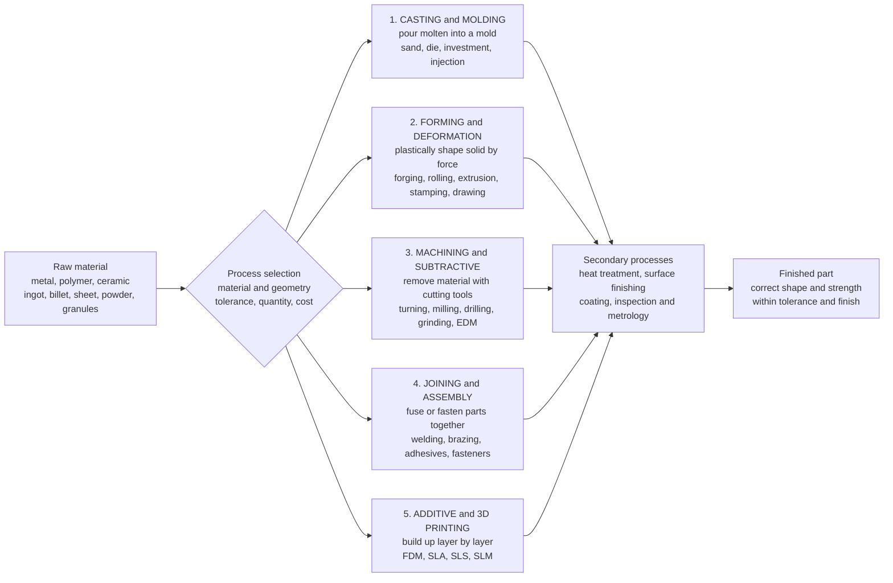

# 🏭 Manufacturing Processes: How Designed Parts Are Physically Made

> [!abstract] TL;DR
> **Manufacturing processes** are the shaping technologies that turn raw material into finished parts — the step where a design on a screen becomes an object you can hold. Nearly every physical part is made by one (or a combination) of **five fundamental process families**: **casting/molding** (pour molten material into a mold), **forming/deformation** (plastically squeeze solid material into shape by force), **machining/subtractive** (cut material away with tools), **joining/assembly** (fuse or fasten parts together), and **additive/3D printing** (build the part up layer by layer). Choosing among them is the central manufacturing decision — a joint choice of **material, geometry/complexity, tolerance and surface finish, production quantity, and cost/lead-time**, tied together by the **material–process–geometry triangle** and by **Design for Manufacturing (DFM)**, which shapes the part to suit the process. Because high-tooling processes (casting, molding) amortize their die cost over volume, there is always a **break-even quantity** below which low-tooling machining or printing wins — and the process you pick sets a product's cost, quality, strength, precision, and time to market. Manufacturing is where engineering becomes reality, and it is being remade by automation, additive, and digital manufacturing (Industry 4.0).

## Intuition

**Analogy:** A brilliant design is worthless until you can actually *make* it — and however clever the CAD model, there are only a handful of fundamentally different ways to give a lump of material its final shape. You can **pour it in liquid and let it freeze into a mold** (casting). You can **squeeze the solid until it flows into form** the way a blacksmith hammers glowing steel (forming). You can **carve away everything that is not the part**, the way a sculptor removes stone (machining). You can **fuse separate pieces together** like welding two rails into one (joining). Or you can **build it up in thin layers**, the way a 3D printer or a bricklayer adds material a slice at a time (additive). Every physical object you own — the phone in your hand, the fork in your drawer, the engine in your car — was given its shape by one of these five moves or a sequence of them.

The engineering skill is not just knowing the five moves; it is **choosing the right one** for a given part. A single bracket might be *machined* if you need ten of them, *cast* if you need ten thousand, and *3D-printed* if you need exactly one tomorrow. The choice depends on the **material**, the **shape's complexity**, the **precision and finish** required, the **quantity**, and the **cost** — and it feeds back into the design itself (you draft the walls of a casting so it releases from the mold; you avoid deep narrow pockets that a machining tool cannot reach). Picking the process is genuinely half of turning an idea into a product.

---

## How It Works

### Core Mechanics

Manufacturing processes convert a **starting form** of material (an ingot, a billet, a sheet, a rod, a powder, or plastic granules) into a **finished geometry** by one of five physical mechanisms. The families differ in *what they do to the material*, and each carries a signature bundle of strengths and limits:

1. **Casting / molding — add shape by pouring a liquid.** Melt the material, pour or inject it into a cavity shaped like the part, and let it **solidify**. *Sand casting* (cheap, huge parts, rough finish), *die casting* (fast, precise, high-volume metal), *investment / lost-wax casting* (intricate, excellent finish), and *injection molding* (the same idea for polymers). Molten flow fills almost any complex shape in one shot, which is why casting dominates high-volume complex geometry — but it fights **porosity, shrinkage, and residual stress** as the metal freezes (see [[Nucleation_Growth_and_Solidification]]).
2. **Forming / deformation — change shape by force, keeping the mass.** Apply enough stress to make the *solid* material yield and flow plastically into a new shape without melting or removing anything. *Forging* aligns the grain flow to give the highest strength; *rolling* makes sheet, plate, and beams; *extrusion* pushes material through a die to make constant cross-sections (rails, tubes, aluminum profiles); *stamping/pressing* and deep *drawing* form sheet metal (car body panels, cans); *bending* is the simplest case. Forming is fast and strong at volume; the underlying physics is **dislocation motion and slip** (see [[Plastic_Deformation_and_Slip_Systems]]).
3. **Machining / subtractive — reach shape by removing material.** Start with a solid blank and **cut away** the excess with a hardened tool: *turning* on a lathe (rotational parts), *milling* (prismatic parts and pockets), *drilling* (holes), *grinding* (fine finish), and *EDM* (electro-discharge, for hard metals and tricky cavities). Machining delivers the **highest precision and best surface finish** of any family and is astonishingly versatile — but it is **material-wasteful** (the removed metal becomes chips) and comparatively **slow**, which is why it is now dominated by computer-controlled **CNC**.
4. **Joining / assembly — combine parts into one.** Most products are not a single part. *Welding* fuses metal by local melting; *brazing* and *soldering* join with a lower-melting filler; *adhesive bonding* glues; and *mechanical fastening* (bolts, rivets, snap-fits) holds pieces together removably or permanently. Joining lets you assemble large or multi-material structures the other families cannot make in one piece, and it interacts with **machine elements** (fasteners, welds) and their fatigue.
5. **Additive / 3D printing — grow the shape layer by layer.** Instead of pouring, squeezing, or cutting, **deposit or fuse material one thin slice at a time** directly from the CAD file: *FDM* (extruded plastic), *SLA* (cured resin), *SLS* (sintered polymer powder), and *SLM/DMLS* (laser-melted metal powder). It gives near-total **freedom of complexity** (internal channels, lattices, one-off shapes) with **zero part-specific tooling**, which makes it unbeatable for prototypes and low volume — but it is slow per part and expensive at scale.

**Process selection** is the decision that binds them. You choose a process against five drivers — the **material** (can it be cast? forged? machined?), the **geometry and complexity**, the required **tolerance and surface finish**, the production **quantity**, and the **cost and lead-time**. Because casting and molding pay a large upfront **tooling** cost (a die can cost tens of thousands) but a tiny per-part cost, while machining and printing pay little tooling but a high per-part cost, there is always a **break-even quantity** where the cheapest choice flips. Material, process, and geometry are chosen *together* — the **material–process–geometry triangle** — and the design is then reshaped for the process by **Design for Manufacturing (DFM)** (draft angles for casting, generous fillets, avoiding deep pockets for machining, minimizing part count for assembly). **Secondary processes** finish the job: **heat treatment** to set final properties (see [[Heat_Treatment_and_Microstructure]]), **surface finishing/coating**, and **inspection/metrology** to verify the part meets its tolerances. The modern goal is often **near-net-shape** — cast or form the part so close to final that little machining remains.

### Flow / Architecture



---

## Key Concepts

### Secondary Level

- **There are only about five ways to shape material.** Pour it liquid (casting), squeeze it solid (forming), cut it away (machining), stick pieces together (joining), or build it up in layers (3D printing). Almost every object is made by one of these or a combination.
- **The best way depends on how many you need.** A one-off part is cheap to 3D-print or machine; a million identical parts are cheap to cast or mold, because the expensive mold cost is spread over huge numbers.
- **Cutting wastes material; molding does not.** Machining throws away the metal it removes as chips; casting and forming use nearly all the material — this matters for cost and sustainability.
- **Precision has a price.** A rough, cheap part comes off a sand casting; a mirror-smooth precise part needs grinding or fine machining, which costs more and takes longer.

### Undergraduate Level

- **The five families and their signatures.** *Casting* — complex shapes, cheap at volume, but porosity and modest finish. *Forming* — strong (grain flow), fast, but needs big presses and dies. *Machining* — best tolerance and finish, versatile, but wasteful and slow. *Joining* — assembles what cannot be made in one piece. *Additive* — free complexity, no tooling, but slow and costly at scale.
- **Process economics and break-even.** Model total cost as $C(Q) = C_0 + c\,Q$, where $C_0$ is fixed **tooling/setup** and $c$ is the **per-part** cost. Per-part cost $C(Q)/Q = C_0/Q + c$. Two processes cross at the break-even quantity $Q^\ast = (C_{0,B} - C_{0,A}) / (c_A - c_B)$ — below it the low-tooling process wins, above it the high-tooling process wins.
- **Tolerance and surface finish.** Every process has a *capability envelope*: an achievable tolerance band and a typical surface roughness $R_a$. Sand casting is coarse ($R_a \sim 12\ \mu m$); turning and milling are fine ($R_a \sim 1\ \mu m$); grinding and lapping are finest ($R_a < 0.2\ \mu m$). You cannot specify tighter than the process can hold without a secondary operation.
- **The material–process–geometry triangle.** Material, process, and shape are chosen *together*: a thin-walled complex aluminum part suggests die casting; a high-strength shaft suggests forging plus machining; a bracket you need next week suggests printing. Changing one corner constrains the other two.
- **Design for Manufacturing (DFM).** Shape the part to suit the process: **draft angles** so a casting releases from the mold, **uniform wall thickness** to avoid shrinkage voids, **generous fillets** to avoid stress risers, and avoiding deep narrow pockets a milling tool cannot reach. DFM cuts cost and defects before the first part is made.
- **Secondary and finishing operations.** **Heat treatment** sets final hardness/strength; **surface finishing** (grinding, polishing, coating, anodizing) sets finish and corrosion resistance; **metrology** (CMMs, gauges, tied to GD&T) verifies conformance.

### Graduate Level

- **Solidification and casting defects.** Casting quality is governed by heat flow and **nucleation/growth** during freezing: solidification shrinkage, macro/micro-porosity, dendritic segregation, hot tearing, and residual stress. Gating and riser design, chill placement, and directional solidification control where the last-to-freeze (weak) regions land — quantified against the alloy's **phase diagram**.
- **Metal forming mechanics.** Forming is bulk plasticity: flow stress $\sigma = K\varepsilon^n$ (strain hardening), strain-rate and temperature sensitivity (hot vs cold working), formability limits (forming-limit diagrams for sheet), springback, anisotropy, and forging load estimation via slab or upper-bound methods. Grain-flow orientation from forging is why forged parts out-fatigue cast equivalents.
- **Cutting mechanics and machinability.** Chip formation (Merchant's model, shear plane, cutting forces), tool wear and Taylor's tool-life equation $VT^n = C$, surface integrity, built-up edge, and thermal effects at the tool tip. CNC turns geometry into toolpaths (G-code); high-speed and multi-axis machining trade cost against near-net-shape reduction.
- **Joining metallurgy.** Weld thermal cycles create a fusion zone and a **heat-affected zone (HAZ)** whose altered microstructure (grain growth, embrittlement, residual stress, hydrogen cracking) often governs joint fatigue life — a fracture-mechanics problem at the weld toe.
- **Additive process physics and qualification.** Layerwise thermal history drives anisotropy, residual stress and warping, porosity, and rough as-built surfaces; the hard problem is **process qualification** — proving printed parts are repeatable enough for flight- and safety-critical use, plus topology-optimized designs that only additive can make.
- **Integrated process/cost modeling.** Real selection couples **process capability, DFM, tolerance stack-up, tooling amortization, cycle time, yield, and lead-time** into a total-cost-of-ownership model — increasingly automated in digital-manufacturing / Industry 4.0 toolchains with in-process sensing and closed-loop control.

---

## Python Demo

```python
# Manufacturing process selection is, at its core, an ECONOMICS problem.
# This figure captures the two questions that decide which process wins:
#
#   LEFT  panel -> "HOW MANY?"   per-part COST vs production QUANTITY.
#                  Every process = a FIXED tooling/setup cost + a per-part cost:
#                      per_part_cost(Q) = tooling / Q + variable_cost
#                  High-tooling processes (die casting) only pay off at HIGH
#                  volume; low-tooling processes (3D printing, CNC) win at LOW
#                  volume. The crossings are the BREAK-EVEN quantities where the
#                  cheapest process flips -- the heart of process selection.
#
#   RIGHT panel -> "HOW FINE?"   the CAPABILITY of each process: typical
#                  achievable surface roughness Ra. Casting and printing are
#                  coarse; grinding and turning are fine. Selection always
#                  trades cost against the finish a process can actually hold.
#
# Requires: numpy, matplotlib
import numpy as np
import matplotlib.pyplot as plt

# =====================================================================
# (a) COST vs QUANTITY  ->  the break-even that drives process choice
#     total cost(Q) = C0 (tooling/setup)  +  c (per-part) * Q
#     per-part cost  = C0 / Q  +  c
# =====================================================================
processes = {
    #  name                     tooling C0 [$]   per-part c [$]   colour
    "3D Printing (additive)": (    100.0,          30.0,   "#2ca02c"),
    "CNC Machining":          (   2000.0,          20.0,   "#1f77b4"),
    "Die Casting":            (  30000.0,           3.0,   "#d62728"),
}

Q = np.logspace(0, 4.3, 400)   # 1 .. ~20000 parts

def per_part_cost(C0, c, Q):
    return C0 / Q + c

# Break-even quantity where two per-part-cost curves cross:
#   C0a/Q + ca = C0b/Q + cb  ->  Q* = (C0b - C0a) / (ca - cb)
def breakeven(pa, pb):
    C0a, ca, _ = pa
    C0b, cb, _ = pb
    return (C0b - C0a) / (ca - cb)

add, cnc, die = processes.values()
Q_add_cnc = breakeven(add, cnc)   # additive -> machining crossover
Q_cnc_die = breakeven(cnc, die)   # machining -> die casting crossover

print("=== (a) Cost-vs-quantity break-even points ===")
print(f"  3D printing is cheapest below   Q = {Q_add_cnc:8.0f} parts")
print(f"  CNC machining is cheapest       {Q_add_cnc:8.0f} .. {Q_cnc_die:.0f} parts")
print(f"  Die casting is cheapest above   Q = {Q_cnc_die:8.0f} parts")

# =====================================================================
# (b) PROCESS CAPABILITY  ->  typical achievable surface roughness Ra
#     Lower Ra = finer finish. Log scale spans ~2 orders of magnitude.
# =====================================================================
cap = {
    "Sand Casting": 12.5,
    "3D Printing":   8.0,
    "Forging":       6.3,
    "Die Casting":   1.6,
    "Milling":       1.6,
    "Turning":       0.8,
    "Grinding":      0.2,
}
names = list(cap.keys())
Ra    = np.array(list(cap.values()))

print("\n=== (b) Typical achievable surface roughness Ra [micrometre] ===")
for n, r in cap.items():
    print(f"  {n:14s}: {r:5.1f}")

# ------------------------------ plotting ------------------------------
fig, (axL, axR) = plt.subplots(1, 2, figsize=(14, 6))
fig.suptitle("Manufacturing Process Selection: How Many? and How Fine?",
             fontsize=15, fontweight="bold")

# LEFT: per-part cost vs quantity, with break-even markers
for name, (C0, c, col) in processes.items():
    axL.plot(Q, per_part_cost(C0, c, Q), color=col, lw=2.4,
             label=f"{name}  (tool ${C0:,.0f}, ${c:.0f}/part)")

for Qb, lab in [(Q_add_cnc, "additive -> CNC"),
                (Q_cnc_die, "CNC -> die casting")]:
    axL.axvline(Qb, color="gray", ls="--", lw=1)
    axL.annotate(f"break-even\n{lab}\nQ = {Qb:,.0f}", xy=(Qb, 55),
                 xytext=(Qb, 110), fontsize=8, ha="center",
                 arrowprops=dict(arrowstyle="->", color="gray"))

# shade the "winning" quantity region for each process
axL.axvspan(1, Q_add_cnc, color="#2ca02c", alpha=0.06)
axL.axvspan(Q_add_cnc, Q_cnc_die, color="#1f77b4", alpha=0.06)
axL.axvspan(Q_cnc_die, Q[-1], color="#d62728", alpha=0.06)

axL.set_xscale("log")
axL.set_yscale("log")
axL.set_xlabel("production quantity  Q  [parts]")
axL.set_ylabel("cost per part  [$]")
axL.set_title("(a) COST vs QUANTITY  ->  \"How many?\"", fontsize=11)
axL.set_ylim(2, 200)
axL.legend(loc="upper right", fontsize=8)
axL.grid(alpha=0.3, which="both")

# RIGHT: surface finish capability bar chart (log scale, lower = finer)
colors = plt.cm.viridis(np.linspace(0.15, 0.9, len(names)))
bars = axR.bar(names, Ra, color=colors, edgecolor="k", lw=0.6)
axR.set_yscale("log")
axR.set_ylabel("typical surface roughness  Ra  [micrometre]   (lower = finer)")
axR.set_title("(b) PROCESS CAPABILITY  ->  \"How fine?\"", fontsize=11)
axR.axhline(1.0, color="gray", ls=":", lw=1)
axR.text(-0.4, 1.06, "1 micrometre reference", fontsize=7, color="gray")
for b, r in zip(bars, Ra):
    axR.text(b.get_x() + b.get_width() / 2, r * 1.08, f"{r:g}",
             ha="center", va="bottom", fontsize=8)
axR.tick_params(axis="x", labelrotation=35)
for lbl in axR.get_xticklabels():
    lbl.set_ha("right")
axR.grid(axis="y", alpha=0.3, which="both")

plt.tight_layout(rect=[0, 0, 1, 0.94])
plt.show()
```

Running this prints the crossover quantities and draws the two panels that together define process selection. The **left panel** plots per-part cost versus production quantity for three competing processes and finds where the cheapest choice flips: with these numbers, **3D printing wins below ~190 parts** (near-zero tooling), **CNC machining wins from ~190 to ~1,650 parts** (moderate tooling, moderate per-part cost), and **die casting wins above ~1,650 parts** (its \$30,000 die is finally amortized away by the tiny \$3 per-part cost). Those crossings are the **break-even quantities** — the single most important idea in choosing a process. The **right panel** compares the *capability* side: typical achievable surface roughness $R_a$ across processes on a log scale, showing why a rough sand casting or 3D print often needs a secondary machining or grinding step to reach a fine finish. Cost and capability, plotted side by side, are exactly the two axes an engineer weighs.

---

## Real-World Applications

> **Example:** An **automotive engine block** is a manufacturing anthology in one part. The block itself is **cast** (aluminum die casting or gray-iron sand casting) because only pouring molten metal can fill its labyrinth of coolant jackets and cylinder bores in a single shot at millions-per-year volume. The **crankshaft** is **forged**, not cast, because forging's aligned grain flow gives the fatigue strength a shaft spinning at 6,000 rpm demands. The cylinder bores, deck face, and bearing journals are then precision-**machined** and honed to micrometre tolerances a casting cannot hold. Pistons are cast or forged and machined; head bolts are cold-**formed** and rolled; the assembly is **joined** with fasteners and gaskets; and the whole block is **heat-treated** and inspected on a coordinate-measuring machine. Five process families, chosen part-by-part on material, geometry, load, and volume.

- **Aerospace structural parts.** High-value titanium and nickel-alloy parts are forged or investment-cast **near-net-shape** to save expensive machining, while complex brackets and fuel nozzles are increasingly **metal 3D-printed** to cut weight and part count — GE's additively-manufactured LEAP fuel nozzle consolidated 20 parts into one.
- **Consumer electronics and plastics.** Phone housings, bottle caps, and toys are **injection-molded** by the billion because the molten-polymer-into-a-steel-die process has an unbeatable per-part cost once the tooling is paid off — the textbook high-volume, high-tooling case.
- **Sheet-metal products.** Car body panels, appliance shells, and beverage cans are **stamped and deep-drawn** from coil steel or aluminum at enormous speed, a pure forming operation.
- **Prototyping and low-volume / custom parts.** Startups, medical implants, and jigs use **CNC machining and 3D printing** precisely because they carry almost no tooling cost, making them cheapest at the low-quantity end of the break-even curve.
- **Construction and heavy industry.** Structural beams, rails, and pipes are hot-**rolled and extruded**; large steel structures and pressure vessels are **welded** — forming and joining at architectural scale.

---

## Common Pitfalls

- **Picking a process without the quantity.** The single most common error: choosing a process on shape alone and ignoring **volume**. Die casting is "cheaper" than machining only above the break-even quantity; below it, the \$30,000 die dwarfs the whole job. Always ask *how many* before *how* — process economics is a per-part-cost-versus-quantity curve, not a single price. The five families map to different regions of that curve: **additive/machining** at low volume, **forming/casting** at high volume.
- **Designing the part, then throwing it over the wall to manufacturing.** Skipping **DFM** produces parts that are technically valid but expensive or impossible to make — a casting with no **draft angle** that will not release from its mold, wildly non-uniform wall thickness that shrinks into voids, a milled pocket too deep and narrow for any tool, or an assembly with three times the necessary part count. Involve the process while designing, not after.
- **Specifying tolerance and finish tighter than the process can hold.** Every process has a **capability envelope**. Calling out a $\pm 0.01\ mm$ tolerance or a mirror finish on an as-cast surface silently forces a secondary grinding or machining step (and its cost) that the drawing never budgeted. Match the spec to what the chosen process — casting, forming, machining, additive — can actually achieve, and only tighten where the function truly requires it (tie to GD&T and metrology).
- **Forgetting that casting and welding leave defects and residual stress.** Castings carry **porosity, shrinkage, and segregation** from solidification; welds carry a weakened **heat-affected zone** and residual stress. A part that passed a static check can still fail in **fatigue** from a subsurface casting pore or a weld-toe crack (see [[Failure_Fatigue_and_Fracture]]). Choose the process — and its inspection — with the failure mode in mind.
- **Treating additive manufacturing as a drop-in replacement.** 3D printing's freedom of complexity is real, but so are its penalties: **anisotropy** (weaker between layers), **rough as-built surfaces**, **residual stress and warping**, slow throughput, and a hard **qualification** problem for safety-critical parts. It shines for prototypes, one-offs, and topology-optimized geometry — not for cheap mass production, where casting and molding still win decisively.

---

## Related Concepts

**Mechanical Engineering vault**
- [[Mechanical_Engineering_Overview]] — the hub note; manufacturing is sub-discipline 5, "how do we build it?", turning analysis and design into a physical artifact
- [[Failure_Fatigue_and_Fracture]] — casting porosity and weld heat-affected zones become the crack sites that drive fatigue and fracture in service
- [[Gears_and_Power_Transmission]] — machine elements like gears are forged/cast blanks finished by precision machining and grinding, then heat-treated

**Materials Science vault (the physics beneath each process)**
- [[Plastic_Deformation_and_Slip_Systems]] — dislocation motion and slip are the atomic mechanism that makes forging, rolling, extrusion, and stamping possible
- [[Nucleation_Growth_and_Solidification]] — how molten metal freezes governs casting quality: shrinkage, porosity, dendrites, and grain structure
- [[Heat_Treatment_and_Microstructure]] — the key secondary process that sets a formed or cast part's final hardness, strength, and toughness
- [[Phase_Diagrams_and_the_Iron_Carbon_System]] — the map of alloy phases that dictates castability, forgeability, and heat-treatment response
- [[Stress_Strain_and_Elastic_Moduli]] — the elastic/plastic constitutive behavior underlying both forming loads and springback
- [[Defects_and_Dislocations_in_Crystals]] — the crystal defects that both *enable* plastic forming and *cause* casting and weld defects
- [[Nanofabrication_and_Self_Assembly]] — the analog of "manufacturing processes" at the nanoscale, for MEMS and microelectronics

---

## Review Questions

**Secondary**
1. Name the five fundamental ways to give a material its final shape, and match each to a one-line description (pour liquid, squeeze solid, cut away, stick together, build up in layers). For a plastic water-bottle cap that you need a million of, which family would you use and why? For a single custom bracket you need tomorrow, which one instead?

**Undergraduate**
2. A part can be made either by CNC machining (tooling \$2,000, \$20 per part) or by die casting (tooling \$30,000, \$3 per part). Derive the **break-even quantity** at which their per-part costs are equal, and state which process is cheaper below and above it. Then explain, using the **material–process–geometry triangle** and one **DFM** rule, why the *shape* of the part might override this pure cost comparison.

**Graduate**
3. You must produce a fatigue-critical aerospace bracket. Compare making it by (a) investment casting, (b) forging plus machining, and (c) metal 3D printing, addressing for each: the likely **defect population** and its effect on fatigue life, the achievable **tolerance/finish** and any required secondary operations, the **tooling cost versus quantity** trade-off, and the **qualification** burden. Which would you choose for a run of 50 flight parts, and how would inspection/metrology (tie to GD&T) support that choice?

---

## Sources

- S. Kalpakjian & S. R. Schmid — *Manufacturing Engineering and Technology*, 8th ed. (Pearson, 2019)
- M. P. Groover — *Fundamentals of Modern Manufacturing: Materials, Processes, and Systems*, 7th ed. (Wiley, 2019)
- J. T. Black & R. A. Kohser — *DeGarmo's Materials and Processes in Manufacturing*, 12th ed. (Wiley, 2017)
- G. Boothroyd, P. Dewhurst & W. Knight — *Product Design for Manufacture and Assembly*, 3rd ed. (CRC Press, 2011)
- ASM Handbook, Vol. 15 (Casting), Vol. 14A (Metalworking: Bulk Forming), Vol. 16 (Machining) — ASM International

---

#mechanical-engineering #manufacturing #casting #machining #forming
