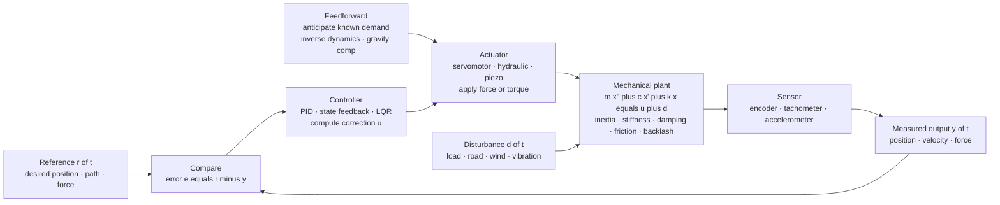

# 🎛️ Control of Mechanical Systems: Motion, Stabilization, and Vibration Rejection

> [!abstract] TL;DR
> A mechanical system left alone obeys only its own **dynamics** — a pendulum swings, a vehicle drifts, an arm sags under gravity, a structure vibrates. **Control** overrides that natural behavior to achieve an engineering objective: **hold a position**, **track a trajectory**, **reject a disturbance**, or **damp a vibration**. It does this by *measuring* the machine's state and *continuously applying corrective force or torque* through an actuator. Unlike abstract control theory, mechanical control must respect the real **plant**: inertia $m$, stiffness $k$, damping $c$, and the nonlinearities that plague machines — dry **friction** (stick-slip), **backlash** (gear play), and structural **flexibility/resonances**. The core loop is **feedback** (PID, state feedback, LQR) often augmented by **feedforward**; the great insight of mechatronics is **co-design** — a light, stiff, low-friction, well-sensored plant is far easier to control than a clever controller can rescue. Control is the layer that turns mechanical hardware into precise, purposeful machines: robots, CNC, active suspensions, flight control, and hard-disk head positioning all live here.

## Intuition

**Analogy:** A ball at the top of a hill will roll wherever gravity and the slope send it — that is *physics deciding for you*. Now imagine you could watch the ball a thousand times a second and give it a tiny nudge each time to keep it balanced exactly on the peak. That relentless *measure-and-nudge* is **control**. It is the difference between a machine that merely **obeys physics** and one that **obeys you**.

Every mechanical system has a personality dictated by its dynamics — a lightly damped arm rings when you move it, a heavy table is sluggish, a car under braking wants to slew. Control is how we *rewrite* that personality: make the wobbly system steady, the slow one fast, and the passive one purposeful. By sensing what the machine is actually doing and comparing it to what we *want*, then pushing back through a motor, hydraulic, or piezo actuator, control makes a pendulum stand upright, a cutting tool trace a part to microns, and a suspension stay flat over a pothole. It is the intelligence layer bolted onto mechanical hardware.

---

## How It Works

### Core Mechanics

Control of a mechanical system is a closed loop wrapped around the **plant** (the machine and its physics). Five moving parts:

1. **Model the plant.** Start from the **equations of motion** — Newton–Euler or Lagrange — for a positioning axis this is the mass-spring-damper $m\ddot{x} + c\dot{x} + kx = u + d$, where $u$ is the actuator force and $d$ an external disturbance. Take the Laplace transform (zero initial conditions) to get the **transfer function** $G(s) = X(s)/U(s) = 1/(ms^2 + cs + k)$, or write **state space** $\dot{\mathbf{x}} = \mathbf{A}\mathbf{x} + \mathbf{B}u,\ y = \mathbf{C}\mathbf{x}$. The plant's own poles set its natural frequency $\omega_n = \sqrt{k/m}$ and damping $\zeta = c/(2\sqrt{mk})$ — the behavior we intend to reshape.

2. **Measure the state.** A **sensor** — encoder (position), tachometer (velocity), accelerometer, load cell (force), or gyro — reports the actual output $y(t)$. Real sensors are noisy and band-limited, and some states (e.g., velocity from a position encoder) must be estimated or differentiated.

3. **Compute a correction.** The **controller** forms the **error** $e = r - y$ (reference minus measurement) and computes a command. The workhorse is **PID**: $u = K_p e + K_i\!\int e\,dt + K_d \dot{e}$ — proportional adds *virtual stiffness* (pull toward target), derivative adds *virtual damping* (kill overshoot/ringing), integral removes *steady-state error* and rejects constant disturbances (gravity, friction, load). More advanced: **state feedback** $u = -\mathbf{K}\mathbf{x}$ with poles placed by design, or **LQR** minimizing $\int (\mathbf{x}^\top\mathbf{Q}\mathbf{x} + Ru^2)\,dt$.

4. **Add feedforward (optional).** For *known* demands, feedback alone lags. **Feedforward** computes the force the plant *should* need — inverse dynamics, gravity compensation, acceleration $\times$ inertia — and applies it directly, so feedback only mops up the residual error. This is why fast robots and CNC use feedforward + feedback together.

5. **Actuate and repeat.** The **actuator** (servomotor, hydraulic ram, voice coil, piezo) converts the command to force/torque and applies it to the plant, moving it toward the reference and pushing back against $d$. The loop runs continuously — in practice **digitally**, at a fixed sample rate — so the machine's dynamics are reshaped from moment to moment. The reshaped closed loop is faster, better damped, and disturbance-rejecting compared to the open-loop plant.

The nested reality of **motion control**: real servo systems stack loops — an inner **current/torque** loop (fastest), a **velocity** loop around it, and an outer **position** loop — each tuned to its own bandwidth, because you can only close a position loop as fast as the velocity loop underneath can respond.

### Flow / Architecture



---

## Key Concepts

### Secondary Level

- **A machine on its own does what physics says.** Let go of a robot arm and it sags; release a spinning top and it wanders. Control is how we make the machine do what *we* want instead — hold still, move to a spot, follow a line.
- **Feedback = look, compare, correct.** Steering a car is feedback: you watch where you are, compare it to where the lane is, and turn the wheel to fix the difference — thousands of tiny corrections a minute. Machines do the same with sensors and motors.
- **Faster, steadier, tougher.** Good control makes a slow machine quick, a wobbly machine steady, and lets it shrug off a shove (a gust, a bump, a load) that would knock an uncontrolled machine off course.
- **It is everywhere.** Cruise control holding your speed uphill, a drone hovering in wind, a 3D printer tracing a shape, an elevator stopping level with the floor — all are control of mechanical systems.

### Undergraduate Level

- **Plant → model → controller.** The mechanical **plant** is described by its equation of motion; convert to a **transfer function** $G(s) = 1/(ms^2 + cs + k)$ or **state space**. The plant's poles (its $\omega_n$, $\zeta$) are exactly what you intend to move.
- **Open loop vs closed loop.** Open loop applies a pre-computed command and hopes; it cannot correct for error or disturbance. **Closed loop** feeds the measured output back, so it self-corrects — the whole reason control works on uncertain, disturbed machines.
- **PID, term by term.** $K_p$ = virtual **stiffness** (bigger pull, faster but can overshoot); $K_d$ = virtual **damping** (suppresses ringing, but amplifies sensor noise); $K_i$ = **integral** action that drives *steady-state error to zero* and cancels constant disturbances like gravity or Coulomb friction (at the cost of possible **windup**).
- **Performance specs.** A well-tuned second-order closed loop is judged by **rise time**, **percent overshoot**, and **settling time**, all set by the *closed-loop* $\omega_n$ and $\zeta$ — i.e., by where you place the closed-loop poles. Control literally relocates the plant's poles.
- **Feedforward vs feedback.** Feedback reacts to error (always a step behind); **feedforward** anticipates a known demand (gravity, commanded acceleration $\times$ inertia) and applies it directly. Fast, precise motion control uses both.
- **Motion-control loop hierarchy.** Servo drives close **current (torque) → velocity → position** loops from inside out; the inner loop must be several times faster than the loop enclosing it.
- **Disturbance rejection & regulation.** Holding $x = 0$ against a shove (regulation) is a distinct job from *tracking* a moving reference; integral action and loop gain govern how well disturbances are rejected.
- **Real-world limits.** Sensor **noise**, actuator **saturation** (finite max force) and **bandwidth**, and **digital sampling** (the loop runs at discrete time steps) all bound what any controller can do.

### Graduate Level

- **State-space and modern control.** $\dot{\mathbf{x}} = \mathbf{A}\mathbf{x} + \mathbf{B}u$; full-state feedback $u = -\mathbf{K}\mathbf{x}$ places all closed-loop poles arbitrarily *if the plant is **controllable***. **LQR** picks $\mathbf{K}$ optimally by minimizing $\int(\mathbf{x}^\top\mathbf{Q}\mathbf{x} + Ru^2)\,dt$, trading tracking against control effort — directly relevant to actuator sizing. Unmeasured states are reconstructed by an **observer / Kalman filter**.
- **Nonlinear plant realities.** Machines are not linear: **Coulomb + Stribeck friction** causes **stick-slip** and limit cycles near zero velocity; **backlash** (gear/joint play) injects a dead zone and can trigger chatter; large-angle dynamics (an inverted pendulum, a manipulator) are genuinely nonlinear. Tools: **feedback linearization**, **Lyapunov**-based design, **sliding-mode** control, and friction feedforward/observers.
- **Flexibility, resonances, and spillover.** A "rigid" plant is a lie above its first structural mode. Lightly damped resonances put phase and gain into the loop that can *destabilize* it if the bandwidth crowds them. **Collocated** sensing/actuation (same point) keeps modes benignly phased; **non-collocated** sensing risks **spillover** — the controller exciting the very mode it cannot see. Rule: never push loop gain into a lightly damped mode; notch it or stay below it.
- **Active vs passive, formally.** A passive damper/isolator (spring + dashpot) can only reshape $|H(\omega)|$ within energy-dissipation limits; **active** control (skyhook damping, active suspension, active vibration isolation) injects energy through an actuator to place damping *where physics would not* — at the cost of power, sensors, and a stability burden.
- **Robustness.** Gain/phase margins (classical) and $H_\infty$/$\mu$-synthesis (modern) certify stability despite unmodeled dynamics, parameter drift, and plant variation — essential because the mechanical model is always approximate.
- **Constraints and prediction.** **Model Predictive Control** explicitly honors actuator saturation, position limits, and jerk limits by optimizing over a horizon — increasingly used in high-end motion and vehicle control.
- **Co-design (mechatronics).** The achievable bandwidth is capped by the first structural resonance and by actuator/sensor dynamics — no controller beats a floppy, high-friction, badly-sensored plant. Stiffness, mass placement, low friction, and sensor/actuator location should be designed *jointly* with the controller.

---

## Python Demo

```python
# Control of a mechanical plant with numpy + matplotlib only (no scipy / control lib).
#
# PLANT: a generic servo positioning axis modeled as a mass-spring-damper
#            m*x'' + c*x' + k*x = u + d
#        u = control force from the actuator, d = external disturbance force.
#        Chosen lightly damped so the OPEN-LOOP plant RINGS -- exactly the
#        natural behavior that control must reshape.
#
#   (a) MOTION CONTROL: PID position control tracking a step reference,
#       vs the uncontrolled (open-loop feedforward) plant -> control makes it
#       FASTER and STEADIER (relocates the closed-loop poles).
#   (b) DISTURBANCE REJECTION: hold x = 0, then hit the plant with a step
#       disturbance force. Open loop settles at a steady OFFSET d/k; the PID's
#       integral action ACTIVELY drives the error back to zero.
#   (c) CONTROL EFFORT with actuator SATURATION -- the real-world limit.
import numpy as np
import matplotlib.pyplot as plt

# ---- mechanical plant parameters ---------------------------------------
m, k, c = 1.0, 20.0, 1.0                      # kg, N/m, N*s/m
wn = np.sqrt(k / m)
zeta = c / (2 * np.sqrt(k * m))
print(f"OPEN-LOOP plant:  wn = {wn:.2f} rad/s, zeta = {zeta:.3f}  (lightly damped -> it RINGS)")

# ---- PID gains (designed for a fast, well-damped closed loop) -----------
Kp, Ki, Kd = 120.0, 80.0, 18.0
U_MAX = 80.0                                   # actuator saturation limit [N]

def simulate(T=3.0, dt=1e-4, control=True,
             ref=lambda t: 1.0, dist=lambda t: 0.0):
    """Semi-implicit (symplectic) Euler -- stable for oscillatory plants."""
    n = int(T / dt)
    t = np.linspace(0, T, n)
    x = np.zeros(n); v = np.zeros(n)
    u_cmd = np.zeros(n); u_app = np.zeros(n)
    integ = 0.0
    for i in range(n - 1):
        r, d = ref(t[i]), dist(t[i])
        e = r - x[i]
        if control:
            integ += e * dt
            uc = Kp * e + Ki * integ - Kd * v[i]   # derivative on measurement (no kick)
        else:
            uc = k * r                              # OPEN LOOP: feedforward hold, NO feedback
        ua = np.clip(uc, -U_MAX, U_MAX)             # actuator SATURATION
        u_cmd[i], u_app[i] = uc, ua
        a = (ua + d - c * v[i] - k * x[i]) / m      # equation of motion
        v[i + 1] = v[i] + a * dt
        x[i + 1] = x[i] + v[i + 1] * dt
    u_cmd[-1], u_app[-1] = u_cmd[-2], u_app[-2]
    return t, x, u_cmd, u_app

# ---- (a) step tracking: controlled vs uncontrolled ---------------------
t, x_cl, uc_cl, ua_cl = simulate(control=True,  ref=lambda t: 1.0)
_, x_ol, _,     _     = simulate(control=False, ref=lambda t: 1.0)

# ---- (b) disturbance rejection: regulate x=0, step disturbance at t=1s --
dstep = lambda t: 15.0 if t >= 1.0 else 0.0
_, xd_cl, _, _ = simulate(control=True,  ref=lambda t: 0.0, dist=dstep)
_, xd_ol, _, _ = simulate(control=False, ref=lambda t: 0.0, dist=dstep)

# ---- plotting ----------------------------------------------------------
fig, ax = plt.subplots(1, 3, figsize=(17, 5))

ax[0].axhline(1.0, color="k", ls=":", lw=1.2, label="reference r = 1")
ax[0].plot(t, x_ol, lw=2, color="tab:red",  label="OPEN LOOP (natural dynamics -- rings, slow)")
ax[0].plot(t, x_cl, lw=2, color="tab:blue", label="PID controlled (fast, damped)")
ax[0].set_title("(a) Motion control: step tracking")
ax[0].set_xlabel("time [s]"); ax[0].set_ylabel("position x [m]")
ax[0].legend(fontsize=8); ax[0].grid(alpha=0.3)

ax[1].axhline(0.0, color="k", ls=":", lw=1.0)
ax[1].axhline(15/20, color="tab:red", ls="--", lw=1, alpha=0.6, label="open-loop offset d/k = 0.75")
ax[1].axvline(1.0, color="gray", ls="--", lw=1, alpha=0.6, label="disturbance applied")
ax[1].plot(t, xd_ol, lw=2, color="tab:red",  label="OPEN LOOP (steady offset)")
ax[1].plot(t, xd_cl, lw=2, color="tab:blue", label="PID (integral rejects -> 0)")
ax[1].set_title("(b) Disturbance rejection: regulate x = 0")
ax[1].set_xlabel("time [s]"); ax[1].set_ylabel("position x [m]")
ax[1].legend(fontsize=8); ax[1].grid(alpha=0.3)

ax[2].axhline( U_MAX, color="k", ls="--", lw=1, label="actuator limit +/- U_MAX")
ax[2].axhline(-U_MAX, color="k", ls="--", lw=1)
ax[2].plot(t, uc_cl, lw=1.5, color="tab:orange", label="commanded force (unsaturated)")
ax[2].plot(t, ua_cl, lw=2,   color="tab:green",  label="applied force (saturated)")
ax[2].set_title("(c) Control effort -- actuator SATURATION")
ax[2].set_xlabel("time [s]"); ax[2].set_ylabel("force u [N]")
ax[2].set_ylim(-100, 140); ax[2].legend(fontsize=8); ax[2].grid(alpha=0.3)

plt.tight_layout(); plt.show()

# ---- numeric takeaways -------------------------------------------------
print(f"open-loop step: peak overshoot to x = {x_ol.max():.2f} m, still ringing at t=3s = {x_ol[-1]:.3f}")
print(f"PID step:       settles to x = {x_cl[-1]:.3f} m (crisp, near-critically damped)")
print(f"disturbance:    open-loop residual error = {xd_ol[-1]:+.3f} m  vs  PID = {xd_cl[-1]:+.3f} m")
print(f"peak commanded force = {uc_cl.max():.1f} N  clipped to {U_MAX:.0f} N -> saturation early in the transient")
```

Running this prints the open-loop plant's $\omega_n \approx 4.47$ rad/s and $\zeta \approx 0.11$ (barely damped — it *rings*) and draws three panels that *are* the subject. **Panel (a)** is motion control: the uncontrolled plant (red) overshoots and oscillates for seconds before settling, while the PID loop (blue) reaches the target quickly with tight damping — control has relocated the closed-loop poles to a faster, better-damped location. **Panel (b)** is disturbance rejection: the same disturbance shoves both systems, but the open-loop plant parks at a permanent offset $d/k = 0.75$ m while the PID's **integral** action actively drives the error back to zero — control reshaping the response. **Panel (c)** exposes the real-world catch: the controller *commands* a large force at the start (orange) that the actuator physically cannot deliver, so it **saturates** at $\pm U_{max}$ (green) — the mechanical constraint that limits how aggressive any controller can be.

---

## Real-World Applications

> **Example — CNC and industrial robot motion control.** A CNC machine or a 6-axis robot must trace a toolpath to microns while carrying variable cutting loads. Each axis is a servomotor + ballscrew/gearbox driving an inertial load — a mechanical plant with real stiffness, backlash, and friction. The drive closes **nested current → velocity → position loops** (PID or state feedback), and adds **feedforward** (commanded velocity/acceleration $\times$ inertia, plus friction and gravity compensation) so the tool leads rather than lags the path. The controller is carefully kept *below* the ballscrew's first resonance so it never excites structural chatter.

- **Automotive chassis control.** **Active suspension** and semi-active dampers sense wheel/body motion and command actuator force to keep the body flat over bumps (active vibration control of a mass-spring-damper), while ESC/traction and adaptive cruise regulate yaw and speed against road disturbances.
- **Aerospace flight & attitude control.** Fly-by-wire loops stabilize aircraft (some deliberately unstable for agility), and reaction wheels / thrusters hold spacecraft attitude — stabilizing plants whose open-loop dynamics are marginal or divergent.
- **Hard-disk drive head positioning.** A voice-coil (and piezo micro-actuator) servo positions the read/write head over tracks nanometers wide at high bandwidth, rejecting shock and windage — a classic dual-stage, resonance-limited motion-control problem.
- **Precision instruments & active vibration isolation.** Electron microscopes, lithography stages, telescopes, and gravitational-wave optics sit on **active isolation** tables that sense floor vibration and counter it with actuators, achieving isolation a passive spring alone cannot.
- **Building & bridge control.** Active/hybrid mass dampers in tall towers sense sway and drive a moving mass to cancel wind- and earthquake-induced vibration — control of a very large, very flexible mechanical plant.

---

## Common Pitfalls

- **Forgetting that the *plant* has real dynamics.** Abstract control assumes a clean model; real mechanical plants carry **inertia, stiffness, damping, friction, and backlash**. A controller tuned on an idealized $1/ms^2$ model will misbehave once dry friction, gear lash, and structural compliance appear. Model the plant from its equations of motion *first*, then design the controller.
- **Exciting an unmodeled resonance.** The single most dangerous mistake in mechanical control: pushing loop bandwidth up into a lightly damped structural mode. The controller *feeds energy* into the resonance and the machine screams or goes unstable. Stay below the first mode, **notch** it, or place sensor/actuator collocated — never assume "rigid."
- **Ignoring actuator saturation and bandwidth.** Every motor, ram, and voice coil has a maximum force/torque and a finite response speed. A high-gain design that commands impossible force simply **saturates**, degrading response and — with integral action — causing **windup** (the integrator winds up while the actuator is pinned, then overshoots badly). Use realistic actuator limits and **anti-windup**.
- **Nonlinear friction and backlash.** Coulomb/Stribeck friction causes **stick-slip** and limit cycles at low speed; backlash creates a dead zone and chatter on reversal. Linear PID alone fights these poorly — add friction feedforward/observers, and design the mechanism to minimize lash.
- **Treating digital control as continuous.** The loop runs at a *sample rate*; the resulting delay eats phase margin and can destabilize a design that looked fine on paper. Choose a sample rate several times the closed-loop bandwidth and account for the hold delay.
- **Confusing the plant with the controller.** The **plant** is the physics you are given (mass, spring, damper, actuator, sensor); the **controller** is the algorithm you design. Blaming the controller for a floppy, high-friction, badly-sensored plant is the road to endless tuning. This is the **co-design** lesson of mechatronics: a light, stiff, low-friction, well-instrumented plant is *fundamentally* easier to control — fix the machine, not just the gains (ties directly to *Mechatronics_and_Automation*).
- **Sensor noise amplified by derivative action.** The $K_d$ term differentiates the measurement; on a noisy encoder it injects violent, high-frequency command noise. Filter the derivative or estimate velocity with an observer rather than raw differencing.
- **Using active control where passive is enough.** Active vibration control and active suspension add sensors, actuators, power, and a *stability liability*. A well-placed passive damper/isolator is often cheaper, more robust, and fail-safe — reserve active control for where passive physically cannot reach the required performance.

*(Sibling notes in this section and vault — Mechatronics_and_Automation, Mechanical_Vibrations, Particle_and_Rigid_Body_Dynamics, and Motor_Drives_and_Control — supply, respectively, the co-design context, the vibration model being controlled, the equations of motion feeding the plant model, and the actuator that closes the loop.)*

---

## Related Concepts

**Classical control (the loop itself)**
- [[Feedback_Control_Fundamentals]] — the measure–compare–correct loop, sensitivity, and why closing the loop lets a machine self-correct against error and disturbance
- [[PID_Control]] — the workhorse controller: proportional stiffness, derivative damping, integral offset-removal — exactly the terms the demo tunes on the mass-spring-damper
- [[Transfer_Functions]] — the Laplace-domain $G(s) = 1/(ms^2 + cs + k)$ whose pole locations *are* the plant's $\omega_n$ and $\zeta$ that control relocates

**Modern & optimal control (state-space plant)**
- [[State_Space_Models_in_Control]] — writing the equations of motion as $\dot{\mathbf{x}} = \mathbf{A}\mathbf{x} + \mathbf{B}u$; the basis for full-state feedback and observers on multi-DOF machines
- [[LQR_Optimal_Control]] — optimal state feedback trading tracking against control effort, i.e., against actuator force — the principled way to size gains and actuators
- [[Nonlinear_Control_and_Lyapunov_Stability]] — tools for the friction, backlash, and large-angle nonlinearities that linear PID handles poorly
- [[Model_Predictive_Control]] — control that explicitly honors actuator saturation and motion limits, the constraints that dominate real mechanical systems

**Cross-domain framing**
- [[Feedback_and_Control_Systems]] — the electrical-engineering companion view of the same feedback loop, from the drive/electronics side of the actuator

---

## Review Questions

**Secondary**
1. A robot arm turned off just sags under gravity to wherever it hangs. Using the "watch-and-nudge" idea, explain in plain words how a controller makes the arm instead *hold* a commanded position, and how it recovers if you push on it. Why is this "feedback"?

**Undergraduate**
2. A positioning axis is modeled as $m\ddot{x} + c\dot{x} + kx = u + d$ with $m = 2$ kg, $k = 50$ N/m, $c = 4$ N·s/m. (a) Find the open-loop $\omega_n$ and $\zeta$ — is the uncontrolled plant fast or slow, ringing or sluggish? (b) You add PID position control. Explain physically what each of $K_p$, $K_i$, $K_d$ does to the *closed-loop* response, and which term guarantees the axis reaches the target exactly despite a constant gravity load $d$. (c) After tuning, the axis buzzes at a high frequency you did not command — name two likely causes tied to the plant and the sensor, and how you would fix each.

**Graduate**
3. You must design high-bandwidth motion control for a lightweight robot link that has a lightly damped structural resonance at 40 Hz, driven through a geared motor with measurable backlash, sensed by a motor-side encoder (not at the link tip). (a) Explain why pushing the position-loop bandwidth toward 40 Hz risks instability, and what *spillover* and *collocation* have to do with your sensor placement. (b) Propose a control architecture (feedforward + feedback, notch/observer, anti-windup) and justify each element against a specific plant nonlinearity or limit. (c) Argue the *co-design* case: what changes to the **mechanical** design (stiffness, mass, gear lash, sensor location) would raise the achievable bandwidth more effectively than any controller retuning, and why?

---

## Sources

- K. Ogata — *Modern Control Engineering*, 5th ed. (Pearson, 2010)
- G. F. Franklin, J. D. Powell & A. Emami-Naeini — *Feedback Control of Dynamic Systems*, 8th ed. (Pearson, 2019)
- N. S. Nise — *Control Systems Engineering*, 8th ed. (Wiley, 2019)
- K. J. Åström & R. M. Murray — *Feedback Systems: An Introduction for Scientists and Engineers*, 2nd ed. (Princeton Univ. Press, 2021)
- W. Bolton — *Mechatronics: Electronic Control Systems in Mechanical and Electrical Engineering*, 7th ed. (Pearson, 2018)

---

#mechanical-engineering #control-systems #motion-control #feedback #servo
